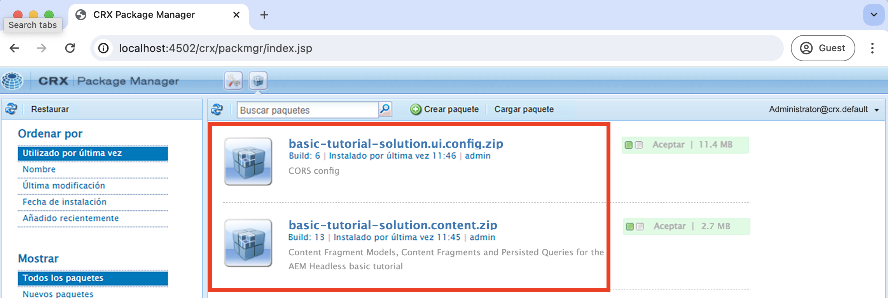
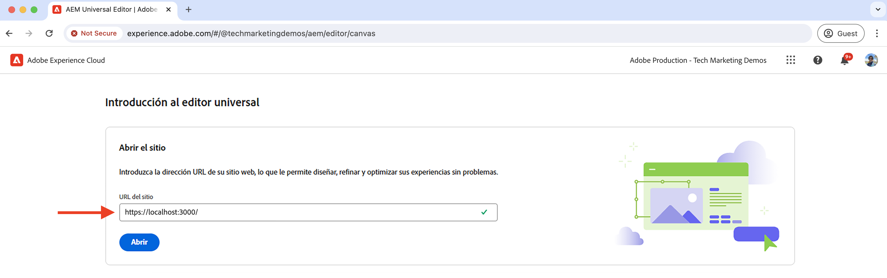
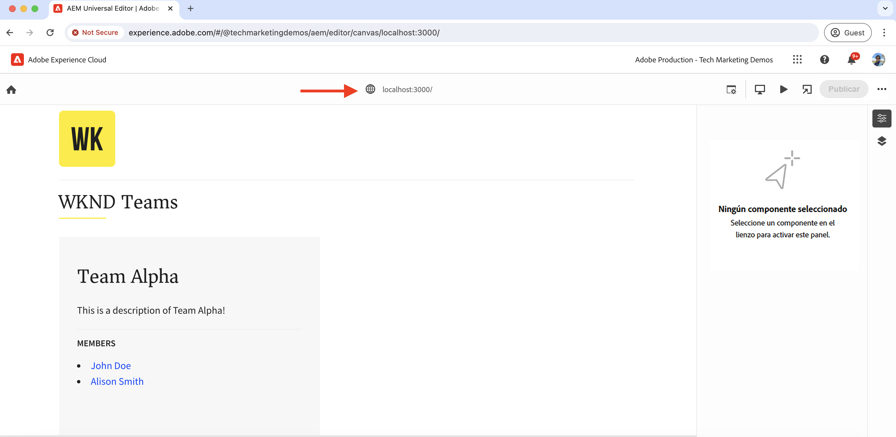

# Configuración de desarrollo local

AEM Obtenga información sobre cómo configurar un entorno de desarrollo local para editar el contenido de una aplicación de React mediante el Editor universal de aplicaciones (UIDs) de la aplicación de.

## Requisitos previos

Se requiere lo siguiente para seguir este tutorial:

- Aptitudes básicas de HTML y JavaScript.
- Las siguientes herramientas deben instalarse localmente:
   - [Node.js](https://nodejs.org/es/download/)
   - [Git](https://git-scm.com/downloads)
   - Un IDE o editor de código, como [Código de Visual Studio](https://code.visualstudio.com/)
- Descargue e instale lo siguiente:
   - [AEM SDK as a Cloud Service de](https://experienceleague.adobe.com/en/docs/experience-manager-learn/cloud-service/local-development-environment-set-up/aem-runtime#download-the-aem-as-a-cloud-service-sdk)AEM : contiene el Jar de inicio rápido que se utiliza para ejecutar el Autor de la publicación y la publicación de manera local con fines de desarrollo.
   - [Servicio de editor universal](https://experienceleague.adobe.com/en/docs/experience-cloud/software-distribution/home): copia local del servicio de editor universal que tiene un subconjunto de funciones y se puede descargar desde el portal de distribución de software.
   - [local-ssl-proxy](https://www.npmjs.com/package/local-ssl-proxy#local-ssl-proxy): un proxy HTTP SSL local simple que utiliza un certificado firmado automáticamente para el desarrollo local. AEM El editor universal requiere la URL HTTPS de la aplicación React para cargarla en el editor.

## Configuración local

Siga los pasos a continuación para configurar el entorno de desarrollo local:

### AEM SDK de

AEM Para proporcionar el contenido para la aplicación WKND Teams React, instale los siguientes paquetes en el SDK de la aplicación local de la aplicación de la aplicación de la red (WKND Teams React).

- [WKND Teams: paquete de contenido](./assets/basic-tutorial-solution.content.zip): contiene los modelos de fragmentos de contenido, los fragmentos de contenido y las consultas de GraphQL persistentes.
- [WKND Teams: Paquete de configuración](./assets/basic-tutorial-solution.ui.config.zip): Contiene las configuraciones de Intercambio de recursos de origen cruzado (CORS) y Controlador de autenticación de token. AEM AEM El CORS facilita las propiedades no web para realizar llamadas del lado del cliente basadas en el explorador a las API de GraphQL AEM de la y el controlador de autenticación de token se utiliza para autenticar cada solicitud a los.

  

### Aplicación React

Para configurar la aplicación WKND Teams React, siga los pasos a continuación:

1. Clonar el [Aplicación WKND Teams React](https://github.com/adobe/aem-guides-wknd-graphql/tree/solution/basic-tutorial) desde el `basic-tutorial` rama de solución.

   ```bash
   $ git clone -b solution/basic-tutorial git@github.com:adobe/aem-guides-wknd-graphql.git
   ```

1. Vaya a `basic-tutorial` y ábralo en su editor de código.

   ```bash
   $ cd aem-guides-wknd-graphql/basic-tutorial
   $ code .
   ```

1. Instale las dependencias e inicie la aplicación React.

   ```bash
   $ npm install
   $ npm start
   ```

1. Abra la aplicación WKND Teams React en su explorador en [http://localhost:3000](http://localhost:3000). Muestra una lista de los integrantes del equipo y sus detalles. AEM El SDK de la aplicación React proporciona el contenido de la aplicación local de la aplicación mediante el uso de API de GraphQL (`/graphql/execute.json/my-project/all-teams`), que puede verificar mediante la pestaña de red del explorador.

   

### Servicio de editor universal

Para configurar el **local** Servicio de editor universal, siga los pasos a continuación:

1. Descargue la última versión del servicio de editor universal desde el [Portal de distribución de software](https://experience.adobe.com/downloads).

   

1. Extraiga el archivo zip descargado y copie el `universal-editor-service.cjs` a un nuevo directorio llamado `universal-editor-service`.

   ```bash
   $ unzip universal-editor-service-vproduction-<version>.zip
   $ mkdir universal-editor-service
   $ cp universal-editor-service.cjs universal-editor-service
   ```

1. Crear `.env` archivo en el `universal-editor-service` y agregue las siguientes variables de entorno:

   ```bash
   # The port on which the Universal Editor service runs
   EXPRESS_PORT=8000
   # Disable SSL verification
   NODE_TLS_REJECT_UNAUTHORIZED=0
   ```

1. Inicie el servicio local de Universal Editor.

   ```bash
   $ cd universal-editor-service
   $ node universal-editor-service.cjs
   ```

El comando anterior inicia el servicio Editor universal en el puerto `8000` y debería ver el siguiente resultado:

```bash
Either no private key or certificate was set. Starting as HTTP server
Universal Editor Service listening on port 8000 as HTTP Server
```

### Proxy HTTP SSL local

AEM El Editor universal requiere que la aplicación React se proporcione a través de HTTPS. Vamos a configurar un proxy HTTP SSL local que utilice un certificado firmado automáticamente para el desarrollo local.

AEM Siga los pasos a continuación para configurar el proxy HTTP SSL local y servir el SDK de la y el servicio de editor universal a través de HTTPS:

1. Instale el `local-ssl-proxy` paquete globalmente.

   ```bash
   $ npm install -g local-ssl-proxy
   ```

1. Inicie dos instancias del proxy HTTP SSL local para los siguientes servicios:

   - AEM Proxy HTTP SSL local de SDK en el puerto `8443`.
   - Proxy HTTP SSL local del servicio Editor universal en el puerto `8001`.

   ```bash
   # AEM SDK local SSL HTTP proxy on port 8443
   $ local-ssl-proxy --source 8443 --target 4502
   
   # Universal Editor service local SSL HTTP proxy on port 8001
   $ local-ssl-proxy --source 8001 --target 8000
   ```

### Actualizar la aplicación React para que utilice HTTPS

Para habilitar HTTPS para la aplicación WKND Teams React, siga los pasos a continuación:

1. Detenga el React presionando `Ctrl + C` en la terminal.
1. Actualice el `package.json` archivo para incluir el `HTTPS=true` variable de entorno en `start` script.

   ```json
   "scripts": {
       "start": "HTTPS=true react-scripts start",
       ...
   }
   ```

1. Actualice el `REACT_APP_HOST_URI` en el `.env.development` AEM para utilizar el protocolo HTTPS y el puerto proxy HTTP SSL local del SDK de la.

   ```bash
   REACT_APP_HOST_URI=https://localhost:8443
   ...
   ```

1. Actualice el `../src/proxy/setupProxy.auth.basic.js` para utilizar una configuración SSL relajada con `secure: false` opción.

   ```javascript
   ...
   module.exports = function(app) {
   app.use(
       ['/content', '/graphql'],
       createProxyMiddleware({
       target: REACT_APP_HOST_URI,
       changeOrigin: true,
       secure: false, // Ignore SSL certificate errors
       // pass in credentials when developing against an Author environment
       auth: `${REACT_APP_BASIC_AUTH_USER}:${REACT_APP_BASIC_AUTH_PASS}`
       })
   );
   };
   ```

1. Inicie la aplicación React.

   ```bash
   $ npm start
   ```

## Verificar la configuración

Después de configurar el entorno de desarrollo local siguiendo los pasos anteriores, vamos a verificar la configuración.

### Verificación local

Asegúrese de que los siguientes servicios se ejecutan localmente en HTTPS; es posible que tenga que aceptar la advertencia de seguridad en el explorador para el certificado autofirmado:

1. Aplicación WKND Teams React en [https://localhost:3000](https://localhost:3000)
1. AEM SDK en [https://localhost:8443](https://localhost:8443)
1. Servicio de editor universal en [https://localhost:8001](https://localhost:8001)

### Carga de la aplicación WKND Teams React en el editor universal

Carguemos la aplicación WKND Teams React en el editor universal para verificar la configuración:

1. Abra Universal Editor https://experience.adobe.com/#/aem/editor en su explorador. Si se le solicita, inicie sesión con su Adobe ID.

1. Introduzca la URL de la aplicación WKND Teams React en el campo de entrada URL del sitio del editor universal y haga clic en `Open`.

   

1. La aplicación WKND Teams React se carga en el editor universal **pero aún no puede editar el contenido**. Debe instrumentar la aplicación React para habilitar la edición de contenido con el editor universal.

   


## Siguiente paso

Obtenga información sobre cómo [instrumente la aplicación React para editar el contenido](./instrument-to-edit-content.md).
