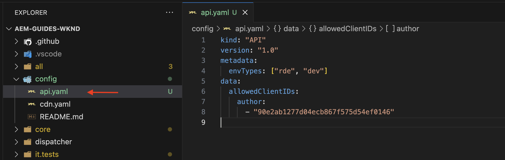
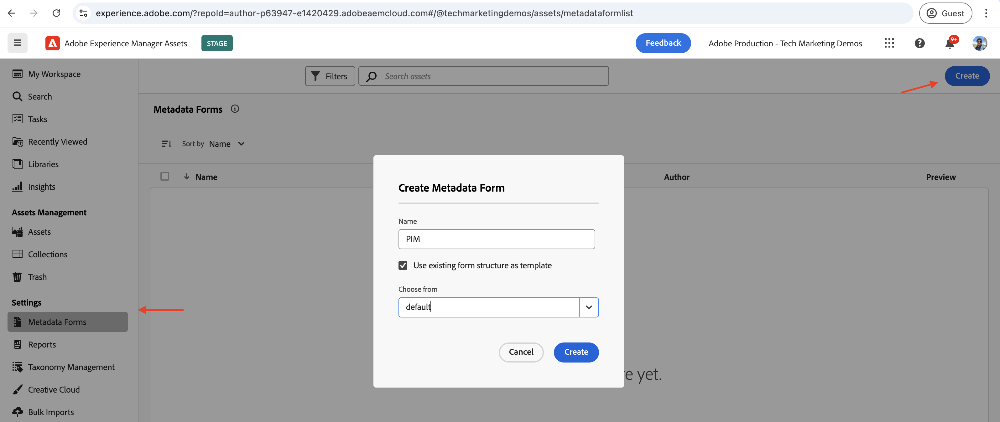

# Eventos de AEM Assets para la integración con PIM

>[!IMPORTANT]
>
>Este tutorial utiliza las API de AEM basadas en OpenAPI. Están disponibles como parte de un programa de acceso anticipado. Si está interesado en acceder a ellos, le recomendamos que envíe un correo electrónico a [aem-apis@adobe.com](mailto:aem-apis@adobe.com) con una descripción de su caso de uso.

Obtenga información sobre cómo recibir un evento de AEM y actuar en él para actualizar el estado del contenido en AEM mediante la API de autor de Assets basada en OpenAPI.

La forma de procesar el evento recibido depende de los requisitos empresariales. Por ejemplo, los datos de evento pueden utilizarse para actualizar el sistema de terceros, AEM o ambos.

En este ejemplo se muestra cómo se puede integrar un sistema de terceros, como un sistema de administración de la información del producto (PIM), con AEM as a Cloud Service Assets. Al recibir un evento de AEM Assets, se procesa para recuperar metadatos adicionales del sistema PIM y actualizar los metadatos de recursos en AEM. Los metadatos de recursos actualizados pueden incluir información adicional como el SKU, el nombre del proveedor u otros detalles del producto.

Para recibir y procesar el evento de AEM Assets, se usa la plataforma sin servidor [Adobe I/O Runtime](https://developer.adobe.com/runtime/docs/guides/overview/what_is_runtime/). Sin embargo, también se pueden utilizar otros sistemas de procesamiento de eventos como Webhook en el sistema de terceros o Amazon EventBridge.

El flujo de alto nivel de la integración es el siguiente:


1. El servicio de creación de AEM déclencheur un evento _Procesamiento de recursos completado_ cuando se completa la carga de un recurso y también se completan todas las actividades de procesamiento de recursos. Esperar a que se complete el procesamiento de recursos garantiza que se haya completado cualquier procesamiento predeterminado, como la extracción de metadatos.
1. El evento se enviará al servicio [Adobe I/O Events](https://developer.adobe.com/events/).
1. El servicio Adobe I/O Events pasa el evento a [Adobe I/O Runtime Action](https://developer.adobe.com/runtime/docs/guides/using/creating_actions/) para su procesamiento.
1. La acción de Adobe I/O Runtime llama a la API del sistema PIM para recuperar metadatos adicionales, como el SKU, la información del proveedor u otros detalles.
1. Los metadatos adicionales recuperados del PIM se actualizan en los AEM Assets mediante la [API de autor de Assets](https://developer.adobe.com/experience-cloud/experience-manager-apis/api/experimental/assets/author/) basada en OpenAPI.

## Requisitos previos

Para completar este tutorial, necesita lo siguiente:

- Entorno AEM as a Cloud Service con [evento de AEM habilitado](https://developer.adobe.com/experience-cloud/experience-manager-apis/guides/events/#enable-aem-events-on-your-aem-cloud-service-environment). Además, el proyecto de muestra [WKND Sites](https://github.com/adobe/aem-guides-wknd?#aem-wknd-sites-project) debe implementarse en él.

- Acceso a [Adobe Developer Console](https://developer.adobe.com/developer-console/docs/guides/getting-started).

- [CLI de Adobe Developer](https://developer.adobe.com/runtime/docs/guides/tools/cli_install/) instalado en el equipo local.

## Pasos de desarrollo

Los pasos de desarrollo de alto nivel son los siguientes:

1. [Modernización del entorno de AEM as a Cloud Service](https://experienceleague.adobe.com/en/docs/experience-manager-learn/cloud-service/aem-apis/invoke-openapi-based-aem-apis#modernization-of-aem-as-a-cloud-service-environment)
1. [Habilitar el acceso a las API de AEM](https://experienceleague.adobe.com/en/docs/experience-manager-learn/cloud-service/aem-apis/invoke-openapi-based-aem-apis#enable-aem-apis-access)
1. [Creación de un proyecto en Adobe Developer Console (ADC)](./runtime-action.md#Create-project-in-Adobe-Developer-Console)
1. [Inicializar el proyecto para el desarrollo local](./runtime-action.md#initialize-project-for-local-development)
1. Configurar el proyecto en ADC
1. Configure el servicio de AEM Author para habilitar la comunicación del proyecto de ADC
1. Desarrollar una acción de tiempo de ejecución para orquestar
   1. recuperación de metadatos del sistema PIM
   1. actualización de metadatos en AEM Assets mediante la API de autor de Assets
1. Crear y aplicar esquema de metadatos de recursos
1. Verificación de la carga de recursos y actualización de metadatos

Para obtener más información sobre los pasos 1-2, consulte la guía [Invocar API de AEM basadas en OpenAPI](https://experienceleague.adobe.com/es/docs/experience-manager-learn/cloud-service/aem-apis/invoke-openapi-based-aem-apis) y para los pasos 3-4, consulte el ejemplo [Eventos de acción y de AEM de Adobe I/O Runtime](./runtime-action.md#). Para ver los pasos 5-9, consulte las secciones siguientes.

### Configuración del proyecto en Adobe Developer Console (ADC)

Para recibir Eventos de AEM Assets y ejecutar la acción de Adobe I/O Runtime creada en el paso anterior, configure el proyecto en ADC.

- En ADC, vaya al [proyecto](https://developer.adobe.com/console/projects) que creó en el paso 3. En ese proyecto, seleccione el área de trabajo `Stage` donde se implementa la acción de tiempo de ejecución al ejecutar `aio app deploy` como parte de las instrucciones del paso 4.

- Haga clic en el botón **Agregar servicio** y seleccione la opción **Evento**. En el diálogo **Agregar eventos**, seleccione **Experience Cloud** > **AEM Assets** y haga clic en **Siguiente**.
  

- En el paso **Configurar el registro de eventos**, seleccione la instancia de AEMCS que desee, el evento _Procesamiento de recursos completado_ y el tipo de autenticación de servidor a servidor de OAuth.

  

- Finalmente, en el paso **Cómo recibir eventos**, expanda la opción **Acción en tiempo de ejecución** y seleccione la acción _genérica_ creada en el paso anterior. Haga clic en **Guardar eventos configurados**.

  

- Del mismo modo, haga clic en el botón **Agregar servicio** y seleccione la opción **API**. En el modal **Add an API**, seleccione **Experience Cloud** > **API de autor de AEM Assets** y haga clic en **Siguiente**.

  

- A continuación, seleccione **Servidor a servidor OAuth** para el tipo de autenticación y haga clic en **Siguiente**.

- A continuación, seleccione el **Perfil de producto** correcto que está asociado al entorno de AEM Assets desde el cual se produce el evento y tenga acceso suficiente para actualizar los recursos allí. Finalmente, haga clic en el botón **Guardar API configurada**.

  

  En mi caso, el perfil de producto _Administradores de AEM - autor - Programa XXX - Entorno AAAA_ está seleccionado, tiene habilitado el servicio **Usuarios de API de AEM Assets**.

  

## Configuración de la instancia de AEM para habilitar la comunicación del proyecto ADC

Para habilitar el ID de cliente de la credencial de servidor a servidor OAuth del proyecto ADC para comunicarse con la instancia de AEM, debe configurar la instancia de AEM.

Se realiza definiendo la configuración en el archivo `api.yaml` en el proyecto de AEM. A continuación, implemente el archivo `api.yaml` mediante la canalización de configuración en Cloud Manager.

- En AEM Project, busque o cree el archivo `api.yaml` en la carpeta `config`.

  

- Agregue la siguiente configuración al archivo `api.yaml`.

  ```yaml
  kind: "API"
  version: "1.0"
  metadata: 
      envTypes: ["dev", "stage", "prod"]
  data:
      allowedClientIDs:
          author:
          - "<ADC Project's OAuth Server-to-Server credential ClientID>"
  ```

  Reemplace `<ADC Project's OAuth Server-to-Server credential ClientID>` por el ClientID real de la credencial de servidor a servidor OAuth del proyecto ADC.

  >[!CAUTION]
  >
  > Para fines de demostración, se utiliza el mismo ClientID para todos los entornos. Se recomienda utilizar ClientID independiente por entorno (dev, stage, prod) para mejorar la seguridad y el control.


- Confirme los cambios de configuración en el repositorio de Git e inserte los cambios en el repositorio remoto.

- Implemente los cambios anteriores mediante la canalización de configuración en Cloud Manager. Tenga en cuenta que el archivo `api.yaml` también se puede instalar en un RDE mediante herramientas de la línea de comandos.

  

### Desarrollar acción de tiempo de ejecución

Para recuperar y actualizar los metadatos, comience actualizando el código de acción _generic_ creado automáticamente en la carpeta `src/dx-excshell-1/actions/generic`.

Consulte el archivo adjunto [WKND-Assets-PIM-Integration.zip](../assets/examples/assets-pim-integration/WKND-Assets-PIM-Integration.zip) para obtener el código completo; la sección siguiente resalta los archivos clave.

- El archivo `src/dx-excshell-1/actions/generic/mockPIMCommunicator.js` se burla de la llamada API de PIM para recuperar metadatos adicionales, como el SKU y el nombre del proveedor. Este archivo se utiliza con fines de demostración. Una vez que tenga el flujo de extremo a extremo en funcionamiento, reemplace esta función con una llamada a su sistema PIM real para recuperar metadatos del recurso.

  ```javascript
  /**
   * Mock PIM API to get the product data such as SKU, Supplier, etc.
   *
   * In a real-world scenario, this function would call the PIM API to get the product data.
   * For this example, we are returning mock data.
   *
   * @param {string} assetId - The assetId to get the product data.
   */
  module.exports = {
      async getPIMData(assetId) {
          if (!assetId) {
          throw new Error('Invalid assetId');
          }
          // Mock response data for demo purposes
          const data = {
          SKUID: 'MockSKU 123',
          SupplierName: 'mock-supplier',
          // ... other product data
          };
          return data;
      },
  };
  ```

- El archivo `src/dx-excshell-1/actions/generic/aemCommunicator.js` actualiza los metadatos de recursos en AEM mediante la [API de autor de Assets](https://developer.adobe.com/experience-cloud/experience-manager-apis/api/experimental/assets/author/).

  ```javascript
  const fetch = require('node-fetch');
  ...
  /**
  *  Get IMS Access Token using Client Credentials Flow
  *
  * @param {*} clientId - IMS Client ID from ADC project's OAuth Server-to-Server Integration
  * @param {*} clientSecret - IMS Client Secret from ADC project's OAuth Server-to-Server Integration
  * @param {*} scopes - IMS Meta Scopes from ADC project's OAuth Server-to-Server Integration as comma separated strings
  * @returns {string} - Returns the IMS Access Token
  */
  async function getIMSAccessToken(clientId, clientSecret, scopes) {
    const adobeIMSV3TokenEndpointURL = 'https://ims-na1.adobelogin.com/ims/token/v3';
    const options = {
      method: 'POST',
      headers: {
        'Content-Type': 'application/x-www-form-urlencoded',
      },
      body: `grant_type=client_credentials&client_id=${clientId}&client_secret=${clientSecret}&scope=${scopes}`,
    };
    const response = await fetch(adobeIMSV3TokenEndpointURL, options);
    const responseJSON = await response.json();
    return responseJSON.access_token;
  }    
  async function updateAEMAssetMetadata(metadataDetails, aemAssetEvent, params) {
    ...
    // Transform the metadata details to JSON Patch format,
    // see https://developer.adobe.com/experience-cloud/experience-manager-apis/api/experimental/assets/author/#operation/patchAssetMetadata
    const transformedMetadata = Object.keys(metadataDetails).map((key) => ({
      op: 'add',
      path: `wknd-${key.toLowerCase()}`,
      value: metadataDetails[key],
    }));
    ...
    // Get ADC project's OAuth Server-to-Server Integration credentials
    const clientId = params.ADC_CECREDENTIALS_CLIENTID;
    const clientSecret = params.ADC_CECREDENTIALS_CLIENTSECRET;
    const scopes = params.ADC_CECREDENTIALS_METASCOPES;
    // Get IMS Access Token using Client Credentials Flow
    const access_token = await getIMSAccessToken(clientId, clientSecret, scopes);
    // Call AEM Author service to update the metadata using Assets Author API
    // See https://developer.adobe.com/experience-cloud/experience-manager-apis/api/experimental/assets/author/
    const res = await fetch(`${aemAuthorHost}/adobe/assets/${assetId}/metadata`, {
      method: 'PATCH',
      headers: {
        'Content-Type': 'application/json-patch+json',
        'If-Match': '*',
        'X-Adobe-Accept-Experimental': '1',
        'X-Api-Key': '12345676', // Use the `ClientID` value from the ADC Project's credentials section
        Authorization: `Bearer ${access_token}`,
      },
      body: JSON.stringify(transformedMetadata),
    });
    ...
  }
  module.exports = { updateAEMAssetMetadata };
  ```

  El archivo `.env` almacena los detalles de credenciales de servidor a servidor OAuth del proyecto ADC y se pasan como parámetros a la acción mediante el archivo `ext.config.yaml`. Consulte [Archivos de configuración de App Builder](https://developer.adobe.com/app-builder/docs/guides/configuration/) para administrar secretos y parámetros de acción.
- La carpeta `src/dx-excshell-1/actions/model` contiene `aemAssetEvent.js` y `errors.js` archivos, que la acción utiliza para analizar el evento recibido y controlar los errores respectivamente.
- El archivo `src/dx-excshell-1/actions/generic/index.js` utiliza los módulos mencionados anteriormente para organizar la recuperación y actualización de metadatos.

  ```javascript
  ...
  let responseMsg;
  // handle the challenge probe request, they are sent by I/O to verify the action is valid
  if (params.challenge) {
    logger.info('Challenge probe request detected');
    responseMsg = JSON.stringify({ challenge: params.challenge });
  } else {
    logger.info('AEM Asset Event request received');
    // create AEM Asset Event object from request parameters
    const aemAssetEvent = new AEMAssetEvent(params);
    // Call mock PIM API to get the product data such as SKU, Supplier, etc.
    const mockPIMData = await mockPIMAPI.getPIMData(
      aemAssetEvent.getAssetName(),
    );
    logger.info('Mock PIM API response', mockPIMData);
    // Update PIM received data in AEM as Asset metadata
    const aemUpdateStatus = await updateAEMAssetMetadata(
      mockPIMData,
      aemAssetEvent,
      params,
    );
    logger.info('AEM Asset metadata update status', aemUpdateStatus);
    if (aemUpdateStatus) {
      // create response message
      responseMsg = JSON.stringify({
        message:
          'AEM Asset Event processed successfully, updated the asset metadata with PIM data.',
        assetdata: {
          assetName: aemAssetEvent.getAssetName(),
          assetPath: aemAssetEvent.getAssetPath(),
          assetId: aemAssetEvent.getAssetId(),
          aemHost: aemAssetEvent.getAEMHost(),
          pimdata: mockPIMData,
        },
      });
    } 
    // response object
    const response = {
      statusCode: 200,
      body: responseMsg,
    };
    // Return the response to the caller
    return response;
    ...
  }
  ```

- Implemente la acción actualizada en Adobe I/O Runtime con el siguiente comando:

  ```bash
  $ aio app deploy
  ```

### Crear y aplicar esquema de metadatos de recursos

De forma predeterminada, el proyecto de WKND Sites no tiene el esquema de metadatos de recursos para mostrar los metadatos específicos de PIM como SKU, nombre del proveedor, etc. Vamos a crear y aplicar el esquema de metadatos del recurso a una carpeta de recursos en la instancia de AEM.

1. Inicie sesión en la instancia de AEM as a Cloud Service Asset y esté en la [vista Asset](https://experienceleague.adobe.com/en/docs/experience-manager-learn/assets/authoring/switch-views).

   

1. Vaya a la opción **Configuración** > **Forms de metadatos** desde el carril izquierdo y haga clic en el botón **Crear**. En el cuadro de diálogo **Crear formulario de metadatos**, escriba los siguientes detalles y haga clic en **Crear**.
   - Nombre: `PIM`
   - Usar estructura de formulario existente como plantilla: `Check`
   - Elegir entre: `default`

   

1. Haga clic en el icono **+** para agregar una nueva pestaña **PIM** y agregar componentes de **Texto de una sola línea**.

   

   En la tabla siguiente se muestran las propiedades de los metadatos y sus campos correspondientes.

   | Etiqueta | Marcador de posición | Propiedad de metadatos |
   | --- | --- | --- |
   | SKU | Rellenado automático mediante la integración de eventos de AEM | `wknd-skuid` |
   | Nombre de Proveedor | Rellenado automático mediante la integración de eventos de AEM | `wknd-suppliername` |

1. Haga clic en **Guardar** y **Cerrar** para guardar el formulario de metadatos.

1. Finalmente, aplique el esquema de metadatos **PIM** a la carpeta **PIM**.

   

Con los pasos anteriores, los recursos de la carpeta **Adventures** están listos para mostrar los metadatos específicos de PIM como SKU, nombre de proveedor, etc.

### Verificación de metadatos y carga de recursos

Para comprobar la integración de AEM Assets y PIM, cargue un recurso en la carpeta **Adventures** de AEM Assets. La pestaña PIM de la página de detalles del recurso debe mostrar los metadatos SKU y nombre del proveedor.


## Concepto y elementos clave

La sincronización de metadatos de recursos entre AEM y otros sistemas como PIM suele ser necesaria en la empresa. Al usar AEM Eventing, se pueden lograr estos requisitos.

- El código de recuperación de metadatos de recursos se ejecuta fuera de AEM, lo que evita la carga en el servicio de AEM Author; por lo tanto, se trata de una arquitectura impulsada por eventos que se escala de forma independiente.
- La recién introducida API de autor de Assets se utiliza para actualizar los metadatos de los recursos en AEM.
- La autenticación de la API usa OAuth servidor a servidor (también conocido como flujo de credenciales de cliente). Consulte [Guía de implementación de credenciales de servidor a servidor OAuth](https://developer.adobe.com/developer-console/docs/guides/authentication/ServerToServerAuthentication/implementation).
- En lugar de Acciones de Adobe I/O Runtime, se pueden utilizar otros webhooks o Amazon EventBridge para recibir el evento de los AEM Assets y procesar la actualización de metadatos.
- Los eventos de recursos a través de AEM Event permiten a las empresas automatizar y optimizar procesos críticos, fomentando la eficacia y la coherencia en todo el ecosistema de contenido.
