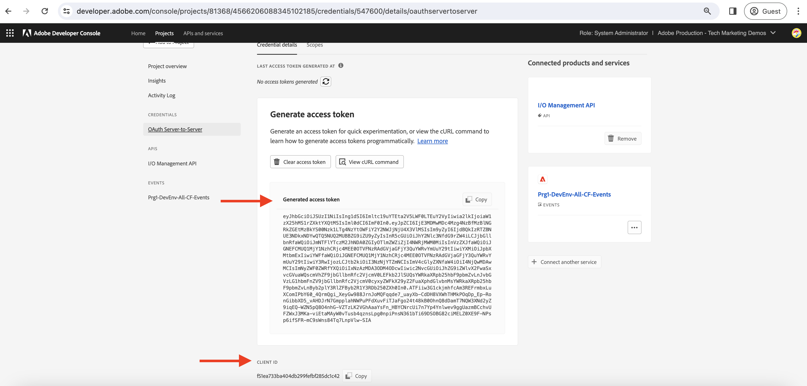

# AEM Eventos de diario y de

AEM Aprenda a recuperar el conjunto inicial de eventos de la publicación de diario y explore los detalles de cada evento.

AEM El registro en diario es un método de extracción para consumir eventos de la y un registro en diario es una lista ordenada de eventos. Mediante la API de diario de eventos de Adobe I/O AEM, puede recuperar los eventos de la publicación de datos del diario y procesarlos en la aplicación. Este método permite administrar eventos en función de una cadencia especificada y procesarlos de forma eficaz de forma masiva. Consulte la [Diario](https://developer.adobe.com/events/docs/guides/journaling_intro/) para obtener información detallada, incluidas consideraciones esenciales como períodos de retención, paginación, etc.

Dentro del proyecto de la consola de Adobe Developer, cada registro de evento se habilita automáticamente para el registro en diario, lo que permite una integración perfecta.

En este ejemplo, utilizando un Adobe proporcionado por _aplicación web alojada_ AEM le permite recuperar el primer lote de eventos de del historial sin necesidad de configurar la aplicación. Esta aplicación web proporcionada por el Adobe está alojada en [Intermitencia](https://glitch.com/), una plataforma conocida por ofrecer un entorno basado en web propicio para la creación e implementación de aplicaciones web. Sin embargo, la opción de usar su propia aplicación también está disponible si se prefiere.

## Requisitos previos

Para completar este tutorial, necesita lo siguiente:

- AEM entorno as a Cloud Service con [AEM Eventing activado de](https://developer.adobe.com/experience-cloud/experience-manager-apis/guides/events/#enable-aem-events-on-your-aem-cloud-service-environment).

- [Proyecto de la consola Adobe Developer AEM configurado para eventos de la](https://developer.adobe.com/experience-cloud/experience-manager-apis/guides/events/#how-to-subscribe-to-aem-events-in-the-adobe-developer-console).

## Acceso a aplicación web

Para acceder a la aplicación web proporcionada por el Adobe, siga estos pasos:

- Compruebe que puede acceder a [Glitch: aplicación web alojada](https://indigo-speckle-antler.glitch.me/) en una nueva pestaña del explorador.

  

## Recopilar detalles del proyecto de la consola Adobe Developer

AEM Para recuperar los eventos de la lista de eventos del historial, credenciales como _ID de organización IMS_, _ID de cliente_, y _Token de acceso_ son obligatorios. Para recopilar estas credenciales, siga estos pasos:

- En el [Consola de Adobe Developer](https://developer.adobe.com), vaya al proyecto y haga clic en para abrirlo.

- En el **Credenciales** , haga clic en **Servidor a servidor OAuth** para abrir el **Detalles de credenciales** pestaña.

- Haga clic en **Generar token de acceso** para generar el token de acceso.

  

- Copie el **Token de acceso generado**, **ID DE CLIENTE**, y **ID DE ORGANIZACIÓN**. Los necesita más adelante en este tutorial.

  

- Todos los registros de eventos se habilitan automáticamente para el diario. Para obtener la _extremo único de API de diario_ AEM Para registrar un evento, haga clic en la tarjeta del evento suscrita a Eventos de la. Desde el **Detalles de registro** pestaña, copie el **EXTREMO DE API ÚNICA DE DIARIO**.

  

## AEM Cargar diario de eventos

AEM Para simplificar las cosas, esta aplicación web alojada solo obtiene el primer lote de eventos de la publicación de diario de la aplicación de eventos de la página de inicio de la aplicación de datos (). Estos son los eventos disponibles más antiguos del historial. Para obtener más información, consulte [primer lote de eventos](https://developer.adobe.com/events/docs/guides/api/journaling_api/#fetching-your-first-batch-of-events-from-the-journal).

- En el [Glitch: aplicación web alojada](https://indigo-speckle-antler.glitch.me/), introduzca la variable **ID de organización IMS**, **ID de cliente**, y **Token de acceso** ha copiado anteriormente del proyecto de la consola de Adobe Developer y ha hecho clic en **Enviar**.

- AEM Una vez finalizado correctamente, el componente de tabla muestra los datos del diario de eventos de la.

  

- Para ver la carga útil del evento completo, haga doble clic en la fila. AEM Puede ver que los detalles del evento de la tienen toda la información necesaria para procesar el evento en el webhook. Por ejemplo, el tipo de evento (`type`), origen de evento (`source`), id de evento (`event_id`), hora del evento (`time`) y datos de evento (`data`).

  

## Recursos adicionales

- [Código fuente del gancho web Glitch](https://glitch.com/edit/#!/indigo-speckle-antler) está disponible como referencia. Es una aplicación React simple que utiliza [Adobe React Spectrum](https://react-spectrum.adobe.com/react-spectrum/index.html) componentes para procesar la interfaz de usuario.

- [API de diario de eventos de Adobe I/O](https://developer.adobe.com/events/docs/guides/api/journaling_api/) proporciona información detallada sobre la API como el primer, el siguiente y el último lote de eventos, la paginación, etc.
