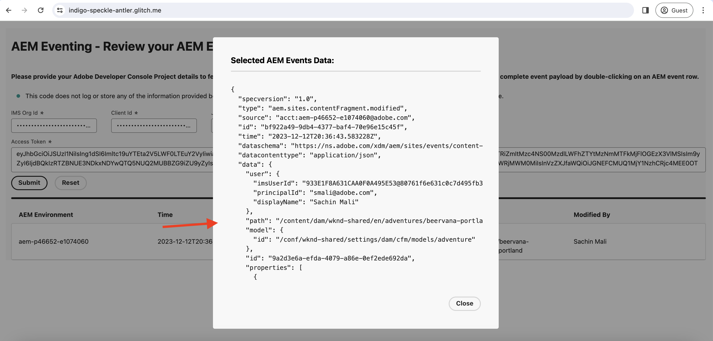

# AEM Eventos de diario y de

AEM Aprenda a recuperar el conjunto inicial de eventos de la publicación de diario y explore los detalles de cada evento.

>[!VIDEO](https://video.tv.adobe.com/v/3427052?quality=12&learn=on)

AEM El registro en diario es un método de extracción para consumir eventos de la y un registro en diario es una lista ordenada de eventos. Mediante la API de diario de eventos de Adobe I/O AEM, puede recuperar los eventos de la publicación de datos del diario y procesarlos en la aplicación. Este método permite administrar eventos en función de una cadencia especificada y procesarlos de forma eficaz de forma masiva. Consulte [Registro](https://developer.adobe.com/events/docs/guides/journaling_intro/) para obtener información detallada, que incluye consideraciones esenciales como períodos de retención, paginación, etc.

Dentro del proyecto Adobe Developer Console, cada registro de evento se activa automáticamente para el registro en diario, lo que permite una integración perfecta.

En este ejemplo, el uso de una _aplicación web hospedada_ proporcionada por el Adobe AEM le permite recuperar el primer lote de eventos del diario sin tener que configurar la aplicación. Esta aplicación web proporcionada por el Adobe está alojada en [Glitch](https://glitch.com/), una plataforma conocida por ofrecer un entorno basado en web propicio para generar e implementar aplicaciones web. Sin embargo, la opción de usar su propia aplicación también está disponible si se prefiere.

## Requisitos previos

Para completar este tutorial, necesita lo siguiente:

- Entorno de AEM as a Cloud Service AEM con [ventilación de eventos habilitada](https://developer.adobe.com/experience-cloud/experience-manager-apis/guides/events/#enable-aem-events-on-your-aem-cloud-service-environment).

- [Proyecto de Adobe Developer Console AEM configurado para eventos de](https://developer.adobe.com/experience-cloud/experience-manager-apis/guides/events/#how-to-subscribe-to-aem-events-in-the-adobe-developer-console).

## Acceso a aplicación web

Para acceder a la aplicación web proporcionada por el Adobe, siga estos pasos:

- Compruebe que puede acceder a [Glitch - aplicación web alojada](https://indigo-speckle-antler.glitch.me/) en una nueva pestaña del explorador.

  

## Recopilar detalles del proyecto de Adobe Developer Console

AEM Para recuperar los eventos de la del diario, se requieren credenciales como _ID de organización de IMS_, _ID de cliente_ y _token de acceso_. Para recopilar estas credenciales, siga estos pasos:

- En [Adobe Developer Console](https://developer.adobe.com), navegue hasta el proyecto y haga clic para abrirlo.

- En la sección **Credenciales**, haga clic en el vínculo **Servidor a servidor de OAuth** para abrir la pestaña **Detalles de credenciales**.

- Haga clic en el botón **Generar token de acceso** para generar el token de acceso.

  

- Copie el **token de acceso generado**, **ID DE CLIENTE** e **ID DE ORGANIZACIÓN**. Los necesita más adelante en este tutorial.

  

- Todos los registros de eventos se habilitan automáticamente para el diario. AEM Para obtener el _extremo único de la API de diario_ de su registro de evento, haga clic en la tarjeta de evento a la que se suscribió a Eventos de. En la ficha **Detalles de registro**, copie el **EXTREMO DE API ÚNICO DE JOURNALING**.

  

## AEM Cargar diario de eventos

AEM Para simplificar las cosas, esta aplicación web alojada solo obtiene el primer lote de eventos de la publicación de diario de la aplicación de eventos de la página de inicio de la aplicación de datos (). Estos son los eventos disponibles más antiguos del historial. Para obtener más información, consulte [primer lote de eventos](https://developer.adobe.com/events/docs/guides/api/journaling_api/#fetching-your-first-batch-of-events-from-the-journal).

- En la aplicación web [Glitch - alojada](https://indigo-speckle-antler.glitch.me/), introduzca la **ID de organización de IMS**, **ID de cliente** y **token de acceso** que copió anteriormente del proyecto de Adobe Developer Console y haga clic en **Enviar**.

- AEM Una vez finalizado correctamente, el componente de tabla muestra los datos del diario de eventos de la.

  AEM 

- Para ver la carga útil del evento completo, haga doble clic en la fila. AEM Puede ver que los detalles del evento de la tienen toda la información necesaria para procesar el evento en el webhook. Por ejemplo, el tipo de evento (`type`), el origen de evento (`source`), el identificador de evento (`event_id`), la hora del evento (`time`) y los datos de evento (`data`).

  AEM 

## Recursos adicionales

- [El código fuente del gancho web Glitch](https://glitch.com/edit/#!/indigo-speckle-antler) está disponible para consulta. Es una aplicación React simple que usa los componentes [Adobe React Spectrum](https://react-spectrum.adobe.com/react-spectrum/index.html) para procesar la interfaz de usuario.

- [La API de diario de eventos de Adobe I/O](https://developer.adobe.com/events/docs/guides/api/journaling_api/) proporciona información detallada sobre la API, como el primer, el siguiente y el último lote de eventos, la paginación, etc.
