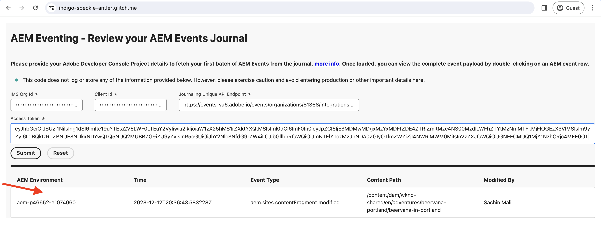

# Eventos de diario y AEM

Obtenga información sobre cómo recuperar el conjunto inicial de eventos de AEM del historial y explorar los detalles de cada evento.

>[!VIDEO](https://video.tv.adobe.com/v/3427052?quality=12&learn=on)

El diario es un método de extracción para consumir eventos de AEM y un diario es una lista ordenada de eventos. Con la API de diario de Adobe I/O Events, puede recuperar los eventos de AEM del diario y procesarlos en su aplicación. Este método permite administrar eventos en función de una cadencia especificada y procesarlos de forma eficaz de forma masiva. Consulte [Registro](https://developer.adobe.com/events/docs/guides/journaling_intro/) para obtener información detallada, que incluye consideraciones esenciales como períodos de retención, paginación, etc.

Dentro del proyecto Adobe Developer Console, cada registro de evento se activa automáticamente para el registro en diario, lo que permite una integración perfecta.

>[!IMPORTANT]
>
>Los extremos de demostración en directo de este tutorial se alojaron anteriormente en [Glitch](https://glitch.com/). Desde julio de 2025, Glitch ha interrumpido su servicio de alojamiento y los puntos de conexión ya no son accesibles.
>&#x200B;>Estamos trabajando activamente en migrar las demostraciones a una plataforma alternativa. El contenido del tutorial sigue siendo preciso y pronto se proporcionarán vínculos actualizados.
>&#x200B;>Gracias por su comprensión y paciencia.

Utilice su propia aplicación hasta que los extremos de demostración en directo vuelvan a estar disponibles.

## Requisitos previos

Para completar este tutorial, necesita lo siguiente:

- Entorno AEM as a Cloud Service con [evento de AEM habilitado](https://developer.adobe.com/experience-cloud/experience-manager-apis/guides/events/#enable-aem-events-on-your-aem-cloud-service-environment).

- [Proyecto Adobe Developer Console configurado para eventos de AEM](https://developer.adobe.com/experience-cloud/experience-manager-apis/guides/events/#how-to-subscribe-to-aem-events-in-the-adobe-developer-console).

## Acceso a aplicación web

Para acceder a la aplicación web proporcionada por Adobe, siga estos pasos:

- Compruebe que puede acceder a [Glitch - aplicación web alojada](https://indigo-speckle-antler.glitch.me/) en una nueva pestaña del explorador.

  

## Recopilar detalles del proyecto de Adobe Developer Console

Para recuperar los eventos de AEM del diario, se requieren credenciales como _ID de organización de IMS_, _ID de cliente_ y _token de acceso_. Para recopilar estas credenciales, siga estos pasos:

- En [Adobe Developer Console](https://developer.adobe.com), navegue hasta el proyecto y haga clic para abrirlo.

- En la sección **Credenciales**, haga clic en el vínculo **Servidor a servidor de OAuth** para abrir la pestaña **Detalles de credenciales**.

- Haga clic en el botón **Generar token de acceso** para generar el token de acceso.

  

- Copie el **token de acceso generado**, **ID DE CLIENTE** e **ID DE ORGANIZACIÓN**. Los necesita más adelante en este tutorial.

  

- Todos los registros de eventos se habilitan automáticamente para el diario. Para obtener el _extremo único de la API de diario_ del registro de eventos, haga clic en la tarjeta de eventos suscrita a los eventos de AEM. En la ficha **Detalles de registro**, copie el **EXTREMO DE API ÚNICO DE JOURNALING**.

  

## Carga del diario de AEM Events

Para simplificar las cosas, esta aplicación web alojada solo obtiene el primer lote de eventos de AEM del historial. Estos son los eventos disponibles más antiguos del historial. Para obtener más información, consulte [primer lote de eventos](https://developer.adobe.com/events/docs/guides/api/journaling_api/#fetching-your-first-batch-of-events-from-the-journal).

- En la aplicación web [Glitch - alojada](https://indigo-speckle-antler.glitch.me/), introduzca la **ID de organización de IMS**, **ID de cliente** y **token de acceso** que copió anteriormente del proyecto de Adobe Developer Console y haga clic en **Enviar**.

- Una vez finalizado correctamente, el componente de tabla muestra los datos del diario de eventos de AEM.

  

- Para ver la carga útil del evento completo, haga doble clic en la fila. Puede ver que los detalles del evento de AEM tienen toda la información necesaria para procesar el evento en el webhook. Por ejemplo, el tipo de evento (`type`), el origen de evento (`source`), el identificador de evento (`event_id`), la hora del evento (`time`) y los datos de evento (`data`).

  

## Recursos adicionales

- [La API de diario de Adobe I/O Events](https://developer.adobe.com/events/docs/guides/api/journaling_api/) proporciona información detallada sobre la API, como el primer, el siguiente y el último lote de eventos, la paginación y mucho más.
