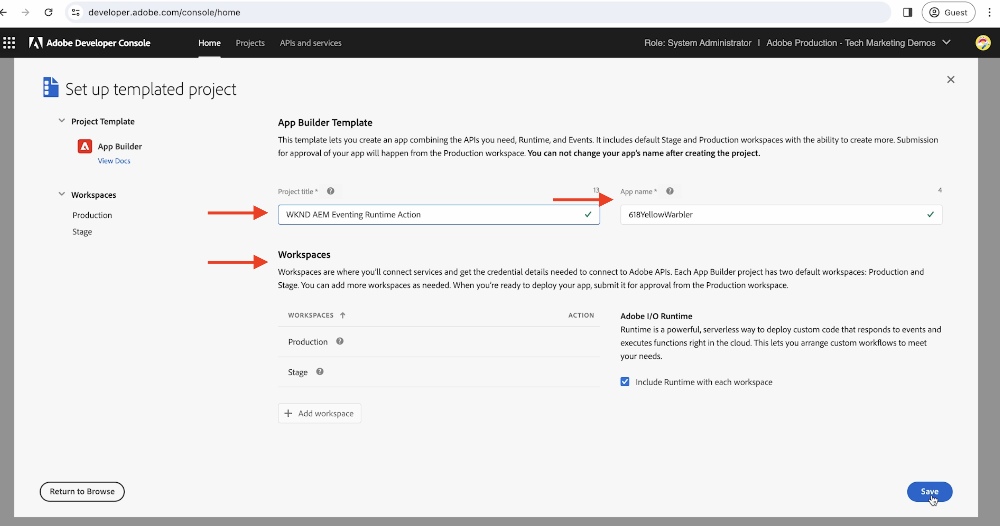

# Eventos de acción y de de Adobe I/O Runtime AEM

AEM Obtenga información sobre cómo recibir eventos de con la acción [Adobe I/O Runtime](https://developer.adobe.com/runtime/docs/guides/overview/what_is_runtime/) y revisar los detalles del evento, como la carga útil, los encabezados y los metadatos.

>[!VIDEO](https://video.tv.adobe.com/v/3427053?quality=12&learn=on)

Adobe I/O Runtime es una plataforma sin servidor que permite ejecutar código en respuesta a eventos de Adobe I/O. De este modo, le ayuda a crear aplicaciones basadas en eventos sin tener que preocuparse por la infraestructura.

En este ejemplo, se crea una acción [Action](https://developer.adobe.com/runtime/docs/guides/using/creating_actions/) de Adobe I/O Runtime AEM que recibe los eventos de la aplicación y registra los detalles del evento.
https://developer.adobe.com/runtime/docs/guides/overview/what_is_runtime/

Los pasos de alto nivel son los siguientes:

- Creación de un proyecto en Adobe Developer Console
- Inicializar proyecto para desarrollo local
- Configuración de un proyecto en Adobe Developer Console
- Déclencheur AEM de eventos de y verificación de la ejecución de acciones

## Requisitos previos

Para completar este tutorial, necesita lo siguiente:

- Entorno de AEM as a Cloud Service AEM con [ventilación de eventos habilitada](https://developer.adobe.com/experience-cloud/experience-manager-apis/guides/events/#enable-aem-events-on-your-aem-cloud-service-environment).

- Acceso a [Adobe Developer Console](https://developer.adobe.com/developer-console/docs/guides/getting-started/).

- [CLI de Adobe Developer](https://developer.adobe.com/runtime/docs/guides/tools/cli_install/) instalado en el equipo local.

>[!IMPORTANT]
>
>Los eventos de AEM as a Cloud Service solo están disponibles para los usuarios registrados en el modo previo al lanzamiento. AEM Para habilitar la celebración de eventos en su entorno de AEM as a Cloud Service AEM, póngase en contacto con el [equipo de eventos-eventos](mailto:grp-aem-events@adobe.com).

## Creación de un proyecto en Adobe Developer Console

Para crear un proyecto en Adobe Developer Console, siga estos pasos:

- Vaya a [Adobe Developer Console](https://developer.adobe.com/) y haga clic en el botón **Consola**.

- En la sección **Inicio rápido**, haga clic en **Crear proyecto a partir de la plantilla**. A continuación, en el cuadro de diálogo **Examinar plantillas**, seleccione **App Builder**.

- Actualice el título del proyecto, el nombre de la aplicación y Añadir espacio de trabajo si es necesario. A continuación, haga clic en **Guardar**.

  


## Inicializar proyecto para desarrollo local

Para agregar la acción de Adobe I/O Runtime al proyecto, debe inicializar el proyecto para el desarrollo local. En el equipo local, abra el terminal, desplácese hasta donde desee inicializar el proyecto y siga estos pasos:

- Inicialice el proyecto ejecutando

  ```bash
  aio app init
  ```

- Seleccione `Organization`, `Project` que creó en el paso anterior y el área de trabajo. En el paso `What templates do you want to search for?`, seleccione la opción `All Templates`.

  

- En la lista de plantillas, seleccione la opción `@adobe/generator-app-excshell`.

  

- Abra un proyecto en su IDE favorito, por ejemplo VSCode.

- La _plantilla de extensibilidad_ (`@adobe/generator-app-excshell`) seleccionada proporciona una acción de tiempo de ejecución genérica; el código se encuentra en el archivo `src/dx-excshell-1/actions/generic/index.js`. Actualicémoslo para que sea sencillo, registremos los detalles del evento y devolvamos una respuesta de éxito. AEM Sin embargo, en el siguiente ejemplo, se mejora para procesar los eventos de recibidos.

  ```javascript
  const fetch = require("node-fetch");
  const { Core } = require("@adobe/aio-sdk");
  const {
  errorResponse,
  getBearerToken,
  stringParameters,
  checkMissingRequestInputs,
  } = require("../utils");
  
  // main function that will be executed by Adobe I/O Runtime
  async function main(params) {
  // create a Logger
  const logger = Core.Logger("main", { level: params.LOG_LEVEL || "info" });
  
  try {
      // 'info' is the default level if not set
      logger.info("Calling the main action");
  
      // log parameters, only if params.LOG_LEVEL === 'debug'
      logger.debug(stringParameters(params));
  
      const response = {
      statusCode: 200,
      body: {
          message: "Received AEM Event, it will be processed in next example",
      },
      };
  
      // log the response status code
      logger.info(`${response.statusCode}: successful request`);
      return response;
  } catch (error) {
      // log any server errors
      logger.error(error);
      // return with 500
      return errorResponse(500, "server error", logger);
  }
  }
  
  exports.main = main;
  ```

- Finalmente, implemente la acción actualizada en Adobe I/O Runtime ejecutando.

  ```bash
  aio app deploy
  ```

## Configuración de un proyecto en Adobe Developer Console

AEM Para recibir eventos de y ejecutar la acción de Adobe I/O Runtime creada en el paso anterior, configure el proyecto en Adobe Developer Console.

- En Adobe Developer Console, vaya al [proyecto](https://developer.adobe.com/console/projects) creado en el paso anterior y haga clic en para abrirlo. Seleccione el área de trabajo `Stage`, aquí es donde se implementó la acción.

- Haga clic en el botón **Agregar servicio** y seleccione la opción **API**. En el modal **Add an API**, seleccione **Adobe Services** > **API de administración de E/S** y haga clic en **Siguiente**, siga los pasos de configuración adicionales y haga clic en **Guardar la API configurada**.

  

- Del mismo modo, haga clic en el botón **Agregar servicio** y seleccione la opción **Evento**. En el diálogo **Agregar eventos**, seleccione **Experience Cloud** > **AEM Sites** y haga clic en **Siguiente**. Siga los pasos de configuración adicionales, seleccione la instancia de AEM CS, los tipos de evento y otros detalles.

- Finalmente, en el paso **Cómo recibir eventos**, expanda la opción **Acción en tiempo de ejecución** y seleccione la acción _genérica_ creada en el paso anterior. Haga clic en **Guardar eventos configurados**.

  

- Revise los detalles de registro de eventos, también la ficha **Seguimiento de depuración** y compruebe la solicitud y respuesta de **Sondeo de desafío**.

  


## Déclencheur AEM de eventos de

Para obtener un déclencheur AEM de eventos de la desde el entorno de AEM as a Cloud Service que se ha registrado en el proyecto de Adobe Developer Console anterior, siga estos pasos:

- Acceda a su entorno de creación de AEM as a Cloud Service e inicie sesión a través de [Cloud Manager](https://my.cloudmanager.adobe.com/).

- Según sus **Eventos suscritos**, cree, actualice, elimine, publique o cancele la publicación de un fragmento de contenido.

## Revisar detalles del evento

AEM Después de completar los pasos anteriores, debería ver los eventos de la que se envían a la acción genérica.

Puede revisar los detalles del evento en la ficha **Seguimiento de depuración** de los detalles de registro de eventos.

AEM 


## Pasos siguientes

AEM AEM En el siguiente ejemplo, vamos a mejorar esta acción para procesar eventos de, volver a llamar al servicio de creación de contenido para obtener detalles de contenido, almacenar detalles en el almacenamiento de Adobe I/O Runtime SPA y mostrarlos mediante la aplicación de una sola página ().
