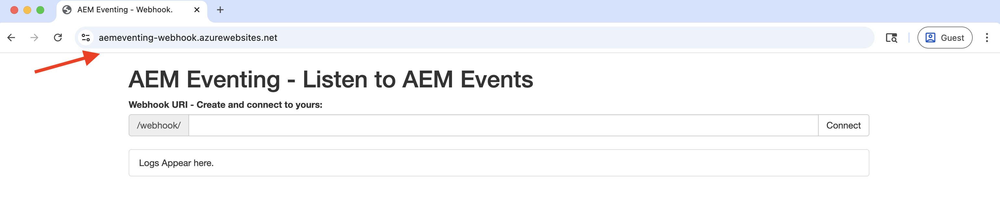

# Webhooks y eventos de AEM

Obtenga información sobre cómo recibir eventos de AEM en un webhook y revisar los detalles del evento, como carga útil, encabezados y metadatos.


>[!VIDEO](https://video.tv.adobe.com/v/3449751?quality=12&learn=on&captions=spa)


>[!IMPORTANT]
>
>El vídeo hace referencia a un punto final de gancho web alojado en Glitch. Dado que Glitch ha interrumpido su servicio de alojamiento, el webhook se ha migrado a Azure App Service.
>
>La funcionalidad sigue siendo la misma: solo ha cambiado la plataforma de alojamiento.


En lugar de utilizar el webhook de ejemplo proporcionado por Adobe, también puede usar su propio extremo de webhook para recibir eventos de AEM.

## Requisitos previos

Para completar este tutorial, necesita lo siguiente:

- Entorno AEM as a Cloud Service con [evento de AEM habilitado](https://developer.adobe.com/experience-cloud/experience-manager-apis/guides/events/#enable-aem-events-on-your-aem-cloud-service-environment).

- [Proyecto Adobe Developer Console configurado para eventos de AEM](https://developer.adobe.com/experience-cloud/experience-manager-apis/guides/events/#how-to-subscribe-to-aem-events-in-the-adobe-developer-console).


## Acceso al webhook

Para acceder al webhook de ejemplo proporcionado por Adobe, siga estos pasos:

- Compruebe que puede acceder al [gancho web de ejemplo proporcionado por Adobe](https://aemeventing-webhook.azurewebsites.net/) en una nueva pestaña del explorador.

  

- Escribe un nombre único para tu webhook, por ejemplo `<YOUR_PETS_NAME>-aem-eventing` y haz clic en **Conectar**. Debería ver `Connected to: ${YOUR-WEBHOOK-URL}` mensaje en la pantalla.

  

- Tome nota de la **URL de webhook**. Lo necesita más adelante en este tutorial.

## Configuración del webhook en un proyecto de Adobe Developer Console

Para recibir eventos de AEM en la URL del gancho web anterior, siga estos pasos:

- En [Adobe Developer Console](https://developer.adobe.com), navegue hasta el proyecto y haga clic para abrirlo.

- En la sección **Productos y servicios**, haga clic en los puntos suspensivos `...` junto a la tarjeta de eventos que desee que envíe eventos de AEM al gancho web y seleccione **Editar**.

  

- En el diálogo **Configurar el registro de eventos** que acaba de abrir, haga clic en **Siguiente** para continuar con el paso **Cómo recibir eventos**.

  

- En el paso **Cómo recibir eventos**, selecciona la opción **Webhook**, pega la **URL de Webhook** que copiaste anteriormente del webhook de ejemplo proporcionado por Adobe y haz clic en **Guardar eventos configurados**.

  

- En la página de webhook de ejemplo proporcionada por Adobe, debería ver una solicitud de GET, se trata de una solicitud de desafío enviada por Adobe I/O Events para comprobar la dirección URL del webhook.

  


## Déclencheur de eventos de AEM

Para almacenar en déclencheur eventos de AEM desde el entorno de AEM as a Cloud Service que se haya registrado en el proyecto de Adobe Developer Console anterior, siga estos pasos:

- Acceda a su entorno de creación de AEM as a Cloud Service e inicie sesión a través de [Cloud Manager](https://my.cloudmanager.adobe.com/).

- Según sus **Eventos suscritos**, cree, actualice, elimine, publique o cancele la publicación de un fragmento de contenido.

## Revisar detalles del evento

Después de completar los pasos anteriores, debería ver los eventos de AEM que se envían al gancho web. Busque la solicitud POST en la página de webhook de ejemplo proporcionada por Adobe.


Estos son los detalles clave de la solicitud de POST:

- ruta: `/webhook/${YOUR-WEBHOOK-URL}`, por ejemplo `/webhook/AdobeTM-aem-eventing`

- encabezados: encabezados de solicitud enviados por Adobe I/O Events, por ejemplo:

```json
{
  "host": "aemeventing-webhook.azurewebsites.net",
  "user-agent": "Adobe/1.0",
  "accept-encoding": "deflate,compress,identity",
  "max-forwards": "10",
  "x-adobe-public-key2-path": "/prod/keys/pub-key-kruhWwu4Or.pem",
  "x-adobe-delivery-id": "25c36f70-9238-4e4c-b1d8-4d9a592fed9d",
  "x-adobe-provider": "aemsites_7ABB3E6A5A7491460A495D61@AdobeOrg_acct-aem-p63947-e1249010@adobe.com",
  "x-adobe-public-key1-path": "/prod/keys/pub-key-lyTiz3gQe4.pem",
  "x-adobe-event-id": "b555a1b1-935b-4541-b410-1915775338b5",
  "x-adobe-event-code": "aem.sites.contentFragment.modified",
  "x-adobe-digital-signature-2": "Lvw8+txbQif/omgOamJXJaJdJMLDH5BmPA+/RRLhKG2LZJYWKiomAE9DqKhM349F8QMdDq6FXJI0vJGdk0FGYQa6JMrU+LK+1fGhBpO98LaJOdvfUQGG/6vq8/uJlcaQ66tuVu1xwH232VwrQOKdcobE9Pztm6UX0J11Uc7vtoojUzsuekclKEDTQx5vwBIYK12bXTI9yLRsv0unBZfNRrV0O4N7KA9SRJFIefn7hZdxyYy7IjMdsoswG36E/sDOgcnW3FVM+rhuyWEizOd2AiqgeZudBKAj8ZPptv+6rZQSABbG4imOa5C3t85N6JOwffAAzP6qs7ghRID89OZwCg==",
  "x-adobe-digital-signature-1": "ZQywLY1Gp/MC/sXzxMvnevhnai3ZG/GaO4ThSGINIpiA/RM47ssAw99KDCy1loxQyovllEmN0ifAwfErQGwDa5cuJYEoreX83+CxqvccSMYUPb5JNDrBkG6W0CmJg6xMeFeo8aoFbePvRkkDOHdz6nT0kgJ70x6mMKgCBM+oUHWG13MVU3YOmU92CJTzn4hiSK8o91/f2aIdfIui/FDp8U20cSKKMWpCu25gMmESorJehe4HVqxLgRwKJHLTqQyw6Ltwy2PdE0guTAYjhDq6AUd/8Fo0ORCY+PsS/lNxim9E9vTRHS7TmRuHf7dpkyFwNZA6Au4GWHHS87mZSHNnow==",
  "x-arr-log-id": "881073f0-7185-4812-9f17-4db69faf2b68",
  "client-ip": "52.37.214.82:46066",
  "disguised-host": "aemeventing-webhook.azurewebsites.net",
  "x-site-deployment-id": "aemeventing-webhook",
  "was-default-hostname": "aemeventing-webhook.azurewebsites.net",
  "x-forwarded-proto": "https",
  "x-appservice-proto": "https",
  "x-arr-ssl": "2048|256|CN=Microsoft Azure RSA TLS Issuing CA 03, O=Microsoft Corporation, C=US|CN=*.azurewebsites.net, O=Microsoft Corporation, L=Redmond, S=WA, C=US",
  "x-forwarded-tlsversion": "1.3",
  "x-forwarded-for": "52.37.214.82:46066",
  "x-original-url": "/webhook/AdobeTechMarketing-aem-eventing",
  "x-waws-unencoded-url": "/webhook/AdobeTechMarketing-aem-eventing",
  "x-client-ip": "52.37.214.82",
  "x-client-port": "46066",
  "content-type": "application/cloudevents+json; charset=UTF-8",
  "content-length": "1178"
}
```

- cuerpo/carga útil: cuerpo de la solicitud enviado por Adobe I/O Events, por ejemplo:

```json
{
  "specversion": "1.0",
  "id": "83b0eac0-56d6-4499-afa6-4dc58ff6ac7f",
  "source": "acct:aem-p63947-e1249010@adobe.com",
  "type": "aem.sites.contentFragment.modified",
  "datacontenttype": "application/json",
  "dataschema": "https://ns.adobe.com/xdm/aem/sites/events/content-fragment-modified.json",
  "time": "2025-07-24T13:53:23.994109827Z",
  "eventid": "b555a1b1-935b-4541-b410-1915775338b5",
  "event_id": "b555a1b1-935b-4541-b410-1915775338b5",
  "recipient_client_id": "606d4074c7ea4962aaf3bc2a5ac3b7f9",
  "recipientclientid": "606d4074c7ea4962aaf3bc2a5ac3b7f9",
  "data": {
    "user": {
      "imsUserId": "ims-933E1F8A631CAA0F0A495E53@80761f6e631c0c7d495fb3.e",
      "principalId": "xx@adobe.com",
      "displayName": "Sachin Mali"
    },
    "path": "/content/dam/wknd-shared/en/adventures/beervana-portland/beervana-in-portland",
    "sourceUrl": "https://author-p63947-e1249010.adobeaemcloud.com",
    "model": {
      "id": "L2NvbmYvd2tuZC1zaGFyZWQvc2V0dGluZ3MvZGFtL2NmbS9tb2RlbHMvYWR2ZW50dXJl",
      "path": "/conf/wknd-shared/settings/dam/cfm/models/adventure"
    },
    "id": "9e1e9835-64c8-42dc-9d36-fbd59e28f753",
    "tags": [
      "wknd-shared:region/nam/united-states",
      "wknd-shared:activity/social",
      "wknd-shared:season/fall"
    ],
    "properties": [
      {
        "name": "price",
        "changeType": "modified"
      }
    ]
  }
}
```

Puede ver que los detalles del evento de AEM tienen toda la información necesaria para procesar el evento en el webhook. Por ejemplo, el tipo de evento (`type`), el origen de evento (`source`), el identificador de evento (`event_id`), la hora del evento (`time`) y los datos de evento (`data`).

## Recursos adicionales

- El código fuente de [AEM-Eventing Webhook](../assets/examples/webhook/aemeventing-webhook.tgz) está disponible para su referencia.
