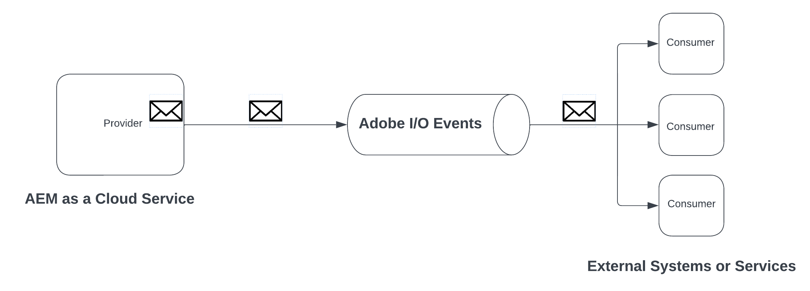

# Eventos de AEM

Obtenga información sobre los Eventos de AEM: qué son, por qué, cuándo utilizarlos y ejemplos.

>[!VIDEO](https://video.tv.adobe.com/v/3426686?quality=12&learn=on)

## Qué son

Eventos de AEM es un sistema de eventos nativo en la nube que permite suscripciones a los Eventos de AEM: para su procesamiento en sistemas externos. Un evento de AEM es una notificación de cambio de estado que AEM envía cada vez que se produce una acción específica. Por ejemplo, esto puede incluir eventos cuando se crea, actualiza o elimina un fragmento de contenido.

En el diagrama anterior se visualizaba cómo AEM as a Cloud Service produce eventos y los envía a Adobe I/O Events, que a su vez los expone a los suscriptores de eventos.

En resumen, hay tres componentes principales:

1. **Proveedor de eventos:** AEM as a Cloud Service.
1. **Adobe I/O Events:** plataforma para desarrolladores para integrar, ampliar y crear aplicaciones y experiencias basadas en los productos y tecnologías de Adobe.
1. **Consumidor de eventos:** sistemas propiedad del cliente que se suscriben a AEM Events. Por ejemplo, CRM (administración de la relación con los clientes), PIM (administración de la información de productos), OMS (sistema de gestión de pedidos) o una aplicación personalizada.

### ¿Cuál es la diferencia?

Los eventos de [Apache Sling](https://sling.apache.org/documentation/bundles/apache-sling-eventing-and-job-handling.html), los eventos OSGi y la [observación JCR](https://jackrabbit.apache.org/oak/docs/features/observation.html?lang=es) ofrecen todos mecanismos para suscribirse a eventos y procesarlos. Sin embargo, son diferentes de Eventos de AEM, tal como se describe en esta documentación.

Entre las principales diferencias de AEM Eventing se incluyen las siguientes:

- El código de consumidor de eventos se ejecuta fuera de AEM y no en la misma JVM que AEM.
- El código de producto de AEM es responsable de definir los eventos y enviarlos a Adobe I/O Events.
- La información del evento está estandarizada y se envía en formato JSON. Para obtener más información, consulte [cloudevents](https://cloudevents.io/). 
- Para volver a comunicarse con AEM, el consumidor de eventos utiliza la API de AEM as a Cloud Service.

## Por qué y cuándo usarlo

Los Eventos de AEM ofrecen numerosas ventajas para la arquitectura del sistema y la eficacia operativa. Las razones principales para utilizar AEM Eventing son las siguientes:

- **Para crear arquitecturas basadas en eventos**: facilita la creación de sistemas poco acoplados que pueden escalarse de forma independiente y son resistentes a los errores.
- **Código bajo y menores costos operativos**: evita las personalizaciones en AEM, lo que hace que los sistemas sean más fáciles de mantener y ampliar, reduciendo así los gastos operativos.
- **Simplifica la comunicación entre AEM y sistemas externos**: elimina las conexiones de punto a punto al permitir que Adobe I/O Events administre las comunicaciones, como la determinación de qué eventos de AEM deben suministrarse a sistemas o servicios específicos.
- **Mayor durabilidad de los eventos**: Adobe I/O Events es un sistema escalable y de alta disponibilidad, concebido para gestionar grandes volúmenes de eventos y enviarlos de forma fiable a los suscriptores.
- **Procesamiento paralelo de eventos**: permite la distribución de eventos a varios suscriptores simultáneamente, lo que permite el procesamiento de eventos distribuidos en varios sistemas.
- **Desarrollo de aplicaciones sin servidor**: admite la implementación del código de consumidor de eventos como una aplicación sin servidor, lo que mejora aún más la flexibilidad y escalabilidad del sistema.

### Limitaciones

Los eventos de AEM son potentes, aunque presentan algunas limitaciones que hay que tener en cuenta:

- **Disponibilidad restringida a AEM as a Cloud Service**: actualmente, AEM Eventing está disponible exclusivamente para AEM as a Cloud Service.

- **Tipos de eventos disponibles**: revise la lista actual de tipos de eventos disponibles [aquí](https://developer.adobe.com/experience-cloud/experience-manager-apis/guides/events/#available-event-types).

## Cómo habilitarlo

Consulte [Habilitar AEM Events en su entorno de AEM Cloud Service](https://developer.adobe.com/experience-cloud/experience-manager-apis/guides/events/#enable-aem-events-on-your-aem-cloud-service-environment) para ver los pasos siguientes.

## Cómo suscribirse

Para suscribirse a AEM Events, no tiene que escribir ningún código en AEM, sino que se configura un proyecto de [Adobe Developer Console](https://developer.adobe.com/). Adobe Developer Console es una puerta de enlace a las API de Adobe, los SDK, los eventos, el tiempo de ejecución y App Builder.

En este caso, un _proyecto_ en Adobe Developer Console le permite suscribirse a eventos emitidos desde el entorno de AEM as a Cloud Service y configurar el suministro de eventos a sistemas externos.

Para obtener más información, consulte [Cómo suscribirse a eventos de AEM en Adobe Developer Console](https://developer.adobe.com/experience-cloud/experience-manager-apis/guides/events/#how-to-subscribe-to-aem-events-in-the-adobe-developer-console).

## Cómo consumir

Existen dos métodos principales para consumir eventos de AEM: el método de _inserción_ y el método de _extracción_.

- **Método de inserción**: con este método, Adobe I/O Events notifica al consumidor de eventos de forma proactiva cuando hay un evento disponible. Las opciones de integración incluyen Webhooks, Adobe I/O Runtime y Amazon EventBridge.
- **Método de extracción**: en este caso, el consumidor de eventos sondea Adobe I/O Events de forma activa para buscar nuevos eventos. La opción de integración principal para este método es la API de registro en diario de Adobe Developer.

Para obtener más información, consulte [Procesamiento de AEM Events mediante Adobe I/O Events](https://developer.adobe.com/experience-cloud/experience-manager-apis/guides/events/#aem-events-processing-via-adobe-io).

## Ejemplos

<table>
  <tr>
    <td>
        
        
<strong><a href="./examples/webhook.md">Recibir eventos de AEM en un webhook</a></strong>

        

          Utilice el webhook proporcionado por Adobe para recibir eventos de AEM y revisar los detalles del evento.
        

      </td>
      <td>
        
        
<strong><a href="./examples/journaling.md">Carga del diario de AEM Events</a></strong>

        

          Utilice la aplicación web proporcionada por Adobe para cargar AEM Events desde el diario y revisar los detalles del evento.
        

      </td>
    </tr>
  <tr>
    <td>
        
        
<strong><a href="./examples/runtime-action.md">Recibir AEM Events en Adobe I/O Runtime Action</a></strong>

        

          Reciba AEM Events y revise los detalles del evento.
        

      </td>
      <td>
        
        
<strong><a href="./examples/event-processing-using-runtime-action.md">Procesamiento de AEM Events mediante Adobe I/O Runtime Action</a></strong>

        

          Obtenga información sobre cómo procesar AEM Events mediante Adobe I/O Runtime Action. El procesamiento de eventos incluye la llamada de retorno de AEM, la persistencia de datos de evento y su visualización en la SPA.
        

      </td>
  </tr>
  <tr>
    <td>
        
        
<strong><a href="./examples/assets-pim-integration.md">Eventos de AEM Assets para la integración con PIM</a></strong>

        

          Aprenda a integrar AEM Assets y los sistemas de administración de la información de productos (PIM) para actualizar los metadatos.
        

      </td>
  </tr> 
</table>
