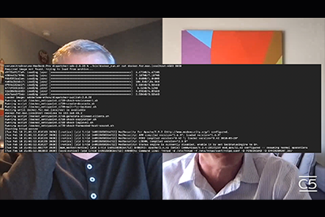

# Cloud 5 temporada 1

## Introducción

AEM Bienvenido a la serie Cloud 5 de Ingeniería de. Uno de los principales problemas en la fase de implementación de cualquier producto es tener suficientes muestras de código o demostraciones en directo de esas muestras, herramientas o API. AEM El objetivo de esta serie es proporcionar información útil acerca de las as a Cloud Service en 5 minutos o menos.

Visite la [Cuadro de sugerencias](https://forms.office.com/r/74P5Xz4UH0) para enviar ideas de temas.

## Temporada 1

Cada temporada tiene una duración variable y se lanza según un horario fijo. Los temas de la temporada 1 se basan principalmente en solicitudes pasadas que hemos encontrado en nuestras interacciones diarias con clientes y socios. Visite esta página para actualizaciones semanales o síganos en la red social de su elección.

<table>
  <tr>
   <td>
      
      

         <a href="./cloud5-aem-cdn-part1.md"><strong>AEM CDN CDN Profundo (parte 1)</strong></a>         
          <em>con Darin Kuntze y James Talbot, arquitectos sénior de la nube</em>
      

      

         
         AEM La parte 1 es una presentación de la CDN de as a Cloud Service de la y cómo utilizarla en la implementación.
      

     </td>   
     <td>
      
      

         <a href="./cloud5-aem-cdn-part2.md"><strong>AEM CDN CDN Profundo (parte 2)</strong></a>
          <em>con Darin Kuntze y James Talbot, arquitectos sénior de la nube</em>
      

      

         
         AEM La parte 2 es una continuación de nuestra visión de la CDN as a Cloud Service de la. Respondemos a algunas de las preguntas y mitos más comunes sobre las funciones que obtiene con la nueva CDN.
      

   </td>
     <td>
        
      

         <a href="./cloud5-aem-log-files.md"><strong>Archivos de registro y registro</strong></a>
          <em>con Darin Kuntze y James Talbot, arquitectos sénior de la nube</em>
      

      

         
         AEM Este es un vistazo rápido a cómo acceder a los registros en as a Cloud Service, incluyendo cómo acceder a ellos a través de la interfaz de usuario, así como desde las APIs.
      

   </td> 
  </tr>
  <tr>
   <td>
        
      

        <a href="./cloud5-getting-login-token-integrations.md"><strong>Integración con tokens de acceso</strong></a>        
          <em>con Darin Kuntze y James Talbot, arquitectos sénior de la nube</em>
      

      

         
         Una breve descripción general y demostración de la interacción con los tokens de inicio de sesión para hacer el trabajo de integración dentro de los entornos de servicios en la nube.
      

     </td>   
     <td>
        
      

        <a href="./cloud5-aem-dispatcher-cloud.md"><strong>Dispatcher en la nube</strong></a>
          <em>con Darin Kuntze y James Talbot, arquitectos sénior de la nube</em>
      

      

         
        AEM Darin y James analizan Dispatcher en la nube de la, incluidas algunas prácticas recomendadas y diferencias con AMS/On-Prem. 
      

   </td>
     <td>
        
      

         <a href="./cloud5-aem-content-migration-part-1.md"><strong>Migración (parte 1)</strong></a>
          <em>con Darin Kuntze y James Talbot, arquitectos sénior de la nube y Dr. Applesmith</em>
      

      

         
         Primera parte (de dos) de nuestros consejos y trucos para migrar a la nube. Nuestro principal objetivo en la primera parte es la práctica recomendada y el trabajo preparatorio que le prepararán para la migración.
      

   </td> 
  </tr>
<tr>
   <td>
        
      

        <a href="./cloud5-aem-content-migration-part-2.md"><strong>Migración (parte 2)</strong></a>     
          <em>con Darin Kuntze y James Talbot, arquitectos sénior de la nube</em>
      

      

         
         Segunda parte (de dos) de nuestros consejos y trucos para migrar a la nube. La segunda parte trata principalmente del uso de las herramientas disponibles para la migración.
      

     </td>   
     <td>
        
      

         <a href="./cloud5-aem-dispatcher-validator.md"><strong>Validador de Dispatcher</strong></a>
          <em>con Darin Kuntze y James Talbot, arquitectos sénior de la nube</em>
      

      

         
         Como resultado de las discusiones de migración anteriores, echamos un vistazo al validador de Dispatcher y a algunas de las tareas que puede realizar.
      

   </td>
     <td>
        
      

         <a href="./cloud5-aem-search-and-indexing.md"><strong>Sugerencias de indexación y búsqueda</strong></a>
          <em>con Darin Kuntze y James Talbot, arquitectos sénior de la nube</em>
      

      

         
         Para algo tan complejo como la indexación y la búsqueda, el equipo muestra algunas ganancias fáciles para optimizar el tiempo de desarrollo y resolver las cosas antes de que se conviertan en problemas.
      

   </td> 
  </tr>
    <tr>
        <td>
            
            

                <a href="./cloud5-adobe-app-builder.md"><strong>Adobe App Builder</strong></a>         
                <em>con Darin Kuntze y James Talbot, arquitectos sénior de la nube y Amol Anand</em>
            

            
 
                Eche un vistazo a algunas cosas interesantes que puede hacer con el Generador de aplicaciones de Adobe y aprenda algo nuevo sobre el futuro de las personalizaciones en la nube.
            

        </td>
        <td></td>
        <td></td>
    </tr>
</table>
