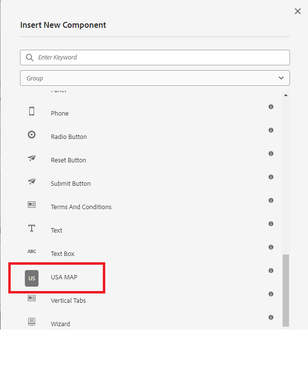

# Crear componente

En este artículo se da por hecho que tiene cierta experiencia en el desarrollo de para AEM Forms CS. También se da por hecho que ha creado un proyecto de arquetipo de AEM Forms.

Abra el proyecto de AEM Forms en IntelliJ o en cualquier otro IDE de su elección. Cree un nuevo nodo llamado svg en

```
apps\corecomponent\components\adaptiveForm
```

>[!NOTE]
>
> ``corecomponent`` es el appId proporcionado al crear el proyecto Maven. Este appId podría ser diferente en su entorno.


## Crear archivo .content.xml

Cree un archivo llamado .content.xml en el nodo svg. Añada el siguiente contenido al archivo recién creado. Puede cambiar jcr:description,jcr:title y componentGroup según sus necesidades.

```xml
<?xml version="1.0" encoding="UTF-8"?>
<jcr:root xmlns:jcr="http://www.jcp.org/jcr/1.0" xmlns:cq="http://www.day.com/jcr/cq/1.0" xmlns:sling="http://sling.apache.org/jcr/sling/1.0"
    jcr:description="USA MAP"
    jcr:primaryType="cq:Component"
    jcr:title="USA MAP"
    sling:resourceSuperType="wcm/foundation/components/responsivegrid"
    componentGroup="CustomCoreComponent - Adaptive Form"/>
```

## Crear svg.html

Cree un archivo llamado svg.html. Este archivo mostrará el SVG del mapa de EE. UU. Copie el contenido de [svg.html](assets/svg.html) en el archivo recién creado. Lo que ha copiado es el mapa del SVG de Estados Unidos. Guarde el archivo.

## Implemente el proyecto

Implemente el proyecto en la instancia local preparada para la nube para probar el componente.

Para implementar el proyecto, deberá desplazarse a la carpeta raíz del proyecto en la ventana del símbolo del sistema y ejecutar el siguiente comando.

```
mvn clean install -PautoInstallSinglePackage
```

Esto implementará el proyecto en la instancia local de AEM Forms y el componente estará disponible para incluirse en el formulario adaptable


