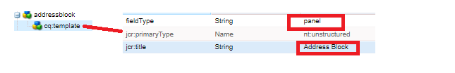
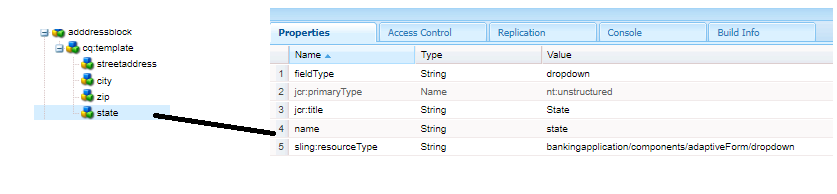

# Crear componente de dirección

Inicie sesión en CRXDE de la instancia local de AEM Forms lista para la nube.

Realice una copia del nodo ``/apps/bankingapplication/components/adaptiveForm/button`` y cambie su nombre a bloque de direcciones. Seleccione el nodo addressesblock y establezca sus propiedades como se muestra a continuación.

>[!NOTE]
>
> ``bankingapplication`` es el appId proporcionado al crear el proyecto Maven. Este appId podría ser diferente en su entorno. Puede hacer una copia de cualquier componente. Acabo de hacer una copia del componente del botón

## propiedades del nodo cq-template

Seleccione el nodo ``cq-template`` bajo el nodo ``addressblock`` y establezca sus propiedades como se muestra a continuación. Observe que fieldType está configurado en el panel

## Agregar nodos bajo cq-template

Agregue los siguientes nodos de tipo ``nt:unstructured`` en ``cq-template``

* street address
* ciudad
* zip
* estado

Estos nodos representan los campos del componente de bloque de direcciones. Los campos de dirección de calle, ciudad y código postal serán un campo de entrada de texto y el campo de estado será un campo desplegable.

## Establecer las propiedades del nodo streetaddress

>[!NOTE]
>
> La **_aplicación bancaria_** de la ruta hace referencia al appId del proyecto Maven. Esto puede ser diferente en su entorno

Seleccione el nodo ``streetaddress`` y establezca sus propiedades como se muestra a continuación.

## Establecer las propiedades del nodo de ciudad

Seleccione el nodo ``city`` y establezca sus propiedades como se muestra a continuación.

## Establecer las propiedades del nodo zip

Seleccione el nodo ``zip`` y establezca sus propiedades como se muestra a continuación.

## Establecer las propiedades del nodo de estado

Seleccione el nodo ``state`` y establezca sus propiedades como se muestra a continuación. Observe el fieldType del estado: está configurado para ser un menú desplegable

## Definir opciones para el campo de estado

Seleccione el nodo ``state`` y agregue las siguientes propiedades.

| Nombre | Tipo | Valor  |
|----------|----------|---------------------|
| enum | Cadena [] | CA, NY |
| enumNames | Cadena [] | California, Nueva York |

El componente final de bloque de direcciones tendrá este aspecto

## Siguientes pasos

[Implemente el proyecto](./deploy-your-project.md)
