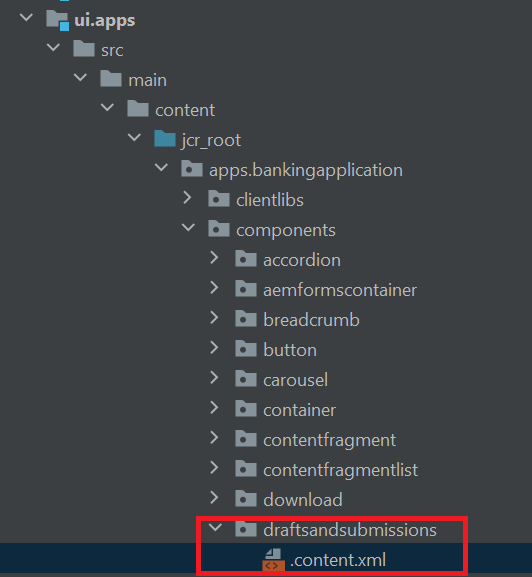

# Componentes de Forms Portal

AEM Forms proporciona los siguientes componentes de portal predeterminados:

**Búsqueda y listado**: Este componente le permite enumerar formularios del repositorio de formularios en la página del portal y proporciona opciones de configuración para enumerar formularios basados en criterios específicos.

**Borradores y envíos**: Mientras que el componente Buscar y listar muestra los formularios que publica el autor de Forms, el componente Borradores y envíos muestra los formularios guardados como borrador para completarlos posteriormente y enviarlos. Este componente proporciona una experiencia personalizada a cualquier usuario que haya iniciado sesión.

**Vínculo**: Este componente le permite crear un vínculo a un formulario en cualquier parte de la página.

## Habilitar componentes de Forms Portal

Inicie IntelliJ y abra el proyecto BankingApplication creado en el [paso anterior.](./getting-started.md) Expanda ui.apps->src->main->content->jcr_root->apps.bankingapplication->components

Para utilizar cualquier componente principal (incluidos los componentes de portal predeterminados) en un sitio de Adobe Experience Manager (AEM), debe crear un componente proxy y habilitarlo para su sitio.
El componente proxy recién creado debe apuntar al componente de formularios predeterminados para que hereden todo de ellos. Esto se hace cambiando resourceSuperType en el content.xml del componente proxy. En content.xml también especificamos el título y el grupo de componentes.
>[!NOTE]
>
> Puede construir el supertipo de recurso para cada uno de los [estos componentes desde aquí](https://github.com/adobe/aem-core-forms-components/tree/master/ui.apps/src/main/content/jcr_root/apps/core/fd/components/formsportal)


### Borradores y presentaciones

Crear una copia de un componente existente (por ejemplo `button`) y asígnele el nombre _borradores de presentaciones_.

Reemplace el contenido en la variable `.content.xml` con el siguiente XML:

```xml
<?xml version="1.0" encoding="UTF-8"?>
<jcr:root xmlns:sling="http://sling.apache.org/jcr/sling/1.0" xmlns:cq="http://www.day.com/jcr/cq/1.0" xmlns:jcr="http://www.jcp.org/jcr/1.0"
          jcr:primaryType="cq:Component"
          jcr:title="Drafts And Submissions"
          sling:resourceSuperType="core/fd/components/formsportal/draftsandsubmissions/v1/draftsandsubmissions"
          componentGroup="BankingApplication - Content"/>
```

### Buscar y listar

Crear una copia del componente de botón y cambiarle el nombre a _searchandlister_.
Reemplace el contenido en la variable `.content.xml` con el siguiente XML:


```xml
<?xml version="1.0" encoding="UTF-8"?>
<jcr:root xmlns:sling="http://sling.apache.org/jcr/sling/1.0" xmlns:cq="http://www.day.com/jcr/cq/1.0" xmlns:jcr="http://www.jcp.org/jcr/1.0"
          jcr:primaryType="cq:Component"
          jcr:title="Search And Lister"
          sling:resourceSuperType="core/fd/components/formsportal/searchlister/v1/searchlister"
          componentGroup="BankingApplication - Content"/>
```

### Componente de vínculo

Crear una copia del componente de botón y cambiarle el nombre a _vínculo_.
Reemplace el contenido en la variable `.content.xml` con el siguiente XML:


```xml
<?xml version="1.0" encoding="UTF-8"?>
<jcr:root xmlns:sling="http://sling.apache.org/jcr/sling/1.0" xmlns:cq="http://www.day.com/jcr/cq/1.0" xmlns:jcr="http://www.jcp.org/jcr/1.0"
          jcr:primaryType="cq:Component"
          jcr:title="Link to Adaptive Form"
          sling:resourceSuperType="core/fd/components/formsportal/link/v2/link"
          componentGroup="BankingApplication - Content"/>
```

Una vez implementado el proyecto, debe poder utilizar estos componentes en la página de AEM para crear el portal de Forms.