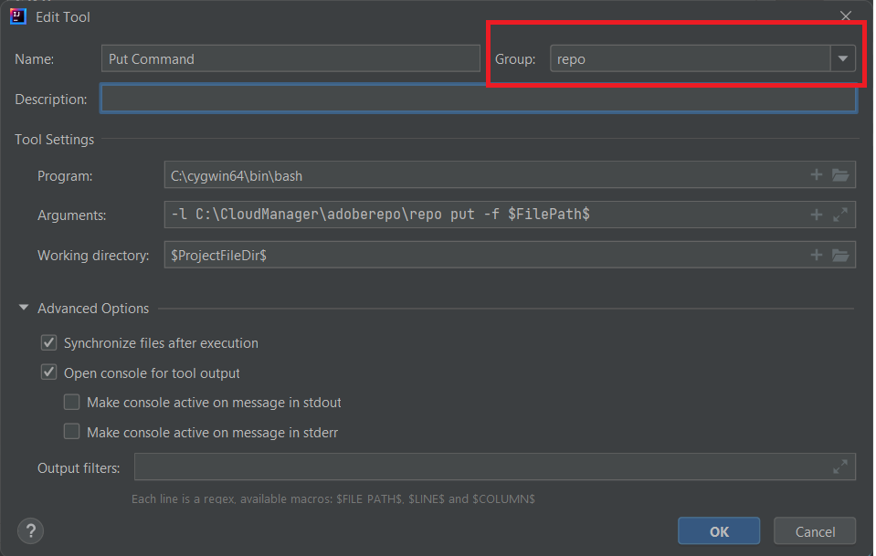

# Instalación de Cygwin

Instalar [Cygwin](https://www.cygwin.com/). He instalado en C:\cygwin64 folder
>[Nota]
> Asegúrese de instalar los paquetes zip, unzip, curl y rsync con su instalación de cygwin

[Instalación de la herramienta de repositorios].(https://github.com/Adobe-Marketing-Cloud/tools/tree/master/repo).Installing la herramienta repo no es más que copiar el archivo repo y colocarlo en su c:\cloudmanger\adoberepo folder.

Agregue lo siguiente a la variable de entorno de rutas C:\cygwin64\bin;C:\CloudManager\adoberepo;

## Configuración de herramientas externas

Iniciar IntelliJ Pulse las teclas Ctrl+Alt+S para iniciar la ventana de configuración Seleccione Herramientas->Herramientas externas y, a continuación, haga clic en el signo + e introduzca lo siguiente, tal y como se muestra en la captura de pantalla Asegúrese de crear un grupo llamado repo escribiendo &quot;repo&quot; en el campo desplegable Grupo y todos los comandos que cree pertenezcan al grupo **repo** grupo

**Comando Put**
**Programa**: C:\cygwin64\bin\bash
**Argumentos**: -l C:\CloudManager\adoberepo\repo put -f \$FilePath\$
**Dir de trabajo**: \$ProjectFileDir\$

**Obtener comando**
**Programa**: C:\cygwin64\bin\bash
**Argumentos**: -l C:\CloudManager\adoberepo\repo get -f \$FilePath\$
**Dir de trabajo**: \$ProjectFileDir\$

**Comando Estado**
**Programa**: C:\cygwin64\bin\bash
**Argumentos**: -l C:\CloudManager\adoberepo\repo st -f \$FilePath\$
**Dir de trabajo**: \$ProjectFileDir\$

**Comando Diff**
**Programa**: C:\cygwin64\bin\bash
**Argumentos**: -l C:\CloudManager\adoberepo\repo diff -f $FilePath$
**Dir de trabajo**: \$ProjectFileDir\$

Extraiga el archivo .repo de [repo.zip](assets/repo.zip) y colóquelo en la carpeta raíz de AEM proyectos. (C:\CloudManager\aem-banking-application). Abra el archivo .repo y asegúrese de que la configuración del servidor y las credenciales coinciden con su entorno.
Abra el archivo .gitignore y añada lo siguiente hacia la parte inferior del archivo y guarde los cambios \# repo .repo

Seleccione cualquier proyecto dentro de su proyecto aem-banking-application como ui.content y haga clic con el botón derecho y debería ver la opción repo y en la opción repo verá los 4 comandos que hemos agregado anteriormente.

## Configuración de la instancia de autor de AEM

Se pueden seguir los siguientes pasos para configurar rápidamente la instancia preparada para la nube en su sistema local.
* [Descargar el SDK de AEM más reciente](https://experience.adobe.com/#/downloads/content/software-distribution/es-ES/aemcloud.html)

* [Descargue el último complemento de AEM Forms](https://experience.adobe.com/#/downloads/content/software-distribution/en/aemcloud.html)

* Cree la siguiente estructura de carpetas c:\aemformscs\aem-sdk\author

* Extraiga el archivo aem-sdk-quickstart-xxxxxx.jar del archivo zip del SDK de AEM y colóquelo en el archivo c:\aemformscs\aem-sdk\author folder.Rename del archivo jar a aem-author-p4502.jar

* Abra el símbolo del sistema y vaya a c:\aemformscs\aem-sdk\author enter the following command java -jar aem-author-p4502.jar -gui. Esto iniciará la instalación de AEM.
* Inicio de sesión con credenciales de administrador/administrador
* Detener la instancia de AEM
* Cree la siguiente estructura de carpetas.C:\aemformscs\aem-sdk\author\crx-quickstart\install
* Copiar aem-forms-addon-xxxxxx.far en la carpeta de instalación
* Abra el símbolo del sistema y vaya a c:\aemformscs\aem-sdk\author enter the following command java -jar aem-author-p4502.jar -gui. Esto implementará el complemento de formularios en el paquete de la instancia de AEM.

