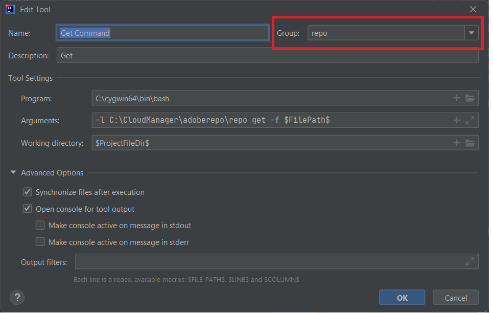

# Instalación de Cygwin

Cygwin es un entorno de programación y tiempo de ejecución compatible con POSIX que se ejecuta de forma nativa en Microsoft Windows.
Instalar [Cygwin](https://www.cygwin.com/). He instalado en la carpeta C:\cygwin64
>[!NOTE]
> Asegúrese de instalar los paquetes zip, unzip, curl y rsync con su instalación de cygwin

Cree una carpeta llamada adoberepo en c:\cloudmanager.

[Instalar la herramienta de repositorios](https://github.com/Adobe-Marketing-Cloud/tools/tree/master/repo) La instalación de la herramienta de repositorios no es otra cosa que copiar el archivo de repositorios y colocarlo en la carpeta c:\cloudmanger\adoberepo.

Agregue lo siguiente a la variable de entorno Path C:\cygwin64\bin;C:\CloudManager\adoberepo;

## Configuración de herramientas externas

* Iniciar IntelliJ
* Pulse las teclas Ctrl+Alt+S para abrir la ventana de configuración.
* Seleccione Herramientas->Herramientas externas y, a continuación, haga clic en el signo + e introduzca lo siguiente como se muestra en la captura de pantalla.
  
* Asegúrese de crear un grupo llamado repo escribiendo &quot;repo&quot; en el campo desplegable Grupo y todos los comandos que cree pertenecerán al grupo **repo**

**Comando Put**
**Programa**: C:\cygwin64\bin\bash
**Argumentos**: -l C:\CloudManager\adoberepo\repo put -f \$FilePath\$
**Dir de trabajo**: \$ProjectFileDir\$

**Obtener comando**
**Programa**: C:\cygwin64\bin\bash
**Argumentos**: -l C:\CloudManager\adoberepo\repo get -f \$FilePath\$
**Dir de trabajo**: \$ProjectFileDir\$

**Comando de estado**
**Programa**: C:\cygwin64\bin\bash
**Argumentos**: -l C:\CloudManager\adoberepo\repo st -f \$FilePath\$
**Dir de trabajo**: \$ProjectFileDir\$

**Comando Diff**
**Programa**: C:\cygwin64\bin\bash
**Argumentos**: -l C:\CloudManager\adoberepo\repo diff -f $FilePath$
**Dir de trabajo**: \$ProjectFileDir\$

AEM Extraiga el archivo .repo de [repo.zip](assets/repo.zip) y colóquelo en la carpeta raíz de sus proyectos de. (C:\CloudManager\aem-banking-application). Abra el archivo .repo y asegúrese de que el servidor y la configuración de credenciales coinciden con su entorno.
Abra el archivo .gitignore, agregue lo siguiente a la parte inferior del archivo y guarde los cambios
\# repositorio
.repo

Seleccione cualquier proyecto dentro de su proyecto aem-banking-application, como ui.content y haga clic con el botón derecho, debería ver la opción repo y debajo de la opción repo verá los 4 comandos que agregamos anteriormente.

## AEM Configuración de instancia de autor{#set-up-aem-author-instance}

Se pueden seguir los siguientes pasos para configurar rápidamente una instancia preparada para la nube en el sistema local.
* AEM [Descargar el SDK más reciente de la aplicación de código abierto](https://experience.adobe.com/#/downloads/content/software-distribution/es-es/aemcloud.html)

* [Descargar el último complemento de AEM Forms](https://experience.adobe.com/#/downloads/content/software-distribution/es-es/aemcloud.html)

* Cree la siguiente estructura de carpetas
c:\aemformscs\aem-sdk\author

* AEM Extraiga el archivo aem-sdk-quickstart-xxxxxxx.jar del archivo zip del SDK de la y colóquelo en la carpeta c:\aemformscs\aem-sdk\author. Cambie el nombre del archivo jar a aem-author-p4502.jar

* Abra el símbolo del sistema y vaya a c:\aemformscs\aem-sdk\author
introduzca el siguiente comando java -jar aem-author-p4502.jar -gui. AEM Esto iniciará la instalación de la.
* Iniciar sesión con credenciales de administrador/administrador
* AEM Detener la instancia de
* Cree la siguiente estructura de carpetas.C:\aemformscs\aem-sdk\author\crx-quickstart\install
* Copie aem-forms-addon-xxxxxx.far en la carpeta de instalación
* Abra el símbolo del sistema y vaya a c:\aemformscs\aem-sdk\author
introduzca el siguiente comando java -jar aem-author-p4502.jar -gui. AEM Esto implementará el paquete de complementos de formularios en la instancia de la.

## Siguientes pasos

[AEM AEM Sincronizar los formularios y plantillas de la con el proyecto de](./deploy-your-first-form.md)
