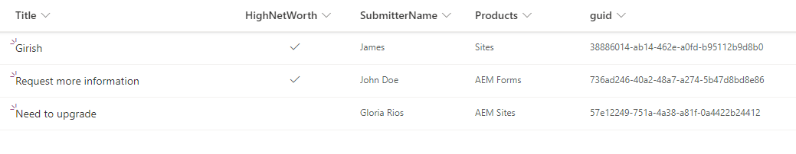

# Rellenar previamente formularios adaptables con datos de lista de puntos de uso compartido

AEM En la versión anterior del formulario de datos de formulario (6.5), se tenía que escribir código personalizado para rellenar previamente el formulario adaptable respaldado por el modelo de datos de formulario mediante el atributo de solicitud. En AEM Forms as a Cloud Service, ya no es necesario escribir código personalizado.

En este artículo se explican los pasos necesarios para rellenar previamente un formulario adaptable con datos recuperados de una lista de SharePoint mediante el servicio de prerrellenado del modelo de datos de formulario.

Este artículo supone que ha [configurado correctamente el formulario adaptable para enviar datos a la lista de SharePoint.](https://experienceleague.adobe.com/docs/experience-manager-cloud-service/content/forms/adaptive-forms-authoring/authoring-adaptive-forms-core-components/create-an-adaptive-form-on-forms-cs/configure-submit-actions-core-components.html?lang=en#connect-af-sharepoint-list)

Los siguientes son los datos de la lista de SharePoint


Para rellenar previamente un formulario adaptable con los datos asociados a un GUID concreto, se deben realizar los siguientes pasos

## Configuración del servicio Get-Service

* Cree un servicio de obtención para el objeto de nivel superior del modelo de datos de formulario con el atributo guid
  

En esta captura de pantalla, la columna guid se enlaza a través de un atributo de solicitud denominado `submissionid`.

El servicio Get-Service completamente configurado tiene este aspecto


## Configurar el formulario adaptable para utilizar el servicio de prerrellenado del modelo de datos de formulario

* Abra un formulario adaptable basado en el modelo de datos de formulario de la lista de puntos compartidos. Asociar el servicio de prerrellenado del modelo de datos de formulario
  

## Prueba del formulario

Obtenga una vista previa del formulario incluyendo `submissionid` en la dirección URL como se muestra a continuación

```html
http://localhost:4502/content/dam/formsanddocuments/contactusform/jcr:content?wcmmode=disabled&submissionid=57e12249-751a-4a38-a81f-0a4422b24412
```
