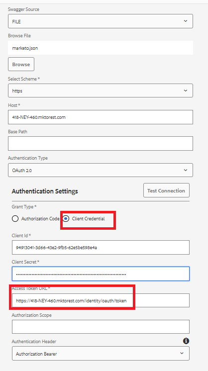

# Crear Source de datos

Las API de REST de Marketo están autenticadas con OAuth 2.0 de 2 patas. Podemos crear fácilmente una fuente de datos usando el archivo swagger descargado en el paso anterior

## Crear contenedor de configuración

* Inicie sesión en AEM.
* Haz clic en el menú de herramientas y luego en **Explorador de configuración**, como se muestra a continuación

* 

* Haz clic en **Crear** y proporciona un nombre significativo como se muestra a continuación. Asegúrese de seleccionar la opción Configuraciones de nube como se muestra a continuación

* 

## Crear servicios en la nube

* Vaya al menú de herramientas y, a continuación, haga clic en Cloud Services -> Fuentes de datos

* 

* Seleccione el contenedor de configuración creado en el paso anterior y haga clic en **Crear** para crear una nueva fuente de datos.Proporcione un nombre significativo, seleccione el servicio RESTful en la lista desplegable Tipo de servicio y haga clic en **Siguiente**
* 

* Cargue el archivo swagger y especifique el tipo de concesión, el ID de cliente, el secreto de cliente y la URL del token de acceso específicos de su instancia de Marketo, como se muestra en la captura de pantalla siguiente.

* Pruebe la conexión y, si la conexión se realiza correctamente, asegúrese de hacer clic en el botón azul **Crear** para finalizar el proceso de creación del origen de datos.

* 

## Siguientes pasos

[Crear modelo de datos de formulario](./part3.md)
