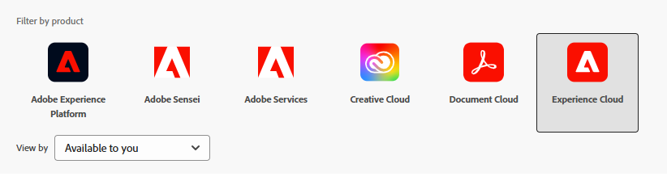

# Configuración de las API de comunicación de AEM Forms basadas en OpenAPI en AEM Forms as a Cloud Service

## Requisitos previos

* Última instancia de AEM Forms as a Cloud Service.
* Se han agregado todos los [perfiles de producto necesarios al entorno.](https://experienceleague.adobe.com/es/docs/experience-manager-learn/cloud-service/aem-apis/invoke-openapi-based-aem-apis)

* Habilite el acceso de la API de AEM al perfil del producto como se muestra a continuación
  
  

## Crear proyecto de Adobe Developer Console

Inicie sesión en [Adobe Developer Console](https://developer.adobe.com/console/) con su Adobe ID.
Para crear un nuevo proyecto, haga clic en el icono correspondiente

Asigne un nombre significativo al proyecto y haga clic en el icono Añadir API

Seleccionar Experience Cloud

Seleccione la API de comunicaciones de AEM Forms y haga clic en Siguiente

Asegúrese de haber seleccionado autenticación de servidor a servidor y haga clic en siguiente

Seleccione los perfiles y haga clic en el botón Guardar API configurada para guardar la configuración.

Haga clic en el servidor a servidor de OAuth.

Copie el ID de cliente, el secreto de cliente y los ámbitos

## Configuración de la instancia de AEM para habilitar la comunicación del proyecto ADC

Si ya tiene un proyecto de AEM Forms, [siga estas instrucciones](https://experienceleague.adobe.com/es/docs/experience-manager-learn/cloud-service/aem-apis/invoke-openapi-based-aem-apis) para habilitar la credencial ClientID de servidor a servidor OAuth del proyecto de Adobe Developer Console para que se comunique con la instancia de AEM

Si no tiene un proyecto de AEM Forms, cree un [proyecto de AEM Forms siguiendo esta documentación.](https://experienceleague.adobe.com/en/docs/experience-manager-learn/cloud-service/forms/developing-for-cloud-service/getting-started) y, a continuación, habilite la credencial ClientID de servidor a servidor OAuth del proyecto de Adobe Developer Console para comunicarse con la instancia de AEM [mediante esta documentación.](https://experienceleague.adobe.com/es/docs/experience-manager-learn/cloud-service/aem-apis/invoke-openapi-based-aem-apis)

## Siguientes pasos

[Generar token de acceso](./generate-access-token.md)
