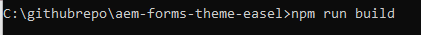

# Prueba de los cambios

Cree un formulario adaptable basado en la plantilla **&quot;En blanco con componentes principales&quot;**. Arrastre y suelte 3 botones en el formulario y etiquete &quot;Corporativo&quot;, &quot;Marketing&quot; y &quot;Predeterminado&quot;.
Asigne las variantes de estilo adecuadas a los botones Corporate y Marketing seleccionando el pincel como se muestra a continuación.

El tercer botón tendrá aplicado el estilo predeterminado.

## Creación del proyecto de tema

El siguiente paso es crear el proyecto de tema. Vaya a la carpeta raíz del proyecto de tema y ejecute el comando _**npm run build**_ como se muestra en la captura de pantalla siguiente.

Una vez que el proyecto de tema se haya creado correctamente, los usuarios están listos para probar los cambios.

## Una forma rápida y sencilla de probar su css

* Abra el archivo theme.css ubicado en la carpeta Dist del proyecto de tema. Seleccione y copie todo el contenido del archivo.
* Obtenga una vista previa del formulario creado en el paso anterior.
* Haga clic con el botón derecho en uno de los botones y seleccione Inspeccionar para abrir la consola del desarrollador.
* En la consola del desarrollador, haga clic en theme.css para abrir theme.css.
* Seleccione y elimine todo el contenido de theme.css mediante CTR-A y haga clic en el botón Eliminar.
* Copie y pegue el contenido de theme.css que creó en el paso anterior.
* Los botones deben actualizarse con los estilos adecuados, como se muestra a continuación.

## Insertar los cambios

Si está satisfecho con los cambios, puede insertarlos en su instancia de nube mediante la [canalización front-end](https://experienceleague.adobe.com/en/docs/experience-manager-learn/getting-started-wknd-tutorial-develop/enable-frontend-pipeline-devops/create-frontend-pipeline)
