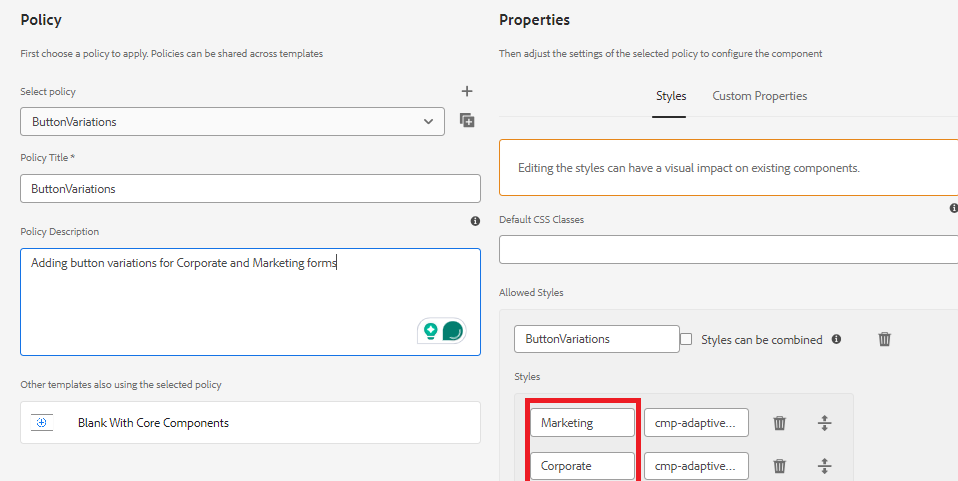

# Defina el estilo en la directiva para el componente

* AEM Inicie sesión en la instancia local de Cloud Ready y navegue hasta Herramientas. | General | Plantillas | nombre del proyecto.

* Seleccione y abra la plantilla **En blanco con componentes principales** en el modo de edición.
* Haga clic en el icono de directiva del componente Botón para abrir el editor de directivas.

* 

Defina la política como se muestra a continuación

Hemos definido 2 estilos/variaciones llamadas Marketing y Corporate. Estas variaciones están asociadas con las clases CSS correspondientes.**Asegúrese de que no haya espacio antes y después de los nombres de clase CSS**.
Guarde los cambios.

| Estilo | Clase de CSS |
|-----------|------------------------------------|
| Marketing | cmp-adaptiveform-button-marketing |
| Corporativo | cmp-adaptiveform-button-corporate |

Estas clases CSS se definirán en el archivo scss del componente (_button.scss).

## Siguientes pasos

[Definir clases CSS](./create-variations.md)
