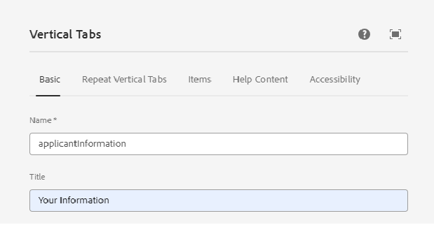
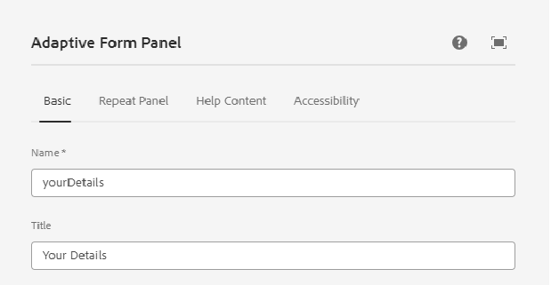
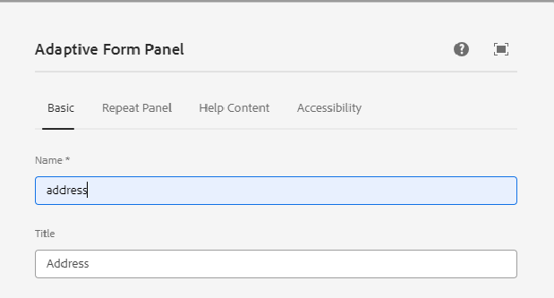

# Crear formulario adaptable

Cree un formulario adaptable basado en un componente principal e inserte un componente de pestaña vertical en el formulario.

## Configurar componente vertical

Haga clic en el componente pestañas verticales para abrir la hoja de propiedades de configuración. Configure las siguientes pestañas

1. Básico: proporcione un nombre y un título significativos al componente de pestaña vertical como se muestra a continuación
   
1. Elementos: la pestaña Elementos permite agregar elementos al componente de pestaña vertical. Por lo general, agregará un panel como elemento y, a continuación, agregará los elementos de formulario al panel. La pestaña vertical tiene dos elementos de forma predeterminada y puede asignar un nombre a los elementos según sus necesidades, tal y como se ve a continuación
   

## Configuración de paneles individuales

1. Sus detalles: seleccione el elemento 1 en el nodo **Su información** y abra la hoja de propiedades de configuración. Proporcione un nombre y un título significativos como se muestra a continuación
   

Agregue los campos siguientes al panel Sus detalles como se muestra

1. Dirección: seleccione el elemento 2 en el nodo **Su información** y abra la hoja de propiedades de configuración. Proporcione un nombre y un título significativos como se muestra a continuación
   

Agregue los dos campos de texto siguientes al panel Dirección como se muestra a continuación

