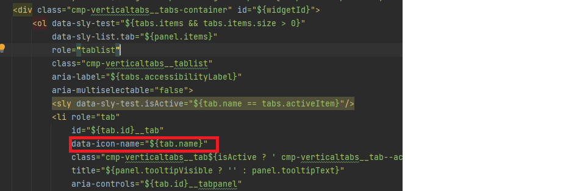

# Adición de iconos personalizados

Añadir iconos personalizados a las pestañas puede mejorar la experiencia del usuario y el atractivo visual de varias formas:

* Facilidad de uso mejorada: los iconos pueden transmitir rápidamente el propósito de cada pestaña, lo que facilita a los usuarios encontrar lo que buscan de un vistazo. Las indicaciones visuales como los iconos ayudan a los usuarios a navegar de forma más intuitiva.

* Jerarquía visual y enfoque: los iconos crean una separación más clara entre las pestañas, lo que mejora la jerarquía visual. Esto puede ayudar a que las pestañas importantes destaquen y guíen de forma eficaz la atención de los usuarios.
Siguiendo este artículo, debería poder colocar los iconos como se muestra a continuación


## Requisitos previos

Para seguir este artículo, debe estar familiarizado con Git, la creación e implementación de un proyecto de AEM mediante Cloud Manager, la configuración de una canalización front-end en AEM Cloud Manager y un poco de CSS. Si no está familiarizado con los temas mencionados anteriormente, siga [usando temas para aplicar estilo a los componentes principales](https://experienceleague.adobe.com/en/docs/experience-manager-cloud-service/content/forms/adaptive-forms-authoring/authoring-adaptive-forms-core-components/create-an-adaptive-form-on-forms-cs/using-themes-in-core-components#rename-env-file-theme-folder) del artículo.

## Agregar iconos a la temática

Abra el proyecto de tema en código de Visual Studio o en cualquier otro editor de su elección.
Añada los iconos que desee a la carpeta de imágenes.
Los iconos marcados en rojo son los nuevos iconos añadidos.


## Cree un mapa de iconos para almacenar los iconos

Cree el mapa de iconos en el archivo _variable.scss. El mapa $icon-map del SCSS es una colección de pares clave-valor, donde cada clave representa un nombre de icono (como hogar, familia, etc.) y cada valor es la ruta al archivo de imagen asociado con ese icono.


```css
$icon-map: (
    home: "./resources/images/home.png",
    family: "./resources/images/icons8-family-80.png",
    pdf: "./resources/images/pdf.png",
    income: "./resources/images/income.png",
    assets: "./resources/images/assets.png",
    cars: "./resources/images/cars.png"
);
```

## Añadir mixin

Agregue el siguiente código al archivo _mixin.scss

```css
@mixin add-icon-to-vertical-tab($image-url) {
  display: inline-flex;
  align-self: center;
  &::before {
    content: "";
    display:inline-block;
    background: url($image-url) left center / cover no-repeat;
    margin-right: 8px; /* Space between icon and text */
    height:40px;
    width:40px;
    vertical-align:middle;
    
  }
  
}
```

El mixin add-icon-to-vertical-tab está diseñado para añadir un icono personalizado junto al texto en una pestaña vertical. Permite incluir fácilmente una imagen como un icono en las pestañas, colocarla junto al texto y aplicarle estilo para garantizar la coherencia y la alineación.

Desglose del mixin, esto es lo que hace cada parte del mixin:

Parámetros:

* $image-url: La dirección URL del icono o la imagen que desea mostrar junto al texto de la pestaña. Pasar este parámetro hace que la mezcla sea versátil, ya que permite agregar diferentes iconos a diferentes pestañas según sea necesario.

* Estilos aplicados:

   * display: inline-flex: esto convierte el elemento en un contenedor flex, alineando horizontalmente cualquier contenido anidado (como el icono y el texto).
   * align-self: center: garantiza que el elemento esté centrado verticalmente dentro de su contenedor.
   * Pseudoelemento (::before):
   * content: &quot;&quot;: Inicializa el pseudoelemento ::before, que se utiliza para mostrar el icono como imagen de fondo.
   * display: inline-block: establece el pseudoelemento en inline-block, lo que le permite comportarse como un icono colocado en línea con el texto.
   * background: url($image-url) left center / cover no-repeat;: Añade la imagen de fondo mediante la URL proporcionada mediante $image-url. El icono se alinea a la izquierda y se centra verticalmente.

## Actualizar _verticaltabs.scss

Para el propósito del artículo , creé una nueva clase css (cmp-verticaltabs—marketing) para mostrar los iconos de las pestañas. En esta nueva clase ampliamos el elemento de pestaña añadiendo los iconos. La lista completa de la clase css es la siguiente

```css
.cmp-verticaltabs--marketing
{
  .cmp-verticaltabs
    {
      &__tab 
        {
          cursor:pointer;
            @each $name, $url in $icon-map {
            &[data-icon-name="#{$name}"]
              {
                  @include add-icon-to-vertical-tab($url);
              }
            }
        }
    }
}
```

## Modificación del componente de pestañas verticales

Copie el archivo verticaltabs.html de ```/apps/core/fd/components/form/verticaltabs/v1/verticaltabs/verticaltabs.html``` y péguelo en el componente verticaltabs del proyecto. Agregue la línea siguiente ```data-icon-name="${tab.name}"``` al archivo copiado bajo el rol li como se muestra en la imagen siguiente

Se está configurando un atributo de datos personalizado denominado data-icon-name con el valor del nombre de la pestaña. Si el nombre de la pestaña coincide con un nombre de imagen en el mapa de iconos, la imagen correspondiente se asocia a la pestaña.


## Prueba del código

Implemente el componente de pestañas verticales actualizado en la instancia de la nube.
Implemente el tema actualizado mediante la canalización de front-end.
Cree una variación de estilo para los componentes de la pestaña vertical como se muestra a continuación

Hemos creado una variación de estilo llamada Marketing asociada a la clase css _&#x200B;**cmp-verticaltabs—marketing**&#x200B;_.
Crear un formulario adaptable con un componente de pestaña vertical. Asocie el componente Pestaña vertical con la variación de estilo de marketing.
Agregue un par de pestañas a las pestañas verticales y asígneles un nombre que coincida con las imágenes definidas en el mapa del icono, como hogar, familia.


Previsualice el formulario; debería ver los iconos adecuados asociados a la pestaña
