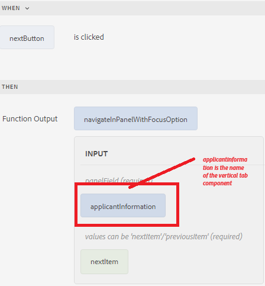

# Navegación entre las pestañas

Puede desplazarse entre las pestañas haciendo clic en las pestañas individuales o utilizando los botones Anterior y Siguiente en el formulario.
Para desplazarse mediante los botones, agregue dos botones al formulario y asígneles el nombre Anterior y Siguiente. Asocie la siguiente función personalizada con el evento de clic del botón para desplazarse entre las pestañas.

A continuación se muestra la función personalizada para desplazarse entre las pestañas.


```javascript
/**
 * Navigate in panel with focusOption
 * @name navigateInPanelWithFocusOption
 * @param {object} panelField
 * @param {string} focusOption - values can be 'nextItem'/'previousItem'
 * @param {scope} globals
 */
function navigateInPanelWithFocusOption(panelField, focusOption, globals)
{
    globals.functions.setFocus(panelField, focusOption);
}
```

El siguiente es el editor de reglas para los botones Next y Previous

**Botón Siguiente**



**Botón Anterior**


