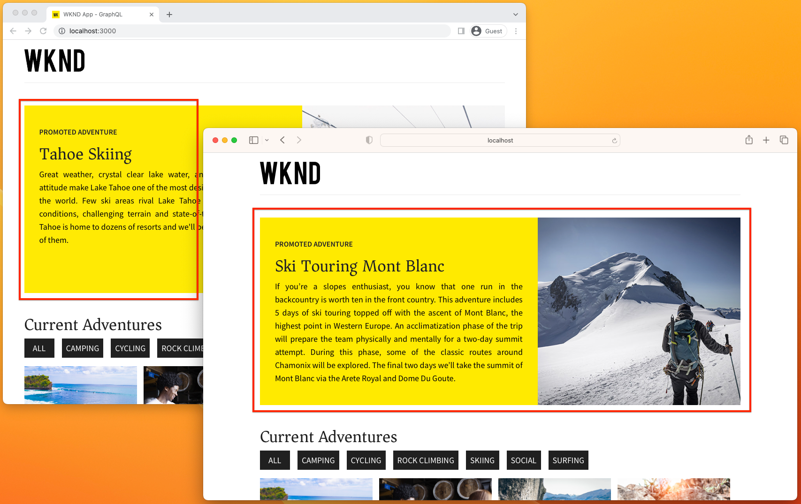

# Integración de AEM sin encabezado y Target

Obtenga información sobre cómo integrar AEM sin encabezado con Adobe Target mediante la exportación de fragmentos de contenido de AEM a Adobe Target y utilícelos para personalizar experiencias sin encabezado mediante alloy.js de Adobe Experience Platform Web SDK. La aplicación [React WKND](https://experienceleague.adobe.com/docs/experience-manager-learn/getting-started-with-aem-headless/how-to/example-apps/react-app.html?lang=es) se usa para explorar cómo se puede agregar a la experiencia una actividad de Target personalizada mediante Ofertas de fragmentos de contenido para promocionar una aventura WKND.

>[!VIDEO](https://video.tv.adobe.com/v/3422160/?quality=12&learn=on&captions=spa)

El tutorial cubre los pasos necesarios para configurar AEM y Adobe Target:

1. [Crear configuración de Adobe IMS para Adobe Target](#adobe-ims-configuration) en AEM Author
2. [Crear Adobe Target Cloud Service](#adobe-target-cloud-service) en AEM Author
3. [Aplicar Adobe Target Cloud Service a carpetas de AEM Assets](#configure-asset-folders) en AEM Author
4. [Permiso para Adobe Target Cloud Service](#permission) en Adobe Admin Console
5. [Exportar fragmentos de contenido](#export-content-fragments) de AEM Author a Target
6. [Crear una actividad mediante ofertas de fragmentos de contenido](#activity) en Adobe Target
7. [Crear una secuencia de datos de Experience Platform](#datastream-id) en Experience Platform
8. [Integre personalización en una aplicación sin encabezado de AEM basada en React](#code) mediante Adobe Web SDK.

## Configuración de IMS de Adobe{#adobe-ims-configuration}

Una configuración de IMS de Adobe que facilita la autenticación entre AEM y Adobe Target.

Revise [la documentación](https://experienceleague.adobe.com/es/docs/experience-manager-learn/cloud-service/integrations/target#adobe-target-cloud-service) para obtener instrucciones paso a paso sobre cómo crear una configuración de IMS de Adobe.

## Adobe Target Cloud Service{#adobe-target-cloud-service}

Se crea un Cloud Service de Adobe Target en AEM para facilitar la exportación de fragmentos de contenido a Adobe Target.

Revise [la documentación](https://experienceleague.adobe.com/docs/experience-manager-cloud-service/content/sites/integrations/integrating-adobe-target.html?lang=es) para obtener instrucciones paso a paso sobre cómo crear un Cloud Service de Adobe Target.

>[!VIDEO](https://video.tv.adobe.com/v/3422647/?quality=12&learn=on&captions=spa)


## Configuración de carpetas de recursos{#configure-asset-folders}

Adobe Target Cloud Service, configurado en una configuración según el contexto, debe aplicarse a la jerarquía de carpetas de AEM Assets que contiene los fragmentos de contenido para exportar a Adobe Target.

+++Amplíe para obtener instrucciones paso a paso

1. Inicie sesión en __AEM Author service__ como administrador de DAM
1. Vaya a __Assets > Archivos__ y busque la carpeta de recursos a la que se ha aplicado `/conf`
1. Seleccione la carpeta de recursos y seleccione __Propiedades__ en la barra de acciones superior
1. Seleccione la ficha __Cloud Services__
1. Asegúrese de que la Configuración de nube está establecida en la configuración según el contexto (`/conf`) que contiene la configuración de Adobe Target Cloud Services.
1. Seleccione __Adobe Target__ del menú desplegable __Configuraciones de Cloud Service__.
1. Seleccione __Guardar y cerrar__ en la parte superior derecha

+++

<br/>

>[!VIDEO](https://video.tv.adobe.com/v/3422655/?quality=12&learn=on&captions=spa)

## Permiso de la integración con AEM Target{#permission}

La integración de Adobe Target, que se manifiesta como un proyecto developer.adobe.com, debe tener la función de producto __Editor__ en Adobe Admin Console para poder exportar fragmentos de contenido a Adobe Target.

+++Amplíe para obtener instrucciones paso a paso

1. Inicie sesión en Experience Cloud como un usuario que pueda administrar el producto Adobe Target en Adobe Admin Console
1. Abrir [Adobe Admin Console](https://adminconsole.adobe.com)
1. Seleccione __Productos__ y luego abra __Adobe Target__
1. En la ficha __Perfiles de producto__, seleccione __*DefaultWorkspace*__
1. Seleccione la ficha __Credenciales de API__
1. Busque su aplicación developer.adobe.com en esta lista y establezca su __función del producto__ en __Editor__

+++

<br/>

>[!VIDEO](https://video.tv.adobe.com/v/3441976/?quality=12&learn=on&captions=spa)

## Exportar fragmentos de contenido a Target{#export-content-fragments}

Los fragmentos de contenido que existen en la [jerarquía de carpetas de AEM Assets configurada](#apply-adobe-target-cloud-service-to-aem-assets-folders) se pueden exportar a Adobe Target como ofertas de fragmentos de contenido. Estas ofertas de fragmentos de contenido, una forma especial de ofertas JSON en Target, se pueden utilizar en actividades de Target para ofrecer experiencias personalizadas en aplicaciones sin encabezado.

+++Amplíe para obtener instrucciones paso a paso

1. Inicie sesión en __AEM Author__ como usuario de DAM
1. Vaya a __Assets > Archivos__ y busque los fragmentos de contenido que desea exportar como JSON a Target en la carpeta &quot;Adobe Target habilitado&quot;
1. Seleccione los fragmentos de contenido que desea exportar a Adobe Target
1. Seleccione __Exportar a ofertas de Adobe Target__ en la barra de acciones superior
   + Esta acción exporta la representación JSON completamente hidratada del fragmento de contenido a Adobe Target como una &quot;Oferta de fragmento de contenido&quot;
   + La representación JSON completamente hidratada se puede revisar en AEM
      + Seleccione el fragmento de contenido
      + Expandir el panel lateral
      + Seleccione el icono __Vista previa__ en el panel lateral izquierdo
      + La representación JSON exportada a Adobe Target se muestra en la vista principal
1. Inicie sesión en [Adobe Experience Cloud](https://experience.adobe.com) con un usuario en la función de editor de Adobe Target
1. En [Experience Cloud](https://experience.adobe.com), seleccione __Target__ del conmutador de productos en la parte superior derecha para abrir Adobe Target.
1. Asegúrese de que Workspace predeterminado está seleccionado en el __conmutador Workspace__ en la parte superior derecha.
1. Seleccione la ficha __Ofertas__ en la barra de navegación superior
1. Seleccione el menú desplegable __Tipo__ y seleccione __Fragmentos de contenido__
1. Compruebe que el fragmento de contenido exportado desde AEM aparece en la lista
   + Pase el ratón sobre la oferta y seleccione el botón __Ver__
   + Revise la __Información de la oferta__ y vea el __vínculo profundo de AEM__ que abre el fragmento de contenido directamente en el servicio de AEM Author

+++

<br/>

>[!VIDEO](https://video.tv.adobe.com/v/3422671/?quality=12&learn=on&captions=spa)

## Actividad de Target que utiliza ofertas de fragmentos de contenido{#activity}

En Adobe Target, se puede crear una actividad que utilice la oferta de fragmento de contenido JSON como contenido, lo que permite experiencias personalizadas en una aplicación sin encabezado con contenido creado y administrado en AEM.

En este ejemplo, utilizamos una actividad A/B simple, aunque se puede utilizar cualquier actividad de Target.

+++Amplíe para obtener instrucciones paso a paso

1. Seleccione la ficha __Actividades__ en la barra de navegación superior
1. Seleccione __+ Crear actividad__ y, a continuación, seleccione el tipo de actividad que desea crear.
   + Este ejemplo crea una __Prueba A/B__ simple, pero las ofertas de fragmentos de contenido pueden activar cualquier tipo de actividad
1. En el asistente __Crear actividad__
   + Seleccionar __Web__
   + En __Elegir Compositor de experiencias__, seleccione __Formulario__
   + En __Elegir Workspace__, seleccione __Workspace predeterminado__
   + En __Elegir propiedad__, seleccione la propiedad en la que está disponible la actividad o seleccione __Sin restricciones de propiedad__ para permitir que se utilice en todas las propiedades.
   + Seleccione __Siguiente__ para crear la actividad
1. Cambie el nombre de la actividad seleccionando __Rename__ en la parte superior izquierda
   + Dé un nombre significativo a la actividad
1. En la experiencia inicial, establezca __Ubicación 1__ para la actividad en destino
   + En este ejemplo, establezca como destino una ubicación personalizada denominada `wknd-adventure-promo`
1. En __Contenido__, seleccione el contenido predeterminado y seleccione __Cambiar fragmento de contenido__
1. Seleccione el fragmento de contenido exportado para esta experiencia y seleccione __Listo__
1. Revise el JSON de oferta de fragmento de contenido en el área de texto Contenido; es el mismo JSON disponible en el servicio de AEM Author a través de la acción Vista previa del fragmento de contenido.
1. En el carril izquierdo, añada una experiencia y seleccione una oferta de fragmento de contenido diferente para ofrecer
1. Seleccione __Siguiente__ y configure las reglas de segmentación según sea necesario para la actividad
   + En este ejemplo, deje la prueba A/B como una división manual al 50/50.
1. Seleccione __Siguiente__ y complete la configuración de la actividad
1. Seleccione __Guardar y cerrar__ y asígnele un nombre significativo
1. En la lista desplegable Actividad en Adobe Target, seleccione __Activar__ en la lista desplegable Inactiva/Activar/Archivar de la parte superior derecha.

La actividad de Adobe Target dirigida a la ubicación `wknd-adventure-promo` ahora se puede integrar y exponer en una aplicación sin encabezado de AEM.

+++

<br/>

>[!VIDEO](https://video.tv.adobe.com/v/3444784/?quality=12&learn=on&captions=spa)

## ID de flujo de datos Experience Platform{#datastream-id}

Se requiere un identificador de [Adobe Experience Platform Datastream](https://experienceleague.adobe.com/docs/platform-learn/implement-web-sdk/initial-configuration/configure-datastream.html?lang=es) para que las aplicaciones sin encabezado de AEM interactúen con Adobe Target mediante [Adobe Web SDK](https://experienceleague.adobe.com/docs/experience-platform/edge/fundamentals/configuring-the-sdk.html?lang=es).

+++Amplíe para obtener instrucciones paso a paso

1. Vaya a [Adobe Experience Cloud](https://experience.adobe.com/)
1. Abrir __Experience Platform__
1. Seleccione __Recopilación de datos > Flujos de datos__ y seleccione __Nuevo flujo de datos__
1. En el asistente Nuevo flujo de datos, introduzca:
   + Nombre: `AEM Target integration`
   + Descripción: `Datastream used by the Adobe Web SDK to serve personalized Content Fragments Offers.`
   + Esquema de evento: `Leave blank`
1. Seleccionar __Guardar__
1. Seleccionar __Agregar servicio__
1. En __Servicio__, seleccione __Adobe Target__
   + Habilitado: __Sí__
   + Token de propiedad: __Dejar en blanco__
   + Id. de entorno de destino: __Dejar en blanco__
      + El entorno de destino se puede establecer en Adobe Target en __Administración > Hosts__.
   + Espacio de nombres de ID de terceros de destino: __Dejar en blanco__
1. Seleccionar __Guardar__
1. En el lado derecho, copie la __ID de secuencia de datos__ para usarla en la llamada de configuración de [Adobe Web SDK](https://experienceleague.adobe.com/docs/experience-platform/edge/fundamentals/configuring-the-sdk.html?lang=es).

+++

<br/>

>[!VIDEO](https://video.tv.adobe.com/v/3422182/?quality=12&learn=on&captions=spa)

## Añadir personalización en una aplicación sin encabezado de AEM{#code}

Este tutorial explora la personalización de una aplicación React simple mediante Ofertas de fragmentos de contenido en Adobe Target a través de [Adobe Experience Platform Web SDK](https://experienceleague.adobe.com/docs/experience-platform/edge/home.html?lang=es). Este método se puede utilizar para personalizar cualquier experiencia web basada en JavaScript.

Las experiencias móviles de Android™ y iOS se pueden personalizar siguiendo patrones similares con [Adobe Mobile SDK](https://developer.adobe.com/client-sdks/documentation/).

### Requisitos previos

+ Node.js 14
+ Git
+ [WKND compartido 2.1.4+](https://github.com/adobe/aem-guides-wknd-shared/releases/latest) instalado en AEM as a Cloud Author y Publish Services

### Configuración de

1. Descargue el código fuente de la aplicación React de ejemplo de [Github.com](https://github.com/adobe/aem-guides-wknd-graphql)

   ```shell
   $ mkdir -p ~/Code
   $ git clone git@github.com:adobe/aem-guides-wknd-graphql.git
   ```

1. Abrir base de código en `~/Code/aem-guides-wknd-graphql/personalization-tutorial` en su IDE favorito
1. Actualice el host del servicio AEM al que desea que se conecte la aplicación a `~/Code/aem-guides-wknd-graphql/personalization-tutorial/src/.env.development`

   ```
   ...
   REACT_APP_HOST_URI=https://publish-p1234-e5678.adobeaemcloud.com/
   ...
   ```

1. Ejecute la aplicación y asegúrese de que se conecta al servicio de AEM configurado. Desde la línea de comandos, ejecute:

   ```shell
   $ cd ~/Code/aem-guides-wknd-graphql/personalization-tutorial
   $ npm install
   $ npm run start
   ```

1. Instale [Adobe Web SDK](https://experienceleague.adobe.com/docs/experience-platform/edge/fundamentals/installing-the-sdk.html?lang=es#option-3%3A-using-the-npm-package) como paquete NPM.

   ```shell
   $ cd ~/Code/aem-guides-wknd-graphql/personalization-tutorial
   $ npm install @adobe/alloy
   ```

   La SDK web se puede utilizar en el código para recuperar la oferta de fragmento de contenido JSON por ubicación de actividad.

   Al configurar Web SDK, se requieren dos ID:

   + `edgeConfigId`, que es el [ID de secuencia de datos](#datastream-id)
   + `orgId` el ID de organización de Adobe de AEM as a Cloud Service/Target que se puede encontrar en __Experience Cloud > Perfil > Información de cuenta > ID de organización actual__

   Al invocar Web SDK, la ubicación de la actividad Adobe Target (en nuestro ejemplo, `wknd-adventure-promo`) debe establecerse como el valor de la matriz `decisionScopes`.

   ```javascript
   import { createInstance } from "@adobe/alloy";
   const alloy = createInstance({ name: "alloy" });
   ...
   alloy("config", { ... });
   alloy("sendEvent", { ... });
   ```

### Implementación

1. Cree un componente de React `AdobeTargetActivity.js` para las actividades de Adobe Target.

   __src/components/AdobeTargetActivity.js__

   ```javascript
   import React, { useEffect } from 'react';
   import { createInstance } from '@adobe/alloy';
   
   const alloy = createInstance({ name: 'alloy' });
   
   alloy('configure', { 
     'edgeConfigId': 'e3db252d-44d0-4a0b-8901-aac22dbc88dc', // AEP Datastream ID
     'orgId':'7ABB3E6A5A7491460A495D61@AdobeOrg',
     'debugEnabled': true,
   });
   
   export default function AdobeTargetActivity({ activityLocation, OfferComponent }) { 
     const [offer, setOffer] = React.useState();
   
     useEffect(() => {
       async function sendAlloyEvent() {
         // Get the activity offer from Adobe Target
         const result = await alloy('sendEvent', {
           // decisionScopes is set to an array containing the Adobe Target activity location
           'decisionScopes': [activityLocation],
         });
   
         if (result.propositions?.length > 0) {
           // Find the first proposition for the active activity location
           var proposition = result.propositions?.filter((proposition) => { return proposition.scope === activityLocation; })[0];
   
           // Get the Content Fragment Offer JSON from the Adobe Target response
           const contentFragmentOffer = proposition?.items[0]?.data?.content || { status: 'error', message: 'Personalized content unavailable'};
   
           if (contentFragmentOffer?.data) {
             // Content Fragment Offers represent a single Content Fragment, hydrated by
             // the byPath GraphQL query, we must traverse the JSON object to retrieve the 
             // Content Fragment JSON representation
             const byPath = Object.keys(contentFragmentOffer.data)[0];
             const item = contentFragmentOffer.data[byPath]?.item;
   
             if (item) {
               // Set the offer to the React state so it can be rendered
               setOffer(item);
   
               // Record the Content Fragment Offer as displayed for Adobe Target Activity reporting
               // If this request is omitted, the Target Activity's Reports will be blank
               alloy("sendEvent", {
                   xdm: {
                       eventType: "decisioning.propositionDisplay",
                       _experience: {
                           decisioning: {
                               propositions: [proposition]
                           }
                       }
                   }
               });          
             }
           }
         }
       };
   
       sendAlloyEvent();
   
     }, [activityLocation, OfferComponent]);
   
     if (!offer) {
       // Adobe Target offer initializing; we render a blank component (which has a fixed height) to prevent a layout shift
       return (<OfferComponent></OfferComponent>);
     } else if (offer.status === 'error') {
       // If Personalized content could not be retrieved either show nothing, or optionally default content.
       console.error(offer.message);
       return (<></>);
     }
   
     console.log('Activity Location', activityLocation);
     console.log('Content Fragment Offer', offer);
   
     // Render the React component with the offer's JSON
     return (<OfferComponent content={offer} />);
   };
   ```

   El componente React de actividad de Adobe Target se invoca de la siguiente manera:

   ```jsx
   <AdobeTargetActivity activityLocation={"wknd-adventure-promo"} OfferComponent={AdventurePromo}/>
   ```

1. Cree un componente de React `AdventurePromo.js` para procesar los servidores de Adobe Target JSON de aventura.

   Este componente de React toma el JSON completamente hidratado, que representa un fragmento de contenido de aventura y se muestra de forma promocional. Los componentes de React que muestran el JSON atendido desde Ofertas de fragmentos de contenido de Adobe Target pueden ser tan variados y complejos como sea necesario en función de los fragmentos de contenido que se exportan a Adobe Target.

   __src/components/AdventurePromo.js__

   ```javascript
   import React from 'react';
   
   import './AdventurePromo.scss';
   
   /**
   * @param {*} content is the fully hydrated JSON data for a WKND Adventure Content Fragment
   * @returns the Adventure Promo component
   */
   export default function AdventurePromo({ content }) {
       if (!content) {
           // If content is still loading, then display an empty promote to prevent layout shift when Target loads the data
           return (<div className="adventure-promo"></div>)
       }
   
       const title = content.title;
       const description = content?.description?.plaintext;
       const image = content.primaryImage?._publishUrl;
   
       return (
           <div className="adventure-promo">
               <div className="adventure-promo-text-wrapper">
                   <h3 className="adventure-promo-eyebrow">Promoted adventure</h3>
                   <h2 className="adventure-promo-title">{title}</h2>
                   <p className="adventure-promo-description">{description}</p>
               </div>
               <div className="adventure-promo-image-wrapper">
                   
               </div>
           </div>
       )
   }
   ```

   __src/components/AdventurePromo.scss__

   ```css
   .adventure-promo {
       display: flex;
       margin: 3rem 0;
       height: 400px;
   }
   
   .adventure-promo-text-wrapper {
       background-color: #ffea00;
       color: black;
       flex-grow: 1;
       padding: 3rem 2rem;
       width: 55%;
   }
   
   .adventure-promo-eyebrow {
       font-family: Source Sans Pro,Helvetica Neue,Helvetica,Arial,sans-serif;
       font-weight: 700;
       font-size: 1rem;
       margin: 0;
       text-transform: uppercase;
   }
   
   .adventure-promo-description {
       line-height: 1.75rem;
   }
   
   .adventure-promo-image-wrapper {
       height: 400px;
       width: 45%;
   }
   
   .adventure-promo-image {
       height: 100%;
       object-fit: cover;
       object-position: center center;
       width: 100%;
   }
   ```

   Este componente React se invoca de la siguiente manera:

   ```jsx
   <AdventurePromo adventure={adventureJSON}/>
   ```

1. Agregue el componente AdobeTargetActivity al `Home.js` de la aplicación React sobre la lista de aventuras.

   __src/components/Home.js__

   ```javascript
   import AdventurePromo from './AdventurePromo';
   import AdobeTargetActivity from './AdobeTargetActivity';
   ... 
   export default function Home() {
       ...
       return(
           <div className="Home">
   
             <AdobeTargetActivity activityLocation={"wknd-adventure-promo"} OfferComponent={AdventurePromo}/>
   
             <h2>Current Adventures</h2>
             ...
       )
   }
   ```

1. Si la aplicación React no se está ejecutando, reinicie con `npm run start`.

   Abra la aplicación React en dos exploradores diferentes, de modo que permita que la prueba A/B ofrezca las diferentes experiencias a cada explorador. Si ambos navegadores muestran la misma oferta de aventura, intente cerrar o volver a abrir uno de los navegadores hasta que se muestre la otra experiencia.

   La siguiente imagen muestra las dos ofertas de fragmentos de contenido diferentes que se muestran para la actividad `wknd-adventure-promo`, según la lógica de Adobe Target.

   

## Enhorabuena.

Ahora que hemos configurado AEM as a Cloud Service para exportar fragmentos de contenido a Adobe Target, hemos utilizado las ofertas de fragmentos de contenido en una actividad de Adobe Target y hemos mostrado esa actividad en una aplicación sin encabezado de AEM para personalizar la experiencia.
