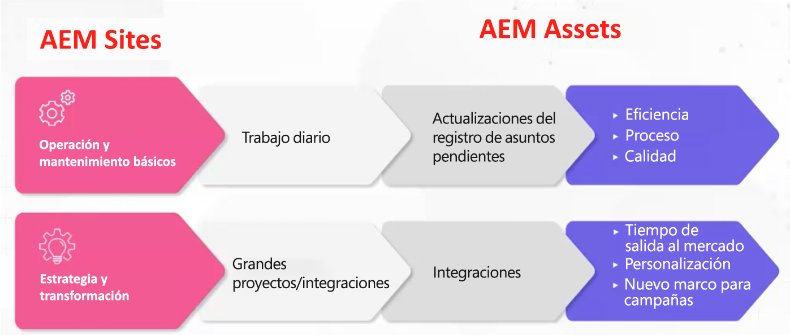

# Adobe Experience Manager (AEM): modelos y arquetipos de administración y dotación de personal

Como líder de experiencia del cliente, el Adobe comprende lo difícil que puede ser para usted garantizar que tenga el personal y el marco de gobierno adecuados para impulsar la eficacia operativa. Con los modelos probados de administración y dotación de personal de la industria de Adobe, usted tiene las herramientas y el conocimiento para crear una base sólida de gestión de contenido y recursos. En este artículo, analizaremos las formas de poner en marcha su plataforma de Adobe Experience Manager (AEM) y sacar el máximo partido de sus esfuerzos.

## Crear un marco operativo superior

Para poder ejecutar y operar AEM considere los siguientes elementos:

* Ejecutar hitos estratégicos : Habrá muchos hitos estratégicos, (personalización, integración multicanal, etc.) que no se puede ejecutar a menos que tenga el modelo de plantilla adecuado.
* Crear una base para la transformación digital: AEM se utiliza a menudo como el primer paso en el proceso de modernización de una organización. La configuración de una base le permite aprovechar AEM a toda su capacidad.
* Participación del usuario: Pida a un equipo que ejecute un trabajo táctico (actualizar flujos de trabajo, permisos, CSS, etc.) Cuantos más espacios haya entre lo que los usuarios quieren y lo que les dan, más frustrados se pueden volver. Es importante mantener a los usuarios invertidos en el sistema, invertidos en la solución y que tenga el modelo operativo correcto.

Entonces, ¿cuál es el modelo correcto? ¿Cuál es la matriz de funciones correcta para crear?

No hay una sola respuesta específica porque, al igual que las organizaciones varían considerablemente, una configuración AEM también puede variar considerablemente, lo que hace que se necesiten diferentes funciones de apoyo. Cada vertical, cada sector y cada estructura de equipo requerirán una implementación diferente. Pero puede crear una línea de base estableciendo arquetipos.

## Arquetipos

Los tipos de archivo son ideas de funciones específicas y de alto nivel que se asignan a atributos específicos. Esto a su vez puede utilizarse para crear una premisa fundamental que ayude a informar qué modelo realmente necesita. Es importante tener en cuenta que los arquetipos no están limitados a una persona por tipo de archivo. Por ejemplo, un bibliotecario de DAM podría tener cierta experiencia técnica.

### Flujos de operacionalización

Existen dos flujos de operacionalización para [!DNL AEM Sites] y [!DNL AEM Assets]:

1. Ejecución básica y funcionamiento del trabajo diario (actualización de metadatos)

1. Estrategia y trabajo de transformación, como grandes proyectos interinstitucionales

### Funciones de recursos de AEM de alto nivel

**Brecha general:** Esta línea de base admite modelos centralizados y descentralizados. Si tiene un modelo descentralizado, AEM puede utilizarse de forma abstracta. Tenga en cuenta que la función Propietario del producto debe usarse de forma creativa, pero también debe tener un Propietario del producto que posea los distintos estilos para un tipo de recurso y otro que supervise toda la organización.

1. Funciones básicas de ejecución y funcionamiento

   * Recurso técnico: Alguien que tenga AEM experiencia comprende los permisos y puede actualizar el esquema de metadatos
   * Administrador de versiones
   * Propietario del producto: esta es una función que se alinea con la solución. Algunos propietarios de productos pueden participar en analytics.
   * Bibliotecario de DAM : es alguien que puede ayudar a guiar los procesos del marco integrativo. Esta función creativa puede superponerse a otras funciones. (Nota: este es un papel que ha crecido en popularidad en los últimos cinco años).
   * Elemento creativo

1. Estrategia y transformación

   * Equipo de desarrollo: este equipo es necesario para participar en un hito estratégico importante.
   * Business Architect: desarrolla requisitos para ayudar en hitos técnicos e iniciativas estratégicas; se puede compensar con un propietario de producto adicional
   * Arquitecto técnico: alguien que tiene comprensión a nivel empresarial y está presente constantemente en toda la organización. Este rol sirve como el punto central de la verdad de DAM.

**Situaciones de ejemplo**

1. **Ejecute y opere:**

Los siguientes son ejemplos de uso de escenarios ligeros (empresa de ropa deportiva) y pesados (empresa cosmética):

1. Light - Funciones de compañía de ropa deportiva:

   * 2 desarrolladores a tiempo parcial: tiempo parcial, offshore
   * 1 Propietario del producto - Tiempo completo, en tierra
   * 1 Biblioteca DAM - Tiempo completo, en tierra
   * 1 Arquitecto Técnico - Tiempo parcial, en tierra
   * 1 Administrador de versiones: tiempo parcial, en tierra

1. Heavy - Cosmetics company (Multi-Brand)

   * 3 desarrolladores a tiempo completo: tiempo completo, offshore
   * 4 propietarios de productos: 3 específicos de marca, 1 principal
   * 1 Biblioteca DAM - Tiempo completo, en tierra
   * 4 principales administradores PYME por marca
   * 1 Arquitecto Técnico

### Alto nivel [!DNL AEM Sites] roles

1. Ejecución básica y funcionamiento

   **Brecha general:** Los desarrolladores de CSS crean nuevos aspectos para los componentes. El Adobe Sr Business Consultant, Joseph Van Buskirk, recomienda &quot;Obtener componentes sin corchetes y sistemas de estilos. Esta es la función que impulsa el ahorro de costos. El 80 % de las experiencias que se crean deben realizarse con componentes principales o creados previamente&quot;. El objetivo es reutilizar componentes principales o personalizados con nuevos estilos mediante un desarrollador de CSS (o un equipo de desarrollo de front-end) .

   Ejemplos de funciones:

   * Desarrollo de CSS: crea artefactos de experiencia mediante la reutilización de componentes con nuevos estilos.
   * Desarrollo del back-end: crea nuevos componentes o puede ampliar un componente principal. Si se realiza correctamente, esta función no debe tener más de una persona, a menos que sea necesario realizar grandes tareas de animación.
   * Administración de versiones : supervisa la implementación del código y sirve como ingeniero de éxito del cliente actual.
   * Propietario del producto - colabora con la UB en la unión de visiones técnicas y estratégicas; crea tareas y mejoras de mantenimiento y sirve como propietario empresarial de la solución.
   * Autores administradores : actualiza el aspecto del CSS y proporciona instrucciones a los autores que actualizan y aplican contenido. Esta función funciona en las configuraciones de flujo de trabajo y crea documentación de guía para los autores de contenido que desea aplicar. NOTA: En la versión 6.5, Adobe recomienda utilizar plantillas editables.
   * Autores de contenido : aplica el contenido, la propiedad en niveles y ofrece problemas y preocupaciones de comunicación a medida que surgen con el CSM.

1. Estrategia y transformación

   Ejemplos de funciones:

   * Equipo de desarrollo: proporciona AEM conocimientos y ejecuta nuevos hitos transformadores con el Arquitecto Técnico.
   * Arquitecto Técnico: proporciona conocimientos de integración, trabaja con el propietario del producto para mapear hitos técnicos y ofrece un profundo conocimiento técnico de AEM.
   * Arquitecto de negocios : crea tareas para historias de usuarios y ayuda al propietario del producto a administrar hitos técnicos y empresariales.

### Situaciones de ejemplo

Los siguientes son ejemplos de funciones para un escenario cliente ligero y pesado:

1. Claro

   * 2 desarrolladores de CSS - en tierra
   * 1 Propietario del producto - tiempo completo, en tierra
   * 1 Desarrollador back-end - offshore
   * 1 Arquitecto técnico - en tierra
   * 1 Gestor de versiones: tiempo parcial, en tierra

1. Pesado (centrado en la campaña)

   * 4 desarrolladores de CSS: tiempo completo, en tierra
   * 2 desarrolladores back-end: tiempo completo, en tierra
   * 1 Arquitecto técnico - en tierra
   * 1 Propietario del producto
   * 2 Arquitectos de negocios - offshore

### Principales seguimientos

**Comprender los arquetipos** — Empiece lentamente, comprenda y analice los arquetipos. Sea creativo y flexible, teniendo en cuenta que no hay un modelo correcto que seguir.

**Comprender su hoja de ruta** - Algunas organizaciones tienen muchos hitos que desean ejecutar. Prepárese para asignar más recursos técnicos de lo que puede estimar.

**Aprovechar los recursos internos** - Las brechas pueden producirse de forma inesperada. Es posible que pueda rellenarlos más rápidamente contratando miembros internos del equipo, en lugar de buscar fuera de la organización.

Para un debate más profundo sobre Gobernanza y Modelos de Personal y Arquetipos, escuche esta mesa redonda de una hora: [Arquetipos de funciones y creación de un marco operativo para [!DNL AEM Assets] y [!DNL Sites]](https://adobecustomersuccess.adobeconnect.com/p8ml5nmy0758mp4/)

Obtenga más información sobre la estrategia y el liderazgo mental en [Éxito del cliente](https://experienceleague.adobe.com/docs/customer-success/customer-success/overview.html) hub.
