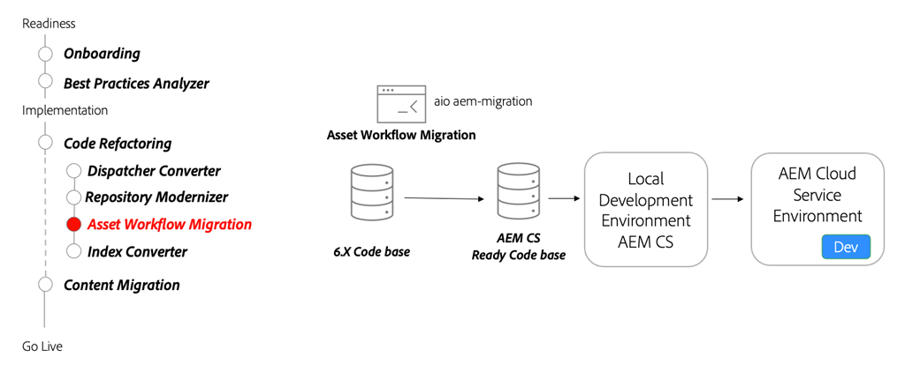

# Microservicios de AEM Assets: paso a AEM as a Cloud Service

Descubra cómo los microservicios de asset compute de AEM Assets as a Cloud Service le permiten generar de forma automática y eficaz cualquier representación para sus recursos, sustituyendo esta función del flujo de trabajo AEM tradicional.

>[!VIDEO](https://video.tv.adobe.com/v/336990/?quality=12&learn=on)

## Herramienta de migración del flujo de trabajo

Como parte de la refactorización de la base de código, utilice la variable [Herramienta Migración del flujo de trabajo de recursos](https://experienceleague.adobe.com/docs/experience-manager-cloud-service/moving/refactoring-tools/asset-workflow-migration-tool.html) para migrar flujos de trabajo existentes para utilizar los microservicios de Asset compute en AEM as a Cloud Service.

## Actividades clave

+ Utilice la variable [Migración del flujo de trabajo de Adobe I/O](https://github.com/adobe/aio-cli-plugin-aem-cloud-service-migration#command-aio-aem-migrationworkflow-migrator) herramienta para migrar flujos de trabajo de procesamiento de recursos para utilizar los microservicios de Asset compute.
+ Configure un [entorno de desarrollo local](https://experienceleague.adobe.com/docs/experience-manager-learn/cloud-service/local-development-environment-set-up/overview.html?lang=es) e implemente los flujos de trabajo actualizados. Puede ser necesario realizar un ajuste manual para flujos de trabajo complejos.
+ Continúe iterando en un entorno de desarrollo local mediante el SDK de AEM hasta que el flujo de trabajo actualizado coincida con la paridad de características.
+ Implemente la base de código actualizada en un entorno de desarrollo as a Cloud Service AEM y continúe validando.

## Ejercicio práctico

Aplique sus conocimientos probando lo que ha aprendido con este ejercicio práctico.

Antes de intentar el ejercicio práctico, asegúrese de haber visto y comprendido el vídeo de arriba y los siguientes materiales:

+ [Pensar de forma diferente en AEM as a Cloud Service](./introduction.md)
+ [Incorporación](./onboarding.md)

Además, asegúrese de haber completado el ejercicio práctico anterior:

+ [Ejercicio práctico de búsqueda e indexación](./search-and-indexing.md#hands-on-exercise)

<table style="border-width:0">
    <tr>
        <td style="width:150px">
                    
        </td>
        <td style="width:100%;margin-bottom:1rem;">
            
Uso compartido con la carga de recursos

            

                Explore cómo definir y asignar perfiles de procesamiento de AEM Assets a carpetas y cargar recursos a AEM mediante el módulo npm CLI "aem-upload".
            

            <a  rel="noreferrer"
                target="_blank"
                href="https://github.com/adobe/aem-cloud-engineering-video-series-exercises/tree/session8-assets#cloud-acceleration-bootcamp---session-8-assets-and-microservices" class="spectrum-Button spectrum-Button--primary spectrum-Button--sizeM">
                Pruebe la administración de recursos
            </a>
        </td>
    </tr>
</table>
