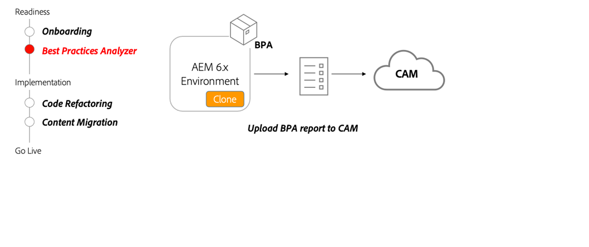

# Analizador de prácticas recomendadas y Cloud Acceleration Manager

Descubra cómo Best Practices Analyzer (BPA) y Cloud Acceleration Manager (CAM) proporcionan una guía personalizada para migrar a AEM as a Cloud Service. 

>[!VIDEO](https://video.tv.adobe.com/v/336957/?quality=12&learn=on)

## Uso de BPA y CAM

El paquete BPA debe instalarse en un clon del entorno de producción AEM 6.x. El BPA generará un informe que luego podrá cargarse en el CAM, que proporcionará orientación sobre las actividades clave que deben llevarse a cabo para pasar a AEM as a Cloud Service.

## Actividades clave

+ Haga un clon de su entorno de producción 6.x. A medida que migra contenido y refactoriza código, tener un clon de un entorno de producción será valioso para probar varias herramientas y cambios.
+ Descargue la herramienta de BPA más reciente de [Portal de distribución de software](https://experience.adobe.com/#/downloads/content/software-distribution/es-ES/aemcloud.html) e instale en su entorno clonado con AEM 6.x.
+ Utilice la herramienta BPA para generar un informe que se pueda cargar en Cloud Acceleration Manager (CAM). Se accede a CAM a través de [https://experience.adobe.com/](https://experience.adobe.com/) > **Experience Manager** > **Cloud Acceleration Manager**.
+ Utilice CAM para proporcionar instrucciones sobre las actualizaciones que se deben realizar en la base de código y el entorno actuales para poder pasar a AEM as a Cloud Service.

## Ejercicio práctico

Aplique sus conocimientos probando lo que ha aprendido con este ejercicio práctico.

Antes de intentar el ejercicio práctico, asegúrese de haber visto y comprendido el vídeo de arriba y los siguientes materiales:

+ [Pensar de forma diferente en AEM as a Cloud Service](./introduction.md)
+ [¿Qué es AEM as a Cloud Service?](https://experienceleague.adobe.com/docs/experience-manager-learn/cloud-service/introduction/what-is-aem-as-a-cloud-service.html?lang=en)
+ [Arquitectura de AEM as a Cloud Service](https://experienceleague.adobe.com/docs/experience-manager-learn/cloud-service/introduction/architecture.html?lang=en)
+ [Contenido mutable e inmutable](https://experienceleague.adobe.com/docs/experience-manager-learn/cloud-service/developing/basics/mutable-immutable.html?lang=en)
+ [Diferencias en el desarrollo para AEM as a Cloud Service y AEM 6.x](https://experienceleague.adobe.com/docs/experience-manager-cloud-service/implementing/developing/development-guidelines.html#developing)

<table style="border-width:0">
    <tr>
        <td style="width:150px">
                    
        </td>
        <td style="width:100%;margin-bottom:1rem;">
            
Analizador de prácticas recomendadas

            

                Explore el Analizador de prácticas recomendadas (BPA) y revise los resultados ejecutándolo con una base de código WKND heredada que contenga infracciones de ejemplo.
            

            <a  rel="noreferrer"
                target="_blank"
                href="https://github.com/adobe/aem-cloud-engineering-video-series-exercises/tree/session1-differently#bootcamp---session-1-introduction-and-thinking-differently" class="spectrum-Button spectrum-Button--primary spectrum-Button--sizeM">
                Pruebe el Analizador de prácticas recomendadas
            </a>
        </td>
    </tr>
</table>

## Otros recursos

+ [Descargar el Analizador de prácticas recomendadas](https://experience.adobe.com/#/downloads/content/software-distribution/en/aemcloud.html?fulltext=Best*+Practices*+Analyzer*&amp;orderby=%40jcr%3Acontent%2Fjcr%3AlastModified&amp;orderby.sort=desc&amp;layout=list&amp;p.offset=0&amp;p.limit=1)