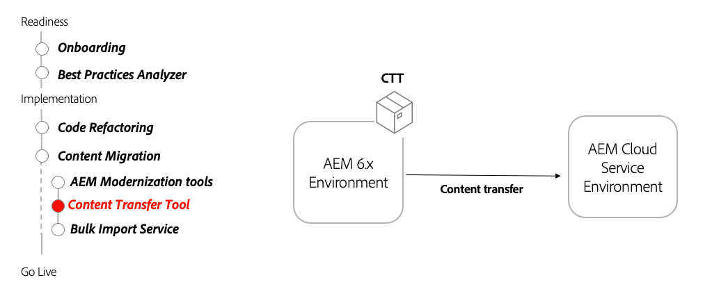

# Herramienta de transferencia de contenido

Descubra cómo la herramienta de transferencia de contenido le ayuda a migrar contenido a AEM as a Cloud Service desde AEM 6.3+.

>[!VIDEO](https://video.tv.adobe.com/v/336970/?quality=12&learn=on)

## Uso de la herramienta de transferencia de contenido

La herramienta de transferencia de contenido se instala en AEM versión 6.3 y transfiere contenido a AEM as a Cloud Service.

## Actividades clave

+ Descargue el [última herramienta de transferencia de contenido](https://experience.adobe.com/#/downloads/content/software-distribution/en/aemcloud.html?fulltext=Content*+Transfer*+Tool*&amp;1_group.propertyvalues.property=.%2Fjcr%3Acontent%2Fmetadata%2Fdc%3AsoftwareType&amp;1_group.propertyvalues.operation=equals&amp;1_group.propertyvalues.0_values=software-type%3Atooling&amp;orderby=%40jcr%3Acontent%2Fjcr%3AlastModified&amp;orderby.sort=desc&amp;layout list&amp;p.offset=0&amp;p.limit=2).
+ Transfiera el contenido final de AEM Author 6.3+ a AEM servicio de Autor as a Cloud Service.
   + Instale la herramienta de transferencia de contenido en AEM autor 6.3+ que contenga el contenido final que desea transferir.
   + Ejecute la herramienta de transferencia de contenido en lotes y transfiera conjuntos de contenido.
+ Transfiera el contenido final de AEM Publish 6.3+ a AEM servicio de publicación as a Cloud Service.
   + Instale la herramienta de transferencia de contenido en AEM publicación 6.3+ que contenga el contenido final que se va a transferir.
   + Ejecute la herramienta de transferencia de contenido en lotes y transfiera conjuntos de contenido.
+ De forma opcional, el contenido &quot;superior&quot; en AEM as a Cloud Service transfiriendo nuevo contenido desde la última transferencia de contenido

## Ejercicio práctico

Aplique sus conocimientos probando lo que ha aprendido con este ejercicio práctico.

Antes de intentar el ejercicio práctico, asegúrese de haber visto y comprendido el vídeo de arriba y los siguientes materiales:

+ [Herramientas de modernización de AEM](../aem-modernization-tools.md)
+ [Incorporación](../onboarding.md)
+ [Cloud Manager](../cloud-manager.md)

Además, asegúrese de haber completado el ejercicio práctico anterior:

+ [Ejercicio práctico de Dispatcher](../dispatcher.md#hands-on-exercise)

<table style="border-width:0">
    <tr>
        <td style="width:150px">
                    
        </td>
        <td style="width:100%;margin-bottom:1rem;">
            
Uso de la herramienta de transferencia de contenido

            

                Explore cómo la herramienta de transferencia de contenido puede mover automáticamente el contenido de AEM 6 a AEM as a Cloud Service.
            

            <a  rel="noreferrer"
                target="_blank"
                href="https://github.com/adobe/aem-cloud-engineering-video-series-exercises/tree/session6-transfercontent#cloud-acceleration-bootcamp---session-6-content" class="spectrum-Button spectrum-Button--primary spectrum-Button--sizeM">
                Probar la herramienta de transferencia de contenido
            </a>
        </td>
    </tr>
</table>

## Otros recursos

+ [Descargar la herramienta de transferencia de contenido](https://experience.adobe.com/#/downloads/content/software-distribution/en/aemcloud.html?fulltext=Content*+Transfer*+Tool*&amp;1_group.propertyvalues.property=.%2Fjcr%3Acontent%2Fmetadata%2Fdc%3AsoftwareType&amp;1_group.propertyvalues.operation=equals&amp;1_group.propertyvalues.0_values=software-type%3Atooling&amp;orderby=%40jcr%3Acontent%2Fjcr%3AlastModified&amp;orderby.sort=desc&amp;layout list&amp;p.offset=0&amp;p.limit=2)
+ [Vídeo explicativo del servicio de importación masiva](https://experienceleague.adobe.com/docs/experience-manager-learn/cloud-service/migration/bulk-import.html)

