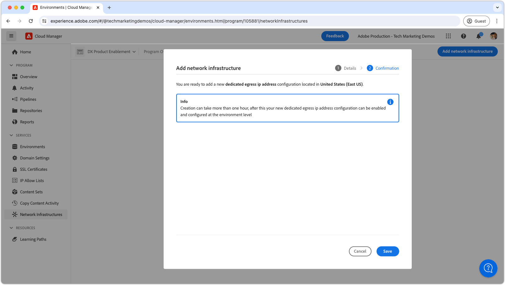

# Dirección IP de salida dedicada

Aprenda a configurar y utilizar la dirección IP de salida dedicada, que permite que las conexiones salientes de AEM se originen desde una IP dedicada.

## ¿Qué es la dirección IP de salida dedicada?

La dirección IP de salida dedicada permite que las solicitudes de AEM as a Cloud Service utilicen una dirección IP dedicada, lo que permite que los servicios externos filtren las solicitudes entrantes por esta dirección IP. Al igual que [puertos de salida flexibles](./flexible-port-egress.md), la IP de salida dedicada le permite salir en puertos no estándar.

Un programa Cloud Manager solo puede tener un tipo de infraestructura de red __single__. Asegúrese de que la dirección IP de salida dedicada sea el tipo más [apropiado de infraestructura de red](./advanced-networking.md) para su AEM as a Cloud Service antes de ejecutar los siguientes comandos.

>[!MORELIKETHIS]
>
> Lea la [documentación de configuración de red avanzada](https://experienceleague.adobe.com/en/docs/experience-manager-cloud-service/content/security/configuring-advanced-networking) de AEM as a Cloud Service para obtener más detalles sobre la dirección IP de salida dedicada.

## Requisitos previos

Se requiere lo siguiente al configurar la dirección IP de salida dedicada mediante las API de Cloud Manager:

+ API de Cloud Manager con [permisos de propietario de Cloud Manager Business](https://developer.adobe.com/experience-cloud/cloud-manager/guides/getting-started/permissions/)
+ Acceso a [credenciales de autenticación de la API de Cloud Manager](https://developer.adobe.com/experience-cloud/cloud-manager/guides/getting-started/create-api-integration/)
   + ID de organización (también conocido como ID de organización de IMS)
   + ID del cliente (también conocido como clave API)
   + Token de acceso (también conocido como Token de portador)
+ El ID del programa Cloud Manager
+ Los ID de entorno de Cloud Manager

Para obtener más información [revise cómo configurar y obtener las credenciales de la API de Cloud Manager](https://experienceleague.adobe.com/en/docs/experience-manager-learn/cloud-service/developing/extensibility/app-builder/server-to-server-auth) para utilizarlas en una llamada de la API de Cloud Manager.

Este tutorial utiliza `curl` para realizar las configuraciones de la API de Cloud Manager. Los comandos `curl` proporcionados suponen una sintaxis Linux/macOS. Si usa el símbolo del sistema de Windows, reemplace el carácter de salto de línea `\` por `^`.

## Habilitar la dirección IP de salida dedicada en el programa

Comience habilitando y configurando la dirección IP de salida dedicada en AEM as a Cloud Service.

>[!BEGINTABS]

>[!TAB Cloud Manager]

La dirección IP de salida dedicada se puede habilitar mediante Cloud Manager. Los siguientes pasos describen cómo habilitar la dirección IP de salida dedicada en AEM as a Cloud Service mediante Cloud Manager.

1. Inicie sesión en [Adobe Experience Manager Cloud Manager](https://experience.adobe.com/cloud-manager/) como propietario de Cloud Manager Business.
1. Vaya al programa deseado.
1. En el menú de la izquierda, vaya a __Servicios > Infraestructura de red__.
1. Seleccione el botón __Agregar infraestructura de red__.

   

1. En el cuadro de diálogo __Agregar infraestructura de red__, seleccione la opción __Dirección IP de salida dedicada__ y seleccione la __Región__ para crear la dirección IP de salida dedicada.

   

1. Seleccione __Guardar__ para confirmar la adición de la dirección IP de salida dedicada.

   

1. Espere a que se cree la infraestructura de red y se marque como __Listo__. Este proceso puede tardar hasta 1 hora.

   

Con la dirección IP de salida dedicada creada, ahora puede configurarla mediante las API de Cloud Manager como se describe a continuación.

>[!TAB API de Cloud Manager]

La dirección IP de salida dedicada se puede habilitar mediante las API de Cloud Manager. Los siguientes pasos describen cómo habilitar la dirección IP de salida dedicada en AEM as a Cloud Service mediante la API de Cloud Manager.


1. En primer lugar, determine la región en la que se necesita la red avanzada mediante la operación [listRegions](https://developer.adobe.com/experience-cloud/cloud-manager/reference/api/) de la API de Cloud Manager. Se requiere `region name` para realizar llamadas subsiguientes a la API de Cloud Manager. Normalmente, se utiliza la región en la que reside el entorno de producción.

   Busque la región de su entorno de AEM as a Cloud Service en [Cloud Manager](https://my.cloudmanager.adobe.com) en los [detalles del entorno](https://experienceleague.adobe.com/en/docs/experience-manager-cloud-service/content/implementing/using-cloud-manager/manage-environments). El nombre de región mostrado en Cloud Manager se puede [asignar al código de región](https://developer.adobe.com/experience-cloud/cloud-manager/guides/api-usage/creating-programs-and-environments/#creating-aem-cloud-service-environments) utilizado en la API de Cloud Manager.

   __solicitud HTTP listRegions__

   ```shell
   $ curl -X GET https://cloudmanager.adobe.io/api/program/{programId}/regions \
       -H 'x-gw-ims-org-id: <ORGANIZATION_ID>' \
       -H 'x-api-key: <CLIENT_ID>' \
       -H 'Authorization: Bearer <ACCESS_TOKEN>' \
       -H 'Content-Type: application/json' 
   ```

2. Habilite la dirección IP de salida dedicada para un programa de Cloud Manager mediante la operación [createNetworkInfrastructure](https://developer.adobe.com/experience-cloud/cloud-manager/reference/api/) de la API de Cloud Manager. Utilice el código `region` apropiado obtenido de la operación de la API de Cloud Manager `listRegions`.

   __solicitud HTTP createNetworkInfrastructure__

   ```shell
   $ curl -X POST https://cloudmanager.adobe.io/api/program/{programId}/networkInfrastructures \
       -H 'x-gw-ims-org-id: <ORGANIZATION_ID>' \
       -H 'x-api-key: <CLIENT_ID>' \
       -H 'Authorization: Bearer <ACCESS_TOKEN>' \
       -H 'Content-Type: application/json' \
       -d '{ "kind": "dedicatedEgressIp", "region": "va7" }'
   ```

   Espere 15 minutos para que el programa Cloud Manager aprovisione la infraestructura de red.

3. Compruebe que el programa haya finalizado la configuración de la __dirección IP de salida dedicada__ mediante la operación [getNetworkInfrastructure](https://developer.adobe.com/experience-cloud/cloud-manager/reference/api/#operation/getNetworkInfrastructure) de la API de Cloud Manager, utilizando la `id` devuelta desde la solicitud HTTP `createNetworkInfrastructure` del paso anterior.

   __petición HTTP getNetworkInfrastructure__

   ```shell
   $ curl -X GET https://cloudmanager.adobe.io/api/program/{programId}/networkInfrastructure/{networkInfrastructureId} \
       -H 'x-gw-ims-org-id: <ORGANIZATION_ID>' \
       -H 'x-api-key: <CLIENT_ID>' \
       -H 'Authorization: Bearer <ACCESS_TOKEN>' \
       -H 'Content-Type: application/json'
   ```

   Compruebe que la respuesta HTTP contiene un __estado__ de __listo__. Si aún no está listo, vuelva a comprobar el estado cada pocos minutos.

Con la dirección IP de salida dedicada creada, ahora puede configurarla mediante las API de Cloud Manager como se describe a continuación.

>[!ENDTABS]


## Configurar proxies de direcciones IP de salida dedicados por entorno

1. Configure la configuración de la __dirección IP de salida dedicada__ en cada entorno de AEM as a Cloud Service mediante la operación [enableEnvironmentAdvancedNetworkingConfiguration](https://developer.adobe.com/experience-cloud/cloud-manager/reference/api/) de la API de Cloud Manager.

   __petición HTTP enableEnvironmentAdvancedNetworkingConfiguration__

   ```shell
   $ curl -X PUT https://cloudmanager.adobe.io/api/program/{programId}/environment/{environmentId}/advancedNetworking \
       -H 'x-gw-ims-org-id: <ORGANIZATION_ID>' \
       -H 'x-api-key: <CLIENT_ID>' \
       -H 'Authorization: Bearer <ACCESS_TOKEN>' \
       -H 'Content-Type: application/json' \
       -d @./dedicated-egress-ip-address.json
   ```

   Defina los parámetros JSON en un `dedicated-egress-ip-address.json` y proporcione para ondulación mediante `... -d @./dedicated-egress-ip-address.json`.

   [Descargue el ejemplo dedicated-egress-ip-address.json](./assets/dedicated-egress-ip-address.json). Este archivo es solo un ejemplo. Configure el archivo según sea necesario en función de los campos opcionales/obligatorios documentados en [enableEnvironmentAdvancedNetworkingConfiguration](https://developer.adobe.com/experience-cloud/cloud-manager/reference/api/).

   ```json
   {
       "nonProxyHosts": [
           "example.net",
           "*.example.org",
       ],
       "portForwards": [
           {
               "name": "mysql.example.com",
               "portDest": 3306,
               "portOrig": 30001
           },
           {
               "name": "smtp.sendgrid.net",
               "portDest": 465,
               "portOrig": 30002
           }
       ]
   }
   ```

   La firma HTTP de la configuración de la dirección IP de salida dedicada solo difiere del [puerto de salida flexible](./flexible-port-egress.md#enable-dedicated-egress-ip-address-per-environment) en que también admite la configuración opcional `nonProxyHosts`.

   `nonProxyHosts` declara un conjunto de hosts para los que el puerto 80 o 443 debe enrutarse a través de los intervalos de direcciones IP compartidos predeterminados en lugar de la IP de salida dedicada. `nonProxyHosts` puede resultar útil, ya que Adobe optimiza automáticamente la salida de tráfico a través de direcciones IP compartidas.

   Para cada asignación `portForwards`, la red avanzada define la siguiente regla de reenvío:

   | Host de proxy | Puerto Proxy |  | Host externo | Puerto externo |
   |---------------------------------|----------|----------------|------------------|----------|
   | `AEM_PROXY_HOST` | `portForwards.portOrig` | → | `portForwards.name` | `portForwards.portDest` |

1. Para cada entorno, valide que las reglas de salida estén en vigor mediante la operación de la API de Cloud Manager [getEnvironmentAdvancedNetworkingConfiguration](https://developer.adobe.com/experience-cloud/cloud-manager/reference/api/).

   __petición HTTP getEnvironmentAdvancedNetworkingConfiguration__

   ```shell
   $ curl -X GET https://cloudmanager.adobe.io/api/program/{programId}/environment/{environmentId}/advancedNetworking \
       -H 'x-gw-ims-org-id: <ORGANIZATION_ID>' \
       -H 'x-api-key: <CLIENT_ID>' \
       -H 'Authorization: <YOUR_TOKEN>' \
       -H 'Content-Type: application/json'
   ```

1. Las configuraciones de direcciones IP de salida dedicadas se pueden actualizar mediante la operación [enableEnvironmentAdvancedNetworkingConfiguration](https://developer.adobe.com/experience-cloud/cloud-manager/reference/api/) de la API de Cloud Manager. Recuerde que `enableEnvironmentAdvancedNetworkingConfiguration` es una operación de `PUT`, por lo que todas las reglas deben proporcionarse con cada invocación de esta operación.

1. Obtenga la __dirección IP de salida dedicada__ mediante un solucionador de DNS (como [DNSChecker.org](https://dnschecker.org/)) en el host: `p{programId}.external.adobeaemcloud.com`, o ejecutando `dig` desde la línea de comandos.

   ```shell
   $ dig +short p{programId}.external.adobeaemcloud.com
   ```

   El nombre de host no puede ser `pinged`, ya que es una salida y _no_ y una entrada.

   Tenga en cuenta que todos los entornos de AEM as a Cloud Service del programa comparten la dirección IP de salida dedicada.

1. Ahora puede utilizar la dirección IP de salida dedicada en la configuración y el código personalizados de AEM. A menudo, al utilizar la dirección IP de salida dedicada, los servicios externos a los que se conecta AEM as a Cloud Service están configurados para permitir solo el tráfico de esta dirección IP dedicada.

## Conexión a servicios externos a través de una dirección IP de salida dedicada

Con la dirección IP de salida dedicada habilitada, el código y la configuración de AEM pueden utilizar la IP de salida dedicada para hacer llamadas a servicios externos. Hay dos tipos de llamadas externas que AEM trata de manera diferente:

1. Llamadas HTTP/HTTPS a servicios externos
   + Incluye llamadas HTTP/HTTPS realizadas a servicios que se ejecutan en puertos que no son los puertos estándar 80 o 443.
1. llamadas no HTTP/HTTPS a servicios externos
   + Incluye cualquier llamada que no sea HTTP, como conexiones con servidores de correo, bases de datos SQL o servicios que se ejecutan en otros protocolos que no son HTTP/HTTPS.

Las solicitudes HTTP/HTTPS de AEM en puertos estándar (80/443) están permitidas de forma predeterminada, pero no utilizan la dirección IP de salida dedicada si no se configura correctamente como se describe a continuación.

>[!TIP]
>
> Consulte la documentación de la dirección IP de salida dedicada de AEM as a Cloud Service para [el conjunto completo de reglas de enrutamiento](https://experienceleague.adobe.com/en/docs/experience-manager-cloud-service/content/security/configuring-advanced-networking).


### HTTP/HTTPS

Al crear conexiones HTTP/HTTPS desde AEM, al utilizar la dirección IP de salida dedicada, las conexiones HTTP/HTTPS se procesan como proxy automáticamente fuera de AEM mediante la dirección IP de salida dedicada. No se requiere código ni configuración adicional para admitir conexiones HTTP/HTTPS.

#### Ejemplos de código

<table>
<tr>
<td>
    <a  href="./examples/http-dedicated-egress-ip-vpn.md"></a>
    <div><strong><a href="./examples/http-dedicated-egress-ip-vpn.md">HTTP/HTTPS</a></strong></div>
    <p>
        Ejemplo de código Java™ que establece una conexión HTTP/HTTPS desde AEM as a Cloud Service a un servicio externo mediante el protocolo HTTP/HTTPS.
    </p>
</td>   
<td></td>   
<td></td>   
</tr>
</table>

### Conexiones no HTTP/HTTPS a servicios externos

Al crear conexiones no HTTP/HTTPS (por ejemplo, SQL, SMTP, etc.) de AEM, la conexión debe realizarse mediante un nombre de host especial proporcionado por AEM.

| Nombre de variable | Uso | Código Java™ | Configuración de OSGi |
| - |  - | - | - |
| `AEM_PROXY_HOST` | Host proxy para conexiones no HTTP/HTTPS | `System.getenv("AEM_PROXY_HOST")` | `$[env:AEM_PROXY_HOST]` |


A continuación, se llama a las conexiones a servicios externos a través de `AEM_PROXY_HOST` y del puerto asignado (`portForwards.portOrig`), que AEM enruta al nombre de host externo asignado (`portForwards.name`) y al puerto (`portForwards.portDest`).

| Host de proxy | Puerto Proxy |  | Host externo | Puerto externo |
|---------------------------------|----------|----------------|------------------|----------|
| `AEM_PROXY_HOST` | `portForwards.portOrig` | → | `portForwards.name` | `portForwards.portDest` |

#### Ejemplos de código

<table><tr>
   <td>
      <a  href="./examples/sql-datasourcepool.md"></a>
      <div><strong><a href="./examples/sql-datasourcepool.md">Conexión SQL con el conjunto de datos JDBC</a></strong></div>
      <p>
            Ejemplo de código Java™ conectarse a bases de datos SQL externas configurando el grupo de fuentes de datos JDBC de AEM.
      </p>
    </td>   
   <td>
      <a  href="./examples/sql-java-apis.md"></a>
      <div><strong><a href="./examples/sql-java-apis.md">Conexión SQL con API de Java™</a></strong></div>
      <p>
            Ejemplo de código Java™ conectarse a bases de datos SQL externas mediante las API SQL de Java™.
      </p>
    </td>   
   <td>
      <a  href="./examples/email-service.md"></a>
      <div><strong><a href="./examples/email-service.md">Servicio de correo electrónico</a></strong></div>
      <p>
        Ejemplo de configuración de OSGi que utiliza AEM para conectarse a servicios de correo electrónico externos.
      </p>
    </td>   
</tr></table>
