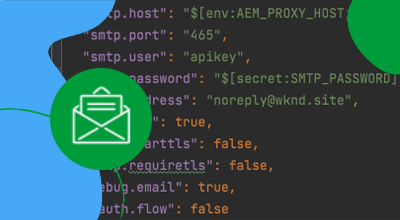

# Dirección IP de salida dedicada

AEM Obtenga información sobre cómo configurar y utilizar la dirección IP de salida dedicada, que permite que las conexiones salientes de la dirección IP de salida se originen desde una dirección IP dedicada.

## ¿Qué es la dirección IP de salida dedicada?

AEM La dirección IP de salida dedicada permite que las solicitudes de los as a Cloud Service utilicen una dirección IP específica, lo que permite a los servicios externos filtrar las solicitudes entrantes por esta dirección IP. Like [puertos de salida flexibles](./flexible-port-egress.md), la IP de salida dedicada le permite salir en puertos no estándar.

Un programa de Cloud Manager solo puede tener un __soltero__ tipo de infraestructura de red. Asegúrese de que la dirección IP de salida dedicada sea la más adecuada [tipo adecuado de infraestructura de red](./advanced-networking.md)  AEM para el recurso as a Cloud Service antes de ejecutar los siguientes comandos.

>[!MORELIKETHIS]
>
> AEM Leer el recurso as a Cloud Service [documentación de configuración de red avanzada](https://experienceleague.adobe.com/docs/experience-manager-cloud-service/content/security/configuring-advanced-networking.html#dedicated-egress-IP-address) para obtener más información sobre la dirección IP de salida dedicada.

## Requisitos previos

Se requiere lo siguiente al configurar la dirección IP de salida dedicada:

+ API de Cloud Manager con [Permisos de propietario de empresa de Cloud Manager](https://developer.adobe.com/experience-cloud/cloud-manager/guides/getting-started/permissions/)
+ Acceso a [Credenciales de autenticación de API de Cloud Manager](https://developer.adobe.com/experience-cloud/cloud-manager/guides/getting-started/authentication/)
   + ID de organización (también conocido como ID de organización de IMS)
   + ID del cliente (también conocido como clave API)
   + Token de acceso (también conocido como Token de portador)
+ El ID de programa de Cloud Manager
+ Los ID de entorno de Cloud Manager

Para obtener más información, consulte el siguiente tutorial sobre cómo configurar y obtener credenciales de API de Cloud Manager y cómo utilizarlas para realizar una llamada de API de Cloud Manager.

>[!VIDEO](https://video.tv.adobe.com/v/342235?quality=12&learn=on)

Este tutorial utiliza `curl` para realizar las configuraciones de la API de Cloud Manager. El proporcionado `curl` Los comandos de asumen una sintaxis de Linux/macOS. Si utiliza el símbolo del sistema de Windows, reemplace la variable `\` salto de línea con `^`.

## Habilitar la dirección IP de salida dedicada en el programa

AEM Comience habilitando y configurando la dirección IP de salida dedicada en el as a Cloud Service de la.

1. En primer lugar, determine la región en la que se necesita la red avanzada mediante la API de Cloud Manager [listRegions](https://developer.adobe.com/experience-cloud/cloud-manager/reference/api/) operación. El `region name` es necesario para realizar llamadas posteriores a la API de Cloud Manager. Normalmente, se utiliza la región en la que reside el entorno de producción.

   AEM Encuentre la región de su entorno as a Cloud Service de la en [Cloud Manager](https://my.cloudmanager.adobe.com) en el [detalles del entorno](https://experienceleague.adobe.com/docs/experience-manager-cloud-service/content/implementing/using-cloud-manager/manage-environments.html?lang=en#viewing-environment). El nombre de región que se muestra en Cloud Manager puede ser [asignado al código de región](https://developer.adobe.com/experience-cloud/cloud-manager/guides/api-usage/creating-programs-and-environments/#creating-aem-cloud-service-environments) se utiliza en la API de Cloud Manager.

   __solicitud HTTP listRegions__

   ```shell
   $ curl -X GET https://cloudmanager.adobe.io/api/program/{programId}/regions \
       -H 'x-gw-ims-org-id: <ORGANIZATION_ID>' \
       -H 'x-api-key: <CLIENT_ID>' \
       -H 'Authorization: Bearer <ACCESS_TOKEN>' \
       -H 'Content-Type: application/json' 
   ```

1. Habilite la dirección IP de salida dedicada para un programa de Cloud Manager mediante la API de Cloud Manager [createNetworkInfrastructure](https://developer.adobe.com/experience-cloud/cloud-manager/reference/api/) operación. Utilice el adecuado `region` código obtenido de la API de Cloud Manager `listRegions` operación.

   __solicitud HTTP createNetworkInfrastructure__

   ```shell
   $ curl -X POST https://cloudmanager.adobe.io/api/program/{programId}/networkInfrastructures \
       -H 'x-gw-ims-org-id: <ORGANIZATION_ID>' \
       -H 'x-api-key: <CLIENT_ID>' \
       -H 'Authorization: Bearer <ACCESS_TOKEN>' \
       -H 'Content-Type: application/json' \
       -d '{ "kind": "dedicatedEgressIp", "region": "va7" }'
   ```

   Espere 15 minutos para que el programa Cloud Manager aprovisione la infraestructura de red.

1. Compruebe que el programa ha finalizado __dirección IP de salida dedicada__ Configuración de mediante la API de Cloud Manager [getNetworkInfrastructure](https://developer.adobe.com/experience-cloud/cloud-manager/reference/api/#operation/getNetworkInfrastructure) operación, usando el `id` devuelto por la solicitud HTTP createNetworkInfrastructure del paso anterior.

   __petición HTTP getNetworkInfrastructure__

   ```shell
   $ curl -X GET https://cloudmanager.adobe.io/api/program/{programId}/networkInfrastructure/{networkInfrastructureId} \
       -H 'x-gw-ims-org-id: <ORGANIZATION_ID>' \
       -H 'x-api-key: <CLIENT_ID>' \
       -H 'Authorization: Bearer <ACCESS_TOKEN>' \
       -H 'Content-Type: application/json'
   ```

   Compruebe que la respuesta HTTP contiene un __status__ de __ready__. Si aún no está listo, vuelva a comprobar el estado cada pocos minutos.

## Configurar proxies de direcciones IP de salida dedicados por entorno

1. Configure las variables __dirección IP de salida dedicada__ AEM Configuración de en cada entorno as a Cloud Service de mediante la API de Cloud Manager [enableEnvironmentAdvancedNetworkingConfiguration](https://developer.adobe.com/experience-cloud/cloud-manager/reference/api/) operación.

   __enableEnvironmentAdvancedNetworkingConfiguration petición HTTP__

   ```shell
   $ curl -X PUT https://cloudmanager.adobe.io/api/program/{programId}/environment/{environmentId}/advancedNetworking \
       -H 'x-gw-ims-org-id: <ORGANIZATION_ID>' \
       -H 'x-api-key: <CLIENT_ID>' \
       -H 'Authorization: Bearer <ACCESS_TOKEN>' \
       -H 'Content-Type: application/json' \
       -d @./dedicated-egress-ip-address.json
   ```

   Defina los parámetros JSON en una `dedicated-egress-ip-address.json` y se proporciona para rizar mediante `... -d @./dedicated-egress-ip-address.json`.

   [Descargue el ejemplo dedicated-egress-ip-address.json](./assets/dedicated-egress-ip-address.json). Este archivo es solo un ejemplo. Configure el archivo según sea necesario en función de los campos opcionales/obligatorios documentados en [enableEnvironmentAdvancedNetworkingConfiguration](https://developer.adobe.com/experience-cloud/cloud-manager/reference/api/).

   ```json
   {
       "nonProxyHosts": [
           "example.net",
           "*.example.org",
       ],
       "portForwards": [
           {
               "name": "mysql.example.com",
               "portDest": 3306,
               "portOrig": 30001
           },
           {
               "name": "smtp.sendgrid.net",
               "portDest": 465,
               "portOrig": 30002
           }
       ]
   }
   ```

   La firma HTTP de la configuración de la dirección IP de salida dedicada solo difiere de [puerto de salida flexible](./flexible-port-egress.md#enable-dedicated-egress-ip-address-per-environment) en el sentido de que también admite el `nonProxyHosts` configuración.

   `nonProxyHosts` declara un conjunto de hosts para los que el puerto 80 o 443 debe enrutarse a través de los intervalos de direcciones IP compartidos predeterminados en lugar de la IP de salida dedicada. `nonProxyHosts` puede resultar útil, ya que la salida de tráfico a través de direcciones IP compartidas puede optimizarse aún más automáticamente mediante el Adobe.

   Para cada `portForwards` , la red avanzada define la siguiente regla de reenvío:

   | Host de proxy | Puerto Proxy |  | Host externo | Puerto externo |
   |---------------------------------|----------|----------------|------------------|----------|
   | `AEM_PROXY_HOST` | `portForwards.portOrig` | → | `portForwards.name` | `portForwards.portDest` |

1. Para cada entorno, valide que las reglas de salida estén en vigor mediante la API de Cloud Manager [getEnvironmentAdvancedNetworkingConfiguration](https://developer.adobe.com/experience-cloud/cloud-manager/reference/api/) operación.

   __getEnvironmentAdvancedNetworkingConfiguration petición HTTP__

   ```shell
   $ curl -X GET https://cloudmanager.adobe.io/api/program/{programId}/environment/{environmentId}/advancedNetworking \
       -H 'x-gw-ims-org-id: <ORGANIZATION_ID>' \
       -H 'x-api-key: <CLIENT_ID>' \
       -H 'Authorization: <YOUR_TOKEN>' \
       -H 'Content-Type: application/json'
   ```

1. Las configuraciones de direcciones IP de salida dedicadas se pueden actualizar mediante la API de Cloud Manager [enableEnvironmentAdvancedNetworkingConfiguration](https://developer.adobe.com/experience-cloud/cloud-manager/reference/api/) operación. Recordar `enableEnvironmentAdvancedNetworkingConfiguration` es un `PUT` , por lo que todas las reglas deben proporcionarse con cada invocación de esta operación.

1. Obtenga la __dirección IP de salida dedicada__ mediante una resolución DNS (por ejemplo, [DNSChecker.org](https://dnschecker.org/)) en el host: `p{programId}.external.adobeaemcloud.com`, o ejecutando `dig` desde la línea de comandos.

   ```shell
   $ dig +short p{programId}.external.adobeaemcloud.com
   ```

   El nombre de host no puede ser `pinged`, ya que es una salida y _no_ y la entrada.

   Tenga en cuenta __dirección IP de salida dedicada__ AEM es compartido por todos los entornos as a Cloud Service de la aplicación de manera independiente, en el programa.

1. AEM Ahora puede utilizar la dirección IP de salida dedicada en el código de y la configuración personalizados. AEM A menudo, al utilizar una dirección IP de salida dedicada, los servicios externos a los que se conecta as a Cloud Service se configuran para permitir solo el tráfico de esta dirección IP dedicada.

## Conexión a servicios externos a través de una dirección IP de salida dedicada

AEM Con la dirección IP de salida dedicada habilitada, el código y la configuración de la pueden utilizar la IP de salida dedicada para hacer llamadas a servicios externos. AEM Existen dos tipos de llamadas externas que se tratan de manera diferente en el modo que se hace:

1. Llamadas HTTP/HTTPS a servicios externos
   + Incluye llamadas HTTP/HTTPS realizadas a servicios que se ejecutan en puertos que no son los puertos estándar 80 o 443.
1. llamadas no HTTP/HTTPS a servicios externos
   + Incluye cualquier llamada que no sea HTTP, como conexiones con servidores de correo, bases de datos SQL o servicios que se ejecutan en otros protocolos que no son HTTP/HTTPS.

AEM Las solicitudes HTTP/HTTPS de los puertos estándar (80/443) están permitidas de forma predeterminada, pero no utilizarán la dirección IP de salida dedicada si no se configura correctamente como se describe a continuación.

>[!TIP]
>
> AEM Consulte la documentación de la dirección IP de salida dedicada de as a Cloud Service para [el conjunto completo de reglas de enrutamiento](https://experienceleague.adobe.com/docs/experience-manager-cloud-service/content/security/configuring-advanced-networking.html#dedcated-egress-ip-traffic-routing=).


### HTTP/HTTPS

AEM AEM Al crear conexiones HTTP/HTTPS desde la dirección IP de salida dedicada, las conexiones HTTP/HTTPS se procesan como proxy automáticamente fuera de la dirección IP de salida dedicada usando la dirección IP de salida dedicada. No se requiere código ni configuración adicional para admitir conexiones HTTP/HTTPS.

#### Ejemplos de código

<table>
<tr>
<td>
    <a  href="./examples/http-dedicated-egress-ip-vpn.md"></a>
    <div><strong><a href="./examples/http-dedicated-egress-ip-vpn.md">HTTP/HTTPS</a></strong></div>
    <p>
        AEM Ejemplo de código Java™ que establece la conexión HTTP/HTTPS de manera as a Cloud Service a un servicio externo que utiliza el protocolo HTTP/HTTPS.
    </p>
</td>   
<td></td>   
<td></td>   
</tr>
</table>

### Conexiones no HTTP/HTTPS a servicios externos

Al crear conexiones no HTTP/HTTPS (por ejemplo, AEM AEM SQL, SMTP, etc.) desde el punto de vista de la seguridad, la conexión debe realizarse a través de un nombre de host especial proporcionado por el usuario de la red de seguridad de la red de datos (SQL, SMTP, etc.) de la red de seguridad de la red de datos

| Nombre de variable | Uso | Código Java™ | Configuración de OSGi | | - | - | - | - | | `AEM_PROXY_HOST` | Host de proxy para conexiones no HTTP/HTTPS | `System.getenv("AEM_PROXY_HOST")` | `$[env:AEM_PROXY_HOST]` |


A continuación, se llama a las conexiones a servicios externos a través de `AEM_PROXY_HOST` y el puerto asignado (`portForwards.portOrig`AEM ), que luego enruta al nombre de host externo asignado (`portForwards.name`) y el puerto (`portForwards.portDest`).

| Host de proxy | Puerto Proxy |  | Host externo | Puerto externo |
|---------------------------------|----------|----------------|------------------|----------|
| `AEM_PROXY_HOST` | `portForwards.portOrig` | → | `portForwards.name` | `portForwards.portDest` |

#### Ejemplos de código

<table><tr>
   <td>
      <a  href="./examples/sql-datasourcepool.md"></a>
      <div><strong><a href="./examples/sql-datasourcepool.md">Conexión SQL con JDBC DataSourcePool</a></strong></div>
      <p>
            AEM Ejemplo de código Java™ conectarse a bases de datos SQL externas configurando el grupo de fuentes de datos JDBC de la.
      </p>
    </td>   
   <td>
      <a  href="./examples/sql-java-apis.md"></a>
      <div><strong><a href="./examples/sql-java-apis.md">Conexión SQL con las API de Java™</a></strong></div>
      <p>
            Ejemplo de código Java™ conectarse a bases de datos SQL externas mediante las API SQL de Java™.
      </p>
    </td>   
   <td>
      <a  href="./examples/email-service.md"></a>
      <div><strong><a href="./examples/email-service.md">Servicio de correo electrónico</a></strong></div>
      <p>
        AEM Ejemplo de configuración de OSGi que utiliza la conexión con los servicios de correo electrónico externos mediante el uso de la.
      </p>
    </td>   
</tr></table>
