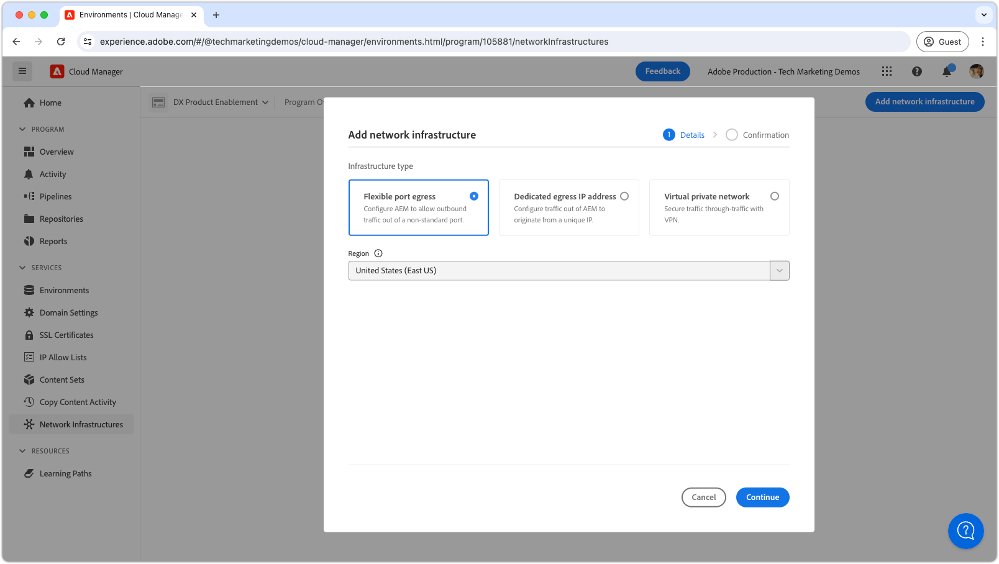

# Salida de puerto flexible

Obtenga información sobre cómo configurar y utilizar la salida de puerto flexible para admitir conexiones externas de AEM as a Cloud Service a servicios externos.

## ¿Qué es la salida de puerto flexible?

La salida de puerto flexible permite adjuntar a AEM as a Cloud Service AEM reglas de reenvío de puerto específicas y personalizadas, lo que permite realizar conexiones desde el puerto a servicios externos.

Un programa Cloud Manager solo puede tener un tipo de infraestructura de red __single__. Asegúrese de que la salida de puerto flexible sea el tipo más [apropiado de infraestructura de red](./advanced-networking.md) para su AEM as a Cloud Service antes de ejecutar los siguientes comandos.

>[!MORELIKETHIS]
>
> Lea la [documentación de configuración de red avanzada](https://experienceleague.adobe.com/en/docs/experience-manager-cloud-service/content/security/configuring-advanced-networking) de AEM as a Cloud Service para obtener más detalles sobre la salida de puerto flexible.


## Requisitos previos

Se requiere lo siguiente al configurar una salida de puerto flexible mediante las API de Cloud Manager:

+ Proyecto de Adobe Developer Console con la API de Cloud Manager habilitada y [permisos de propietario de Cloud Manager Business](https://developer.adobe.com/experience-cloud/cloud-manager/guides/getting-started/permissions/)
+ Acceso a [credenciales de autenticación de la API de Cloud Manager](https://developer.adobe.com/experience-cloud/cloud-manager/guides/getting-started/create-api-integration/)
   + ID de organización (también conocido como ID de organización de IMS)
   + ID del cliente (también conocido como clave API)
   + Token de acceso (también conocido como Token de portador)
+ El ID del programa Cloud Manager
+ Los ID de entorno de Cloud Manager

Para obtener más información [revise cómo configurar y obtener las credenciales de la API de Cloud Manager](https://experienceleague.adobe.com/en/docs/experience-manager-learn/cloud-service/developing/extensibility/app-builder/server-to-server-auth) para utilizarlas en una llamada de la API de Cloud Manager.

Este tutorial utiliza `curl` para realizar las configuraciones de la API de Cloud Manager. Los comandos `curl` proporcionados suponen una sintaxis Linux/macOS. Si usa el símbolo del sistema de Windows, reemplace el carácter de salto de línea `\` por `^`.


## Habilitar salida de puerto flexible por programa

Comience habilitando la salida de puerto flexible en AEM as a Cloud Service.

>[!BEGINTABS]

>[!TAB Cloud Manager]

La salida de puerto flexible se puede activar mediante Cloud Manager. Los siguientes pasos describen cómo habilitar la salida de puerto flexible en AEM as a Cloud Service mediante Cloud Manager.

1. Inicie sesión en [Adobe Experience Manager Cloud Manager](https://experience.adobe.com/cloud-manager/) como propietario de Cloud Manager Business.
1. Vaya al programa deseado.
1. En el menú de la izquierda, vaya a __Servicios > Infraestructura de red__.
1. Seleccione el botón __Agregar infraestructura de red__.

   

1. En el cuadro de diálogo __Agregar infraestructura de red__, seleccione la opción __Salida de puerto flexible__ y seleccione la __Región__ para crear la dirección IP de salida dedicada.

   

1. Seleccione __Guardar__ para confirmar la adición de la salida de puerto flexible.

   

1. Espere a que se cree la infraestructura de red y se marque como __Listo__. Este proceso puede tardar hasta 1 hora.

   

Con la salida de puerto flexible creada, ahora puede configurar las reglas de reenvío de puerto mediante las API de Cloud Manager como se describe a continuación.

>[!TAB API de Cloud Manager]

La salida de puerto flexible se puede habilitar mediante las API de Cloud Manager. Los siguientes pasos describen cómo habilitar la salida de puerto flexible en AEM as a Cloud Service mediante la API de Cloud Manager.

1. En primer lugar, determine la región en la que está configurada la red avanzada mediante la operación [listRegions](https://developer.adobe.com/experience-cloud/cloud-manager/reference/api/) de la API de Cloud Manager. Se requiere `region name` para realizar llamadas subsiguientes a la API de Cloud Manager. Normalmente, se utiliza la región en la que reside el entorno de producción.

   Busque la región de su entorno de AEM as a Cloud Service en [Cloud Manager](https://my.cloudmanager.adobe.com) en los [detalles del entorno](https://experienceleague.adobe.com/en/docs/experience-manager-cloud-service/content/implementing/using-cloud-manager/manage-environments). El nombre de región mostrado en Cloud Manager se puede [asignar al código de región](https://developer.adobe.com/experience-cloud/cloud-manager/guides/api-usage/creating-programs-and-environments/#creating-aem-cloud-service-environments) utilizado en la API de Cloud Manager.

   __solicitud HTTP listRegions__

   ```shell
   $ curl -X GET https://cloudmanager.adobe.io/api/program/{programId}/regions \
       -H 'x-gw-ims-org-id: <ORGANIZATION_ID>' \
       -H 'x-api-key: <CLIENT_ID>' \
       -H 'Authorization: Bearer <ACCESS_TOKEN>' \
       -H 'Content-Type: application/json' 
   ```

2. Habilite la salida de puerto flexible para un programa de Cloud Manager mediante la operación [createNetworkInfrastructure](https://developer.adobe.com/experience-cloud/cloud-manager/reference/api/) de la API de Cloud Manager. Utilice el código `region` apropiado obtenido de la operación de la API de Cloud Manager `listRegions`.

   __solicitud HTTP createNetworkInfrastructure__

   ```shell
   $ curl -X POST https://cloudmanager.adobe.io/api/program/{programId}/networkInfrastructures \
       -H 'x-gw-ims-org-id: <ORGANIZATION_ID>' \
       -H 'x-api-key: <CLIENT_ID>' \ 
       -H 'Authorization: Bearer <ACCESS_TOKEN>' \
       -H 'Content-Type: application/json' \
       -d '{ "kind": "flexiblePortEgress", "region": "va7" }'
   ```

   Espere 15 minutos para que el programa Cloud Manager aprovisione la infraestructura de red.

3. Compruebe que el entorno haya finalizado la configuración de __salida de puerto flexible__ mediante la operación [getNetworkInfrastructure](https://developer.adobe.com/experience-cloud/cloud-manager/reference/api/#operation/getNetworkInfrastructure) de la API de Cloud Manager, utilizando la `id` devuelta desde la solicitud HTTP `createNetworkInfrastructure` del paso anterior.

   __petición HTTP getNetworkInfrastructure__

   ```shell
   $ curl -X GET https://cloudmanager.adobe.io/api/program/{programId}/networkInfrastructure/{networkInfrastructureId} \
       -H 'x-gw-ims-org-id: <ORGANIZATION_ID>' \
       -H 'x-api-key: <CLIENT_ID>' \ 
       -H 'Authorization: Bearer <ACCESS_TOKEN>' \
       -H 'Content-Type: application/json'
   ```

   Compruebe que la respuesta HTTP contiene un __estado__ de __listo__. Si aún no está listo, vuelva a comprobar el estado cada pocos minutos.

Con la salida de puerto flexible creada, ahora puede configurar las reglas de reenvío de puerto mediante las API de Cloud Manager como se describe a continuación.

>[!ENDTABS]

## Configuración de proxies de salida de puerto flexibles por entorno

1. Habilite y configure la configuración de __salida de puerto flexible__ en cada entorno de AEM as a Cloud Service mediante la operación [enableEnvironmentAdvancedNetworkingConfiguration](https://developer.adobe.com/experience-cloud/cloud-manager/reference/api/) de la API de Cloud Manager.

   __petición HTTP enableEnvironmentAdvancedNetworkingConfiguration__

   ```shell
   $ curl -X PUT https://cloudmanager.adobe.io/api/program/{programId}/environment/{environmentId}/advancedNetworking \
       -H 'x-gw-ims-org-id: <ORGANIZATION_ID>' \
       -H 'x-api-key: <CLIENT_ID>' \ 
       -H 'Authorization: Bearer <ACCESS_TOKEN>' \
       -H 'Content-Type: application/json' \
       -d @./flexible-port-egress.json
   ```

   Defina los parámetros JSON en un `flexible-port-egress.json` y proporcione para ondulación mediante `... -d @./flexible-port-egress.json`.

   [Descargue el ejemplo flexible-port-egress.json](./assets/flexible-port-egress.json). Este archivo es solo un ejemplo. Configure el archivo según sea necesario en función de los campos opcionales/obligatorios documentados en [enableEnvironmentAdvancedNetworkingConfiguration](https://developer.adobe.com/experience-cloud/cloud-manager/reference/api/).

   ```json
   {
       "portForwards": [
           {
               "name": "mysql.example.com",
               "portDest": 3306,
               "portOrig": 30001
           },
           {
               "name": "smtp.sendgrid.com",
               "portDest": 465,
               "portOrig": 30002
           }
       ]
   }
   ```

   Para cada asignación `portForwards`, la red avanzada define la siguiente regla de reenvío:

   | Host de proxy | Puerto Proxy |  | Host externo | Puerto externo |
   |---------------------------------|----------|----------------|------------------|----------|
   | `AEM_PROXY_HOST` | `portForwards.portOrig` | → | `portForwards.name` | `portForwards.portDest` |

   AEM Si la implementación de la __only__ requiere conexiones HTTP/HTTPS (puerto 80/443) al servicio externo, deje vacía la matriz `portForwards`, ya que estas reglas solo son necesarias para solicitudes que no sean HTTP/HTTPS.

1. Para cada entorno, valide que las reglas de salida estén en vigor mediante la operación de la API de Cloud Manager [getEnvironmentAdvancedNetworkingConfiguration](https://developer.adobe.com/experience-cloud/cloud-manager/reference/api/).

   __petición HTTP getEnvironmentAdvancedNetworkingConfiguration__

   ```shell
   $ curl -X GET https://cloudmanager.adobe.io/api/program/{programId}/environment/{environmentId}/advancedNetworking \
       -H 'x-gw-ims-org-id: <ORGANIZATION_ID>' \
       -H 'Authorization: Bearer <ACCESS_TOKEN>' \
       -H 'x-api-key: <CLIENT_ID>' \ 
       -H 'Content-Type: application/json'
   ```

1. Las configuraciones de salida de puerto flexible se pueden actualizar mediante la operación de la API de Cloud Manager [enableEnvironmentAdvancedNetworkingConfiguration](https://developer.adobe.com/experience-cloud/cloud-manager/reference/api/). Recuerde que `enableEnvironmentAdvancedNetworkingConfiguration` es una operación de `PUT`, por lo que todas las reglas deben proporcionarse con cada invocación de esta operación.

1. AEM Ahora, puede utilizar la configuración flexible de salida de puerto en el código personalizado de la y en la configuración.


## Conexión a servicios externos mediante salida de puerto flexible

AEM Con el proxy de salida de puerto flexible habilitado, el código y la configuración de la pueden utilizarlos para realizar llamadas a servicios externos. AEM Existen dos tipos de llamadas externas que se tratan de manera diferente en el modo que se hace:

1. Llamadas HTTP/HTTPS a servicios externos en puertos no estándar
   + Incluye llamadas HTTP/HTTPS realizadas a servicios que se ejecutan en puertos que no son los puertos estándar 80 o 443.
1. llamadas no HTTP/HTTPS a servicios externos
   + Incluye cualquier llamada que no sea HTTP, como conexiones con servidores de correo, bases de datos SQL o servicios que se ejecutan en otros protocolos que no son HTTP/HTTPS.

AEM Las solicitudes HTTP/HTTPS de los puertos estándar (80/443) se permiten de forma predeterminada y no necesitan configuraciones ni consideraciones adicionales.


### HTTP/HTTPS en puertos no estándar

AEM Cuando se crean conexiones HTTP/HTTPS a puertos no estándar (no-80/443) desde la red de puertos, las conexiones deben realizarse a través de puertos y hosts especiales, proporcionados mediante marcadores de posición.

AEM AEM proporciona dos conjuntos de variables de sistema Java™ especiales que se asignan a los proxies HTTP/HTTPS que se utilizan para la ejecución de un proceso de.

| Nombre de variable | Uso | Código Java™ | Configuración de OSGi |
| - |  - | - | - |
| `AEM_PROXY_HOST` | Host de proxy para conexiones HTTP/HTTPS | `System.getenv().getOrDefault("AEM_PROXY_HOST", "proxy.tunnel")` | `$[env:AEM_PROXY_HOST;default=proxy.tunnel]` |
| `AEM_HTTP_PROXY_PORT` | Puerto proxy para conexiones HTTPS (establecer reserva en `3128`) | `System.getenv().getOrDefault("AEM_HTTP_PROXY_PORT", 3128)` | `$[env:AEM_HTTP_PROXY_PORT;default=3128]` |
| `AEM_HTTPS_PROXY_PORT` | Puerto proxy para conexiones HTTPS (establecer reserva en `3128`) | `System.getenv().getOrDefault("AEM_HTTPS_PROXY_PORT", 3128)` | `$[env:AEM_HTTPS_PROXY_PORT;default=3128]` |

Al realizar llamadas HTTP/HTTPS a servicios externos en puertos no estándar, no se debe definir ningún `portForwards` correspondiente mediante la operación de la API de Cloud Manager `enableEnvironmentAdvancedNetworkingConfiguration`, ya que las &quot;reglas&quot; de reenvío de puertos se definen &quot;en el código&quot;.

>[!TIP]
>
> Consulte la documentación de salida de puerto flexible de AEM as a Cloud Service para [el conjunto completo de reglas de enrutamiento](https://experienceleague.adobe.com/en/docs/experience-manager-cloud-service/content/security/configuring-advanced-networking).

#### Ejemplos de código

<table>
<tr>
<td>
    <a  href="./examples/http-on-non-standard-ports-flexible-port-egress.md"></a>
    <div><strong><a href="./examples/http-on-non-standard-ports-flexible-port-egress.md">HTTP/HTTPS en puertos no estándar</a></strong></div>
    <p>
        Ejemplo de código Java™ conexión HTTP/HTTPS desde AEM as a Cloud Service a un servicio externo en puertos HTTP/HTTPS no estándar.
    </p>
</td>   
<td></td>   
<td></td>   
</tr>
</table>

### Conexiones no HTTP/HTTPS a servicios externos

Al crear conexiones no HTTP/HTTPS (por ejemplo, AEM AEM SQL, SMTP, etc.) desde el punto de vista de la seguridad, la conexión debe realizarse a través de un nombre de host especial proporcionado por el usuario de la red de seguridad de la red de datos (SQL, SMTP, etc.) de la red de seguridad de la red de datos

| Nombre de variable | Uso | Código Java™ | Configuración de OSGi |
| - |  - | - | - |
| `AEM_PROXY_HOST` | Host proxy para conexiones no HTTP/HTTPS | `System.getenv().getOrDefault("AEM_PROXY_HOST", "proxy.tunnel")` | `$[env:AEM_PROXY_HOST;default=proxy.tunnel]` |


AEM A continuación, se llama a las conexiones a servicios externos a través de `AEM_PROXY_HOST` y del puerto asignado (`portForwards.portOrig`), que luego enruta al nombre de host externo asignado (`portForwards.name`) y al puerto (`portForwards.portDest`).

| Host de proxy | Puerto Proxy |  | Host externo | Puerto externo |
|---------------------------------|----------|----------------|------------------|----------|
| `AEM_PROXY_HOST` | `portForwards.portOrig` | → | `portForwards.name` | `portForwards.portDest` |

#### Ejemplos de código

<table><tr>
   <td>
      <a  href="./examples/sql-datasourcepool.md"></a>
      <div><strong><a href="./examples/sql-datasourcepool.md">Conexión SQL con el conjunto de datos JDBC</a></strong></div>
      <p>
            AEM Ejemplo de código Java™ conectarse a bases de datos SQL externas configurando el grupo de fuentes de datos JDBC de la configuración de la aplicación de datos de JDBC de la.
      </p>
    </td>   
   <td>
      <a  href="./examples/sql-java-apis.md"></a>
      <div><strong><a href="./examples/sql-java-apis.md">Conexión SQL con API de Java™</a></strong></div>
      <p>
            Ejemplo de código Java™ conectarse a bases de datos SQL externas mediante las API SQL de Java™.
      </p>
    </td>   
   <td>
      <a  href="./examples/email-service.md"></a>
      <div><strong><a href="./examples/email-service.md">Servicio de correo electrónico</a></strong></div>
      <p>
        AEM Ejemplo de configuración de OSGi que utiliza la conexión con los servicios de correo electrónico externos mediante el uso de la.
      </p>
    </td>   
</tr></table>
