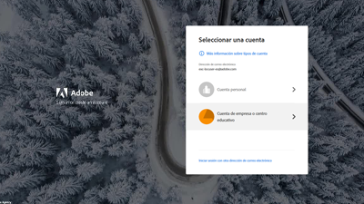
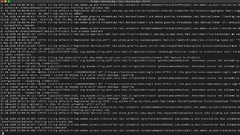

# Información general {#overview}

Adobe Experience Manager (AEM) ya está disponible as a Cloud Service. AEM como Cloud Service presenta la próxima generación de la línea de productos Experience Manager, basándose en las inversiones e innovaciones anteriores, preservando y ampliando todos los casos y funcionalidades de uso.

>[!VIDEO](https://video.tv.adobe.com/v/31085/?quality=12&learn=on)

## Novedades

* **[Autentificación para AEM como Cloud Service desde una aplicación externa (tutorial)](../headless-tutorial/authentication/overview.md)**

   *Aprenda a utilizar la autenticación basada en tokens para interactuar con AEM como Cloud Service a través de HTTP*

* **[Importación masiva (vídeo)](./migration/bulk-import.md)**

   *Obtenga información sobre cómo importar recursos de forma masiva a AEM desde Azure Blob Almacenamiento o Amazon S3*

* **[Trabajador de metadatos de asset compute (tutorial)](./asset-compute/advanced/metadata.md)**

   *Obtenga información sobre cómo volver a escribir metadatos de recursos en AEM de los trabajadores de una Asset compute*

* **[Extensibilidad de los microservicios de asset compute (tutorial)](./asset-compute/overview.md)**

   *Obtenga información sobre cómo desarrollar trabajadores de Asset compute para generar representaciones de recursos personalizadas*

* **[Configuración del acceso a AEM como Cloud Service (tutorial)](./accessing/overview.md)**

   *Obtenga información sobre cómo configurar los usuarios de IMS en Adobe Admin Console para que puedan acceder a AEM*

## Selección de personal

<table>
   <td>
      
      

         <a href="./accessing/overview.md">
         <strong>Configuración del acceso a AEM tutorial</strong>
         </a>
      

      

         <em>Configure los usuarios de IMS en Adobe Admin Console para acceder a AEM.</em>
      

   </td>   
   <td>
      
      

         <a href="./local-development-environment/overview.md">
         <strong>Tutorial de configuración de Entornos de desarrollo local</strong>
         </a>
      

      

         <em>¡Prepárese su equipo de desarrollo local para AEM como desarrollo de Cloud Service!</em>
      

   </td>   
   <td>
      
      

         <a href="./debugging/aem-sdk-local-quickstart/overview.md">
         <strong>Depuración AEM SDK</strong>
         </a>
      

      

         <em>Explore las herramientas utilizadas para depurar la aplicación en el AEM como un inicio rápido local del SDK de Cloud Service.</em>
      

   </td>
</table>

## Recursos adicionales

* [Experience League - Explorar Adobe Experience Manager](https://experienceleague.adobe.com/#recommended/solutions/experience-manager)
* [Documentación de Adobe Experience Manager como Cloud Service](https://docs.adobe.com/content/help/en/experience-manager-cloud-service/landing/home.html)
