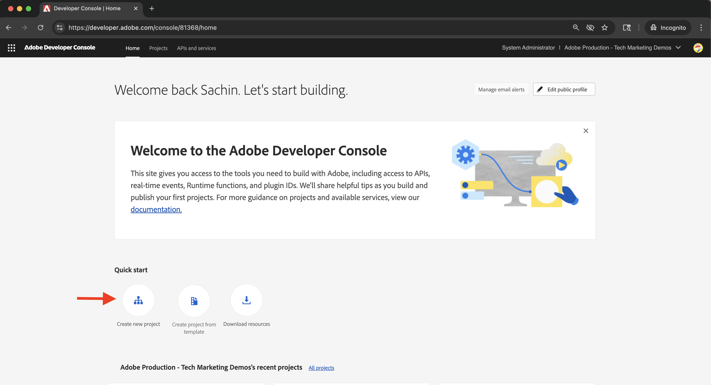
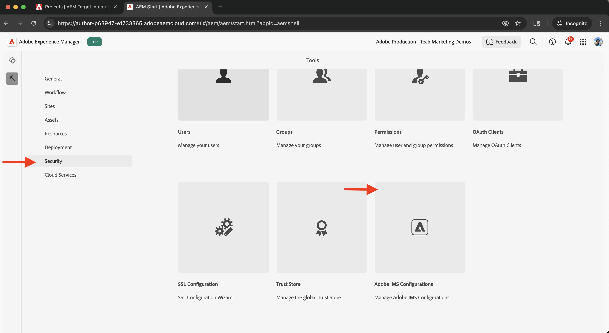
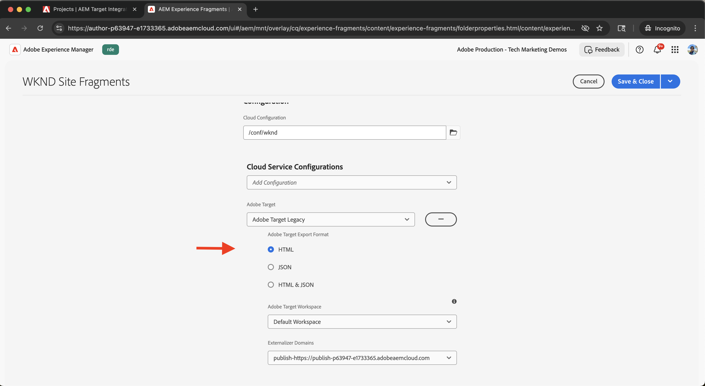
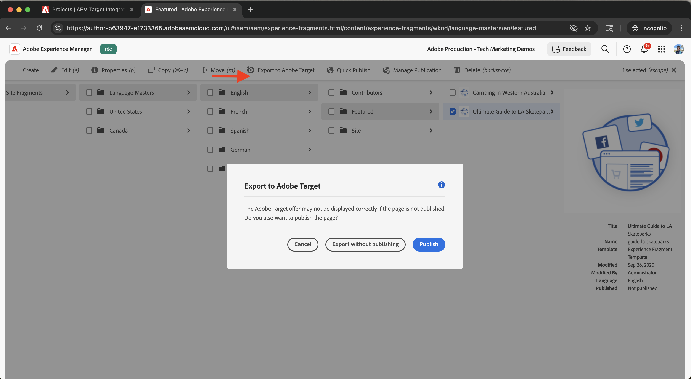

# Integración con Adobe Target

Obtenga información sobre cómo integrar AEM as a Cloud Service (AEM CS) con Adobe Target para activar contenido personalizado, como fragmentos de experiencias, como ofertas en Adobe Target.

La integración permite a su equipo de marketing crear y administrar contenido personalizado de forma centralizada en AEM. Este contenido se puede activar fácilmente como ofertas en Adobe Target.

>[!IMPORTANT]
>
>El paso de integración es opcional si su equipo prefiere administrar las ofertas completamente dentro de Adobe Target, sin utilizar AEM como repositorio de contenido centralizado.

## Pasos de alto nivel

El proceso de integración implica cuatro pasos principales que establecen la conexión entre AEM y Adobe Target:

1. **Crear y configurar un proyecto de Adobe Developer Console**
2. **Crear una configuración de Adobe IMS para Target en AEM**
3. **Crear una configuración de Adobe Target heredada en AEM**
4. **Aplicar la configuración de Adobe Target a los fragmentos de experiencias**

## Creación y configuración de un proyecto de Adobe Developer Console

Para permitir que AEM se comunique de forma segura con Adobe Target, debe configurar un proyecto de Adobe Developer Console mediante la autenticación de servidor a servidor OAuth. Puede utilizar un proyecto existente o crear uno nuevo.

1. Ve a [Adobe Developer Console](https://developer.adobe.com/console) e inicia sesión con tu Adobe ID.

2. Cree un nuevo proyecto o seleccione uno existente.\
   

3. Haga clic en **Agregar API**. En el cuadro de diálogo **Agregar una API**, filtre por **Experience Cloud**, seleccione **Adobe Target** y haga clic en **Siguiente**.\
   

4. En el cuadro de diálogo **Configurar API**, seleccione el método de autenticación **Servidor a servidor OAuth** y haga clic en **Siguiente**.\
   

5. En el paso **Seleccionar perfiles de producto**, seleccione la **Workspace predeterminada** y haga clic en **Guardar la API configurada**.\
   

6. En el panel de navegación de la izquierda, seleccione **Servidor a servidor OAuth** y revise los detalles de configuración. Tenga en cuenta el ID de cliente y el Secreto del cliente: necesita estos valores para configurar la integración de IMS en AEM.
   

## Creación de una configuración de Adobe IMS para Target en AEM

En AEM, cree una configuración de IMS de Adobe para Target con las credenciales de Adobe Developer Console. Esta configuración permite a AEM autenticarse con las API de Adobe Target.

1. En AEM, vaya a **Herramientas** > **Seguridad** y seleccione **Configuraciones de Adobe IMS**.\
   

2. Haga clic en **Crear**.\
   

3. En la página **Configuración de cuenta técnica de Adobe IMS**, escriba lo siguiente:
   - **Solución de nube**: Adobe Target
   - **Título**: Una etiqueta para la configuración, como &quot;Adobe Target&quot;
   - **Servidor de autorización**: `https://ims-na1.adobelogin.com`
   - **ID de cliente**: desde Adobe Developer Console
   - **Secreto de cliente**: de Adobe Developer Console
   - **Ámbito**: desde Adobe Developer Console
   - **ID de organización**: de Adobe Developer Console

   Luego haga clic en **Crear**.

   

4. Seleccione la configuración y haga clic en **Comprobar estado** para comprobar la conexión. Un mensaje de éxito confirma que AEM se puede conectar a Adobe Target.\
   

## Creación de una configuración de Adobe Target heredada en AEM

Para exportar fragmentos de experiencias como ofertas a Adobe Target, cree una configuración de Adobe Target heredada en AEM.

1. En AEM, vaya a **Herramientas** > **Cloud Services** y seleccione **Cloud Services heredados**.\
   

2. En la sección **Adobe Target**, haga clic en **Configurar ahora**.\
   

3. En el cuadro de diálogo **Crear configuración**, escriba un nombre como &quot;Adobe Target heredado&quot; y haga clic en **Crear**.\
   

4. En la página **Configuración heredada de Adobe Target**, proporcione lo siguiente:
   - **Autenticación**: IMS
   - **Código de cliente**: Su código de cliente de Adobe Target (encontrado en Adobe Target en **Administración** > **Implementación**)
   - **Configuración de IMS**: La configuración de IMS que creó anteriormente

   Haga clic en **Conectarse a Adobe Target** para validar la conexión.

   

## Aplicar la configuración de Adobe Target a los fragmentos de experiencias

Asocie la configuración de Adobe Target a los fragmentos de experiencias para que se puedan exportar y utilizar como ofertas en Target.

1. En AEM, vaya a **Fragmentos de experiencias**.\
   

2. Seleccione la carpeta raíz que contiene los fragmentos de experiencias (por ejemplo, `WKND Site Fragments`) y haga clic en **Propiedades**.\
   

3. En la página **Propiedades**, abra la pestaña **Cloud Services**. En la sección **Configuraciones de Cloud Service**, seleccione la configuración de Adobe Target.\
   

4. En la sección **Adobe Target** que aparece, complete lo siguiente:
   - **Formato de exportación de Adobe Target**: HTML
   - **Adobe Target Workspace**: seleccione el área de trabajo que desea utilizar (por ejemplo, &quot;Workspace predeterminado&quot;)
   - **Dominios externalizadores**: escriba los dominios para generar direcciones URL externas

   

5. Haga clic en **Guardar y cerrar** para aplicar la configuración.

## Verificar la integración

Para confirmar que la integración funciona correctamente, pruebe la funcionalidad de exportación:

1. En AEM, cree un nuevo fragmento de experiencia o abra uno existente. Haga clic en **Exportar a Adobe Target** en la barra de herramientas.\
   

2. En Adobe Target, vaya a la sección **Ofertas** y compruebe que el Fragmento de experiencia aparece como una oferta.\
   

## Recursos adicionales

- [Resumen de API de Target](https://experienceleague.adobe.com/es/docs/target-dev/developer/api/target-api-overview)
- [Oferta de Target](https://experienceleague.adobe.com/es/docs/target/using/experiences/offers/manage-content)
- [Adobe Developer Console](https://developer.adobe.com/developer-console/docs/guides/)
- [Fragmentos de experiencias en AEM](https://experienceleague.adobe.com/es/docs/experience-manager-learn/sites/experience-fragments/experience-fragments-feature-video-use)