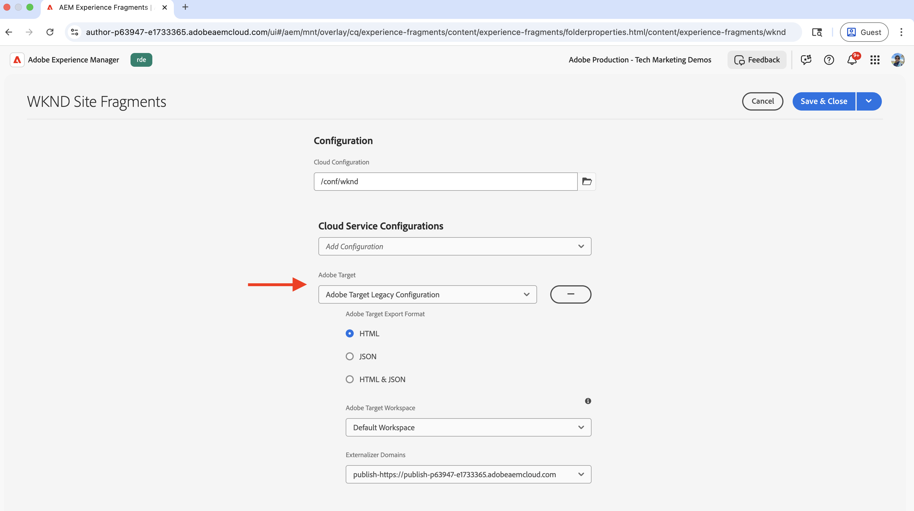
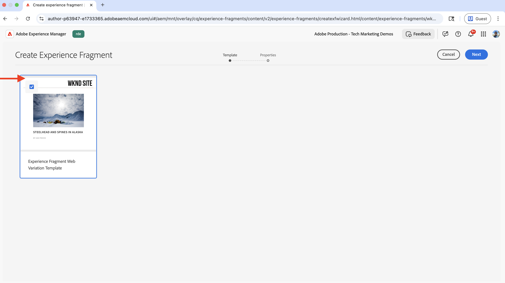
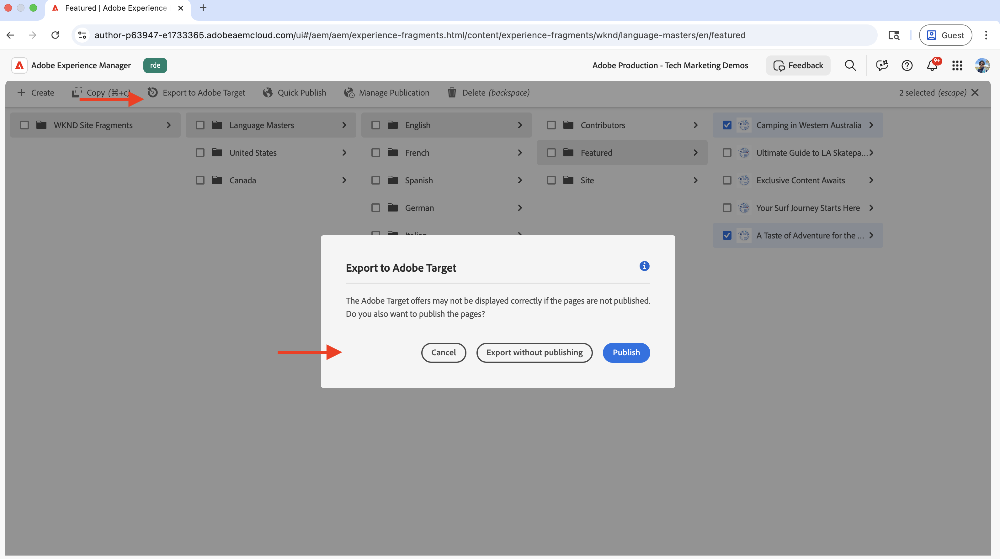

# Direccionamiento de comportamiento

Aprenda a personalizar el contenido en función del comportamiento del usuario mediante Adobe Experience Platform (AEP) y Adobe Target.

La segmentación por comportamiento permite ofrecer una personalización de la página siguiente en función del comportamiento del usuario, como las páginas que ha visitado, los productos o las categorías que ha explorado. Los escenarios comunes incluyen:

- **Hero Section Personalization**: muestra contenido personalizado en la página siguiente según la actividad de navegación del usuario
- **Personalización de elementos de contenido**: cambie titulares, imágenes o botones de call-to-action según la actividad de exploración del usuario
- **Adaptación del contenido de la página**: modifique todo el contenido de la página según la actividad de exploración del usuario

## Caso de uso de demostración

En este tutorial, el proceso muestra cómo **usuarios anónimos** que han visitado las páginas de aventuras _Bali Surf Camp_, _Riverside Camping_ o _Tahoe Skiing_ ven un héroe personalizado mostrado sobre la sección **Next Adventures** de la página principal de WKND.


Para fines de demostración, los usuarios con este comportamiento de navegación se clasifican como la audiencia **Viajeros familiares**.

### Demostración en directo

Visite el [sitio web de habilitación de WKND](https://wknd.enablementadobe.com/us/en.html) para ver la segmentación basada en el comportamiento en acción. El sitio presenta tres experiencias de segmentación conductual diferentes:

- **Página de inicio**: Cuando los usuarios visitan la página de inicio después de navegar por las páginas de aventuras _Bali Surf Camp_, _Riverside Camping_ o _Tahoe Skiing_, se clasifican como la audiencia de **Viajeros de familia** y ven una sección de héroes personalizada encima de la sección _Próximas aventuras_.

- **Página de aventura**: Cuando los usuarios ven las páginas de aventura de _Bali Surf Camp_ o _Surf Camp In Costa Rica_, se clasifican como audiencia de **Interés para surfear** y ven una sección de héroes personalizada en la página de aventuras.

- **Página de la revista**: Cuando los usuarios leen _tres o más_ artículos, se clasifican como audiencia de **Lectores de la revista** y ven una sección personalizada en la página de la revista.

>[!VIDEO](https://video.tv.adobe.com/v/3474001/?learn=on&enablevpops)

>[!TIP]
>
>La primera audiencia usa la evaluación de **Edge** para la personalización en tiempo real, mientras que la segunda y la tercera usan la evaluación de **Batch** para la personalización, lo cual es ideal para los visitantes que regresan.

## Requisitos previos

Antes de continuar con el caso de uso de segmentación por comportamiento, asegúrese de haber completado lo siguiente:

- [Integrar Adobe Target](../setup/integrate-adobe-target.md): permite a los equipos crear y administrar contenido personalizado de forma centralizada en AEM y activarlo como ofertas en Adobe Target.
- [Integrar etiquetas en Adobe Experience Platform](../setup/integrate-adobe-tags.md): permite a los equipos administrar e implementar JavaScript para la personalización y la recopilación de datos sin necesidad de volver a implementar el código de AEM.

Familiarícese también con los conceptos de [Servicio de identidad de Adobe Experience Cloud (ECID)](https://experienceleague.adobe.com/es/docs/id-service/using/home) y [Adobe Experience Platform](https://experienceleague.adobe.com/es/docs/experience-platform/landing/home), como esquema, secuencia de datos, audiencias, identidades y perfiles.

Aunque puede crear audiencias sencillas en Adobe Target, Adobe Experience Platform (AEP) proporciona el enfoque moderno para crear y administrar audiencias y crear perfiles de cliente completos mediante varias fuentes de datos, como datos de comportamiento y transaccionales.

## Pasos de alto nivel

El proceso de configuración de segmentación por comportamiento incluye pasos en Adobe Experience Platform, AEM y Adobe Target.

1. **En Adobe Experience Platform:**
   1. Creación y configuración de un esquema
   2. Crear y configurar un conjunto de datos
   3. Creación y configuración de una secuencia de datos
   4. Creación y configuración de una propiedad de etiqueta
   5. Configurar la política de combinación para el perfil
   6. Configuración (V2) del destino de Adobe Target
   7. Creación y configuración de una audiencia

2. **En AEM:**
   1. Creación de ofertas personalizadas con Fragmento de experiencia
   2. Integración e inserción de la propiedad Etiquetas en páginas de AEM
   3. Integrar Adobe Target y exportar ofertas personalizadas a Adobe Target

3. **En Adobe Target:**
   1. Verificar las audiencias y ofertas
   2. Creación y configuración de una actividad

4. **Compruebe la implementación de segmentación por comportamiento en sus páginas de AEM**

Las distintas soluciones de AEP se utilizan para recopilar, administrar y recopilar datos de comportamiento para crear audiencias. Estas audiencias se activan en Adobe Target. Con las actividades de Adobe Target, se ofrecen experiencias personalizadas a los usuarios que coinciden con los criterios de audiencias.

## Pasos de Adobe Experience Platform

Para crear audiencias basadas en datos de comportamiento, es necesario recopilar y almacenar datos cuando los usuarios visitan el sitio web o interactúan con él. En este ejemplo, para categorizar a un usuario como audiencia de **Viajeros familiares**, es necesario recopilar los datos de vista de página. El proceso se inicia en Adobe Experience Platform para configurar los componentes necesarios para recopilar estos datos.

Inicie sesión en [Adobe Experience Cloud](https://experience.adobe.com/) y vaya a **Experience Platform** desde el conmutador de aplicaciones o la sección de acceso rápido.


### Creación y configuración de un esquema

Un esquema define la estructura y el formato de los datos que recopila en Adobe Experience Platform. Garantiza la coherencia de los datos y le permite crear audiencias significativas basadas en campos de datos estandarizados. Para la segmentación basada en el comportamiento, se necesita un esquema que pueda capturar eventos de vista de página e interacciones del usuario.

Cree un esquema para recopilar datos de vista de página para la segmentación por comportamiento.

- En la página de inicio de **Adobe Experience Platform**, haga clic en **Esquemas** en el panel de navegación izquierdo y luego en **Crear esquema**.

  

- En el asistente **Crear esquema**, para el paso **Detalles del esquema**, seleccione la opción **Evento de experiencia** y haga clic en **Siguiente**.

  

- Para el paso **Nombrar y revisar**, escriba lo siguiente:
   - **Nombre para mostrar del esquema**: WKND-RDE-Behavioral-Targeting
   - **Clase seleccionada**: XDM ExperienceEvent

  

- Actualice el esquema de la siguiente manera:
   - **Agregar grupo de campos**: AEP Web SDK ExperienceEvent
   - **Perfil**: Habilitar

  

- Haga clic en **Guardar** para crear el esquema.

### Crear y configurar un conjunto de datos

Un conjunto de datos es un contenedor de datos que sigue un esquema específico. Actúa como una ubicación de almacenamiento en la que se recopilan y organizan datos de comportamiento. El conjunto de datos debe estar habilitado para que el perfil permita la creación y personalización de audiencias.

Vamos a crear un conjunto de datos para almacenar los datos de vista de página.

- En **Adobe Experience Platform**, haga clic en **Conjuntos de datos** desde la navegación izquierda y luego haga clic en **Crear conjunto de datos**.
  

- En el paso **Crear conjunto de datos**, seleccione la opción **Crear conjunto de datos a partir del esquema** y haga clic en **Siguiente**.
  

- En el asistente **Crear conjunto de datos a partir del esquema**, para el paso **Seleccionar esquema**, seleccione el esquema **WKND-RDE-Behavioral-Targeting** y haga clic en **Siguiente**.
  

- Para el paso **Configurar conjunto de datos**, escriba lo siguiente:
   - **Nombre**: WKND-RDE-Behavioral-Targeting
   - **Descripción**: conjunto de datos para almacenar datos de vista de página

  

  Haga clic en **Finalizar** para crear el conjunto de datos.

- Actualice el conjunto de datos de la siguiente manera:
   - **Perfil**: Habilitar

  

### Creación y configuración de una secuencia de datos

Un conjunto de datos es una configuración que define cómo fluyen los datos desde el sitio web a Adobe Experience Platform a través de Web SDK. Actúa como un puente entre el sitio web y la plataforma, lo que garantiza que los datos tengan el formato adecuado y se enruten a los conjuntos de datos correctos. Para la segmentación por comportamiento, necesitamos habilitar servicios específicos como Segmentación de Edge y Destinos de Personalization.

Vamos a crear un flujo de datos para enviar datos de vista de página a Experience Platform a través de Web SDK.

- En **Adobe Experience Platform**, haga clic en **Datastreams** en el panel de navegación izquierdo y luego en **Crear secuencia de datos**.

- En el paso **Nueva secuencia de datos**, escriba lo siguiente:
   - **Nombre**: WKND-RDE-Behavioral-Targeting
   - **Descripción**: secuencia de datos para enviar datos de vista de página a Experience Platform
   - **Esquema de asignación**: WKND-RDE-Behavioral-Targeting
Haga clic en **Guardar** para crear la secuencia de datos.

  

- Una vez creada la secuencia de datos, haga clic en **Agregar servicio**.

  

- En el paso **Agregar servicio**, seleccione **Adobe Experience Platform** del menú desplegable e introduzca lo siguiente:
   - **Conjunto de datos de evento**: WKND-RDE-Behavioral-Targeting
   - **Conjunto de datos del perfil**: WKND-RDE-Behavioral-Targeting
   - **Offer Decisioning**: Habilitar
   - **Segmentación de Edge**: Habilitar
   - **Destinos de Personalization**: Habilitar

  Haga clic en **Guardar** para agregar el servicio.

  

- En el paso **Agregar servicio**, seleccione **Adobe Target** en el menú desplegable e introduzca el **ID de entorno de destino**. Puede encontrar el ID de entorno de destino en Adobe Target en **Administración** > **Entornos**. Haga clic en **Guardar** para agregar el servicio.
  

### Creación y configuración de una propiedad de etiqueta

Una propiedad Tags es un contenedor de código JavaScript que recopila datos del sitio web y los envía a Adobe Experience Platform. Actúa como la capa de recopilación de datos que captura las interacciones del usuario y las vistas de página. Para la segmentación basada en el comportamiento, recopilamos detalles de página específicos como el nombre de página, la dirección URL, la sección del sitio y el nombre de host para crear audiencias significativas.

Vamos a crear una propiedad Etiquetas que capture los datos de vista de página cuando los usuarios visiten el sitio web.

Para este caso de uso, se recopilan detalles de página como el nombre de página, la dirección URL, la sección del sitio y el nombre de host. Estos detalles se utilizan para crear audiencias de comportamiento.

Puede actualizar la propiedad Etiquetas que creó en el paso [Integrar etiquetas de Adobe](../setup/integrate-adobe-tags.md). Sin embargo, para hacerlo simple, se crea una nueva propiedad Tags.

#### Crear propiedad de etiquetas

Para crear una propiedad Etiquetas, complete los siguientes pasos:

- En **Adobe Experience Platform**, haga clic en **Etiquetas** desde la navegación izquierda y luego haga clic en el botón **Nueva propiedad**.
  

- En el cuadro de diálogo **Crear propiedad**, escriba lo siguiente:
   - **Nombre de propiedad**: WKND-RDE-Behavioral-Targeting
   - **Tipo de propiedad**: Seleccionar **Web**
   - **Dominio**: Dominio donde implementa la propiedad (por ejemplo, `.adobeaemcloud.com`)

  Haga clic en **Guardar** para crear la propiedad.

  

- Abra la nueva propiedad, haga clic en **Extensiones** en el panel de navegación izquierdo y luego haga clic en la ficha **Catálogo**. Busque **Web SDK** y haga clic en el botón **Instalar**.
  

- En el cuadro de diálogo **Instalar extensión**, seleccione la **secuencia de datos** que creó anteriormente y haga clic en **Guardar**.
  

#### Añadir elementos de datos

Los elementos de datos son variables que capturan puntos de datos específicos del sitio web y los ponen a disposición para su uso en reglas y otras configuraciones de etiquetas. Actúan como componentes básicos para la recopilación de datos, lo que le permite extraer información significativa de las interacciones del usuario y las vistas de página. Para la segmentación basada en el comportamiento, es necesario capturar detalles de página como el nombre de host, la sección del sitio y el nombre de página para crear segmentos de audiencia.

Cree los siguientes elementos de datos para capturar los detalles importantes de la página.

- Haga clic en **Elementos de datos** en el panel de navegación izquierdo y luego haga clic en el botón **Crear nuevo elemento de datos**.
  

- En el cuadro de diálogo **Crear nuevo elemento de datos**, escriba lo siguiente:
   - **Nombre**: Nombre De Host
   - **Extensión**: Seleccionar **Principal**
   - **Tipo de elemento de datos**: seleccione **Código personalizado**
   - **Abrir editor** e introduzca el siguiente fragmento de código:

     ```javascript
     if(window && window.location && window.location.hostname) {
         return window.location.hostname;
     }
     ```

  

- Del mismo modo, cree los siguientes elementos de datos:

   - **Nombre**: Sección del sitio
   - **Extensión**: Seleccionar **Principal**
   - **Tipo de elemento de datos**: seleccione **Código personalizado**
   - **Abrir editor** e introduzca el siguiente fragmento de código:

     ```javascript
     if(event && event.component && event.component.hasOwnProperty('repo:path')) {
         let pagePath = event.component['repo:path'];
     
         let siteSection = '';
     
         //Check for html String in URL.
         if (pagePath.indexOf('.html') > -1) { 
         siteSection = pagePath.substring(0, pagePath.lastIndexOf('.html'));
     
         //replace slash with colon
         siteSection = siteSection.replaceAll('/', ':');
     
         //remove `:content`
         siteSection = siteSection.replaceAll(':content:','');
         }
     
         return siteSection 
     }        
     ```

   - **Nombre**: Nombre de página
   - **Extensión**: Seleccionar **Principal**
   - **Tipo de elemento de datos**: seleccione **Código personalizado**
   - **Abrir editor** e introduzca el siguiente fragmento de código:

     ```javascript
     if(event && event.component && event.component.hasOwnProperty('dc:title')) {
         // return value of 'dc:title' from the data layer Page object, which is propagated via 'cmp:show' event
         return event.component['dc:title'];
     }        
     ```

- A continuación, cree un elemento de datos de tipo **Variable**. Este elemento de datos se rellena con los detalles de la página antes de enviarlo a Experience Platform.

   - **Nombre**: Vista de página de variable XDM
   - **Extensión**: Seleccione **Adobe Experience Platform Web SDK**
   - **Tipo de elemento de datos**: Seleccione **Variable**

  En el panel derecho,

   - **espacio aislado**: seleccione su espacio aislado
   - **Esquema**: seleccione el esquema **WKND-RDE-Behavioral-Targeting**

  Haga clic en **Guardar** para crear el elemento de datos.

  

- En su lista de **elementos de datos**, debe tener cuatro elementos de datos:

  

#### Añadir reglas

Las reglas definen cuándo y cómo se recopilan y envían los datos a Adobe Experience Platform. Actúan como la capa lógica que determina qué sucede cuando se producen eventos específicos en el sitio web. Para la segmentación basada en el comportamiento, se crean reglas que capturan eventos de vista de página y rellenan elementos de datos con la información recopilada antes de enviarlos a la plataforma.

Cree una regla para rellenar el elemento de datos **XDM-Variable Pageview** con los demás elementos de datos antes de enviarlo a Experience Platform. La regla se activa cuando un usuario explora el sitio web de WKND.

- Haga clic en **Reglas** en el panel de navegación izquierdo y luego en el botón **Crear nueva regla**.
  

- En el cuadro de diálogo **Crear nueva regla**, escriba lo siguiente:

   - **Nombre**: todas las páginas - al cargar

   - Para la sección **Eventos**, haga clic en **Agregar** para abrir el asistente **Configuración de eventos**.
      - **Extensión**: Seleccionar **Principal**
      - **Tipo de evento**: Seleccione **Código personalizado**
      - **Abrir editor** e introduzca el siguiente fragmento de código:

        ```javascript
        var pageShownEventHandler = function(evt) {
            // defensive coding to avoid a null pointer exception
            if(evt.hasOwnProperty("eventInfo") && evt.eventInfo.hasOwnProperty("path")) {
                //trigger Launch Rule and pass event
                console.debug("cmp:show event: " + evt.eventInfo.path);
                var event = {
                    //include the path of the component that triggered the event
                    path: evt.eventInfo.path,
                    //get the state of the component that triggered the event
                    component: window.adobeDataLayer.getState(evt.eventInfo.path)
                };
        
                //Trigger the Launch Rule, passing in the new 'event' object
                // the 'event' obj can now be referenced by the reserved name 'event' by other Launch data elements
                // i.e 'event.component['someKey']'
                trigger(event);
            }
        }
        
        //set the namespace to avoid a potential race condition
        window.adobeDataLayer = window.adobeDataLayer || [];
        
        //push the event listener for cmp:show into the data layer
        window.adobeDataLayer.push(function (dl) {
            //add event listener for 'cmp:show' and callback to the 'pageShownEventHandler' function
            dl.addEventListener("cmp:show", pageShownEventHandler);
        });
        ```

   - Para la sección **Condiciones**, haga clic en **Agregar** para abrir el asistente **Configuración de condición**.
      - **Tipo de lógica**: seleccione **Normal**
      - **Extensión**: Seleccionar **Principal**
      - **Tipo de condición**: Seleccione **Código personalizado**
      - **Abrir editor** e introduzca el siguiente fragmento de código:

        ```javascript
        if(event && event.component && event.component.hasOwnProperty('@type') && event.component.hasOwnProperty('xdm:template')) {
            console.log('The cmp:show event is from PAGE HANDLE IT');
            return true;
        }else{
            console.log('The cmp:show event is NOT from PAGE IGNORE IT');
            return false;
        }            
        ```

   - Para la sección **Acciones**, haga clic en **Agregar** para abrir el asistente de **Configuración de la acción**.
      - **Extensión**: Seleccione **Adobe Experience Platform Web SDK**
      - **Tipo de acción**: Seleccione **Actualizar variable**
      - Asigne **web** > **webPageDetails** > **name** al elemento de datos **Page Name**

        

      - Del mismo modo, asigne el **servidor** al elemento de datos **Nombre de host** y **siteSection** al elemento de datos **Sección del sitio**. Para **pageView** > **value**, escriba `1` para indicar un evento de vista de página.

      - Haga clic en **Conservar cambios** para guardar la configuración de la acción.

   - De nuevo, haga clic en **Agregar** para agregar otra acción y abrir el asistente de **Configuración de la acción**.
      - **Extensión**: Seleccione **Adobe Experience Platform Web SDK**
      - **Tipo de acción**: Seleccionar **Enviar evento**
      - En la sección **Datos** del panel derecho, asigne el elemento de datos **XDM-Variable Pageview** al tipo de página **Vistas de página de detalles de página web**.

     

      - Además, en la sección **Personalization** del panel derecho, marque la opción **Procesar decisiones de personalización visuales**.  A continuación, haga clic en **Conservar cambios** para guardar la acción.

     

   - Haga clic en **Conservar cambios** para guardar la regla.

- La regla debería tener un aspecto similar al siguiente:

  

Los pasos de creación de reglas anteriores tienen un número considerable de detalles, por lo que debe tener cuidado al crear la regla. Puede sonar complejo, pero recuerde que estos pasos de configuración lo hacen Plug and Play sin necesidad de actualizar el código de AEM y volver a implementar la aplicación.

#### Agregar biblioteca y publicarla

Una biblioteca es una colección de todas las configuraciones de etiquetas (elementos de datos, reglas y extensiones) que se crean e implementan en el sitio web. Agrupa todo para que la recopilación de datos funcione correctamente. Para la segmentación basada en el comportamiento, la biblioteca se publica para que las reglas de recopilación de datos estén activas en el sitio web.

- Haga clic en **Flujo de publicación** en el panel de navegación izquierdo y luego haga clic en el botón **Agregar biblioteca**.
  

- En el cuadro de diálogo **Agregar biblioteca**, escriba lo siguiente:
   - **Nombre**: 1.0
   - **Entorno**: Seleccione **Desarrollo**
   - Haga clic en **Agregar todos los recursos modificados** para seleccionar todos los recursos.

  Haga clic en **Guardar y generar en desarrollo** para crear la biblioteca.

  

- Una vez creada la biblioteca para la ruta de exploración **Desarrollo**, haga clic en los puntos suspensivos (tres puntos) y seleccione la opción **Aprobar y publicar en producción**.
  

¡Enhorabuena! Ha creado la propiedad Etiquetas con la regla para recopilar detalles de página y enviarlos a Experience Platform. Este es el paso fundamental para crear audiencias de comportamiento.

### Configurar la política de combinación para el perfil

Las políticas de combinación definen cómo se unifican los datos de clientes de varias fuentes en un único perfil. Determina qué datos tienen prioridad cuando hay conflictos, lo que garantiza una vista completa y coherente de cada cliente para la segmentación basada en el comportamiento.

A los efectos de este caso de uso, se crea o actualiza una política de combinación que es:

- **Política de combinación predeterminada**: Habilitar
- **Política de combinación activa en Edge**: Habilitar

Para crear una política de combinación, complete los siguientes pasos:

- En **Adobe Experience Platform**, haga clic en **Perfiles** en el panel de navegación izquierdo y luego en la ficha **Políticas de combinación**.

  

- Puede utilizar una política de combinación existente, pero para este tutorial se crea una nueva política de combinación con la siguiente configuración:

  

- Asegúrese de habilitar las opciones **Política de combinación predeterminada** y **Política de combinación activa en Edge**. Estos ajustes garantizan que los datos de comportamiento estén correctamente unificados y disponibles para la evaluación de audiencias en tiempo real.

### Configuración (V2) del destino de Adobe Target

Adobe Target Destination (V2) permite activar audiencias de comportamiento creadas en Experience Platform directamente en Adobe Target. Esta conexión permite que las audiencias de comportamiento se utilicen para actividades de personalización en Adobe Target.

- En **Adobe Experience Platform**, haga clic en **Destinos** desde la navegación izquierda, luego haga clic en la ficha **Catálogo**, filtre por **Personalization** y seleccione **(v2) Adobe Target** como destino.

  

- En el paso **Activar destinos**, proporcione un nombre para el destino y haga clic en el botón **Conectar con destino**.
  

- En la sección **Detalles del destino**, escriba lo siguiente:
   - **Nombre**: WKND-RDE-Behavioral-Targeting-Destination
   - **Descripción**: Destino para audiencias de segmentación por comportamiento
   - **Flujo de datos**: seleccione el **Flujo de datos** que creó anteriormente
   - **Workspace**: seleccione su espacio de trabajo de Adobe Target

  

- Haga clic en **Siguiente** y complete la configuración de destino.

Una vez configurado, este destino le permite activar audiencias de comportamiento de Experience Platform a Adobe Target para utilizarlas en actividades de personalización.

### Crear y configurar una audiencia

Una audiencia define un grupo específico de usuarios en función de sus patrones de comportamiento y características. En este paso, se crea una audiencia de &quot;Viajeros de familia&quot; con las reglas de datos de comportamiento.

Para crear una audiencia, complete los siguientes pasos:

- En **Adobe Experience Platform**, haga clic en **Audiencias** desde la navegación izquierda y luego haga clic en el botón **Crear audiencia**.
  

- En el diálogo **Crear audiencia**, seleccione la opción **Generar regla** y haga clic en el botón **Crear**.
  

- En el paso **Crear**, escriba lo siguiente:
   - **Nombre**: Viajeros familiares
   - **Descripción**: Usuarios que han visitado páginas de aventuras para toda la familia
   - **Método de evaluación**: Seleccione **Edge** (para la evaluación de audiencia en tiempo real)

  

- A continuación, haga clic en la ficha **Eventos**, vaya a la **Web** > **Detalles de página web** y arrastre y suelte el campo **URL** en la sección **Reglas de eventos**. Arrastre el campo **URL** dos veces más a la sección **Reglas de evento**. Introduzca los siguientes valores:
   - **URL**: selecciona la opción **contiene** e ingresa `riverside-camping-australia`
   - **URL**: selecciona la opción **contiene** e ingresa `bali-surf-camp`
   - **URL**: selecciona la opción **contiene** e ingresa `gastronomic-marais-tour`

  

- En la sección **Eventos**, seleccione la opción **Hoy**. La audiencia debería tener un aspecto similar al siguiente:

  

- Revise la audiencia y haga clic en el botón **Activar en destino**.

  

- En el cuadro de diálogo **Activar en destino**, seleccione el destino de Adobe Target que creó anteriormente y siga los pasos para activar la audiencia.

  

- Todavía no hay datos en AEP, por lo que el recuento de audiencias es 0. Una vez que los usuarios empiezan a visitar el sitio web, se recopilan datos y aumenta el recuento de audiencias.

  

¡Enhorabuena! Ha creado la audiencia y la ha activado en el destino de Adobe Target.

Esto completa los pasos de Adobe Experience Platform y el proceso está listo para crear la experiencia personalizada en AEM y utilizarla en Adobe Target.

## Pasos de AEM

En AEM, la propiedad Etiquetas está integrada para recopilar datos de vista de página y enviarlos a Experience Platform. Adobe Target también está integrado y se crean ofertas personalizadas para la audiencia **Viajeros familiares**. Estos pasos permiten que AEM funcione con la configuración de segmentación por comportamiento creada en Experience Platform.

Empezaremos por iniciar sesión en el servicio de AEM Author para crear y configurar el contenido personalizado.

- Inicie sesión en [Adobe Experience Cloud](https://experience.adobe.com/) y vaya a **Experience Manager** desde el conmutador de aplicaciones o la sección de acceso rápido.

  

- Vaya al entorno de AEM Author y haga clic en el botón **Sitios**.
  

### Integración e inserción de la propiedad Tags en páginas de AEM

Este paso integra la propiedad Tags que se creó anteriormente en las páginas de AEM, lo que permite la recopilación de datos para la segmentación por comportamiento. La propiedad Etiquetas captura automáticamente los datos de vista de página y los envía a Experience Platform cuando los usuarios visitan el sitio web.

Para integrar la propiedad Tags en páginas de AEM, sigue los pasos de [Integrar etiquetas en Adobe Experience Platform](../setup/integrate-adobe-tags.md).

Asegúrese de usar la propiedad de etiquetas **WKND-RDE-Behavioral-Targeting** creada anteriormente, no una propiedad diferente.


Una vez integrada, la propiedad Etiquetas comienza a recopilar datos de comportamiento de las páginas de AEM y a enviarlos a Experience Platform para la creación de audiencias.

### Integración de Adobe Target y exportación de ofertas personalizadas a Adobe Target

Este paso integra Adobe Target con AEM y permite exportar contenido personalizado (fragmentos de experiencias) a Adobe Target. Esta conexión permite a Adobe Target utilizar el contenido creado en AEM para actividades de personalización con las audiencias de comportamiento creadas en Experience Platform.

Para integrar Adobe Target y exportar las ofertas de audiencia de **Viajeros de familia** a Adobe Target, sigue los pasos de [Integrar Adobe Target en Adobe Experience Platform](../setup/integrate-adobe-target.md).

Asegúrese de que la configuración de Target se aplique a los fragmentos de experiencias para que se puedan exportar a Adobe Target y usar en actividades de personalización.



Una vez integrados, pueden exportarse fragmentos de experiencias de AEM a Adobe Target, donde se utilizan como ofertas personalizadas para las audiencias de comportamiento.

### Creación de ofertas personalizadas para audiencias segmentadas

Los fragmentos de experiencias son componentes de contenido reutilizables que se pueden exportar a Adobe Target como ofertas personalizadas. Para la segmentación basada en el comportamiento, el contenido se crea específicamente diseñado para la audiencia **Viajeros de familia** que se muestra cuando los usuarios coinciden con los criterios de comportamiento.

Cree un nuevo Fragmento de experiencia con contenido personalizado para la audiencia de Viajeros de familia.

- En AEM, haga clic en **Fragmentos de experiencias**

  

- Vaya a la carpeta **Fragmentos del sitio WKND**, luego a la subcarpeta **Destacado** y haga clic en el botón **Crear**.

  

- En el diálogo **Crear fragmento de experiencia**, seleccione Plantilla de variación web y haga clic en **Siguiente**.

  

- Cree el fragmento de experiencia recién creado agregando un componente Teaser y personalícelo con contenido relevante para los viajeros en familia. Añada un título, una descripción y un call-to-action atractivos para las familias interesadas en los viajes de aventura.

  

- Seleccione el fragmento de experiencia creado y haga clic en el botón **Exportar a Adobe Target**.

  

¡Enhorabuena! Ha creado y exportado las ofertas de audiencia de **viajeros de familia** a Adobe Target. El fragmento de experiencia ya está disponible en Adobe Target como una oferta personalizada que se puede utilizar en actividades de personalización.

## Pasos de Adobe Target

En Adobe Target, se comprueba que las audiencias de comportamiento creadas en Experience Platform y las ofertas personalizadas exportadas desde AEM están disponibles correctamente. A continuación, se crea una actividad que combina la segmentación de audiencia con el contenido personalizado para ofrecer la experiencia de segmentación basada en el comportamiento.

- Inicie sesión en [Adobe Experience Cloud](https://experience.adobe.com/) y vaya a **Adobe Target** desde el conmutador de aplicaciones o la sección de acceso rápido.

  

### Verificar las audiencias y ofertas

Antes de crear la actividad de personalización, se comprueba que las audiencias de comportamiento de Experience Platform y las ofertas personalizadas de AEM están disponibles correctamente en Adobe Target. Esto garantiza que todos los componentes necesarios para la segmentación por comportamiento estén implementados.

- En Adobe Target, haga clic en **Audiencias** y compruebe que se ha creado la audiencia de Viajeros de familia.

  

- Al hacer clic en la audiencia, puede ver los detalles de la audiencia y comprobar que está configurada correctamente.

  

- A continuación, haga clic en **Ofertas** y compruebe que la oferta exportada de AEM existe. En mi caso, la oferta (o Fragmento de experiencia) se llama **Un sabor de aventura para toda la familia**.

  

### Crear y configurar una actividad

Una actividad en Adobe Target es una campaña de personalización que define cuándo y cómo se entrega contenido personalizado a audiencias específicas. Para la segmentación basada en el comportamiento, se crea una actividad que muestra la oferta personalizada a los usuarios que coinciden con los criterios de audiencia de Family Travelers.

Ahora, se crea una actividad para ofrecer la experiencia personalizada en la página de inicio para la audiencia **Viajeros familiares**.

- En Adobe Target, haga clic en **Actividades**, haga clic en el botón **Crear actividad** y seleccione el tipo de actividad **Segmentación de experiencias**.
  

- En el cuadro de diálogo **Crear actividad de segmentación de experiencias**, seleccione la opción de tipo **Web** y compositor **Visual**, e introduzca la URL de la página principal del sitio WKND. Haga clic en el botón **Crear** para crear la actividad.

  

- En el editor, selecciona la audiencia **Viajeros de familia** y agrega la oferta **Un sabor de aventura para toda la familia** antes de la sección **Próxima aventura**. Consulte la siguiente captura de pantalla como referencia.

  

- Haga clic en **Siguiente** y configure la sección **Objetivos y configuración** con los objetivos y las métricas adecuados; a continuación, actívela para publicar los cambios.

  

¡Enhorabuena! Ha creado e iniciado la actividad para ofrecer la experiencia personalizada a la audiencia **Viajeros de familia** en la página de inicio del sitio WKND. La actividad ahora está activa y muestra contenido personalizado a los usuarios que coinciden con los criterios de comportamiento.

## Verificar la implementación de segmentación por comportamiento en las páginas de AEM

Ahora que se ha configurado el flujo de direccionamiento de comportamiento completo, se ha verificado que todo funciona correctamente. Este proceso de verificación garantiza que la recopilación de datos, la evaluación de audiencias y la personalización funcionen según lo esperado.

Compruebe la implementación de segmentación por comportamiento en las páginas de AEM.

- Visite el sitio publicado (por ejemplo, el [sitio web de habilitación de WKND](https://wknd.enablementadobe.com/us/en.html)) y explore las páginas de aventuras _Bali Surf Camp_, _Riverside Camping_ o _Tahoe Skiing_. Asegúrese de pasar al menos 30 segundos en la página para almacenar en déclencheur el evento de vista de página y permitir que se recopilen los datos.

- A continuación, vuelva a la página principal y debería ver la experiencia personalizada para la audiencia de **Viajeros de familia** antes de la sección **Próxima aventura**.

  

- Abra las herramientas para desarrolladores del navegador y marque la pestaña **Red**. Filtre por `interact` para encontrar la solicitud de Web SDK. La solicitud debe mostrar los detalles del evento de Web SDK.

  

- La respuesta debe incluir las decisiones de personalización tomadas por Adobe Target, que indican que usted se encuentra en la audiencia de **Viajeros familiares**.

  

¡Enhorabuena! Ha verificado la implementación de segmentación por comportamiento en sus páginas de AEM. El flujo completo desde la recopilación de datos hasta la evaluación de audiencias y la personalización ahora funciona correctamente.

## Demostración en directo

Para ver la segmentación por comportamiento en acción, visite el [sitio web de habilitación de WKND](https://wknd.enablementadobe.com/us/en.html). Existen tres experiencias de segmentación basada en el comportamiento diferentes:

- **Página de inicio**: Para las audiencias de viajeros de familia, se muestra una oferta de imagen a pantalla completa personalizada encima de la sección _Próximas aventuras_. Cuando un usuario visita la página principal y ha visitado las páginas de aventuras _Bali Surf Camp_, _Riverside Camping_ o _Tahoe Skiing_, se clasifica al usuario como la audiencia de **Viajeros familiares**. El tipo de audiencia es **Edge**, por lo que la evaluación se realiza en tiempo real.

- **Página de aventura**: Para los aficionados al surf, la página de aventura se muestra con una sección de héroes personalizada. Cuando un usuario ve las páginas de aventuras de _Bali Surf Camp_ o _Surf Camp In Costa Rica_, se clasifica al usuario como la audiencia de **Interés para surfear**. El tipo de audiencia es **Batch**, por lo que la evaluación no se realiza en tiempo real sino en un período de tiempo como un día. Resulta útil para los visitantes que regresan.

  

- **Página de la revista**: Para los lectores de la revista, la página de la revista se muestra con una sección personalizada a pantalla completa. Cuando un usuario lee _tres o más_ artículos, se clasifica al usuario como la audiencia de **Lectores de revistas**. El tipo de audiencia es **Batch**, por lo que la evaluación no se realiza en tiempo real sino en un período de tiempo como un día. Resulta útil para los visitantes que regresan.

  

La primera audiencia usa la evaluación de **Edge** para la personalización en tiempo real, mientras que la segunda y la tercera usan la evaluación de **Batch** para la personalización, lo cual es ideal para los visitantes que regresan.


## Recursos adicionales

- [Adobe Experience Platform Web SDK](https://experienceleague.adobe.com/es/docs/experience-platform/web-sdk/home)
- [Resumen de flujos de datos](https://experienceleague.adobe.com/es/docs/experience-platform/datastreams/overview)
- [Compositor de experiencias visuales (VEC)](https://experienceleague.adobe.com/es/docs/target/using/experiences/vec/visual-experience-composer)
- [Segmentación de Edge](https://experienceleague.adobe.com/es/docs/experience-platform/segmentation/methods/edge-segmentation)
- [Tipos de audiencia](https://experienceleague.adobe.com/es/docs/experience-platform/segmentation/types/overview)
- [Conexión de Adobe Target](https://experienceleague.adobe.com/es/docs/experience-platform/destinations/catalog/personalization/adobe-target-connection)
