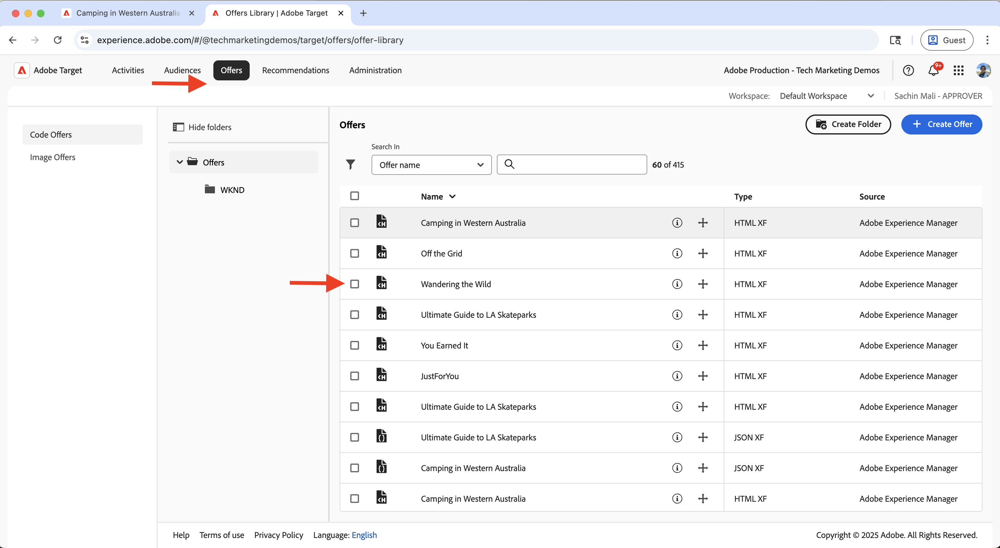
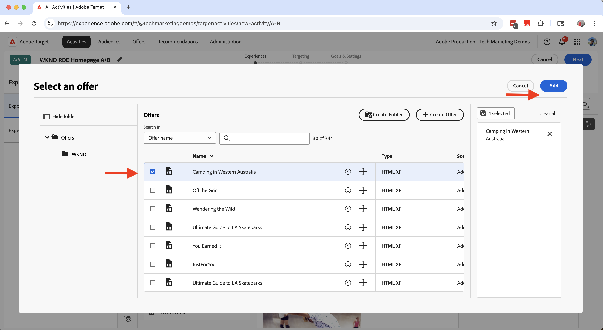
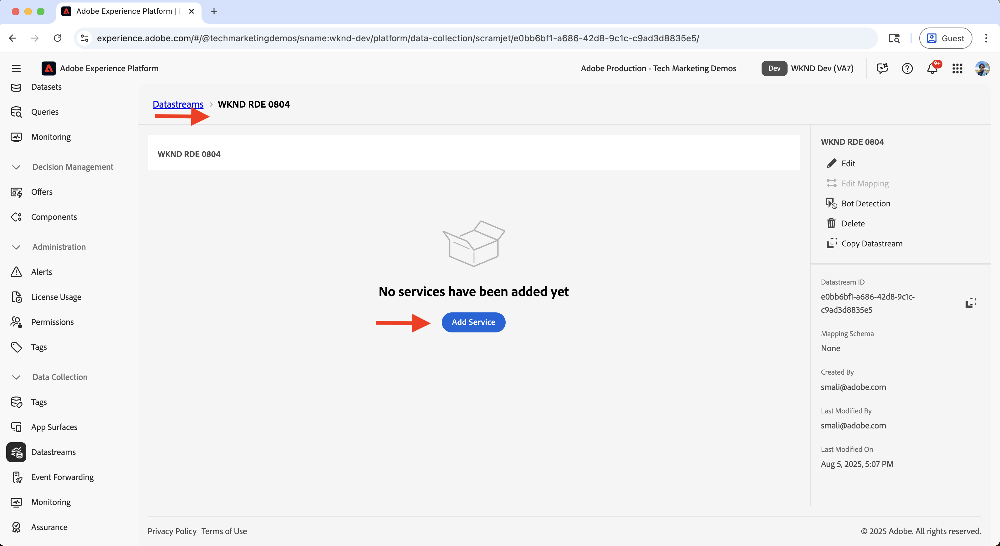
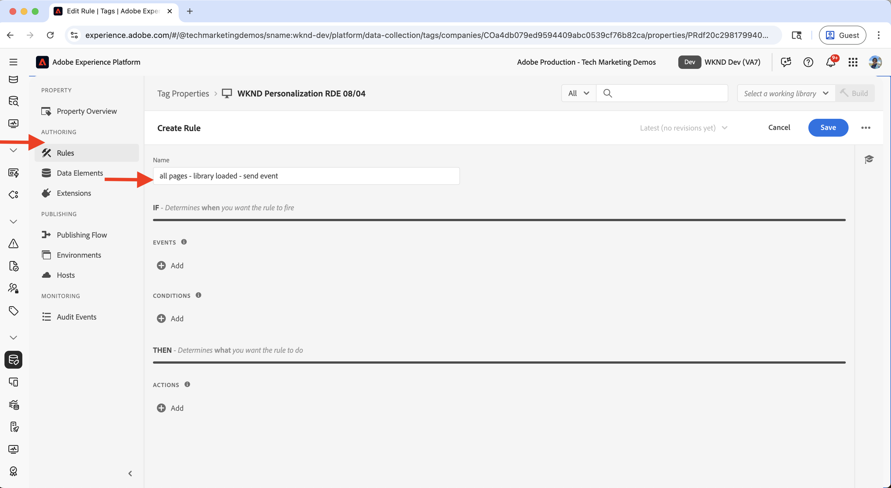

# Experimentación (Pruebas A/B)

Obtenga información sobre cómo probar diferentes variaciones de contenido en un sitio web de AEM as a Cloud Service (AEM CS) mediante Adobe Target.

Las pruebas A/B le ayudan a comparar distintas versiones de contenido para determinar cuál ofrece un mejor rendimiento a la hora de lograr sus objetivos comerciales. Los escenarios comunes incluyen:

- Prueba de variaciones en titulares, imágenes o botones de call-to-action en una página de aterrizaje
- Comparación de diferentes diseños para una página de detalles del producto
- Evaluación de ofertas promocionales o estrategias de descuento

## Caso de uso de demostración

En este tutorial, configurará la prueba A/B para el **Camping en Australia Occidental** Fragmento de experiencia (XF) en el sitio web de WKND. Se crean tres variaciones de XF y se gestiona la prueba A/B mediante Adobe Target.

Las variaciones se muestran en la página de inicio de WKND, lo que le permite medir el rendimiento y determinar qué versión genera una mejor participación y conversiones.

### Demostración en directo

Visite el [sitio web de habilitación de WKND](https://wknd.enablementadobe.com/us/en.html) para ver la prueba A/B en acción. En el siguiente vídeo, verá las tres variaciones de **Camping in Western Australia** que se muestran en la página principal a través de diferentes navegadores.

>[!VIDEO](https://video.tv.adobe.com/v/3473005/?learn=on&enablevpops)

## Requisitos previos

Antes de continuar con el caso de uso de experimentación, asegúrese de completar lo siguiente:

- [Integrar Adobe Target](../setup/integrate-adobe-target.md): permite a su equipo crear y administrar contenido personalizado de forma centralizada en AEM y activarlo como ofertas en Adobe Target.
- [Integrar etiquetas en Adobe Experience Platform](../setup/integrate-adobe-tags.md): permite a su equipo administrar e implementar JavaScript para la personalización y la recopilación de datos sin necesidad de volver a implementar el código de AEM.

## Pasos de alto nivel

El proceso de configuración de las pruebas A/B implica seis pasos principales que crean y configuran el experimento:

1. **Crear variaciones de contenido en AEM**
2. **Exportar las variaciones como ofertas a Adobe Target**
3. **Crear una actividad de prueba A/B en Adobe Target**
4. **Crear y configurar una secuencia de datos en Adobe Experience Platform**
5. **Actualizar la propiedad Tags con la extensión Web SDK**
6. **Compruebe la implementación de la prueba A/B en sus páginas de AEM**

## Creación de variaciones de contenido en AEM

En este ejemplo, se utiliza el **Camping en Australia Occidental** Fragmento de experiencia (XF) del proyecto WKND de AEM para crear tres variaciones que se utilizarán en la página de inicio del sitio web de WKND para realizar pruebas A/B.

1. En AEM, haga clic en la tarjeta **Fragmentos de experiencias**, vaya a **Camping en Australia occidental** y haga clic en **Editar**.
   

1. En el editor, en la sección **Variaciones**, haga clic en **Crear** y seleccione **Variación**.\
   

1. En el diálogo **Crear variación**:
   - **Plantilla**: Plantilla de variación web del fragmento de experiencias
   - **Título**: Por ejemplo, &quot;Fuera de la cuadrícula&quot;

   Haga clic en **Listo**.

   

1. Cree la variación copiando el componente **Teaser** de la variación principal y, a continuación, personalice el contenido (por ejemplo, actualice el título y la imagen).\
   

   >[!TIP]
   >Puede usar [Generar variaciones](https://experience.adobe.com/aem/generate-variations/) para crear rápidamente nuevas variaciones a partir del XF maestro.

1. Repita los pasos para crear otra variación (por ejemplo, &quot;Deambulando por lo salvaje&quot;).\
   

   Ahora tiene tres variaciones de Fragmento de experiencia para las pruebas A/B.

1. Antes de mostrar variaciones mediante Adobe Target, debe eliminar el teaser estático existente de la página principal. Evita el contenido duplicado, ya que las variaciones del fragmento de experiencia se insertan dinámicamente mediante Target.

   - Vaya a la **página principal en inglés** `/content/wknd/language-masters/en`
   - En el editor, elimine el componente teaser **Camping in Western Australia**.\
     

1. Despliegue los cambios en la página principal de **US > English** (`/content/wknd/us/en`) para propagar las actualizaciones.\
   

1. Publique la página de inicio de **US > English** para que las actualizaciones se publiquen.\
   

## Exportación de variaciones como ofertas a Adobe Target

Exporte las variaciones del fragmento de experiencia para que se puedan utilizar como ofertas en Adobe Target para la prueba A/B.

1. En AEM, vaya a **Camping en Australia Occidental**, seleccione las tres variaciones y haga clic en **Exportar a Adobe Target**.\
   

2. En Adobe Target, vaya a **Ofertas** y confirme que las variaciones se han importado.\
   

## Crear una actividad de prueba A/B en Adobe Target

Ahora cree una actividad de prueba A/B para ejecutar el experimento en la página principal.

1. Instale la extensión de Chrome [Ayuda de edición visual de Adobe Experience Cloud](https://chromewebstore.google.com/detail/adobe-experience-cloud-vi/kgmjjkfjacffaebgpkpcllakjifppnca).

1. En Adobe Target, vaya a **Actividades** y haga clic en **Crear actividad**.\
   

1. En el cuadro de diálogo **Crear actividad de prueba A/B**, escriba lo siguiente:
   - **Tipo**: Web
   - **Compositor**: Visual
   - **URL de actividad**: por ejemplo: `https://wknd.enablementadobe.com/us/en.html`

   Haga clic en **Crear**.

   

1. Cambie el nombre de la actividad por algo significativo (por ejemplo, &quot;Prueba A/B de la página principal de WKND&quot;).\
   

1. En la **experiencia A**, agregue el componente **Fragmento de experiencia** sobre la sección **Artículos recientes**.\
   

1. En el cuadro de diálogo del componente, haga clic en **Seleccionar una oferta**.\
   

1. Elige la variación **Camping en Australia Occidental** y haz clic en **Agregar**.\
   

1. Repita el proceso para la **experiencia B** y **C**, seleccionando **Fuera de la cuadrícula** y **Vagando por el bosque** respectivamente.\
   

1. En la sección **Segmentación**, confirme que el tráfico se divide a partes iguales en todas las experiencias.\
   

1. En **Objetivos y configuración**, defina la métrica de éxito (por ejemplo, CTA hace clic en el Fragmento de experiencia).\
   

1. Haga clic en **Activar** en la esquina superior derecha para iniciar la prueba.\
   

## Creación y configuración de una secuencia de datos en Adobe Experience Platform

Para conectar Adobe Web SDK a Adobe Target, cree una secuencia de datos en Adobe Experience Platform. La secuencia de datos actúa como una capa de enrutamiento entre Web SDK y Adobe Target.

1. En Adobe Experience Platform, vaya a **Datastreams** y haga clic en **Crear Datastream**.\
   

1. En el cuadro de diálogo **Crear secuencia de datos**, escriba un **Nombre** para la secuencia de datos y haga clic en **Guardar**.\
   

1. Una vez creada la secuencia de datos, haga clic en **Agregar servicio**.\
   

1. En el paso **Agregar servicio**, seleccione **Adobe Target** en el menú desplegable e introduzca el **ID de entorno de destino**. Puede encontrar el ID de entorno de destino en Adobe Target en **Administración** > **Entornos**. Haga clic en **Guardar** para agregar el servicio.\
   

1. Revise los detalles de la secuencia de datos para comprobar que el servicio Adobe Target aparece en la lista y está configurado correctamente.\
   

## Actualizar la propiedad Tags con la extensión Web SDK

Para enviar eventos de personalización y recopilación de datos desde páginas de AEM, agregue la extensión Web SDK a la propiedad Tags y configure una regla que active los déclencheur al cargar la página.

1. En Adobe Experience Platform, vaya a **Etiquetas** y abra la propiedad que creó en el paso [Integrar etiquetas de Adobe](../setup/integrate-adobe-tags.md).
   

1. En el menú de la izquierda, haz clic en **Extensiones**, cambia a la pestaña **Catálogo** y busca **Web SDK**. Haga clic en **Instalar** en el panel derecho.\
   

1. En el cuadro de diálogo **Instalar extensión**, seleccione la **secuencia de datos** que creó anteriormente y haga clic en **Guardar**.\
   

1. Después de instalar, compruebe que las extensiones **Adobe Experience Platform Web SDK** y **Core** aparecen en la pestaña **Instalado**.\
   

1. A continuación, configure una regla para enviar el evento de Web SDK cuando se cargue la biblioteca. Vaya a **Reglas** desde el menú de la izquierda y haga clic en **Crear nueva regla**.

   

   >[!TIP]
   >
   >Una regla permite definir cuándo y cómo se activan las etiquetas en función de las interacciones del usuario o los eventos del explorador.

1. En la pantalla **Crear regla**, escriba un nombre de regla (por ejemplo, `All Pages - Library Loaded - Send Event`) y haga clic en **+ Agregar** en la sección **Eventos**.
   

1. En el cuadro de diálogo **Configuración del evento**:
   - **Extensión**: Seleccionar **Principal**
   - **Tipo de evento**: seleccione **Biblioteca cargada (Principio de página)**
   - **Nombre**: Escriba `Core - Library Loaded (Page Top)`

   Haga clic en **Conservar cambios** para guardar el evento.

   

1. En la sección **Acciones**, haga clic en **+ Agregar** para definir la acción que se producirá cuando se active el evento.

1. En el cuadro de diálogo **Configuración de la acción**:
   - **Extensión**: Seleccione **Adobe Experience Platform Web SDK**
   - **Tipo de acción**: Seleccionar **Enviar evento**
   - **Nombre**: Seleccione **AEP Web SDK - Enviar evento**

   

1. En la sección **Personalization** del panel derecho, marque la opción **Procesar decisiones de personalización visuales**. A continuación, haga clic en **Conservar cambios** para guardar la acción.\
   

   >[!TIP]
   >
   >   Esta acción envía un evento de AEP Web SDK cuando se carga la página, lo que permite a Adobe Target enviar contenido personalizado.

1. Revise la regla completada y haga clic en **Guardar**.
   

1. Para aplicar los cambios, ve a **Flujo de publicación** y agrega la regla actualizada a una **biblioteca**.\
   

1. Finalmente, promocione la biblioteca a **Producción**.
   

## Comprobación de la implementación de la prueba A/B en las páginas de AEM

Una vez que la actividad esté activa y la biblioteca de etiquetas se haya publicado en producción, puede comprobar la prueba A/B en sus páginas de AEM.

1. Visite el sitio publicado (por ejemplo, [sitio web de habilitación de WKND](https://wknd.enablementadobe.com/us/en.html)) y observe qué variación se muestra. Intente acceder a él desde un explorador diferente o dispositivo móvil para ver variaciones alternativas.
   

1. Abra las herramientas para desarrolladores del navegador y marque la pestaña **Red**. Filtre por `interact` para encontrar la solicitud de Web SDK. La solicitud debe mostrar los detalles del evento de Web SDK.

   

La respuesta debe incluir las decisiones de personalización tomadas por Adobe Target, lo que indica qué variación se proporcionó.\

1. También puede usar la extensión de Chrome [Adobe Experience Platform Debugger](https://chromewebstore.google.com/detail/adobe-experience-platform/bfnnokhpnncpkdmbokanobigaccjkpob) para inspeccionar los eventos de Web SDK.
   

## Demostración en directo

Para ver la prueba A/B en acción, visite el [sitio web de habilitación de WKND](https://wknd.enablementadobe.com/us/en.html) y observe cómo se muestran las diferentes variaciones del fragmento de experiencia en la página principal.

## Recursos adicionales

- [Información general sobre pruebas A/B](https://experienceleague.adobe.com/es/docs/target/using/activities/abtest/test-ab)
- [Adobe Experience Platform Web SDK](https://experienceleague.adobe.com/es/docs/experience-platform/web-sdk/home)
- [Resumen de flujos de datos](https://experienceleague.adobe.com/es/docs/experience-platform/datastreams/overview)
- [Compositor de experiencias visuales (VEC)](https://experienceleague.adobe.com/es/docs/target/using/experiences/vec/visual-experience-composer)
