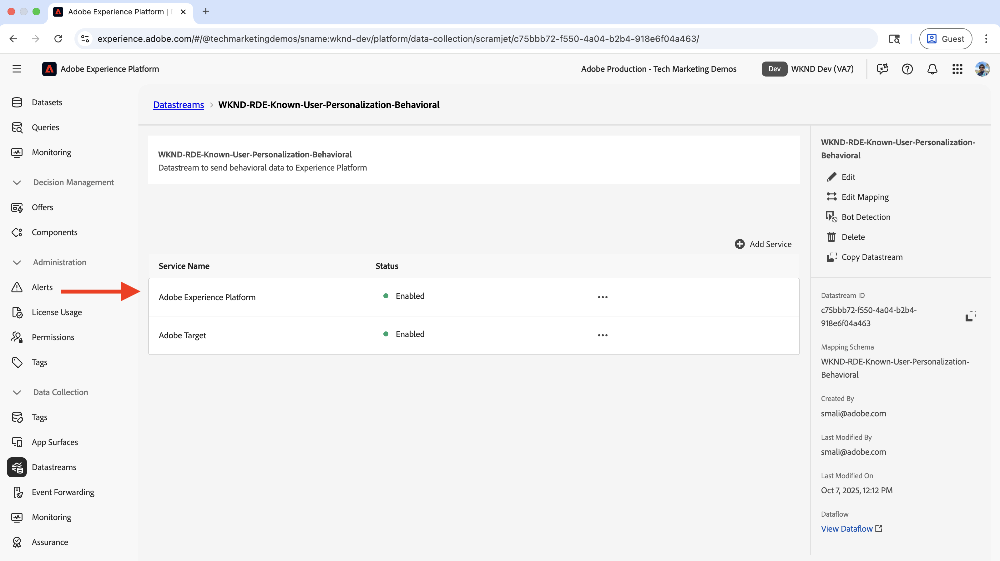
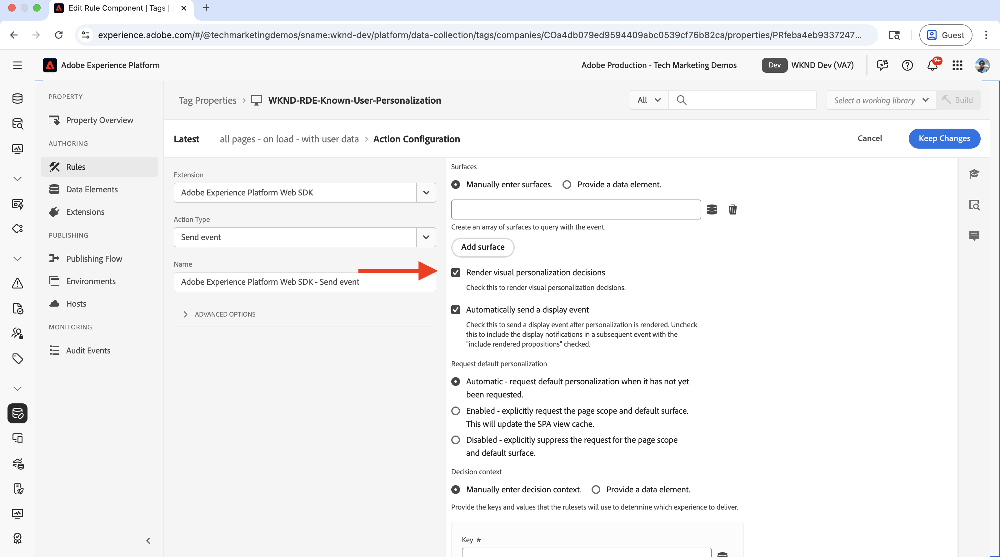
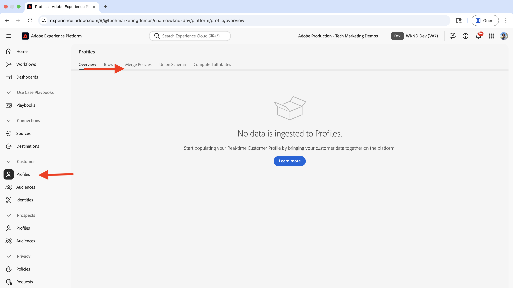
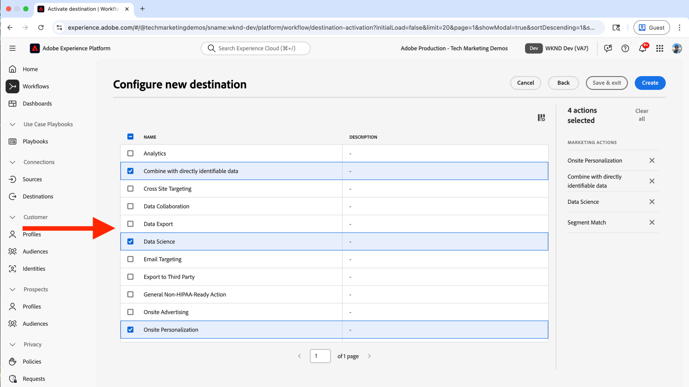
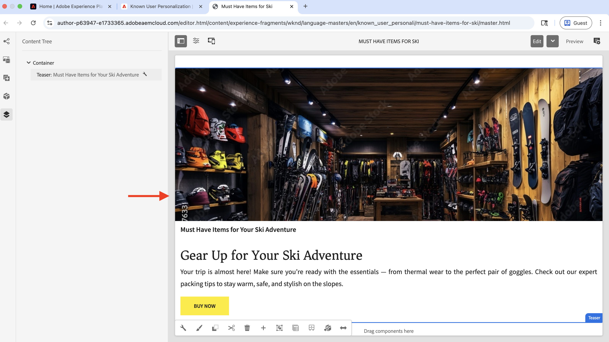
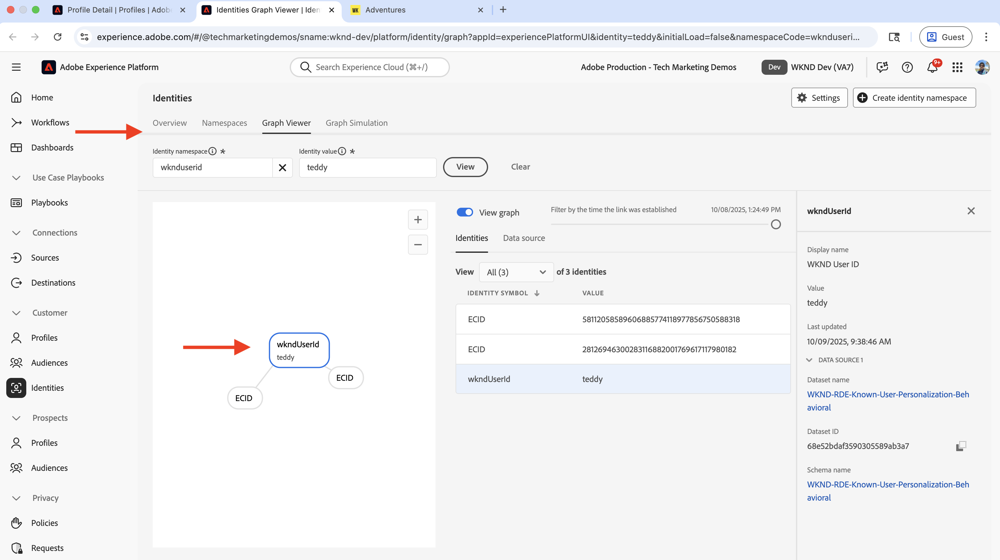
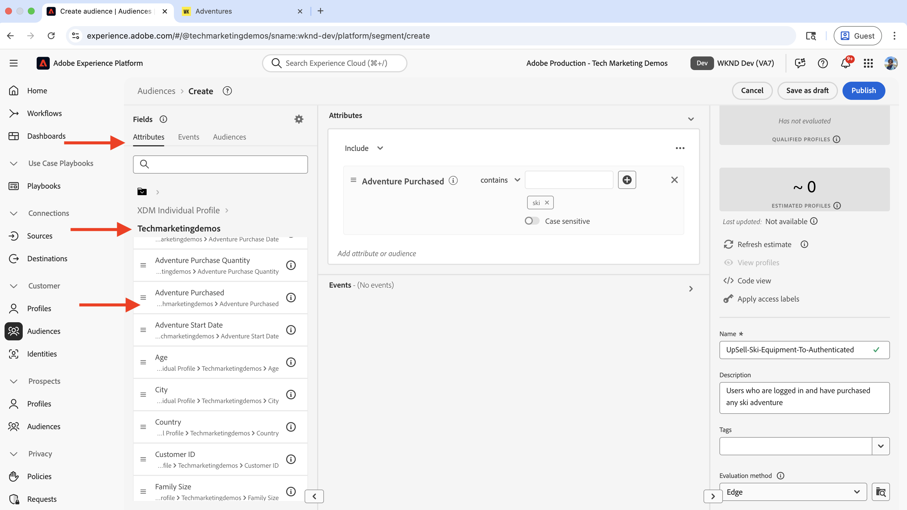
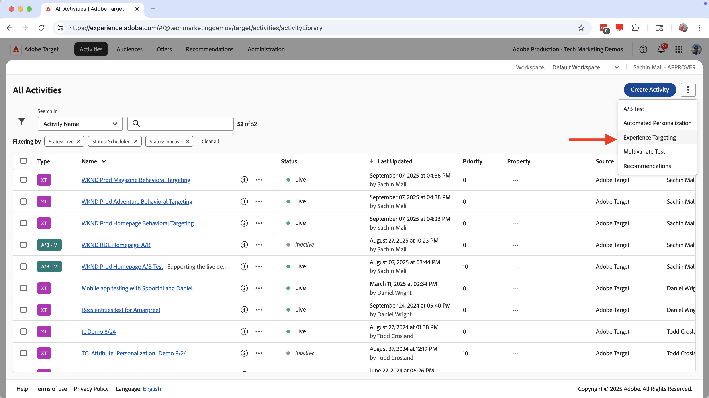

# Personalización de usuario conocido

Aprenda a personalizar el contenido en función de datos de usuarios conocidos, como el historial de compras, los datos CRM u otros datos recopilados sobre el usuario.

La personalización de usuarios conocidos le ayuda a ofrecer experiencias personalizadas a los usuarios en función de los datos que haya recopilado sobre ellos. Los datos de _usuario podrían haberse recopilado mediante diferentes sistemas_ o canales, como sitio web, aplicación móvil, centro de llamadas, etc. Estos _datos se vinculan para crear un perfil de usuario completo_ y se usan para personalizar las experiencias.

Los escenarios comunes incluyen:

- **Personalización de contenido**: muestra experiencias personalizadas basadas en los datos de perfil del usuario. Por ejemplo, mostrar un héroe personalizado en la página de inicio en función del historial de compras del usuario.
- **Ampliar venta y realizar ventas cruzadas**: muestra recomendaciones personalizadas de ampliación de venta y venta cruzada basadas en el historial de compras del usuario. Por ejemplo, mostrar una recomendación de ampliación de venta personalizada para el historial de compras del usuario.
- **Programa de fidelización**: muestra los beneficios personalizados del programa de fidelización en función del historial de compras del usuario. Por ejemplo, mostrar un beneficio personalizado del programa de lealtad para el historial de compras del usuario.

Su organización puede tener diferentes casos de uso para la personalización de usuarios conocidos. Los anteriores son solo algunos ejemplos.

## Ejemplo de caso de uso

>[!VIDEO](https://video.tv.adobe.com/v/3476112/?captions=spa&learn=on&enablevpops)

En este tutorial, con el [sitio WKND de ejemplo](https://github.com/adobe/aem-guides-wknd), el proceso muestra cómo **los usuarios que iniciaron sesión** que han comprado cualquier aventura de **Ski** ven un héroe personalizado en la **página principal de WKND**.

La experiencia héroe intenta _aumentar las ventas_ del equipo de esquí esencial para los usuarios que hayan comprado cualquier aventura de **Esquí**. Los usuarios que no hayan comprado ninguna aventura de **Ski** verán el contenido predeterminado para héroes. Por lo tanto, la experiencia Hero está personalizada para los usuarios en función de su historial de compras y estado de inicio de sesión. Para habilitar esta personalización, los datos de diferentes sistemas se unen para crear un perfil de cliente completo y se utilizan para actividades de personalización.


### Administración de datos de usuario en todos los sistemas

Para fines de demostración, supongamos que los datos de usuario de WKND están en los siguientes sistemas. Cada sistema almacena diferentes tipos de datos que se pueden clasificar en dos categorías:

- **Datos de comportamiento**: captura las interacciones y actividades del usuario en canales digitales (vistas de página, clics, navegación del sitio, estado de inicio de sesión, patrones de exploración).
- **Datos transaccionales**: Registra las transacciones comerciales completadas y la información de perfil del cliente (compras, historial de pedidos, detalles de perfil, preferencias)

| Sistema | Función | ¿Qué datos se almacenan? | Tipo de datos |
|------|------|------|------|
| AEM | Sistema de administración de contenido (CMS), listados y reservas de aventuras y funcionalidad de inicio de sesión | Interacciones del usuario: vistas de página, estado de inicio de sesión, navegación del sitio. Identificadores de usuario mínimos como ID de usuario, nombre, correo electrónico. | Datos de comportamiento |
| Otros sistemas | Registros de transacciones de compra y perfil de usuario como sistema completo de registro. | Completar perfiles de cliente: ID de usuario, nombre, dirección, número de teléfono, historial de compras, detalles de pedidos, preferencias. | Datos transaccionales |

El otro sistema podría ser un sistema Order Management (OMS), un sistema de administración de la relación con los clientes (CRM), un sistema de administración de datos maestros (MDM) o cualquier otro sistema que almacene los datos transaccionales.

También se da por hecho que el sitio WKND tiene una interfaz de usuario (IU) que permite a los usuarios comprar o reservar **aventuras**. El AEM está integrado con el otro sistema para almacenar los datos de compra de aventuras. Además, antes o durante la compra, el usuario ha creado una cuenta en el sitio WKND.

El diagrama lógico muestra la interacción del usuario con el sitio WKND y cómo se recopilan y alimentan los datos de comportamiento y transaccionales en Experience Platform.


Se trata de una versión sobresimplificada para mostrar el concepto de personalización de usuario conocida. En una situación real, es posible que tenga varios sistemas en los que se recopilen y almacenen datos de comportamiento y transaccionales.

### Puntos clave

- **Almacenamiento de datos distribuido**: los datos de usuario se almacenan en varios sistemas. AEM almacena datos mínimos de usuario (id de usuario, nombre, correo electrónico) para la funcionalidad de inicio de sesión, mientras que otros sistemas (OMS, CRM, MDM) mantienen un perfil de usuario completo y datos transaccionales como el historial de compras.
- **Vinculación de identidad**: los sistemas se vinculan mediante un identificador común (ID de usuario de WKND: `wkndUserId`) que identifica de forma exclusiva a los usuarios en diferentes plataformas y canales.
- **Creación completa de perfiles**: el objetivo es unir los datos de usuario de estos sistemas distribuidos para crear un perfil de cliente unificado, que luego se usa para ofrecer experiencias personalizadas.

Su caso de uso puede tener diferentes sistemas y almacenamiento de datos. La clave es identificar un identificador común que identifique de forma exclusiva a los usuarios en diferentes plataformas y canales.

## Requisitos previos

Antes de continuar con el caso de uso de personalización de usuario conocido, asegúrese de completar lo siguiente:

- [Integrar Adobe Target](../setup/integrate-adobe-target.md): permite a los equipos crear y administrar contenido personalizado de forma centralizada en AEM y activarlo como ofertas en Adobe Target.
- [Integrar etiquetas en Adobe Experience Platform](../setup/integrate-adobe-tags.md): permite a los equipos administrar e implementar JavaScript para la personalización y la recopilación de datos sin necesidad de volver a implementar el código de AEM.

Familiarícese también con los conceptos de [Servicio de identidad de Adobe Experience Cloud (ECID)](https://experienceleague.adobe.com/es/docs/id-service/using/home) y [Adobe Experience Platform](https://experienceleague.adobe.com/es/docs/experience-platform/landing/home), como esquema, conjunto de datos, flujo de datos, audiencias, identidades y perfiles.

En este tutorial, aprenderá a vincular identidades y a crear un perfil de cliente en Adobe Experience Platform. Por lo tanto, combinar los datos de comportamiento con los datos transaccionales para crear un perfil de cliente completo.

## Pasos de alto nivel

El proceso de configuración de personalización de usuario conocido implica realizar pasos en Adobe Experience Platform, AEM y Adobe Target.

1. **En Adobe Experience Platform:**
   1. Crear _área de nombres de identidad_ para el identificador de usuario de WKND (`wkndUserId`)
   1. Cree y configure dos esquemas XDM (Experience Data Model): estructuras de datos estandarizadas que definen cómo se organizan y validan los datos, una para los datos de comportamiento y otra para los datos transaccionales
   1. Cree y configure dos conjuntos de datos, uno para los datos de comportamiento y otro para los datos transaccionales
   1. Creación y configuración de una secuencia de datos
   1. Creación y configuración de una propiedad de etiqueta
   1. Configurar la política de combinación para el perfil
   1. Configuración (V2) del destino de Adobe Target

2. **En AEM:**
   1. Mejora de la funcionalidad de inicio de sesión en el sitio WKND para almacenar el ID de usuario en el almacenamiento de sesión del explorador.
   1. Integración e inserción de la propiedad Etiquetas en páginas de AEM
   1. Verificación de la recopilación de datos en páginas de AEM
   1. Integración con Adobe Target
   1. Creación de ofertas personalizadas

3. **En Adobe Experience Platform:**
   1. Verificar los datos de comportamiento y la creación de perfiles
   1. Ingesta de datos transaccionales
   1. Verificar la vinculación de datos de comportamiento y transaccionales
   1. Creación y configuración de una audiencia
   1. Activar la audiencia en Adobe Target

4. **En Adobe Target:**
   1. Verificar las audiencias y ofertas
   1. Creación y configuración de una actividad

5. **Compruebe la implementación de personalización de usuario conocido en sus páginas de AEM**

Las distintas soluciones de Adobe Experience Platform (AEP) se utilizan para recopilar, gestionar, identificar y unir los datos de usuario entre sistemas. Con los datos de usuario enlazados, las audiencias se crean y activan en Adobe Target. Con las actividades de Adobe Target, se ofrecen experiencias personalizadas a los usuarios que coinciden con los criterios de audiencias.

## Configuración de Adobe Experience Platform

Para crear un perfil de cliente completo, es necesario recopilar y almacenar datos de comportamiento (datos de vista de página) y transaccionales (compras de WKND Adventure). Los datos de comportamiento se recopilan mediante la propiedad Etiquetas y los datos transaccionales se recopilan mediante el sistema de compras WKND Adventure.

A continuación, los datos transaccionales se incorporan a Experience Platform y se vinculan con los datos de comportamiento para crear un perfil de cliente completo.

En este ejemplo, para categorizar a un usuario que ha comprado cualquier aventura de **Esquí**, se necesitan datos de vista de página junto con los datos de compra de aventura. Los datos se vinculan mediante el identificador de usuario de WKND (`wkndUserId`), que es un identificador común en todos los sistemas.

Empecemos por iniciar sesión en Adobe Experience Platform para configurar los componentes necesarios para recopilar y unir los datos.

Inicie sesión en [Adobe Experience Cloud](https://experience.adobe.com/) y vaya a **Experience Platform** desde el conmutador de aplicaciones o la sección de acceso rápido.


### Crear área de nombres de identidad

Un área de nombres de identidad es un contenedor lógico que proporciona contexto a las identidades, lo que ayuda a Experience Platform a comprender qué sistema de ID se está utilizando (por ejemplo, correo electrónico, ID de CRM o ID de fidelidad). Para relacionar dos o más fragmentos discretos de datos de perfil, se utiliza un área de nombres de identidad. Cuando ambos fragmentos discretos de datos de perfil tienen el mismo valor para un atributo y comparten el mismo área de nombres, se vinculan. Para calificar un atributo como atributo de vinculación de identidad, debe ser del mismo área de nombres.

En este ejemplo, el identificador de usuario de WKND (`wkndUserId`) es el identificador común en todos los datos de comportamiento y transaccionales. Con este identificador común, los datos se vinculan para crear un perfil de cliente completo.

Vamos a crear un área de nombres de identidad para el identificador de usuario de WKND (`wkndUserId`).

- En **Adobe Experience Platform**, haga clic en **Identidades** desde el panel de navegación izquierdo. A continuación, haga clic en el botón **Crear área de nombres de identidad** de la parte superior derecha.

  

- En el cuadro de diálogo **Crear área de nombres de identidad**, escriba lo siguiente:
   - **Nombre para mostrar**: ID de usuario de WKND
   - **Descripción**: ID de usuario o nombre de usuario del usuario WKND que inició sesión.
   - **Seleccionar un tipo**: ID individual entre dispositivos

  Haga clic en **Crear** para crear el área de nombres de identidad.

  

### Creación de esquemas

Un esquema define la estructura y el formato de los datos que recopila en Adobe Experience Platform. Garantiza la coherencia de los datos y le permite crear audiencias significativas basadas en campos de datos estandarizados. Para la personalización de usuarios conocidos, se necesitan dos esquemas, uno para los datos de comportamiento y otro para los datos transaccionales.

#### Esquema de datos de comportamiento

En primer lugar, cree un esquema para recopilar los datos de comportamiento, como eventos de vista de página e interacciones de usuarios.

- En **Adobe Experience Platform**, haga clic en **Esquemas** en el panel de navegación izquierdo y, a continuación, haga clic en el botón **Crear esquema** en la parte superior derecha. Luego selecciona la opción **Manual** y haz clic en el botón **Seleccionar**.

  

- En el asistente **Crear esquema**, para el paso **Detalles del esquema**, seleccione la opción **Evento de experiencia** (para datos de series temporales como vistas de página, clics e interacciones de usuarios) y haga clic en **Siguiente**.

  

- Para el paso **Nombrar y revisar**, escriba lo siguiente:
   - **Nombre para mostrar del esquema**: WKND-RDE-Known-User-Personalization-Behavioral
   - **Clase seleccionada**: XDM ExperienceEvent

  

- Actualice el esquema de la siguiente manera:
   - **Agregar grupo de campos**: AEP Web SDK ExperienceEvent
   - **Perfil**: Habilitar

  Haga clic en **Guardar** para crear el esquema.

  

- Para saber si el usuario ha iniciado sesión (autenticado) o es anónimo, agregue un campo personalizado al esquema. En este caso de uso, el objetivo es personalizar el contenido para los usuarios conocidos que hayan comprado cualquier aventura de **Ski**. Por lo tanto, es importante identificar si el usuario ha iniciado sesión (autenticado) o es anónimo.


   - Haga clic en el botón **+** junto al nombre del esquema.
   - En la sección **Propiedades del campo**, escriba lo siguiente:
      - **Nombre de campo**: wkndLoginStatus
      - **Nombre para mostrar**: Estado de inicio de sesión WKND
      - **Tipo**: Cadena
      - **Asignar a**: grupo de campos > `wknd-user-details`

     Desplácese hacia abajo y haga clic en el botón **Aplicar**.

     

- El esquema de datos de comportamiento final debe tener este aspecto:

  

#### Esquema de datos transaccionales

A continuación, cree un esquema para recopilar los datos transaccionales como las compras de WKND Adventure.

- En el asistente **Crear esquema**, para el paso **Detalles del esquema**, seleccione la opción **Perfil individual** (para datos basados en registros como atributos del cliente, preferencias e historial de compras) y haga clic en **Siguiente**.

  

- Para el paso **Nombrar y revisar**, escriba lo siguiente:
   - **Nombre para mostrar del esquema**: WKND-RDE-Known-User-Personalization-Transactional
   - **Clase seleccionada**: Perfil individual de XDM

  

- Para almacenar los detalles de compra de WKND Adventure de un usuario, primero vamos a añadir un campo personalizado que sirva como identificador para la compra. Recuerde, el ID de usuario de WKND (`wkndUserId`) es el identificador común en todos los sistemas.
   - Haga clic en el botón **+** junto al nombre del esquema.
   - En la sección **Propiedades del campo**, escriba lo siguiente:
      - **Nombre de campo**: wkndUserId
      - **Nombre para mostrar**: ID de usuario de WKND
      - **Tipo**: Cadena
      - **Asignar a**: grupo de campos > `wknd-user-purchase-details`

  

   - Desplácese hacia abajo, compruebe **Identidad**, compruebe **Identidad principal** (el identificador principal utilizado para unir datos de diferentes fuentes en un perfil unificado) y en el menú desplegable **Área de nombres de identidad**, seleccione **Id de usuario de WKND**. Finalmente, haga clic en el botón **Aplicar**.

  

- Después de agregar el campo de identidad principal personalizado, el esquema debe tener este aspecto:

  

- Del mismo modo, agregue los siguientes campos para almacenar detalles adicionales de compra de usuarios y aventuras:

  | Nombre de campo | Nombre para mostrar | Tipo | Asignar a |
  |----------|------------|----|---------|
  | adventurePurchased | Aventura adquirida | Cadena | Grupo de campos > `wknd-user-purchase-details` |
  | adventurePurchaseAmount | Cantidad de compra de aventura | Doble | Grupo de campos > `wknd-user-purchase-details` |
  | adventurePurchaseQuantity | Cantidad de compra de aventura | Entero | Grupo de campos > `wknd-user-purchase-details` |
  | adventurePurchaseDate | Fecha de compra de aventura | Fecha | Grupo de campos > `wknd-user-purchase-details` |
  | adventureStartDate | Fecha de inicio de aventura | Fecha | Grupo de campos > `wknd-user-purchase-details` |
  | adventureEndDate | Fecha de finalización de aventura | Fecha | Grupo de campos > `wknd-user-purchase-details` |
  | firstName | Nombre | Cadena | Grupo de campos > `wknd-user-purchase-details` |
  | lastName | Apellidos | Cadena | Grupo de campos > `wknd-user-purchase-details` |
  | email | Correo electrónico | Dirección de correo electrónico | Grupo de campos > `wknd-user-purchase-details` |
  | teléfono | Teléfono | Objeto | Grupo de campos > `wknd-user-purchase-details` |
  | sexo | Género | Cadena | Grupo de campos > `wknd-user-purchase-details` |
  | edad | Edad | Entero | Grupo de campos > `wknd-user-purchase-details` |
  | dirección | Dirección | Cadena | Grupo de campos > `wknd-user-purchase-details` |
  | ciudad | Ciudad | Cadena | Grupo de campos > `wknd-user-purchase-details` |
  | estado | Estado | Cadena | Grupo de campos > `wknd-user-purchase-details` |
  | país | País | Cadena | Grupo de campos > `wknd-user-purchase-details` |
  | zipCode | Código postal | Cadena | Grupo de campos > `wknd-user-purchase-details` |

  

- Habilite Perfil para el esquema.

  

Ahora ha creado ambos esquemas para los datos de comportamiento y transaccionales.

### Crear y configurar conjuntos de datos

Un conjunto de datos es un contenedor de datos que sigue un esquema específico. En este ejemplo, cree dos conjuntos de datos, uno para los datos de comportamiento y otro para los datos transaccionales.

#### Conjunto de datos de comportamiento

- En **Adobe Experience Platform**, haga clic en **Conjuntos de datos** en el panel de navegación izquierdo y, a continuación, haga clic en el botón **Crear conjunto de datos** en la parte superior derecha. A continuación, seleccione la opción **Basada en esquemas** y haga clic en **Siguiente**.

  

- Para el paso **Seleccionar esquema**, seleccione el esquema **WKND-RDE-Known-User-Personalization-Behavioral** y haga clic en **Siguiente**.

  

- Para el paso **Configurar conjunto de datos**, escriba lo siguiente:
   - **Nombre**: WKND-RDE-Known-User-Personalization-Behavioral
   - **Descripción**: conjunto de datos para los datos de comportamiento, como vistas de página con estado de inicio de sesión del usuario.

  

  Haga clic en **Finalizar** para crear el conjunto de datos.

- Cambie el conmutador **Perfil** para habilitar el conjunto de datos para el perfil.

  

#### Conjunto de datos transaccionales

- Repita los mismos pasos para el conjunto de datos de datos transaccionales. La única diferencia es el esquema y el nombre del conjunto de datos.

   - **Esquema**: WKND-RDE-Known-User-Personalization-Transactional
   - **Conjunto de datos**: WKND-RDE-Known-User-Personalization-Transactional
   - **Descripción**: conjunto de datos para los datos transaccionales, como compras de WKND Adventure.
   - **Perfil**: Habilitar

  El conjunto de datos de datos transaccionales final debe tener este aspecto:

  

Con ambos conjuntos de datos configurados, ahora puede crear un conjunto de datos para habilitar el flujo de datos desde el sitio web a Experience Platform.

### Creación y configuración de una secuencia de datos

Un conjunto de datos es una configuración que define cómo fluyen los datos desde el sitio web a Adobe Experience Platform a través de Web SDK. Actúa como una Bridge entre el sitio web y la plataforma, lo que garantiza que los datos tengan el formato adecuado y se enruten a los conjuntos de datos correctos. Para la personalización de usuarios conocidos, habilite servicios como Segmentación de Edge y Destinos de Personalization.

Vamos a crear una secuencia de datos para enviar los datos de _comportamiento_ (y no transaccionales) a Experience Platform a través de Web SDK.

- En **Adobe Experience Platform**, haga clic en **Datastreams** en el panel de navegación izquierdo y luego en **Crear secuencia de datos**.

  

- En el paso **Nueva secuencia de datos**, escriba lo siguiente:

   - **Nombre**: WKND-RDE-Known-User-Personalization-Behavioral
   - **Descripción**: secuencia de datos para enviar datos de comportamiento a Experience Platform
   - **Esquema de asignación**: WKND-RDE-Known-User-Personalization-Behavioral

  

  Haga clic en **Guardar** para crear la secuencia de datos.

- Una vez creada la secuencia de datos, haga clic en **Agregar servicio**.

  

- En el paso **Agregar servicio**, seleccione **Adobe Experience Platform** del menú desplegable e introduzca lo siguiente:
   - **Conjunto de datos de evento**: WKND-RDE-Known-User-Personalization-Behavioral
   - **Conjunto de datos del perfil**: WKND-RDE-Known-User-Personalization-Behavioral
   - **Offer Decisioning**: Habilitar (permite a Adobe Target solicitar y entregar ofertas personalizadas en tiempo real)
   - **Segmentación de Edge**: Habilitar (evalúa las audiencias en tiempo real en la red perimetral para una personalización inmediata)
   - **Destinos de Personalization**: Habilitar (permite compartir audiencias con herramientas de personalización como Adobe Target)

  Haga clic en **Guardar** para agregar el servicio.

  

- En el paso **Agregar servicio**, seleccione **Adobe Target** en el menú desplegable e introduzca el **ID de entorno de destino**. Puede encontrar el ID de entorno de destino en Adobe Target en **Administración** > **Entornos**. Haga clic en **Guardar** para agregar el servicio.
  

- La secuencia de datos final debe tener este aspecto:

  

La secuencia de datos ahora está configurada para enviar datos de comportamiento a Experience Platform a través de Web SDK.

Tenga en cuenta que los datos _transaccionales_ se incorporan en Experience Platform mediante la ingesta por lotes (un método para cargar conjuntos de datos grandes a intervalos programados en lugar de en tiempo real). Los datos de compra de WKND Adventure se recopilan mediante el sitio WKND y se almacenan en el otro sistema (por ejemplo, OMS o CRM o MDM). A continuación, los datos se incorporan en Experience Platform mediante la ingesta por lotes.

También es posible introducir esos datos directamente desde el sitio web a Experience Platform, algo que no se explica en este tutorial. En el caso de uso, se desea resaltar el proceso de vincular los datos de usuario entre sistemas y crear un perfil de cliente completo.

## Creación y configuración de una propiedad de etiquetas

Una propiedad Tags es un contenedor de código JavaScript que recopila datos del sitio web y los envía a Adobe Experience Platform. Actúa como la capa de recopilación de datos que captura las interacciones del usuario y las vistas de página. Para la personalización de usuarios conocidos, junto con los datos de vista de página (por ejemplo, nombre de página, URL, sección de sitio y nombre de host), también se recopila el estado de inicio de sesión del usuario y el ID de usuario de WKND. El identificador de usuario WKND (`wkndUserId`) se envía como parte del objeto de mapa de identidad.

Vamos a crear una propiedad Etiquetas que capture los datos de vista de página y el estado de inicio de sesión del usuario + el ID de usuario (si ha iniciado sesión) cuando los usuarios visiten el sitio WKND.

Puede actualizar la propiedad Etiquetas que creó en el paso [Integrar etiquetas de Adobe](../setup/integrate-adobe-tags.md). Sin embargo, para hacerlo simple, se crea una nueva propiedad Tags.

### Crear propiedad de etiquetas

- En **Adobe Experience Platform**, haga clic en **Etiquetas** desde la navegación izquierda y luego haga clic en el botón **Nueva propiedad**.

  

- En el cuadro de diálogo **Crear propiedad**, escriba lo siguiente:
   - **Nombre de propiedad**: WKND-RDE-Known-User-Personalization
   - **Tipo de propiedad**: Seleccionar **Web**
   - **Dominio**: Dominio donde implementa la propiedad (por ejemplo, `adobeaemcloud.com`)

  Haga clic en **Guardar** para crear la propiedad.

  

- Abra la nueva propiedad, haga clic en **Extensiones** en el panel de navegación izquierdo y luego haga clic en la ficha **Catálogo**. Busque **Web SDK** y haga clic en el botón **Instalar**.
  

- En el cuadro de diálogo **Instalar extensión**, seleccione la **secuencia de datos** que creó anteriormente y haga clic en **Guardar**.
  

#### Añadir elementos de datos

Los elementos de datos son variables que capturan puntos de datos específicos del sitio web y los ponen a disposición para su uso en reglas y otras configuraciones de etiquetas. Actúan como componentes básicos para la recopilación de datos, lo que le permite extraer información significativa de las interacciones del usuario y las vistas de página. Para la personalización de usuarios conocidos, es necesario capturar detalles de página como el nombre de host, la sección del sitio y el nombre de página para crear segmentos de audiencia. Junto con él, se deben capturar el estado de inicio de sesión del usuario y el ID de usuario de WKND (si ha iniciado sesión).

Cree los siguientes elementos de datos para capturar los detalles importantes de la página.

- Haga clic en **Elementos de datos** en el panel de navegación izquierdo y luego haga clic en el botón **Crear nuevo elemento de datos**.
  

- En el cuadro de diálogo **Crear nuevo elemento de datos**, escriba lo siguiente:
   - **Nombre**: Nombre De Host
   - **Extensión**: Seleccionar **Principal**
   - **Tipo de elemento de datos**: seleccione **Código personalizado**
   - **Abrir editor** e introduzca el siguiente fragmento de código:

     ```javascript
     if(window && window.location && window.location.hostname) {
         return window.location.hostname;
     }        
     ```

  

- Del mismo modo, cree los siguientes elementos de datos:

   - **Nombre**: Sección del sitio
   - **Extensión**: Seleccionar **Principal**
   - **Tipo de elemento de datos**: seleccione **Código personalizado**
   - **Abrir editor** e introduzca el siguiente fragmento de código:

     ```javascript
     if(event && event.component && event.component.hasOwnProperty('repo:path')) {
         let pagePath = event.component['repo:path'];
     
         let siteSection = '';
     
         //Check of html String in URL.
         if (pagePath.indexOf('.html') > -1) { 
         siteSection = pagePath.substring(0, pagePath.lastIndexOf('.html'));
     
         //replace slash with colon
         siteSection = siteSection.replaceAll('/', ':');
     
         //remove `:content`
         siteSection = siteSection.replaceAll(':content:','');
         }
     
         return siteSection 
     }        
     ```

  

   - **Nombre**: Nombre de página
   - **Extensión**: Seleccionar **Principal**
   - **Tipo de elemento de datos**: seleccione **Código personalizado**
   - **Abrir editor** e introduzca el siguiente fragmento de código:

     ```javascript
     if(event && event.component && event.component.hasOwnProperty('dc:title')) {
         // return value of 'dc:title' from the data layer Page object, which is propogated via 'cmp:show' event
         return event.component['dc:title'];
     }
     ```

  


   - **Nombre**: ID de usuario de WKND
   - **Extensión**: Seleccionar **Principal**
   - **Tipo de elemento de datos**: seleccione **Código personalizado**
   - **Abrir editor** e introduzca el siguiente fragmento de código:

     ```javascript
     // Data element for WKND User ID
     if(event && event.user && event.user.userId) {
         console.log('UserID:', event.user.userId);
         return event.user.userId;
     } else {
         console.log('UserID:');
         return "";
     }        
     ```

  


   - **Nombre**: estado de usuario de WKND
   - **Extensión**: Seleccionar **Principal**
   - **Tipo de elemento de datos**: seleccione **Código personalizado**
   - **Abrir editor** e introduzca el siguiente fragmento de código:

     ```javascript
     // Data element for user login status
     if(event && event.user && event.user.status) {
         console.log('User status:', event.user.status);
         return event.user.status;
     } else {
         console.log('User status:anonymous');
         return 'anonymous';
     }        
     ```

  

- A continuación, cree un elemento de datos del tipo **mapa de identidad**. El mapa de identidad es una estructura XDM estándar que almacena varios identificadores de usuario y los vincula, lo que permite vincular identidades entre sistemas. Este elemento de datos se utiliza para almacenar el ID de usuario de WKND (si ha iniciado sesión) como parte del objeto del mapa de identidad.

   - **Nombre**: ID de usuario de IdentityMap-WKND
   - **Extensión**: Seleccione **Adobe Experience Platform Web SDK**
   - **Tipo de elemento de datos**: seleccione **mapa de identidad**

  En el panel derecho,
   - **Espacio de nombres**: Seleccione **wkndUserId**
   - **ID**: seleccione **ID de usuario WKND** elemento de datos
   - **Estado de autenticación**: seleccione **Autenticado**
   - **Principal**: seleccione **verdadero**


  Haga clic en **Guardar** para crear el elemento de datos.

  

- A continuación, cree un elemento de datos de tipo **Variable**. Este elemento de datos se rellena con los detalles de la página antes de enviarlo a Experience Platform.

   - **Nombre**: Vista de página de variable XDM
   - **Extensión**: Seleccione **Adobe Experience Platform Web SDK**
   - **Tipo de elemento de datos**: Seleccione **Variable**

  En el panel derecho,
   - **espacio aislado**: seleccione su espacio aislado
   - **Esquema**: seleccione el esquema **WKND-RDE-Known-User-Personalization**

  Haga clic en **Guardar** para crear el elemento de datos.

  

   - Los elementos de datos finales deben tener este aspecto:

     

#### Añadir reglas

Las reglas definen cuándo y cómo se recopilan y envían los datos a Adobe Experience Platform. Actúan como la capa lógica que determina qué sucede cuando se producen eventos específicos en el sitio web. Para la personalización de usuarios conocidos, cree reglas para capturar los datos de vista de página y el estado de inicio de sesión del usuario + ID de usuario (si ha iniciado sesión) cuando los usuarios visiten el sitio WKND.

Cree una regla para rellenar el elemento de datos **XDM-Variable Pageview** con los demás elementos de datos antes de enviarlo a Experience Platform. La regla se activa cuando un usuario explora el sitio web de WKND.

- Haga clic en **Reglas** en el panel de navegación izquierdo y luego en el botón **Crear nueva regla**.
  

- En el cuadro de diálogo **Crear nueva regla**, escriba lo siguiente:
   - **Nombre**: todas las páginas - al cargar - con datos de usuario

   - Para la sección **Eventos**, haga clic en **Agregar** para abrir el asistente **Configuración de eventos**.
      - **Extensión**: Seleccionar **Principal**
      - **Tipo de evento**: Seleccione **Código personalizado**
      - **Abrir editor** e introduzca el siguiente fragmento de código:

     ```javascript
     var pageShownEventHandler = function(evt) {
         // defensive coding to avoid a null pointer exception
         if(evt.hasOwnProperty("eventInfo") && evt.eventInfo.hasOwnProperty("path")) {
             //trigger Launch Rule and pass event
             console.debug("cmp:show event: " + evt.eventInfo.path);
     
             // Get user data from session storage
             var userData = getUserDataFromSession();
     
             var event = {
                 //include the path of the component that triggered the event
                 path: evt.eventInfo.path,
                 //get the state of the component that triggered the event
                 component: window.adobeDataLayer.getState(evt.eventInfo.path),
                 //include user data in the event
                 user: userData
             };
     
             //Trigger the Launch Rule, passing in the new 'event' object
             trigger(event);
         }
     }
     
     /**
      * Get user data from session storage
     */
     function getUserDataFromSession() {
         var userData = {
             userId: null,
             status: 'anonymous'
         };
     
         try {
             var cachedUserState = sessionStorage.getItem('wknd_user_state');
     
             if (cachedUserState) {
                 var userState = JSON.parse(cachedUserState);
                 var userInfo = userState.data;
     
                 // Validate user data structure before transformation
                 if (userInfo && typeof userInfo === 'object' && userInfo.hasOwnProperty('authorizableId')) {
                     // Transform AEM user data to minimal AEP format
                     userData = {
                         userId: userInfo.authorizableId !== 'anonymous' ? userInfo.authorizableId : null,
                         status: userInfo.authorizableId === 'anonymous' ? 'anonymous' : 'authenticated',
                     };
     
                     //console.log('User details from session storage:', userData.username || 'Anonymous');
                 } else {
                     console.warn('Invalid user data structure in session storage');
                     console.log('Using anonymous user data');
                 }
             } else {
                 console.log('No user data in session storage, using anonymous');
             }
         } catch (e) {
             console.warn('Failed to read user data from session storage:', e);
             console.log('Using anonymous user data');
         }
     
         return userData;
     }
     
     //set the namespace to avoid a potential race condition
     window.adobeDataLayer = window.adobeDataLayer || [];
     
     //push the event listener for cmp:show into the data layer
     window.adobeDataLayer.push(function (dl) {
         //add event listener for 'cmp:show' and callback to the 'pageShownEventHandler' function
         dl.addEventListener("cmp:show", pageShownEventHandler);
     });
     ```

     Tenga en cuenta que, la función `getUserDataFromSession` se utiliza para obtener el estado de inicio de sesión del usuario y el ID de usuario de WKND (si se ha iniciado sesión) del almacenamiento de sesión. El código AEM es responsable de rellenar el almacenamiento de sesión con el estado de inicio de sesión del usuario y el ID de usuario de WKND. En el paso específico de AEM, se ha mejorado la funcionalidad de inicio de sesión del sitio WKND para almacenar el ID de usuario en el almacenamiento de sesión del explorador.

   - Para la sección **Condiciones**, haga clic en **Agregar** para abrir el asistente **Configuración de condición**.
      - **Tipo de lógica**: seleccione **Normal**
      - **Extensión**: Seleccionar **Principal**
      - **Tipo de condición**: Seleccione **Código personalizado**
      - **Abrir editor** e introduzca el siguiente fragmento de código:

     ```javascript
     if(event && event.component && event.component.hasOwnProperty('@type') && event.component.hasOwnProperty('xdm:template')) {
         console.log('The cmp:show event is from PAGE HANDLE IT');
         return true;
     } else {
         console.log('The event is NOT from PAGE - IGNORE IT');
         return false;
     }
     ```

   - Para la sección **Acciones**, haga clic en **Agregar** para abrir el asistente de **Configuración de la acción**.
      - **Extensión**: Seleccione **Adobe Experience Platform Web SDK**
      - **Tipo de acción**: Seleccione **Actualizar variable**

      - Asigne los campos XDM a los elementos de datos:

        | Campo XDM | Elemento de datos |
        |----------|------------|
        | web.webPageDetails.name | Nombre de página |
        | web.webPageDetails.server | Nombre de host |
        | web.webPageDetails.siteSection | Sección del sitio |
        | web.webPageDetails.value | 1 |
        | identityMap | ID de usuario de IdentityMap-WKND |
        | _$YOUR_NAMESPACE$.wkndLoginStatus | Estado de usuario de WKND |

     

      - Haga clic en **Conservar cambios** para guardar la configuración de la acción.

   - De nuevo, haga clic en Add para agregar otra acción y abrir el asistente Action Configuration.

      - **Extensión**: Seleccione **Adobe Experience Platform Web SDK**
      - **Tipo de acción**: Seleccionar **Enviar evento**
      - En la sección **Datos** del panel derecho, asigne el elemento de datos **XDM-Variable Pageview** al tipo de página **Vistas de página de detalles de página web**.

     

   - Además, en la sección **Personalization** del panel derecho, marque la opción **Procesar decisiones de personalización visuales**. A continuación, haga clic en **Conservar cambios** para guardar la acción.

     

- La regla debería tener un aspecto similar al siguiente:

  

La regla ahora está configurada para enviar datos de vista de página y el estado de inicio de sesión del usuario + ID de usuario (si ha iniciado sesión) a Experience Platform.

Los pasos de creación de reglas anteriores tienen un número considerable de detalles, por lo que debe tener cuidado al crear la regla. Puede sonar complejo, pero recuerde que estos pasos de configuración lo hacen Plug and Play sin necesidad de actualizar el código de AEM y volver a implementar la aplicación.

#### Agregar y publicar la biblioteca de etiquetas

Una biblioteca es una colección de todas las configuraciones de etiquetas (elementos de datos, reglas y extensiones) que se crean e implementan en el sitio web. Agrupa todo para que la recopilación de datos funcione correctamente. Para la personalización de usuarios conocidos, la biblioteca se publica para que las reglas de recopilación de datos se activen en el sitio web.

- Haga clic en **Flujo de publicación** en el panel de navegación izquierdo y luego haga clic en el botón **Agregar biblioteca**.
  

- En el cuadro de diálogo **Agregar biblioteca**, escriba lo siguiente:
   - **Nombre**: 1.0
   - **Entorno**: Seleccione **Desarrollo**
   - Haga clic en **Agregar todos los recursos modificados** para seleccionar todos los recursos.

  Haga clic en **Guardar y generar en desarrollo** para crear la biblioteca.

  

- Para publicar la biblioteca en producción, haga clic en **Aprobar y publicar en producción**. Una vez finalizada la publicación, la propiedad está lista para utilizarse en AEM.
  

La biblioteca de ya está publicada y lista para recopilar datos de las páginas de AEM.

### Configurar la política de combinación para el perfil

Las políticas de combinación definen cómo se unifican los datos de clientes de varias fuentes en un único perfil. Determina qué datos tienen prioridad cuando hay conflictos, lo que garantiza una vista completa y coherente de cada cliente para la personalización de usuarios conocidos.

- En **Adobe Experience Platform**, haga clic en **Perfiles** en el panel de navegación izquierdo y luego en la ficha **Políticas de combinación**.

  

A los efectos de este caso de uso, se crea una política de combinación. Sin embargo, puede utilizar una política de combinación existente si dispone de una. Asegúrese de habilitar las opciones **Política de combinación predeterminada** y **Política de combinación activa en Edge** (lo que permite que los datos de perfil estén disponibles en la red perimetral para decisiones de personalización en tiempo real).

Esta configuración garantiza que los datos de comportamiento y transaccionales estén correctamente unificados y disponibles para la evaluación de audiencias en tiempo real.


### Configuración (V2) del destino de Adobe Target

Adobe Target Destination (V2) permite activar audiencias creadas en Experience Platform directamente en Adobe Target. Esta conexión permite utilizar las audiencias para actividades de personalización en Adobe Target.

- En **Adobe Experience Platform**, haga clic en **Destinos** desde la navegación izquierda y luego haga clic en la ficha **Catálogo**. Busque **Personalization** y seleccione el destino **(v2) Adobe Target**.

  

- En el paso **Activar destinos**, proporcione un nombre para el destino y haga clic en el botón **Conectar con destino**.
  

- En la sección **Detalles del destino**, escriba lo siguiente:
   - **Nombre**: WKND-RDE-Known-User-Personalization-Destination
   - **Descripción**: destino para la personalización de usuarios conocidos
   - **Flujo de datos**: seleccione el **Flujo de datos** que creó anteriormente
   - **Workspace**: seleccione su espacio de trabajo de Adobe Target

  

- Haga clic en **Siguiente** y complete la configuración de destino.

  

Una vez configurado, este destino le permite activar audiencias creadas en Experience Platform para Adobe Target para utilizarlas en actividades de personalización.

## Configuración de AEM

En los pasos siguientes se mejora la funcionalidad Inicio de sesión en el sitio WKND para almacenar el ID de usuario en el almacenamiento de sesión del explorador e integrar e insertar la propiedad Etiquetas en las páginas de AEM.

La propiedad tags se inserta en las páginas de AEM para recopilar los datos de vista de página y el estado de inicio de sesión del usuario + ID de usuario (si ha iniciado sesión) cuando los usuarios visitan el sitio WKND. La integración de Adobe Target permite exportar ofertas personalizadas a Adobe Target.

### Mejora de la funcionalidad de inicio de sesión del sitio WKND

Para mejorar la funcionalidad de inicio de sesión en el sitio WKND, clone el [proyecto del sitio WKND](https://github.com/adobe/aem-guides-wknd) desde GitHub, cree una nueva rama de características y ábrala en su IDE favorito.

```shell
$ mkdir -p ~/Code
$ git clone git@github.com:adobe/aem-guides-wknd.git
$ cd aem-guides-wknd
$ git checkout -b feature/known-user-personalization
```

- Vaya al módulo `ui.frontend` y abra el archivo `ui.frontend/src/main/webpack/components/form/sign-in-buttons/sign-in-buttons.js`. Revise el código, después de realizar la llamada de AJAX a `currentuser.json`, muestra el botón Iniciar sesión o Cerrar sesión en función del estado de inicio de sesión del usuario.

- Actualice el código para almacenar el ID de usuario en el almacenamiento de sesión del explorador y también optimícelo para evitar realizar varias llamadas de AJAX a `currentuser.json`.

  ```javascript
  import jQuery from "jquery";
  
  jQuery(function($) {
      "use strict";
  
      (function() {
          const currentUserUrl = $('.wknd-sign-in-buttons').data('current-user-url'),
              signIn = $('[href="#sign-in"]'),
              signOut = $('[href="#sign-out"]'),
              greetingLabel = $('#wkndGreetingLabel'),
              greetingText = greetingLabel.text(),
              body = $('body');
  
          // Cache configuration
          const CACHE_KEY = 'wknd_user_state';
          const CACHE_DURATION = 5 * 60 * 1000; // 5 minutes in milliseconds
  
          /**
           * Get cached user state from session storage
           */
          function getCachedUserState() {
              try {
                  const cached = sessionStorage.getItem(CACHE_KEY);
                  if (cached) {
                      const userState = JSON.parse(cached);
                      const now = Date.now();
  
                      // Check if cache is still valid
                      if (userState.timestamp && (now - userState.timestamp) < CACHE_DURATION) {
                          return userState.data;
                      } else {
                          // Cache expired, remove it
                          sessionStorage.removeItem(CACHE_KEY);
                      }
                  }
              } catch (e) {
                  console.warn('Failed to read cached user state:', e);
                  sessionStorage.removeItem(CACHE_KEY);
              }
              return null;
          }
  
          /**
           * Cache user state in session storage
           */
          function cacheUserState(userData) {
              try {
                  const userState = {
                      data: userData,
                      timestamp: Date.now()
                  };
                  sessionStorage.setItem(CACHE_KEY, JSON.stringify(userState));
              } catch (e) {
                  console.warn('Failed to cache user state:', e);
              }
          }
  
          /**
           * Clear cached user state
           */
          function clearCachedUserState() {
              try {
                  sessionStorage.removeItem(CACHE_KEY);
              } catch (e) {
                  console.warn('Failed to clear cached user state:', e);
              }
          }
  
          /**
           * Update UI based on user state
           */
          function updateUI(userData) {
              const isAnonymous = 'anonymous' === userData.authorizableId;
  
              if(isAnonymous) {
                  signIn.show();
                  signOut.hide();
                  greetingLabel.hide();
                  body.addClass('anonymous');
              } else {
                  signIn.hide();
                  signOut.show();
                  greetingLabel.text(greetingText + ", " + userData.name);
                  greetingLabel.show();
                  body.removeClass('anonymous');
              }
          }
  
          /**
           * Fetch user data from AEM endpoint
           */
          function fetchUserData() {
              return $.getJSON(currentUserUrl + "?nocache=" + new Date().getTime())
                  .fail(function(xhr, status, error) {
                      console.error('Failed to fetch user data:', error);
                      updateUI({ authorizableId: 'anonymous' });
                  });
          }
  
          /**
           * Initialize user state (check cache first, then fetch if needed)
           */
          function initializeUserState() {
              const cachedUserState = getCachedUserState();
  
              if (cachedUserState) {
                  updateUI(cachedUserState);
              } else {
                  fetchUserData().done(function(currentUser) {
                      updateUI(currentUser);
                      cacheUserState(currentUser);
                  });
              }
          }
  
          // Initialize user state
          initializeUserState();
  
          // Clear cache on sign-in/sign-out clicks
          $(document).on('click', '[href="#sign-in"], [href="#sign-out"]', function() {
              clearCachedUserState();
          });
  
          // Clear cache when modal is shown
          $('body').on('wknd-modal-show', function() {
              clearCachedUserState();
          });
  
          // Clear cache when on dedicated sign-in page
          if (window.location.pathname.includes('/sign-in') || window.location.pathname.includes('/errors/sign-in')) {
              clearCachedUserState();
          }
  
          // Clear cache when sign-in form is submitted
          $(document).on('submit', 'form[id*="sign-in"], form[action*="login"]', function() {
              clearCachedUserState();
          });
  
          // Clear cache on successful login redirect
          const urlParams = new URLSearchParams(window.location.search);
          if (urlParams.has('login') || urlParams.has('success') || window.location.hash === '#login-success') {
              clearCachedUserState();
          }
  
          // Debug function for testing
          window.debugUserState = function() {
              console.log('Cache:', sessionStorage.getItem('wknd_user_state'));
              clearCachedUserState();
              initializeUserState();
          };
  
      })();
  });
  ```

  Tenga en cuenta que la regla de propiedad Etiquetas depende de que el ID de usuario se almacene en el almacenamiento de sesión del explorador. La clave `wknd_user_state` es un contrato común entre el código de AEM y la regla de propiedad Etiquetas para almacenar y recuperar el ID de usuario.

- Compruebe los cambios localmente generando el proyecto y ejecutándolo localmente.

  ```shell
  $ mvn clean install -PautoInstallSinglePackage
  ```

  Inicie sesión con las credenciales de `asmith/asmith` (o con cualquier otro usuario que haya creado), y se [incluyen](https://github.com/adobe/aem-guides-wknd/blob/main/ui.content.sample/src/main/content/jcr_root/home/users/wknd/l28HasMYWAMHAaGkv-Lj/.content.xml) en el proyecto `aem-guides-wknd`.

  

  En mi caso, creé un nuevo usuario con el ID `teddy` para realizar pruebas.

- Después de confirmar que el ID de usuario se almacena en el almacenamiento de sesiones del explorador (mediante las herramientas para desarrolladores del explorador), confirme y envíe los cambios al repositorio remoto de Adobe Cloud Manager.

  ```shell
  $ git add .
  $ git commit -m "Enhance the WKND site Login functionality to store the user ID in browser's session storage"
  $ git push adobe-origin feature/known-user-personalization
  ```

- Implemente los cambios en el entorno de AEM as a Cloud Service mediante canalizaciones de Cloud Manager o mediante el comando AEM RDE.

### Integración e inserción de la propiedad Tags en páginas de AEM

Este paso integra la propiedad Tags que se creó anteriormente en las páginas de AEM, lo que permite la recopilación de datos para la personalización de usuarios conocidos. La propiedad Etiquetas captura automáticamente los datos de vista de página y el estado de inicio de sesión del usuario + ID de usuario (si ha iniciado sesión) cuando los usuarios visitan el sitio WKND.

Para integrar la propiedad Tags en páginas de AEM, sigue los pasos de [Integrar etiquetas en Adobe Experience Platform](../setup/integrate-adobe-tags.md).

Asegúrese de usar la propiedad de etiquetas **WKND-RDE-Known-User-Personalization** que se creó anteriormente, no una propiedad diferente.


Una vez integrada, la propiedad Etiquetas comienza a recopilar datos de personalización de usuarios conocidos de sus páginas de AEM y a enviarlos a Experience Platform para la creación de audiencias.

### Verificación de la recopilación de datos en páginas de AEM

Para comprobar la recopilación de datos de las páginas de AEM, puede utilizar las herramientas para desarrolladores del explorador para inspeccionar las solicitudes de red y ver los datos que se envían a Experience Platform. También puede usar [Experience Platform Debugger](https://chromewebstore.google.com/detail/adobe-experience-platform/bfnnokhpnncpkdmbokanobigaccjkpob) para comprobar la recopilación de datos.

- En el explorador, vaya al sitio WKND implementado en el entorno de AEM as a Cloud Service. Al ser anónimo, debería ver solicitudes de recopilación de datos similares.

  

- Inicie sesión con credenciales de `asmith/asmith`; debería ver solicitudes de recopilación de datos similares.

  

Observe que las variables `identityMap` y `_YOUR_NAMESPACE.wkndLoginStatus` están establecidas en el ID de usuario y el estado de inicio de sesión respectivamente.

### Integración con Adobe Target

Este paso integra Adobe Target con AEM y permite exportar contenido personalizado (fragmentos de experiencias) a Adobe Target. Esta conexión permite a Adobe Target utilizar el contenido creado en AEM para actividades de personalización con las audiencias de usuario conocidas creadas en Experience Platform.

Para integrar Adobe Target y exportar las ofertas de audiencia de **WKND-RDE-Known-User-Personalization** a Adobe Target, siga los pasos de [Integrar Adobe Target en Adobe Experience Platform](../setup/integrate-adobe-target.md).

Asegúrese de que la configuración de Target se aplique a los fragmentos de experiencias para que se puedan exportar a Adobe Target y usar en actividades de personalización.


Una vez integrados, pueden exportarse fragmentos de experiencias de AEM a Adobe Target, donde se utilizan como ofertas personalizadas para las audiencias de usuarios conocidos.

### Creación de ofertas personalizadas

Los fragmentos de experiencias son componentes de contenido reutilizables que se pueden exportar a Adobe Target como ofertas personalizadas. Para la personalización de usuarios conocidos, vamos a _ampliar las ventas_ del equipo de esquí creando un nuevo Fragmento de experiencia.

- En AEM, haga clic en **Fragmentos de experiencias** y vaya a la carpeta **Fragmentos de sitios WKND**. En la ubicación deseada, cree un nuevo Fragmento de experiencia.

  

- Cree el fragmento de experiencia añadiendo un componente Teaser y personalícelo con contenido relevante para mejorar la venta del equipo de esquí.

  

- Exporte el fragmento de experiencia a Adobe Target.

  

Su oferta personalizada ya está disponible en Adobe Target para su uso en actividades.

## Configuración de Adobe Experience Platform

Vuelva a visitar Adobe Experience Platform para comprobar que se recopilan los datos de comportamiento y que se crean los perfiles relacionados. A continuación, introduzca los datos transaccionales, compruebe la vinculación de datos de comportamiento y transaccionales, cree y configure una audiencia y active la audiencia en Adobe Target.

### Verificación de datos de comportamiento y creación de perfiles

Vamos a verificar que se recopilan los datos de comportamiento y que se crean los perfiles relacionados.

- En Adobe Experience Platform, haga clic en **Conjuntos de datos** y abra el conjunto de datos **WKND-RDE-Known-User-Personalization-Behavioral**. Asegúrese de que las estadísticas de datos introducidos sean válidas.

  

- Para comprobar que los perfiles se han creado, haga clic en **Perfiles** en el panel de navegación izquierdo. A continuación, vaya a la ficha **Examinar** y filtre según los criterios siguientes:
   - **Política de combinación**: $YOUR_MERGE_POLICY_NAME
   - **Área de nombres de identidad**: ECID (Experience Cloud ID, identificador único asignado automáticamente por Adobe al explorador de cada visitante)
   - **Valor de identidad**: busque usando las herramientas para desarrolladores del explorador o Experience Platform Debugger. Es el valor de la cookie AMCV_$NAMESPACE$ sin el prefijo `MCMID|`.

  

- Haga clic en el botón **Ver**.
  

- Haga clic en el perfil para ver sus detalles.
  

  En mi caso, accedí a mi sitio WKND desde dos exploradores diferentes, por lo que tengo dos ECID asociados con el usuario `teddy`. Los datos de ambos ECID se unen para crear el perfil. Ha empezado a darse cuenta del poder de la vinculación de identidad y de cómo se utiliza para crear un perfil de cliente completo. Pronto, los datos transaccionales se vinculan con los datos de comportamiento para crear un perfil de cliente completo.

- Haga clic en la ficha **Eventos** para ver los eventos relacionados con el perfil.
  

### Ingesta de datos transaccionales

A continuación, introduzca los datos transaccionales ficticios en Experience Platform. En este ejemplo, los datos transaccionales se almacenan en el otro sistema (por ejemplo, OMS o CRM o MDM) y se incorporan a Experience Platform mediante la ingesta por lotes. Los datos transaccionales contienen el ID de usuario de WKND, que se utiliza para unir los datos de comportamiento y transaccionales.

- En Adobe Experience Platform, haga clic en **Conjuntos de datos** y abra el conjunto de datos **WKND-RDE-Known-User-Personalization-Transactional**.

  

- En el panel derecho, busque la sección **AGREGAR DATOS** y arrastre el archivo [ski-adventure-purchase-data.json](../assets/use-cases/known-user-personalization/ski-adventure-purchase-data.json) hasta ella. Este archivo contiene los datos transaccionales de prueba para las compras de WKND Adventure. En una situación real, estos datos se incorporan desde el otro sistema (por ejemplo, OMS o CRM o MDM) mediante la ingesta por lotes o de flujo continuo.

  

- Espere a que se complete el procesamiento de datos.

  

- Una vez completado el procesamiento de datos, actualice la página del conjunto de datos.

  

### Verificar la vinculación de datos de comportamiento y transaccionales

A continuación, verifique la vinculación de datos transaccionales y de comportamiento, la parte más importante del caso de uso de personalización de usuario conocido. Recuerde, el ID de usuario del sitio WKND es el identificador común en todos los sistemas y se utiliza para unir los datos. En este ejemplo, el id. de usuario `teddy` se usa para vincular los datos.

- Haga clic en **Perfiles** en el panel de navegación izquierdo. A continuación, vaya a la ficha **Examinar** y filtre según los criterios siguientes:
   - **Política de combinación**: $YOUR_MERGE_POLICY_NAME
   - **Área de nombres de identidad**: ECID
   - **Valor de identidad**: use el mismo valor de ECID que usó para filtrar los datos de comportamiento y el perfil asociado.

  

- Haga clic en el perfil para ver sus detalles. Los datos transaccionales se vinculan con los datos de comportamiento para crear el perfil completo del cliente.

  

- Haga clic en la ficha **Atributos** para ver los detalles de datos transaccionales y de comportamiento asociados al perfil.
  

- Haga clic en el vínculo **Ver gráfico de identidad** para ver el gráfico de identidad del perfil.
  

¡Enhorabuena! Ha vinculado los datos de comportamiento y transaccionales para crear un perfil de cliente completo.

La vinculación de identidad es una potente capacidad que crea un perfil de cliente completo combinando datos de varios sistemas. Para fines de demostración, solo se utilizan dos sistemas para vincular los datos. En un escenario real, es posible que tenga varios sistemas como aplicación móvil, centro de llamadas, bot de chat, punto de venta, etc. que recopilan los datos y los almacenan en sus respectivos sistemas. Con el identificador común, los datos se vinculan para crear un perfil de cliente completo y se utilizan para actividades de personalización. Este enfoque moderniza la experiencia del cliente al ofrecer experiencias personalizadas a los usuarios, sustituyendo el contenido estático único para todos por experiencias adaptadas basadas en perfiles de clientes individuales.

#### Búsqueda de perfiles mediante el ID de usuario de WKND

Es posible buscar el perfil utilizando el ID de usuario de WKND (no ECID) en Experience Platform.

- Haga clic en **Perfiles** en el panel de navegación izquierdo. A continuación, vaya a la ficha **Examinar** y filtre según los criterios siguientes:
   - **Política de combinación**: $YOUR_MERGE_POLICY_NAME
   - **Área de nombres de identidad**: ID de usuario de WKND
   - **Valor de identidad**: `teddy` o `asmith`, o cualquier otro identificador de usuario que haya utilizado.

  

- Haga clic en el perfil para ver los mismos detalles de perfil que vio en el paso anterior.
  

### Creación y configuración de una audiencia

Una audiencia define un grupo específico de usuarios en función de sus datos de comportamiento y transaccionales. En este ejemplo, se crea una audiencia que clasifica a los usuarios que han comprado cualquier aventura de **Esquí** y han iniciado sesión en el sitio WKND.

Para crear una audiencia, complete los siguientes pasos:

- En Adobe Experience Platform, haga clic en **Audiencias** desde la navegación izquierda y luego haga clic en el botón **Crear audiencia**. A continuación, seleccione la opción **Build-rule** y haga clic en el botón **Create**.
  

- En el paso **Crear**, escriba lo siguiente:
   - **Nombre**: Aumentar la venta de equipos de esquí para autenticarse
   - **Descripción**: Usuarios que iniciaron sesión y compraron cualquier aventura de esquí
   - **Método de evaluación**: Seleccione **Edge** (evalúa la pertenencia de la audiencia en tiempo real a medida que los usuarios navegan, lo que permite la personalización instantánea)

  

- A continuación, haga clic en la ficha **Atributos** y vaya al grupo de campos **Techmarketingdemos** (o su $NAMESPACE$). Arrastre y suelte el campo **Aventura adquirida** en la sección **Comenzar a crear**. Introduzca la siguiente información:

  **Aventura adquirida**: selecciona **Contiene** e introduce el valor **ski**.

  

- A continuación, cambie a la pestaña **Events** y vaya al grupo de campos **techmarketingdemos** (o su $NAMESPACE$). Arrastre y suelte el campo **Estado de inicio de sesión WKND** en la sección **Eventos**. Introduzca la siguiente información:

  **Estado de inicio de sesión WKND**: seleccione **Es igual a** e introduzca el valor **autenticado**.

  Seleccione también la opción **Hoy**.

  

- Revise la audiencia y haga clic en el botón **Activar en destino**.

  

- En el cuadro de diálogo **Activar en destino**, seleccione el destino de Adobe Target que creó anteriormente y siga los pasos para activar la audiencia. Haga clic en **Siguiente** y complete la configuración de destino.

  

¡Enhorabuena! Ha creado la audiencia y la ha activado en el destino de Adobe Target.

## Configuración de Adobe Target

En Adobe Target, se comprueba que la audiencia creada en Experience Platform y las ofertas personalizadas exportadas desde AEM están disponibles correctamente. A continuación, se crea una actividad que combina la segmentación de audiencia con el contenido personalizado para ofrecer la experiencia de personalización del usuario conocida.

- Inicie sesión en Adobe Experience Cloud y vaya a **Adobe Target** desde el conmutador de aplicaciones o la sección de acceso rápido.

  

### Verificar audiencias y ofertas

Vamos a comprobar que las audiencias y las ofertas están disponibles correctamente en Adobe Target.

- En Adobe Target, haga clic en **Audiencias** y compruebe que se ha creado la audiencia **Aumentar la venta de equipos de esquí para autenticar**.

  

- Al hacer clic en la audiencia, puede ver los detalles de la audiencia y comprobar que está configurada correctamente.

  

- Haga clic en **Ofertas** y compruebe que la oferta exportada de AEM existe. En mi caso, la oferta (o fragmento de experiencia) se llama **Debe tener elementos para esquí**.

  

  Esto valida las acciones de integración en Adobe Experience Platform, AEM y Adobe Target.

### Crear y configurar una actividad

Una actividad en Adobe Target es una campaña de personalización que define cuándo y cómo se entrega contenido personalizado a audiencias específicas. Para la personalización de usuarios conocidos, se crea una actividad que muestra la oferta de ampliación de venta de equipamiento de esquí a los usuarios que han iniciado sesión y han comprado cualquier aventura de esquí.

- En Adobe Target, haga clic en **Actividades**, haga clic en el botón **Crear actividad** y seleccione el tipo de actividad **Segmentación de experiencias**.
  

- En el cuadro de diálogo **Crear actividad de segmentación de experiencias**, seleccione el tipo **Web** y la opción de compositor **Visual** (un editor de WYSIWYG que le permite crear y probar experiencias personalizadas directamente en el sitio web), e introduzca la URL de la página principal del sitio WKND. Haga clic en el botón **Crear** para crear la actividad.

  

- En el editor, selecciona la audiencia **UpSell-Ski-Equipment-To-Authenticated** y agrega la oferta **Must Have Items for Ski** en lugar del contenido principal del héroe. Consulte la siguiente captura de pantalla como referencia.

  

- Haga clic en **Siguiente** y configure la sección **Objetivos y configuración** con los objetivos y las métricas adecuados; a continuación, actívela para publicar los cambios.

  

¡Enhorabuena! Todos están listos para ofrecer la experiencia de personalización de usuario conocido a los usuarios que iniciaron sesión y que han comprado cualquier aventura de esquí.

## Compruebe la implementación de personalización de usuario conocido

Es hora de verificar la implementación de personalización de usuarios conocidos en su sitio WKND.

- Visite la página de inicio del sitio WKND. Si no ha iniciado sesión, debería ver el contenido predeterminado que se muestra a continuación.

  

- Inicie sesión con las credenciales de `teddy/teddy` (o `asmith/asmith`), debería ver el contenido personalizado de la imagen a pantalla completa.

  

- Abra las herramientas para desarrolladores del navegador y marque la pestaña **Red**. Filtre por `interact` para encontrar la solicitud de Web SDK. La solicitud/respuesta debe mostrar los detalles del evento Web SDK y de la decisión de Adobe Target.

  El resultado de la solicitud debe ser similar al siguiente:
  

  El resultado de la respuesta debe ser similar al siguiente:

  

¡Enhorabuena! Es un experto en ofrecer la experiencia de personalización de usuarios conocidos mediante la creación de un perfil de cliente completo con los datos vinculados entre sistemas.

## Recursos adicionales

- [Adobe Experience Platform Web SDK](https://experienceleague.adobe.com/es/docs/experience-platform/web-sdk/home)
- [Resumen de flujos de datos](https://experienceleague.adobe.com/es/docs/experience-platform/datastreams/overview)
- [Compositor de experiencias visuales (VEC)](https://experienceleague.adobe.com/es/docs/target/using/experiences/vec/visual-experience-composer)
- [Segmentación de Edge](https://experienceleague.adobe.com/es/docs/experience-platform/segmentation/methods/edge-segmentation)
- [Tipos de audiencia](https://experienceleague.adobe.com/es/docs/experience-platform/segmentation/types/overview)
- [Conexión de Adobe Target](https://experienceleague.adobe.com/es/docs/experience-platform/destinations/catalog/personalization/adobe-target-connection)
