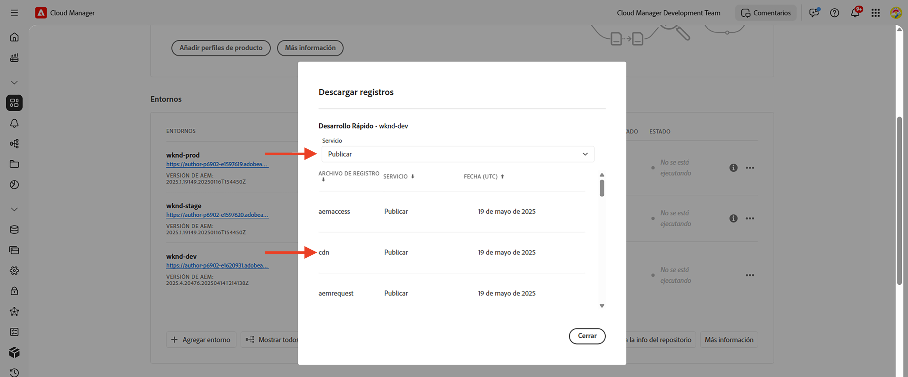

# Bloqueo de ataques DoS y DDoS mediante reglas de filtro de tráfico

Aprenda a bloquear los ataques de denegación de servicio (DoS) y denegación de servicio distribuido (DDoS) mediante las reglas de **filtro de tráfico de límite de velocidad** y otras estrategias en la CDN administrada por AEM as a Cloud Service (AEMCS). AEM Estos ataques causan picos de tráfico en la red de distribución de contenido (CDN) y potencialmente en el servicio de Publish de (también conocido como origin) y pueden afectar a la capacidad de respuesta y disponibilidad del sitio.

Este tutorial sirve como guía sobre _cómo analizar los patrones de tráfico y configurar las [reglas de filtro de tráfico](https://experienceleague.adobe.com/en/docs/experience-manager-cloud-service/content/security/traffic-filter-rules-including-waf)_ de límite de tasa para mitigar esos ataques. El tutorial también describe cómo [configurar alertas](https://experienceleague.adobe.com/en/docs/experience-manager-cloud-service/content/security/traffic-filter-rules-including-waf#traffic-filter-rules-alerts) para que se le notifique cuando haya un ataque sospechoso.

## Explicación de la protección

AEM Vamos a comprender las protecciones predeterminadas DDoS para su sitio web de la:

- **Almacenamiento en caché:** Con buenas directivas de almacenamiento en caché, el impacto de un ataque DDoS es más limitado porque la CDN evita que la mayoría de las solicitudes vayan al origen y causen una degradación del rendimiento.
- AEM **Escalado automático:** Los servicios de autor y publicación se escalan automáticamente para controlar los picos de tráfico, aunque aún pueden verse afectados por aumentos repentinos y masivos de tráfico.
- **Bloqueo:** La CDN de Adobe bloquea el tráfico al origen si supera una tasa definida por el Adobe desde una dirección IP en particular, por PoP (punto de presencia) de CDN.
- **Alertas:** El Centro de acciones envía un pico de tráfico en la notificación de alerta de origen cuando el tráfico supera una determinada tasa. Esta alerta se activa cuando el tráfico a cualquier PoP de CDN dada supera una tasa de _solicitud definida por Adobe_ por dirección IP. Consulte [Alertas sobre reglas de filtro de tráfico](https://experienceleague.adobe.com/en/docs/experience-manager-cloud-service/content/security/traffic-filter-rules-including-waf#traffic-filter-rules-alerts) para obtener más información.

Estas protecciones integradas deben considerarse una línea de base para la capacidad de una organización de minimizar el impacto en el rendimiento de un ataque DDoS. Dado que cada sitio web tiene diferentes características de rendimiento y puede ver esa degradación de rendimiento antes de que se cumpla el límite de tasa definido por el Adobe, se recomienda ampliar las protecciones predeterminadas mediante _configuración del cliente_.

Veamos algunas medidas adicionales recomendadas que los clientes pueden tomar para proteger sus sitios web de ataques DDoS:

- Declare **reglas de filtro de tráfico con límite de tarifa** para bloquear el tráfico que supere una determinada tarifa de una sola dirección IP, por PoP. Estos umbrales suelen ser inferiores al límite de tasa definido por el Adobe.
- Configure **alertas** en las reglas de filtro de tráfico de límite de velocidad mediante una &quot;acción de alerta&quot;, de modo que cuando se active la regla, se envíe una notificación al Centro de acciones.
- Aumente la cobertura de caché declarando **transformaciones de solicitud** para omitir los parámetros de consulta.

### Variaciones de reglas de tráfico de límite de velocidad {#rate-limit-variations}

Existen dos variaciones en las reglas de tráfico de límite de velocidad:

1. Edge: bloquea solicitudes en función de la tasa de todo el tráfico (incluido el que se puede servir desde la caché de CDN), para una IP determinada, por PoP.
1. Origen: bloquee solicitudes en función de la tasa de tráfico destinado al origen, para una IP determinada, por PoP.

## Recorrido del cliente

Los pasos siguientes reflejan el proceso probable a través del cual los clientes deben proteger sus sitios web.

1. Reconocer la necesidad de una regla de filtro de tráfico de límite de velocidad. Esto puede ser el resultado de recibir el pico de tráfico listo para usar de Adobe en la alerta de origen, o puede ser una decisión proactiva tomar precauciones para reducir el riesgo de un DDoS exitoso.
1. Analice los patrones de tráfico mediante un tablero, si el sitio ya está activo, para determinar los umbrales óptimos para las reglas de filtro de tráfico de límite de velocidad. Si el sitio aún no está activo, elija valores basados en las expectativas de tráfico.
1. Con los valores del paso anterior, configure las reglas de filtro de tráfico de límite de velocidad. Asegúrese de habilitar las alertas correspondientes para que se le notifique cada vez que se alcance el umbral.
1. Reciba alertas de reglas de filtros de tráfico cada vez que se produzcan picos de tráfico, lo que le proporcionará una valiosa perspectiva sobre si su organización podría estar siendo objetivo de agentes malintencionados.
1. Actuar sobre la alerta, según sea necesario. Analice el tráfico para determinar si el pico refleja solicitudes legítimas en lugar de un ataque. Aumente los umbrales si el tráfico es legítimo o, en caso contrario, reduzca su valor.

El resto de este tutorial le guía a través de este proceso.

## Reconocer la necesidad de configurar reglas {#recognize-the-need}

Como se ha mencionado anteriormente, el Adobe de forma predeterminada bloquea el tráfico en la CDN que supera una tasa determinada, sin embargo, algunos sitios web pueden experimentar un rendimiento degradado por debajo de ese umbral. Por lo tanto, deben configurarse las reglas de filtro de tráfico de límite de velocidad.

Lo ideal sería configurar las reglas antes de lanzarlas a producción. En la práctica, muchas organizaciones declaran las reglas de forma reactiva solo una vez alertadas de un pico de tráfico que indica un posible ataque.

El Adobe envía un pico de tráfico en la alerta de origen como [Notificación del centro de acciones](https://experienceleague.adobe.com/en/docs/experience-manager-cloud-service/content/operations/actions-center) cuando se supera el umbral predeterminado de tráfico de una sola dirección IP, para un PoP determinado. Si ha recibido una alerta de este tipo, se recomienda configurar una regla de filtro de tráfico de límite de velocidad. Esta alerta predeterminada es diferente de las alertas que deben habilitar explícitamente los clientes al definir las reglas de filtro de tráfico, algo que se explicará en una sección futura.

## Análisis de patrones de tráfico {#analyze-traffic}

Si el sitio ya está activo, puede analizar los patrones de tráfico mediante los registros de CDN y los paneles de Adobe proporcionados.

- **Tablero de tráfico de CDN**: proporciona información sobre el tráfico a través de la tasa de solicitudes de CDN y origen, tasas de error 4xx y 5xx, y solicitudes no almacenadas en caché. También proporciona el máximo de solicitudes de CDN y de origen por segundo por dirección IP de cliente y más perspectivas para optimizar las configuraciones de CDN.

- **Proporción de aciertos de caché de CDN**: proporciona información sobre la proporción total de aciertos de caché y el recuento total de solicitudes por estado HIT, PASS y MISS. También proporciona las principales direcciones URL HIT, PASS y MISS.

Configure las herramientas de tablero con _una de las siguientes opciones_:

### ELK: configuración de herramientas de tablero

La herramienta de tablero **Elasticsearch, Logstash y Kibana (ELK)** proporcionada por Adobe se puede usar para analizar los registros de CDN. Esta herramienta incluye un tablero que visualiza los patrones de tráfico, lo que facilita la determinación de los umbrales óptimos para las reglas de filtro de tráfico de límite de velocidad.

- Clone el repositorio de GitHub [AEMCS-CDN-Log-Analysis-Tooling](https://github.com/adobe/AEMCS-CDN-Log-Analysis-Tooling).
- Configure las herramientas siguiendo los pasos de [Cómo configurar el contenedor ELK Docker](https://github.com/adobe/AEMCS-CDN-Log-Analysis-Tooling/blob/main/ELK/README.md#how-to-set-up-the-elk-docker-containerhow-to-setup-the-elk-docker-container).
- Como parte de la configuración, importe el archivo `traffic-filter-rules-analysis-dashboard.ndjson` para visualizar los datos. El panel _Tráfico de CDN_ incluye visualizaciones que muestran el número máximo de solicitudes por IP/POP en Edge y Origin de CDN.
- Desde la tarjeta _Entornos_ de [Cloud Manager](https://my.cloudmanager.adobe.com/), descargue los registros de CDN del servicio Publish de AEM CS.

  

  >[!TIP]
  >
  > Las nuevas solicitudes pueden tardar hasta 5 minutos en aparecer en los registros de CDN.

### Splunk: configuración de las herramientas del panel

Los clientes que tienen habilitado el reenvío de registros de [Splunk](https://experienceleague.adobe.com/en/docs/experience-manager-cloud-service/content/implementing/developing/logging#splunk-logs) pueden crear nuevos paneles para analizar los patrones de tráfico.

Para crear paneles en Splunk, sigue los pasos de [Análisis de registros de CDN de Splunk para AEM CS](https://github.com/adobe/AEMCS-CDN-Log-Analysis-Tooling/blob/main/Splunk/README.md#splunk-dashboards-for-aemcs-cdn-log-analysis).

### Consulta de datos

Las siguientes visualizaciones están disponibles en los paneles de ELK y Splunk:

- **Edge RPS por IP de cliente y POP**: esta visualización muestra el número máximo de solicitudes por IP/POP **en CDN Edge**. El pico en la visualización indica el número máximo de solicitudes.

  **Panel ELK**:
  

  **Panel de Splunk**:\
  

- **RPS de origen por IP de cliente y POP**: esta visualización muestra el número máximo de solicitudes por IP/POP **en el origen**. El pico en la visualización indica el número máximo de solicitudes.

  **Panel ELK**:
  

  **Panel de Splunk**:
  

## Elección de valores de umbral

Los valores de umbral para las reglas de filtro de tráfico de límite de tasa deben basarse en el análisis anterior y asegurarse de que el tráfico legítimo no esté bloqueado. Consulte la siguiente tabla para obtener instrucciones sobre cómo elegir los valores de umbral:

| Variación | Valor |
| :--------- | :------- |
| Origen | Tome el valor más alto de las solicitudes de origen máximas por IP/POP en **condiciones de tráfico normales** (es decir, no la tasa en el momento de un DDoS) y agréguela en un múltiplo |
| Edge | Tome el valor más alto del número máximo de solicitudes de Edge por IP/POP en **condiciones de tráfico normales** (es decir, no la tasa en el momento de un DDoS) y agréguelo en un múltiplo |

Los múltiples que se utilizan dependen de las expectativas de los picos normales de tráfico debido al tráfico orgánico, las campañas y otros eventos. Un múltiplo entre 5 y 10 puede ser razonable.

Si su sitio aún no está activo, no hay datos que analizar y debe realizar una suposición detallada sobre los valores adecuados para establecer las reglas de filtro de tráfico de límite de tasa. Por ejemplo:

| Variación | Valor |
|------------------------------ |:-----------:|
| Edge | 500 |
| Origen | 100 |

## Configuración de reglas {#configure-rules}

AEM Configure las reglas de **filtro de tráfico con límite de velocidad** en el archivo `/config/cdn.yaml` de su proyecto de la, con valores basados en la discusión anterior. Si es necesario, consulte con su equipo de seguridad web para asegurarse de que los valores límite de velocidad sean adecuados y no bloquee el tráfico legítimo.

AEM Consulte [Crear reglas en el proyecto de la](https://experienceleague.adobe.com/en/docs/experience-manager-learn/cloud-service/security/traffic-filter-and-waf-rules/how-to-setup#create-rules-in-your-aem-project) para obtener más información.

```yaml
kind: CDN
version: '1'
metadata:
  envTypes:
    - dev
    - stage
    - prod
data:
  trafficFilters:
    rules:
    ...
    #  Prevent attack at edge by blocking client for 5 minutes if they make more than 500 requests per second on average
      - name: prevent-dos-attacks-edge
        when:
          reqProperty: tier
          in: ["author","publish"]
        rateLimit:
          limit: 500 # replace with the appropriate value
          window: 10 # compute the average over 10s
          penalty: 300 # block IP for 5 minutes
          count: all # count all requests
          groupBy:
            - reqProperty: clientIp
        action: 
          type: log
          experimental_alert: true
    #  Prevent attack at origin by blocking client for 5 minutes if they make more than 100 requests per second on average            
      - name: prevent-dos-attacks-origin
        when:
          reqProperty: tier
          in: ["author","publish"]
        rateLimit:
          limit: 100 # replace with the appropriate value
          window: 10 # compute the average over 10s
          penalty: 300 # block IP for 5 minutes
          count: fetches # count only fetches
          groupBy:
            - reqProperty: clientIp
        action: 
          type: log
          experimental_alert: true   
          
```

Tenga en cuenta que tanto las reglas de origen como las de Edge están declaradas y que la propiedad alert está establecida en `true` para que pueda recibir alertas cuando se alcance el umbral, lo que probablemente indique un ataque.

>[!NOTE]
>
>El prefijo _experimental__ delante de alerta_experimental se eliminará cuando se lance la función de alerta. Para unirse al programa de usuarios que lo adoptaron por primera vez, envíe un correo electrónico a **<aemcs-waf-adopter@adobe.com>**.

Se recomienda que el tipo de acción se establezca para registrarse inicialmente, de modo que pueda supervisar el tráfico durante unas horas o días, asegurándose de que el tráfico legítimo no supere estas tasas. Después de unos días, cambie al modo de bloqueo.

Siga los siguientes pasos para implementar los cambios en su entorno de AEM CS:

- Confirme y envíe los cambios anteriores a su repositorio de Git de Cloud Manager.
- Implemente los cambios en el entorno de AEM CS mediante la canalización de configuración de Cloud Manager. Consulte [Implementar reglas a través de Cloud Manager](https://experienceleague.adobe.com/en/docs/experience-manager-learn/cloud-service/security/traffic-filter-and-waf-rules/how-to-setup#deploy-rules-through-cloud-manager) para obtener más detalles.
- Para comprobar que la regla de filtro de tráfico **límite de velocidad** funciona según lo esperado, puede simular un ataque como se describe en la sección [Simulación de ataque](#attack-simulation). Limite el número de solicitudes a un valor superior al valor límite de velocidad establecido en la regla.

### Configuración de reglas de transformación de solicitudes {#configure-request-transform-rules}

Además de las reglas de filtro de tráfico de límite de velocidad, se recomienda usar [transformaciones de solicitud](https://experienceleague.adobe.com/en/docs/experience-manager-cloud-service/content/implementing/content-delivery/cdn-configuring-traffic#request-transformations) para anular la configuración de los parámetros de consulta que la aplicación no necesita, a fin de minimizar las formas de omitir la caché mediante técnicas de eliminación de caché. Por ejemplo, si solo desea permitir `search` y `campaignId` parámetros de consulta, se puede declarar la siguiente regla:

```yaml
kind: "CDN"
version: "1"
metadata:
  envTypes: 
    - dev
    - stage
    - prod  
data:  
  experimental_requestTransformations:
    rules:            
      - name: unset-all-query-params-except-those-needed
        when:
          reqProperty: tier
          in: ["publish"]
        actions:
          - type: unset
            queryParamMatch: ^(?!search$|campaignId$).*$
```

## Recepción de alertas de reglas de filtro de tráfico {#receiving-alerts}

Como se mencionó anteriormente, si la regla de filtro de tráfico incluye *alerta_experimental: true*, se recibe una alerta cuando coincide la regla.

## Acción en las alertas {#acting-on-alerts}

A veces, la alerta es informativa, lo que le da una idea de la frecuencia de los ataques. Vale la pena analizar los datos de CDN mediante el panel descrito anteriormente, para validar que el pico de tráfico se debe a un ataque y no solo a un aumento en el volumen de tráfico legítimo. En este último caso, considere la posibilidad de aumentar el umbral.

## Simulación de ataque{#attack-simulation}

En esta sección se describen los métodos para simular un ataque DoS, que se pueden utilizar para generar datos para los paneles utilizados en este tutorial y para validar que cualquier regla configurada bloquee ataques correctamente.

>[!CAUTION]
>
> No realice estos pasos en un entorno de producción. Los siguientes pasos son solo para fines de simulación.
> 
>Si ha recibido una alerta que indica un pico en el tráfico, continúe con la sección [Análisis de patrones de tráfico](#analyzing-traffic-patterns).

Para simular un ataque, se pueden usar herramientas como [Apache Benchmark](https://httpd.apache.org/docs/2.4/programs/ab.html), [Apache JMeter](https://jmeter.apache.org/), [Vegeta](https://github.com/tsenart/vegeta) y otras.

### Solicitudes de Edge

Con el siguiente comando [Vegeta](https://github.com/tsenart/vegeta), puede realizar muchas solicitudes al sitio web:

```shell
$ echo "GET https://<YOUR-WEBSITE-DOMAIN>" | vegeta attack -rate=120 -duration=5s | vegeta report
```

El comando anterior realiza 120 solicitudes durante 5 segundos y genera un informe. Suponiendo que el sitio web no tenga una tasa limitada, esto puede causar un pico en el tráfico.

### Solicitudes de origen

AEM Para omitir la caché de CDN y realizar solicitudes al origen (servicio de Publish de la), puede agregar un parámetro de consulta único a la dirección URL. Consulte el script de ejemplo de Apache JMeter del [ataque de simular DoS usando el script de JMeter](https://experienceleague.adobe.com/en/docs/experience-manager-learn/foundation/security/modsecurity-crs-dos-attack-protection#simulate-dos-attack-using-jmeter-script)

