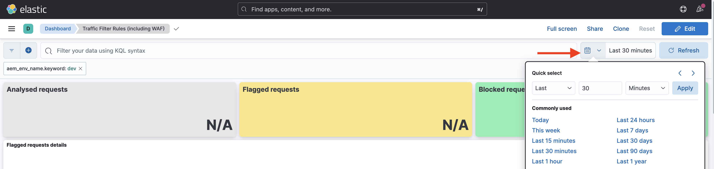

# Supervisión de solicitudes confidenciales

Obtenga información sobre cómo monitorizar solicitudes confidenciales registrándolas mediante reglas de filtro de tráfico en AEM as a Cloud Service.

El registro le permite observar los patrones de tráfico sin afectar a los usuarios o servicios finales y es un primer paso crucial antes de implementar reglas de bloqueo.

Este tutorial muestra cómo **registrar solicitudes de rutas de inicio y cierre de sesión de WKND** con el servicio de publicación de AEM.

## Cuándo y por qué registrar solicitudes

El registro de solicitudes específicas es una práctica de alto valor y bajo riesgo para comprender cómo los usuarios (y los actores potencialmente maliciosos) interactúan con la aplicación de AEM. Resulta especialmente útil antes de aplicar reglas de bloqueo, lo que le proporciona la confianza para refinar su postura de seguridad sin interrumpir el tráfico legítimo.

Los escenarios comunes para el registro incluyen:

- Validando el impacto y el alcance de una regla antes de promoverla al modo `block`.
- Monitorización de rutas de inicio de sesión/cierre de sesión y puntos finales de autenticación para patrones inusuales o intentos de fuerza bruta.
- Seguimiento del acceso de alta frecuencia a puntos finales de API para un posible abuso o actividad DoS.
- Establecer líneas de base para el comportamiento de bots antes de aplicar controles más estrictos.
- En caso de incidentes de seguridad, proporcione datos forenses para comprender la naturaleza del ataque y los recursos afectados.

## Requisitos previos

Antes de continuar, asegúrese de completar la configuración necesaria tal como se describe en el tutorial [Cómo configurar el filtro de tráfico y las reglas de WAF](../setup.md). Además, ten en cuenta que has clonado e implementado el [Proyecto WKND Sites de AEM](https://github.com/adobe/aem-guides-wknd) en tu entorno de AEM.

## Ejemplo: Registrar solicitudes de inicio y cierre de sesión de WKND

En este ejemplo, se crea una regla de filtro de tráfico para registrar las solicitudes realizadas en las rutas de inicio y cierre de sesión de WKND en el servicio de publicación de AEM. Ayuda a supervisar los intentos de autenticación e identificar posibles problemas de seguridad.

- Añada la siguiente regla al archivo `/config/cdn.yaml` del proyecto WKND.

```yaml
kind: "CDN"
version: "1"
metadata:
  envTypes: ["dev", "stage", "prod"]
data:
  trafficFilters:
    rules:
    # On AEM Publish service log WKND Login and Logout requests
    - name: publish-auth-requests
      when:
        allOf:
          - reqProperty: tier
            matches: publish
          - reqProperty: path
            in:
              - /system/sling/login/j_security_check
              - /system/sling/logout
      action: log   
```

- Confirme y envíe los cambios al repositorio de Git de Cloud Manager.

- Implemente los cambios en el entorno de AEM mediante la canalización de configuración de Cloud Manager [creada anteriormente](../setup.md#deploy-rules-using-adobe-cloud-manager).

- Para probar la regla, inicie sesión y cierre la sesión del sitio WKND del programa (por ejemplo, `https://publish-pXXXX-eYYYY.adobeaemcloud.com/us/en.html`). Puede usar `asmith/asmith` como nombre de usuario y contraseña.

  

## Análisis

Analicemos los resultados de la regla `publish-auth-requests` descargando los registros de CDN de AEMCS de Cloud Manager y utilizando [Herramientas de análisis de registro de CDN de AEMCS](../setup.md#setup-the-elastic-dashboard-tool).

- Desde la tarjeta **Entornos** de [Cloud Manager](https://my.cloudmanager.adobe.com/), descargue los registros de CDN del servicio **Publish** de AEMCS.

  

  >[!TIP]
  >
  > Las nuevas solicitudes pueden tardar hasta 5 minutos en aparecer en los registros de CDN.

- Copie el archivo de registro descargado (por ejemplo, `publish_cdn_2023-10-24.log` en la captura de pantalla siguiente) en la carpeta `logs/dev` del proyecto de herramienta panel elástico.

  

- Actualice la página de herramienta de panel elástico.
   - En la sección **Filtro global** superior, edite el filtro `aem_env_name.keyword` y seleccione el valor de entorno `dev`.

     

   - Para cambiar el intervalo de tiempo, haga clic en el icono de calendario en la esquina superior derecha y seleccione el intervalo de tiempo deseado.

     

- Revise las **solicitudes analizadas**, las **solicitudes marcadas** y los paneles de **Datos de solicitudes marcadas** del panel actualizado. Para las entradas de registro de CDN coincidentes, debe mostrar los valores de la IP de cliente (cli_ip), el host, la URL, la acción (waf_action) y el nombre de regla (waf_match) de cada entrada.

  

