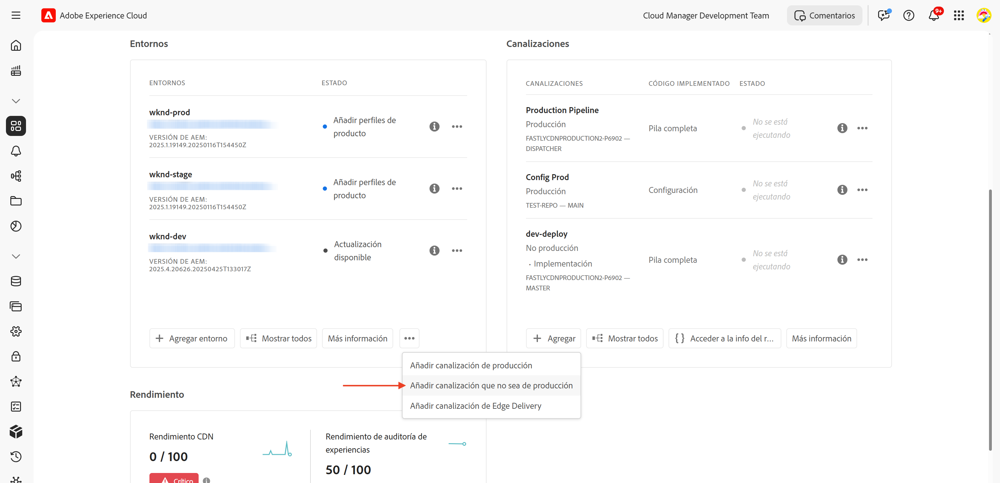
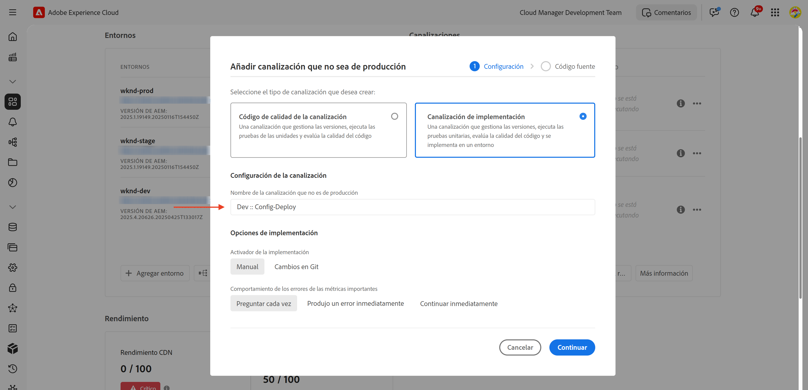
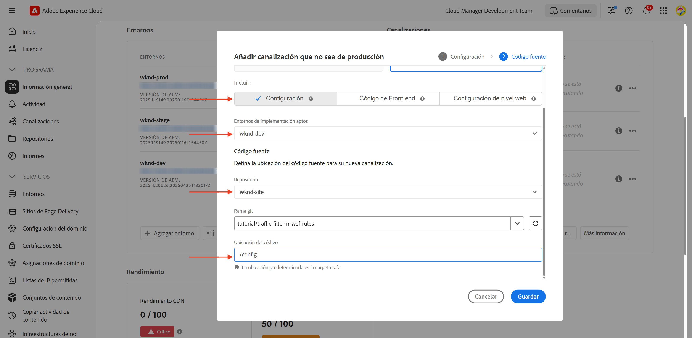

# Cómo configurar las reglas de filtro de tráfico, incluidas las reglas WAF

Obtenga información sobre **cómo configurar** las reglas de filtro de tráfico, incluidas las reglas WAF (Web Application Firewall). En este tutorial, sentamos las bases para los tutoriales posteriores, donde configurará e implementará reglas, seguidas de pruebas y análisis de los resultados.

Para mostrar el proceso de configuración, el tutorial utiliza el [proyecto de AEM WKND Sites](https://github.com/adobe/aem-guides-wknd).

>[!VIDEO](https://video.tv.adobe.com/v/3469395/?quality=12&learn=on)

## Información general sobre la configuración

La base para los tutoriales posteriores incluye los siguientes pasos:

- _Crear reglas_ dentro de su proyecto de AEM en la carpeta `config`
- _Implementar reglas_ mediante la canalización de configuración de Adobe Cloud Manager.
- _Probar reglas_ con herramientas como Curl, Vegeta y Nikto
- _Analizar resultados_ mediante las herramientas de análisis de registros de CDN de AEMCS

## Creación de reglas en el proyecto de AEM

Para definir las reglas de filtro de tráfico **estándar** y **WAF** en su proyecto de AEM, siga estos pasos:

1. En el nivel superior del proyecto de AEM, cree una carpeta denominada `config`.

2. En la carpeta `config`, cree un nuevo archivo con el nombre `cdn.yaml`.

3. Use la siguiente estructura de metadatos en `cdn.yaml`:

```yaml
kind: "CDN"
version: "1"
metadata:
  envTypes: ["dev", "stage", "prod"]
data:
  trafficFilters:
    rules:
```


En el [siguiente tutorial](#next-steps), aprenderá a añadir el **filtro de tráfico estándar recomendado por Adobe y las reglas WAF** al archivo anterior como una base sólida para su implementación.

## Implementación de reglas mediante Adobe Cloud Manager

Para preparar la implementación de las reglas, siga estos pasos:

1. Inicie sesión en [my.cloudmanager.adobe.com](https://my.cloudmanager.adobe.com/) y seleccione su programa.

2. Desde la página **Resumen del programa**, vaya a la tarjeta **Canalizaciones** y haga clic en **+Añadir** para crear una nueva canalización.

   

3. En el asistente de canalización:

   - **Tipo**: canalización de implementación
   - **Nombre de canalización**: Dev-Config

   

4. Configuración del código fuente:

   - **Código para implementar**: implementación específica
   - **Incluye**: config
   - **Entorno de implementación**: por ejemplo, `wknd-program-dev`
   - **Repositorio**: repositorio de Git (por ejemplo, `wknd-site`)
   - **Rama de Git**: su rama de trabajo
   - **Ubicación del código**: `/config`

   

5. Revise la configuración y haga clic en **Guardar**.

En el [siguiente tutorial](#next-steps), aprenderá a implementar la canalización en su entorno de AEM.

## Comprobación de las reglas con herramientas

Para probar la eficacia del filtro de tráfico estándar y las reglas WAF, puede utilizar varias herramientas para simular solicitudes y analizar cómo responden las reglas.

Compruebe que tiene instaladas las siguientes herramientas en el equipo local o siga las instrucciones para instalarlas:

- [Curl](https://curl.se/): probar flujo de solicitud/respuesta.
- [Vegeta](https://github.com/tsenart/vegeta): simular una carga de solicitud elevada (prueba DoS).
- [Nikto](https://github.com/sullo/nikto/wiki): analizar en busca de vulnerabilidades.

Puede verificar la instalación mediante los siguientes comandos:

```shell
# Curl version check
$ curl --version

# Vegeta version check
$ vegeta -version

# Nikto version check
$ cd <PATH-OF-CLONED-REPO>/program
$ ./nikto.pl -Version
```

En el [siguiente tutorial](#next-steps), aprenderá a utilizar estas herramientas para simular cargas de solicitudes altas y solicitudes malintencionadas con el fin de probar la eficacia del filtro de tráfico y las reglas WAF.

## Análisis de resultados

Para prepararse para analizar los resultados, siga estos pasos:

1. Instale las **herramientas de análisis de registros de CDN de AEMCS** para visualizar y analizar los patrones mediante los paneles de control creados previamente.

2. Realice la **ingesta de registros de CDN** descargando registros desde la interfaz de usuario de Cloud Manager. También puede reenviar registros directamente a un destino de registro alojado compatible, como Splunk o Elasticsearch.

### Herramientas de análisis de registro de CDN de AEMCS

Para analizar los resultados del filtro de tráfico y las reglas WAF, puede usar las **herramientas de análisis de registro de CDN de AEMCS**. Estas herramientas proporcionan paneles de control creados previamente para visualizar el tráfico de CDN y la actividad de WAF mediante los registros recopilados de CDN de AEMCS.

Las herramientas de análisis de registros de CDN de AEMCS son compatibles con dos plataformas de observabilidad, **ELK** (Elasticsearch, Logstash, Kibana) y **Splunk**.

Es posible utilizar la función de reenvío de registros para transmitir los registros a un servicio de registro ELK o Splunk alojado, donde puede instalar un panel de control para visualizar y analizar el filtro de tráfico estándar y las reglas de filtro de tráfico WAF. Sin embargo, para este tutorial, configurará el panel de control en una instancia de ELK local instalada en el equipo.

1. Clone el repositorio [AEMCS-CDN-Log-Analysis-Tooling](https://github.com/adobe/AEMCS-CDN-Log-Analysis-Tooling).

2. Siga la [guía de configuración del contenedor ELK Docker](https://github.com/adobe/AEMCS-CDN-Log-Analysis-Tooling/blob/main/ELK/README.md) para instalar y configurar la pila ELK localmente.

3. Con los paneles de control ELK, puede explorar métricas como las solicitudes de IP, el tráfico bloqueado, los patrones de URI y las alertas de seguridad.

   

>[!NOTE]
> 
> Si los registros aún no se han introducido desde la CDN de AEMCS, los paneles aparecerán vacíos.

### Ingesta de registros de CDN

Para introducir registros de CDN en la pila ELK, siga estos pasos:

- Desde la tarjeta **Entornos** de [Cloud Manager](https://my.cloudmanager.adobe.com/), descargue los registros de CDN del servicio **Publish** de AEMCS.

  

  >[!TIP]
  >
  > Las nuevas solicitudes pueden tardar hasta 5 minutos en aparecer en los registros de CDN.

- Copie el archivo de registro descargado (por ejemplo, `publish_cdn_2025-06-06.log` en la captura de pantalla siguiente) en la carpeta `logs/dev` del proyecto de herramienta panel elástico.

  {width="800" zoomable="yes"}

- Actualice la página de herramienta de panel elástico.
   - En la sección **Filtro global** superior, edite el filtro `aem_env_name.keyword` y seleccione el valor de entorno `dev`.

     

   - Para cambiar el intervalo de tiempo, haga clic en el icono de calendario en la esquina superior derecha y seleccione el intervalo de tiempo deseado.

- En el [siguiente tutorial](#next-steps), aprenderá a analizar los resultados de las reglas de filtro de tráfico estándar y filtro de tráfico WAF usando los paneles de control creados previamente en la pila ELK.

  

## Resumen

Ha configurado correctamente las bases para implementar reglas de filtro de tráfico, incluidas las reglas WAF en AEM as a Cloud Service. Ha creado una estructura de archivos de configuración, una canalización para la implementación y herramientas preparadas para probar y analizar los resultados.

## Siguientes pasos

Obtenga información sobre cómo implementar las reglas recomendadas por Adobe mediante los siguientes tutoriales:

<!-- CARDS
{target = _self}

* ./use-cases/using-traffic-filter-rules.md
  {title = Protecting AEM websites using standard traffic filter rules}
  {description = Learn how to protect AEM websites from DoS, DDoS and bot abuse using Adobe-recommended standard traffic filter rules in AEM as a Cloud Service.}
  {image = ./assets/use-cases/using-traffic-filter-rules.png}
  {cta = Apply Rules}

* ./use-cases/using-waf-rules.md
  {title = Protecting AEM websites using WAF traffic filter rules}
  {description = Learn how to protect AEM websites from sophisticated threats including DoS, DDoS, and bot abuse using Adobe-recommended Web Application Firewall (WAF) traffic filter rules in AEM as a Cloud Service.}
  {image = ./assets/use-cases/using-waf-rules.png}
  {cta = Activate WAF}
-->
<!-- START CARDS HTML - DO NOT MODIFY BY HAND -->
<div class="columns">
    <div class="column is-half-tablet is-half-desktop is-one-third-widescreen" aria-label="Protecting AEM websites using standard traffic filter rules">
        <div class="card" style="height: 100%; display: flex; flex-direction: column; height: 100%;">
            <div class="card-image">
                <figure class="image x-is-16by9">
                    <a href="./use-cases/using-traffic-filter-rules.md" title="Protección de sitios web de AEM mediante reglas de filtro de tráfico estándar" target="_self" rel="referrer">
                        
                    </a>
                </figure>
            </div>
            <div class="card-content is-padded-small" style="display: flex; flex-direction: column; flex-grow: 1; justify-content: space-between;">
                <div class="top-card-content">
                    <p class="headline is-size-6 has-text-weight-bold">
                        <a href="./use-cases/using-traffic-filter-rules.md" target="_self" rel="referrer" title="Protección de sitios web de AEM mediante reglas de filtro de tráfico estándar">Protección de sitios web de AEM mediante reglas de filtro de tráfico estándar</a>
                    </p>
                    <p class="is-size-6">Obtenga información sobre cómo proteger los sitios web de AEM frente a ataques DoS, DDoS y el abuso de bots mediante las reglas de filtro de tráfico estándar recomendadas por Adobe en AEM as a Cloud Service.</p>
                </div>
                <a href="./use-cases/using-traffic-filter-rules.md" target="_self" rel="referrer" class="spectrum-Button spectrum-Button--outline spectrum-Button--primary spectrum-Button--sizeM" style="align-self: flex-start; margin-top: 1rem;">
                    <span class="spectrum-Button-label has-no-wrap has-text-weight-bold">Aplicar reglas</span>
                </a>
            </div>
        </div>
    </div>
    <div class="column is-half-tablet is-half-desktop is-one-third-widescreen" aria-label="Protecting AEM websites using WAF traffic filter rules">
        <div class="card" style="height: 100%; display: flex; flex-direction: column; height: 100%;">
            <div class="card-image">
                <figure class="image x-is-16by9">
                    <a href="./use-cases/using-waf-rules.md" title="Protección de sitios web de AEM mediante las reglas de filtro de tráfico WAF" target="_self" rel="referrer">
                        
                    </a>
                </figure>
            </div>
            <div class="card-content is-padded-small" style="display: flex; flex-direction: column; flex-grow: 1; justify-content: space-between;">
                <div class="top-card-content">
                    <p class="headline is-size-6 has-text-weight-bold">
                        <a href="./use-cases/using-waf-rules.md" target="_self" rel="referrer" title="Protección de sitios web de AEM mediante las reglas de filtro de tráfico WAF">Protección de sitios web de AEM mediante reglas de filtro de tráfico WAF</a>
                    </p>
                    <p class="is-size-6">Obtenga información sobre cómo proteger los sitios web de AEM frente a amenazas sofisticadas, como DoS, DDoS y el abuso de bots, mediante las reglas de filtro de tráfico WAF (Web Application Firewall) recomendadas por Adobe en AEM as a Cloud Service.</p>
                </div>
                <a href="./use-cases/using-waf-rules.md" target="_self" rel="referrer" class="spectrum-Button spectrum-Button--outline spectrum-Button--primary spectrum-Button--sizeM" style="align-self: flex-start; margin-top: 1rem;">
                    <span class="spectrum-Button-label has-no-wrap has-text-weight-bold">Activar WAF</span>
                </a>
            </div>
        </div>
    </div>
</div>
<!-- END CARDS HTML - DO NOT MODIFY BY HAND -->

## Casos de uso avanzados

Más allá del filtro de tráfico estándar recomendado por Adobe y las reglas WAF, puede implementar escenarios avanzados para lograr requisitos comerciales específicos. Estas operaciones incluyen:

<!-- CARDS
{target = _self}

* ./how-to/request-logging.md

* ./how-to/request-blocking.md

* ./how-to/request-transformation.md
-->
<!-- START CARDS HTML - DO NOT MODIFY BY HAND -->
<div class="columns">
    <div class="column is-half-tablet is-half-desktop is-one-third-widescreen" aria-label="Monitoring sensitive requests">
        <div class="card" style="height: 100%; display: flex; flex-direction: column; height: 100%;">
            <div class="card-image">
                <figure class="image x-is-16by9">
                    <a href="./how-to/request-logging.md" title="Monitorización de solicitudes confidenciales" target="_self" rel="referrer">
                        
                    </a>
                </figure>
            </div>
            <div class="card-content is-padded-small" style="display: flex; flex-direction: column; flex-grow: 1; justify-content: space-between;">
                <div class="top-card-content">
                    <p class="headline is-size-6 has-text-weight-bold">
                        <a href="./how-to/request-logging.md" target="_self" rel="referrer" title="Monitorización de solicitudes confidenciales">Monitorización de solicitudes confidenciales</a>
                    </p>
                    <p class="is-size-6">Obtenga información sobre cómo monitorizar solicitudes confidenciales registrándolas mediante las reglas de filtro de tráfico de AEM as a Cloud Service.</p>
                </div>
                <a href="./how-to/request-logging.md" target="_self" rel="referrer" class="spectrum-Button spectrum-Button--outline spectrum-Button--primary spectrum-Button--sizeM" style="align-self: flex-start; margin-top: 1rem;">
                    <span class="spectrum-Button-label has-no-wrap has-text-weight-bold">Más información</span>
                </a>
            </div>
        </div>
    </div>
    <div class="column is-half-tablet is-half-desktop is-one-third-widescreen" aria-label="Restricting access">
        <div class="card" style="height: 100%; display: flex; flex-direction: column; height: 100%;">
            <div class="card-image">
                <figure class="image x-is-16by9">
                    <a href="./how-to/request-blocking.md" title="Restricción del acceso" target="_self" rel="referrer">
                        
                    </a>
                </figure>
            </div>
            <div class="card-content is-padded-small" style="display: flex; flex-direction: column; flex-grow: 1; justify-content: space-between;">
                <div class="top-card-content">
                    <p class="headline is-size-6 has-text-weight-bold">
                        <a href="./how-to/request-blocking.md" target="_self" rel="referrer" title="Restricción del acceso">Restricción del acceso</a>
                    </p>
                    <p class="is-size-6">Obtenga información sobre cómo restringir el acceso bloqueando solicitudes específicas mediante reglas de filtro de tráfico en AEM as a Cloud Service.</p>
                </div>
                <a href="./how-to/request-blocking.md" target="_self" rel="referrer" class="spectrum-Button spectrum-Button--outline spectrum-Button--primary spectrum-Button--sizeM" style="align-self: flex-start; margin-top: 1rem;">
                    <span class="spectrum-Button-label has-no-wrap has-text-weight-bold">Más información</span>
                </a>
            </div>
        </div>
    </div>
    <div class="column is-half-tablet is-half-desktop is-one-third-widescreen" aria-label="Normalizing requests">
        <div class="card" style="height: 100%; display: flex; flex-direction: column; height: 100%;">
            <div class="card-image">
                <figure class="image x-is-16by9">
                    <a href="./how-to/request-transformation.md" title="Normalización de solicitudes" target="_self" rel="referrer">
                        
                    </a>
                </figure>
            </div>
            <div class="card-content is-padded-small" style="display: flex; flex-direction: column; flex-grow: 1; justify-content: space-between;">
                <div class="top-card-content">
                    <p class="headline is-size-6 has-text-weight-bold">
                        <a href="./how-to/request-transformation.md" target="_self" rel="referrer" title="Normalización de solicitudes">Normalización de solicitudes</a>
                    </p>
                    <p class="is-size-6">Obtenga información sobre cómo normalizar solicitudes transformándolas mediante reglas de filtro de tráfico en AEM as a Cloud Service.</p>
                </div>
                <a href="./how-to/request-transformation.md" target="_self" rel="referrer" class="spectrum-Button spectrum-Button--outline spectrum-Button--primary spectrum-Button--sizeM" style="align-self: flex-start; margin-top: 1rem;">
                    <span class="spectrum-Button-label has-no-wrap has-text-weight-bold">Más información</span>
                </a>
            </div>
        </div>
    </div>
</div>
<!-- END CARDS HTML - DO NOT MODIFY BY HAND -->

## Recursos adicionales

- [Reglas de filtro de tráfico, incluidas las reglas WAF](https://experienceleague.adobe.com/es/docs/experience-manager-cloud-service/content/security/traffic-filter-rules-including-waf)
