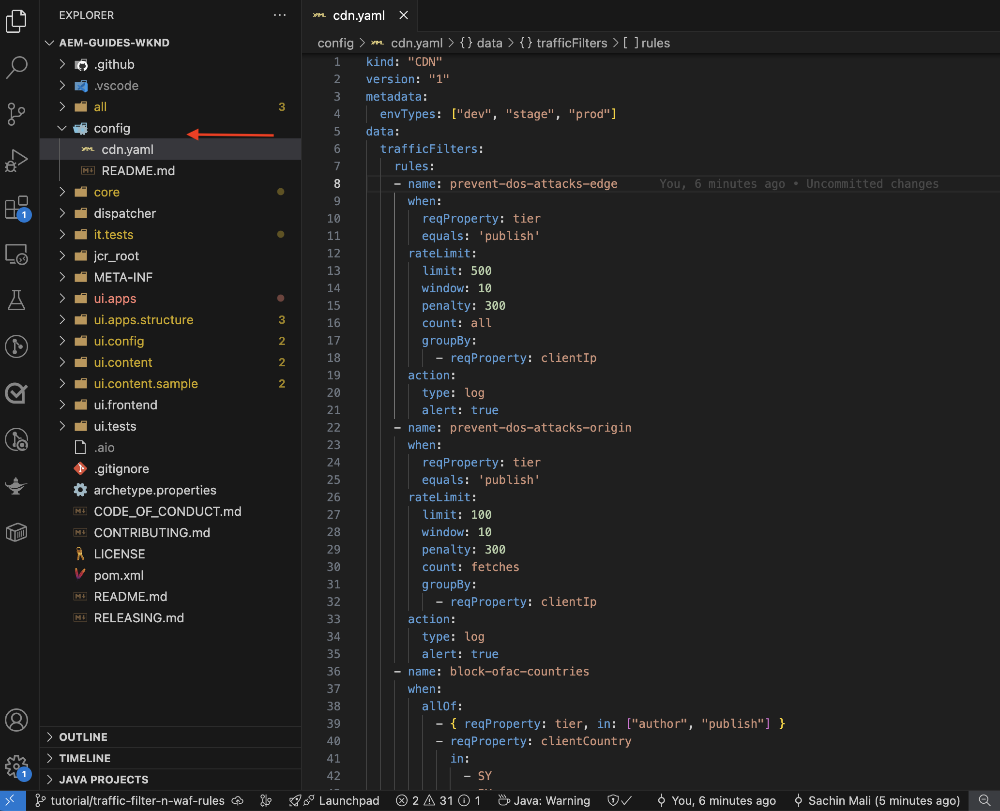

# Protección de sitios web de AEM mediante reglas estándar de filtro de tráfico

Aprenda a proteger los sitios web de AEM de ataques de denegación de servicio (DoS), ataques distribuidos de denegación de servicio (DDoS) y abusos de bots mediante _reglas estándar de filtro de tráfico recomendadas por Adobe_**en AEM as a Cloud Service.**


>[!VIDEO](https://video.tv.adobe.com/v/3469395/?quality=12&learn=on)

## Objetivos de aprendizaje

- Revise las reglas de filtro de tráfico estándar recomendadas por Adobe.
- Defina, implemente, pruebe y analice los resultados de las reglas.
- Comprender cuándo y cómo perfeccionar las reglas en función de los patrones de tráfico.
- Aprenda a utilizar el Centro de acciones de AEM para revisar las alertas generadas por las reglas.

### Resumen de implementación

Los pasos de implementación incluyen:

- Agregando las reglas de filtro de tráfico estándar al archivo `/config/cdn.yaml` del proyecto WKND de AEM.
- Envío y inserción de los cambios en el repositorio de Git de Cloud Manager.
- Implementar los cambios en el entorno de AEM mediante la canalización de configuración de Cloud Manager.
- Probando las reglas simulando un ataque DoS con [Vegeta](https://github.com/tsenart/vegeta)
- Análisis de los resultados mediante los registros de CDN de AEM CS y la herramienta de tablero ELK.

## Requisitos previos

Antes de continuar, asegúrese de haber completado la preparación necesaria tal como se describe en el tutorial [Cómo configurar el filtro de tráfico y las reglas de WAF](../setup.md). Además, ha clonado e implementado el [proyecto WKND Sites de AEM](https://github.com/adobe/aem-guides-wknd) en su entorno de AEM.

## Acciones clave de las reglas

Antes de profundizar en los detalles de las reglas estándar de filtro de tráfico, vamos a comprender las acciones clave que realizan estas reglas. El atributo `action` de cada regla define cómo debe responder el filtro de tráfico cuando se cumplen las condiciones. Las acciones incluyen:

- **Registro**: las reglas registran los eventos para supervisión y análisis, lo que permite revisar los patrones de tráfico y ajustar los umbrales según sea necesario. Se especifica mediante el atributo `type: log`.

- **Alerta**: el déclencheur de reglas alerta cuando se cumplen las condiciones, lo que le ayuda a identificar posibles problemas. Se especifica mediante el atributo `alert: true`.

- **Bloquear**: Las reglas bloquean el tráfico cuando se cumplen las condiciones, lo que impide el acceso al sitio de AEM. Se especifica mediante el atributo `action: block`.

## Revisión y definición de reglas

Las reglas estándar de filtrado de tráfico recomendadas por Adobe sirven como capa base para identificar patrones de tráfico potencialmente maliciosos mediante el registro de eventos como los límites de tasa basados en IP que se exceden y el bloqueo del tráfico de países específicos. Estos registros ayudan a los equipos a validar los umbrales y tomar decisiones informadas para la transición de **a las reglas de modo de bloqueo** sin interrumpir el tráfico legítimo.

Revisemos las tres reglas de filtro de tráfico estándar que debe agregar al archivo `/config/cdn.yaml` del proyecto WKND de AEM:

- **Impedir denegaciones de servicio en Edge**: esta regla detecta posibles ataques de denegación de servicio (DoS) en el perímetro de CDN supervisando las solicitudes por segundo (RPS) de las direcciones IP del cliente.
- **Impedir denegaciones de servicio en el origen**: esta regla detecta posibles ataques de denegación de servicio (DoS) en el origen supervisando las solicitudes de recuperación de las direcciones IP del cliente.
- **Bloquear países OFAC**: Esta regla bloquea el acceso desde países específicos que están sujetos a las restricciones de OFAC (Oficina de Control de Assets Extranjero).

### &#x200B;1. Impedir denegaciones de servicio en Edge

Esta regla **envía una alerta** cuando detecta un posible ataque de denegación de servicio (DoS) en la CDN. El criterio para activar esta regla es que un cliente exceda las **500 solicitudes por segundo** (con un promedio de más de 10 segundos) por POP (punto de presencia) de CDN en el perímetro de.

Cuenta **todas** las solicitudes y las agrupa por dirección IP del cliente.

```yaml
kind: "CDN"
version: "1"
metadata:
  envTypes: ["dev", "stage", "prod"]
data:
  trafficFilters:
    rules:
    - name: prevent-dos-attacks-edge
      when:
        reqProperty: tier
        equals: 'publish'
      rateLimit:
        limit: 500
        window: 10
        penalty: 300
        count: all
        groupBy:
          - reqProperty: clientIp
      action:
        type: log
        alert: true
```

El atributo `action` especifica que la regla debe registrar los eventos y almacenar en déclencheur una alerta cuando se cumplan las condiciones. Por lo tanto, le ayuda a monitorizar los ataques DoS potenciales sin bloquear el tráfico legítimo. Sin embargo, su objetivo es realizar la transición de esta regla al modo de bloqueo una vez que haya validado los patrones de tráfico y ajustado los umbrales.

### &#x200B;2. Evitar denegaciones de servicio en el origen

Esta regla **envía una alerta** cuando detecta un posible ataque de denegación de servicio (DoS) en el origen. El criterio para activar esta regla es cuando un cliente excede las **100 solicitudes por segundo** (promedio de más de 10 segundos) por IP de cliente en el origen.

Cuenta **recupera** (solicitudes de omisión de caché) y las agrupa por dirección IP del cliente.

```yaml
...
    - name: prevent-dos-attacks-origin
      when:
        reqProperty: tier
        equals: 'publish'
      rateLimit:
        limit: 100
        window: 10
        penalty: 300
        count: fetches
        groupBy:
          - reqProperty: clientIp
      action:
        type: log
        alert: true
```

El atributo `action` especifica que la regla debe registrar los eventos y almacenar en déclencheur una alerta cuando se cumplan las condiciones. Por lo tanto, le ayuda a monitorizar los ataques DoS potenciales sin bloquear el tráfico legítimo. Sin embargo, su objetivo es realizar la transición de esta regla al modo de bloqueo una vez que haya validado los patrones de tráfico y ajustado los umbrales.

### &#x200B;3. Bloquear países OFAC

Esta regla bloquea el acceso desde países específicos que se encuentran dentro de las restricciones de [OFAC](https://ofac.treasury.gov/sanctions-programs-and-country-information).
Puede revisar y modificar la lista de países según sea necesario.

```yaml
...
    - name: block-ofac-countries
      when:
        allOf:
          - { reqProperty: tier, in: ["author", "publish"] }
          - reqProperty: clientCountry
            in:
              - SY
              - BY
              - MM
              - KP
              - IQ
              - CD
              - SD
              - IR
              - LR
              - ZW
              - CU
              - CI
      action: block
```

El atributo `action` especifica que la regla debe bloquear el acceso desde los países especificados. Esto le ayuda a evitar el acceso al sitio de AEM desde regiones que pueden suponer riesgos de seguridad.

El archivo `cdn.yaml` completo con las reglas anteriores tiene el siguiente aspecto:



## Implementación de reglas

Para implementar las reglas anteriores, siga estos pasos:

- Confirme y envíe los cambios al repositorio de Git de Cloud Manager.

- Implemente los cambios en el entorno de AEM mediante la canalización de configuración de Cloud Manager [creada anteriormente](../setup.md#deploy-rules-using-adobe-cloud-manager).

  

## Probar reglas

Para comprobar la efectividad de las reglas de filtro de tráfico estándar, tanto en la **Edge de CDN** como en la **Origin**, simule el tráfico de solicitudes alto usando [Vegeta](https://github.com/tsenart/vegeta), una versátil herramienta de prueba de carga HTTP.

- Probar regla DoS en Edge (límite de 500 rps). El siguiente comando simula 200 solicitudes por segundo durante 15 segundos, lo que supera el umbral de Edge (500 rps).

  ```shell
  $echo "GET https://publish-p63947-e1249010.adobeaemcloud.com/us/en.html" | vegeta attack -rate=200 -duration=15s | vegeta report
  ```

  

  >[!IMPORTANT]
  >
  >  Observe los códigos de estado *100%* correcto y _200_ en el informe anterior. Como las reglas se establecen en `log` y `alert`, las solicitudes son _no bloqueadas_, pero se registran con fines de supervisión, análisis y alertas.

- Probar regla DoS en el origen (límite de 100 rps). El siguiente comando simula 110 solicitudes de captura por segundo durante 1 segundo, lo que supera el umbral de origen (100 rps). Para simular solicitudes de omisión de caché, el archivo `targets.txt` se crea con parámetros de consulta únicos para garantizar que cada solicitud se trate como una solicitud de recuperación.

  ```shell
  # Create targets.txt with unique query parameters
  $for i in {1..110}; do
    echo "GET https://publish-p63947-e1249010.adobeaemcloud.com/us/en.html?ts=$(date +%s)$i"
  done > targets.txt
  
  # Use the targets.txt file to simulate fetch requests
  $vegeta attack -rate=110 -duration=1s -targets=targets.txt | vegeta report
  ```

  

  >[!IMPORTANT]
  >
  >  Observe los códigos de estado *100%* correcto y _200_ en el informe anterior. Como las reglas se establecen en `log` y `alert`, las solicitudes son _no bloqueadas_, pero se registran con fines de supervisión, análisis y alertas.

- Para simplificar, la regla OFAC no se prueba aquí.

## Revisar alertas

Las alertas se generan cuando se activan las reglas del filtro de tráfico. Puede revisar estas alertas en el [Centro de acciones de AEM](https://experience.adobe.com/aem/actions-center).


## Analizar resultados

Para analizar los resultados de las reglas del filtro de tráfico, puede utilizar los registros de CDN de AEM CS y la herramienta del panel ELK. Siga las instrucciones de la sección de configuración [Ingesta de registros de CDN](../setup.md#ingest-cdn-logs) para ingerir los registros de CDN en la pila ELK.

En la siguiente captura de pantalla, puede ver los registros de CDN del entorno de desarrollo de AEM introducidos en la pila ELK.


Dentro de la aplicación ELK, el **Tablero de tráfico CDN** debería mostrar el pico en **Edge** y **Origin** durante los ataques DoS simulados.

Los dos paneles, _Edge RPS por IP de cliente y POP_ y _Origin RPS por IP de cliente y POP_, muestran las solicitudes por segundo (RPS) en el perímetro y el origen respectivamente, agrupadas por IP de cliente y punto de presencia (POP).


También puede usar otros paneles del Panel de tráfico de CDN para analizar los patrones de tráfico, como _IP principales de clientes_, _países principales_ y _agentes de usuarios principales_. Estos paneles le ayudan a identificar posibles amenazas y a ajustar las reglas de filtro de tráfico en consecuencia.

### Integración de Splunk

Los clientes que tienen [habilitado el reenvío de registros de Splunk](https://experienceleague.adobe.com/es/docs/experience-manager-cloud-service/content/implementing/developing/logging#splunk-logs) pueden crear nuevos paneles de control para analizar los patrones de tráfico.

Para crear paneles de control en Splunk, siga los pasos de [Paneles de control de Splunk para el análisis de registros CDN de AEMCS](https://github.com/adobe/AEMCS-CDN-Log-Analysis-Tooling/blob/main/Splunk/README.md#splunk-dashboards-for-aemcs-cdn-log-analysis).

La siguiente captura de pantalla muestra un ejemplo de un panel de Splunk que muestra el origen máximo y las solicitudes de Edge por IP, lo que puede ayudarle a identificar posibles ataques DoS.


## Cuándo y cómo refinar las reglas

Su objetivo es evitar el bloqueo del tráfico legítimo mientras sigue protegiendo su sitio AEM de posibles amenazas. Las reglas estándar del filtro de tráfico están diseñadas para alertar y registrar (y finalmente bloquear cuando se cambia el modo) las amenazas sin bloquear el tráfico legítimo.

Para perfeccionar las reglas, siga estos pasos:

- **Monitorizar patrones de tráfico**: utilice los registros de CDN y el panel ELK para monitorizar los patrones de tráfico e identificar cualquier anomalía o pico en el tráfico.
- **Ajustar umbrales**: en función de los patrones de tráfico, ajuste los umbrales (aumente o disminuya los límites de tasa) en las reglas para que se ajusten mejor a sus requisitos específicos. Por ejemplo, si observa que el tráfico legítimo activó las alertas, puede aumentar los límites de velocidad o ajustar las agrupaciones.
La siguiente tabla proporciona instrucciones sobre cómo elegir los valores de umbral:

  | Variación | Valor |
  | :--------- | :------- |
  | Origen | Tome el valor más alto del número máximo de solicitudes de origen por IP/POP en condiciones de tráfico **normales** (es decir, no la frecuencia en el momento de un DDoS) y auméntelo por un múltiplo |
  | Edge | Tome el valor más alto del número máximo de solicitudes Edge por IP/POP en condiciones de tráfico **normales** (es decir, no la frecuencia en el momento de un DDoS) y auméntelo por un múltiplo |

  Consulte también la sección [Selección de valores de umbral](../../blocking-dos-attack-using-traffic-filter-rules.md#choosing-threshold-values) para obtener más información.

- **Pasar a reglas de bloqueo**: Una vez validados los patrones de tráfico y ajustados los umbrales, debe pasar las reglas al modo de bloqueo.

## Resumen

En este tutorial, ha aprendido a proteger los sitios web de AEM de la denegación de servicio (DoS), la denegación de servicio distribuida (DDoS) y el uso indebido de bots mediante las reglas estándar de filtro de tráfico recomendadas por Adobe en AEM as a Cloud Service.

## Reglas de WAF recomendadas

Aprenda a implementar las reglas de WAF recomendadas por Adobe para proteger los sitios web de AEM de amenazas sofisticadas que utilizan técnicas avanzadas para evitar las medidas de seguridad tradicionales.

<!-- CARDS
{target = _self}

* ./using-waf-rules.md
  {title = Protecting AEM websites using WAF traffic filter rules}
  {description = Learn how to protect AEM websites from sophisticated threats including DoS, DDoS, and bot abuse using Adobe-recommended Web Application Firewall (WAF) traffic filter rules in AEM as a Cloud Service.}
  {image = ../assets/use-cases/using-waf-rules.png}
  {cta = Activate WAF}
-->
<!-- START CARDS HTML - DO NOT MODIFY BY HAND -->
<div class="columns">
    <div class="column is-half-tablet is-half-desktop is-one-third-widescreen" aria-label="Protecting AEM websites using WAF traffic filter rules">
        <div class="card" style="height: 100%; display: flex; flex-direction: column; height: 100%;">
            <div class="card-image">
                <figure class="image x-is-16by9">
                    <a href="./using-waf-rules.md" title="Protección de sitios web de AEM mediante las reglas de filtro de tráfico de WAF" target="_self" rel="referrer">
                        
                    </a>
                </figure>
            </div>
            <div class="card-content is-padded-small" style="display: flex; flex-direction: column; flex-grow: 1; justify-content: space-between;">
                <div class="top-card-content">
                    <p class="headline is-size-6 has-text-weight-bold">
                        <a href="./using-waf-rules.md" target="_self" rel="referrer" title="Protección de sitios web de AEM mediante las reglas de filtro de tráfico de WAF">Protección de sitios web de AEM mediante reglas de filtro de tráfico de WAF</a>
                    </p>
                    <p class="is-size-6">Obtenga información sobre cómo proteger los sitios web de AEM de amenazas sofisticadas, como denegaciones de servicio, ataques DDoS y abusos de bots, mediante las reglas de filtro de tráfico del cortafuegos de aplicaciones web (WAF) recomendadas por Adobe en AEM as a Cloud Service.</p>
                </div>
                <a href="./using-waf-rules.md" target="_self" rel="referrer" class="spectrum-Button spectrum-Button--outline spectrum-Button--primary spectrum-Button--sizeM" style="align-self: flex-start; margin-top: 1rem;">
                    <span class="spectrum-Button-label has-no-wrap has-text-weight-bold">Activar WAF</span>
                </a>
            </div>
        </div>
    </div>
</div>
<!-- END CARDS HTML - DO NOT MODIFY BY HAND -->


## Casos de uso: más allá de las reglas estándar

Para escenarios más avanzados, puede explorar los siguientes casos de uso que muestran cómo implementar reglas de filtro de tráfico personalizadas en función de requisitos comerciales específicos:

<!-- CARDS
{target = _self}

* ../how-to/request-logging.md

* ../how-to/request-blocking.md

* ../how-to/request-transformation.md
-->
<!-- START CARDS HTML - DO NOT MODIFY BY HAND -->
<div class="columns">
    <div class="column is-half-tablet is-half-desktop is-one-third-widescreen" aria-label="Monitoring sensitive requests">
        <div class="card" style="height: 100%; display: flex; flex-direction: column; height: 100%;">
            <div class="card-image">
                <figure class="image x-is-16by9">
                    <a href="../how-to/request-logging.md" title="Supervisión de solicitudes confidenciales" target="_self" rel="referrer">
                        
                    </a>
                </figure>
            </div>
            <div class="card-content is-padded-small" style="display: flex; flex-direction: column; flex-grow: 1; justify-content: space-between;">
                <div class="top-card-content">
                    <p class="headline is-size-6 has-text-weight-bold">
                        <a href="../how-to/request-logging.md" target="_self" rel="referrer" title="Supervisión de solicitudes confidenciales">Supervisión de solicitudes confidenciales</a>
                    </p>
                    <p class="is-size-6">Obtenga información sobre cómo monitorizar las solicitudes confidenciales registrándolas mediante reglas de filtro de tráfico en AEM as a Cloud Service.</p>
                </div>
                <a href="../how-to/request-logging.md" target="_self" rel="referrer" class="spectrum-Button spectrum-Button--outline spectrum-Button--primary spectrum-Button--sizeM" style="align-self: flex-start; margin-top: 1rem;">
                    <span class="spectrum-Button-label has-no-wrap has-text-weight-bold">Más información</span>
                </a>
            </div>
        </div>
    </div>
    <div class="column is-half-tablet is-half-desktop is-one-third-widescreen" aria-label="Restricting access">
        <div class="card" style="height: 100%; display: flex; flex-direction: column; height: 100%;">
            <div class="card-image">
                <figure class="image x-is-16by9">
                    <a href="../how-to/request-blocking.md" title="Restricción del acceso" target="_self" rel="referrer">
                        
                    </a>
                </figure>
            </div>
            <div class="card-content is-padded-small" style="display: flex; flex-direction: column; flex-grow: 1; justify-content: space-between;">
                <div class="top-card-content">
                    <p class="headline is-size-6 has-text-weight-bold">
                        <a href="../how-to/request-blocking.md" target="_self" rel="referrer" title="Restricción del acceso">Restricción del acceso</a>
                    </p>
                    <p class="is-size-6">Obtenga información sobre cómo restringir el acceso bloqueando solicitudes específicas mediante reglas de filtro de tráfico en AEM as a Cloud Service.</p>
                </div>
                <a href="../how-to/request-blocking.md" target="_self" rel="referrer" class="spectrum-Button spectrum-Button--outline spectrum-Button--primary spectrum-Button--sizeM" style="align-self: flex-start; margin-top: 1rem;">
                    <span class="spectrum-Button-label has-no-wrap has-text-weight-bold">Más información</span>
                </a>
            </div>
        </div>
    </div>
    <div class="column is-half-tablet is-half-desktop is-one-third-widescreen" aria-label="Normalizing requests">
        <div class="card" style="height: 100%; display: flex; flex-direction: column; height: 100%;">
            <div class="card-image">
                <figure class="image x-is-16by9">
                    <a href="../how-to/request-transformation.md" title="Normalización de solicitudes" target="_self" rel="referrer">
                        
                    </a>
                </figure>
            </div>
            <div class="card-content is-padded-small" style="display: flex; flex-direction: column; flex-grow: 1; justify-content: space-between;">
                <div class="top-card-content">
                    <p class="headline is-size-6 has-text-weight-bold">
                        <a href="../how-to/request-transformation.md" target="_self" rel="referrer" title="Normalización de solicitudes">Normalizando solicitudes</a>
                    </p>
                    <p class="is-size-6">Obtenga información sobre cómo normalizar solicitudes transformándolas mediante reglas de filtro de tráfico en AEM as a Cloud Service.</p>
                </div>
                <a href="../how-to/request-transformation.md" target="_self" rel="referrer" class="spectrum-Button spectrum-Button--outline spectrum-Button--primary spectrum-Button--sizeM" style="align-self: flex-start; margin-top: 1rem;">
                    <span class="spectrum-Button-label has-no-wrap has-text-weight-bold">Más información</span>
                </a>
            </div>
        </div>
    </div>
</div>
<!-- END CARDS HTML - DO NOT MODIFY BY HAND -->


## Recursos adicionales

- [Reglas de inicio recomendadas](https://experienceleague.adobe.com/en/docs/experience-manager-cloud-service/content/security/traffic-filter-rules-including-waf#recommended-starter-rules)
