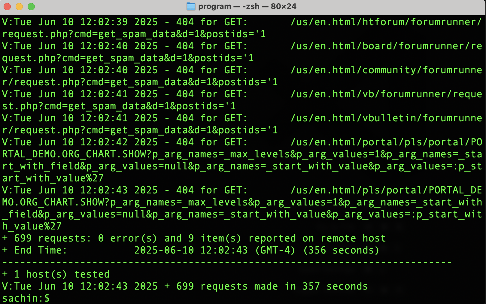

# Protección de sitios web de AEM mediante reglas WAF

Aprenda a proteger los sitios web de AEM frente a amenazas sofisticadas como DoS, DDoS y abusos de bots, mediante las reglas WAF (Web Application Firewall) _recomendadas por Adobe_ **en AEM as a Cloud Service.**

Los sofisticados ataques se caracterizan por altas tasas de solicitud, patrones complejos y el uso de técnicas avanzadas para eludir las medidas de seguridad tradicionales.

>[!IMPORTANT]
>
> Las reglas de filtro de tráfico WAF requieren una licencia adicional de **Protección WAF-DDoS** o **Seguridad mejorada**. Las reglas de filtro de tráfico estándar están disponibles para los clientes de Sites y Forms de forma predeterminada.


>[!VIDEO](https://video.tv.adobe.com/v/3469397/?quality=12&learn=on)

## Objetivos de aprendizaje

- Revise las reglas WAF recomendadas por Adobe.
- Defina, implemente, pruebe y analice los resultados de las reglas.
- Conozca cuándo y cómo perfeccionar las reglas en función de los resultados.
- Aprenda a utilizar el centro de acciones de AEM para revisar las alertas generadas por las reglas.

### Información general sobre la implementación

Los pasos de implementación incluyen los siguientes:

- Añadir las reglas WAF al archivo `/config/cdn.yaml` del proyecto WKND de AEM.
- Confirmar e insertar los cambios en el repositorio de Git de Cloud Manager.
- Implementar los cambios en el entorno de AEM mediante la canalización de configuración de Cloud Manager.
- Probar las reglas simulando un ataque DDoS con [Nikto](https://github.com/sullo/nikto/wiki).
- Analizar los resultados mediante los registros de CDN de AEMCS y la herramienta del panel de control ELK.

## Requisitos previos

Antes de continuar, asegúrese de completar la configuración necesaria tal como se describe en el tutorial [Cómo configurar el filtro de tráfico y las reglas WAF](../setup.md). Además, ha clonado e implementado el [proyecto WKND Sites de AEM](https://github.com/adobe/aem-guides-wknd) en su entorno de AEM.

## Revisión y definición de reglas

Las reglas WAF (Web Application Firewall) recomendadas por Adobe son esenciales para proteger los sitios web de AEM ante amenazas sofisticadas como DoS, DDoS y el abuso de bots. Los sofisticados ataques se caracterizan por altas tasas de solicitud, patrones complejos y el uso de técnicas avanzadas /(basadas en protocolos o en cargas útiles) para eludir las medidas de seguridad tradicionales.

Revisemos tres reglas WAF recomendadas que deben añadirse al archivo `cdn.yaml` en el proyecto WKND de AEM:

### &#x200B;1. Bloquear los ataques de direcciones IP malintencionadas conocidas

Esta regla **bloquea** solicitudes que parecen sospechosas *y* se originan en direcciones IP que están marcadas como malintencionadas. Debido a que se cumplen ambos criterios, podemos estar seguros de que el riesgo de falsos positivos (bloqueo del tráfico legítimo) es muy bajo. Las direcciones IP incorrectas conocidas se identifican en función de las fuentes de inteligencia de amenazas y otras fuentes.

El indicador de WAF `ATTACK-FROM-BAD-IP` se usa para identificar estas solicitudes. Añade varios de los indicadores de WAF [enumerados aquí](https://experienceleague.adobe.com/es/docs/experience-manager-cloud-service/content/security/traffic-filter-rules-including-waf#waf-flags-list).

```yaml
kind: "CDN"
version: "1"
metadata:
  envTypes: ["dev", "stage", "prod"]
data:
  trafficFilters:
    rules:
    - name: attacks-from-bad-ips-globally
      when:
        reqProperty: tier
        in: ["author", "publish"]
      action:
        type: block
        wafFlags:
          - ATTACK-FROM-BAD-IP
```

### &#x200B;2. Registrar (y posteriormente bloquear) ataques desde cualquier IP de forma global

Esta regla **registra** las solicitudes identificadas como ataques potenciales, incluso si las direcciones IP no se encuentran en fuentes de inteligencia de amenazas.

El indicador de WAF `ATTACK` se usa para identificar estas solicitudes. Es similar a `ATTACK-FROM-BAD-IP`; añade varios indicadores WAF.

Es probable que estas solicitudes sean malintencionadas, pero dado que las direcciones IP no se identifican en las fuentes de inteligencia de amenazas, puede ser prudente iniciar en el modo `log` en lugar del modo de bloqueo. Analice los registros en busca de falsos positivos y, una vez validados, **asegúrese de cambiar la regla al modo `block`**.

```yaml
...
    - name: attacks-from-any-ips-globally
      when:
        reqProperty: tier
        in: ["author", "publish"]
      action:
        type: log
        alert: true
        wafFlags:
          - ATTACK
```

Como alternativa, puede optar por utilizar el modo `block` inmediatamente, si los requisitos de su empresa no le permiten correr ningún riesgo de permitir tráfico malintencionado.

Estas reglas WAF recomendadas proporcionan un nivel adicional de seguridad frente a amenazas conocidas y emergentes.


## Migración a las reglas WAF más recientes recomendadas por Adobe

Antes de que se introdujeran los indicadores de WAF `ATTACK-FROM-BAD-IP` y `ATTACK` (en julio de 2025), las reglas WAF recomendadas eran las siguientes. Contenían una lista de indicadores WAF específicos para bloquear solicitudes que cumplían determinados criterios, como `SANS`, `TORNODE`, `NOUA`, etc.

```yaml
...
data:
  trafficFilters:
    rules:
    ...
    # Enable WAF protections (only works if WAF is enabled for your environment)
      - name: block-waf-flags
        when:
          reqProperty: tier
          matches: "author|publish"
        action:
          type: block
          wafFlags:
            - SANS
            - TORNODE
            - NOUA
            - SCANNER
            - USERAGENT
            - PRIVATEFILE
            - ABNORMALPATH
            - TRAVERSAL
            - NULLBYTE
            - BACKDOOR
            - LOG4J-JNDI
            - SQLI
            - XSS
            - CODEINJECTION
            - CMDEXE
            - NO-CONTENT-TYPE
            - UTF8
...
```

La regla anterior sigue siendo válida, pero se recomienda migrar a las nuevas reglas que usan los indicadores de WAF `ATTACK-FROM-BAD-IP` y `ATTACK` _siempre que aún no haya personalizado los `wafFlags` para adaptarlos a las necesidades de su empresa_.

Puede migrar a las nuevas reglas para que sean coherentes con las prácticas recomendadas siguiendo estos pasos:

- Revise las reglas WAF existentes en su archivo `cdn.yaml`, que pueden ser similares a las del ejemplo anterior. Confirme que no hay personalización de `wafFlags` que sea específica para los requisitos de su empresa.

- Reemplace las reglas WAF existentes por las nuevas reglas WAF recomendadas por Adobe que usan los indicadores `ATTACK-FROM-BAD-IP` y `ATTACK`. Asegúrese de que todas las reglas estén en modo de bloqueo.

Si ya había personalizado `wafFlags`, aún puede migrar a estas nuevas reglas, pero hágalo con cuidado, asegurándose de que todas las personalizaciones se transfieran a las reglas revisadas.

La migración debería ayudarle a simplificar las reglas WAF y, al mismo tiempo, ofrecerle una sólida protección frente a amenazas sofisticadas. Las nuevas reglas están diseñadas para ser más efectivas y fáciles de administrar.


## Implementación de reglas

Para implementar las reglas, siga estos pasos:

- Confirme e inserte los cambios en el repositorio de Git de Cloud Manager.

- Implemente los cambios en el entorno de AEM mediante la canalización de configuración de Cloud Manager [creada anteriormente](../setup.md#deploy-rules-using-adobe-cloud-manager).

  

## Comprobación de las reglas

Para comprobar la efectividad de las reglas WAF, simule un ataque con [Nikto](https://github.com/sullo/nikto), un analizador de servidores web que detecta vulnerabilidades y configuraciones erróneas. El siguiente comando activa los ataques de inyección de SQL contra el sitio web WKND de AEM, que está protegido por las reglas WAF.

```shell
$./nikto.pl -useragent "AttackSimulationAgent (Demo/1.0)" -D V -Tuning 9 -ssl -h https://publish-pXXXX-eYYYY.adobeaemcloud.com/us/en.html
```



Para obtener más información acerca de la simulación de ataques, revise la documentación de [Nikto - Scan Tuning](https://github.com/sullo/nikto/wiki/Scan-Tuning), que indica cómo especificar el tipo de ataques de prueba que se deben incluir o excluir.

## Revisión de las alertas

Las alertas se generan cuando se activan las reglas del filtro de tráfico. Puede revisar estas alertas en el [Centro de acciones de AEM](https://experience.adobe.com/aem/actions-center).


## Análisis de resultados

Para analizar los resultados de las reglas del filtro de tráfico, puede utilizar los registros de CDN de AEMCS y la herramienta del panel de control ELK. Siga las instrucciones de la sección de configuración [Ingesta de registros de CDN](../setup.md#ingest-cdn-logs) para ingerir los registros de CDN en la pila ELK.

En la siguiente captura de pantalla, puede ver los registros de CDN del entorno de desarrollo de AEM introducidos en la pila ELK.


Dentro de la aplicación ELK, el **panel de control de WAF** debería mostrar las
solicitudes indicadas y los valores correspondientes en las columnas IP del cliente (cli_ip), host, URL, acción (waf_action) y nombre de regla (waf_match).


Además, los paneles **Distribución de indicadores de WAF** y **Mejores ataques** muestran detalles adicionales.


### Integración de Splunk

Los clientes que tienen [habilitado el reenvío de registros de Splunk](https://experienceleague.adobe.com/es/docs/experience-manager-cloud-service/content/implementing/developing/logging#splunk-logs) pueden crear nuevos paneles de control para analizar los patrones de tráfico.

Para crear paneles de control en Splunk, siga los pasos de [Paneles de control de Splunk para el análisis de registros CDN de AEMCS](https://github.com/adobe/AEMCS-CDN-Log-Analysis-Tooling/blob/main/Splunk/README.md#splunk-dashboards-for-aemcs-cdn-log-analysis).

## Cuándo y cómo perfeccionar las reglas

Su objetivo es evitar el bloqueo del tráfico legítimo mientras sigue protegiendo su sitio AEM ante posibles amenazas. Las reglas WAF recomendadas están diseñadas para ser un punto de partida para su estrategia de seguridad.

Para perfeccionar las reglas, siga estos pasos:

- **Monitorizar patrones de tráfico**: utilice los registros de CDN y el panel de control ELK para monitorizar los patrones de tráfico e identificar cualquier anomalía o pico en el tráfico. Preste atención a los paneles de _distribución de indicadores WAF_ yde _ataques principales_ en el panel de control ELK para conocer los tipos de ataques que se están detectando.
- **Ajustar wafFlags**: si los indicadores `ATTACK` se activan con demasiada frecuencia o
si necesita ajustar el vector de ataque, puede crear reglas personalizadas con indicadores de WAF específicos. Consulte la lista completa de [indicadores de WAF](https://experienceleague.adobe.com/es/docs/experience-manager-cloud-service/content/security/traffic-filter-rules-including-waf#waf-flags-list) en la documentación. Considere probar primero las nuevas reglas personalizadas en el modo `log`.
- **Pasar a reglas de bloqueo**: una vez validados los patrones de tráfico y ajustados los indicadores de WAF, puede considerar pasar a las reglas de bloqueo.

## Resumen

En este tutorial, ha aprendido a proteger los sitios web de AEM frente a amenazas sofisticadas, incluidos DoS, DDoS y el abuso de bots mediante las reglas WAF (Web Application Firewall) recomendadas por Adobe.

## Casos de uso: más allá de las reglas estándar

En el caso de los escenarios más avanzados, puede explorar los siguientes casos de uso que muestran cómo implementar reglas de filtro de tráfico personalizadas en función de requisitos comerciales específicos:

<!-- CARDS
{target = _self}

* ../how-to/request-logging.md

* ../how-to/request-blocking.md

* ../how-to/request-transformation.md
-->
<!-- START CARDS HTML - DO NOT MODIFY BY HAND -->
<div class="columns">
    <div class="column is-half-tablet is-half-desktop is-one-third-widescreen" aria-label="Monitoring sensitive requests">
        <div class="card" style="height: 100%; display: flex; flex-direction: column; height: 100%;">
            <div class="card-image">
                <figure class="image x-is-16by9">
                    <a href="../how-to/request-logging.md" title="Monitorización de solicitudes confidenciales" target="_self" rel="referrer">
                        
                    </a>
                </figure>
            </div>
            <div class="card-content is-padded-small" style="display: flex; flex-direction: column; flex-grow: 1; justify-content: space-between;">
                <div class="top-card-content">
                    <p class="headline is-size-6 has-text-weight-bold">
                        <a href="../how-to/request-logging.md" target="_self" rel="referrer" title="Monitorización de solicitudes confidenciales">Monitorización de solicitudes confidenciales</a>
                    </p>
                    <p class="is-size-6">Obtenga información sobre cómo monitorizar las solicitudes confidenciales registrándolas mediante reglas de filtro de tráfico en AEM as a Cloud Service.</p>
                </div>
                <a href="../how-to/request-logging.md" target="_self" rel="referrer" class="spectrum-Button spectrum-Button--outline spectrum-Button--primary spectrum-Button--sizeM" style="align-self: flex-start; margin-top: 1rem;">
                    <span class="spectrum-Button-label has-no-wrap has-text-weight-bold">Más información</span>
                </a>
            </div>
        </div>
    </div>
    <div class="column is-half-tablet is-half-desktop is-one-third-widescreen" aria-label="Restricting access">
        <div class="card" style="height: 100%; display: flex; flex-direction: column; height: 100%;">
            <div class="card-image">
                <figure class="image x-is-16by9">
                    <a href="../how-to/request-blocking.md" title="Restricción del acceso" target="_self" rel="referrer">
                        
                    </a>
                </figure>
            </div>
            <div class="card-content is-padded-small" style="display: flex; flex-direction: column; flex-grow: 1; justify-content: space-between;">
                <div class="top-card-content">
                    <p class="headline is-size-6 has-text-weight-bold">
                        <a href="../how-to/request-blocking.md" target="_self" rel="referrer" title="Restricción del acceso">Restricción del acceso</a>
                    </p>
                    <p class="is-size-6">Obtenga información sobre cómo restringir el acceso bloqueando solicitudes específicas mediante reglas de filtro de tráfico en AEM as a Cloud Service.</p>
                </div>
                <a href="../how-to/request-blocking.md" target="_self" rel="referrer" class="spectrum-Button spectrum-Button--outline spectrum-Button--primary spectrum-Button--sizeM" style="align-self: flex-start; margin-top: 1rem;">
                    <span class="spectrum-Button-label has-no-wrap has-text-weight-bold">Más información</span>
                </a>
            </div>
        </div>
    </div>
    <div class="column is-half-tablet is-half-desktop is-one-third-widescreen" aria-label="Normalizing requests">
        <div class="card" style="height: 100%; display: flex; flex-direction: column; height: 100%;">
            <div class="card-image">
                <figure class="image x-is-16by9">
                    <a href="../how-to/request-transformation.md" title="Normalización de solicitudes" target="_self" rel="referrer">
                        
                    </a>
                </figure>
            </div>
            <div class="card-content is-padded-small" style="display: flex; flex-direction: column; flex-grow: 1; justify-content: space-between;">
                <div class="top-card-content">
                    <p class="headline is-size-6 has-text-weight-bold">
                        <a href="../how-to/request-transformation.md" target="_self" rel="referrer" title="Normalización de solicitudes">Normalización de solicitudes</a>
                    </p>
                    <p class="is-size-6">Obtenga información sobre cómo normalizar solicitudes transformándolas mediante reglas de filtro de tráfico en AEM as a Cloud Service.</p>
                </div>
                <a href="../how-to/request-transformation.md" target="_self" rel="referrer" class="spectrum-Button spectrum-Button--outline spectrum-Button--primary spectrum-Button--sizeM" style="align-self: flex-start; margin-top: 1rem;">
                    <span class="spectrum-Button-label has-no-wrap has-text-weight-bold">Más información</span>
                </a>
            </div>
        </div>
    </div>
</div>
<!-- END CARDS HTML - DO NOT MODIFY BY HAND -->

## Recursos adicionales

- [Reglas de inicio recomendadas](https://experienceleague.adobe.com/es/docs/experience-manager-cloud-service/content/security/traffic-filter-rules-including-waf#recommended-nonwaf-starter-rules)
- [Lista de indicadores WAF](https://experienceleague.adobe.com/es/docs/experience-manager-cloud-service/content/security/traffic-filter-rules-including-waf#waf-flags-list)
