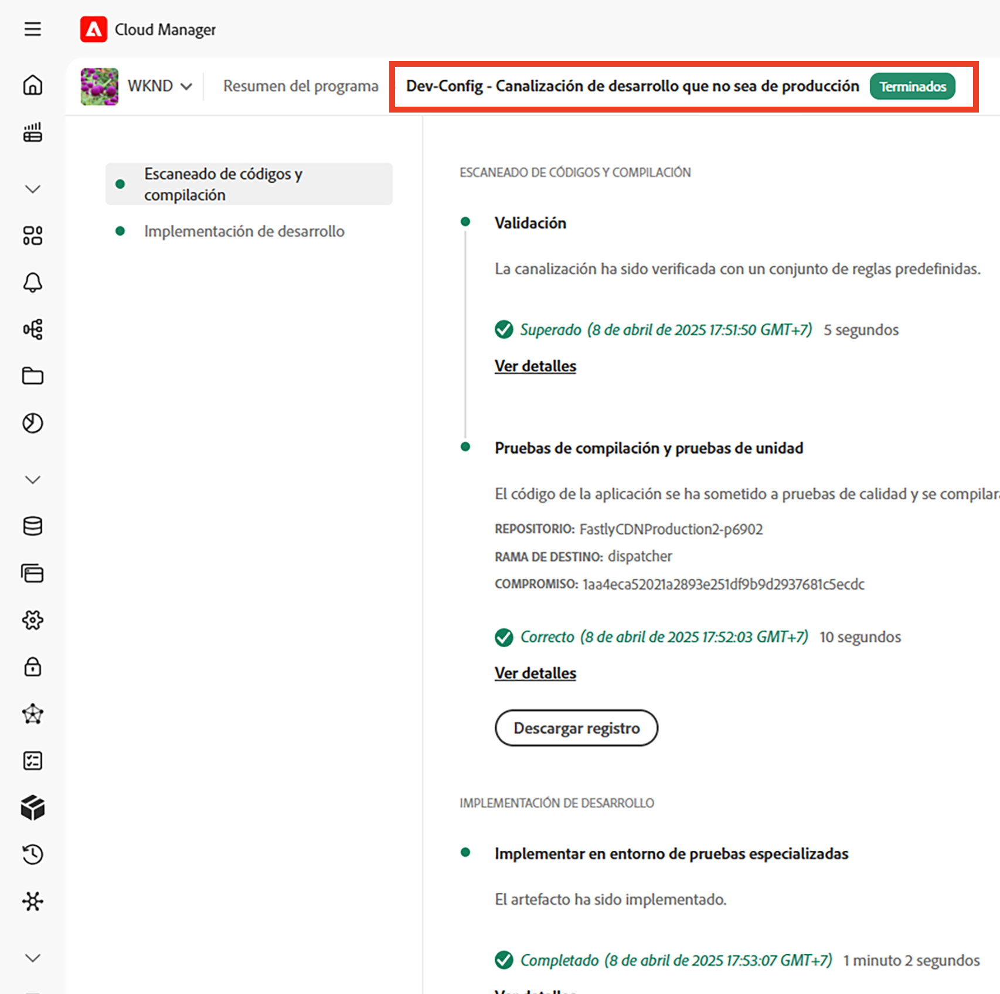
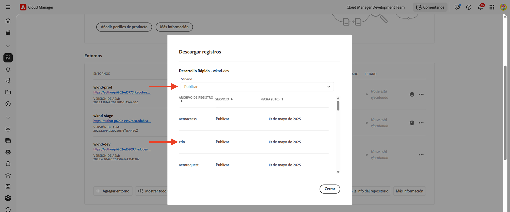
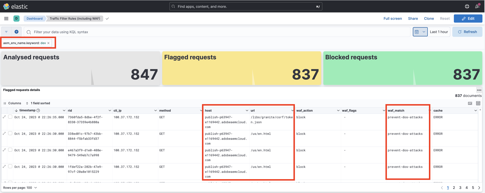
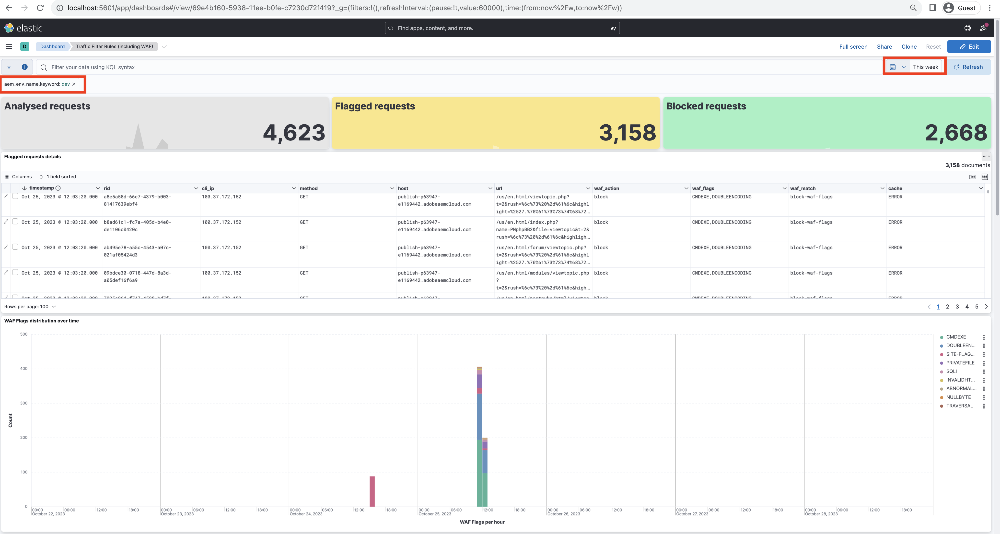

# Ejemplos y análisis de resultados de reglas de filtro de tráfico, incluidas las reglas WAF

Obtenga información sobre cómo declarar varios tipos de reglas de filtro de tráfico y analizar los resultados mediante los registros de CDN y las herramientas de tablero de Adobe Experience Manager as a Cloud Service (AEM CS).

En esta sección, explorará ejemplos prácticos de reglas de filtros de tráfico, incluidas las reglas WAF. Aprenderá a registrar, permitir y bloquear solicitudes en función del URI (o la ruta), la dirección IP, el número de solicitudes y los distintos tipos de ataques mediante [AEM Proyecto de sitios de WKND](https://github.com/adobe/aem-guides-wknd#aem-wknd-sites-project).

Además, descubrirá cómo utilizar las herramientas de tablero que consumen registros de CDN de AEM CS para visualizar métricas esenciales a través de los tableros de muestra proporcionados por el Adobe.

AEM Para alinearse con sus requisitos específicos, puede mejorar y crear paneles personalizados, obteniendo así perspectivas más profundas y optimizando las configuraciones de reglas para sus sitios de.

>[!VIDEO](https://video.tv.adobe.com/v/3425404?quality=12&learn=on)

## Ejemplos

Exploremos varios ejemplos de reglas de filtros de tráfico, incluidas las reglas WAF. Asegúrese de haber completado el proceso de configuración necesario tal como se describe en la sección anterior [cómo realizar la configuración](./how-to-setup.md) capítulo y que ha clonado el [AEM Proyecto de sitios de WKND](https://github.com/adobe/aem-guides-wknd#aem-wknd-sites-project).

### Registro de solicitudes

Comenzar por **registrar solicitudes de rutas de inicio y cierre de sesión de WKND** AEM con el servicio Publicación de.

- Añada la siguiente regla al proyecto WKND `/config/cdn.yaml` archivo.

```yaml
kind: CDN
version: '1'
metadata:
  envTypes:
    - dev
    - stage
    - prod
data:
  trafficFilters:
    rules:
    # On AEM Publish service log WKND Login and Logout requests
      - name: publish-auth-requests
        when:
          allOf:
            - reqProperty: tier
              matches: publish
            - reqProperty: path
              in:
                - /system/sling/login/j_security_check
                - /system/sling/logout
        action: log
```

- Confirme y envíe los cambios al repositorio Git de Cloud Manager.

- AEM Implemente los cambios en el entorno de desarrollo de mediante Cloud Manager `Dev-Config` canalización de configuración [creado anteriormente](how-to-setup.md#deploy-rules-through-cloud-manager).

  

- Pruebe la regla iniciando sesión y cerrando sesión en el sitio WKND del programa en el servicio de publicación (por ejemplo, `https://publish-pXXXX-eYYYY.adobeaemcloud.com/us/en.html`). Puede utilizar `asmith/asmith` como nombre de usuario y contraseña.

  

#### Análisis{#analyzing}

Analicemos los resultados de la prueba. `publish-auth-requests` descargando los registros de CDN de AEM CS desde Cloud Manager y utilizando la regla [herramientas de tablero](how-to-setup.md#analyze-results-using-elk-dashboard-tool), que configuró en el capítulo anterior.

- Desde [Cloud Manager](https://my.cloudmanager.adobe.com/)de **Entornos** , descargue el AEM CS **Publish** registros de CDN del servicio.

  

  >[!TIP]
  >
  >    Las nuevas solicitudes pueden tardar hasta 5 minutos en aparecer en los registros de CDN.

- Copie el archivo de registro descargado (por ejemplo, `publish_cdn_2023-10-24.log` en la captura de pantalla siguiente) en la `logs/dev` del proyecto de herramienta Panel elástico.

  {width="800" zoomable="yes"}

- Actualice la página Herramienta de tablero elástico.
   - En la parte superior **Filtro global** , edite la sección `aem_env_name.keyword` filtre y seleccione la `dev` valor de entorno.

     

   - Para cambiar el intervalo de tiempo, haga clic en el icono de calendario en la esquina superior derecha y seleccione el intervalo de tiempo deseado.

     

- Revise el informe del panel actualizado  **Solicitudes analizadas**, **Solicitudes marcadas**, y **Detalles de solicitudes marcadas** paneles. Para las entradas de registro de CDN coincidentes, debe mostrar los valores de la IP de cliente (cli_ip), el host, la URL, la acción (waf_action) y el nombre de regla (waf_match) de cada entrada.

  


### Bloqueo de solicitudes

En este ejemplo, vamos a añadir una página en una _interno_ carpeta en la ruta `/content/wknd/internal` en el proyecto WKND implementado. Luego declare una regla de filtro de tráfico que **bloquea el tráfico** a subpáginas desde cualquier lugar que no sea una dirección IP especificada que coincida con su organización (por ejemplo, una VPN corporativa).

Puede crear su propia página interna (por ejemplo, `demo-page.html`) o use el [paquete adjunto](./assets/demo-internal-pages-package.zip).

- Añada la siguiente regla en el del proyecto WKND `/config/cdn.yaml` archivo:

```yaml
kind: CDN
version: '1'
metadata:
  envTypes:
    - dev
    - stage
    - prod
data:
  trafficFilters:
    rules:
    ...

    # Block requests to (demo) internal only page/s from public IP address but allow from internal IP address.
    # Make sure to replace the IP address with your own IP address.
      - name: block-internal-paths
        when:
          allOf:
            - reqProperty: path
              matches: /content/wknd/internal
            - reqProperty: clientIp
              notIn: [192.150.10.0/24]
        action: block
```

- Confirme y envíe los cambios al repositorio Git de Cloud Manager.

- AEM Implemente los cambios en el entorno de desarrollo de mediante [creado anteriormente](how-to-setup.md#deploy-rules-through-cloud-manager) `Dev-Config` Canalización de configuración de en Cloud Manager.

- Pruebe la regla accediendo a la página interna del sitio WKND, por ejemplo `https://publish-pXXXX-eYYYY.adobeaemcloud.com/content/wknd/internal/demo-page.html` o utilizando el siguiente comando CURL:

  ```bash
  $ curl -I https://publish-pXXXX-eYYYY.adobeaemcloud.com/content/wknd/internal/demo-page.html
  ```

- Repita el paso anterior desde la dirección IP que utilizó en la regla y luego una dirección IP diferente (por ejemplo, usando su teléfono móvil).

#### Análisis

Para analizar los resultados de `block-internal-paths` siga los mismos pasos que se describen en la sección [ejemplo anterior](#analyzing).

Sin embargo, esta vez debería ver el **Solicitudes bloqueadas** y los valores correspondientes en las columnas IP del cliente (cli_ip), host, URL, acción (waf_action) y nombre de regla (waf_match).


### Prevención de ataques DoS

Vamos a... **evitar ataques DoS** bloqueando solicitudes de una dirección IP que realiza 100 solicitudes por segundo, lo que provoca que se bloquee durante 5 minutos.

- Añada lo siguiente [regla de filtro de tráfico de límite de velocidad](https://experienceleague.adobe.com/docs/experience-manager-cloud-service/content/security/traffic-filter-rules-including-waf.html#ratelimit-structure) en el del proyecto WKND `/config/cdn.yaml` archivo.

```yaml
kind: CDN
version: '1'
metadata:
  envTypes:
    - dev
    - stage
    - prod
data:
  trafficFilters:
    rules:
    ...
    #  Prevent DoS attacks by blocking client for 5 minutes if they make more than 100 requests in 1 second.
      - name: prevent-dos-attacks
        when:
          reqProperty: path
          like: '*'
        rateLimit:
          limit: 100
          window: 1
          penalty: 300
          groupBy:
            - reqProperty: clientIp
        action: block
```

>[!WARNING]
>
>Para su entorno de producción, colabore con su equipo de seguridad web para determinar los valores adecuados para `rateLimit`,

- Confirme, inserte e implemente cambios como se menciona en la [ejemplos anteriores](#logging-requests).

- Para simular el ataque DoS, utilice lo siguiente [Vegeta](https://github.com/tsenart/vegeta) comando.

  ```shell
  $ echo "GET https://publish-pXXXX-eYYYY.adobeaemcloud.com/us/en.html" | vegeta attack -rate=120 -duration=5s | vegeta report
  ```

  Este comando realiza 120 solicitudes durante 5 segundos y genera un informe. Como puede ver, la tasa de éxito es del 32,5 %; se recibe un código de respuesta HTTP 406 para el resto, que muestra que el tráfico estaba bloqueado.

  

#### Análisis

Para analizar los resultados de `prevent-dos-attacks` siga los mismos pasos que se describen en la sección [ejemplo anterior](#analyzing).

Esta vez deberías ver muchos **Solicitudes bloqueadas** y los valores correspondientes en las columnas IP del cliente (cli_ip), host, url, acción (waf_action) y nombre de regla (waf_match).



Además, la variable **Principales 100 ataques de la IP del cliente, el país y el agente de usuario** los paneles muestran detalles adicionales, que se pueden utilizar para optimizar aún más la configuración de reglas.


Para obtener más información sobre cómo evitar ataques DoS y DDoS, consulte la [Bloqueo de ataques DoS y DoS mediante reglas de filtro de tráfico](../dos/blocking-dos-attack-using-traffic-filter-rules.md) tutorial.

### Reglas de WAF

Todos los clientes de Sites y Forms pueden configurar los ejemplos de reglas de filtros de tráfico hasta el momento.

A continuación, vamos a explorar la experiencia de un cliente que ha adquirido una licencia de seguridad mejorada o protección WAF-DDoS, que le permite configurar reglas avanzadas para proteger los sitios web de ataques más sofisticados.

Antes de continuar, habilite la protección WAF-DDoS para su programa, tal como se describe en la documentación de reglas de filtro de tráfico [pasos de configuración](https://experienceleague.adobe.com/docs/experience-manager-cloud-service/content/security/traffic-filter-rules-including-waf.html?lang=en#setup).

#### Sin indicadores WAFF

Veamos primero la experiencia incluso antes de que se declaren las reglas WAF. Cuando el WAF-DDoS está habilitado en su programa, su CDN registra de forma predeterminada cualquier coincidencia de tráfico malicioso, por lo que tiene la información correcta para llegar a las reglas adecuadas.

Empecemos atacando el sitio WKND sin agregar una regla WAF (o utilizando la variable `wafFlags` ) y analizar los resultados.

- Para simular un ataque, utilice el [Nikto](https://github.com/sullo/nikto) siguiente, que envía alrededor de 700 solicitudes maliciosas en 6 minutos.

  ```shell
  $ ./nikto.pl -useragent "AttackSimulationAgent (Demo/1.0)" -D V -Tuning 9 -ssl -h https://publish-pXXXX-eYYYY.adobeaemcloud.com/us/en.html
  ```

  

  Para obtener más información sobre la simulación de ataques, consulte [Nikto - Ajuste de exploración](https://github.com/sullo/nikto/wiki/Scan-Tuning) , que le indica cómo especificar el tipo de ataques de prueba que se van a incluir o excluir.

##### Análisis

Para analizar los resultados de la simulación de ataques, siga los mismos pasos que se describen en la sección [ejemplo anterior](#analyzing).

Sin embargo, esta vez debería ver el **Solicitudes marcadas** y los valores correspondientes en las columnas IP de cliente (cli_ip), host, url, acción (waf_action) y nombre de regla (waf_match). Esta información le permite analizar los resultados y optimizar la configuración de las reglas.


Observe cómo las variables **Distribución de indicadores WAF** y **Ataques principales** los paneles muestran detalles adicionales, que se pueden utilizar para optimizar aún más la configuración de reglas.


#### Con WAFFlags

Ahora vamos a agregar una regla WAF que contenga `wafFlags` propiedad como parte de `action` propiedad y **bloquear las solicitudes de ataque simuladas**.

Desde una perspectiva de sintaxis, las reglas WAF son similares a las vistas anteriormente, sin embargo, la variable `action` hace referencia a una o varias propiedades `wafFlags` valores. Para obtener más información sobre `wafFlags`, revise la [Lista de indicadores WAF](https://experienceleague.adobe.com/docs/experience-manager-cloud-service/content/security/traffic-filter-rules-including-waf.html#waf-flags-list) sección.

- Añada la siguiente regla en el del proyecto WKND `/config/cdn.yaml` archivo. Observe cómo las variables `block-waf-flags` La regla incluye algunos de los wafFlags que aparecieron en las herramientas del panel cuando se atacaron con tráfico malicioso simulado. De hecho, es una buena práctica con el tiempo analizar los registros para determinar qué nuevas reglas declarar, a medida que evoluciona el panorama de amenazas.

```yaml
kind: CDN
version: '1'
metadata:
  envTypes:
    - dev
    - stage
    - prod
data:
  trafficFilters:
    rules:
    ...
    # Enable WAF protections (only works if WAF is enabled for your environment)
      - name: block-waf-flags
        when:
          reqProperty: tier
          matches: "author|publish"
        action:
          type: block
          wafFlags:
            - SANS
            - TORNODE
            - NOUA
            - SCANNER
            - USERAGENT
            - PRIVATEFILE
            - ABNORMALPATH
            - TRAVERSAL
            - NULLBYTE
            - BACKDOOR
            - LOG4J-JNDI
            - SQLI
            - XSS
            - CODEINJECTION
            - CMDEXE
            - NO-CONTENT-TYPE
            - UTF8
```

- Confirme, inserte e implemente cambios como se menciona en la [ejemplos anteriores](#logging-requests).

- Para simular un ataque, utilice el mismo [Nikto](https://github.com/sullo/nikto) como antes.

  ```shell
  $ ./nikto.pl -useragent "AttackSimulationAgent (Demo/1.0)" -D V -Tuning 9 -ssl -h https://publish-pXXXX-eYYYY.adobeaemcloud.com/us/en.html
  ```

##### Análisis

Repita los mismos pasos que se describen en la [ejemplo anterior](#analyzing).

Esta vez debería ver las entradas debajo de **Solicitudes bloqueadas** y los valores correspondientes en las columnas IP de cliente (cli_ip), host, url, acción (waf_action) y nombre de regla (waf_match).


Además, la variable **Distribución de indicadores WAF** y **Ataques principales** los paneles muestran detalles adicionales.


### Análisis completo

En lo anterior _análisis_ En estas secciones, ha aprendido a analizar los resultados de reglas específicas mediante la herramienta de tablero. Puede explorar más en profundidad el análisis de resultados mediante otros paneles, como:


- Solicitudes analizadas, marcadas y bloqueadas
- Distribución de indicadores WAF a lo largo del tiempo
- Reglas de filtro de tráfico activadas con el tiempo
- Ataques principales por ID de indicador WAF
- Filtro de tráfico activado principal
- Principales 100 atacantes por IP de cliente, país y agente de usuario




## Siguiente paso

Familiarícese con las recomendaciones [prácticas recomendadas](./best-practices.md) para reducir el riesgo de violaciones de seguridad.

## Recursos adicionales

[Sintaxis de reglas de filtro de tráfico](https://experienceleague.adobe.com/docs/experience-manager-cloud-service/content/security/traffic-filter-rules-including-waf.html#rules-syntax)

[Formato de registro de CDN](https://experienceleague.adobe.com/docs/experience-manager-cloud-service/content/security/traffic-filter-rules-including-waf.html#cdn-log-format)

