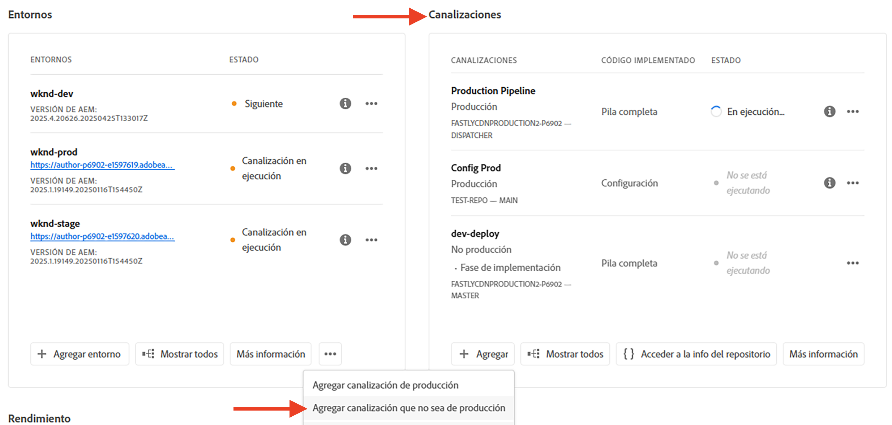
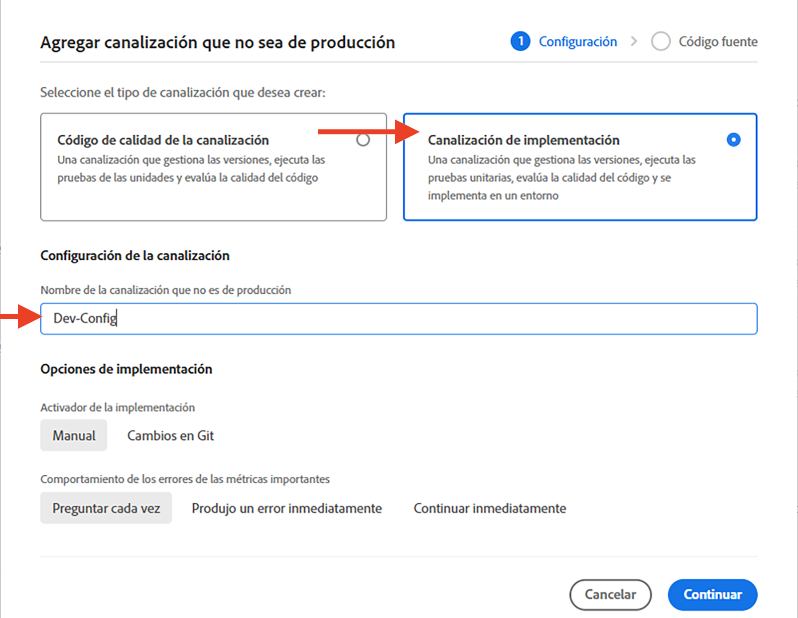
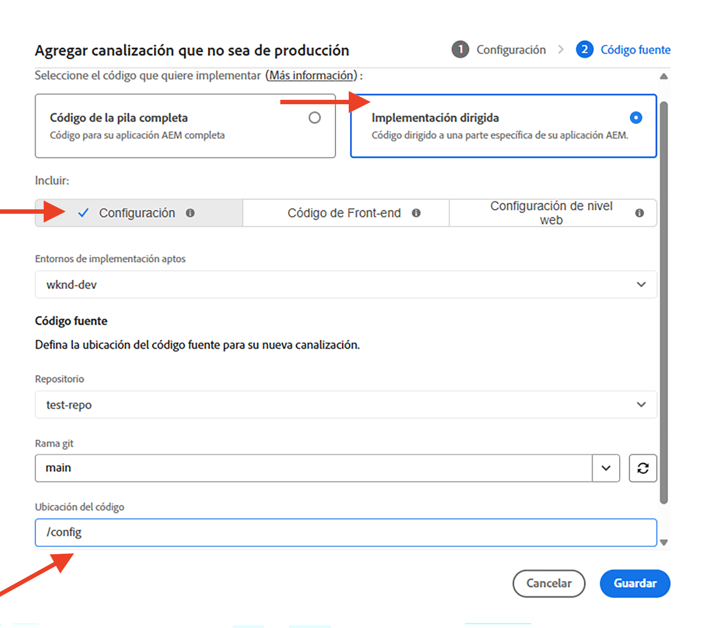

# Cómo configurar las reglas del filtro de tráfico, incluidas las reglas WAF

Aprender **cómo realizar la configuración** reglas de filtro de tráfico, incluidas las reglas WAF. Obtenga información sobre la creación, la implementación, las pruebas y el análisis de resultados.

## Configuración

El proceso de configuración implica lo siguiente:

- _creación de reglas_ AEM con una estructura de proyecto y un archivo de configuración adecuados para el usuario.
- _implementación de reglas_ uso de la canalización de configuración de Adobe Cloud Manager.
- _prueba de reglas_ uso de varias herramientas para generar tráfico.
- _análisis de los resultados_ uso de registros de CDN de AEM CS y herramientas de tablero.

### AEM Creación de reglas en el proyecto de

Para crear reglas, siga estos pasos:

1. AEM Cree una carpeta en el nivel superior del proyecto de la `config`.

1. Dentro de `config` carpeta, cree un nuevo archivo llamado `cdn.yaml`.

1. Añada los siguientes metadatos a `cdn.yaml` archivo:

```yaml
kind: CDN
version: '1'
metadata:
  envTypes:
    - dev
    - stage
    - prod
data:
  trafficFilters:
    rules:
```

Consulte un ejemplo de `cdn.yaml` AEM dentro del proyecto WKND Sites de las guías de la:


### Implementar reglas mediante Cloud Manager {#deploy-rules-through-cloud-manager}

Para implementar reglas, siga estos pasos:

1. Inicie sesión en Cloud Manager en [my.cloudmanager.adobe.com](https://my.cloudmanager.adobe.com/) y seleccione la organización y programa adecuados.

1. Vaya a _Canalizaciones_ de la tarjeta de _Resumen del programa_ y haga clic en la **+Agregar** y seleccione el tipo de canalización que desee.

   

   En el ejemplo anterior, con fines de demostración _Agregar canalización que no sea de producción_ se selecciona porque se utiliza un entorno de desarrollo.

1. En el _Agregar canalización que no sea de producción_ , elija e introduzca los siguientes detalles:

   1. Paso de configuración:

      - **Tipo**: Canalización de implementación
      - **Nombre de canalización**: Dev-Config

      

   2. Paso Código fuente:

      - **Código para implementar**: implementación dirigida
      - **Incluir**: Configuración
      - **Entorno de implementación**: Nombre de su entorno, por ejemplo, wknd-program-dev.
      - **Repositorio**: repositorio de Git desde el que la canalización debe recuperar el código; por ejemplo, `wknd-site`
      - **Rama Git**: nombre de la rama del repositorio de Git.
      - **Ubicación del código**: `/config`, correspondiente a la carpeta de configuración de nivel superior creada en el paso anterior.

      

### Prueba de reglas mediante la generación de tráfico

Para probar las reglas, hay varias herramientas de terceros disponibles y es posible que su organización tenga una herramienta preferida. Para fines de demostración, vamos a utilizar las siguientes herramientas:

- [Curl](https://curl.se/) para pruebas básicas como invocar una URL y comprobar el código de respuesta.

- [Vegeta](https://github.com/tsenart/vegeta) para realizar denegación de servicio (DOS). Siga las instrucciones de instalación de [GitHub de Vegeta](https://github.com/tsenart/vegeta#install).

- [Nikto](https://github.com/sullo/nikto/wiki) para encontrar posibles problemas y vulnerabilidades de seguridad como XSS, inyección SQL y más. Siga las instrucciones de instalación de [Nikto GitHub](https://github.com/sullo/nikto).

- Compruebe que las herramientas están instaladas y disponibles en el terminal ejecutando los siguientes comandos:

  ```shell
  # Curl version check
  $ curl --version
  
  # Vegeta version check
  $ vegeta -version
  
  # Nikto version check
  $ cd <PATH-OF-CLONED-REPO>/program
  ./nikto.pl -Version
  ```

### Analizar los resultados con las herramientas del panel

Después de crear, implementar y probar las reglas, puede analizar los resultados mediante **Elasticsearch, Logstash y Kibana (ELK)** herramientas de tablero. Puede analizar los registros de CDN de AEM CS, lo que le permite visualizar los resultados en forma de varios gráficos y diagramas.

Las herramientas de tablero se pueden clonar directamente desde el [AEMCS-CDN-Log-Analysis-ELK-Tool Repositorio de GitHub](https://github.com/adobe/AEMCS-CDN-Log-Analysis-ELK-Tool) y siga los pasos para instalar y cargar el **reglas de filtro de tráfico (incluido WAF)** panel.

- Después de cargar el tablero de muestra, la página de la herramienta Tablero elástico debería tener el siguiente aspecto:

  

>[!NOTE]
>
>    Dado que aún no se han introducido registros de CDN de AEM CS, el panel está vacío.


## Siguiente paso

Obtenga información sobre cómo declarar reglas de filtro de tráfico, incluidas las reglas WAF, en la [Ejemplos y análisis de resultados](./examples-and-analysis.md) AEM Uso del proyecto de WKND Sites de la.
