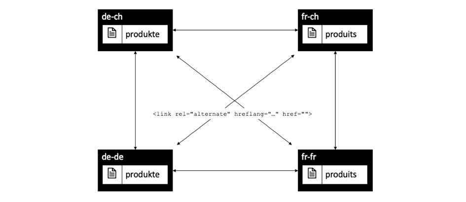

# Capítulo 1 - Conceptos, patrones y antipatrones del despachante

## Información general

En este capítulo se ofrece una breve introducción sobre la historia y la mecánica del despachante y se explica cómo influye esto en la forma en que un desarrollador AEM diseñaría sus componentes.

## Por qué los desarrolladores deben preocuparse por la infraestructura

El despachante es una parte esencial de la mayoría, si no de todas las instalaciones AEM. Puede encontrar muchos artículos en línea que describen cómo configurar el despachante, así como sugerencias y trucos.

Sin embargo, estos pedazos y pedazos de información siempre inicio a un nivel muy técnico - suponiendo que ya sabes lo que quieres hacer y así proporcionar solamente detalles sobre cómo lograr lo que quieres. Nunca hemos encontrado ningún documento conceptual que describa el _qué es y por qué es_ cuando se trata de lo que puede y no puede hacer con el despachante.

### Antipatrón: Dispatcher como un pensamiento alternativo

Esta falta de información básica lleva a una serie de anti-patrones que hemos visto en varios proyectos AEM:

1. Como Dispatcher está instalado en el servidor Web Apache, es tarea de los &quot;dioses Unix&quot; en el proyecto configurarlo. Un &quot;desarrollador de Java mortal&quot; no necesita preocuparse por ello.

2. El desarrollador de Java debe asegurarse de que su código funcione... el despachante más adelante lo hará mágicamente rápido. El despachante siempre es un pensamiento tardío. Sin embargo, esto no funciona. Un desarrollador debe diseñar su código teniendo en cuenta al despachante. Y necesita conocer sus conceptos básicos para hacerlo.

### &quot;Primero hacerlo funcionar - luego hacerlo rápido&quot; no siempre es correcto

Es posible que haya escuchado el consejo de programación _&quot;Primero haga que funcione - luego hágalo rápido&quot;._. No está del todo mal. Sin embargo, sin el contexto adecuado, tiende a ser malinterpretado y no aplicado correctamente.

El consejo debe evitar que el programador optimice el código de forma prematura, que puede que nunca se ejecute, o que se ejecute tan raramente, que una optimización no tendrá un impacto suficiente para justificar el esfuerzo que se está realizando en la optimización. Además, la optimización podría conducir a un código más complejo y, por lo tanto, introducir errores. Así que, si eres desarrollador, no pases demasiado tiempo en microoptimizar cada línea de código. Solo tiene que asegurarse de elegir las estructuras de datos, algoritmos y bibliotecas adecuados y esperar a que la análisis de puntos interactivos de un generador de perfiles muestre dónde una optimización más exhaustiva podría aumentar el rendimiento general.

### Decisiones y artefactos arquitectónicos

Sin embargo, el consejo de &quot;primero hágalo funcionar - luego hágalo rápido&quot; está completamente equivocado cuando se trata de decisiones &quot;arquitectónicas&quot;. ¿Qué son las decisiones arquitectónicas? En pocas palabras, son las decisiones que son costosas, difíciles y/o imposibles de cambiar después. Recuerde que &quot;costoso&quot; a veces es lo mismo que &quot;imposible&quot;.  Por ejemplo, cuando el proyecto se queda sin presupuesto, es imposible implementar cambios costosos. Los cambios en la infraestructura son el primer tipo de cambios en esa categoría que llegan a la mayoría de la gente. Pero también hay otro tipo de artefactos &quot;arquitectónicos&quot; que pueden volverse muy desagradables de cambiar:

1. Trozos de código en el &quot;centro&quot; de una aplicación, en el que dependen muchas otras piezas. Si se modifican, es necesario cambiar y volver a probar todas las dependencias a la vez.

2. Los artefactos, que están involucrados en algún escenario asincrónico dependiente de la temporización donde la entrada - y por lo tanto el comportamiento del sistema puede variar muy aleatoriamente. Los cambios pueden tener efectos impredecibles y pueden resultar difíciles de probar.

3. Patrones de software que se utilizan y reutilizan una y otra vez, en todas las piezas y partes del sistema. Si el patrón de software resulta ser subóptimo, es necesario volver a codificar todos los artefactos que utilicen el patrón.

Recordar? Sobre esta página dijimos que el despachante es una parte esencial de una aplicación AEM. El acceso a una aplicación web es muy aleatorio: los usuarios vienen y van en momentos impredecibles. Al final, todo el contenido se almacenará (o se deberá) en la caché del despachante. Así que, si prestaste mucha atención, tal vez te hayas dado cuenta de que el almacenamiento en caché puede ser visto como un artefacto &quot;arquitectónico&quot; y por lo tanto debe ser entendido por todos los miembros del equipo, desarrolladores y administradores por igual.

No estamos diciendo que un desarrollador deba configurar el despachante. Necesitan conocer los conceptos -especialmente los límites- para asegurarse de que el despachante también pueda aprovechar su código.

El despachante no mejora mágicamente la velocidad del código. Un desarrollador debe crear sus componentes teniendo en cuenta el despachante. Por lo tanto, necesita saber cómo funciona.

## Almacenamiento en caché de despachantes: principios básicos

### Dispatcher como Http de Almacenamiento en Caché - Equilibrador de carga

¿Qué es el despachante y por qué se llama &quot;Dispatcher&quot; en primer lugar?

El despachante es

* Primero y principal, una caché

* Un proxy inverso

* Un módulo para el servidor web Apache httpd, agregando AEM funciones relacionadas a la versatilidad de Apache y trabajando sin problemas con todos los demás módulos Apache (como SSL o incluso SSI incluye lo que veremos más adelante)

En los primeros días de la web, usted esperaría unos cuantos cientos de visitantes a un sitio. Una configuración de un despachante, &quot;enviado&quot; o equilibrio de la carga de solicitudes a varios servidores de publicación de AEM y que normalmente era suficiente; por lo tanto, el nombre &quot;despachante&quot;. Hoy en día, sin embargo, esta configuración ya no se utiliza con mucha frecuencia.

Veremos diferentes formas de configurar los despachantes y los sistemas de publicación más adelante en este artículo. Primero, vamos a inicio con algunos conceptos básicos del almacenamiento en caché http.


*Funcionalidad básica de una caché de despachante*

<br> 

Aquí se explican los conceptos básicos del despachante. El despachante es un proxy inverso de caché simple con la capacidad de recibir y crear solicitudes HTTP. Un ciclo normal de solicitud/respuesta es el siguiente:

1. Un usuario solicita una página
2. El despachante comprueba si ya tiene una versión representada de esa página. Supongamos que es la primera solicitud para esta página y que el despachante no puede encontrar una copia en caché local.
3. El despachante solicita la página desde el sistema de publicación
4. En el sistema de publicación, la página se representa mediante una plantilla JSP o HTL
5. La página se devuelve al despachante
6. El despachante almacena en caché la página
7. El despachante devuelve la página al explorador
8. Si se solicita la misma página por segunda vez, puede servirse directamente desde la caché de Dispatcher sin necesidad de volver a representarla en la instancia de Publish. Esto ahorra tiempo de espera para los ciclos de usuario y CPU en la instancia de Publish.

Hablábamos de &quot;páginas&quot; en la última sección. Pero el mismo esquema también se aplica a otros recursos, como imágenes, archivos CSS, descargas de archivos PDF, etc.

#### Cómo se almacenan en caché los datos

El módulo Dispatcher aprovecha las instalaciones que proporciona el servidor Apache de hospedaje. Los recursos como páginas HTML, descargas e imágenes se almacenan como archivos simples en el sistema de archivos Apache. Es así de simple.

El nombre de archivo se deriva de la dirección URL del recurso solicitado. Si solicita un archivo `/foo/bar.html` se almacena, por ejemplo, en /`var/cache/docroot/foo/bar.html`.

En principio, si todos los archivos se almacenan en caché y, por lo tanto, se almacenan de forma estática en Dispatcher, puede extraer el complemento del sistema de publicación y el despachante serviría como un servidor Web sencillo. Pero esto es sólo para ilustrar el principio. La vida real es más complicada. No puede almacenar todo en caché y la caché nunca está completamente &quot;llena&quot;, ya que el número de recursos puede ser infinito debido a la naturaleza dinámica del proceso de procesamiento. El modelo de un sistema de ficheros estático ayuda a generar una imagen aproximada de las capacidades del despachante. Y ayuda a explicar las limitaciones del despachante.

#### Asignación de la estructura URL AEM y del sistema de archivos

Para comprender el despachante con más detalle, debemos volver a examinar la estructura de una URL de muestra sencilla.  Veamos el siguiente ejemplo:

`http://domain.com/path/to/resource/pagename.selectors.html/path/suffix.ext?parameter=value&amp;otherparameter=value#fragment`

* `http` indica el protocolo

* `domain.com` es el nombre de dominio

* `path/to/resource` es la ruta bajo la cual se almacena el recurso en CRX y posteriormente en el sistema de archivos del servidor Apache

Desde aquí, las cosas difieren un poco entre el sistema de ficheros AEM y el sistema de ficheros Apache.

En AEM,

* `pagename` es la etiqueta de recursos

* `selectors` significa un número de selectores utilizados en Sling para determinar cómo se procesa el recurso. Una dirección URL puede tener un número arbitrario de selectores. Están separadas por un punto. Por ejemplo, una sección de selectores podría ser algo como &quot;french.mobile.sofisticado&quot;. Los selectores solo deben contener letras, dígitos y guiones.

* `html` como el último de los &quot;selectores&quot; se denomina extensión. En AEM/Sling también determina parcialmente la secuencia de comandos de procesamiento.

* `path/suffix.ext` es una expresión similar a una ruta que puede ser un sufijo de la dirección URL.  Se puede utilizar en secuencias de comandos AEM para controlar mejor cómo se procesa un recurso. Más adelante tendremos una sección completa sobre esta parte. Por ahora, basta con saber que se puede usar como parámetro adicional. Los sufijos deben tener una extensión.

* `?parameter=value&otherparameter=value` es la sección de consulta de la dirección URL. Se utiliza para pasar parámetros arbitrarios a AEM. Las direcciones URL con parámetros no se pueden almacenar en caché y, por lo tanto, los parámetros deben limitarse a los casos en los que sean absolutamente necesarios.

* `#fragment`, la parte de fragmento de una dirección URL no se pasa a AEM se utiliza únicamente en el navegador; en marcos de trabajo de JavaScript como &quot;parámetros de enrutamiento&quot; o para saltar a una parte determinada de la página.

En Apache (*haga referencia al siguiente diagrama*),

* `pagename.selectors.html` se utiliza como nombre de archivo en el sistema de archivos de la memoria caché.

Si la dirección URL tiene un sufijo `path/suffix.ext`, entonces,

* `pagename.selectors.html` se crea como una carpeta

* `path` una carpeta de la  `pagename.selectors.html` carpeta

* `suffix.ext` es un archivo de la  `path` carpeta. Nota: Si el sufijo no tiene una extensión, el archivo no se almacena en caché.


*Diseño del sistema de archivos después de obtener direcciones URL del despachante*

<br> 

#### Limitaciones básicas

La asignación entre una URL, el recurso y el nombre del archivo es bastante sencilla.

Sin embargo, es posible que haya notado algunas trampas,

1. Las direcciones URL pueden ser muy largas. Añadir la porción &quot;path&quot; de un `/docroot` en el sistema de archivos local fácilmente podría exceder los límites de algunos filesystems. Ejecutar Dispatcher en NTFS en Windows puede ser un desafío. Sin embargo, usted está a salvo con Linux.

2. Las direcciones URL pueden contener caracteres especiales y umlauts. Normalmente, esto no es un problema para el despachante. Tenga en cuenta, sin embargo, que la URL se interpreta en muchos lugares de la aplicación. La mayoría de las veces, hemos visto comportamientos extraños de una aplicación - sólo para descubrir que un fragmento de código (personalizado) raramente usado no se probó a fondo en busca de caracteres especiales. Deberías evitarlos si puedes. Y si no puedes, planea realizar pruebas exhaustivas.

3. En CRX, los recursos tienen subrecursos. Por ejemplo, una página tendrá un número de subpáginas. Esto no se puede comparar en un sistema de archivos ya que los sistemas de archivos tienen archivos o carpetas.

#### Las direcciones URL sin extensión no se almacenan en caché

Las direcciones URL siempre deben tener una extensión. Aunque puede proporcionar direcciones URL sin extensiones en AEM. Estas direcciones URL no se almacenarán en caché en el despachante.

**Ejemplos**

`http://domain.com/home.html` se puede  **almacenar en caché**

`http://domain.com/home` no  **se puede almacenar en caché**

La misma regla se aplica cuando la dirección URL contiene un sufijo. El sufijo necesita tener una extensión para poder ser alcanzado.

**Ejemplos**

`http://domain.com/home.html/path/suffix.html` se puede  **almacenar en caché**

`http://domain.com/home.html/path/suffix` no  **se puede almacenar en caché**

Se preguntarán, ¿qué sucede si la parte del recurso no tiene una extensión, pero el sufijo tiene una? Bueno, en este caso la dirección URL no tiene ningún sufijo. Observe el siguiente ejemplo:

**Ejemplo**

`http://domain.com/home/path/suffix.ext`

El `/home/path/suffix` es la ruta al recurso... por lo que no hay sufijo en la dirección URL.

**Conclusión**

Siempre agregue extensiones a la ruta y al sufijo. Las personas con conciencia de SEO a veces argumentan que esto lo clasifica en los resultados de búsqueda. Pero una página sin almacenar en caché sería muy lenta y se clasificaría aún más.

#### Direcciones URL de sufijo en conflicto

Considere que tiene dos direcciones URL válidas

`http://domain.com/home.html`

y

`http://domain.com/home.html/suffix.html`

Son absolutamente válidos en AEM. No vería ningún problema en su equipo de desarrollo local (sin Dispatcher). Lo más probable es que tampoco encuentre ningún problema en las pruebas de carga o de UAT. El problema que enfrentamos es tan sutil que se desliza en la mayoría de las pruebas.  Te golpeará fuerte cuando estés en tiempo pico y te limitará el tiempo para resolverlo, probablemente no tengas acceso al servidor ni recursos para arreglarlo. Hemos estado ahí...

Así que... ¿Cuál es el problema?

`home.html` en un sistema de archivos puede ser un archivo o una carpeta. No al mismo tiempo que en AEM.

Si solicita `home.html` primero, se creará como archivo.

Las solicitudes posteriores a `home.html/suffix.html` devuelven resultados válidos, pero como el archivo `home.html` &quot;bloquea&quot; la posición en el filesystem, `home.html` no se puede crear por segunda vez como una carpeta y, por lo tanto, `home.html/suffix.html` no se almacena en caché.


*La posición de bloqueo de archivos en el sistema de archivos impide que los recursos secundarios se almacenen en caché*

<br> 

Si lo hace al revés, primero solicite `home.html/suffix.html` y luego `suffix.html` se almacena en la caché en una carpeta `/home.html` al principio. Sin embargo, esta carpeta se elimina y se reemplaza por un archivo `home.html` cuando posteriormente solicita `home.html` como recurso.


*Eliminación de una estructura de ruta cuando se busca un elemento principal como recurso*

<br> 

Por lo tanto, el resultado de lo que se almacena en caché es completamente aleatorio y depende del orden de las solicitudes entrantes. Lo que hace que las cosas sean aún más complicadas es el hecho de que normalmente hay más de un despachante. Y el rendimiento, la tasa de visitas y el comportamiento de la caché pueden variar de un despachante a otro. Si desea saber por qué el sitio web no responde, debe estar seguro de que está mirando al despachante correcto con el lamentable orden de almacenamiento en caché. Si estás mirando el Dispatcher que - por suerte - tuvo un patrón de solicitud más favorable, te perderás al tratar de encontrar el problema.

#### Evitar URL en conflicto

Puede evitar &quot;direcciones URL en conflicto&quot;, donde un nombre de carpeta y un nombre de archivo &quot;compiten&quot; por la misma ruta en el sistema de archivos, cuando se utiliza una extensión diferente para el recurso cuando se tiene un sufijo.

**Ejemplo**

* `http://domain.com/home.html`

* `http://domain.com/home.dir/suffix.html`

Ambos son perfectamente acheables,


Si elige una extensión dedicada &quot;dir&quot; para un recurso cuando solicita un sufijo o evita usar el sufijo por completo. Hay casos raros en los que son útiles. Y es fácil implementar estos casos correctamente.  Como veremos en el siguiente capítulo cuando hablamos de invalidación y vaciado de caché.

#### Solicitudes no almacenables

Analicemos un breve resumen del último capítulo más algunas excepciones. El despachante puede almacenar en caché una dirección URL si está configurada como caché y si es una solicitud de GET. No se puede almacenar en caché con una de las siguientes excepciones.

**Solicitudes almacenables en caché**

* La solicitud está configurada para que se pueda almacenar en caché en la configuración de Dispatcher
* La solicitud es una solicitud de GET sin formato

**Solicitudes o respuestas no almacenables en caché**

* Solicitud a la que se ha denegado el almacenamiento en caché por configuración (ruta, patrón, tipo MIME)
* Respuestas que devuelven un &quot;despachante: encabezado &quot;sin caché&quot;
* Respuesta que devuelve un &quot;Cache-Control: encabezado no-cache|private&quot;
* Respuesta que devuelve un &quot;Pragma: encabezado &quot;sin caché&quot;
* Parámetros de solicitud con consulta
* Dirección URL sin extensión
* Dirección URL con un sufijo que no tiene extensión
* Respuesta que devuelve un código de estado distinto de 200
* Solicitud de POST

## Invalidación y vaciado de la caché

### Información general

El último capítulo enumeraba un gran número de excepciones cuando el despachante no puede almacenar en caché una solicitud. Pero hay más cosas que considerar: Sólo porque Dispatcher _puede_ almacenar en caché una solicitud, no significa necesariamente que _deba_.

El punto es: El almacenamiento en caché generalmente es fácil. El despachante solo necesita almacenar el resultado de una respuesta y devolverlo la próxima vez que se reciba la misma solicitud. Derecha? ¡Equivocado!

La parte difícil es la _invalidación_ o _vaciado_ de la caché. El despachante debe averiguarlo cuando un recurso ha cambiado y debe volver a procesarse.

Esta parece ser una tarea trivial a primera vista... pero no lo es. Lea más y descubrirá algunas diferencias complicadas entre los recursos simples y los simples y las páginas que dependen de una estructura altamente malheada de múltiples recursos.

### Recursos simples y vaciado

Hemos configurado nuestro sistema de AEM para crear dinámicamente una representación en miniatura para cada imagen cuando se solicita con un selector de &quot;pulgar&quot; especial:

`/content/dam/path/to/image.thumb.png`

Y - por supuesto - proporcionamos una URL para proporcionar la imagen original con una URL sin selector:

`/content/dam/path/to/image.png`

Si descargamos ambas, la imagen en miniatura y la imagen original, acabaremos con algo como:

```
/var/cache/dispatcher/docroot/content/dam/path/to/image.thumb.png

/var/cache/dispatcher/docroot/content/dam/path/to/image.png
```

en el sistema de ficheros de nuestro Dispatcher.

Ahora, el usuario carga y activa una nueva versión de ese archivo. En última instancia, se envía una solicitud de invalidación de AEM al despachante,

```
GET /invalidate
invalidate-path:  /content/dam/path/to/image

<no body>
```

La invalidación es tan fácil: Una simple solicitud de GET a una URL especial &quot;/invalidate&quot; en el despachante. No se requiere un cuerpo HTTP, la &quot;carga útil&quot; es simplemente el encabezado &quot;invalidate-path&quot;. Tenga en cuenta también que la ruta de acceso invalidate en el encabezado es el recurso que AEM conoce y no el archivo o los archivos en caché del despachante. AEM solo sabe de recursos. Las extensiones, selectores y sufijos se utilizan en tiempo de ejecución cuando se solicita un recurso. AEM no realiza ninguna contabilidad sobre los selectores que se han utilizado en un recurso, por lo que la ruta del recurso es todo lo que sabe con seguridad al activar un recurso.

Esto es suficiente en nuestro caso. Si un recurso ha cambiado, podemos suponer con seguridad que todas las representaciones de ese recurso también han cambiado. En nuestro ejemplo, si la imagen ha cambiado, también se mostrará una nueva miniatura.

El despachante puede eliminar el recurso de forma segura con todas las representaciones almacenadas en caché. Hará algo como:

`$ rm /content/dam/path/to/image.*`

quitar `image.png` y `image.thumb.png` y todas las demás representaciones que coincidan con ese patrón.

Súper simple... siempre y cuando use un solo recurso para responder a una solicitud.

### Referencias y contenido con malla

#### El problema de contenido medido

A diferencia de las imágenes u otros archivos binarios cargados en AEM, las páginas HTML no son animales solitarios. Viven en rebaños y están muy interconectados entre sí por hipervínculos y referencias. El vínculo simple es inofensivo, pero se vuelve complicado cuando hablamos de referencias de contenido. La omnipresente navegación superior o los teasers de las páginas son referencias de contenido.

#### Referencias de contenido y por qué son un problema

Veamos un ejemplo sencillo. Una agencia de viajes tiene una página web que promueve un viaje a Canadá. Esta promoción se muestra en la sección teaser de otras dos páginas, en la página &quot;Inicio&quot; y en la página &quot;Ofertas especiales para invierno&quot;.

Dado que ambas páginas muestran el mismo teaser, no sería necesario pedir al autor que cree el teaser varias veces para cada página en la que se debe mostrar. En su lugar, la página de destinatario &quot;Canadá&quot; reserva una sección en las propiedades de la página para proporcionar la información del teaser, o mejor para proporcionar una dirección URL que procese ese teaser por completo:

`<sling:include resource="/content/home/destinations/canada" addSelectors="teaser" />`

o

`<sling:include resource="/content/home/destinations/canada/jcr:content/teaser" />`


En AEM solo funciona como un encanto, pero si utiliza un despachante en la instancia de Publish, sucede algo extraño.

Imagine que ha publicado su sitio web. El título de la página de Canadá es &quot;Canadá&quot;. Cuando un visitante solicita su página de inicio (que tiene una referencia de teaser a esa página), el componente de la página &quot;Canadá&quot; presenta algo similar a

```
<div class="teaser">
  <h3>Canada</h3>
  
</div>
```

** en la página de inicio. Dispatcher almacena la página de inicio como un archivo .html estático, incluido el teaser y su titular en el archivo.

Ahora el especialista en mercadotecnia ha aprendido que los titulares de teaser deben ser procesables. Así que decide cambiar el título de &quot;Canadá&quot; a &quot;Visita Canadá&quot;, y actualiza la imagen también.

Publica la página editada &quot;Canadá&quot; y revisa la página de inicio publicada anteriormente para ver sus cambios. Pero - nada cambió ahí. Todavía muestra el teaser antiguo. El doble comprueba el &quot;Especial de Invierno&quot;. Esa página nunca se ha solicitado antes y, por lo tanto, no se almacena en caché de forma estática en el despachante. Por lo tanto, esta página es representada recientemente por Publish y ahora contiene el nuevo teaser &quot;Visit Canada&quot;.


*Dispatcher almacena contenido antiguo incluido en la página de inicio*

<br> 

¿Qué pasó? Dispatcher almacena una versión estática de una página que contiene todo el contenido y las marcas que se han extraído de otros recursos durante el procesamiento.

Dispatcher, siendo un servidor web basado en filesystem, es rápido pero también relativamente simple. Si un recurso incluido cambia, no se da cuenta de ello. Todavía se aferra al contenido que estaba allí cuando se representó la página de inclusión.

La página &quot;Especial de invierno&quot; aún no se ha procesado, por lo que no hay ninguna versión estática en el despachante y por lo tanto se mostrará con el nuevo teaser, ya que se procesará recientemente cuando se solicite.

Podría pensar que el despachante mantendría un seguimiento de todos los recursos que toca mientras procesa y vacia todas las páginas que han utilizado este recurso, cuando ese recurso cambie. Pero el despachante no representa las páginas. La representación la realiza el sistema de publicación. El despachante no sabe qué recursos se van a un archivo .html procesado.

¿Todavía no está convencido? Podría pensar que *&quot;debe haber una manera de implementar algún tipo de seguimiento de dependencia&quot;*. Bueno, hay, o más exactamente ahí *era*. Comunicado 3 El bueno-bueno-buena-abuelo de AEM tenía un rastreador de dependencias implementado en la _sesión_ que se usaba para representar una página.

Durante una solicitud, se rastreó cada recurso adquirido a través de esta sesión como una dependencia de la dirección URL que se estaba representando en ese momento.

Pero resultó que llevar un seguimiento de las dependencias era muy caro. La gente pronto descubrió que el sitio web era más rápido si desactivaba completamente la función de seguimiento de dependencias y dependía de volver a procesar todas las páginas html después de que se cambiara una página html. Además, ese esquema tampoco fue perfecto -hubo una serie de escollos y excepciones en el camino. En algunos casos, no se utilizaba la sesión predeterminada de solicitudes para obtener un recurso, sino una sesión de administrador para obtener recursos de ayuda para procesar una solicitud. Estas dependencias no suelen rastrearse y llevan a dolores de cabeza y llamadas telefónicas al equipo de operaciones que solicita vaciar manualmente la caché. Tuviste suerte si tuvieran un procedimiento estándar para hacerlo. Había más problemas en el camino pero... dejemos de recordar. Esto se remonta a 2005. Finalmente, esa característica fue desactivada en el Comunicado 4 de forma predeterminada y no volvió a convertirse en la sucesora CQ5 que luego se convirtió en AEM.

### Invalidación automática

#### Cuando El Enrutamiento Completo Es Más Barato Que El Seguimiento De Dependencias

Desde CQ5 confiamos completamente en invalidar, más o menos, todo el sitio si sólo cambia una de las páginas. Esta función se denomina &quot;Invalidación automática&quot;.

Pero de nuevo - ¿cómo puede ser que tirar y volver a procesar cientos de páginas es más barato que hacer un seguimiento de dependencia adecuado y una representación parcial?

Hay dos razones principales:

1. En un sitio web promedio, solo se solicita con frecuencia un pequeño subconjunto de las páginas. Así que incluso, si se tira todo el contenido procesado, solo se solicitarán unas pocas docenas inmediatamente después. El procesamiento de la larga cola de páginas se puede distribuir con el tiempo, cuando se soliciten. De hecho, la carga de las páginas de procesamiento no es tan alta como se espera. Por supuesto, siempre hay excepciones... discutiremos algunos trucos sobre cómo manejar de manera equitativa la distribución en sitios web más grandes con cachés vacías de Dispatcher, más tarde.

2. De todas formas, todas las páginas están conectadas por la navegación principal. Así que casi todas las páginas dependen unas de otras. Esto significa que incluso el rastreador de dependencia más inteligente descubrirá lo que ya sabemos: Si una de las páginas cambia, debe invalidar todas las demás.

¿No crees? Veamos el último punto.

Estamos utilizando el mismo argumento que en el último ejemplo con teasers que hacen referencia al contenido de una página remota. Sólo ahora estamos utilizando un ejemplo más extremo: Navegación principal procesada automáticamente. Al igual que con el teaser, el título de navegación se extrae de la página vinculada o &quot;remota&quot; como referencia de contenido. Los títulos de navegación remota no se almacenan en la página representada actualmente. Recuerde que la navegación se representa en todas y cada una de las páginas del sitio web. Por lo tanto, el título de una página se utiliza una y otra vez en todas las páginas que tienen una navegación principal. Y si desea cambiar un título de navegación, quiere hacerlo sólo una vez en la página remota, no en todas las páginas que hacen referencia a la página.

Por lo tanto, en nuestro ejemplo, la navegación mezcla todas las páginas mediante el uso de &quot;NavTitle&quot; de la página de destinatario para representar un nombre en la navegación. El título de navegación para &quot;Islandia&quot; se extrae de la página &quot;Islandia&quot; y se procesa en todas y cada una de las páginas que tienen una navegación principal.


*La navegación principal inevitablemente combina el contenido de todas las páginas mediante la extracción de sus &quot;NavTitles&quot;*

<br> 

Si cambia el NavTitle en la página de Islandia de &quot;Islandia&quot; a &quot;Hermosa Islandia&quot; ese título cambia inmediatamente en el menú principal de todas las demás páginas. Por lo tanto, las páginas procesadas y almacenadas en caché antes de ese cambio se vuelven obsoletas y deben invalidarse.

#### Implementación de la autoinvalidación: El archivo .stat

Ahora, si tiene un sitio grande con miles de páginas, tardaría bastante tiempo en reproducirse en bucle en todas las páginas y eliminarlas físicamente. Durante ese período, Dispatcher podría ofrecer contenido antiguo sin querer. Peor aún, puede que se produzcan algunos conflictos al acceder a los archivos de caché, es posible que se solicite una página mientras se acaba de eliminar o que se elimine otra página debido a una segunda invalidación que se produjo tras una activación posterior inmediata. Considere qué desastre sería. Afortunadamente esto no es lo que pasa. El despachante utiliza un truco inteligente para evitar que: En lugar de eliminar cientos y miles de archivos, coloca un archivo simple y vacío en la raíz del sistema de archivos cuando se publica un archivo y, por lo tanto, todos los archivos dependientes se consideran no válidos. Este archivo se denomina &quot;archivo de estado&quot;. El archivo de estado es un archivo vacío; lo que importa del archivo de estado es su fecha de creación, solamente.

Todos los archivos del despachante, que tienen una fecha de creación anterior al archivo de estado, se han procesado antes de la última activación (e invalidación) y, por lo tanto, se consideran &quot;no válidos&quot;. Todavía están físicamente presentes en el sistema de archivos, pero Dispatcher los ignora. Son &quot;antiguos&quot;. Siempre que se realiza una solicitud a un recurso antiguo, el despachante solicita al sistema AEM que vuelva a procesar la página. Esa página recién representada se almacena en el sistema de archivos, ahora con una nueva fecha de creación y es nueva.


*La fecha de creación del archivo .stat define qué contenido es antiguo y cuál es nuevo*

<br> 

¿Puedes preguntar por qué se llama &quot;.stat&quot;? ¿Y no tal vez &quot;.invalidate&quot;? Bueno, se imaginan, tener ese archivo en el sistema de archivos ayuda al despachante a determinar qué recursos podrían *servirse estáticamente*, como con un servidor web estático. Estos archivos ya no necesitan procesarse dinámicamente.

Sin embargo, la verdadera naturaleza del nombre es menos metafórica. Se deriva de la llamada del sistema Unix `stat()`, que devuelve la hora de modificación de un archivo (entre otras propiedades).

#### Mezcla de validación simple y automática

Pero esperen... antes dijimos, que los recursos únicos se eliminan físicamente. Ahora decimos que un archivo de estado más reciente virtualmente los haría inválidos a los ojos del despachante. ¿Por qué entonces la eliminación física, primero?

La respuesta es simple. Normalmente se utilizan ambas estrategias en paralelo, pero para diferentes tipos de recursos. Los recursos binarios, como las imágenes, son independientes. No están conectados a otros recursos en el sentido de que necesitan que se les proporcione su información.

Por otra parte, las páginas HTML son muy interdependientes. Por lo tanto, se aplicaría la invalidación automática en esos casos. Ésta es la configuración predeterminada en Dispatcher. Todos los archivos pertenecientes a un recurso no válido se eliminan físicamente. Además, los archivos que finalizan con &quot;.html&quot; se invalidan automáticamente.

El despachante decide sobre la extensión del archivo, si se aplica o no el esquema de invalidación automática.

Las finalizaciones de archivos para la invalidación automática se pueden configurar. En teoría, puede incluir todas las extensiones para la invalidación automática. Pero ten en cuenta que esto tiene un precio muy alto. No verá recursos antiguos entregados de forma involuntaria, pero el rendimiento del envío se degrada enormemente debido a una invalidación excesiva.

Imagine, por ejemplo, que implementa un esquema en el que los PNG y los JPG se procesan dinámicamente y dependen de otros recursos para hacerlo. Es posible que desee volver a escalar las imágenes de alta resolución a una resolución más pequeña compatible con Web. Mientras esté en él también cambiará la velocidad de compresión. La resolución y la tasa de compresión en este ejemplo no son constantes fijas, sino parámetros configurables en el componente que utiliza la imagen. Ahora, si se cambia este parámetro, debe invalidar las imágenes.

No hay problema: acabamos de aprender que podemos añadir imágenes a la invalidación automática y siempre tener imágenes recién procesadas siempre que algo cambie.

#### Expulsando al bebé con el agua de la bata

Eso es correcto - y ese es un problema enorme. Vuelva a leer el último párrafo. &quot;...imágenes recién procesadas cada vez que cambia algo.&quot; Como saben, un buen sitio web cambia constantemente; añadir contenido nuevo aquí, corregir un error de error, ajustar un teaser en otro lugar. Esto significa que todas las imágenes se invalidan constantemente y deben reprocesarse. No subestimes eso. El procesamiento y la transferencia dinámicos de datos de imagen funcionan en milisegundos en el equipo de desarrollo local. Su entorno de producción necesita hacerlo cien veces más a menudo, por segundo.

Y seamos claros aquí, sus jpgs necesitan ser reprocesados, cuando una página HTML cambia y viceversa. Solo hay un &quot;bloque&quot; de archivos que se van a invalidar automáticamente. Está vaciado en su totalidad. Sin ningún medio de desglosar en estructuras más detalladas.

Hay una buena razón por la que la invalidación automática se mantiene en &quot;.html&quot; de forma predeterminada. El objetivo es mantener ese cubo lo más pequeño posible. No tires al bebé con el agua del baño simplemente invalidando todo - sólo para estar en el lado seguro.

Los recursos autónomos deben servirse en la ruta de ese recurso. Eso ayuda mucho a la invalidación. Sea sencillo, no cree esquemas de asignación como &quot;resource /a/b/c&quot; se suministra desde &quot;/x/y/z&quot;. Haga que sus componentes funcionen con la configuración de invalidación automática predeterminada de Dispatcher. No intente reparar un componente mal diseñado con invalidación excesiva en Dispatcher.

##### Excepciones a la invalidación automática: Invalidación de ResourceOnly

La solicitud de invalidación para Dispatcher generalmente se activa desde los sistemas de publicación por un agente de replicación.

Si se siente súper seguro acerca de sus dependencias, puede intentar crear su propio agente de replicación invalidante.

Sería un poco más allá de esta guía entrar en detalles, pero queremos darles al menos algunas pistas.

1. Realmente sé lo que estás haciendo. Es muy difícil corregir la invalidación. Esa es una de las razones por las que la invalidación automática es tan rigurosa; para evitar la entrega de contenido antiguo.

2. Si su agente envía un encabezado HTTP `CQ-Action-Scope: ResourceOnly`, significa que esta única solicitud de invalidación no déclencheur una invalidación automática. Esta porción de código ( [https://github.com/cqsupport/webinar-dispatchercache/tree/master/src/refetching-flush-agent/refetch-bundle](https://github.com/cqsupport/webinar-dispatchercache/tree/master/src/refetching-flush-agent/refetch-bundle)) podría ser un buen punto de partida para su propio agente de replicación.

3. `ResourceOnly`, solo evita la invalidación automática. Para realmente resolver e invalidar la dependencia necesaria, debe déclencheur las solicitudes de invalidación usted mismo. Puede que desee comprobar las reglas de vaciado del despachante del paquete ([https://adobe-consulting-services.github.io/acs-aem-commons/features/dispatcher-flush-rules/index.html](https://adobe-consulting-services.github.io/acs-aem-commons/features/dispatcher-flush-rules/index.html)) para obtener inspiración sobre cómo podría suceder realmente.

No recomendamos que cree un esquema de resolución de dependencias. Hay demasiado esfuerzo y poco beneficio -y como se dijo antes, hay demasiado que se equivocará.

Más bien, lo que debe hacer es averiguar qué recursos no dependen de otros recursos y pueden invalidarse sin invalidación automática. Sin embargo, no es necesario usar un agente de replicación personalizado para ese caso. Simplemente cree una regla personalizada en la configuración de Dispatcher que excluya estos recursos de la invalidación automática.

Dijimos que la navegación principal o los teasers son una fuente de dependencias. Bueno - si carga la navegación y los teasers asincrónicamente o los incluye con un script SSI en Apache, no tendrá esa dependencia para rastrear. Más adelante en este documento analizaremos la carga asíncrona de componentes cuando hablemos de &quot;Sling Dynamic Include&quot;.

Lo mismo se aplica a las ventanas emergentes o al contenido que se carga en una caja de iluminación. Estas piezas también raramente tienen navegaciones (también llamadas &quot;dependencias&quot;) y pueden invalidarse como un solo recurso.

## Creación de componentes con el despachante en mente

### Ejemplo de aplicación del mecanismo Dispatcher en un mundo real

En el último capítulo explicamos cómo funciona la mecánica básica del despachante, cómo funciona en general y cuáles son las limitaciones.

Ahora queremos aplicar estos mecanismos a un tipo de componentes que probablemente encontrará en los requisitos de su proyecto. Seleccionamos el componente deliberadamente para demostrar problemas que también enfrentará tarde o temprano. No teman - no todos los componentes necesitan esa cantidad de consideración que presentaremos. Pero si uno ve la necesidad de construir un componente así, es consciente de las consecuencias y sabe cómo manejarlas.

### Patrón del componente de frenado (Anti)

#### El componente de imagen adaptable

Veamos un patrón común (o anti-patrón) de un componente con binarios interconectados. Crearemos un componente &quot;respi&quot; para &quot;adaptable-image&quot;. Este componente debe poder adaptar la imagen mostrada al dispositivo en el que se muestra. En escritorios y tabletas muestra la resolución completa de la imagen, en teléfonos una versión más pequeña con un recorte estrecho - o tal vez hasta un motivo completamente diferente (esto se llama &quot;dirección de arte&quot; en el mundo interactivo).

Los recursos se cargan en el área DAM de AEM y solo _se hace referencia a_ en el componente de imagen adaptable.

El respi-component se encarga de procesar el marcado y de entregar los datos de imagen binarios.

La manera en que lo implementamos aquí es un patrón común que hemos visto en muchos proyectos e incluso uno de los componentes básicos AEM se basa en ese patrón. Por lo tanto, es muy probable que uno como desarrollador pueda adaptar ese patrón. Tiene sus puntos dulces en términos de encapsulación, pero requiere mucho esfuerzo para prepararlo para Dispatcher. Discutiremos varias opciones para mitigar el problema más adelante.

Llamamos al patrón usado aquí el &quot;Patrón de Spooler&quot;, porque el problema se remonta a los primeros días del Comunicado 3, donde había un método &quot;bobina&quot; que se podía llamar a un recurso para transmitir sus datos brutos binarios a la respuesta.

El término original &quot;spooling&quot; hace referencia a periféricos sin conexión lentos compartidos, como impresoras, por lo que no se aplica correctamente aquí. Pero nos gusta el término de todos modos porque rara vez es en el mundo en línea tan distinguible. Y cada patrón debería tener un nombre distintivo de todos modos, ¿verdad? Depende de ti decidir si es un patrón o un anti-patrón.

#### Implementación

A continuación se muestra cómo se implementa el componente de imagen adaptable:

El componente consta de dos partes: en la primera parte se procesa el código HTML de la imagen y en la segunda parte se &quot;estropean&quot; los datos binarios de la imagen a la que se hace referencia. Dado que se trata de un sitio web moderno con un diseño interactivo, no estamos procesando una etiqueta `` simple, sino un conjunto de imágenes en la etiqueta `<picture/>`. Para cada dispositivo, cargamos dos imágenes diferentes en el DAM y las hacemos referencia desde nuestro componente de imagen.

El componente tiene tres secuencias de comandos de procesamiento (implementadas en JSP, HTL o como servlet) a las que se dirige cada una con un selector dedicado:

1. `/respi.jsp` - sin selector para representar el código HTML
2. `/respi.img.java` para procesar la versión de escritorio
3. `/respi.img.mobile.java` para procesar la versión móvil.


El componente se coloca en el parámetro de la página principal. A continuación se ilustra la estructura resultante en el CRX.


*Estructura de recursos de la imagen adaptable en el CRX*

<br> 

El marcado de componentes se procesa de este modo,

```plain
  #GET /content/home.html

  <html>

  …

  <div class="responsive-image>

  <picture>
    <source src="/content/home/jcr:content/par/respi.img.mobile.jpg" …/>
    <source src="/content/home/jcr:content/par/respi.img.jpg …/>

    …

  </picture>
  </div>
  …
```

y... hemos terminado con nuestro componente bien encapsulado.

#### Componente de imagen adaptable en acción

Ahora un usuario solicita la página y los recursos a través del despachante. Esto resulta en archivos en el sistema de archivos Dispatcher como se ilustra a continuación:


*Estructura en caché del componente de imagen adaptable encapsulada*

<br> 

Considere que un usuario carga y activa una nueva versión de las dos imágenes de flores en el DAM. AEM enviará una solicitud de invalidación

`/content/dam/flower.jpg`

y

`/content/dam/flower-mobile.jpg`

al despachante. Sin embargo, estas solicitudes son en vano. El contenido se ha almacenado en la caché como archivos debajo de la subestructura del componente. Estos archivos están obsoletos pero aún se sirven cuando se solicitan.


*Discordancia de estructura que lleva a contenido antiguo*

<br> 

Hay otra salvedad a este enfoque. Considere que utiliza la misma flor.jpg en varias páginas. A continuación, tendrá el mismo recurso almacenado en caché en varias direcciones URL o archivos,

```
/content/home/products/jcr:content/par/respi.img.jpg

/content/home/offers/jcr:content/par/respi.img.jpg

/content/home/specials/jcr:content/par/respi.img.jpg

…
```

Cada vez que se solicita una página nueva y sin almacenar en caché, los recursos se recuperan de AEM en direcciones URL diferentes. Ningún almacenamiento en caché de Dispatcher ni ningún almacenamiento en caché del explorador puede acelerar el envío.

#### Luces del patrón de la cola de impresión

Existe una excepción natural, en la que este patrón, incluso en su forma simple, resulta útil: Si el binario se almacena en el propio componente, y no en el DAM. Sin embargo, esto solo es útil para las imágenes que se utilizan una vez en el sitio web, y no almacenar recursos en el DAM significa que resulta difícil administrar los recursos. Imagínese que la licencia de uso de un recurso en particular se ha agotado. ¿Cómo puede averiguar qué componentes ha utilizado el recurso?

¿Ves? La &quot;M&quot; en DAM significa &quot;Administración&quot;, como en Administración de activos digitales. No quieres regalar esa característica.

#### Conclusión

Desde la perspectiva de un desarrollador AEM, el patrón lucía super elegante. Pero con el despachante en la ecuación, uno podría estar de acuerdo, que el enfoque ingenuo podría no ser suficiente.

Les dejamos que decidan si este es un patrón o un anti-patrón por ahora. ¿Y tal vez ya tienes algunas buenas ideas en mente sobre cómo mitigar los problemas explicados arriba? Bien. Entonces estará ansioso de ver cómo otros proyectos han resuelto estos problemas.

### Solución de problemas comunes del despachante

#### Información general

Hablemos de cómo se podría haber implementado un poco más amigable con la memoria caché. Existen varias opciones. A veces no se puede elegir la mejor solución. Tal vez usted viene a un proyecto que ya está en ejecución y tiene un presupuesto limitado para arreglar el &quot;problema de la memoria caché&quot; a mano y no suficiente para hacer un refactoring completo. O se enfrenta a un problema, que es más complejo que el componente de imagen de ejemplo.

Describiremos los principios y las salvedades en las secciones siguientes.

Nuevamente, esto se basa en la experiencia de la vida real. Ya hemos visto todos esos patrones en estado salvaje, así que no es un ejercicio académico. Es por eso que les mostramos algunos anti-patrones, así que tienen la oportunidad de aprender de los errores que otros ya han cometido.

#### Asesoría de caché

>[!WARNING]
>
>Esto es un anti-patrón. No lo use. Nunca.

¿Alguna vez ha visto parámetros de consulta como `?ck=398547283745`? Se les llama asesinos de caché (&quot;ck&quot;). La idea es que, si agrega algún parámetro de consulta, el recurso no se almacenará en caché. Además, si agrega un número aleatorio como valor del parámetro (como &quot;398547283745&quot;), la dirección URL se convierte en única y se asegura de que ninguna otra caché entre el sistema de AEM y la pantalla pueda almacenar en caché. Los sospechosos habituales en el medio serían una caché &quot;Varnish&quot; frente al despachante, una CDN o incluso la caché del navegador. Nuevamente: No hagas eso. Desea que los recursos se almacenen en caché tanto como sea posible. La caché es tu amigo. No maten amigos.

#### Invalidación automática

>[!WARNING]
>
>Esto es un anti-patrón. Evite utilizarla para recursos digitales. Intente mantener la configuración predeterminada de Dispatcher, que > es la invalidación automática de los archivos &quot;.html&quot; únicamente

A corto plazo, puede agregar &quot;.jpg&quot; y &quot;.png&quot; a la configuración de invalidación automática en Dispatcher. Esto significa que, cada vez que se produce una invalidación, es necesario volver a representar todos los elementos &quot;.jpg&quot;, &quot;.png&quot; y &quot;.html&quot;.

Este patrón es muy fácil de implementar si los propietarios de negocios se quejan de no ver que sus cambios se materialicen en el sitio activo con la suficiente rapidez. Pero esto sólo le permite ganar tiempo para encontrar una solución más sofisticada.

Asegúrese de comprender los grandes impactos de rendimiento. Esto ralentizará el sitio web significativamente y podría incluso afectar la estabilidad - si el sitio es un sitio web de alta carga con cambios frecuentes - como un portal de noticias.

#### Impresión por huellas de URL

La huella digital de una dirección URL parece un asesino en caché. Pero no lo es. No es un número aleatorio, sino un valor que caracteriza el contenido del recurso. Puede ser un hash del contenido del recurso o, lo que es más sencillo, una marca de hora cuando se cargó, editó o actualizó el recurso.

Una marca de hora Unix es lo suficientemente buena para una implementación real. Para mejorar la legibilidad, se utiliza un formato más legible en este tutorial: `2018 31.12 23:59 or fp-2018-31-12-23-59`.

La huella digital no debe utilizarse como parámetro de consulta, como direcciones URL con parámetros de consulta   no se puede almacenar en caché. Puede utilizar un selector o el sufijo para la huella digital.

Supongamos que el archivo `/content/dam/flower.jpg` tiene una `jcr:lastModified` fecha del 31 de diciembre en 2018, a las 23:59. La dirección URL con la huella digital es `/content/home/jcr:content/par/respi.fp-2018-31-12-23-59.jpg`.

Esta dirección URL permanece estable, siempre que no se cambie el archivo de recurso al que se hace referencia (`flower.jpg`). Así que se puede almacenar en caché por una cantidad indefinida de tiempo y no es un asesino en caché.

Tenga en cuenta que el componente de imagen adaptable debe crear y proporcionar esta URL. No es una funcionalidad de AEM lista para usar.

Ese es el concepto básico. Sin embargo, hay algunos detalles que pueden pasarse por alto fácilmente.

En nuestro ejemplo, el componente se procesó y almacenó en caché a las 23:59. Ahora la imagen ha sido cambiada digamos a las 00:00.  El componente _generaría_ una nueva dirección URL con huella digital en su marcado.

Puede que pensemos que _debería_... pero no lo hace. Como solo se ha cambiado el binario de la imagen y no se ha tocado la página de inclusión, no es necesario volver a procesar el marcado HTML. Así, el despachante sirve la página con la huella antigua, y por lo tanto la versión antigua de la imagen.


*El componente de imagen es más reciente que la imagen a la que se hace referencia, pero no se procesa ninguna huella digital nueva.*

<br> 

Ahora, si reactivara la página de inicio (o cualquier otra página de ese sitio), se actualizaría el archivo de estado, Dispatcher consideraría que el archivo home.html estaba antiguo y lo volvería a procesar con una nueva huella digital en el componente de imagen.

Pero no activamos la página de inicio, ¿verdad? ¿Y por qué deberíamos activar una página que de todos modos no hemos tocado? Y además, tal vez no tenemos suficientes derechos para activar páginas o el flujo de trabajo de aprobación es tan largo y lleva tanto tiempo que simplemente no podemos hacerlo con poca antelación. Entonces, ¿qué hacer?

#### La herramienta del administrador flojo - Disminuir los niveles de los archivos de estado

>[!WARNING]
>
>Esto es un anti-patrón. Utilícelo sólo a corto plazo para comprar algún tiempo y encontrar una solución más sofisticada.

El administrador flojo generalmente &quot;_establece la invalidación automática en jpgs y el nivel de statfile en cero, lo que siempre ayuda a almacenar en caché problemas de todo tipo_.&quot; Encontrarás ese consejo en los foros de tecnología, y esto ayuda con tu problema de invalidación.

Hasta ahora no hemos discutido el nivel de statfile. Básicamente, la invalidación automática solo funciona para archivos del mismo subárbol. Sin embargo, el problema es que las páginas y los recursos no suelen residir en el mismo subárbol. Las páginas están por debajo de `/content/mysite` mientras que los recursos viven por debajo de `/content/dam`.

El &quot;nivel de archivo de estado&quot; define en qué profundidad se encuentran los nodos raíz de los subárboles. En el ejemplo superior al nivel sería &quot;2&quot; (1=/content, 2=/mysite,dam)

La idea de &quot;disminuir&quot; el nivel de archivo de estado a 0 básicamente es definir todo el árbol /content como el único subárbol para que las páginas y los recursos se conviertan en el mismo dominio de invalidación automática. Así que sólo tendríamos un árbol grande a nivel (en la raíz de origen de origen de origen de origen de origen (/)). Pero al hacerlo, se invalidan automáticamente todos los sitios del servidor cada vez que se publica algo, incluso en sitios completamente no relacionados. Confíe en nosotros: Esta es una mala idea en el largo plazo, ya que degradará la tasa de visitas de la caché general con gravedad. Todo lo que puede hacer es esperar que sus servidores AEM tengan suficiente potencia de fuego para ejecutarse sin memoria caché.

Comprenderá los beneficios completos de los niveles más profundos de los archivos de estado un poco más tarde.

#### Implementación de un agente de invalidación personalizado

De todos modos: necesitamos decirle al despachante de alguna manera, para invalidar las páginas HTML si se ha cambiado un &quot;.jpg&quot; o &quot;.png&quot; para permitir el reprocesamiento con una dirección URL nueva.

Lo que hemos visto en los proyectos es, por ejemplo, agentes de replicación especiales en el sistema de publicación que envían solicitudes de invalidación para un sitio cada vez que se publica una imagen de dicho sitio.

Aquí es muy útil si puede derivar la ruta del sitio de la ruta del recurso mediante la convención de nombres.

En términos generales, es recomendable que coincidan con los sitios y las rutas de recursos de este modo:

**Ejemplo**

```
/content/dam/site-a
/content/dam/site-b

/content/site-a
/content/site-b
```

De este modo, su agente de vaciado de despachante personalizado podría enviar y invalidar fácilmente una solicitud a /content/site-a cuando encuentre un cambio en `/content/dam/site-a`.

En realidad, no importa qué ruta le diga al despachante que invalide - siempre y cuando esté en el mismo sitio, en el mismo &quot;subárbol&quot;. Ni siquiera tiene que usar una ruta de recursos real. También puede ser &quot;virtual&quot;:

`GET /dispatcher-invalidate
Invalidate-path /content/mysite/dummy`


1. Se activa un detector en el sistema de publicación cuando cambia un archivo en DAM

2. El oyente envía una solicitud de invalidación al despachante. Debido a la invalidación automática, no importa qué ruta enviamos en la invalidación automática, a menos que esté debajo de la página principal del sitio, o más precisa en el nivel de archivo de estado del sitio.

3. El archivo de estado se actualiza.

4. La próxima vez que se solicite la página principal, se vuelve a procesar. La nueva huella digital/fecha se toma de la propiedad lastModified de la imagen como un selector adicional

5. Esto crea implícitamente una referencia a una imagen nueva

6. Si la imagen se solicita, se crea una nueva representación y se almacena en el despachante


#### La necesidad de limpiar

Uf. Terminados. ¡Hurra!

Bueno... aún no.

La ruta,

`/content/mysite/home/jcr:content/par/respi.img.fp-2018-31-12-23-59.jpg`

no se refiere a ninguno de los recursos invalidados. Recordar? Solamente invalidamos un recurso &quot;ficticio&quot; y confiamos en la invalidación automática para considerar &quot;domicilio&quot; como no válido. Es posible que la imagen en sí misma nunca se _físicamente_ elimine. Así, la caché crecerá, crecerá y crecerá. Cuando las imágenes se cambian y activan, obtienen nuevos nombres de archivo en el sistema de archivos de Dispatcher.

Hay tres problemas con no eliminar físicamente los archivos en caché y mantenerlos indefinidamente:

1. Estás desperdiciando capacidad de almacenamiento - obviamente. Concedido - el almacenamiento se ha vuelto más barato y más barato en los últimos años. Sin embargo, las resoluciones de imagen y los tamaños de archivo también han aumentado en los últimos años, con la llegada de pantallas como la Retina que buscan imágenes nítidas.

2. A pesar de que los discos duros se han vuelto más baratos, el &quot;almacenamiento&quot; puede no haber sido más barato. Hemos visto una tendencia a no tener (barato) almacenamiento de discos duros de metal desnudo, pero a alquilar almacenamientos virtuales en un NAS por parte de su proveedor de centros de datos. Este tipo de almacenamiento es un poco más confiable y escalable pero también un poco más caro. Es posible que no quiera desperdiciarlo almacenando basura obsoleta. Esto no sólo se relaciona con el almacenamiento principal: piense también en los backups. Si tiene una solución de copia de seguridad lista para usar, es posible que no pueda excluir los directorios de caché. Al final, también realiza una copia de seguridad de los datos no utilizados.

3. Peor aún: Es posible que haya adquirido licencias de uso para determinadas imágenes durante un tiempo limitado, siempre y cuando las necesite. Ahora, si sigue almacenando la imagen después de que una licencia haya caducado, podría considerarse una infracción de copyright. Puede que ya no utilice la imagen en sus páginas web, pero Google las encontrará.

Así que finalmente, se le ocurrirá con algún trabajo de mantenimiento para limpiar todos los archivos antiguos que... digamos una semana para mantener este tipo de basura bajo control.

#### Abuso de huellas digitales de URL por ataques de denegación de servicio

Pero esperen, hay otro defecto en esta solución:

Estamos abusando de un selector como parámetro: fp-2018-31-12-23-59 se genera dinámicamente como una especie de &quot;asesino en caché&quot;. Pero tal vez algún chico aburrido (o un buscador de motores de búsqueda que se ha vuelto loco) inicios solicitando las páginas:

```
/content/mysite/home/jcr:content/par/img.fp-0000-00-00-00-00.jpg
/content/mysite/home/jcr:content/par/img.fp-0000-00-00-00-01.jpg
/content/mysite/home/jcr:content/par/img.fp-0000-00-00-00-02.jpg

…
```

Cada solicitud omitirá el despachante, lo que provocará la carga en una instancia de Publish. Y -peor aún- crear un archivo de acuerdo en el despachante.

Así que... en lugar de usar la huella digital como un simple asesino en caché, tendría que comprobar la fecha de la imagen jcr:lastModified y devolver un 404 si no es la fecha esperada. Esto lleva algún tiempo y ciclos de CPU en el sistema de publicación... que es lo que se quiere evitar en primer lugar.

#### Advertencias de huellas dactilares de URL en versiones de alta frecuencia

Puede utilizar el esquema de huellas digitales no sólo para los recursos que proceden del DAM, sino también para los archivos JS y CSS y los recursos relacionados.

[Versioned ](https://adobe-consulting-services.github.io/acs-aem-commons/features/versioned-clientlibs/index.html) Clientlibsis es un módulo que utiliza este método.

Pero aquí se puede encontrar otra advertencia con huellas digitales de URL: Enlaza la dirección URL con el contenido. No puede cambiar el contenido sin cambiar también la dirección URL (es decir, actualizar la fecha de modificación). Para eso están diseñadas las huellas digitales. Pero tenga en cuenta que está implementando una nueva versión, con nuevos archivos CSS y JS y, por lo tanto, nuevas direcciones URL con nuevas huellas digitales. Todas las páginas HTML aún tienen referencias a las direcciones URL de huellas digitales antiguas. Por lo tanto, para que la nueva versión funcione de forma coherente, debe invalidar todas las páginas HTML a la vez para forzar una repetición de procesamiento con referencias a los archivos recién imprimidos. Si tiene varios sitios que dependen de las mismas bibliotecas, puede ser una cantidad considerable de reprocesamiento, y aquí no puede aprovechar el `statfiles`. Por lo tanto, esté preparado para ver los picos de carga en sus sistemas de publicación después de una implementación. Puede considerar una implementación azul-verde con calentamiento de caché o quizás una caché basada en TTL frente a su Dispatcher ... las posibilidades son infinitas.

#### Breve pausa

Wow - Hay muchos detalles que considerar, ¿verdad? Y se niega a ser comprendida, probada y depurada fácilmente. Y todo por una solución aparentemente elegante. Es cierto que es elegante, pero sólo desde una perspectiva AEM. Junto con el despachante se vuelve desagradable.

Y aún así - no resuelve una advertencia básica, si una imagen se usa varias veces en diferentes páginas, se almacenarán en la caché bajo esas páginas. No hay mucha sinergia de almacenamiento en caché allí.

En general, la toma de huellas de URL es una buena herramienta para tener en su juego de herramientas, pero usted necesita aplicarla con cuidado, porque puede causar nuevos problemas mientras se resuelven sólo algunos de los existentes.

Así que... ese fue un capítulo largo. Pero hemos visto este patrón tan a menudo, que sentimos que es necesario darles la imagen completa con todos los pros y contras. Las huellas dactilares de URL solucionan algunos de los problemas inherentes en el Patrón de cola de impresión, pero el esfuerzo de implementación es bastante alto y usted necesita considerar también otras soluciones más fáciles. Nuestro consejo es comprobar siempre si puede basar sus direcciones URL en las rutas de recursos servidas y no tener un componente intermedio. Llegaremos a esto en el próximo capítulo.

##### Resolución de dependencia de tiempo de ejecución

Resolución de dependencia en tiempo de ejecución es un concepto que hemos estado considerando en un proyecto. Pero pensarlo se volvió bastante complejo y decidimos no implementarlo.

Esta es la idea básica:

Dispatcher no conoce las dependencias de los recursos. Es sólo un montón de archivos individuales con semántica pequeña.

AEM también sabe poco sobre dependencias. Carece de una semántica adecuada o de un &quot;rastreador de dependencias&quot;.

AEM algunas de las referencias. Utiliza este conocimiento para advertirle cuando intenta eliminar o mover una página o recurso al que se hace referencia. Para ello, consulta la búsqueda interna al eliminar un recurso. Las referencias de contenido tienen un formulario muy particular. Son expresiones de ruta que comienzan con &quot;/content&quot;. De modo que pueden indexarse fácilmente con texto completo -y ser consultados cuando sea necesario.

En nuestro caso, necesitaríamos un agente de replicación personalizado en el sistema Publicar, que déclencheur una búsqueda de una ruta específica cuando esa ruta haya cambiado.

Digamos

`/content/dam/flower.jpg`

Ha cambiado en Publicar. El agente activará una búsqueda de &quot;/content/dam/flower.jpg&quot; y buscará todas las páginas que hagan referencia a esas imágenes.

Luego podría enviar una serie de solicitudes de invalidación al despachante. Uno para cada página que contiene el recurso.

En teoría, eso debería funcionar. Pero sólo para dependencias de primer nivel. No desea aplicar ese esquema para dependencias de varios niveles, por ejemplo, cuando utiliza la imagen en un fragmento de experiencia que se utiliza en una página. En realidad, creemos que ese planteamiento es demasiado complejo y podría haber problemas en tiempo de ejecución. Y generalmente el mejor consejo es no hacer computación cara en controladores de evento. Y especialmente la búsqueda puede volverse bastante cara.

##### Conclusión

Esperamos que hayamos discutido el patrón del administrador de trabajos con la suficiente profundidad como para ayudarle a decidir cuándo utilizarlo y no utilizarlo en su implementación.

## Evitar problemas del despachante

### Direcciones URL basadas en recursos

Una manera mucho más elegante de resolver el problema de dependencia es no tener dependencias. Evite las dependencias artificiales que se producen cuando se utiliza un recurso para simplemente proxy de otro, como hicimos en el último ejemplo. Intente ver los recursos como entidades &quot;solitarias&quot; con la mayor frecuencia posible.

Nuestro ejemplo se resuelve fácilmente:


*Poner en cola la imagen con un servlet que está enlazado a la imagen, no al componente.*

<br> 

Utilizamos las rutas de recursos originales de los recursos para procesar los datos. Si necesitamos procesar la imagen original tal cual, solo podemos utilizar AEM procesador predeterminado para los recursos.

Si necesitamos hacer un procesamiento especial para un componente específico, registraríamos un servlet dedicado en esa ruta y un selector para realizar la transformación en nombre del componente. Lo hicimos aquí ejemplar con &quot;.respi&quot;. selector. Es aconsejable realizar un seguimiento de los nombres de selector que se utilizan en el espacio de URL global (como `/content/dam`) y tener una buena convención de nombres para evitar conflictos de nombres.

Por cierto, no vemos ningún problema con la coherencia del código. El servlet se puede definir en el mismo paquete Java que el modelo sling de componentes.

Incluso podemos usar selectores adicionales en el espacio global como, por ejemplo,

`/content/dam/flower.respi.thumbnail.jpg`

Fácil, ¿verdad? Entonces, ¿por qué la gente viene con patrones complicados como el Spooler?

Bueno, podríamos resolver el problema evitando la referencia de contenido interna porque el componente exterior agregó poco valor o información a la representación del recurso interno, que podría fácilmente codificarse en un conjunto de selectores estáticos que controlan la representación de un recurso solitario.

Pero hay una clase de casos que no se pueden resolver fácilmente con una dirección URL basada en recursos. Llamamos a este tipo de caso, &quot;Parámetro de inyección de componentes&quot;, y los analizamos en el siguiente capítulo.

### Parámetro que inyecta componentes

#### Información general

El Spooler del último capítulo era solo un envoltorio delgado alrededor de un recurso. Causó más problemas que ayudar a resolver el problema.

Podríamos fácilmente sustituir ese ajuste utilizando un selector simple y agregar un servlet de acuerdo para atender esas solicitudes.

Pero qué pasa si el componente &quot;respi&quot; es más que un simple proxy. ¿Qué sucede si el componente contribuye realmente al procesamiento del componente?

Presentemos una pequeña extensión de nuestro componente &quot;respi&quot;, que es un poco un cambio de juego. Una vez más, en primer lugar presentaremos algunas soluciones ingenuas para abordar los nuevos desafíos y mostrar en qué medida se quedan cortos.

#### El componente Respi2

El componente respi2 es un componente que muestra una imagen adaptable, al igual que el componente respi. Pero tiene un ligero complemento,


*Estructura CRX: componente respi2 que agrega una propiedad quality al envío*

<br> 

Las imágenes son jpegs y se pueden comprimir jpeg. Al comprimir una imagen jpeg, intercambia la calidad por el tamaño del archivo. La compresión se define como un parámetro numérico de &quot;calidad&quot; que va de &quot;1&quot; a &quot;100&quot;. &quot;1&quot; significa &quot;pequeño pero de mala calidad&quot;, &quot;100&quot; significa &quot;excelente calidad pero grandes archivos&quot;. Entonces, ¿cuál es el valor perfecto?

Como en todas las cuestiones de TI, la respuesta es: &quot;Depende&quot;.

Aquí depende del motivo. Los motivos con bordes de alto contraste, como los motivos, incluyendo texto escrito, fotos de edificios, ilustraciones, bocetos o fotos de cuadros de productos (con contornos nítidos y texto escrito en ellos), caen normalmente en esa categoría. Los motivos con transiciones de color y contraste más suaves como paisajes o retratos pueden comprimirse un poco más sin perder la calidad visible. Las fotografías de la naturaleza normalmente caen en esa categoría.

Además, en función de dónde se utilice la imagen, es posible que desee utilizar un parámetro diferente. Una miniatura pequeña de un teaser podría soportar una compresión mejor que la misma imagen utilizada en un letrero de pantalla completa. Esto significa que el parámetro de calidad no es innato de la imagen, sino de la imagen y del contexto. Y para el gusto del autor.

En resumen: No hay un marco perfecto para todas las fotos. No hay un modelo único. Es mejor que el autor decida. Reajustará el parámetro &quot;quality&quot; como una propiedad del componente hasta que esté satisfecho con la calidad y no vaya más allá para no sacrificar el ancho de banda.

Ahora tenemos un archivo binario en DAM y un componente, que proporciona una propiedad quality. ¿Cómo debería ser la dirección URL? ¿Qué componente es responsable de la puesta en cola?

#### Enfoque naive 1: Pasar propiedades como parámetros de Consulta

>[!WARNING]
>
>Esto es un anti-patrón. No lo use.

En el último capítulo, nuestra URL de imagen representada por el componente tenía este aspecto:

`/content/dam/flower.respi.jpg`

Lo único que falta es el valor de la calidad. El componente sabe qué propiedad introduce el autor... Podría pasarse fácilmente al servlet de procesamiento de imágenes como parámetro de consulta cuando se procesa el marcado, como `flower.respi2.jpg?quality=60`:

```plain
  <div class="respi2">
  <picture>
    <source src="/content/dam/flower.respi2.jpg?quality=60" …/>
    …
  </picture>
  </div>
  …
```

Esta es una mala idea. Recordar? Las solicitudes con parámetros de consulta no se pueden almacenar en caché.

#### Enfoque no previo 2: Pasar información adicional como selector

>[!WARNING]
>
>Esto podría convertirse en un anti-patrón. Utilícelo con cuidado.


*Pasar propiedades de componente como selectores*

<br> 

Ésta es una ligera variación de la última dirección URL. Sólo esta vez utilizamos un selector para pasar la propiedad al servlet, de modo que el resultado se pueda almacenar en caché:

`/content/dam/flower.respi.q-60.jpg`

Esto es mucho mejor, pero ¿recuerdan a ese desagradable guionista del último capítulo que busca esos patrones? Verá lo lejos que puede llegar con los valores de bucle:

```plain
  /content/dam/flower.respi.q-60.jpg
  /content/dam/flower.respi.q-61.jpg
  /content/dam/flower.respi.q-62.jpg
  /content/dam/flower.respi.q-63.jpg
  …
```

De nuevo, se está omitiendo la caché y se está creando carga en el sistema de publicación. Así que podría ser una mala idea. Esto se puede mitigar filtrando sólo un pequeño subconjunto de parámetros. Solo desea permitir `q-20, q-40, q-60, q-80, q-100`.

#### Filtrado de solicitudes no válidas al utilizar selectores

Reducir el número de selectores fue un buen inicio. Como regla general, siempre debe limitar el número de parámetros válidos a un mínimo absoluto. Si lo hace hábilmente, puede incluso aprovechar un cortafuegos de Aplicación web fuera de AEM utilizando un conjunto estático de filtros sin tener un conocimiento profundo del sistema AEM subyacente para proteger sus sistemas:

`Allow: /content/dam/(-\_/a-z0-9)+/(-\_a-z0-9)+
\.respi\.q-(20|40|60|80|100)\.jpg`

Si no tiene un cortafuegos de Aplicación web, debe filtrar en Dispatcher o en AEM. Si lo hace en AEM, asegúrese de que

1. El filtro se implementa de manera muy eficiente, sin tener que acceder demasiado al CRX y desperdiciar memoria y tiempo.

2. El filtro responde al mensaje de error &quot;404 - No encontrado&quot;

Recalcemos el último punto de nuevo. La conversación HTTP tendría este aspecto:

```plain
  GET /content/dam/flower.respi.q-41.jpg

  Response: 404 – Not found
  << empty response body >>
```

También hemos visto implementaciones que no filtraban parámetros no válidos pero que devolvían una representación de reserva válida cuando se usa un parámetro no válido. Supongamos que sólo permitimos parámetros entre 20 y 100. Los valores intermedios se asignan a los válidos. Entonces,

`q-41, q-42, q-43, …`

siempre respondería la misma imagen que q-40 tendría:

```plain
  GET /content/dam/flower.respi.q-41.jpg

  Response: 200 – OK
  << flower.jpg with quality = 40 >>
```

Ese enfoque no ayuda en absoluto. Estas solicitudes son realmente solicitudes válidas.  consumen potencia de procesamiento y ocupan espacio en el directorio de memoria caché del despachante.

Mejor es devolver un `301 – Moved permanently`:

```plain
  GET /content/dam/flower.respi.q-41.jpg

  Response: 301 – Moved permanently
  Location: /content/dam/flower.respi.q-40.jpg
```

Aquí AEM el navegador. &quot;No tengo `q-41`. Pero hey - puedes preguntarme acerca de `q-40` &quot;.

Esto agrega un bucle de solicitud-respuesta adicional a la conversación, que es un poco sobrecargado, pero es más barato que realizar el procesamiento completo en `q-41`. Y puede aprovechar el archivo que ya está en la caché en `q-40`. Sin embargo, hay que entender que las 302 respuestas no están almacenadas en caché en el despachante, estamos hablando de la lógica que se ejecuta en el AEM. Una y otra vez. Así que es mejor que sea delgado y rápido.

Personalmente, nos gusta más la respuesta de los 404. Hace que sea superobvio lo que está pasando. Y ayuda a detectar errores en el sitio web cuando se analizan los archivos de registro. 301s, donde siempre se debe analizar y eliminar 404.

## Seguridad - Excursión

### Filtrado de solicitudes

#### Dónde filtrar mejor

Al final del último capítulo señalamos la necesidad de filtrar el tráfico entrante para selectores conocidos. Eso deja la pregunta: ¿Dónde debo filtrar las solicitudes?

Bueno, depende. Cuanto antes mejor.

#### Servidores de seguridad de aplicación web

Si tiene un dispositivo Firewall de Aplicación web o &quot;WAF&quot; diseñado para la seguridad web, debe aprovechar estas funciones. Pero es posible que descubran que la WAF es operada por personas con un conocimiento limitado de la aplicación de contenido y que filtran las solicitudes válidas o dejan pasar demasiadas solicitudes dañinas. Tal vez descubrirán que las personas que manejan la WAF están asignadas a un departamento diferente con diferentes turnos y calendarios de lanzamiento, la comunicación puede no ser tan estrecha como con tus compañeros directos y no siempre consigues los cambios en el tiempo, lo que significa que al final tu desarrollo y velocidad de contenido se ven afectados.

Puedes terminar con unas cuantas reglas generales o incluso una lista de bloqueados, que tu sentimiento intestinal dice, podría ser endurecida.

#### Filtro de despachante y publicación

El siguiente paso es agregar reglas de filtrado de URL en el núcleo de Apache y/o en Dispatcher.

Aquí solo tiene acceso a las direcciones URL. Está limitado a filtros basados en patrones. Si necesita configurar un filtro más basado en el contenido (como permitir archivos solamente con una marca de hora correcta) o desea que parte del filtrado esté controlado por el autor, terminará escribiendo algo como un filtro servlet personalizado.

#### Monitoreo y depuración

En la práctica, tendrá cierta seguridad en cada nivel. Pero por favor asegúrese de tener medios para averiguar a qué nivel se filtra una solicitud. Asegúrese de tener acceso directo al sistema de publicación, al despachante y a los archivos de registro de WAF para averiguar qué filtro de la cadena está bloqueando solicitudes.

### Proliferación de selectores y selectores

El enfoque que utiliza &quot;selectores-parámetros&quot; en el último capítulo es rápido y fácil y puede acelerar el tiempo de desarrollo de los nuevos componentes, pero tiene límites.

Definir una propiedad &quot;quality&quot; es sólo un ejemplo sencillo. Pero digamos, el servlet también espera que los parámetros de &quot;anchura&quot; sean más versátiles.

Puede reducir el número de direcciones URL válidas reduciendo el número de posibles valores de selector. También puede hacer lo mismo con la anchura:

quality = q-20, q-40, q-60, q-80, q-100

anchura = w-100, w-200, w-400, w-800, w-1000, w-1200

Pero todas las combinaciones son ahora direcciones URL válidas:

```
/content/dam/flower.respi.q-40.w-200.jpg
/content/dam/flower.respi.q-60.w-400.jpg
…
```

Ahora ya tenemos 5x6=30 direcciones URL válidas para un recurso. Cada propiedad adicional aumenta la complejidad. Y podría haber propiedades que no se pueden reducir a una cantidad razonable de valores.

Entonces, este enfoque también tiene límites.

#### Exposición involuntaria de una API

¿Qué está pasando aquí? Si miramos con cuidado, vemos, que gradualmente estamos pasando de un sitio web procesado estáticamente a uno muy dinámico. Y estamos cediendo involuntariamente una API de procesamiento de imágenes al navegador del cliente que en realidad estaba pensada para ser usada solamente por autores.

La configuración de la calidad y el tamaño de una imagen debe realizarla el autor que edita la página. Tener las mismas capacidades expuestas por un servlet podría verse como una característica o como un vector para un ataque de denegación de servicio. Lo que realmente es, depende del contexto. ¿Cuán crítico es el sitio Web para el negocio? ¿Cuánta carga hay en los servidores? ¿Cuánto espacio queda? ¿Cuánto presupuesto tiene para la implementación? Hay que equilibrar estos factores. Deberías estar al tanto de los pros y los contras.

## Patrón de usuarios que trabajan en la cola - Revisitados y rehabilitados

### Cómo evita el administrador de trabajos en cola la exposición de la API

Como que desacreditamos el patrón de Spooler en el último capítulo. Es hora de rehabilitarlo.


El patrón de cola de impresión evita el problema de exponer una API que analizamos en el último capítulo. Las propiedades se almacenan y encapsulan en el componente. Todo lo que necesitamos para acceder a estas propiedades es la ruta al componente. No tenemos que usar la dirección URL como vehículo para transmitir los parámetros entre marcado y procesamiento binario:

1. El cliente procesa el marcado HTML cuando se solicita el componente dentro del bucle de solicitud principal

2. La ruta del componente sirve como referencia desde la marca hasta el componente

3. El navegador utiliza esta referencia de servidor para solicitar el binario

4. A medida que la solicitud llega al componente, tenemos todas las propiedades en nuestra mano para cambiar el tamaño, comprimir y bloquear los datos binarios

5. La imagen se transmite a través del componente al navegador del cliente

Después de todo, el Patrón de Spooler no es tan malo, por eso es tan popular. Si no es tan engorroso cuando se trata de invalidación de caché...

### El Deportista Invertido - ¿Lo mejor de ambos mundos?

Eso nos lleva a la pregunta. ¿Por qué no podemos conseguir lo mejor de ambos mundos? ¿La buena encapsulación del patrón de cola de trabajos y las buenas propiedades de caché de una URL basada en recursos?

Tenemos que admitir que no lo hemos visto en un proyecto real en vivo. Pero, de todos modos, atrevernos a un pequeño experimento mental -como punto de partida para nuestra propia solución.

Llamaremos a este patrón el _Administrador de trabajos invertidos_. El administrador de trabajos de impresión invertido debe basarse en el recurso de imágenes para tener todas las propiedades de invalidación de caché correctas.

Pero no debe exponer ningún parámetro. Todas las propiedades deben encapsularse en el componente. Pero podemos exponer la ruta de los componentes -como una referencia opaca a las propiedades.

Esto lleva a una dirección URL en el formulario:

`/content/dam/flower.respi3.content-mysite-home-jcrcontent-par-respi.jpg`

`/content/dam/flower` es la ruta al recurso de la imagen

`.respi3` es un selector para seleccionar el servlet correcto para distribuir la imagen

`.content-mysite-home-jcrcontent-par-respi` es un selector adicional. Codifica la ruta del componente que almacena la propiedad necesaria para la transformación de imagen. Los selectores están limitados a un rango de caracteres menor que las rutas. El esquema de codificación aquí es simplemente ejemplar. Sustituye &quot;/&quot; por &quot;-&quot;. No se tiene en cuenta que la ruta en sí puede contener &quot;-&quot; también. Se recomendaría un esquema de codificación más sofisticado en un ejemplo real. Base64 debería estar bien. Pero dificulta la depuración.

`.jpg` es el sufijo de archivos

### Conclusión

Wow... la discusión del spooler se hizo más y más complicada de lo esperado. Te debemos una excusa. Pero sentimos que es necesario presentarles una multitud de aspectos - buenos y malos - para que puedan desarrollar alguna intuición sobre lo que funciona bien en Dispatcher-land y lo que no.

## Statfile y Statfile Level

### Conceptos básicos

#### Introducción

Ya hemos mencionado brevemente el _archivo de estado_ antes. Está relacionado con la invalidación automática:

Todos los archivos de caché del sistema de archivos de Dispatcher configurados para ser invalidados automáticamente se consideran no válidos si su fecha de última modificación es anterior a la fecha de `statfile's` última modificación.

>[!NOTE]
>
>La fecha de la última modificación de la que hablamos es el archivo en caché, la fecha en la que se solicitó el archivo desde el navegador del cliente y, finalmente, se creó en el sistema de archivos. No es la fecha `jcr:lastModified` del recurso.

La fecha de la última modificación del archivo de estado (`.stat`) es la fecha en que se recibió la solicitud de invalidación de AEM en el despachante.

Si tiene más de un despachante, esto puede producir efectos extraños. Su navegador puede tener una versión más reciente de Dispatchers (si tiene más de un Dispatcher). O un despachante podría pensar que la versión del navegador emitida por el otro despachante está obsoleta y envía una copia nueva innecesariamente. Estos efectos no tienen un impacto significativo en el rendimiento ni en los requisitos funcionales. Y se nivelarán con el tiempo, cuando el navegador tenga la última versión. Sin embargo, puede resultar un poco confuso al optimizar y depurar el comportamiento de almacenamiento en caché del explorador. Así que hay que advertirlo.

#### Configuración de dominios de invalidación con /statarchivoslevel

Cuando introdujimos la invalidación automática y el archivo de estado que dijimos, que *todos* los archivos se consideran no válidos cuando hay algún cambio y que todos los archivos son interdependientes de todos modos.

Eso no es muy exacto. Normalmente, todos los archivos que comparten una raíz de navegación principal común son interdependientes. Sin embargo, una instancia de AEM puede alojar una serie de sitios Web - *sitios Web independientes*. No compartir una navegación común - de hecho, no compartir nada.

¿No sería un desperdicio invalidar el Sitio B porque hay un cambio en el Sitio A? Sí, lo es. Y no tiene que ser así.

El despachante proporciona un medio sencillo para separar los sitios entre sí: El `statfiles-level`.

Es un número que define a partir del cual nivel en el sistema de archivos, dos subárboles se consideran &quot;independientes&quot;.

Veamos el caso predeterminado en el que el nivel de los archivos de estado es 0.


`/statfileslevel "0":` El  `.stat` archivo se crea en docroot. El dominio de invalidación abarca toda la instalación, incluidos todos los sitios.

Cualquiera que sea el archivo invalidado, el archivo `.stat` en la parte superior del docroot de distribuidores siempre se actualiza. Por lo tanto, cuando se invalida `/content/site-b/home`, también se invalidan todos los archivos de `/content/site-a`, ya que ahora son más antiguos que el archivo `.stat` en docroot. Claramente no es lo que necesita cuando invalida `site-b`.

En este ejemplo preferiría establecer el `statfileslevel` en `1`.

Ahora, si publica y, por lo tanto, invalida `/content/site-b/home` o cualquier otro recurso por debajo de `/content/site-b`, el archivo `.stat` se crea en `/content/site-b/`.

El contenido inferior a `/content/site-a/` no se ve afectado. Este contenido se compararía con un archivo `.stat` en `/content/site-a/`. Hemos creado dos dominios de invalidación independientes.


*Un nivel de estado &quot;1&quot; crea distintos dominios de invalidación*

<br> 

Las grandes instalaciones suelen estar estructuradas un poco más complejas y profundas. Un esquema común es estructurar los sitios por marca, país e idioma. En ese caso, puede establecer el nivel de los archivos de estado aún más alto. _1_ crearía dominios de invalidación por marca,  _2_ por país y  _3_ por idioma.

### Necesidad de una estructura de sitio homogénea

El nivel de los archivos de estado se aplica de forma equitativa a todos los sitios de la configuración. Por lo tanto, es necesario que todos los sitios sigan la misma estructura y inicio en el mismo nivel.

Considere que tiene algunas marcas en su portafolio que se venden sólo en unos pocos mercados pequeños mientras que otras se venden en todo el mundo. Los pequeños mercados tienen sólo una lengua local, mientras que en el mercado mundial hay países donde se habla más de una lengua:

```plain
  /content/tiny-local-brand/finland/home
  /content/tiny-local-brand/finland/products
  /content/tiny-local-brand/finland/about
                              ^
                          /statfileslevel "2"
  …

  /content/tiny-local-brand/norway
  …

  /content/shiny-global-brand/canada/en
  /content/shiny-global-brand/canada/fr
  /content/shiny-global-brand/switzerland/fr
  /content/shiny-global-brand/switzerland/de
  /content/shiny-global-brand/switzerland/it
                                          ^
                                /statfileslevel "3"
  ..
```

El primero requeriría un `statfileslevel` de _2_, mientras que el segundo requiere _3_.

No es una situación ideal. Si lo establece en _3_, la invalidación automática no funcionará dentro de los sitios más pequeños entre las subramificaciones `/home`, `/products` y `/about`.

Establecerlo en _2_ significa que en los sitios más grandes usted está declarando `/canada/en` y `/canada/fr` dependientes, lo cual podría no ser. Por lo tanto, cada invalidación en `/en` también invalidaría `/fr`. Esto llevará a una ligera disminución de la tasa de visitas en caché, pero aún es mejor que ofrecer contenido almacenado en caché antiguo.

La mejor solución, por supuesto, es hacer que las raíces de todos los sitios sean igualmente profundas:

```
/content/tiny-local-brand/finland/fi/home
/content/tiny-local-brand/finland/fi/products
/content/tiny-local-brand/finland/fi/about
…
/content/tiny-local-brand/norway/no/home
                                 ^
                        /statfileslevel "3"
```

### Vínculos entre sitios

¿Cuál es el nivel correcto? Esto depende del número de dependencias que tenga entre los sitios. Las inclusiones que se resuelven para procesar una página se consideran &quot;dependencias difíciles&quot;. Demostramos dicha _inclusión_ cuando presentamos el componente _Teaser_ al principio de esta guía.

_Los_ hipervínculos son una forma más suave de dependencias. Es muy probable que usted vaya a hipervínculos dentro de un sitio web... y no es improbable que tenga vínculos entre sus sitios web. Los hipervínculos simples generalmente no crean dependencias entre sitios web. Piense en un vínculo externo que configuró de su sitio a Facebook... No tendría que representar su página si algo cambia en Facebook y viceversa, ¿verdad?

Se produce una dependencia cuando se lee contenido del recurso vinculado (por ejemplo, el título de navegación). Estas dependencias se pueden evitar si solo se basa en los títulos de navegación introducidos localmente y no se dibujan desde la página de destinatario (como se haría con los vínculos externos).

#### Una dependencia inesperada

Sin embargo, podría haber una porción de su configuración, donde - supuestamente independientes - los sitios se unen. Veamos un escenario real que encontramos en uno de nuestros proyectos.

El cliente tenía una estructura de sitio como la esbozada en el último capítulo:

```
/content/brand/country/language
```

Por ejemplo,

```
/content/shiny-brand/switzerland/fr
/content/shiny-brand/switzerland/de

/content/shiny-brand/france/fr

/content/shiny-brand/germany/de
```

Cada país tenía su propio dominio,

```
www.shiny-brand.ch

www.shiny-brand.fr

www.shiny-brand.de
```

No había vínculos navegables entre los sitios de idiomas y no había inclusiones aparentes, por lo que configuramos el nivel de los archivos de estado en 3.

Todos los sitios básicamente ofrecían el mismo contenido. La única diferencia importante era el idioma.

Los motores de búsqueda como Google consideran que tener el mismo contenido en diferentes direcciones URL es &quot;engañoso&quot;. Es posible que un usuario desee clasificar más alto o enumerar más a menudo creando granjas con contenido idéntico. Los motores de búsqueda reconocen estos intentos y clasifican las páginas por debajo, simplemente reciclan el contenido.

Puede evitar ser clasificado de forma más baja haciendo transparente, que en realidad tiene más de una página con el mismo contenido y que no está intentando &quot;jugar&quot; al sistema (consulte [&quot;Informar a Google acerca de las versiones localizadas de su página&quot;](https://support.google.com/webmasters/answer/189077?hl=en)) estableciendo `<link rel="alternate">` etiquetas para cada página relacionada en la sección de encabezado de cada página:

```
# URL: www.shiny-brand.fr/fr/home/produits.html

<head>

  <link rel="alternate" 
        hreflang="fr-ch" 
        href="http://www.shiny-brand.ch/fr/home/produits.html">
  <link rel="alternate" 
        hreflang="de-ch" 
        href="http://www.shiny-brand.ch/de/home/produkte.html">
  <link rel="alternate" 
        hreflang="de-de" 
        href="http://www.shiny-brand.de/de/home/produkte.html">

</head>

----

# URL www.shiny-brand.de/de/home/produkte.html

<head>

  <link rel="alternate" 
        hreflang="fr-fr" 
        href="http://www.shiny-brand.fr/fr/home/produits.html">
  <link rel="alternate" 
        hreflang="fr-ch" 
        href="http://www.shiny-brand.ch/fr/home/produits.html">
  <link rel="alternate" 
        hreflang="de-ch"
         href="http://www.shiny-brand.ch/de/home/produits.html">

</head>
```



*Interrelacionar todo*

<br> 

Algunos expertos en SEO incluso argumentan que esto podría transferir la reputación o el &quot;link-zumo&quot; de un sitio web de alto rango en un idioma al mismo sitio web en un idioma diferente.

Este esquema creó no sólo una serie de vínculos sino también algunos problemas. El número de vínculos necesarios para _p_ en _n_ idiomas es _p x (n<sup>2</sup>-n)_: Cada página se vincula entre sí (_n x n_) excepto a sí misma (_-n_). Este esquema se aplica a cada página. Si tenemos un sitio pequeño en 4 idiomas con 20 páginas, cada uno equivale a _240_ vínculos.

En primer lugar, no desea que un editor tenga que mantener manualmente estos vínculos; el sistema los debe generar automáticamente.

En segundo lugar, deben ser exactos. Cada vez que el sistema detecta un nuevo &quot;pariente&quot;, desea vincularlo desde todas las demás páginas con el mismo contenido (pero en un idioma diferente).

En nuestro proyecto, las nuevas páginas relativas aparecían con frecuencia. Pero no se materializaron como vínculos &quot;alternativos&quot;. Por ejemplo: cuando la página `de-de/produkte` se publicó en el sitio web alemán, no era visible inmediatamente en los demás sitios.

La razón era que, en nuestra configuración, los sitios debían ser independientes. Así que un cambio en el sitio web alemán no déclencheur una invalidación en el sitio web francés.

Ya sabes una solución como resolver ese problema. Simplemente disminuya el nivel de los archivos de estado a 2 para ampliar el dominio de invalidación. Por supuesto, esto también reduce la proporción de visitas en caché (especialmente cuando se publican) y, por lo tanto, las invalidaciones se producen con mayor frecuencia.

En nuestro caso fue aún más complicado:

Aunque teníamos el mismo contenido, los nombres de marca no eran diferentes en cada país.

`shiny-brand` fue llamado  `marque-brillant` en Francia y  `blitzmarke` en Alemania:

```
/content/marque-brillant/france/fr
/content/shiny-brand/switzerland/fr
/content/shiny-brand/switzerland/de
/content/blitzmarke/germany/de
…
```

Eso habría significado establecer el nivel `statfiles` en 1, lo que habría resultado en un dominio de invalidación demasiado grande.

Reestructurar el sitio habría solucionado esto. Combinar todas las marcas bajo una raíz común. Pero no teníamos la capacidad en ese entonces, y - eso nos hubiera dado solamente un nivel 2.

Decidimos seguir con el nivel 3 y pagamos el precio de no tener siempre enlaces &quot;alternativos&quot; actualizados. Para mitigar, teníamos un trabajo cron de &quot;minorista&quot; en ejecución en el despachante que limpiaría los archivos de más de una semana de todas maneras. Así que finalmente todas las páginas se volvieron a procesar de todas formas en algún momento. Pero ese es un compromiso que debe decidirse individualmente en cada proyecto.

## Conclusión

Hemos cubierto algunos principios básicos sobre cómo funciona Dispatcher en general y les hemos dado algunos ejemplos en los que puede que tenga que poner un poco más de esfuerzo de implementación para hacerlo bien y dónde podría querer hacer concesiones.

No entramos en detalles sobre cómo se configura en el despachante. Queremos que entienda primero los conceptos básicos y los problemas, sin perderte a la consola demasiado pronto. Y - el trabajo de configuración real está bien documentado - si usted comprende los conceptos básicos, debe saber para qué se utilizan los distintos switches.

## Consejos y trucos del despachante

Concluiremos la primera parte de este libro con una colección aleatoria de sugerencias y trucos que pueden ser útiles en una situación u otra. Como hicimos antes, no estamos presentando la solución, sino la idea para que usted tenga la oportunidad de comprender la idea, el concepto y el vínculo a los artículos que describen la configuración real con más detalle.

### Temporización de invalidación correcta

Si instala AEM Author y Publish de forma predeterminada, la topología es un poco extraña. El autor envía el contenido a los sistemas de publicación y la solicitud de invalidación a los despachantes al mismo tiempo. Como ambos, los sistemas Publicar y Dispatcher, están disociados del Autor por colas que el tiempo puede ser un poco desafortunado. El despachante puede recibir la solicitud de invalidación del autor antes de que el contenido se actualice en el sistema de publicación.

Si un cliente solicita ese contenido mientras tanto, Dispatcher solicitará y almacenará contenido antiguo.

Una configuración más fiable envía la solicitud de invalidación de los sistemas de publicación _después de_ que hayan recibido el contenido. El artículo &quot;[Invalidación de la caché del despachante desde una instancia de publicación](https://helpx.adobe.com/experience-manager/dispatcher/using/page-invalidate.html#InvalidatingDispatcherCachefromaPublishingInstance)&quot; describe los detalles.

**Referencias**

[helpx.adobe.com: Invalidación de la caché del despachante desde una instancia de publicación](https://helpx.adobe.com/experience-manager/dispatcher/using/page-invalidate.html#InvalidatingDispatcherCachefromaPublishingInstance)

### Almacenamiento en caché de encabezados y encabezados HTTP

En los viejos tiempos, Dispatcher sólo almacenaba archivos sin formato en el sistema de archivos. Si necesitaba que los encabezados HTTP se enviaran al cliente, lo hizo configurando Apache en función de la poca información que tenía del archivo o la ubicación. Esto fue especialmente molesto cuando implementó una aplicación web en AEM que dependía en gran medida de encabezados HTTP. Todo funcionaba bien en la instancia de solo AEM, pero no cuando se usaba Dispatcher.

Generalmente, comenzó a volver a aplicar los encabezados que faltan a los recursos del servidor Apache con `mod_headers` mediante el uso de la información que podría derivar de la ruta de recursos y del sufijo. Pero eso no siempre fue suficiente.

Especialmente molesto fue que, incluso con Dispatcher, la primera respuesta _uncached_ al explorador proviene del sistema de publicación con un rango completo de encabezados, mientras que las respuestas subsiguientes fueron generadas por Dispatcher con un conjunto limitado de encabezados.

A partir de Dispatcher 4.1.11, Dispatcher puede almacenar encabezados generados por los sistemas de publicación.

Esto evita que se duplique la lógica de encabezado en Dispatcher y libera toda la capacidad expresiva de HTTP y AEM.

**Referencias**

* [helpx.adobe.com: Almacenamiento en caché de encabezados de respuesta](https://helpx.adobe.com/experience-manager/kb/dispatcher-cache-response-headers.html)

### Excepciones de almacenamiento en caché individual

Es posible que desee almacenar en caché todas las páginas e imágenes en general, pero haga una excepción en algunas circunstancias. Por ejemplo, desea almacenar en caché imágenes PNG, pero no imágenes PNG que muestren un captcha (lo que se supone que cambiará en cada solicitud). El despachante puede no reconocer un captcha como captcha... pero AEM lo reconoce. Puede pedir al despachante que no almacene en caché esa solicitud enviando un encabezado de acuerdo junto con la respuesta:

```plain
  response.setHeader("Dispatcher", "no-cache");

  response.setHeader("Cache-Control: no-cache");

  response.setHeader("Cache-Control: private");

  response.setHeader("Pragma: no-cache");
```

Cache-Control y Pragma son encabezados oficiales HTTP, propagados e interpretados por capas superiores de almacenamiento en caché, como un CDN. El encabezado `Dispatcher` es sólo una sugerencia para que Dispatcher no almacene en caché. Se puede utilizar para indicar al despachante que no almacene en caché, permitiendo al mismo tiempo que las capas superiores de almacenamiento en caché lo hagan. En realidad, es difícil encontrar un caso en el que esto pueda ser útil. Pero estamos seguros de que hay algunos, en algún lugar.

**Referencias**

* [Dispatcher: sin caché](https://helpx.adobe.com/experience-manager/kb/DispatcherNoCache.html)

### Almacenamiento en caché del explorador

La respuesta http más rápida es la respuesta proporcionada por el propio explorador. Donde la solicitud y la respuesta no tienen que viajar a través de una red a un servidor web bajo alta carga.

Puede ayudar al explorador a decidir cuándo solicitar al servidor una nueva versión del archivo configurando una fecha de caducidad en un recurso.

Generalmente, lo hace estáticamente usando el `mod_expires` de Apache o almacenando el Cache-Control y el Encabezado Expires que provienen de AEM si necesita un control más individual.

Un documento en caché del explorador puede tener tres niveles de actualización.

1. _Garantía fresca_ : el navegador puede utilizar el documento en caché.

2. _Potencialmente obsoleto_ : el navegador debe preguntar primero al servidor si el documento en caché sigue estando actualizado,

3. _Stale_ : el navegador debe solicitar al servidor una nueva versión.

El primero está garantizado por la fecha de caducidad establecida por el servidor. Si un recurso no ha caducado, no es necesario volver a preguntar al servidor.

Si el documento llegó a su fecha de caducidad, aún puede estar fresco. La fecha de caducidad se establece cuando se entrega el documento. Pero muchas veces no se sabe con anticipación cuándo hay nuevo contenido disponible - así que esto es sólo una estimación conservadora.

Para determinar si el documento de la caché del explorador sigue siendo el mismo que se enviaría en una nueva solicitud, el explorador puede utilizar la fecha `Last-Modified` del documento. El explorador le pregunta al servidor:

&quot;_Tengo una versión del 10 de junio... ¿necesito una actualización?_&quot; Y el servidor podría responder con

&quot;_304 - Su versión aún está actualizada_&quot; sin retransmitir el recurso, o el servidor podría responder con

&quot;_200 - aquí hay una versión más reciente_&quot; en el encabezado HTTP y el contenido real más reciente en el cuerpo HTTP.

Para que la segunda parte funcione, asegúrese de transmitir la fecha `Last-Modified` al explorador para que tenga un punto de referencia para solicitar actualizaciones.

Anteriormente, explicamos que cuando la fecha `Last-Modified` es generada por el despachante, puede variar entre distintas solicitudes porque el archivo en caché (y su fecha) se genera cuando el explorador solicita el archivo. Una alternativa sería usar &quot;etiquetas electrónicas&quot;: son números que identifican el contenido real (por ejemplo, generando un código hash) en lugar de una fecha.

&quot;[Compatibilidad con etiquetas](https://adobe-consulting-services.github.io/acs-aem-commons/features/etag/index.html)&quot; del _Paquete ACS Commons_ utiliza este método. Sin embargo, esto tiene un precio: Dado que la etiqueta electrónica debe enviarse como encabezado, pero la cálculo del código hash requiere una lectura completa de la respuesta, la respuesta debe almacenarse completamente en la memoria principal para poder entregarse. Esto puede tener un impacto negativo en la latencia cuando es más probable que el sitio web tenga recursos sin almacenar en caché y, por supuesto, debe estar atento a la memoria consumida por el sistema de AEM.

Si utiliza huellas de URL, puede establecer fechas de caducidad muy largas. Puede almacenar en caché los recursos de huellas digitales para siempre en el explorador. Una nueva versión se marca con una nueva dirección URL y nunca es necesario actualizar las versiones anteriores.

Utilizamos huellas de URL cuando introdujimos el patrón de cola de impresión. Los archivos estáticos procedentes de `/etc/design` (CSS, JS) rara vez cambian, lo que también los convierte en buenos candidatos para utilizarlos como huellas digitales.

Para los archivos normales, generalmente configuramos un esquema fijo, como volver a comprobar HTML cada 30 minutos, imágenes cada 4 horas, etc.

El almacenamiento en caché del navegador resulta extremadamente útil en el sistema de creación. Desea almacenar en caché todo lo que pueda en el navegador para mejorar la experiencia de edición. Desafortunadamente, los recursos más caros, las páginas HTML no pueden almacenarse en caché... se supone que cambian con frecuencia en el autor.

Las bibliotecas de granito, que componen AEM interfaz de usuario, se pueden almacenar en caché durante un tiempo considerable. También puede almacenar en caché los archivos estáticos del sitio (fuentes, CSS y JavaScript) en el navegador. Incluso las imágenes de `/content/dam` generalmente se pueden almacenar en caché durante unos 15 minutos, ya que no se modifican con la misma frecuencia que el texto copiado en las páginas. Las imágenes no se editan de forma interactiva en AEM. Se editan y aprueban primero, antes de que se carguen en AEM. Por lo tanto, puede suponer que no cambian con tanta frecuencia como el texto.

El almacenamiento en caché de archivos de interfaz de usuario, archivos de biblioteca de sitios e imágenes puede acelerar considerablemente la recarga de páginas cuando se encuentra en modo de edición.


**Referencias**

*[developer.mozilla.org - Almacenamiento en caché](https://developer.mozilla.org/en-US/docs/Web/HTTP/Caching)

* [apache.org - Mod Expires](https://httpd.apache.org/docs/current/mod/mod_expires.html)

* [ACS Commons - Compatibilidad con etiquetas electrónicas](https://adobe-consulting-services.github.io/acs-aem-commons/features/etag/index.html)

### Truncamiento de direcciones URL

Los recursos se almacenan en

`/content/brand/country/language/…`

Pero por supuesto, esta no es la dirección URL que desea que aparezca al cliente. Por motivos de estética, legibilidad y SEO, es posible que desee truncar la parte que ya está representada en el nombre de dominio.

Si tiene un dominio

`www.shiny-brand.fi`

normalmente no hay necesidad de poner la marca y el país en el camino. En lugar de,

`www.shiny-brand.fi/content/shiny-brand/finland/fi/home.html`

usted querría tener,

`www.shiny-brand.fi/home.html`

Debe implementar esa asignación en AEM, ya que AEM debe saber cómo procesar los vínculos según ese formato truncado.

Pero no dependan sólo de la AEM. Si lo hace, tendrá rutas como `/home.html` en el directorio raíz de la caché. Ahora, ¿es ese el &quot;hogar&quot; para el sitio web Fin o Alemán o Canadiense? Y si hay un archivo `/home.html` en Dispatcher, ¿cómo sabe el Dispatcher que esto debe invalidarse cuando entra una solicitud de invalidación para `/content/brand/fi/fi/home`?

Hemos visto un proyecto que tenía bases de datos independientes para cada dominio. Fue una pesadilla depurar y mantener - y en realidad nunca lo vimos funcionar sin problemas.

Podríamos resolver los problemas reestructurando la caché. Teníamos un solo docroot para todos los dominios y las solicitudes de invalidación podían gestionarse 1:1, ya que todos los archivos del servidor empezaban con `/content`.

La parte de truncamiento también fue muy fácil.  AEM vínculos truncados generados debido a una configuración de acuerdo en `/etc/map`.

Ahora, cuando una solicitud `/home.html` está llegando al despachante, lo primero que sucede es aplicar una regla de reescritura que expande internamente la ruta.

Esa regla se configuró de forma estática en cada configuración de vhost. En pocas palabras, las reglas se veían así,

```plain
  # vhost www.shiny-brand.fi

  RewriteRule "^(.\*\.html)" "/content/shiny-brand/finland/fi/$1"
```

En el sistema de archivos ahora tenemos paths simples basados en `/content`, que también se encontrarían en el Autor y Publicar - lo que ayudó mucho a la depuración. Sin mencionar la invalidación correcta, ya no se trataba de un problema.

Tenga en cuenta que lo hemos hecho sólo para direcciones URL &quot;visibles&quot;, que se muestran en la ranura de URL del explorador. Las direcciones URL de imágenes, por ejemplo, seguían siendo direcciones URL puras de &quot;/contenido&quot;. Creemos que embellar la dirección URL &quot;principal&quot; es suficiente en términos de optimización de motores de búsqueda.

Tener un docroot común también tuvo otra característica agradable. Cuando algo salió mal en el despachante, pudimos limpiar toda la caché ejecutando,

`rm -rf /cache/dispatcher/*`

(algo que quizá no desee hacer con picos de carga altos).

**Referencias**

* [apache.org - Mod Rewrite](https://httpd.apache.org/docs/2.4/mod/mod_rewrite.html)

* [helpx.adobe.com: Asignación de recursos](https://helpx.adobe.com/experience-manager/6-4/sites/deploying/using/resource-mapping.html)

### Gestión de errores

En AEM clases aprenderá a programa de un controlador de errores en Sling. Esto no es tan diferente de escribir una plantilla normal. Simplemente escribe una plantilla en JSP o HTL, ¿verdad?

Sí - pero esta es la parte AEM, sólo. Recuerde: Dispatcher no almacena en caché las respuestas `404 – not found` o `500 – internal server error`.

Si procesa estas páginas dinámicamente en cada solicitud (con errores), tendrá una carga alta innecesaria en los sistemas de publicación.

Lo que nos pareció útil es no representar la página de error completa cuando se produce un error, sino sólo una versión supersimplificada y pequeña, incluso estática de esa página, sin ningún adorno o lógica.

Por supuesto, esto no es lo que vio el cliente. En Dispatcher, registramos `ErrorDocuments` de esta manera:

```
ErrorDocument 404 "/content/shiny-brand/fi/fi/edocs/error-404.html"
ErrorDocument 500 "/content/shiny-brand/fi/fi/edocs/error-500.html"
```

Ahora el sistema AEM sólo podía notificar al despachante que algo estaba mal, y el despachante podía entregar una versión brillante y hermosa del documento de error.

Hay dos cosas que hay que destacar aquí.

En primer lugar, `error-404.html` siempre es la misma página. Por lo tanto, no hay ningún mensaje individual como &quot;Su búsqueda de &quot;_product_&quot; no arrojó ningún resultado&quot;. Podríamos vivir fácilmente con eso.

Segundo... bueno, si vemos un error interno en el servidor - o peor aún si nos encontramos con una interrupción en el sistema de AEM, no hay forma de pedir AEM para procesar una página de error, ¿verdad? La solicitud posterior necesaria, tal como se define en la directiva `ErrorDocument`, también fallaría. Hemos resuelto este problema ejecutando un cron-job que periódicamente extraía las páginas de error de sus ubicaciones definidas mediante `wget` y las almacenaba en ubicaciones de archivos estáticos definidas en la directiva `ErrorDocuments`.

**Referencias**

* [apache.org: Documentos de error personalizados](https://httpd.apache.org/docs/2.4/custom-error.html)

### Almacenamiento en caché de contenido protegido

Dispatcher no comprueba los permisos cuando envía un recurso de forma predeterminada. Se implementa así a propósito - para acelerar tu sitio web público. Si desea proteger algunos recursos mediante un inicio de sesión, básicamente tiene tres opciones:

1. Protect el recurso antes de que la solicitud llegue a la caché, es decir, mediante una puerta de enlace SSO (Inicio de sesión único) frente al despachante o como módulo en el servidor Apache

2. Excluya los recursos sensibles de la caché y, por tanto, siempre los ofrezca en directo desde el sistema de publicación.

3. Uso del almacenamiento en caché con distinción de permisos en Dispatcher

Y por supuesto, se puede aplicar su propia combinación de los tres enfoques.

**Opción 1**. De todos modos, su organización podría aplicar una puerta de enlace &quot;SSO&quot;. Si el esquema de acceso es muy grueso, es posible que no necesite información de AEM para decidir si concede o deniega el acceso a un recurso.

>[!NOTE]
>
>Este patrón requiere una _puerta de enlace_ que _intercepte_ cada solicitud y realice la _autorización_ real: otorgando o denegando solicitudes al despachante. Si su sistema SSO es un _autenticador_, sólo establece la identidad de un usuario que debe implementar la Opción 3. Si lee términos como &quot;SAML&quot; u &quot;OAauth&quot; en el manual del sistema SSO, ese es un indicador sólido de que debe implementar la Opción 3.


**Opción 2**. &quot;No almacenar en caché&quot; generalmente es una mala idea. Si lo hace, asegúrese de que la cantidad de tráfico y el número de recursos sensibles que se excluyen son pequeños. O bien asegúrese de tener instalado algún caché en memoria en el sistema de publicación, de que los sistemas de publicación puedan gestionar la carga resultante, más en la parte III de esta serie.

**Opción 3**. El &quot;almacenamiento en caché sensible a permisos&quot; es un enfoque interesante. El despachante está almacenando en caché un recurso, pero antes de entregarlo, pregunta al sistema AEM si puede hacerlo. Esto crea una solicitud adicional del despachante para la publicación, pero normalmente evita que el sistema de publicación vuelva a procesar una página si ya está en la caché. Sin embargo, este enfoque requiere cierta implementación personalizada. Aquí encontrará detalles en el artículo [Caché con información sobre permisos](https://helpx.adobe.com/experience-manager/dispatcher/using/permissions-cache.html).

**Referencias**

* [helpx.adobe.com: Caché sensible a permisos](https://helpx.adobe.com/experience-manager/dispatcher/using/permissions-cache.html)

### Configuración del período de gracia

Si con frecuencia se invalida en una sucesión corta, por ejemplo, por una activación de árbol o simplemente por necesidad para mantener el contenido actualizado, puede suceder que se esté vaciando constantemente la memoria caché y que los visitantes casi siempre estén llegando a una memoria caché vacía.

El diagrama siguiente ilustra una posible temporización al acceder a una sola página.  El problema por supuesto empeora cuando el número de páginas diferentes solicitadas aumenta.


*Activaciones frecuentes que llevan a una memoria caché no válida la mayor parte del tiempo*

<br> 

Para mitigar el problema de esta &quot;tormenta de invalidación de caché&quot;, como a veces se la llama, puede ser menos riguroso con respecto a la interpretación `statfile`.

Puede configurar Dispatcher para que utilice un `grace period` para la invalidación automática. Esto agregaría tiempo adicional a la fecha de modificación `statfiles` de manera interna.

Supongamos que su `statfile` tiene una hora de modificación de hoy a las 12:00 y su `gracePeriod` está configurada en 2 minutos. A continuación, todos los archivos autoinvalidados se considerarán válidos a las 12:01 y a las 12:02. Se volverán a procesar después de las 12:02.

La configuración de referencia propone una `gracePeriod` de dos minutos por un buen motivo. Podría pensar: &quot;¿Dos minutos? Eso es casi nada. Puedo esperar fácilmente 10 minutos para que aparezca el contenido...&quot;.  Así que podría sentir la tentación de establecer un período más largo, digamos, 10 minutos, suponiendo que el contenido aparezca al menos después de estos 10 minutos.

>[!WARNING]
>
>No es así como `gracePeriod` está funcionando. El período de gracia es _no_ el tiempo después del cual se garantiza la invalidación de un documento, pero no se produce una invalidación. Cada invalidación subsiguiente que se encuentre dentro de este marco _prolonga_ el período de tiempo; esto puede ser indefinidamente largo.

Veamos cómo `gracePeriod` funciona realmente con un ejemplo:

Supongamos que está gestionando un sitio de medios y que su personal de edición proporciona actualizaciones de contenido periódicas cada 5 minutos. Considere configurar el período de gracia en 5 minutos.

Nos pondremos en inicio con un ejemplo rápido a las 12:00.

12:00 - El archivo de estado se establece en 12:00. Todos los archivos en caché se consideran válidos hasta las 12:05.

12:01 - Se produce una invalidación. Esto prolonga el tiempo de gracia a las 12:06

12:05 - Otro editor publica su artículo - prolongando el tiempo de gracia por otro período de gracia a las 12:10.

Y así sucesivamente... el contenido nunca se invalida. Cada invalidación *dentro de* el período de gracia prolonga efectivamente el tiempo de gracia. El `gracePeriod` está diseñado para capear la tormenta de invalidación... pero usted debe salir a la lluvia eventualmente... así que mantenga el `gracePeriod` considerablemente corto para evitar esconderse en el refugio para siempre.

#### Un período de gracia determinística

Nos gustaría presentar otra idea de cómo capear una tormenta de invalidación. Es sólo una idea. No lo hemos probado en producción, pero encontramos el concepto lo suficientemente interesante como para compartir la idea con ustedes.

El `gracePeriod` puede llegar a ser impredeciblemente largo si el intervalo de replicación regular es más corto que el `gracePeriod`.

La idea alternativa es la siguiente: Solo se invalida en intervalos de tiempo fijos. El tiempo entre ambos siempre significa servir contenido antiguo. La invalidación ocurrirá con el tiempo, pero varias invalidaciones se recopilan en una invalidación &quot;masiva&quot;, de modo que el despachante tiene la oportunidad de ofrecer contenido en caché mientras tanto y darle al sistema de publicación algo de aire para respirar.

La implementación tendría este aspecto:

Se utiliza una &quot;secuencia de comandos de invalidación personalizada&quot; (consulte la referencia) que se ejecutaría después de que se produjera la invalidación. Esta secuencia de comandos leería la fecha de la última modificación `statfile's` y la redondearía hasta la siguiente parada del intervalo. El comando shell Unix `touch --time`, le permite especificar una hora.

Por ejemplo, si establece el período de gracia en 30 segundos, el despachante redondeará la última fecha modificada del archivo de estado a los siguientes 30 segundos. Las solicitudes de invalidación que se producen entre un segundo y otro simplemente se establecen en los 30 segundos siguientes completos.


*Posponer la invalidación a los 30 segundos completos siguientes aumenta la tasa de visitas individuales.*

<br> 

Las visitas de caché que se producen entre la solicitud de invalidación y la siguiente ranura de 30 segundos se consideran obsoletas; Se ha producido una actualización en Publicar, pero Dispatcher sigue ofreciendo contenido antiguo.

Este enfoque podría ayudar a definir períodos de gracia más largos sin tener que temer que las solicitudes subsiguientes prolonguen el período de forma indeterminada. Aunque como dijimos antes - es sólo una idea y no tuvimos la oportunidad de probarla.

**Referencias**

[helpx.adobe.com: Configuración del despachante](https://helpx.adobe.com/experience-manager/dispatcher/using/dispatcher-configuration.html)

### Recuperación automática

Su sitio tiene un patrón de acceso muy particular. Tiene una gran carga de tráfico entrante y la mayor parte del tráfico se concentra en una pequeña fracción de las páginas. La página de inicio, las páginas de aterrizaje de campaña y las páginas de detalles de productos más destacadas reciben el 90 % del tráfico. O si opera un sitio nuevo, los artículos más recientes tienen números de tráfico más altos que los antiguos.

Ahora es muy probable que estas páginas se almacenen en caché en el despachante, ya que se solicitan con tanta frecuencia.

Se envía una solicitud de invalidación arbitraria al despachante, lo que provoca la invalidación de todas las páginas, incluida la más popular una vez.

Posteriormente, como estas páginas son tan populares, hay nuevas solicitudes entrantes de distintos exploradores. Veamos la página de inicio como un ejemplo.

Como ahora la caché no es válida, todas las solicitudes a la página de inicio que se reciben al mismo tiempo se reenvían al sistema de publicación y se genera una carga alta.


*Solicitudes paralelas al mismo recurso en la caché vacía: Las solicitudes se reenvían a Publish*

Con la recuperación automática, puede mitigar esto hasta cierto punto. La mayoría de las páginas invalidadas se almacenan físicamente en el despachante después de la invalidación automática. Sólo se consideran _obsoletos_. _La_ recuperación automática significa que se siguen ofreciendo estas páginas antiguas durante unos segundos mientras se inicia  _una_ sola solicitud al sistema de publicación para recuperar el contenido antiguo:


*Entrega de contenido antiguo mientras se vuelve a recuperar en segundo plano*

<br> 

Para habilitar la recuperación, debe indicar al despachante qué recursos recuperar después de una invalidación automática. Recuerde que cualquier página que active también invalidará automáticamente todas las demás páginas, incluidas las populares.

La recuperación significa que se le dice al despachante en cada (!) solicitud de invalidación que desea recuperar las más populares - y cuáles son las más populares.

Esto se logra colocando una lista de direcciones URL de recursos (direcciones URL reales, no solo rutas) en el cuerpo de las solicitudes de invalidación:

```
POST /dispatcher/invalidate.cache HTTP/1.1

CQ-Action: Activate
CQ-Handle: /content/my-brand/home/path/to/some/resource
Content-Type: Text/Plain
Content-Length: 207

/content/my-brand/home.html
/content/my-brand/campaigns/landing-page-1.html
/content/my-brand/campaigns/landing-page-2.html
/content/my-brand/products/product-1.html
/content/my-brand/products/product-2.html
```

Cuando el despachante ve una solicitud de este tipo, déclencheur la invalidación automática como de costumbre y pondrá inmediatamente en cola las solicitudes para recuperar contenido nuevo del sistema de publicación.

Como ahora estamos utilizando un cuerpo de solicitud, también necesitamos configurar el tipo de contenido y la longitud de contenido según el estándar HTTP.

El despachante también marca las direcciones URL de acuerdo internamente, de modo que sabe que puede entregar estos recursos directamente aunque la invalidación automática los considere no válidos.

Todas las direcciones URL de la lista se solicitan una por una. Por lo tanto, no tiene que preocuparse por crear una carga demasiado alta en los sistemas de publicación. Pero tampoco querrías poner demasiadas direcciones URL en esa lista. Al final, la cola debe procesarse eventualmente en un tiempo limitado para no ofrecer contenido antiguo durante demasiado tiempo. Incluya las 10 páginas a las que accedió con mayor frecuencia.

Si busca en el directorio de memoria caché de Dispatcher, verá archivos temporales marcados con marcas de hora. Estos son los archivos que se están cargando en segundo plano.

**Referencias**

[helpx.adobe.com: Invalidación de páginas en caché de AEM](https://helpx.adobe.com/experience-manager/dispatcher/using/page-invalidate.html)

### Protección del sistema de publicación

El despachante proporciona un poco de seguridad adicional al proteger el sistema de publicación de las solicitudes que solo están destinadas a fines de mantenimiento. Por ejemplo: no desea exponer las direcciones URL `/crx/de` o `/system/console` al público.

No hace falta tener un servidor de seguridad de la aplicación web (WAF) instalado en el sistema. Pero eso agrega un número significativo a tu presupuesto y no todos los proyectos están en una situación en la que pueden pagar y -para no olvidar- operar y mantener una WAF.

Lo que vemos con frecuencia es un conjunto de reglas de reescritura de Apache en la configuración de Dispatcher que impiden el acceso de los recursos más vulnerables.

Pero también podría considerar un enfoque diferente:

Según la configuración de Dispatcher, el módulo Dispatcher está enlazado a un directorio determinado:

```
<Directory />
  SetHandler dispatcher-handler
  …
</Directory>
```

Pero, ¿por qué enlazar el controlador a toda la base de datos, cuando necesita filtrar hacia abajo después?

Puede reducir el enlace del controlador en primer lugar. `SetHandler` simplemente enlaza un controlador a un directorio, puede enlazar el controlador a una dirección URL o a un patrón de URL:

```
<LocationMatch "^(/content|/etc/design|/dispatcher/invalidate.cache)/.\*">
  SetHandler dispatcher-handler
</LocationMatch>

<LocationMatch "^/dispatcher/invalidate.cache">
  SetHandler dispatcher-handler
</LocationMatch>

…
```

Si lo hace, no olvide enlazar siempre el controlador de expedidores a la URL de invalidación del despachante; de lo contrario, no podrá enviar solicitudes de invalidación de AEM al despachante.

Otra alternativa para usar Dispatcher como filtro es configurar directivas de filtro en el `dispatcher.any`

```
/filter {
  /0001  { /glob "\*" /type "deny" }
  /0002  { /type "allow"  /url "/content\*"  }
```

No estamos exigiendo el uso de una directiva sobre la otra, sino que recomendamos una combinación adecuada de todas las directivas.

Pero sí le proponemos que considere reducir el espacio de la dirección URL tan pronto como sea posible en la cadena, tanto como sea necesario, y que lo haga de la manera más simple posible. Recuerde que estas técnicas no sustituyen a las WAF en sitios web altamente sensibles. Algunas personas llaman a estas técnicas &quot;cortafuegos del pobre hombre&quot; - por una razón.

**Referencias**

[apache.org- directiva sethandler](https://httpd.apache.org/docs/2.4/mod/core.html#sethandler)

[helpx.adobe.com: Configuración del acceso al filtro de contenido](https://helpx.adobe.com/experience-manager/dispatcher/using/dispatcher-configuration.html#ConfiguringAccesstoContentfilter)

### Filtrado mediante Expresiones y gafas regulares

En los primeros días solo se podían usar &quot;globs&quot;: marcadores de posición sencillos para definir filtros en la configuración de Dispatcher.

Afortunadamente eso ha cambiado en las versiones posteriores del despachante. Ahora también puede usar expresiones regulares POSIX y acceder a varias partes de una solicitud para definir un filtro. Para alguien que acaba de empezar con el despachante que podría darse por hecho. Pero si uno está acostumbrado a tener solamente globos, es una sorpresa y fácilmente puede ser ignorado. Además de la sintaxis de globs y regex es demasiado similar. Comparemos dos versiones que hacen lo mismo:

```
# Version A

/filter {
  /0001  { /glob "\*" /type "deny" }
  /0002  { /type "allow"  /url "/content\*"  }

# Version B

/filter {
  /0001  { /glob "\*" /type "deny" }
  /0002  { /type "allow"  /url '/content.\*'  }
```

¿Ves la diferencia?

La versión B utiliza comillas simples `'` para marcar un _patrón de expresión regular_. &quot;Cualquier carácter&quot; se expresa mediante `.*`.

_Los patrones_ de globalización, por el contrario, utilizan comillas de doble  `"` y solo se pueden usar marcadores de posición simples como  `*`.

Si sabes esa diferencia, es trivial - pero si no, puedes mezclar fácilmente las comillas y pasar una tarde soleada depurando tu configuración. Ahora te advierten.

&quot;Reconozco `'/url'` en la configuración ... Pero, ¿qué es eso `'/glob'` en el filtro que puede preguntar?

Esa directiva representa toda la cadena de solicitud, incluido el método y la ruta. Podría ser

`"GET /content/foo/bar.html HTTP/1.1"`

esta es la cadena con la que se compararía su patrón. Los principiantes tienden a olvidar la primera parte, la `method` (GET, POST, ...). Entonces, un patrón

`/0002  { /glob "/content/\*" /type "allow" }`

Siempre fallará, ya que &quot;/content&quot; no coincide con la &quot;GET..&quot; de la solicitud.

Así que cuando quieres usar los Lámparas,

`/0002  { /glob "GET /content/\*" /type "allow" }`

sería correcto.

Para una regla de denegación inicial, como

`/0001  { /glob "\*" /type "deny" }`

esto está bien. Sin embargo, para lo posterior es mejor y más claro y expresivo y más seguro usar las partes individuales de una solicitud:

```
/method
/url
/path
/selector
/extension
/suffix
```

Así:

```
/005  {

  /type "allow"
  /method "GET"
  /extension '(css|gif|ico|js|png|swf|jpe?g)' }
```

Tenga en cuenta que puede mezclar expresiones regex y glob en una regla.

Una última palabra sobre los &quot;números de línea&quot; como `/005` delante de cada definición,

¡No tienen ningún significado! Puede elegir denominadores arbitrarios para las reglas. Usar números no requiere mucho esfuerzo para pensar en un esquema, pero tenga en cuenta que el orden importa.

Si tiene cientos de reglas como esta:

```
/001
/002
/003
…
/100
…
```

y desea insertar uno entre /001 y /002, ¿qué sucede con los números subsiguientes? ¿Aumentan sus números? ¿Está insertando números intermedios?

```
/001
/001a
/002
/003
…
/100
…
```

O qué pasa si cambias a reordenar /003 y /001 vas a cambiar los nombres y sus identidades o eres tú

```
/003
/002
/001
…
/100
…
```

La numeración, aunque parece una simple elección en primer lugar alcanza sus límites en el largo plazo. Seamos honestos, elegir números como identificadores es un mal estilo de programación de todos modos.

Nos gustaría proponer un enfoque diferente: Lo más probable es que no se le proporcionen identificadores significativos para cada regla de filtro individual. Pero probablemente sirvan para un propósito mayor, así que pueden agruparse de alguna manera según ese propósito. Por ejemplo, &quot;configuración básica&quot;, &quot;excepciones específicas de la aplicación&quot;, &quot;excepciones globales&quot; y &quot;seguridad&quot;.

A continuación, puede asignar un nombre a las reglas y agruparlas en consecuencia, así como proporcionar al lector de la configuración (su querido colega) alguna orientación en el archivo:

```plain
  # basic setup:

  /filter {

    # basic setup

    /basic_01  { /glob "\*"             /type "deny"  }
    /basic_02  { /glob "/content/\*"    /type "allow" }
    /basic_03  { /glob "/etc/design/\*" /type "allow" }

    /basic_04  { /extension '(json|xml)'  /type "deny"  }
    …


    # login

    /login_01 { /glob "/api/myapp/login/\*" /type "allow" }
    /login_02 { … }

    # global exceptions

    /global_01 { /method "POST" /url '.\*contact-form.html' }
```


Lo más probable es que agregue una nueva regla a uno de los grupos o incluso cree un nuevo grupo. En ese caso, el número de elementos para cambiar el nombre o la numeración se limita a ese grupo.

>[!WARNING]
>
>Las configuraciones más sofisticadas dividen las reglas de filtrado en una serie de archivos, que se incluyen en el archivo de configuración principal `dispatcher.any`. Sin embargo, un nuevo archivo no introduce una nueva Área de nombres. Así que si tiene una regla &quot;001&quot; en un archivo y &quot;001&quot; en otro, obtendrá un error. Aún más razones para encontrar nombres semánticamente fuertes.

**Referencias**

[helpx.adobe.com: Diseño de patrones para propiedades de glob](https://helpx.adobe.com/experience-manager/dispatcher/using/dispatcher-configuration.html#DesigningPatternsforglobProperties)

### Especificación de protocolo

La última sugerencia no es una sugerencia real, pero sentimos que valía la pena compartirla contigo de todos modos.

AEM y el despachante en la mayoría de los casos funcionan de manera predeterminada. Por lo tanto, no encontrará una especificación completa del protocolo Dispatcher sobre el protocolo de invalidación para crear su propia aplicación en la parte superior. La información es pública, pero un poco dispersa en varios recursos.

Tratamos de llenar el vacío hasta cierto punto aquí. Así es como se ve una solicitud de invalidación:

```
POST /dispatcher/invalidate.cache HTTP/1.1
CQ-Action: <action>
CQ-Handle: <path-pattern>
[CQ-Action-Scope]
[Content-Type: Text/Plain]
[Content-Length: <bytes in request body>]

<newline>

<refetch-url-1>
<refetch-url-2>

…

<refetch-url-n>
```

`POST /dispatcher/invalidate.cache HTTP/1.1` - La primera línea es la dirección URL del extremo de control Dispatcher y es probable que no la cambie.

`CQ-Action: <action>` - Qué debe suceder. `<action>` es:

* `Activate:` elimina  `/path-pattern.*`
* `Deactive:` eliminar  `/path-pattern.*`
Y eliminar  `/path-pattern/*`
* `Delete:`   eliminar  `/path-pattern.*`
Y eliminar 
`/path-pattern/*`
* `Test:`   Devolver &quot;ok&quot; pero no hacer nada

`CQ-Handle: <path-pattern>` - Ruta de contenido-recurso que se va a invalidar. Nota: `<path-pattern>` es en realidad una &quot;ruta&quot; y no un &quot;patrón&quot;.

`CQ-Action-Scope: ResourceOnly` - Opcional: Si se establece este encabezado, no se tocará el  `.stat` archivo.

```
[Content-Type: Text/Plain]
[Content-Length: <bytes in request body>]
```

Defina estos encabezados si define una lista de direcciones URL de recuperación automática. `<bytes in request body>` es el número de caracteres en el cuerpo HTTP

`<newline>` - Si tiene un cuerpo de solicitud, debe separarse del encabezado con una fila vacía.

```
<refetch-url-1>
<refetch-url-2>
…
<refetch-url-n>
```

Lista las direcciones URL que desee recuperar inmediatamente después de la invalidación.

## Recursos adicionales

Una buena descripción general e introducción al almacenamiento en caché de Dispatcher: [https://helpx.adobe.com/experience-manager/dispatcher/using/dispatcher.html](https://helpx.adobe.com/experience-manager/dispatcher/using/dispatcher.html)

Más consejos y trucos de optimización: [https://helpx.adobe.com/experience-manager/kb/optimizing-the-dispatcher-cache.html#use-ttls](https://helpx.adobe.com/experience-manager/kb/optimizing-the-dispatcher-cache.html#use-ttls)

Documentación de Dispatcher con todas las directivas explicadas: [https://helpx.adobe.com/experience-manager/dispatcher/using/dispatcher-configuration.html](https://helpx.adobe.com/experience-manager/dispatcher/using/dispatcher-configuration.html)

Algunas preguntas frecuentes: [https://helpx.adobe.com/experience-manager/using/dispatcher-faq.html](https://helpx.adobe.com/experience-manager/using/dispatcher-faq.html)

Grabación de un seminario web sobre la optimización de Dispatcher: muy recomendable: [https://my.adobeconnect.com/p7th2gf8k43?proto=true](https://my.adobeconnect.com/p7th2gf8k43?proto=true)

Presentación &quot;El poco valorado poder de la invalidación de contenido&quot;, conferencia &quot;AdaptarseA()&quot; en Potsdam 2018 [https://adapt.to/2018/en/schedule/the-underappreciated-power-of-content-invalidation.html](https://adapt.to/2018/en/schedule/the-underappreciated-power-of-content-invalidation.html)

Invalidación De Páginas En Caché De AEM: [https://helpx.adobe.com/experience-manager/dispatcher/using/page-invalidate.html](https://helpx.adobe.com/experience-manager/dispatcher/using/page-invalidate.html)

## Paso siguiente

* [2 - Patrón de infraestructura](chapter-2.md)
