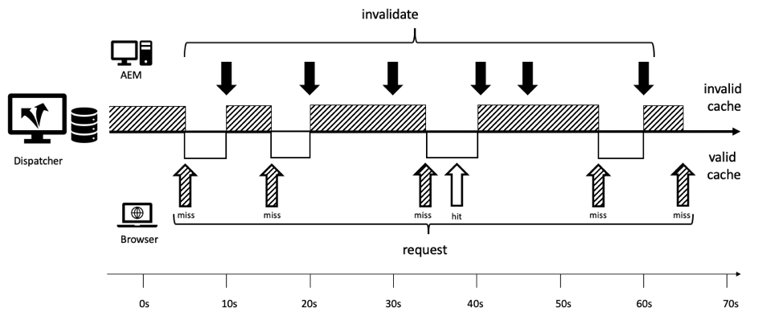

# Capítulo 1 - Conceptos, patrones y antipatrones de Dispatcher

## Información general

Este capítulo ofrece una breve introducción sobre el historial y la mecánica de Dispatcher y explica cómo esto influye en cómo un desarrollador de AEM diseñaría sus componentes.

## Por qué los desarrolladores deben preocuparse por la infraestructura

Dispatcher es una parte esencial de la mayoría, si no de todas las instalaciones de AEM. Puede encontrar muchos artículos en línea que describen cómo configurar Dispatcher, así como consejos y trucos.

Sin embargo, estos fragmentos de información siempre comienzan a un nivel muy técnico - suponiendo que ya sabe lo que desea hacer y, por lo tanto, solo proporciona detalles sobre cómo lograr lo que desea. Nunca hemos encontrado ningún documento conceptual que describa el _qué es y por qué es_ cuando se trata de lo que puede y no puede hacer con Dispatcher.

### Antipatrón: Dispatcher como un pensamiento alternativo

Esta falta de información básica lleva a una serie de anti-patrones que hemos visto en varios proyectos de AEM:

1. Como Dispatcher está instalado en el servidor web Apache, es el trabajo de los &quot;dioses Unix&quot; en el proyecto configurarlo. Un &quot;desarrollador de Java mortal&quot; no necesita preocuparse por ello.

2. El desarrollador de Java debe asegurarse de que este código funcione... más tarde, Dispatcher lo hará mágicamente rápido. El despachante siempre es una idea remota. Sin embargo, esto no funciona. Un desarrollador debe diseñar su código teniendo en cuenta a Dispatcher. Y necesita conocer sus conceptos básicos para hacerlo.

### &quot;Primero haga que funcione - luego hágalo rápido&quot; No siempre es correcto

Puede que haya escuchado el consejo de programación _&quot;Primero haga que funcione - luego hágalo rápido&quot;._. No está del todo mal. Sin embargo, sin el contexto adecuado, tiende a malinterpretarse y no aplicarse correctamente.

El consejo debe evitar que el desarrollador optimice el código de forma prematura, que puede que nunca se ejecute (o que se ejecute tan raramente) que una optimización no tendría un impacto suficiente para justificar el esfuerzo que se está realizando en la optimización. Además, la optimización podría llevar a un código más complejo y, por lo tanto, a la introducción de errores. Por lo tanto, si es desarrollador, no dedique demasiado tiempo a la microoptimización de cada línea de código. Asegúrese de elegir las estructuras de datos, los algoritmos y las bibliotecas adecuados y espere a que se realice un análisis del punto interactivo de un perfilador para ver dónde puede aumentar el rendimiento general una optimización más completa.

### Decisiones arquitectónicas y artefactos

Sin embargo, el consejo &quot;Primero haga que funcione - luego hágalo rápido&quot; está completamente equivocado cuando se trata de decisiones &quot;arquitectónicas&quot;. ¿Qué son las decisiones arquitectónicas? En pocas palabras, son las decisiones que son costosas, difíciles y/o imposibles de cambiar después. Tenga en cuenta que a veces &quot;costoso&quot; es lo mismo que &quot;imposible&quot;.  Por ejemplo, cuando el proyecto se queda sin presupuesto, es imposible implementar cambios costosos. Los cambios de infraestructura a son el primer tipo de cambios en esa categoría que vienen a la mente de la mayoría de la gente. Pero también hay otro tipo de artefactos &quot;arquitectónicos&quot; que pueden volverse muy desagradables para cambiar:

1. Fragmentos de código en el &quot;centro&quot; de una aplicación, en el que dependen muchas otras piezas. Si cambia estos valores, es necesario que todas las dependencias se cambien y vuelvan a probar a la vez.

2. Artefactos, que están involucrados en algún escenario asincrónico dependiente del tiempo donde la entrada - y por lo tanto el comportamiento del sistema puede variar muy aleatoriamente. Los cambios pueden tener efectos impredecibles y pueden ser difíciles de probar.

3. Patrones de software que se utilizan y reutilizan una y otra vez, en todas las piezas y partes del sistema. Si el patrón de software resulta ser subóptimo, es necesario volver a codificar todos los artefactos que utilizan el patrón.

Recordar? Sobre esta página dijimos que Dispatcher es una parte esencial de una aplicación AEM. El acceso a una aplicación web es muy aleatorio: los usuarios vienen y van en momentos impredecibles. Al final: todo el contenido se almacenará (o debe) en caché en Dispatcher. Por lo tanto, si prestamos mucha atención, es posible que se haya dado cuenta de que el almacenamiento en caché puede considerarse un artefacto &quot;arquitectónico&quot; y, por lo tanto, debe ser entendido por todos los miembros del equipo, desarrolladores y administradores por igual.

No estamos diciendo que un desarrollador deba configurar el Dispatcher. Necesitan conocer los conceptos (especialmente los límites) para asegurarse de que Dispatcher también pueda aprovechar su código.

Dispatcher no mejora mágicamente la velocidad del código. Un desarrollador debe crear sus componentes teniendo en cuenta Dispatcher. Por lo tanto, necesita saber cómo funciona.

## Almacenamiento en caché de Dispatcher: principios básicos

### Dispatcher como Http de Almacenamiento en Caché: Equilibrador de carga

¿Qué es Dispatcher y por qué se llama &quot;Dispatcher&quot; en primer lugar?

Dispatcher es

* Primero y principal es una caché

* Un proxy inverso

* Un módulo para el servidor web httpd de Apache, que añade funciones relacionadas con AEM a la versatilidad de Apache y funciona sin problemas junto con todos los demás módulos de Apache (como SSL o incluso SSI incluye como veremos más adelante)

En los primeros días de la web, se esperan algunos cientos de visitantes para un sitio. Una configuración de un Dispatcher, &quot;distribuido&quot; o equilibrada la carga de solicitudes a una serie de servidores de publicación de AEM y que normalmente era suficiente, por lo que el nombre &quot;Dispatcher&quot;. Sin embargo, en la actualidad, esta configuración ya no se utiliza con mucha frecuencia.

Más adelante en este artículo veremos diferentes formas de configurar los Dispatcher y los sistemas de publicación. Primero, empecemos con algunos conceptos básicos del almacenamiento en caché http.


*Funcionalidad básica de una caché de Dispatcher*

<br> 

Aquí se explican los conceptos básicos de Dispatcher. Dispatcher es un proxy inverso de almacenamiento en caché simple con la capacidad de recibir y crear solicitudes HTTP. Un ciclo normal de solicitud/respuesta es así:

1. Un usuario solicita una página
2. Dispatcher comprueba si ya tiene una versión representada de esa página. Supongamos que es la primera solicitud para esta página y que Dispatcher no puede encontrar una copia en caché local.
3. Dispatcher solicita la página desde el sistema de publicación
4. En el sistema de publicación, la página se representa mediante una plantilla JSP o HTL
5. La página se devuelve a Dispatcher
6. Dispatcher almacena en caché la página
7. Dispatcher devuelve la página al explorador
8. Si se solicita la misma página por segunda vez, se puede servir directamente desde la caché de Dispatcher sin necesidad de volver a procesarla en la instancia de publicación. Esto ahorra tiempo de espera para los ciclos de usuario y CPU en la instancia de publicación.

Hablábamos de &quot;páginas&quot; en la última sección. Pero el mismo esquema también se aplica a otros recursos, como imágenes, archivos CSS, descargas de PDF, etc.

#### Cómo se almacenan los datos en caché

El módulo de Dispatcher aprovecha las instalaciones que proporciona el servidor Apache de alojamiento. Recursos como páginas HTML, descargas e imágenes se almacenan como archivos simples en el sistema de archivos Apache. Es así de simple.

El nombre de archivo se deriva de la dirección URL del recurso solicitado. Si solicita un archivo `/foo/bar.html` se almacena, por ejemplo, en /`var/cache/docroot/foo/bar.html`.

En principio, si todos los archivos se almacenan en caché y, por lo tanto, se almacenan estáticamente en Dispatcher, puede extraer el complemento del sistema de publicación y Dispatcher serviría como un servidor web simple. Pero esto es solo para ilustrar el principio. La vida real es más complicada. No puede almacenar todo en caché y la caché nunca está completamente &quot;llena&quot;, ya que el número de recursos puede ser infinito debido a la naturaleza dinámica del proceso de renderización. El modelo de un sistema de archivos estático ayuda a generar una imagen aproximada de las capacidades de Dispatcher. Y ayuda a explicar las limitaciones de Dispatcher.

#### Estructura URL de AEM y asignación de sistemas de archivos

Para comprender Dispatcher con más detalle, volvamos a revisar la estructura de una URL de ejemplo simple.  Veamos el siguiente ejemplo,

`http://domain.com/path/to/resource/pagename.selectors.html/path/suffix.ext?parameter=value&amp;otherparameter=value#fragment`

* `http` denota el protocolo

* `domain.com` es el nombre de dominio

* `path/to/resource` es la ruta en la que se almacena el recurso en CRX y posteriormente en el sistema de archivos del servidor Apache

Desde aquí, las cosas difieren un poco entre el sistema de archivos AEM y el sistema de archivos Apache.

En AEM,

* `pagename` es la etiqueta de recursos

* `selectors` representa varios selectores utilizados en Sling para determinar cómo se representa el recurso. Una URL puede tener un número arbitrario de selectores. Están separados por un punto. Una sección de selectores podría ser, por ejemplo, algo así como &quot;french.mobile.sofisticated&quot;. Los selectores solo deben contener letras, dígitos y guiones.

* `html` como el último de los &quot;selectores&quot; se denomina extensión. En AEM/Sling también determina parcialmente el script de renderización.

* `path/suffix.ext` es una expresión similar a una ruta que puede ser un sufijo de la dirección URL.  Se puede utilizar en scripts de AEM para controlar aún más cómo se procesa un recurso. Más adelante tendremos una sección completa sobre esta parte. Por ahora, basta con saber que puede utilizarlo como parámetro adicional. Los sufijos deben tener una extensión.

* `?parameter=value&otherparameter=value` es la sección de consulta de la dirección URL. Se utiliza para pasar parámetros arbitrarios a AEM. Las direcciones URL con parámetros no se pueden almacenar en caché y, por lo tanto, los parámetros deben limitarse a los casos en los que sean absolutamente necesarios.

* `#fragment`, la parte de fragmento de una URL no se pasa a AEM; solo se utiliza en el explorador; en los marcos de JavaScript como &quot;parámetros de enrutamiento&quot; o para ir a una parte determinada de la página.

En Apache (*haga referencia al siguiente diagrama*),

* `pagename.selectors.html` se utiliza como nombre de archivo en el sistema de archivos de la caché.

Si la dirección URL tiene un sufijo `path/suffix.ext`, entonces,

* `pagename.selectors.html` se crea como una carpeta

* `path` una carpeta de la  `pagename.selectors.html` carpeta

* `suffix.ext` es un archivo de la  `path` carpeta . Nota: Si el sufijo no tiene una extensión, el archivo no se almacena en caché.


*Diseño del sistema de archivos después de obtener las direcciones URL de Dispatcher*

<br> 

#### Limitaciones básicas

La asignación entre una dirección URL, el recurso y el nombre de archivo es bastante sencilla.

Sin embargo, es posible que haya notado algunas trampas,

1. Las direcciones URL pueden llegar a ser muy largas. Añadir la porción &quot;path&quot; de un `/docroot` en el sistema de archivos local podría exceder fácilmente los límites de algunos sistemas de archivos. Ejecutar Dispatcher en NTFS en Windows puede ser un desafío. Sin embargo, está a salvo con Linux.

2. Las direcciones URL pueden contener caracteres especiales y diéresis. Esto no suele ser un problema para Dispatcher. No obstante, tenga en cuenta que la URL se interpreta en muchos lugares de la aplicación. La mayoría de las veces, hemos visto comportamientos extraños de una aplicación, solo para averiguar que una parte del código (personalizado) raramente utilizado no se ha probado a fondo para buscar caracteres especiales. Deberías evitarlas si puedes. Y si no puedes, planea realizar pruebas exhaustivas.

3. En CRX, los recursos tienen subrecursos. Por ejemplo, una página tendrá un número de páginas secundarias. Esto no se puede hacer coincidir en un sistema de archivos, ya que los sistemas de archivos tienen archivos o carpetas.

#### Las direcciones URL sin extensión no se almacenan en caché

Las direcciones URL siempre deben tener una extensión. Aunque puede ofrecer direcciones URL sin extensiones en AEM. Estas direcciones URL no se almacenarán en caché en Dispatcher.

**Ejemplos**

`http://domain.com/home.html` es  **almacenable en caché**

`http://domain.com/home` no  **se puede almacenar en caché**

La misma regla se aplica cuando la dirección URL contiene un sufijo. El sufijo debe tener una extensión para que se pueda almacenar en caché.

**Ejemplos**

`http://domain.com/home.html/path/suffix.html` es  **almacenable en caché**

`http://domain.com/home.html/path/suffix` no  **se puede almacenar en caché**

Podría preguntarse, ¿qué sucede si la parte de recurso no tiene extensión, pero el sufijo tiene una? Bueno, en este caso la URL no tiene ningún sufijo. Observe el siguiente ejemplo:

**Ejemplo**

`http://domain.com/home/path/suffix.ext`

El `/home/path/suffix` es la ruta al recurso... por lo que no hay sufijo en la dirección URL.

**Conclusión**

Agregue siempre extensiones a la ruta y al sufijo . Las personas con conocimiento de SEO a veces argumentan que esto te clasifica en los resultados de búsqueda. Pero una página sin caché sería muy lenta y se clasificaría aún más.

#### Direcciones URL de sufijo en conflicto

Tenga en cuenta que tiene dos direcciones URL válidas

`http://domain.com/home.html`

y

`http://domain.com/home.html/suffix.html`

Son absolutamente válidos en AEM. No vería ningún problema en su equipo de desarrollo local (sin Dispatcher). Lo más probable es que tampoco encuentre ningún problema en las pruebas de carga o UAT. El problema que enfrentamos es tan sutil que pasa por la mayoría de las pruebas.  Le afectará duro cuando esté en tiempo punta y estará limitado a tiempo para solucionarlo, probablemente no tenga acceso al servidor ni recursos para solucionarlo. Hemos estado allí...

Entonces... ¿cuál es el problema?

`home.html` en un sistema de archivos puede ser un archivo o una carpeta. No ambos al mismo tiempo que en AEM.

Si primero solicita `home.html`, se creará como archivo.

Las solicitudes posteriores a `home.html/suffix.html` devuelven resultados válidos, pero como el archivo `home.html` &quot;bloquea&quot; la posición en el sistema de archivos, `home.html` no se puede crear por segunda vez como una carpeta y, por lo tanto, `home.html/suffix.html` no se almacena en caché.


*Posición de bloqueo de archivos en el sistema de archivos que impide que los subrecursos se almacenen en caché*

<br> 

Si lo hace al revés, primero solicita `home.html/suffix.html` y luego `suffix.html` se almacena en caché en una carpeta `/home.html` al principio. Sin embargo, esta carpeta se elimina y se reemplaza por un archivo `home.html` cuando posteriormente solicita `home.html` como recurso.


*Eliminación de una estructura de ruta cuando se busca un elemento principal como recurso*

<br> 

Por lo tanto, el resultado de lo que se almacena en caché es completamente aleatorio y depende del orden de las solicitudes entrantes. Lo que hace que las cosas sean aún más complicadas es el hecho de que normalmente tiene más de un distribuidor. Y el rendimiento, la tasa de visitas y el comportamiento de la caché pueden variar de un Dispatcher a otro. Si desea saber por qué su sitio web no responde, debe estar seguro de que está viendo el Dispatcher correcto con el desafortunado orden de almacenamiento en caché. Si está mirando el Dispatcher que - por suerte - tuvo un patrón de solicitud más favorable, se perderá al intentar encontrar el problema.

#### Evitar URL en conflicto

Puede evitar &quot;URL en conflicto&quot;, donde un nombre de carpeta y un nombre de archivo &quot;compiten&quot; por la misma ruta en el sistema de archivos, cuando utiliza una extensión diferente para el recurso cuando tiene un sufijo.

**Ejemplo**

* `http://domain.com/home.html`

* `http://domain.com/home.dir/suffix.html`

Ambas son perfectamente almacenables en caché,


Elegir una extensión dedicada &quot;dir&quot; para un recurso cuando se solicita un sufijo o se evita usar el sufijo por completo. Hay casos raros en los que son útiles. Y es fácil implementar correctamente estos casos.  Como veremos en el siguiente capítulo cuando hablamos de invalidación y vaciado de caché.

#### Solicitudes no almacenables en caché

Revisemos un breve resumen del último capítulo más algunas excepciones. Dispatcher puede almacenar en caché una dirección URL si está configurada como caché y si es una solicitud GET. No se puede almacenar en caché en una de las siguientes excepciones.

**Solicitudes almacenables en caché**

* La solicitud está configurada para almacenarse en caché en la configuración de Dispatcher
* La solicitud es una solicitud GET sin formato

**Solicitudes o respuestas no almacenables en caché**

* Solicitud a la que se niega el almacenamiento en caché por configuración (Ruta, Patrón, Tipo MIME)
* Respuestas que devuelven un &quot;Dispatcher: encabezado &quot;no-cache&quot;
* Respuesta que devuelve un &quot;Cache-Control: encabezado no-cache|private&quot;
* Respuesta que devuelve un valor &quot;Pragma: encabezado &quot;no-cache&quot;
* Solicitud con parámetros de consulta
* URL sin extensión
* URL con un sufijo que no tiene una extensión
* Respuesta que devuelve un código de estado distinto de 200
* Solicitud POST

## Invalidar y vaciar la caché

### Información general

El último capítulo enumeraba un gran número de excepciones, cuando Dispatcher no puede almacenar en caché una solicitud. Pero hay más cosas que considerar: Solo porque Dispatcher _puede_ almacenar en caché una solicitud, no significa necesariamente que _deba_.

El punto es: El almacenamiento en caché generalmente es fácil. Dispatcher solo necesita almacenar el resultado de una respuesta y devolverlo la próxima vez que se reciba la misma solicitud. Derecha? ¡Incorrecto!

La parte difícil es el _invalidación_ o _vaciado_ de la caché. Dispatcher debe averiguarlo cuando un recurso ha cambiado y debe volver a procesarse.

Esto parece ser una tarea trivial a primera vista... pero no lo es. Lea más y encontrará algunas diferencias complicadas entre los recursos simples y los simples y las páginas que dependen de una estructura muy maltrecha de varios recursos.

### Recursos simples y vaciado

Hemos configurado nuestro sistema AEM para crear dinámicamente una representación en miniatura para cada imagen cuando se solicita con un selector especial de &quot;pulgar&quot;:

`/content/dam/path/to/image.thumb.png`

Y - por supuesto - proporcionamos una URL para servir la imagen original con una URL sin selector:

`/content/dam/path/to/image.png`

Si descargamos ambas, la miniatura y la imagen original, terminaremos con algo como,

```
/var/cache/dispatcher/docroot/content/dam/path/to/image.thumb.png

/var/cache/dispatcher/docroot/content/dam/path/to/image.png
```

en el sistema de archivos de Dispatcher.

Ahora, el usuario carga y activa una nueva versión de ese archivo. En última instancia, se envía una solicitud de invalidación de AEM a Dispatcher.

```
GET /invalidate
invalidate-path:  /content/dam/path/to/image

<no body>
```

La invalidación es tan fácil: Una simple solicitud GET a una URL especial &quot;/invalidate&quot; en Dispatcher. No se requiere un cuerpo HTTP, la &quot;carga útil&quot; es solo el encabezado &quot;ruta de acceso no válida&quot;. Tenga en cuenta también que la ruta de invalidación del encabezado es el recurso que AEM conoce, y no el archivo o archivos que Dispatcher ha almacenado en caché. AEM solo conoce los recursos. Las extensiones, selectores y sufijos se utilizan durante la ejecución cuando se solicita un recurso. AEM no realiza ninguna contabilidad sobre los selectores que se han utilizado en un recurso, por lo que la ruta del recurso es todo lo que sabe con seguridad al activar un recurso.

Esto es suficiente en nuestro caso. Si un recurso ha cambiado, podemos suponer con seguridad que todas las representaciones de ese recurso también han cambiado. En nuestro ejemplo, si la imagen ha cambiado, también se representará una nueva miniatura.

Dispatcher puede eliminar de forma segura el recurso con todas las representaciones que haya almacenado en caché. Hará algo como,

`$ rm /content/dam/path/to/image.*`

quitar `image.png` y `image.thumb.png` y todas las demás representaciones que coincidan con ese patrón.

Supersimple, de hecho... siempre y cuando utilice un solo recurso para responder a una solicitud.

### Referencias y contenido enviado a la red

#### El problema de contenido medido

A diferencia de las imágenes u otros archivos binarios cargados en AEM, las páginas HTML no son animales solitarios. Viven en manadas y están altamente interconectadas entre sí por hipervínculos y referencias. El enlace simple es inofensivo, pero se vuelve complicado cuando hablamos de referencias de contenido. La ubicua navegación superior o los teasers de las páginas son referencias de contenido.

#### Referencias de contenido y por qué son un problema

Veamos un ejemplo sencillo. Una agencia de viajes tiene una página web que promueve un viaje a Canadá. Esta promoción se incluye en la sección teaser de otras dos páginas, en la página &quot;Inicio&quot; y en la página &quot;Ofertas especiales de invierno&quot;.

Dado que ambas páginas muestran el mismo teaser, sería innecesario pedir al autor que cree el teaser varias veces para cada página en la que debería mostrarse. En su lugar, la página de destino &quot;Canadá&quot; reserva una sección de las propiedades de la página para proporcionar la información para el teaser, o mejor para proporcionar una URL que muestre ese teaser por completo:

`<sling:include resource="/content/home/destinations/canada" addSelectors="teaser" />`

o

`<sling:include resource="/content/home/destinations/canada/jcr:content/teaser" />`


En AEM solo funciona como un encanto, pero si utiliza un Dispatcher en la instancia de publicación, sucede algo extraño.

Imaginen, han publicado su sitio web. El título de la página de Canadá es &quot;Canadá&quot;. Cuando un visitante solicita su página principal (que tiene una referencia de teaser a esa página), el componente de la página &quot;Canadá&quot; se muestra de la siguiente manera:

```
<div class="teaser">
  <h3>Canada</h3>
  
</div>
```

** en la página principal. Dispatcher almacena la página principal como un archivo .html estático, que incluye el teaser y su titular en el archivo .

Ahora el especialista en marketing ha aprendido que los titulares de teaser deben ser procesables. Así que decide cambiar el título de &quot;Canadá&quot; a &quot;Visita Canadá&quot;, y actualiza la imagen también.

Publica la página editada &quot;Canadá&quot; y vuelve a visitar la página de inicio publicada anteriormente para ver sus cambios. Pero... nada cambió ahí. Sigue mostrando el teaser antiguo. Él verifica dos veces el &quot;especial de invierno&quot;. Esa página nunca se había solicitado antes y, por lo tanto, no se almacena en caché de forma estática en Dispatcher. Por lo tanto, esta página se procesa recientemente en Publish y ahora contiene el nuevo teaser &quot;Visit Canada&quot;.


*Dispatcher almacena contenido incluido obsoleto en la página principal*

<br> 

¿Qué pasó? Dispatcher almacena una versión estática de una página que contiene todo el contenido y las marcas que se han extraído de otros recursos durante el procesamiento.

Dispatcher, siendo un simple servidor web basado en filesystem, es rápido pero también relativamente simple. Si un recurso incluido cambia, no se da cuenta de eso. Todavía se aferra al contenido que estaba allí cuando se procesó la página de inclusión.

La página &quot;Oferta especial de invierno&quot; aún no se ha procesado, por lo que no hay ninguna versión estática en Dispatcher y, por lo tanto, se mostrará con el nuevo teaser, ya que se procesará recién cuando se solicite.

Podría pensar que Dispatcher mantendría un seguimiento de cada recurso que toca mientras procesa y vacía todas las páginas que han usado este recurso, cuando ese recurso cambia. Pero Dispatcher no procesa las páginas. La renderización se realiza mediante el sistema de publicación. Dispatcher no sabe qué recursos van a un archivo .html procesado.

¿Todavía no está convencido? Puede pensar *&quot;debe haber una forma de implementar algún tipo de seguimiento de dependencias&quot;*. Bueno, existe, o más exactamente ahí *era*. Communiqué 3 el tatarabuelo de AEM tenía un rastreador de dependencias implementado en la _sesión_ que se utilizó para procesar una página.

Durante una solicitud, cada recurso adquirido mediante esta sesión se seguía como una dependencia de la URL que se estaba procesando actualmente.

Pero resultó que llevar un registro de las dependencias era muy caro. Pronto, la gente descubrió que el sitio web era más rápido si desactivaban por completo la función de seguimiento de dependencias y dependían de volver a procesar todas las páginas html después de cambiar una página html. Además, ese esquema tampoco era perfecto: había una serie de inconvenientes y excepciones en el camino. En algunos casos, no utilizaba la sesión predeterminada de solicitudes para obtener un recurso, sino una sesión de administrador para obtener algunos recursos de ayuda para procesar una solicitud. Por lo general, esas dependencias no se rastreaban y provocaban problemas de cabeza y llamadas telefónicas al equipo de operaciones que solicitaban vaciar manualmente la caché. Tuviste suerte si tenían un procedimiento estándar para hacerlo. Había más problemas en el camino pero... dejemos de recordar. Esto se remonta a 2005. En última instancia, esa función fue desactivada en Communiqué 4 de forma predeterminada y no volvió a entrar en el sucesor CQ5 que luego se convirtió en AEM.

### Invalidación automática

#### Cuando El Vaciado Completo Es Más Barato Que El Seguimiento De Dependencias

Desde CQ5 confiamos completamente en invalidar, más o menos, todo el sitio si solo cambia una de las páginas. Esta función se denomina &quot;Invalidación automática&quot;.

Pero de nuevo - ¿cómo puede ser, que tirar y renderizar cientos de páginas es más barato que hacer un seguimiento de dependencia adecuado y una renderización parcial?

Hay dos razones principales:

1. En un sitio web promedio, solo se solicita con frecuencia un pequeño subconjunto de las páginas. Por lo tanto, incluso si se elimina todo el contenido procesado, solo unas pocas docenas se solicitarán inmediatamente después. La renderización de la larga cola de páginas se puede distribuir a lo largo del tiempo, cuando realmente se solicitan. Por lo tanto, la carga en las páginas de renderización no es tan alta como cabría esperar. Por supuesto, siempre hay excepciones... discutiremos algunos trucos sobre cómo manejar carga distribuida de manera equitativa en sitios web más grandes con cachés vacías de Dispatcher, más tarde.

2. De todas formas, todas las páginas están conectadas por la navegación principal. Así que casi todas las páginas dependen unas de otras. Esto significa que incluso el rastreador de dependencias más inteligente descubrirá lo que ya sabemos: Si cambia una de las páginas, debe invalidar todas las demás.

¿No crees? Vamos a ilustrar el último punto.

Se utiliza el mismo argumento que en el último ejemplo con teasers que hacen referencia al contenido de una página remota. Solo ahora, se está utilizando un ejemplo más extremo: Un sistema de navegación principal procesado automáticamente. Al igual que con el teaser, el título de navegación se extrae de la página vinculada o &quot;remota&quot; como referencia de contenido. Los títulos de navegación remota no se almacenan en la página representada actualmente. Recuerde que la navegación se representa en todas y cada una de las páginas del sitio web. Por lo tanto, el título de una página se utiliza una y otra vez en todas las páginas que tienen una navegación principal. Y si desea cambiar un título de navegación, lo desea hacer solo una vez en la página remota, no en todas las páginas que hacen referencia a la página.

Por lo tanto, en nuestro ejemplo, la navegación combina todas las páginas mediante el uso del &quot;título de navegación&quot; de la página de destino para representar un nombre en la navegación. El título de navegación para &quot;Islandia&quot; se extrae de la página &quot;Islandia&quot; y se procesa en todas y cada una de las páginas que tienen una navegación principal.


*La navegación principal inevitablemente combina el contenido de todas las páginas al extraer sus &quot;títulos de navegación&quot;*

<br> 

Si cambia el título de navegación en la página de Islandia de &quot;Islandia&quot; a &quot;Hermosa Islandia&quot;, ese título cambia inmediatamente en el menú principal de todas las demás páginas. Por lo tanto, las páginas procesadas y almacenadas en caché antes de ese cambio, se vuelven obsoletas y deben invalidarse.

#### Implementación de la invalidación automática: El archivo .stat

Ahora, si tiene un sitio grande con miles de páginas, tardaría bastante tiempo en recorrerlas y eliminarlas físicamente. Durante ese periodo, Dispatcher podría servir contenido obsoleto de forma involuntaria. Peor aún, podrían producirse algunos conflictos al acceder a los archivos de caché, es posible que se solicite una página mientras se elimina o que se elimine de nuevo una página debido a una segunda invalidación que se produjo después de una activación posterior inmediata. Consideremos qué desastre sería. Afortunadamente esto no es lo que pasa. Dispatcher utiliza un truco inteligente para evitar que: En lugar de borrar cientos y miles de archivos, coloca un archivo simple y vacío en la raíz del sistema de archivos cuando se publica un archivo y, por lo tanto, todos los archivos dependientes se consideran no válidos. Este archivo se denomina &quot;archivo de estado&quot;. El archivo de estado es un archivo vacío; lo que importa del archivo de estado es su fecha de creación, solamente.

Todos los archivos del despachante, que tienen una fecha de creación anterior al archivo de estado, se han procesado antes de la última activación (e invalidación) y, por lo tanto, se consideran &quot;no válidos&quot;. Todavía están físicamente presentes en el sistema de archivos, pero Dispatcher los ignora. Son &quot;antiguos&quot;. Siempre que se realiza una solicitud a un recurso obsoleto, Dispatcher solicita al sistema AEM que vuelva a procesar la página. Esa página renderizada entonces se almacena en el sistema de archivos - ahora con una nueva fecha de creación y es nueva de nuevo.


*La fecha de creación del archivo .stat define qué contenido está obsoleto y cuál es nuevo*

<br> 

¿Puede preguntar por qué se llama &quot;.stat&quot;? ¿Y no tal vez &quot;.invalidado&quot;? Bueno, puede imaginarse, tener ese archivo en su sistema de archivos ayuda a Dispatcher a determinar qué recursos podrían *estáticamente* servirse, al igual que con un servidor web estático. Estos archivos ya no necesitan procesarse dinámicamente.

Sin embargo, la verdadera naturaleza del nombre es menos metafórica. Se deriva de la llamada del sistema Unix `stat()`, que devuelve el tiempo de modificación de un archivo (entre otras propiedades).

#### Combinación de validación simple y automática

Pero esperen... antes de decir que los recursos individuales son borrados físicamente. Ahora decimos que un archivo de estado más reciente virtualmente los volvería inválidos a los ojos de Dispatcher. ¿Por qué entonces la eliminación física, primero?

La respuesta es simple. Normalmente se utilizan ambas estrategias en paralelo, pero para diferentes tipos de recursos. Los recursos binarios, como las imágenes, son independientes. No están conectados a otros recursos en el sentido de que necesitan que se procese su información.

Por otro lado, las páginas HTML son altamente interdependientes. Por lo tanto, aplicaría la invalidación automática en esos. Esta es la configuración predeterminada de Dispatcher. Todos los archivos pertenecientes a un recurso no válido se eliminan físicamente. Además, los archivos que terminan con &quot;.html&quot; se invalidan automáticamente.

Dispatcher decide sobre la extensión de archivo, si se aplica o no el esquema de invalidación automática.

Los extremos de archivo para la invalidación automática se pueden configurar. En teoría, puede incluir todas las extensiones para la invalidación automática. Pero tengan en cuenta que esto tiene un precio muy alto. No verá recursos antiguos entregados de forma no intencionada, pero el rendimiento de la entrega se degrada enormemente debido a una invalidación excesiva.

Imagine, por ejemplo, que implementa un esquema en el que los PNG y JPG se procesan de forma dinámica y dependen de otros recursos para hacerlo. Es posible que desee volver a escalar las imágenes de alta resolución a una resolución compatible con web más pequeña. Mientras esté en él, también cambiará la velocidad de compresión. La resolución y la tasa de compresión en este ejemplo no son constantes fijas, sino parámetros configurables en el componente que utiliza la imagen. Ahora, si se cambia este parámetro, es necesario invalidar las imágenes.

No hay problema - acabamos de aprender que podemos añadir imágenes a la invalidación automática y siempre tener imágenes recién procesadas cada vez que algo cambia.

#### Expulsando al bebé con el agua de baño

Es cierto - y ese es un problema enorme. Vuelva a leer el último párrafo. &quot;...imágenes recién procesadas cada vez que cambia algo.&quot; Como saben, un buen sitio web cambia constantemente; añadir contenido nuevo aquí, corregir un error tipográfico, modificar un teaser en otro lugar. Esto significa que todas las imágenes se invalidan constantemente y deben reprocesarse. No subestimes eso. La representación y transferencia dinámicas de datos de imagen funciona en milisegundos en el equipo de desarrollo local. Su entorno de producción debe hacerlo cien veces más a menudo, por segundo.

Y seamos claros aquí, sus jpgs necesitan ser reprocesados, cuando una página html cambia y viceversa. Solo hay un &quot;bloque&quot; de archivos que se van a invalidar automáticamente. Se limpia como un todo. Sin ningún medio de desglosar en estructuras más detalladas.

Existe una buena razón para que la invalidación automática se mantenga en &quot;.html&quot; de forma predeterminada. El objetivo es mantener ese cubo lo más pequeño posible. No tires al bebé con el agua de baño simplemente invalidando todo - sólo para estar en el lado seguro.

Los recursos autocontenidos deben servirse en la ruta de ese recurso. Eso ayuda mucho a la invalidación. Sea sencillo, no cree esquemas de asignación como &quot;resource /a/b/c&quot; se suministra desde &quot;/x/y/z&quot;. Haga que sus componentes funcionen con la configuración de invalidación automática de Dispatcher predeterminada. No intente reparar un componente mal diseñado con invalidación excesiva en Dispatcher.

##### Excepciones a la invalidación automática: Invalidación de ResourceOnly

La solicitud de invalidación para Dispatcher generalmente se activa desde los sistemas de publicación por un agente de replicación.

Si tiene una gran confianza en sus dependencias, puede intentar crear su propio agente de replicación que invalide.

Sería un poco más allá de esta guía entrar en los detalles, pero queremos darles al menos algunas sugerencias.

1. De verdad sé lo que estás haciendo. Es muy difícil corregir la invalidación. Esa es una de las razones por las que la invalidación automática es tan rigurosa; para evitar la entrega de contenido obsoleto.

2. Si su agente envía un encabezado HTTP `CQ-Action-Scope: ResourceOnly`, significa que esta única solicitud de invalidación no activa una invalidación automática. Este fragmento de código ( [https://github.com/cqsupport/webinar-dispatchercache/tree/master/src/refetching-flush-agent/refetch-bundle](https://github.com/cqsupport/webinar-dispatchercache/tree/master/src/refetching-flush-agent/refetch-bundle)) puede ser un buen punto de partida para su propio agente de replicación.

3. `ResourceOnly`, solo evita la invalidación automática. Para hacer realmente la resolución y las invalidaciones de dependencia necesarias, debe activar las solicitudes de invalidación usted mismo. Puede que desee comprobar las reglas de vaciado del paquete de Dispatcher ([https://adobe-consulting-services.github.io/acs-aem-commons/features/dispatcher-flush-rules/index.html](https://adobe-consulting-services.github.io/acs-aem-commons/features/dispatcher-flush-rules/index.html)) para obtener información sobre cómo podría ocurrir esto.

No se recomienda crear un esquema de resolución de dependencias. Hay demasiado esfuerzo y poco beneficio -y como se dijo antes, hay demasiado que te equivoques.

Lo que debe hacer es averiguar qué recursos no tienen dependencias con otros recursos y pueden invalidarse sin invalidación automática. Sin embargo, no tiene que usar un agente de replicación personalizado para ese caso. Simplemente cree una regla personalizada en la configuración de Dispatcher que excluya estos recursos de la invalidación automática.

Hemos dicho que la navegación principal o los teasers son una fuente para las dependencias. Bueno - si carga la navegación y los teasers asincrónicamente o los incluye con un script SSI en Apache, no tendrá esa dependencia para rastrear. Más adelante en este documento explicaremos la carga asíncrona de componentes cuando hablemos de &quot;Sling Dynamic Includes&quot;.

Lo mismo se aplica a las ventanas emergentes o al contenido que se carga en un lightbox. Estas piezas también rara vez tienen navegaciones (es decir, &quot;dependencias&quot;) y se pueden invalidar como un solo recurso.

## Crear componentes teniendo en cuenta Dispatcher

### Ejemplo de aplicación del mecanismo de Dispatcher en un mundo real

En el último capítulo explicamos cómo funciona la mecánica básica de Dispatcher, cómo funciona en general y cuáles son las limitaciones.

Ahora queremos aplicar estos mecanismos a un tipo de componentes que probablemente encontrará en los requisitos de su proyecto. Seleccionamos el componente deliberadamente para mostrar los problemas que también enfrentará tarde o temprano. No temas - no todos los componentes necesitan esa cantidad de consideración que presentaremos. Pero si ve la necesidad de construir un componente de este tipo, es muy consciente de las consecuencias y sabe cómo manejarlas.

### Patrón del componente de Spooling (Anti)

#### El componente de imagen adaptable

Ilustremos un patrón común (o anti-patrón) de un componente con binarios interconectados. Crearemos un componente &quot;respi&quot; para &quot;responsive-image&quot;. Este componente debería poder adaptar la imagen mostrada al dispositivo en el que se muestra. En escritorios y tabletas muestra la resolución completa de la imagen, en teléfonos una versión más pequeña con un recorte estrecho - o incluso un motivo completamente diferente (esto se llama &quot;dirección de arte&quot; en el mundo interactivo).

Los recursos se cargan en el área DAM de AEM y solo _se hace referencia_ en el componente de imagen interactiva.

El respi-component se encarga de procesar el marcado y de enviar los datos de imagen binarios.

La forma en que lo implementamos aquí es un patrón común que hemos visto en muchos proyectos e incluso uno de los componentes principales de AEM se basa en ese patrón. Por lo tanto, es muy probable que usted como desarrollador pueda adaptar ese patrón. Tiene sus puntos fuertes en términos de encapsulación, pero requiere mucho esfuerzo para prepararlo para Dispatcher. Discutiremos varias opciones sobre cómo mitigar el problema más adelante.

Llamamos al patrón usado aquí el &quot;Patrón de Spooler&quot;, porque el problema se remonta a los primeros días del Communiqué 3, donde había un método &quot;bobina&quot; al que se podía llamar en un recurso para transmitir sus datos binarios sin procesar a la respuesta.

El término original &quot;spooling&quot; hace referencia a periféricos sin conexión lentos compartidos, como impresoras, por lo que no se aplica correctamente aquí. Pero nos gusta el término de todos modos porque es raramente en el mundo en línea tan distinguible. Y cada patrón debería tener un nombre distinguible de todos modos, ¿verdad? Depende de ustedes decidir si es un patrón o un anti-patrón.

#### Implementación

Así es como se implementa nuestro componente de imagen interactiva:

El componente consta de dos partes: la primera parte representa el marcado HTML de la imagen, la segunda parte &quot;estropea&quot; los datos binarios de la imagen a la que se hace referencia. Como se trata de un sitio web moderno con un diseño interactivo, no se está procesando una etiqueta `` simple, sino un conjunto de imágenes en la etiqueta `<picture/>`. Para cada dispositivo, cargamos dos imágenes diferentes en DAM y las hacemos referencia desde nuestro componente de imagen.

El componente tiene tres secuencias de comandos de renderización (implementadas en JSP, HTL o como servlet), cada una de las cuales se aborda con un selector dedicado:

1. `/respi.jsp` - sin selector para representar el marcado HTML
2. `/respi.img.java` para procesar la versión de escritorio
3. `/respi.img.mobile.java` para procesar la versión móvil.


El componente se coloca en el parsys de la página principal. La estructura resultante en el CRX se ilustra a continuación.


*Estructura de recursos de la imagen interactiva en el CRX*

<br> 

El marcado de los componentes se representa de esta manera,

```plain
  #GET /content/home.html

  <html>

  …

  <div class="responsive-image>

  <picture>
    <source src="/content/home/jcr:content/par/respi.img.mobile.jpg" …/>
    <source src="/content/home/jcr:content/par/respi.img.jpg …/>

    …

  </picture>
  </div>
  …
```

y... hemos terminado con nuestro componente bien encapsulado.

#### Componente de imagen adaptable en acción

Ahora un usuario solicita la página y los recursos a través de Dispatcher. Esto resulta en archivos en el sistema de archivos de Dispatcher como se ilustra a continuación,


*Estructura en caché del componente de imagen interactiva encapsulada*

<br> 

Considere que un usuario carga y activa una nueva versión de las dos imágenes de flores en DAM. AEM enviará la solicitud de invalidación correspondiente a

`/content/dam/flower.jpg`

y

`/content/dam/flower-mobile.jpg`

a Dispatcher. Sin embargo, estas solicitudes son en vano. El contenido se ha almacenado en caché como archivos debajo de la subestructura del componente. Estos archivos ahora están obsoletos, pero aún se sirven cuando se solicitan.


*La falta de coincidencia de la estructura lleva al contenido obsoleto*

<br> 

Hay otra advertencia en este enfoque. Considere que utiliza la misma flor.jpg en varias páginas. A continuación, tendrá el mismo recurso almacenado en caché en varias direcciones URL o archivos,

```
/content/home/products/jcr:content/par/respi.img.jpg

/content/home/offers/jcr:content/par/respi.img.jpg

/content/home/specials/jcr:content/par/respi.img.jpg

…
```

Cada vez que se solicita una página nueva y no almacenada en caché, los recursos se recuperan de AEM en direcciones URL diferentes. Ningún almacenamiento en caché de Dispatcher ni ningún almacenamiento en caché del explorador pueden acelerar el envío.

#### Lugar en el que brilla el patrón del radiador

Hay una excepción natural, en la que este patrón, incluso en su forma sencilla, resulta útil: Si el binario se almacena en el componente en sí y no en el DAM. Sin embargo, esto solo es útil para imágenes utilizadas una vez en el sitio web, y no almacenar recursos en DAM significa que es difícil administrar los recursos. Imagine que se acaba la licencia de uso de un recurso en particular. ¿Cómo puede saber qué componentes ha utilizado el recurso?

¿Ves? La &quot;M&quot; en DAM significa &quot;Gestión&quot;, como en la gestión de activos digitales. No quieres regalar esa función.

#### Conclusión

Desde la perspectiva de un desarrollador de AEM, el patrón parecía super elegante. Pero con Dispatcher tomado en la ecuación, puede estar de acuerdo, que el enfoque ingenuo podría no ser suficiente.

Les dejamos que decidan si este es un patrón o un anti-patrón por ahora. ¿Y tal vez ya tienen algunas buenas ideas en mente sobre cómo mitigar los problemas explicados arriba? Bien. Entonces estará ansioso por ver cómo otros proyectos han resuelto estos problemas.

### Solución de problemas comunes de Dispatcher

#### Información general

Hablemos de cómo podría haberse implementado un poco más fácil de almacenar en caché. Hay varias opciones. A veces no se puede elegir la mejor solución. Tal vez te encuentres en un proyecto que ya está en ejecución y tienes un presupuesto limitado para arreglar el &quot;problema de la caché&quot; y no suficiente para hacer una refactorización completa. O se enfrenta a un problema, que es más complejo que el componente de imagen de ejemplo.

En las secciones siguientes se esbozarán los principios y las advertencias.

De nuevo, esto se basa en la experiencia de la vida real. Ya hemos visto todos esos patrones en la naturaleza salvaje así que no es un ejercicio académico. Por eso les mostramos algunos anti-patrones, así que tienen la oportunidad de aprender de los errores que otros ya han cometido.

#### Asesoría de caché

>[!WARNING]
>
>Esto es un anti-patrón. No lo use. Nunca.

¿Alguna vez ha visto parámetros de consulta como `?ck=398547283745`? Se llaman asesinos de caché (&quot;ck&quot;). La idea es que, si agrega cualquier parámetro de consulta, el recurso no se almacene en caché. Además, si agrega un número aleatorio como valor del parámetro (como &quot;398547283745&quot;), la URL se vuelve única y se asegura de que ninguna otra caché entre el sistema AEM y la pantalla puede almacenar en caché. Los sospechosos habituales entre ellos serían una caché &quot;Varnish&quot; frente a Dispatcher, una CDN o incluso la caché del navegador. De nuevo: No hagas eso. Desea que los recursos se almacenen en caché en la mayor cantidad posible. La caché es tu amigo. No maten amigos.

#### Invalidación automática

>[!WARNING]
>
>Esto es un anti-patrón. Evite utilizarla para recursos digitales. Intente mantener la configuración predeterminada de Dispatcher, que > es invalidación automática solo para archivos &quot;.html&quot;

A corto plazo, puede agregar &quot;.jpg&quot; y &quot;.png&quot; a la configuración de invalidación automática en Dispatcher. Esto significa que, cada vez que se produce una invalidación, es necesario volver a procesar todos los archivos &quot;.jpg&quot;, &quot;.png&quot; y &quot;.html&quot;.

Este patrón es súper fácil de implementar si los propietarios de negocios se quejan de no ver que sus cambios se materialicen en el sitio activo lo suficientemente rápido. Pero esto sólo puede darle tiempo para encontrar una solución más sofisticada.

Asegúrese de comprender los vastos impactos de rendimiento. Esto ralentizará el sitio web significativamente y podría incluso afectar a la estabilidad - si el sitio es un sitio web de alta carga con cambios frecuentes - como un portal de noticias.

#### Huella digital de URL

La huella de una dirección URL parece un asesino en caché. Pero no lo es. No es un número aleatorio, sino un valor que caracteriza el contenido del recurso. Puede ser un hash del contenido del recurso o, lo que es más sencillo, una marca de tiempo cuando el recurso se cargó, editó o actualizó.

Una marca de tiempo Unix es lo suficientemente buena como para una implementación real. Para mejorar la legibilidad utilizamos un formato más legible en este tutorial: `2018 31.12 23:59 or fp-2018-31-12-23-59`.

La huella digital no debe utilizarse como parámetro de consulta, como direcciones URL con parámetros de consulta   no se puede almacenar en caché. Puede utilizar un selector o el sufijo para la huella digital.

Supongamos que el archivo `/content/dam/flower.jpg` tiene una `jcr:lastModified` fecha del 31 de diciembre de 2018, 23:59. La dirección URL con la huella digital es `/content/home/jcr:content/par/respi.fp-2018-31-12-23-59.jpg`.

Esta dirección URL permanece estable, siempre y cuando el archivo de recurso al que se hace referencia (`flower.jpg`) no se cambie. Así que se puede almacenar en caché durante una cantidad indefinida de tiempo y no es un asesino en caché.

Tenga en cuenta que el componente de imagen interactiva debe crear y servir esta URL. No es una funcionalidad AEM lista para usar.

Ese es el concepto básico. Sin embargo, hay algunos detalles que pueden pasarse por alto fácilmente.

En nuestro ejemplo, el componente se procesó y se almacenó en caché a las 23:59. Ahora la imagen ha cambiado digamos a las 00:00.  El componente _generaría_ una nueva URL con huella digital en su marcado.

Puede pensar que _debería_... pero no lo hace. Como solo se ha cambiado el binario de la imagen y no se ha tocado la página de inclusión, no es necesario volver a procesar el marcado HTML. Así que Dispatcher sirve a la página con la huella antigua, y por lo tanto la versión antigua de la imagen.


*Componente de imagen más reciente que la imagen a la que se hace referencia, sin huella digital nueva representada.*

<br> 

Ahora, si reactivara la página principal (o cualquier otra página de ese sitio), el archivo de estado se actualizaría, Dispatcher consideraría que el home.html estaba obsoleto y lo volvería a procesar con una nueva huella digital en el componente de imagen.

Pero no activamos la página principal, ¿verdad? ¿Y por qué deberíamos activar una página que de todos modos no hemos tocado? Además, quizás no tenemos suficientes derechos para activar páginas o el flujo de trabajo de aprobación es tan largo y lleva mucho tiempo que simplemente no podemos hacerlo en un corto plazo. Entonces, ¿qué hacer?

#### La herramienta del administrador diferido: reducir los niveles de los archivos de estado

>[!WARNING]
>
>Esto es un anti-patrón. Úselo sólo a corto plazo para ganar tiempo y encontrar una solución más sofisticada.

El administrador diferido generalmente &quot;_establece la invalidación automática en jpgs y el nivel de statfile en cero - eso siempre ayuda con problemas de almacenamiento en caché de todo tipo_&quot;. Encontrará ese asesoramiento en foros técnicos y le ayudará con su problema de invalidación.

Hasta ahora no hemos hablado del nivel de archivo de estado. Básicamente, la invalidación automática solo funciona para archivos en el mismo subárbol. Sin embargo, el problema es que las páginas y los recursos no suelen vivir en el mismo subárbol. Las páginas están por debajo de `/content/mysite` mientras que los recursos están por debajo de `/content/dam`.

El &quot;nivel de archivo de estado&quot; define en qué parte de la profundidad están los nodos raíz de los subárboles. En el ejemplo anterior, el nivel sería &quot;2&quot; (1=/content, 2=/mysite,dam)

La idea de &quot;reducir&quot; el nivel del archivo de estado a 0 es, básicamente, definir todo el árbol /content como el único subárbol para que las páginas y los recursos estén activos en el mismo dominio de invalidación automática. Así que solo tendríamos un árbol grande a nivel (en el docroot &quot;/&quot;). Pero al hacerlo, invalida automáticamente todos los sitios del servidor cada vez que se publica algo, incluso en sitios completamente no relacionados. Confíe en nosotros: Esta es una mala idea a largo plazo, ya que degradará severamente la tasa de visitas de la caché general. Todo lo que puede hacer es esperar que sus servidores AEM tengan suficiente potencia de fuego para funcionar sin caché.

Comprenderá los beneficios completos de los niveles de archivo de estado más profundos un poco más tarde.

#### Implementación de un agente de invalidación personalizado

De todos modos: tenemos que decirle a Dispatcher de alguna manera, para invalidar las páginas HTML si un &quot;.jpg&quot; o &quot;.png&quot; ha cambiado para permitir la renderización con una nueva dirección URL.

Lo que hemos visto en los proyectos es - por ejemplo - agentes de replicación especiales en el sistema de publicación que envían solicitudes de invalidación para un sitio cada vez que se publica una imagen de ese sitio.

Aquí ayuda mucho si puede derivar la ruta del sitio de la ruta del recurso mediante la convención de nombres.

En términos generales, es aconsejable buscar coincidencias entre los sitios y las rutas de recursos de esta manera:

**Ejemplo**

```
/content/dam/site-a
/content/dam/site-b

/content/site-a
/content/site-b
```

De este modo, su agente de vaciado de Dispatcher personalizado podría enviar fácilmente una solicitud de invalidación a /content/site-a cuando encuentre un cambio en `/content/dam/site-a`.

En realidad, no importa qué ruta le indique a Dispatcher que invalide, siempre y cuando esté en el mismo sitio, en el mismo &quot;subárbol&quot;. Ni siquiera tiene que usar una ruta de recursos real. También puede ser &quot;virtual&quot;:

`GET /dispatcher-invalidate
Invalidate-path /content/mysite/dummy`


1. Se activa un oyente en el sistema de publicación cuando cambia un archivo en DAM

2. El oyente envía una solicitud de invalidación a Dispatcher. Debido a la invalidación automática, no importa qué ruta enviemos en la invalidación automática, a menos que esté en la página principal del sitio - o más precisa en el nivel del archivo de estado de sitios.

3. Se actualiza el archivo de estado.

4. La próxima vez que se solicite la página principal, se vuelve a procesar. La nueva huella/ fecha se toma de la propiedad lastModified de la imagen como un selector adicional

5. Esto crea implícitamente una referencia a una nueva imagen

6. Si la imagen se solicita, se crea una nueva representación y se almacena en Dispatcher


#### La necesidad de limpiar

Uf. Terminados. ¡Hurra!

Bueno... todavía no.

La ruta,

`/content/mysite/home/jcr:content/par/respi.img.fp-2018-31-12-23-59.jpg`

no se refiere a ninguno de los recursos invalidados. Recordar? Solo invalidamos un recurso &quot;ficticio&quot; y confiamos en la invalidación automática para considerar que &quot;home&quot; no es válido. Es posible que la imagen misma no se elimine _físicamente_. Por lo tanto, la caché crecerá y crecerá. Cuando las imágenes se cambian y activan, obtienen nuevos nombres de archivo en el sistema de archivos de Dispatcher.

Hay tres problemas con no eliminar físicamente los archivos en caché y mantenerlos indefinidamente:

1. Estás perdiendo capacidad de almacenamiento, obviamente. Concedido: el almacenamiento se ha vuelto más barato y más barato en los últimos años. Pero las resoluciones de imágenes y el tamaño de los archivos también han crecido en los últimos años - con la llegada de pantallas de tipo retina que están hambrientas de imágenes nítidas.

2. A pesar de que los discos duros se han vuelto más baratos, el &quot;almacenamiento&quot; podría no haber llegado a ser más barato. Hemos visto una tendencia a no tener (barato) almacenamiento en disco duro en metal desnudo, pero alquilar almacenamiento virtual en un NAS por parte de su proveedor del centro de datos. Este tipo de almacenamiento es un poco más confiable y escalable pero también un poco más caro. Es posible que no quieras desperdiciarlo almacenando basura obsoleta. Esto no sólo se relaciona con el almacenamiento de información primario, piense también en los backups. Si tiene una solución de copia de seguridad predeterminada, es posible que no pueda excluir los directorios de caché. Al final, también está realizando copias de seguridad de los datos de la basura.

3. Peor aún: Puede que haya comprado licencias de uso para determinadas imágenes solo durante un tiempo limitado, siempre y cuando las necesite. Ahora, si todavía almacena la imagen después de que una licencia haya caducado, podría considerarse una infracción de los derechos de autor. Es posible que ya no use la imagen en sus páginas web, pero Google las encontrará.

Así que finalmente, se les ocurrirá un trabajo de compinches de limpieza para limpiar todos los archivos de más de... digamos una semana para mantener este tipo de basura bajo control.

#### Abuso de huellas digitales de URL por ataques de denegación de servicio

Pero esperen, hay otro defecto en esta solución:

Estamos abusando de un selector como parámetro: fp-2018-31-12-23-59 se genera dinámicamente como algún tipo de &quot;asesino en caché&quot;. Pero tal vez algún chico aburrido (o un buscador de motores de búsqueda que se ha vuelto loco) empieza a solicitar las páginas:

```
/content/mysite/home/jcr:content/par/img.fp-0000-00-00-00-00.jpg
/content/mysite/home/jcr:content/par/img.fp-0000-00-00-00-01.jpg
/content/mysite/home/jcr:content/par/img.fp-0000-00-00-00-02.jpg

…
```

Cada solicitud omitirá Dispatcher, lo que ocasionará la carga en una instancia de publicación. Y, peor aún, cree un archivo de acuerdo en Dispatcher.

Así que... en lugar de usar la huella digital como un simple asesino en caché, tendría que comprobar la fecha de la imagen jcr:lastModified y devolver un 404 si no es la fecha esperada. Esto lleva algún tiempo y ciclos de CPU en el sistema de publicación... que es lo que quería evitar en primer lugar.

#### Advertencias de huellas dactilares de URL en versiones de alta frecuencia

Puede utilizar el esquema de huellas digitales no solo para recursos procedentes de DAM, sino también para archivos JS y CSS y recursos relacionados.

[Clientlibsis ](https://adobe-consulting-services.github.io/acs-aem-commons/features/versioned-clientlibs/index.html) con versiones es un módulo que utiliza este enfoque.

Pero aquí se puede encontrar otra advertencia teniendo huellas de URL: Vincula la dirección URL al contenido. No puede cambiar el contenido sin cambiar también la dirección URL (es decir, actualizar la fecha de modificación). Para eso están diseñadas las huellas digitales. Pero tenga en cuenta que está desarrollando una nueva versión, con nuevos archivos CSS y JS y, por lo tanto, nuevas direcciones URL con nuevas huellas digitales. Todas las páginas HTML aún tienen referencias a las antiguas direcciones URL con huella digital. Por lo tanto, para que la nueva versión funcione de forma coherente, debe invalidar todas las páginas HTML a la vez para forzar una renderización con referencias a los archivos recién imprimidos. Si tiene varios sitios que dependen de las mismas bibliotecas, puede ser una cantidad considerable de reprocesamiento, y aquí no puede aprovechar el `statfiles`. Por lo tanto, esté preparado para ver los picos de carga en los sistemas de publicación después de un lanzamiento. Puede considerar una implementación azul-verde con calentamiento de caché o quizá una caché basada en TTL frente de su Dispatcher ... las posibilidades son interminables.

#### Breve pausa

Wow - Son muchos detalles a considerar, ¿verdad? Y se niega a ser comprendida, probada y depurada fácilmente. Y todo por una solución aparentemente elegante. Es cierto que es elegante, pero solo desde una perspectiva de AEM. Junto con el Dispatcher se vuelve desagradable.

Y aún así - no resuelve una advertencia básica, si una imagen se usa varias veces en diferentes páginas, se almacenarán en caché bajo esas páginas. No hay mucha sinergia de almacenamiento en caché allí.

En general, la huella digital de la URL es una buena herramienta que se puede tener en el kit de herramientas, pero es necesario aplicarla con cuidado, ya que puede causar nuevos problemas al mismo tiempo que resuelve solo algunos de los existentes.

Así que... ese fue un capítulo largo. Pero hemos visto este patrón tan a menudo, que sentimos que es necesario darles la imagen completa con todos los pros y contras. Las impresiones dactilares de la URL solucionan algunos de los problemas inherentes en el patrón de cola de impresión, pero el esfuerzo de implementación es bastante alto y también necesita considerar otras soluciones más fáciles. Nuestro consejo es comprobar siempre si puede basar sus URL en las rutas de recursos servidas y no tener un componente intermedio. Llegaremos a esto en el próximo capítulo.

##### Resolución de dependencias en tiempo de ejecución

Resolución de dependencias en tiempo de ejecución es un concepto que hemos estado considerando en un proyecto. Pero pensarlo a través de él se volvió bastante complejo y decidimos no implementarlo.

Esta es la idea básica:

Dispatcher no conoce las dependencias de los recursos. Es sólo un montón de archivos individuales con poca semántica.

AEM también sabe poco sobre dependencias. Carece de una semántica adecuada o de un &quot;rastreador de dependencias&quot;.

AEM es consciente de algunas de las referencias. Utiliza este conocimiento para advertirle cuando intente eliminar o mover una página o recurso al que se hace referencia. Para ello, consulte la búsqueda interna al eliminar un recurso. Las referencias de contenido tienen un formulario muy particular. Son expresiones de ruta que comienzan por &quot;/content&quot;. Por lo tanto, se pueden indexar fácilmente por texto completo -y se les puede consultar cuando sea necesario-.

En nuestro caso, necesitaríamos un agente de replicación personalizado en el sistema de publicación, que active una búsqueda de una ruta específica cuando esa ruta haya cambiado.

Digamos

`/content/dam/flower.jpg`

Ha cambiado en Publicar. El agente activaría una búsqueda de &quot;/content/dam/flower.jpg&quot; y buscaría todas las páginas que hagan referencia a esas imágenes.

Luego podría enviar una serie de solicitudes de invalidación a Dispatcher. Una para cada página que contenga el recurso.

En teoría, eso debería funcionar. Pero solo para dependencias de primer nivel. No desea aplicar ese esquema para dependencias de varios niveles, por ejemplo, cuando utiliza la imagen en un fragmento de experiencia que se utiliza en una página. En realidad, creemos que ese enfoque es demasiado complejo -y podría haber problemas en tiempo de ejecución. Y generalmente el mejor consejo es no hacer computación costosa en los administradores de eventos. Y especialmente buscar puede volverse bastante caro.

##### Conclusión

Esperamos haber discutido el patrón de administrador de trabajos lo suficientemente minucioso como para ayudarle a decidir cuándo utilizarlo y no utilizarlo en su implementación.

## Evitar problemas de Dispatcher

### Direcciones URL basadas en recursos

Una manera mucho más elegante de resolver el problema de dependencia es no tener dependencias. Evite las dependencias artificiales que se producen cuando se utiliza un recurso para simplemente representar otro, como hicimos en el último ejemplo. Intente ver los recursos como entidades &quot;solitarias&quot; con la mayor frecuencia posible.

Nuestro ejemplo se resuelve fácilmente:


*Poner la imagen en cola con un servlet enlazado a la imagen, no con el componente.*

<br> 

Utilizamos las rutas de recursos originales de los recursos para procesar los datos. Si necesitamos procesar la imagen original tal cual, solo podemos utilizar el procesador predeterminado de AEM para los recursos.

Si necesitamos hacer un procesamiento especial para un componente específico, registraríamos un servlet dedicado en esa ruta y el selector para realizar la transformación en nombre del componente. Lo hicimos aquí como ejemplo con &quot;.respi&quot;. selector. Es aconsejable realizar un seguimiento de los nombres de selector que se utilizan en el espacio de URL global (como `/content/dam`) y tener una convención de nombres adecuada para evitar conflictos de nombres.

Por cierto, no vemos ningún problema con la coherencia del código. El servlet se puede definir en el mismo paquete Java que el modelo sling de componentes.

Incluso podemos utilizar selectores adicionales en el espacio global como,

`/content/dam/flower.respi.thumbnail.jpg`

Fácil, ¿verdad? Entonces, ¿por qué la gente viene con patrones complicados como el Spooler?

Bueno, podríamos resolver el problema evitando la referencia al contenido interno porque el componente externo agregó poco valor o información a la renderización del recurso interno, que podría fácilmente codificarse en un conjunto de selectores estáticos que controlan la representación de un recurso solitario.

Sin embargo, hay una clase de casos que no se pueden resolver fácilmente con una URL basada en recursos. Llamamos a este tipo de caso, &quot;Parámetro que inyecta componentes&quot;, y lo discutimos en el siguiente capítulo.

### Parámetro que inyecta componentes

#### Información general

El Spooler del último capítulo era solo un envoltorio delgado alrededor de un recurso. Causó más problemas que ayudar a resolver el problema.

Podríamos sustituir fácilmente ese ajuste utilizando un selector simple y añadir un servlet de acuerdo para servir esas solicitudes.

Pero, ¿qué pasa si el componente &quot;respi&quot; es más que un proxy? ¿Qué sucede si el componente contribuye realmente a la renderización del componente?

Presentemos una pequeña extensión de nuestro componente &quot;respi&quot;, que es un poco un cambio de juego. Una vez más, primero introduciremos algunas soluciones ingenuas para abordar los nuevos desafíos y mostrar dónde no llegan a superar.

#### El componente Respi2

El componente respi2 es un componente que muestra una imagen interactiva, al igual que el componente de respi. Pero tiene un ligero complemento,


*Estructura CRX: componente respi2 añadir una propiedad de calidad al envío*

<br> 

Las imágenes son jpegs y los jpegs se pueden comprimir. Cuando comprime una imagen jpeg, intercambia la calidad por el tamaño del archivo. La compresión se define como un parámetro numérico de &quot;calidad&quot; que va de &quot;1&quot; a &quot;100&quot;. &quot;1&quot; significa &quot;pequeña pero mala calidad&quot;, &quot;100&quot; significa &quot;excelente calidad pero archivos grandes&quot;. Entonces, ¿cuál es el valor perfecto?

Como en todas las cosas de TI, la respuesta es: &quot;Depende&quot;.

Aquí depende del motivo. Los motivos con bordes de alto contraste, como los motivos que incluyen texto escrito, fotos de edificios, ilustraciones, bocetos o fotos de cuadros de productos (con contornos nítidos y texto escrito en ellos), normalmente caen en esa categoría. Los motivos con transiciones de color y contraste más suaves, como paisajes o retratos, pueden comprimirse un poco más sin perder la calidad visible. Las fotografías naturales caen normalmente en esa categoría.

Además, en función de dónde se utilice la imagen, es posible que desee utilizar un parámetro diferente. Una miniatura pequeña de un teaser puede soportar una compresión mejor que la misma imagen utilizada en un banner a pantalla completa. Esto significa que el parámetro de calidad no es independiente de la imagen, sino de la imagen y del contexto. Y al gusto del autor.

En resumen: No hay un marco perfecto para todas las imágenes. No hay un modelo único. Es mejor que el autor decida. Modificará el parámetro &quot;calidad&quot; como una propiedad en el componente hasta que esté satisfecho con la calidad y no vaya más lejos para no sacrificar el ancho de banda.

Ahora tenemos un archivo binario en DAM y un componente, que proporciona una propiedad de calidad. ¿Cómo debería ser la dirección URL? ¿Qué componente es responsable de la puesta en cola?

#### Enfoque naive 1: Pasar propiedades como parámetros de consulta

>[!WARNING]
>
>Esto es un anti-patrón. No lo use.

En el último capítulo, nuestra URL de imagen representada por el componente tenía este aspecto:

`/content/dam/flower.respi.jpg`

Lo único que falta es el valor de la calidad. El componente sabe qué propiedad introduce el autor... Podría pasarse fácilmente al servlet de renderización de imágenes como parámetro de consulta cuando se procesa el marcado, como `flower.respi2.jpg?quality=60`:

```plain
  <div class="respi2">
  <picture>
    <source src="/content/dam/flower.respi2.jpg?quality=60" …/>
    …
  </picture>
  </div>
  …
```

Esta es una mala idea. Recordar? Las solicitudes con parámetros de consulta no se pueden almacenar en caché.

#### Enfoque naive 2: Pasar información adicional como selector

>[!WARNING]
>
>Esto podría convertirse en un anti-patrón. Utilícelo con cuidado.


*Pasar propiedades de componentes como selectores*

<br> 

Esta es una ligera variación de la última URL. Solo esta vez utilizamos un selector para pasar la propiedad al servlet, de modo que el resultado se pueda almacenar en caché:

`/content/dam/flower.respi.q-60.jpg`

Esto es mucho mejor, pero ¿recuerdan a ese desagradable guionista del último capítulo que busca esos patrones? Verá hasta dónde puede llegar con los valores de bucle:

```plain
  /content/dam/flower.respi.q-60.jpg
  /content/dam/flower.respi.q-61.jpg
  /content/dam/flower.respi.q-62.jpg
  /content/dam/flower.respi.q-63.jpg
  …
```

De nuevo, esto evita la caché y crea carga en el sistema de publicación. Así que puede ser una mala idea. Puede mitigarlo filtrando solo un pequeño subconjunto de parámetros. Desea permitir solo `q-20, q-40, q-60, q-80, q-100`.

#### Filtrado de solicitudes no válidas al utilizar selectores

La reducción del número de selectores fue un buen comienzo. Como regla general, siempre debe limitar el número de parámetros válidos a un mínimo absoluto. Si lo hace astutamente, incluso puede aprovechar un cortafuegos de aplicación web fuera de AEM utilizando un conjunto estático de filtros sin tener un conocimiento profundo del sistema AEM subyacente para proteger sus sistemas:

`Allow: /content/dam/(-\_/a-z0-9)+/(-\_a-z0-9)+
\.respi\.q-(20|40|60|80|100)\.jpg`

Si no tiene un servidor de seguridad de aplicación web, debe filtrar en Dispatcher o en AEM. Si lo hace en AEM, asegúrese de que

1. El filtro se implementa de manera súper eficiente, sin tener acceso al CRX demasiado y desperdiciando memoria y tiempo.

2. El filtro responde al mensaje de error &quot;404 - No encontrado&quot;

Recalcemos de nuevo el último punto. La conversación HTTP tendría este aspecto:

```plain
  GET /content/dam/flower.respi.q-41.jpg

  Response: 404 – Not found
  << empty response body >>
```

También hemos visto implementaciones que filtraban parámetros no válidos pero devolvían una representación de reserva válida cuando se utilizaba un parámetro no válido. Supongamos que solo permitimos parámetros entre 20 y 100. Los valores intermedios se asignan a los válidos. Entonces,

`q-41, q-42, q-43, …`

siempre respondería la misma imagen que q-40 tendría:

```plain
  GET /content/dam/flower.respi.q-41.jpg

  Response: 200 – OK
  << flower.jpg with quality = 40 >>
```

Ese enfoque no ayuda en absoluto. Estas solicitudes son en realidad solicitudes válidas.  consumen potencia de procesamiento y ocupan espacio en el directorio de caché de Dispatcher.

Mejor es devolver un `301 – Moved permanently`:

```plain
  GET /content/dam/flower.respi.q-41.jpg

  Response: 301 – Moved permanently
  Location: /content/dam/flower.respi.q-40.jpg
```

Aquí AEM le dice al navegador. &quot;No tengo `q-41`. Pero hey - puedes preguntarme acerca de `q-40` &quot;.

Esto agrega un bucle de respuesta de solicitud adicional a la conversación, que es un poco sobrecargado, pero es más barato que hacer el procesamiento completo en `q-41`. Y puede aprovechar el archivo que ya se ha almacenado en la caché en `q-40`. Sin embargo, debe comprender que las 302 respuestas no se almacenan en caché en Dispatcher, estamos hablando de la lógica que se ejecuta en AEM. Una y otra vez. Así que es mejor que sea delgado y rápido.

Personalmente, nos gusta que el 404 responda más. Hace que sea muy obvio lo que está pasando. Y ayuda a detectar errores en su sitio web cuando está analizando archivos de registro. 301s puede ser destinado, donde siempre debe analizarse y eliminarse el 404.

## Seguridad: Excursión

### Filtrado de solicitudes

#### Dónde filtrar mejor

Al final del último capítulo señalamos la necesidad de filtrar el tráfico entrante para selectores conocidos. Eso deja la pregunta: ¿Dónde debo filtrar las solicitudes?

Bueno, depende. Cuanto antes mejor.

#### Firewalls de aplicaciones web

Si tiene un dispositivo Web Application Firewall o &quot;WAF&quot; diseñado para Web Security, debe aprovechar estas capacidades. Pero puede que descubran que el WAF está manejado por personas con un conocimiento limitado de su aplicación de contenido y que filtran solicitudes válidas o dejan pasar demasiadas solicitudes dañinas. Tal vez descubran que las personas que manejan el WAF están asignadas a un departamento diferente con diferentes turnos y programas de lanzamiento, la comunicación puede no ser tan estrecha como con tus compañeros de equipo directos y no siempre consigues los cambios en el tiempo, lo que significa que en última instancia tu desarrollo y velocidad de contenido sufren.

Puede que terminen con algunas reglas generales o incluso una lista de bloqueados, que su instinto dice, podría ser endurecido.

#### Filtrado de Dispatcher y Publish

El siguiente paso es agregar reglas de filtrado de URL en el núcleo de Apache o en Dispatcher.

Aquí solo tiene acceso a las direcciones URL. Se limita a los filtros basados en patrones. Si necesita configurar un filtro más basado en contenido (como permitir archivos solo con una marca de tiempo correcta) o desea que parte del filtrado esté controlado por su Autor - terminará escribiendo algo como un filtro servlet personalizado.

#### Monitorización y depuración

En la práctica, tendrá cierta seguridad en cada nivel. Pero asegúrese de tener medios para averiguar a qué nivel se filtra una solicitud. Asegúrese de tener acceso directo al sistema de publicación, al Dispatcher y a los archivos de registro en el WAF para averiguar qué filtro de la cadena está bloqueando solicitudes.

### Selectores y proliferación de selectores

El enfoque que utiliza &quot;parámetros de selector&quot; en el último capítulo es rápido y sencillo y puede acelerar el tiempo de desarrollo de los nuevos componentes, pero tiene límites.

La configuración de una propiedad &quot;quality&quot; es solo un ejemplo sencillo. Pero digamos que el servlet también espera que los parámetros de &quot;anchura&quot; sean más versátiles.

Puede reducir el número de direcciones URL válidas reduciendo el número de posibles valores de selector. También puede hacer lo mismo con la anchura:

calidad = q-20, q-40, q-60, q-80, q-100

ancho = w-100, w-200, w-400, w-800, w-1000, w-1200

Pero todas las combinaciones son ahora direcciones URL válidas:

```
/content/dam/flower.respi.q-40.w-200.jpg
/content/dam/flower.respi.q-60.w-400.jpg
…
```

Ahora ya tenemos 5x6=30 direcciones URL válidas para un recurso. Cada propiedad adicional aumenta la complejidad. Y podría haber propiedades, que no se pueden reducir a una cantidad razonable de valores.

Por lo tanto, también este enfoque tiene límites.

#### Exposición involuntaria de una API

¿Qué está pasando aquí? Si miramos con cuidado, vemos, que gradualmente vamos pasando de un sitio web estáticamente renado a uno altamente dinámico. Y estamos enviando inadvertidamente una API de renderización de imágenes al navegador del cliente que en realidad estaba pensada para que la utilizaran únicamente los autores.

Para establecer la calidad y el tamaño de una imagen, el autor debe editar la página. Tener las mismas capacidades expuestas por un servlet podría verse como una característica o como un vector para un ataque de denegación de servicio. Lo que realmente es, depende del contexto. ¿Qué tan crítico es el sitio web? ¿Cuánta carga hay en los servidores? ¿Cuánto espacio queda en la cabeza? ¿Cuánto presupuesto tiene para la implementación? Hay que equilibrar estos factores. Debes tener en cuenta los pros y los contras.

## Patrón de colaboradores - visitados y rehabilitados

### Cómo evita el administrador de trabajos en cola la exposición de la API

Desacreditamos el patrón de Spooler en el último capítulo. Es hora de rehabilitarlo.


El patrón de administrador de trabajos evita el problema de exponer una API que se ha discutido en el último capítulo. Las propiedades se almacenan y encapsulan en el componente . Todo lo que necesitamos para acceder a estas propiedades es la ruta al componente. No es necesario usar la URL como vehículo para transmitir los parámetros entre marcado y procesamiento binario:

1. El cliente procesa el marcado HTML cuando se solicita el componente dentro del bucle de solicitud principal

2. La ruta del componente sirve como referencia desde el marcado hasta el componente

3. El navegador utiliza esta referencia para solicitar el binario

4. A medida que la solicitud llega al componente, tenemos todas las propiedades en nuestra mano para cambiar el tamaño, comprimir y agrupar los datos binarios

5. La imagen se transmite a través del componente al navegador del cliente

El Patrón de Spooler no es tan malo después de todo, por eso es tan popular. Si solo es donde no es tan engorroso cuando se trata de invalidación de caché...

### El falsificador inverso - ¿Lo mejor de ambos mundos?

Eso nos lleva a la pregunta. ¿Por qué no podemos sacar lo mejor de ambos mundos? ¿La buena encapsulación del Patrón de Spooler y las bonitas propiedades de almacenamiento en caché de una URL basada en recursos?

Tenemos que admitir que no lo hemos visto en un proyecto real en vivo. Pero, de todos modos, nos atrevamos a un pequeño experimento mental -como punto de partida para su propia solución.

Llamaremos a este patrón el _Depurador invertido_. El gestor de datos invertido debe basarse en el recurso de imágenes para tener todas las propiedades de invalidación de caché correctas.

Pero no debe exponer ningún parámetro. Todas las propiedades deben encapsularse en el componente . Pero podemos exponer la ruta de los componentes, como una referencia opaca a las propiedades.

Esto lleva a una dirección URL en el formulario:

`/content/dam/flower.respi3.content-mysite-home-jcrcontent-par-respi.jpg`

`/content/dam/flower` es la ruta al recurso de la imagen

`.respi3` es un selector para seleccionar el servlet correcto para enviar la imagen

`.content-mysite-home-jcrcontent-par-respi` es un selector adicional. Codifica la ruta al componente que almacena la propiedad necesaria para la transformación de la imagen. Los selectores están limitados a un rango de caracteres menor que las rutas. El esquema de codificación aquí es un ejemplo. Sustituye &quot;/&quot; por &quot;-&quot;. No se tiene en cuenta que la ruta puede contener &quot;-&quot;. Se aconseja un esquema de codificación más sofisticado en un ejemplo real. Base64 debería estar bien. Pero hace que la depuración sea un poco más difícil.

`.jpg` es el sufijo de archivos

### Conclusión

Wow... la discusión del spooler se hizo más y más complicada de lo esperado. Te debemos una excusa. Pero creemos que es necesario presentarles una multitud de aspectos - buenos y malos - para que puedan desarrollar algo de intuición sobre lo que funciona bien en Dispatcher-land y lo que no.

## Archivo de estado y Nivel de archivo de estado

### Conceptos básicos

#### Introducción

Ya hemos mencionado brevemente el _archivo de estado_ antes. Está relacionado con la invalidación automática:

Todos los archivos de caché del sistema de archivos de Dispatcher que están configurados para ser invalidados automáticamente se consideran no válidos si su fecha de última modificación es anterior a la fecha `statfile's` de la última modificación.

>[!NOTE]
>
>La última fecha modificada de la que hablamos es el archivo almacenado en caché, es la fecha en la que el archivo fue solicitado desde el navegador del cliente y finalmente creado en el sistema de archivos. No es la fecha `jcr:lastModified` del recurso.

La fecha de la última modificación del archivo de estado (`.stat`) es la fecha en la que se recibió la solicitud de invalidación de AEM en Dispatcher.

Si tiene más de un Dispatcher, esto puede producir efectos extraños. Su navegador puede tener una versión más reciente de Dispatcher (si tiene más de un Dispatcher). O un Dispatcher podría pensar que la versión del explorador que emitió el otro Dispatcher está obsoleta y envía una copia nueva de forma innecesaria. Estos efectos no tienen un impacto significativo en el rendimiento o en los requisitos funcionales. Y se nivelarán con el tiempo, cuando el navegador tenga la última versión. Sin embargo, puede resultar un poco confuso cuando está optimizando y depurando el comportamiento de almacenamiento en caché del explorador. Así que hay que advertirlo.

#### Configuración de dominios de invalidación con /statfileslevel

Cuando introdujimos la invalidación automática y el archivo de estado que dijimos, que *todos los archivos* se consideran no válidos cuando hay algún cambio y que todos los archivos son interdependientes de todos modos.

Eso no es muy preciso. Normalmente, todos los archivos que comparten una raíz de navegación principal común son interdependientes. Pero una instancia de AEM puede alojar varios sitios web - *sitios web independientes*. No compartir una navegación común - de hecho, no compartir nada.

¿No sería un desperdicio invalidar el Sitio B porque hay un cambio en el Sitio A? Sí, lo es. Y no tiene que ser así.

Dispatcher proporciona un medio sencillo para separar los sitios entre sí: El `statfiles-level`.

Es un número que define desde qué nivel en el sistema de archivos, dos subárboles se consideran &quot;independientes&quot;.

Veamos el caso predeterminado en el que statfileslevel es 0.


`/statfileslevel "0":` El  `.stat` archivo se crea en la carpeta docroot. El dominio de invalidación abarca toda la instalación, incluidos todos los sitios.

Cualquiera que sea el archivo invalidado, el archivo `.stat` en la parte superior del docroot de Dispatcher siempre se actualiza. Por lo tanto, cuando invalida `/content/site-b/home`, también se invalidan todos los archivos de `/content/site-a`, ya que ahora son más antiguos que el archivo `.stat` en docroot. Claramente no lo que necesita, cuando invalida `site-b`.

En este ejemplo, preferiría establecer el `statfileslevel` en `1`.

Ahora, si publica y, por lo tanto, invalida `/content/site-b/home` o cualquier otro recurso por debajo de `/content/site-b`, el archivo `.stat` se crea en `/content/site-b/`.

El contenido inferior a `/content/site-a/` no se ve afectado. Este contenido se compararía con un archivo `.stat` en `/content/site-a/`. Hemos creado dos dominios de invalidación independientes.


*Un nivel de archivos de estado &quot;1&quot; crea diferentes dominios de invalidación*

<br> 

Las grandes instalaciones normalmente están estructuradas un poco más complejas y más profundas. Un esquema común es estructurar los sitios por marca, país e idioma. En ese caso, puede establecer el nivel de archivos de estado aún más alto. _1_ crearía dominios de invalidación por marca,  _2_ por país y  _3_ por idioma.

### Necesidad de una estructura de sitio homogénea

El nivel de archivos de estado se aplica de forma equitativa a todos los sitios de la configuración. Por lo tanto, es necesario tener todos los sitios siguiendo la misma estructura y comenzar en el mismo nivel.

Considere que tiene algunas marcas en su portafolio que se venden sólo en unos pocos mercados pequeños, mientras que otras se venden en todo el mundo. Los pequeños mercados tienen sólo una lengua local, mientras que en el mercado global hay países donde se habla más de una lengua:

```plain
  /content/tiny-local-brand/finland/home
  /content/tiny-local-brand/finland/products
  /content/tiny-local-brand/finland/about
                              ^
                          /statfileslevel "2"
  …

  /content/tiny-local-brand/norway
  …

  /content/shiny-global-brand/canada/en
  /content/shiny-global-brand/canada/fr
  /content/shiny-global-brand/switzerland/fr
  /content/shiny-global-brand/switzerland/de
  /content/shiny-global-brand/switzerland/it
                                          ^
                                /statfileslevel "3"
  ..
```

El primero requeriría un `statfileslevel` de _2_, mientras que el segundo requiere _3_.

No es una situación ideal. Si lo establece en _3_, la invalidación automática no funcionará en los sitios más pequeños entre las subramas `/home`, `/products` y `/about`.

Si se establece en _2_ significa que en los sitios más grandes se declaran `/canada/en` y `/canada/fr` dependientes, lo que podría no ser así. Por lo tanto, cada invalidación en `/en` también invalidaría `/fr`. Esto reducirá ligeramente la tasa de visitas a la caché, pero es mejor que ofrecer contenido almacenado en caché obsoleto.

La mejor solución, por supuesto, es hacer que las raíces de todos los sitios sean igualmente profundas:

```
/content/tiny-local-brand/finland/fi/home
/content/tiny-local-brand/finland/fi/products
/content/tiny-local-brand/finland/fi/about
…
/content/tiny-local-brand/norway/no/home
                                 ^
                        /statfileslevel "3"
```

### Vinculación entre sitios

¿Cuál es el nivel correcto? Eso depende del número de dependencias que tenga entre los sitios. Las inclusiones que resuelve para procesar una página se consideran &quot;dependencias duras&quot;. Hemos demostrado dicha _inclusión_ cuando presentamos el componente _Teaser_ al principio de esta guía.

__ Los hipervínculos son una forma más suave de dependencias. Es muy probable que usted tenga hipervínculos dentro de un sitio web... y no es improbable que tenga vínculos entre sus sitios web. Los hipervínculos simples generalmente no crean dependencias entre sitios web. Piense en un vínculo externo que configuró desde su sitio a facebook... No tendría que presentar su página si algo cambia en facebook y viceversa, ¿verdad?

Se produce una dependencia cuando se lee contenido del recurso vinculado (por ejemplo, el título de navegación). Estas dependencias se pueden evitar solo si se confía en títulos de navegación introducidos localmente y no se dibujan desde la página de destino (como haría con los vínculos externos).

#### Una Dependencia Inesperada

Sin embargo, podría haber una parte de su configuración, donde - supuestamente independientes - los sitios se juntan. Veamos un escenario real con el que nos encontramos en uno de nuestros proyectos.

El cliente tenía una estructura de sitio como la esbozada en el último capítulo:

```
/content/brand/country/language
```

Por ejemplo,

```
/content/shiny-brand/switzerland/fr
/content/shiny-brand/switzerland/de

/content/shiny-brand/france/fr

/content/shiny-brand/germany/de
```

Cada país tenía su propio dominio,

```
www.shiny-brand.ch

www.shiny-brand.fr

www.shiny-brand.de
```

No había vínculos navegables entre los sitios de idiomas y no había inclusiones aparentes, por lo que establecemos el nivel de archivos de estado en 3.

Básicamente, todos los sitios sirven el mismo contenido. La única diferencia importante fue el idioma.

Los motores de búsqueda como Google consideran que tener el mismo contenido en diferentes URL es &quot;engañoso&quot;. Es posible que un usuario desee clasificar más o listar más a menudo creando granjas que ofrezcan contenido idéntico. Los motores de búsqueda reconocen estos intentos y clasifican las páginas por debajo, simplemente reciclan el contenido.

Puede evitar que se clasifique en una clasificación inferior haciendo transparente, que en realidad tenga más de una página con el mismo contenido y que no esté intentando &quot;jugar&quot; al sistema (consulte [&quot;Más información sobre las versiones localizadas de su página&quot;](https://support.google.com/webmasters/answer/189077?hl=en)) configurando etiquetas `<link rel="alternate">` en cada página relacionada en la sección del encabezado de cada página:

```
# URL: www.shiny-brand.fr/fr/home/produits.html

<head>

  <link rel="alternate" 
        hreflang="fr-ch" 
        href="http://www.shiny-brand.ch/fr/home/produits.html">
  <link rel="alternate" 
        hreflang="de-ch" 
        href="http://www.shiny-brand.ch/de/home/produkte.html">
  <link rel="alternate" 
        hreflang="de-de" 
        href="http://www.shiny-brand.de/de/home/produkte.html">

</head>

----

# URL www.shiny-brand.de/de/home/produkte.html

<head>

  <link rel="alternate" 
        hreflang="fr-fr" 
        href="http://www.shiny-brand.fr/fr/home/produits.html">
  <link rel="alternate" 
        hreflang="fr-ch" 
        href="http://www.shiny-brand.ch/fr/home/produits.html">
  <link rel="alternate" 
        hreflang="de-ch"
         href="http://www.shiny-brand.ch/de/home/produits.html">

</head>
```


*Intervinculación de todo*

<br> 

Algunos expertos en SEO incluso argumentan que esto podría transferir la reputación o &quot;el jugo de vínculo&quot; de un sitio web de alto rango en un idioma al mismo sitio web en un idioma diferente.

Este esquema creó no sólo una serie de enlaces, sino también algunos problemas. El número de vínculos necesarios para _p_ en _n_ idiomas es _p x (n<sup>2</sup>-n)_: Cada página se vincula entre sí (_n x n_) excepto a sí misma (_-n_). Este esquema se aplica a cada página. Si tenemos un sitio pequeño en 4 idiomas con 20 páginas, cada uno equivale a _240_ vínculos.

En primer lugar, no desea que un editor tenga que mantener manualmente estos vínculos, ya que el sistema los debe generar automáticamente.

En segundo lugar, deben ser precisos. Siempre que el sistema detecte un nuevo &quot;pariente&quot;, querrá vincularlo desde todas las demás páginas con el mismo contenido (pero en un idioma diferente).

En nuestro proyecto, las nuevas páginas relativas aparecían con frecuencia. Pero no se materializaron como vínculos &quot;alternativos&quot;. Por ejemplo, cuando la página `de-de/produkte` se publicó en el sitio web alemán, no era visible inmediatamente en los demás sitios.

La razón era que, en nuestra configuración, los sitios debían ser independientes. Por lo tanto, un cambio en el sitio web alemán no activó una invalidación en el sitio web francés.

Ya sabes una solución cómo resolver ese problema. Simplemente reduzca el nivel de los archivos .statfileslevel a 2 para ampliar el dominio de invalidación. Por supuesto, esto también reduce la proporción de aciertos de caché -especialmente cuando se publican- y por lo tanto las invalidaciones ocurren con mayor frecuencia.

En nuestro caso, fue aún más complicado:

Aunque teníamos el mismo contenido, los nombres de marca no eran diferentes en cada país.

`shiny-brand` fue llamado  `marque-brillant` en Francia y  `blitzmarke` en Alemania:

```
/content/marque-brillant/france/fr
/content/shiny-brand/switzerland/fr
/content/shiny-brand/switzerland/de
/content/blitzmarke/germany/de
…
```

Esto habría significado establecer el nivel `statfiles` en 1, lo que habría resultado en un dominio de invalidación demasiado grande.

Reestructurar el sitio habría solucionado eso. Combinar todas las marcas en una raíz común. Pero no teníamos la capacidad en ese entonces, y - eso nos hubiera dado solamente un nivel 2.

Decidimos seguir con el nivel 3 y pagamos el precio de no tener siempre enlaces &quot;alternativos&quot; actualizados. Para mitigar, teníamos un cron-job &quot;más reciente&quot; ejecutándose en Dispatcher que limpiaría los archivos anteriores a la semana de todos modos. Por lo tanto, finalmente todas las páginas se volvieron a procesar de todas formas en algún momento. Pero eso es un equilibrio que debe decidirse individualmente en cada proyecto.

## Conclusión

Hemos cubierto algunos principios básicos sobre cómo funciona Dispatcher en general y les hemos dado algunos ejemplos en los que puede que tenga que poner un poco más de esfuerzo de implementación para hacerlo bien y en los que podría querer realizar compensaciones.

No entramos en detalles sobre cómo se configura en Dispatcher. Queremos que entienda primero los conceptos básicos y los problemas, sin perderte a la consola demasiado pronto. Y - el trabajo de configuración real está bien documentado - si usted comprende los conceptos básicos, debe saber para qué se utilizan los distintos conmutadores.

## Consejos y trucos de Dispatcher

Concluiremos la primera parte de este libro con una colección aleatoria de sugerencias y trucos que pueden ser útiles en una situación u otra. Como hicimos antes, no estamos presentando la solución, sino la idea para que usted tenga la oportunidad de comprender la idea y el concepto y vincular a los artículos que describen la configuración real con más detalle.

### Temporización de invalidación correcta

Si instala un Autor de AEM y Publish fuera de la caja, la topología es un poco extraña. El autor envía el contenido a los sistemas de publicación y la solicitud de invalidación a los distribuidores al mismo tiempo. Como ambos, los sistemas Publicar y Dispatcher, están disociados del Autor por colas que el tiempo puede ser un poco desafortunado. Dispatcher puede recibir la solicitud de invalidación del Autor antes de que el contenido se actualice en el sistema de publicación.

Si un cliente solicita ese contenido mientras tanto, Dispatcher solicitará y almacenará contenido obsoleto.

Una configuración más fiable está enviando la solicitud de invalidación desde los sistemas de publicación _después_ de haber recibido el contenido. El artículo &quot;[Invalidación de la caché de Dispatcher desde una instancia de publicación](https://helpx.adobe.com/experience-manager/dispatcher/using/page-invalidate.html#InvalidatingDispatcherCachefromaPublishingInstance)&quot; describe los detalles.

**Referencias**

[helpx.adobe.com: Invalidación de la caché de Dispatcher desde una instancia de publicación](https://helpx.adobe.com/experience-manager/dispatcher/using/page-invalidate.html#InvalidatingDispatcherCachefromaPublishingInstance)

### Almacenamiento en caché de encabezados y encabezados HTTP

En los viejos tiempos, Dispatcher solo almacenaba archivos simples en el sistema de archivos. Si necesitaba que los encabezados HTTP se enviaran al cliente, lo hizo configurando Apache en función de la poca información que tenía del archivo o la ubicación. Eso fue especialmente molesto cuando implementó una aplicación web en AEM que dependía en gran medida de encabezados HTTP. Todo funcionaba bien en la instancia solo de AEM, pero no cuando se utilizaba Dispatcher.

Normalmente, se empezaron a volver a aplicar los encabezados que faltan a los recursos del servidor Apache con `mod_headers` mediante el uso de información que se podía derivar de la ruta de acceso y el sufijo de los recursos. Pero eso no siempre fue suficiente.

Lo que resulta especialmente molesto es que, incluso con Dispatcher, la primera respuesta _uncached_ al explorador proviene del sistema de publicación con una gama completa de encabezados, mientras que las respuestas posteriores fueron generadas por Dispatcher con un conjunto limitado de encabezados.

A partir de Dispatcher 4.1.11, Dispatcher puede almacenar encabezados generados por los sistemas de publicación.

Esto evita que duplique la lógica del encabezado en Dispatcher y libera la potencia expresiva completa de HTTP y AEM.

**Referencias**

* [helpx.adobe.com: almacenamiento en caché de encabezados de respuesta](https://helpx.adobe.com/experience-manager/kb/dispatcher-cache-response-headers.html)

### Excepciones de almacenamiento en caché individual

Puede que desee almacenar en caché todas las páginas e imágenes en general, pero haga una excepción en determinadas circunstancias. Por ejemplo, desea almacenar en caché imágenes PNG, pero no imágenes PNG que muestren un captcha (lo que se supone que cambia en cada solicitud). Es posible que Dispatcher no reconozca un captcha como un captcha... pero AEM ciertamente sí lo hace. Puede pedir a Dispatcher que no almacene en caché esa solicitud enviando un encabezado de acuerdo junto con la respuesta:

```plain
  response.setHeader("Dispatcher", "no-cache");

  response.setHeader("Cache-Control: no-cache");

  response.setHeader("Cache-Control: private");

  response.setHeader("Pragma: no-cache");
```

Cache-Control y Pragma son encabezados oficiales HTTP, que se propagan e interpretan por capas superiores de almacenamiento en caché, como una CDN. El encabezado `Dispatcher` es solo una sugerencia para que Dispatcher no almacene en caché. Se puede utilizar para indicar a Dispatcher que no almacene en caché, mientras que permite que las capas de almacenamiento en caché superiores lo hagan. En realidad, es difícil encontrar un caso en el que esto pueda ser útil. Pero estamos seguros de que hay algunos, en algún lugar.

**Referencias**

* [Dispatcher: sin caché](https://helpx.adobe.com/experience-manager/kb/DispatcherNoCache.html)

### Almacenamiento en caché del explorador

La respuesta http más rápida es la respuesta dada por el propio explorador. Donde la solicitud y la respuesta no tienen que viajar a través de una red a un servidor web bajo carga alta.

Puede ayudar al explorador a decidir cuándo solicitar al servidor una nueva versión del archivo estableciendo una fecha de caducidad en un recurso.

Normalmente, lo hace estáticamente utilizando el `mod_expires` de Apache o almacenando el Cache-Control y el encabezado Expires que provienen de AEM si necesita un control más individual.

Un documento almacenado en caché en el explorador puede tener tres niveles de actualización.

1. _Garantizado nuevo_ : El navegador puede utilizar el documento almacenado en caché.

2. _Potencialmente obsoleto_ : el navegador debe preguntar primero al servidor si el documento almacenado en caché sigue estando actualizado,

3. _Stale_ : el explorador debe solicitar al servidor una versión nueva.

El primero está garantizado por la fecha de caducidad establecida por el servidor. Si un recurso no ha caducado, no es necesario volver a preguntar al servidor.

Si el documento ha alcanzado su fecha de caducidad, puede seguir siendo nuevo. La fecha de caducidad se establece cuando se entrega el documento. Pero a menudo no se sabe de antemano cuándo hay nuevo contenido disponible - así que esto es solo una estimación conservadora.

Para determinar si el documento de la caché del explorador sigue siendo el mismo que se entregaría en una nueva solicitud, el explorador puede utilizar la fecha `Last-Modified` del documento. El navegador pregunta al servidor:

&quot;_Tengo una versión del 10 de junio... ¿necesito una actualización?_&quot; Y el servidor podría responder con

&quot;_304 - Su versión aún está actualizada_&quot; sin retransmitir el recurso, o el servidor podría responder con

&quot;_200 - aquí hay una versión más reciente_&quot; en el encabezado HTTP y el contenido más reciente en el cuerpo HTTP.

Para que la segunda parte funcione, asegúrese de transmitir la fecha `Last-Modified` al explorador para que tenga un punto de referencia para solicitar actualizaciones.

Explicamos anteriormente que cuando Dispatcher genera la fecha `Last-Modified`, puede variar entre diferentes solicitudes porque el archivo almacenado en caché (y su fecha) se genera cuando el explorador solicita el archivo. Una alternativa sería utilizar &quot;etiquetas electrónicas&quot;: son números que identifican el contenido real (por ejemplo, generando un código hash) en lugar de una fecha.

&quot;[Compatibilidad con etiquetas](https://adobe-consulting-services.github.io/acs-aem-commons/features/etag/index.html)&quot; del _Paquete ACS Commons_ usa este enfoque. Sin embargo, esto tiene un precio: Como la E-Tag debe enviarse como un encabezado, pero la cálculo del código hash requiere leer completamente la respuesta, la respuesta debe almacenarse en el búfer en la memoria principal antes de enviarse. Esto puede tener un impacto negativo en la latencia cuando es más probable que el sitio web tenga recursos sin almacenar en caché y, por supuesto, debe estar atento a la memoria consumida por el sistema AEM.

Si utiliza huellas de URL, puede establecer fechas de caducidad muy largas. Puede almacenar en caché los recursos de huellas digitales para siempre en el explorador. Una versión nueva se marca con una dirección URL nueva y las versiones anteriores no se tienen que actualizar nunca.

Utilizamos huellas digitales de URL cuando introdujimos el patrón de cola de impresión. Los archivos estáticos procedentes de `/etc/design` (CSS, JS) rara vez cambian, lo que también los convierte en buenos candidatos para utilizarlos como huellas digitales.

Para archivos normales normalmente configuramos un esquema fijo, como volver a comprobar HTML cada 30 minutos, imágenes cada 4 horas, etc.

El almacenamiento en caché del explorador es extremadamente útil en el sistema de creación. Desea almacenar en caché todo lo posible en el explorador para mejorar la experiencia de edición. Desafortunadamente, los recursos más caros, las páginas html no se pueden almacenar en caché... se supone que cambian con frecuencia en el autor.

Las bibliotecas de granito, que conforman la interfaz de usuario de AEM, se pueden almacenar en caché durante bastante tiempo. También puede almacenar en caché los archivos estáticos de los sitios (fuentes, CSS y JavaScript) en el explorador. Incluso las imágenes en `/content/dam` generalmente se pueden almacenar en caché durante unos 15 minutos, ya que no se cambian tan a menudo como copiar texto en las páginas. Las imágenes no se editan de forma interactiva en AEM. Se editan y aprueban primero, antes de que se carguen en AEM. Por lo tanto, se puede suponer que no cambian con tanta frecuencia como el texto.

El almacenamiento en caché de archivos de IU, archivos de biblioteca de sitios e imágenes puede acelerar la recarga de páginas de forma significativa cuando se encuentra en modo de edición.


**Referencias**

*[developer.mozilla.org: almacenamiento en caché](https://developer.mozilla.org/en-US/docs/Web/HTTP/Caching)

* [apache.org: Mod caduca](https://httpd.apache.org/docs/current/mod/mod_expires.html)

* [ACS Commons - Compatibilidad con etiquetas electrónicas](https://adobe-consulting-services.github.io/acs-aem-commons/features/etag/index.html)

### Truncamiento de direcciones URL

Los recursos se almacenan en

`/content/brand/country/language/…`

Pero, por supuesto, esta no es la URL que desea que aparezca al cliente. Por motivos de estética, legibilidad y SEO, es posible que desee truncar la parte que ya está representada en el nombre de dominio.

Si tiene un dominio

`www.shiny-brand.fi`

no suele ser necesario poner la marca y el país en el camino. En lugar de,

`www.shiny-brand.fi/content/shiny-brand/finland/fi/home.html`

querrías tener,

`www.shiny-brand.fi/home.html`

Debe implementar esa asignación en AEM, ya que AEM necesita saber cómo procesar los vínculos según ese formato truncado.

Pero no confíe únicamente en AEM. Si lo hace, tendrá rutas como `/home.html` en el directorio raíz de la caché. Ahora, ¿es ese el &quot;hogar&quot; para los finlandeses, los alemanes o el sitio web canadiense? Y si hay un archivo `/home.html` en Dispatcher, ¿cómo sabe Dispatcher que esto debe invalidarse cuando ingresa una solicitud de invalidación para `/content/brand/fi/fi/home`?

Hemos visto un proyecto que tenía bases de datos independientes para cada dominio. Fue una pesadilla depurar y mantener - y en realidad nunca lo vimos funcionar sin problemas.

Podríamos resolver los problemas reestructurando la caché. Teníamos un único docroot para todos los dominios, y las solicitudes de invalidación podían manejarse 1:1 ya que todos los archivos del servidor empezaban con `/content`.

La parte truncada también fue muy fácil.  AEM generó vínculos truncados debido a una configuración acorde en `/etc/map`.

Ahora, cuando una solicitud `/home.html` está llegando a Dispatcher, lo primero que sucede es aplicar una regla de reescritura que expande internamente la ruta.

Esa regla se configuró estáticamente en cada configuración de vhost. En pocas palabras, las reglas se veían así,

```plain
  # vhost www.shiny-brand.fi

  RewriteRule "^(.\*\.html)" "/content/shiny-brand/finland/fi/$1"
```

En el sistema de archivos ahora tenemos rutas simples basadas en `/content`, que también se encontrarían en el Autor y Publicación - lo que ayudó mucho a depurar. Sin mencionar la invalidación correcta, ya no era un problema.

Tenga en cuenta que solo lo hicimos para direcciones URL &quot;visibles&quot;, direcciones URL que se muestran en la ranura de URL del explorador. Las direcciones URL de imágenes, por ejemplo, seguían siendo direcciones URL puras de &quot;/content&quot;. Creemos que embellecer la URL &quot;principal&quot; es suficiente en términos de optimización de los motores de búsqueda.

Tener un docroot común también tuvo otra característica agradable. Cuando algo salió mal en Dispatcher, podíamos limpiar toda la caché ejecutando,

`rm -rf /cache/dispatcher/*`

(algo que puede no querer hacer en picos de carga altos).

**Referencias**

* [apache.org: reescritura de Mod](https://httpd.apache.org/docs/2.4/mod/mod_rewrite.html)

* [helpx.adobe.com: Asignación de recursos](https://helpx.adobe.com/experience-manager/6-4/sites/deploying/using/resource-mapping.html)

### Gestión de errores

En las clases de AEM, aprenderá a programar un gestor de errores en Sling. Esto no es tan diferente a escribir una plantilla habitual. Simplemente escribe una plantilla en JSP o HTL, ¿verdad?

Sí, pero esta es la parte AEM, solo. Recuerde: Dispatcher no almacena en caché las respuestas `404 – not found` o `500 – internal server error`.

Si está procesando estas páginas de forma dinámica en cada solicitud (fallida), tendrá una carga alta innecesaria en los sistemas de publicación.

Lo que nos pareció útil es no representar la página de error completa cuando se produce un error, sino solo una versión supersimplificada y pequeña, incluso estática de esa página, sin ningún ornamento ni lógica.

Esto, por supuesto, no es lo que el cliente vio. En Dispatcher, registramos `ErrorDocuments` de esta manera:

```
ErrorDocument 404 "/content/shiny-brand/fi/fi/edocs/error-404.html"
ErrorDocument 500 "/content/shiny-brand/fi/fi/edocs/error-500.html"
```

Ahora, el sistema AEM solo podía notificar a Dispatcher que algo estaba mal, y Dispatcher podía entregar una versión brillante y hermosa del documento de error.

Hay que señalar dos cosas aquí.

En primer lugar, `error-404.html` siempre es la misma página. Por lo tanto, no hay ningún mensaje individual como &quot;Su búsqueda de &quot;_product_&quot; no produjo ningún resultado&quot;. Podríamos vivir fácilmente con eso.

Segundo... bueno, si vemos un error de servidor interno - o peor aún si nos topamos con una interrupción del sistema AEM, no hay forma de pedir a AEM que muestre una página de error, ¿no? La solicitud posterior necesaria, tal como se define en la directiva `ErrorDocument`, también fallaría. Para solucionar este problema, ejecutamos un cron-job que periódicamente extraía las páginas de error de sus ubicaciones definidas a través de `wget` y las almacenaba en ubicaciones de archivos estáticos definidas en la directiva `ErrorDocuments`.

**Referencias**

* [apache.org: Documentos de error personalizados](https://httpd.apache.org/docs/2.4/custom-error.html)

### Almacenamiento en caché de contenido protegido

Dispatcher no comprueba los permisos cuando envía un recurso de forma predeterminada. Se implementa de esta manera a propósito - para acelerar su sitio web público. Si desea proteger algunos recursos mediante un inicio de sesión, básicamente tiene tres opciones:

1. Proteja el recurso antes de que la solicitud llegue a la caché, es decir, mediante una puerta de enlace SSO (Inicio de sesión único) frente a Dispatcher o como un módulo en el servidor Apache

2. Excluya los recursos confidenciales de la caché y, por lo tanto, siempre los sirva en directo desde el sistema de publicación.

3. Uso del almacenamiento en caché con permisos confidenciales en Dispatcher

Y por supuesto, se puede aplicar su propia combinación de los tres enfoques.

**Opción 1**. Una puerta de enlace &quot;SSO&quot; podría ser aplicada por su organización de todos modos. Si su esquema de acceso es de grano muy grueso, es posible que no necesite información de AEM para decidir si concede o deniega el acceso a un recurso.

>[!NOTE]
>
>Este patrón requiere un _Gateway_ que _intercepte_ cada solicitud y realice la _autorización_ real: otorgando o denegando solicitudes al Dispatcher. Si su sistema SSO es un _autenticador_, solo establece la identidad de un usuario que debe implementar la Opción 3. Si lee términos como &quot;SAML&quot; u &quot;OAauth&quot; en el manual de su sistema SSO, ese es un indicador sólido de que debe implementar la Opción 3.


**Opción 2**. &quot;No almacenar en caché&quot; generalmente es una mala idea. Si lo hace, asegúrese de que la cantidad de tráfico y el número de recursos confidenciales que se excluyen sean pequeños. O asegúrese de tener instalado algún caché en memoria en el sistema de publicación, que los sistemas de publicación puedan gestionar la carga resultante, más que en la parte III de esta serie.

**Opción 3**. El &quot;almacenamiento en caché sensible a permisos&quot; es un enfoque interesante. Dispatcher está almacenando en caché un recurso, pero antes de enviarlo, pregunta al sistema AEM si puede hacerlo. Esto crea una solicitud adicional de Dispatcher a la publicación, pero normalmente evita que el sistema de publicación vuelva a procesar una página si ya se ha almacenado en caché. Sin embargo, este enfoque requiere cierta implementación personalizada. Encuentre los detalles aquí en el artículo [Almacenamiento en caché sensible a permisos](https://helpx.adobe.com/experience-manager/dispatcher/using/permissions-cache.html).

**Referencias**

* [helpx.adobe.com: almacenamiento en caché con permisos confidenciales](https://helpx.adobe.com/experience-manager/dispatcher/using/permissions-cache.html)

### Configuración del período de gracia

Si con frecuencia invalida sucesivamente (por ejemplo, mediante una activación de árbol o simplemente por la necesidad de mantener el contenido actualizado), es posible que esté vaciando constantemente la caché y que los visitantes casi siempre accedan a una caché vacía.

El diagrama siguiente ilustra una posible temporización al acceder a una sola página.  El problema por supuesto empeora cuando el número de páginas diferentes solicitadas crece.



*Activaciones frecuentes que llevan a una caché no válida durante la mayor parte del tiempo*

<br> 

Para mitigar el problema de esta &quot;tormenta de invalidación de caché&quot;, como a veces se la llama, puede ser menos riguroso con respecto a la interpretación `statfile`.

Puede configurar Dispatcher para que utilice un `grace period` para la invalidación automática. Esto agregaría internamente algún tiempo adicional a la fecha de modificación `statfiles`.

Digamos que su `statfile` tiene un tiempo de modificación de hoy a las 12:00 y su `gracePeriod` está configurado a 2 minutos. A continuación, todos los archivos invalidados automáticamente se considerarán válidos a las 12:01 y a las 12:02. Se renderizarán después de las 12:02.

La configuración de referencia propone un `gracePeriod` de dos minutos por un buen motivo. ¿Puede pensar &quot;Dos minutos? Eso es casi nada. Puedo esperar fácilmente 10 minutos para que el contenido aparezca...&quot;.  Por lo tanto, es posible que esté tentado a establecer un periodo más largo, digamos, 10 minutos, suponiendo que el contenido se muestre al menos después de estos 10 minutos.

>[!WARNING]
>
>No es así como funciona `gracePeriod`. El período de gracia es _no_ el tiempo después del cual se garantiza la invalidación de un documento, pero no se produce un intervalo de tiempo para la invalidación. Cada invalidación posterior que se encuentre dentro de este marco _prolonga_ el lapso de tiempo, que puede ser indefinidamente largo.

Veamos cómo `gracePeriod` funciona realmente con un ejemplo:

Supongamos que opera un sitio multimedia y que su personal de edición proporciona actualizaciones regulares de contenido cada 5 minutos. Considere que establece el período de gracia en 5 minutos.

Empezaremos con un ejemplo rápido a las 12:00.

12:00 - El archivo de estado se establece en 12:00. Todos los archivos en caché se consideran válidos hasta las 12:05.

12:01 - Se produce una invalidación. Esto prolonga el tiempo de actualización a las 12:06

12:05 - Otro editor publica su artículo - prolongando el tiempo de gracia por otro período de gracia a las 12:10.

Y así sucesivamente... el contenido nunca se invalida. Cada invalidación *dentro de* el período de gracia prolonga efectivamente el tiempo de gracia. El `gracePeriod` está diseñado para capear la tormenta de invalidación... pero usted debe salir a la lluvia eventualmente... así que mantenga el `gracePeriod` considerablemente corto para evitar esconderse en el refugio para siempre.

#### Un período de gracia determinístico

Nos gustaría presentar otra idea de cómo puede capear una tormenta de invalidación. Es sólo una idea. No lo hemos probado en producción, pero encontramos el concepto lo suficientemente interesante como para compartirlo con ustedes.

El `gracePeriod` puede llegar a ser impredeciblemente largo, si el intervalo de replicación normal es más corto que el `gracePeriod`.

La idea alternativa es la siguiente: Solo se invalida en intervalos de tiempo fijos. El tiempo transcurrido entre siempre significa servir contenido obsoleto. La invalidación se producirá eventualmente, pero varias invalidaciones se recopilan en una invalidación &quot;masiva&quot;, de modo que Dispatcher tiene la oportunidad de servir contenido almacenado en caché mientras tanto y darle al sistema de publicación algo de aire que respirar.

La implementación tendría este aspecto:

Utiliza un &quot;Script de invalidación personalizado&quot; (consulte la referencia) que se ejecuta después de que se produzca la invalidación. Esta secuencia de comandos leería la fecha de la última modificación `statfile's` y la redondearía hasta la siguiente parada del intervalo. El comando shell de Unix `touch --time`, le permite especificar una hora.

Por ejemplo, si establece el período de gracia en 30 segundos, Dispatcher redondeará la última fecha modificada del archivo de estado a los 30 segundos siguientes. Las solicitudes de invalidación que se producen en el medio simplemente se configuran en el mismo lugar, 30 segundos completos.


*Posponer la invalidación a los siguientes 30 segundos completos aumenta la tasa de visitas individuales.*

<br> 

Las visitas de caché que se producen entre la solicitud de invalidación y la siguiente ranura de 30 segundos se consideran obsoletas; Se ha producido una actualización en Publicar , pero Dispatcher sigue sirviendo contenido antiguo.

Este enfoque podría ayudar a definir períodos de gracia más largos sin tener que temer que las solicitudes posteriores prolonguen el período de forma indeterminada. Aunque como dijimos antes - es sólo una idea y no tuvimos la oportunidad de probarla.

**Referencias**

[helpx.adobe.com: Configuración de Dispatcher](https://helpx.adobe.com/experience-manager/dispatcher/using/dispatcher-configuration.html)

### Recuperación automática

Su sitio tiene un patrón de acceso muy particular. Usted tiene una carga alta de tráfico entrante y la mayoría del tráfico se concentra en una pequeña fracción de sus páginas. La página principal, las páginas de aterrizaje de la campaña y las páginas de detalles del producto más destacadas reciben el 90 % del tráfico. O si opera un sitio nuevo, los artículos más recientes tienen números de tráfico más altos que los anteriores.

Ahora, es muy probable que estas páginas se almacenen en caché en Dispatcher, ya que se solicitan con tanta frecuencia.

Se envía una solicitud de invalidación arbitraria a Dispatcher, lo que provoca que todas las páginas (incluida la más popular una vez) se invaliden.

Posteriormente, como estas páginas son tan populares, hay nuevas solicitudes entrantes de distintos navegadores. Tomemos como ejemplo la página principal.

Como ahora la caché no es válida, todas las solicitudes a la página principal que llegan al mismo tiempo se reenvían al sistema de publicación generando una carga alta.


*Solicitudes paralelas al mismo recurso en la caché vacía: Las solicitudes se reenvían a Publish*

Con la recuperación automática, puede mitigar esto en cierta medida. La mayoría de las páginas invalidadas se almacenan físicamente en Dispatcher después de la invalidación automática. Solo se consideran _obsoletos_. _La_ recuperación automática significa que aún conserva estas páginas obsoletas durante unos segundos al iniciar  _una_ sola solicitud al sistema de publicación para recuperar el contenido obsoleto:


*Entrega de contenido obsoleto mientras se recupera en segundo plano*

<br> 

Para habilitar la recuperación, debe indicar a Dispatcher qué recursos recuperar después de una invalidación automática. Recuerde que cualquier página que active también invalidará automáticamente todas las demás páginas, incluidas las populares.

Recuperar significa decirle al Dispatcher en cada (!) solicitud de invalidación de que desea recuperar las más populares y cuáles son las más populares.

Esto se logra poniendo una lista de URL de recursos (direcciones URL reales, no solo rutas) en el cuerpo de las solicitudes de invalidación:

```
POST /dispatcher/invalidate.cache HTTP/1.1

CQ-Action: Activate
CQ-Handle: /content/my-brand/home/path/to/some/resource
Content-Type: Text/Plain
Content-Length: 207

/content/my-brand/home.html
/content/my-brand/campaigns/landing-page-1.html
/content/my-brand/campaigns/landing-page-2.html
/content/my-brand/products/product-1.html
/content/my-brand/products/product-2.html
```

Cuando Dispatcher vea una solicitud de este tipo, activará la invalidación automática como de costumbre y pondrá en cola inmediatamente las solicitudes para recuperar contenido nuevo del sistema de publicación.

Como ahora estamos utilizando un cuerpo de solicitud, también necesitamos establecer el tipo de contenido y la longitud de contenido según el estándar HTTP.

Dispatcher también marca internamente las URL correspondientes, de modo que sabe que puede entregar estos recursos directamente aunque la invalidación automática los considere no válidos.

Todas las direcciones URL enumeradas se solicitan una por una. Por lo tanto, no es necesario preocuparse por crear una carga demasiado alta en los sistemas de publicación. Pero tampoco querrá incluir demasiadas URL en esa lista. Al final, la cola debe procesarse finalmente en un tiempo limitado para no proporcionar contenido obsoleto durante demasiado tiempo. Incluya las 10 páginas a las que accedió con más frecuencia.

Si busca en el directorio de caché de Dispatcher, verá archivos temporales marcados con marcas de tiempo. Estos son los archivos que se están cargando actualmente en segundo plano.

**Referencias**

[helpx.adobe.com: Invalidación de páginas en caché de AEM](https://helpx.adobe.com/experience-manager/dispatcher/using/page-invalidate.html)

### Protección del sistema de publicación

Dispatcher proporciona un poco de seguridad adicional al proteger el sistema de publicación de las solicitudes que solo están destinadas a fines de mantenimiento. Por ejemplo, no desea exponer al público sus `/crx/de` o `/system/console` URL.

No supone ningún daño tener un firewall de aplicaciones web (WAF) instalado en el sistema. Pero eso añade un número significativo a tu presupuesto y no todos los proyectos están en una situación en la que pueden permitirse y -para no olvidar- operar y mantener una WAF.

Lo que vemos con frecuencia es un conjunto de reglas de reescritura de Apache en la configuración de Dispatcher que impiden el acceso de los recursos más vulnerables.

Pero también podría considerar un enfoque diferente:

Según la configuración de Dispatcher, el módulo de Dispatcher está enlazado a un directorio determinado:

```
<Directory />
  SetHandler dispatcher-handler
  …
</Directory>
```

Pero, ¿por qué enlazar el controlador a todo el docroot, cuando necesita filtrar más adelante?

Puede reducir el enlace del controlador en primer lugar. `SetHandler` simplemente enlaza un controlador a un directorio, puede enlazar el controlador a una URL o a un patrón de URL:

```
<LocationMatch "^(/content|/etc/design|/dispatcher/invalidate.cache)/.\*">
  SetHandler dispatcher-handler
</LocationMatch>

<LocationMatch "^/dispatcher/invalidate.cache">
  SetHandler dispatcher-handler
</LocationMatch>

…
```

Si lo hace, no olvide enlazar siempre el controlador de Dispatcher a la URL de invalidación de Dispatcher; de lo contrario, no podrá enviar solicitudes de invalidación de AEM a Dispatcher.

Otra alternativa para usar Dispatcher como filtro es configurar directivas de filtro en el `dispatcher.any`

```
/filter {
  /0001  { /glob "\*" /type "deny" }
  /0002  { /type "allow"  /url "/content\*"  }
```

No estamos exigiendo el uso de una directiva sobre la otra, sino que recomendamos una combinación adecuada de todas las directivas.

Pero le proponemos que considere reducir el espacio de la URL lo antes posible en la cadena, tanto como necesite, y que lo haga de la manera más simple posible. Recuerde que estas técnicas no sustituyen a WAF en sitios web altamente sensibles. Algunas personas llaman a estas técnicas &quot;cortafuegos de pobre hombre&quot; - por una razón.

**Referencias**

[apache.org- directiva sethandler](https://httpd.apache.org/docs/2.4/mod/core.html#sethandler)

[helpx.adobe.com: Configuración del acceso al filtro de contenido](https://helpx.adobe.com/experience-manager/dispatcher/using/dispatcher-configuration.html#ConfiguringAccesstoContentfilter)

### Filtrado mediante expresiones regulares y gafas

En los primeros días, solo podía utilizar &quot;globs&quot;: marcadores de posición simples para definir filtros en la configuración de Dispatcher.

Afortunadamente eso ha cambiado en las versiones posteriores de Dispatcher. Ahora también puede utilizar expresiones regulares POSIX y puede acceder a varias partes de una solicitud para definir un filtro. Para alguien que acaba de empezar con Dispatcher que podría darse por hecho. Pero si estás acostumbrado a tener globos solamente, es una sorpresa y fácilmente se puede pasar por alto. Además de la sintaxis de globs y regex es demasiado similar. Comparemos dos versiones que hacen lo mismo:

```
# Version A

/filter {
  /0001  { /glob "\*" /type "deny" }
  /0002  { /type "allow"  /url "/content\*"  }

# Version B

/filter {
  /0001  { /glob "\*" /type "deny" }
  /0002  { /type "allow"  /url '/content.\*'  }
```

¿Ves la diferencia?

La versión B utiliza comillas simples `'` para marcar un _patrón de expresión regular_. &quot;Cualquier carácter&quot; se expresa utilizando `.*`.

_Los patrones_ de globalización, en cambio, utilizan comillas dobles  `"` y solo puede utilizar marcadores de posición simples como  `*`.

Si sabes esa diferencia, es trivial - pero si no, puedes mezclar fácilmente las comillas y pasar una tarde soleada depurando tu configuración. Ahora te advierten.

&quot;Reconozco `'/url'` en la configuración ... Pero, ¿qué es ese `'/glob'` en el filtro que puede preguntar?

Esa directiva representa toda la cadena de solicitud, incluido el método y la ruta. Podría significar

`"GET /content/foo/bar.html HTTP/1.1"`

esta es la cadena con la que se compararía su patrón. Los principiantes tienden a olvidar la primera parte, el `method` (GET, POST, ...). Entonces, un patrón

`/0002  { /glob "/content/\*" /type "allow" }`

Siempre fallaría porque &quot;/content&quot; no coincide con &quot;GET ..&quot; de la solicitud.

Así que cuando quieres usar Globs,

`/0002  { /glob "GET /content/\*" /type "allow" }`

sería correcto.

Para una regla de denegación inicial, como

`/0001  { /glob "\*" /type "deny" }`

esto está bien. Pero para lo que permite el subsiguiente, es mejor y más claro y más expresivo y seguro utilizar las partes individuales de una solicitud:

```
/method
/url
/path
/selector
/extension
/suffix
```

Así es:

```
/005  {

  /type "allow"
  /method "GET"
  /extension '(css|gif|ico|js|png|swf|jpe?g)' }
```

Tenga en cuenta que puede combinar expresiones regex y glob en una regla.

Una última palabra sobre los &quot;números de línea&quot; como `/005` delante de cada definición,

¡No tienen significado alguno! Puede elegir denominadores arbitrarios para las reglas. El uso de números no requiere mucho esfuerzo para pensar en un esquema, pero tenga en cuenta que el orden importa.

Si tiene cientos de reglas como esta:

```
/001
/002
/003
…
/100
…
```

y desea insertar uno entre /001 y /002 ¿qué sucede con los números subsiguientes? ¿Aumentan sus números? ¿Está insertando números intermedios?

```
/001
/001a
/002
/003
…
/100
…
```

O lo que pasa si cambias a reordenar /003 y /001 vas a cambiar los nombres y sus identidades o eres tú

```
/003
/002
/001
…
/100
…
```

La numeración, aunque parece una simple opción en primer lugar, alcanza sus límites a largo plazo. Seamos honestos, elegir números como identificadores es un mal estilo de programación de todos modos.

Nos gustaría proponer un enfoque diferente: Lo más probable es que no se le presenten identificadores significativos para cada regla de filtro individual. Pero probablemente sirvan para un propósito mayor, así que pueden agruparse de alguna manera según ese propósito. Por ejemplo, &quot;configuración básica&quot;, &quot;excepciones específicas de la aplicación&quot;, &quot;excepciones globales&quot; y &quot;seguridad&quot;.

A continuación, puede nombrar y agrupar las reglas en consecuencia y proporcionar al lector de la configuración (su querido colega) alguna orientación en el archivo:

```plain
  # basic setup:

  /filter {

    # basic setup

    /basic_01  { /glob "\*"             /type "deny"  }
    /basic_02  { /glob "/content/\*"    /type "allow" }
    /basic_03  { /glob "/etc/design/\*" /type "allow" }

    /basic_04  { /extension '(json|xml)'  /type "deny"  }
    …


    # login

    /login_01 { /glob "/api/myapp/login/\*" /type "allow" }
    /login_02 { … }

    # global exceptions

    /global_01 { /method "POST" /url '.\*contact-form.html' }
```


Lo más probable es que agregue una regla nueva a uno de los grupos o incluso cree un grupo nuevo. En ese caso, el número de elementos para cambiar el nombre o la numeración se limita a ese grupo.

>[!WARNING]
>
>Las configuraciones más sofisticadas dividen las reglas de filtrado en una serie de archivos, que se incluyen en el archivo de configuración principal `dispatcher.any`. Sin embargo, un nuevo archivo no introduce un nuevo espacio de nombres. Por lo tanto, si tiene una regla &quot;001&quot; en un archivo y &quot;001&quot; en otro, obtendrá un error. Aún más razones para encontrar nombres semánticamente fuertes.

**Referencias**

[helpx.adobe.com: Diseño de patrones para las propiedades de glob](https://helpx.adobe.com/experience-manager/dispatcher/using/dispatcher-configuration.html#DesigningPatternsforglobProperties)

### Especificación de protocolo

La última sugerencia no es una sugerencia real, pero sentimos que valía la pena compartirla contigo de todos modos.

En la mayoría de los casos, AEM y Dispatcher funcionan de forma predeterminada. Por lo tanto, no encontrará una especificación completa del protocolo de Dispatcher sobre el protocolo de invalidación para crear su propia aplicación encima. La información es pública, pero un poco dispersa entre varios recursos.

Tratamos de llenar la brecha hasta cierto punto aquí. Así es como se ve una solicitud de invalidación:

```
POST /dispatcher/invalidate.cache HTTP/1.1
CQ-Action: <action>
CQ-Handle: <path-pattern>
[CQ-Action-Scope]
[Content-Type: Text/Plain]
[Content-Length: <bytes in request body>]

<newline>

<refetch-url-1>
<refetch-url-2>

…

<refetch-url-n>
```

`POST /dispatcher/invalidate.cache HTTP/1.1` - La primera línea es la dirección URL del extremo de control de Dispatcher y es probable que no la cambie.

`CQ-Action: <action>` - Qué debe suceder. `<action>` es:

* `Activate:` eliminaciones  `/path-pattern.*`
* `Deactive:` eliminar  `/path-pattern.*`
AND  `/path-pattern/*`
* `Delete:`   eliminar  `/path-pattern.*`
AND 
`/path-pattern/*`
* `Test:`   Devuelve &quot;ok&quot; pero no hace nada

`CQ-Handle: <path-pattern>` - La ruta de contenido-recurso que se va a invalidar. Tenga en cuenta que `<path-pattern>` es en realidad una &quot;ruta&quot; y no un &quot;patrón&quot;.

`CQ-Action-Scope: ResourceOnly` - Opcional: Si se establece este encabezado, no se tocará el  `.stat` archivo.

```
[Content-Type: Text/Plain]
[Content-Length: <bytes in request body>]
```

Establezca estos encabezados si define una lista de direcciones URL de recuperación automática. `<bytes in request body>` es el número de caracteres del cuerpo HTTP

`<newline>` - Si tiene un cuerpo de solicitud, debe separarse del encabezado con una fila vacía.

```
<refetch-url-1>
<refetch-url-2>
…
<refetch-url-n>
```

Enumere las direcciones URL que desea recuperar inmediatamente después de la invalidación.

## Recursos adicionales

Una buena descripción general e introducción al almacenamiento en caché de Dispatcher: [https://helpx.adobe.com/experience-manager/dispatcher/using/dispatcher.html](https://helpx.adobe.com/experience-manager/dispatcher/using/dispatcher.html)

Más sugerencias y trucos para la optimización: [https://helpx.adobe.com/experience-manager/kb/optimizing-the-dispatcher-cache.html#use-ttls](https://helpx.adobe.com/experience-manager/kb/optimizing-the-dispatcher-cache.html#use-ttls)

Documentación de Dispatcher con todas las directivas explicadas: [https://helpx.adobe.com/experience-manager/dispatcher/using/dispatcher-configuration.html](https://helpx.adobe.com/experience-manager/dispatcher/using/dispatcher-configuration.html)

Algunas preguntas frecuentes: [https://helpx.adobe.com/experience-manager/using/dispatcher-faq.html](https://helpx.adobe.com/experience-manager/using/dispatcher-faq.html)

Grabación de un seminario web sobre la optimización de Dispatcher: muy recomendable: [https://my.adobeconnect.com/p7th2gf8k43?proto=true](https://my.adobeconnect.com/p7th2gf8k43?proto=true)

Presentación &quot;El poco apreciado poder de la invalidación de contenido&quot;, conferencia &quot;adaptTo()&quot; en Potsdam 2018 [https://adapt.to/2018/en/schedule/the-underappreciated-power-of-content-invalidation.html](https://adapt.to/2018/en/schedule/the-underappreciated-power-of-content-invalidation.html)

Invalidación de páginas en caché de AEM: [https://helpx.adobe.com/experience-manager/dispatcher/using/page-invalidate.html](https://helpx.adobe.com/experience-manager/dispatcher/using/page-invalidate.html)

## Paso siguiente

* [2 - Patrón de infraestructura](chapter-2.md)
