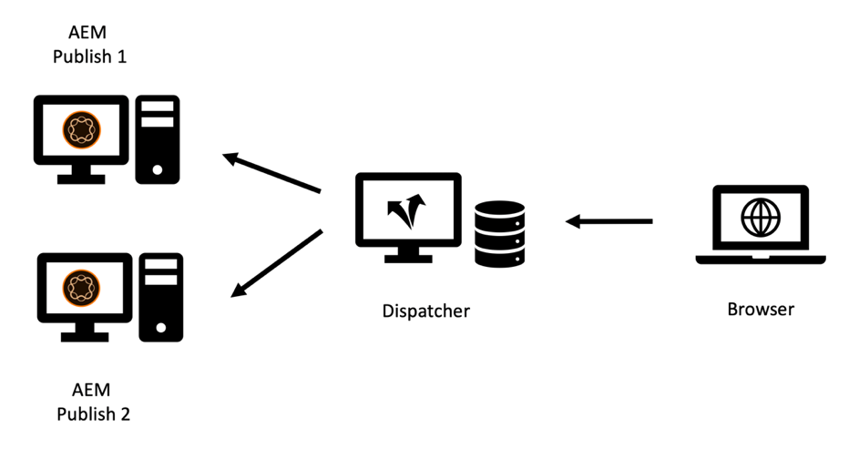

# Capítulo 2 - Infraestructura

## Configuración de una infraestructura de almacenamiento en caché

Hemos introducido la topología básica de un sistema de publicación y un distribuidor en el capítulo 1 de esta serie. Se puede configurar un conjunto de servidores Publish y Dispatcher en muchas variaciones, según la carga esperada, la topología de sus centros de datos y las propiedades de failover deseadas.

Esbozaremos las topologías más comunes y describiremos las ventajas y dónde se quedan cortos. La lista - por supuesto - nunca puede ser completa. El único límite es tu imaginación.

### La configuración &quot;Heredada&quot;

En los primeros días, el número de visitantes potenciales era pequeño, el hardware era caro y los servidores web no eran tan críticos para el negocio como lo son hoy en día. Una configuración común era tener un Dispatcher que sirviera como equilibrador de carga y caché frente a dos o más sistemas de publicación. El servidor Apache en el centro de Dispatcher era muy estable y, en la mayoría de los ajustes, lo suficientemente capaz para servir una cantidad decente de solicitudes.

*Configuración de Dispatcher &quot;heredada&quot;: no muy común en los estándares actuales*

  

Aquí es donde el despachante recibió su nombre de: Básicamente estaba enviando solicitudes. Esta configuración ya no es muy común, ya que no puede satisfacer las mayores exigencias de rendimiento y estabilidad que se requieren hoy en día.

### Configuración de varias piernas

Hoy en día es más común una topología ligeramente diferente. Una topología de varias patas tendría un Dispatcher por servidor de publicación. Un equilibrador de carga dedicado (hardware) se sienta delante de la infraestructura de AEM que envía las solicitudes a estas dos (o más) piernas:

*Configuración moderna de Dispatcher &quot;estándar&quot;: fácil de gestionar y mantener*

  

Estas son las razones de este tipo de configuración,

1. En promedio, los sitios web ofrecen mucho más tráfico que antes. Por lo tanto, es necesario ampliar la &quot;infraestructura Apache&quot;.

2. La configuración &quot;Heredado&quot; no proporcionó redundancia en el nivel de Dispatcher. Si el servidor Apache se apagaba, no se podía acceder a todo el sitio web.

3. Los servidores Apache son baratos. Se basan en código abierto y, dado que dispone de un centro de datos virtual, se pueden aprovisionar muy rápido.

4. Esta configuración proporciona una manera sencilla de usar un escenario de actualización &quot;móvil&quot; o &quot;escalonado&quot;. Simplemente cierre Dispatcher 1 mientras instala un nuevo paquete de software en Publish 1. Cuando la instalación haya finalizado y haya probado suficientemente la Publicación 1 desde la red interna, limpie la caché en Dispatcher 1 y vuelva a iniciarla mientras pulsa Dispatcher 2 para el mantenimiento de Publicar 2.

5. La invalidación de caché se vuelve muy fácil y determinística en esta configuración. Como solo un sistema de publicación está conectado a un Dispatcher, solo hay un Dispatcher para invalidar. El orden y el momento de la invalidación son triviales.

### La configuración &quot;Escalar fuera&quot;

Los servidores Apache son baratos y fáciles de aprovisionar, por qué no empujar la ampliación a ese nivel un poco más. ¿Por qué no hay dos o más distribuidores delante de cada servidor de publicación?

*Configuración de &quot;Escalar fuera&quot;: tiene algunas áreas de aplicación, pero también limitaciones y advertencias.*

  

¡Puedes hacer eso! Y hay muchos escenarios de aplicación válidos para esa configuración. Pero también hay algunas limitaciones y complejidades que debe tener en cuenta.

#### Invalidación

Cada sistema de publicación está conectado a una multitud de distribuidores, cada uno debe invalidarse cuando el contenido se ha cambiado.

#### Mantenimiento

Huelga decir que la configuración inicial de los sistemas Dispatcher y Publish es un poco más compleja. Pero también tenga en cuenta que el esfuerzo de una versión &quot;móvil&quot; también es un poco mayor. Los sistemas AEM pueden y deben actualizarse mientras se ejecutan. Pero es inteligente no hacerlo mientras estén sirviendo solicitudes activamente. Normalmente, solo desea actualizar una parte de los sistemas de publicación, mientras que los demás siguen sirviendo tráfico de forma activa y, después de realizar la prueba, cambia a la otra parte. Si tiene suerte y puede acceder al equilibrador de carga en el proceso de implementación, puede desactivar el enrutamiento a los servidores que se encuentran en mantenimiento aquí. Si está en un equilibrador de carga compartido sin acceso directo, preferiría apagar los distribuidores de la publicación que desea actualizar. Cuanto más haya, más tendrá que cerrar. Si hay un gran número de usuarios y planea realizar actualizaciones frecuentes, se recomienda cierta automatización. Si no dispone de herramientas de automatización, la ampliación es una mala idea.

En un proyecto anterior usamos un truco diferente para quitar un sistema de publicación del equilibrio de carga sin tener acceso directo al propio equilibrador de carga.

El equilibrador de carga normalmente &quot;pings&quot;, una página en particular para ver si el servidor está funcionando. Una opción trivial normalmente es hacer ping en la página principal. Pero si desea utilizar el ping para indicar al equilibrador de carga que no equilibre el tráfico, elegiría otra cosa. Puede crear una plantilla o servlet dedicada que se pueda configurar para responder con `"up"` o `"down"` (en el cuerpo o como código de respuesta http). La respuesta de esa página, por supuesto, no debe almacenarse en caché en el despachante, por lo que siempre se obtiene directamente del sistema de publicación. Ahora, si configura el equilibrador de carga para que compruebe esta plantilla o servlet, puede dejar que Publish &quot;pretenda&quot; que esté inactivo. No formaría parte del equilibrio de carga y se puede actualizar.

#### Distribución en todo el mundo

La &quot;Distribución mundial&quot; es una configuración de &quot;Escalar&quot; en la que tiene varios distribuidores delante de cada sistema de publicación, que ahora se distribuyen en todo el mundo para estar más cerca del cliente y proporcionar un mejor rendimiento. Por supuesto, en ese escenario no tiene un equilibrador de carga central sino un esquema de equilibrio de carga basado en DNS y geo-IP.

>[!NOTE]
>
>En realidad, está creando una especie de red de distribución de contenido (CDN) con ese enfoque, por lo que debería considerar la posibilidad de comprar una solución CDN lista para usar en lugar de crearla usted mismo. Crear y mantener una CDN personalizada no es una tarea trivial.

#### Escalado horizontal

Incluso en un centro de datos local, una topología de &quot;ampliación&quot; con varios despachantes frente a cada sistema de publicación tiene algunas ventajas. Si ve cuellos de botella de rendimiento en los servidores Apache debido al alto tráfico (y a una buena tasa de visitas de caché) y ya no puede aumentar el hardware (mediante la adición de CPU, RAM y discos más rápidos), puede mejorar el rendimiento añadiendo distribuidores. Esto se denomina &quot;escala horizontal&quot;. Sin embargo, esto tiene límites, especialmente cuando se invalida el tráfico con frecuencia. Describiremos el efecto en la siguiente sección.

#### Límites de la topología de escalado

La adición de servidores proxy normalmente debería aumentar el rendimiento. Sin embargo, existen escenarios en los que la adición de servidores puede reducir el rendimiento. ¿Cómo? Considere que tiene un portal de noticias, donde introduce nuevos artículos y páginas cada minuto. Dispatcher invalida por &quot;invalidación automática&quot;: Cada vez que se publica una página, todas las páginas de la caché del mismo sitio se invalidan. Esta es una función útil - hemos cubierto esto en [Capítulo 1](chapter-1.md) de esta serie - pero también significa que cuando tiene cambios frecuentes en su sitio web, está invalidando la caché con bastante frecuencia. Si solo tiene un Dispatcher por instancia de publicación, el primer visitante que solicita una página, activa un nuevo almacenamiento en caché de esa página. El segundo visitante ya obtiene la versión en caché.

Si tiene dos distribuidores, el segundo visitante tiene un 50 % de probabilidades de que la página no se almacene en caché y experimentará una latencia mayor cuando se vuelva a procesar la página. Tener incluso más distribuidores por publicación empeora las cosas. Lo que sucede es que el servidor de publicación recibe más carga porque tiene que volver a procesar la página para cada Dispatcher por separado.

*Se ha reducido el rendimiento en un escenario de escala con frecuentes vaciados de caché.*

  

#### Mitigación de problemas de escalado excesivo

Puede considerar la posibilidad de utilizar un almacenamiento compartido central para todos los distribuidores o sincronizar los file systems de los servidores Apache para mitigar los problemas. Sólo podemos proporcionar una experiencia de primera mano limitada, pero prepárese para que esto aumente la complejidad del sistema y pueda introducir una nueva clase de errores.

Hemos tenido algunos experimentos con NFS - pero NFS introduce enormes problemas de rendimiento debido al bloqueo de contenido. Esto en realidad disminuyó el rendimiento general.

**Conclusión** : el uso compartido de un sistema de archivos común entre varios distribuidores NO es un enfoque recomendado.

Si se enfrenta a problemas de rendimiento, escale por igual Publicar y Dispatcher para evitar cargas máximas en las instancias de Publisher. No existe una regla de oro sobre la proporción Publicar/Dispatcher - depende en gran medida de la distribución de las solicitudes y la frecuencia de las publicaciones y las invalidaciones de caché.

Si también le preocupa la latencia que experimenta un visitante, considere la posibilidad de utilizar una red de entrega de contenido, la recuperación de caché, el calentamiento preventivo de la caché, la configuración de un tiempo de gracia como se describe en el [capítulo 1](chapter-1.md) de esta serie o consulte algunas ideas avanzadas de [parte 3](chapter-3.md).

### La configuración &quot;Cross Connected&quot;

Otra configuración que hemos visto de vez en cuando es la configuración &quot;conectada cruzada&quot;: Las instancias de publicación no tienen distribuidores específicos, pero todos los distribuidores están conectados a todos los sistemas de publicación.

  

*Topología interconectada: Mayor redundancia y mayor complejidad.*

A primera vista, esto proporciona más redundancia para un presupuesto relativamente pequeño. Cuando uno de los servidores Apache está inactivo, aún puede tener dos sistemas de publicación haciendo que el procesamiento funcione. Además, si uno de los sistemas de publicación se bloquea, aún tiene dos distribuidores que sirven la carga en caché.

Sin embargo, esto tiene un precio.

Primero, sacar una pierna para el mantenimiento es bastante engorroso. En realidad, para esto se diseñó este sistema; para ser más resistente y permanecer en funcionamiento por todos los medios posibles. Hemos visto complicados planes de mantenimiento sobre cómo lidiar con esto. Vuelva a configurar Dispatcher 2 primero, quitando la conexión cruzada. Reinicio de Dispatcher 2. Apagar Dispatcher 1, actualizar Publish 1, ..., etc. Debe tener cuidado si se escala hasta más de dos patas. Llegarán a la conclusión de que en realidad aumenta la complejidad, los costos y es una fuente formidable de errores humanos. Sería mejor automatizar esto. Así que mejor compruebe, si realmente tiene los recursos humanos para incluir esta tarea de automatización en su programación de proyectos. Aunque puede ahorrar algunos costes de hardware con esto, puede gastar el doble en el personal de TI.

En segundo lugar, es posible que tenga alguna aplicación de usuario ejecutándose en AEM que requiera un inicio de sesión. Utilice sesiones adhesivas para asegurarse de que un usuario siempre se sirve desde la misma instancia de AEM, de modo que se pueda mantener el estado de la sesión en esa instancia. Al tener esta configuración conectada de forma cruzada, debe asegurarse de que las sesiones adhesivas funcionen correctamente en el equilibrador de carga y en los distribuidores. No es imposible - pero necesita ser consciente de eso y añadir algunas horas adicionales de configuración y prueba, que - de nuevo - podrían igualar los ahorros que había planeado ahorrando hardware.

### Conclusión

No se recomienda utilizar este esquema de conexión cruzada como opción predeterminada. Sin embargo, si decide utilizarla, debe evaluar cuidadosamente los riesgos y los costes ocultos y planificar la inclusión de la automatización de la configuración como parte del proyecto.

## Etapa siguiente

* [3 - Temas avanzados de almacenamiento en caché](chapter-3.md)
