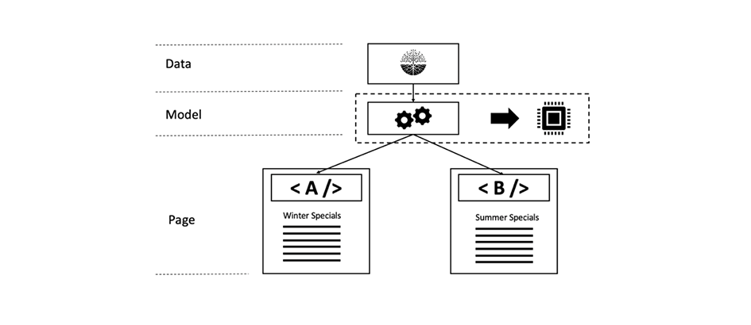

# Capítulo 3 - Temas avanzados de almacenamiento en caché

*&quot;Sólo hay dos cosas difíciles en la Ciencia de la Computación: invalidación de caché y nombres&quot;.*

— PHIL KARLTON

## Información general

Esta es la tercera parte de una serie de tres partes para el almacenamiento en caché en AEM. Donde las dos primeras partes se centraron en el almacenamiento en caché http sin formato en Dispatcher y en las limitaciones que existen. Esta parte analiza algunas ideas sobre cómo superar estas limitaciones.

## Almacenamiento en caché en general

[El capítulo 1](chapter-1.md) y el  [capítulo 2](chapter-2.md)  de esta serie se centraron principalmente en Dispatcher. Hemos explicado los conceptos básicos, las limitaciones y dónde debe realizar ciertas compensaciones.

La complejidad y complejidad del almacenamiento en caché no son problemas exclusivos de Dispatcher. El almacenamiento en caché es difícil en general.

Tener Dispatcher como la única herramienta en su caja de herramientas sería en realidad una limitación real.

En este capítulo queremos ampliar nuestra visión sobre el almacenamiento en caché y desarrollar algunas ideas sobre cómo superar algunas de las deficiencias de Dispatcher. No hay solución de plata - tendrá que hacer compensaciones en su proyecto. Recuerde que con el almacenamiento en caché y la precisión de invalidación siempre viene la complejidad, y con la complejidad viene la posibilidad de errores.

Tendrá que hacer concesiones en estas áreas,

* Rendimiento y latencia
* Consumo de recursos/Carga de CPU/Uso del disco
* Precisión / Moneda / Estancia / Seguridad
* Simplicidad / Complejidad / Coste / Mantenimiento / Pronunciamiento de errores

Estas dimensiones están interconectadas en un sistema bastante complejo. No hay un simple si-esto-entonces-eso. Hacer que un sistema sea más simple puede hacerlo más rápido o más lento. Puede reducir los costes de desarrollo, pero aumentar los costes en el servicio de asistencia, por ejemplo, si los clientes ven contenido obsoleto o se quejan de un sitio web lento. Todos estos factores deben ser considerados y equilibrados entre sí. Pero a estas alturas ya deberían tener una buena idea, que no hay una panacea o una sola &quot;mejor práctica&quot; -sólo un montón de malas prácticas y unas cuantas buenas.

## Almacenamiento en caché encadenado

### Información general

#### Flujo de datos

El envío de una página desde un servidor al explorador de un cliente cruza una multitud de sistemas y subsistemas. Si observa con cuidado, hay una cantidad de datos de saltos que deben tomarse de la fuente al drenaje, cada uno de los cuales es un candidato potencial para el almacenamiento en caché.


*Flujo de datos de una aplicación típica de CMS*

<br> 

Comencemos nuestro recorrido con un fragmento de datos que se encuentra en un disco duro y que debe mostrarse en un navegador.

#### Hardware y sistema operativo

En primer lugar, la unidad de disco duro (disco duro) tiene algo integrado en la caché del hardware. Segundo, el sistema operativo que monta el disco duro, utiliza memoria libre para almacenar en caché los bloques a los que se accede con frecuencia para acelerar el acceso.

#### Repositorio de contenido

El siguiente nivel es CRX u Oak: la base de datos de documentos utilizada por AEM. CRX y Oak dividen los datos en segmentos que se pueden almacenar en caché en la memoria, así como para evitar un acceso más lento al disco duro.

#### Datos de terceros

La mayoría de las instalaciones web más grandes tienen datos de terceros también; datos procedentes de un sistema de información de producto, un sistema de gestión de relaciones con el cliente, una base de datos heredada o cualquier otro servicio web arbitrario. No es necesario extraer estos datos de la fuente siempre que sea necesario, especialmente cuando se sabe que cambian con poca frecuencia. Por lo tanto, se puede almacenar en caché, si no está sincronizado en la base de datos CRX.

#### Capa comercial: aplicación/modelo

Normalmente, los scripts de plantilla no representan el contenido sin procesar proveniente de CRX a través de la API de JCR. Lo más probable es que tenga una capa empresarial entre la que se combinen, calculen o transformen datos en un objeto de dominio empresarial. Adivinen qué: si estas operaciones son costosas, debe considerar almacenarlas en caché.

#### Fragmentos de marcado

El modelo es ahora la base para la renderización del marcado de un componente. ¿Por qué no almacenar en caché también el modelo representado?

#### Dispatcher, CDN y otros proxies

Off va la página HTML procesada a Dispatcher. Ya hemos discutido, que el propósito principal de Dispatcher es almacenar en caché las páginas HTML y otros recursos web (a pesar de su nombre). Antes de que los recursos lleguen al explorador, puede pasar un proxy inverso (que puede almacenar en caché y un CDN) que también se utiliza para el almacenamiento en caché. El cliente puede sentarse en una oficina, que concede acceso web solo a través de un proxy, y ese proxy podría decidir almacenar en caché también para guardar tráfico.

#### Caché del explorador

Por último, pero no menos importante: el navegador también se almacena en caché. Este es un recurso que se pasa por alto fácilmente. Pero es la caché más cercana y rápida que tiene en la cadena de almacenamiento en caché. Desafortunadamente, no se comparte entre los usuarios, sino entre diferentes solicitudes de un usuario.

### Dónde almacenar en caché y por qué

Esa es una larga cadena de cachés potenciales. Y todos hemos enfrentado problemas donde hemos visto contenido obsoleto. Pero teniendo en cuenta cuántas etapas hay, es un milagro que la mayor parte del tiempo esté funcionando.

Pero, ¿dónde en esa cadena tiene sentido almacenar en caché? ¿Al principio? ¿Al final? ¿En todas partes? Depende... y depende de un gran número de factores. Incluso dos recursos en el mismo sitio web podrían desear una respuesta diferente a esa pregunta.

Para darles una idea aproximada de los factores que pueden tener en cuenta,

**Tiempo de vida** : si los objetos tienen un corto tiempo de vida inherente (los datos de tráfico pueden tener una duración inferior a la de los datos meteorológicos), es posible que no valga la pena almacenarlos en caché.

**Coste de producción:** cuán costoso (en términos de ciclos de CPU y E/S) es la reproducción y entrega de un objeto. Si el almacenamiento en caché es barato, puede que no sea necesario.

**Tamaño** : los objetos grandes requieren que se almacenen en caché más recursos. Esto podría ser un factor limitante y debe equilibrarse en relación con el beneficio.

**Frecuencia de acceso** : Si raramente se accede a los objetos, es posible que el almacenamiento en caché no sea eficaz. Simplemente se quedarían obsoletos o se invalidarían antes de acceder a ellos por segunda vez desde la caché. Estos elementos simplemente bloquearían los recursos de memoria.

**Acceso compartido** : los datos que utiliza más de una entidad deben almacenarse en caché en una parte superior de la cadena. En realidad, la cadena de almacenamiento en caché no es una cadena, sino un árbol. Más de un modelo puede utilizar un fragmento de datos del repositorio. A su vez, más de un script de renderización puede utilizar estos modelos para generar fragmentos HTML. Estos fragmentos se incluyen en varias páginas que se distribuyen a varios usuarios con sus cachés privadas en el explorador. Así que &quot;compartir&quot; no significa compartir sólo entre personas, sino entre piezas de software. Si desea encontrar una caché &quot;compartida&quot; potencial, simplemente rastree el árbol a la raíz y encuentre un antecesor común - ahí es donde debe almacenar en caché.

**Distribución geoespacial** : Si los usuarios se distribuyen en todo el mundo, el uso de una red distribuida de cachés puede ayudar a reducir la latencia.

**Ancho de banda y latencia de la red**  - Hablando de latencia, ¿quiénes son sus clientes y qué tipo de red están usando? ¿Tal vez sus clientes son clientes móviles en un país subdesarrollado que utilizan una conexión 3G de teléfonos inteligentes de generación anterior? Considere la posibilidad de crear objetos más pequeños y almacenarlos en caché en las cachés del explorador.

Esta lista por lejos no es completa, pero creemos que ya tienes la idea.

### Reglas básicas para el almacenamiento en caché encadenado

De nuevo: el almacenamiento en caché es difícil. Compartiremos algunas reglas básicas que hemos extraído de proyectos anteriores que pueden ayudarle a evitar problemas en su proyecto.

#### Evitar el almacenamiento en caché doble

Cada una de las capas introducidas en el último capítulo proporciona algún valor en la cadena de almacenamiento en caché. Al ahorrar ciclos de computación o al acercar los datos al consumidor. No está mal almacenar en caché un fragmento de datos en múltiples etapas de la cadena - pero siempre debe considerar cuáles son los beneficios y los costos de la siguiente etapa. El almacenamiento en caché de una página completa en el sistema de publicación no suele proporcionar ningún beneficio, ya que esto ya se hace en Dispatcher.

#### Combinación de estrategias de invalidación

Existen tres estrategias básicas de invalidación:

* **TTL, Tiempo de vida:** un objeto caduca después de una cantidad de tiempo fija (por ejemplo, &quot;dentro de dos horas&quot;)
* **Fecha de caducidad:** el objeto caduca en el momento definido en el futuro (por ejemplo, &quot;5:00 PM del 10 de junio de 2019&quot;)
* **Basado en eventos:** el objeto se invalida explícitamente por un evento que se produjo en la plataforma (por ejemplo, cuando se cambia y activa una página)

Ahora puede usar diferentes estrategias en diferentes capas de caché, pero hay algunas &quot;tóxicas&quot;.

#### Invalidación basada en eventos


*Invalidación basada en eventos puros: Invalidar desde la caché interna a la capa externa*

<br> 

La invalidación pura basada en eventos es la más fácil de comprender, la más fácil de obtener teóricamente correcta y la más precisa.

En pocas palabras, las cachés se invalidan una por una después de que el objeto haya cambiado.

Solo tiene que tener una regla en mente:

Siempre invalide desde el interior a la caché externa. Si primero invalidó una caché externa, es posible que vuelva a almacenar en caché el contenido antiguo de una caché interna. No realice suposiciones en qué momento la caché vuelve a estar fresca, asegúrese de que. Lo mejor es activar la invalidación de la caché externa _después_ invalidando la interna.

Esa es la teoría. Pero en la práctica hay un número de gotchas. Los eventos deben distribuirse, posiblemente a través de una red. En la práctica, esto hace que sea el esquema de invalidación más difícil de implementar.

#### Corrección automática

Con la invalidación basada en eventos, debe tener un plan de contingencia. ¿Qué sucede si se pierde un evento de invalidación? Una estrategia sencilla podría ser invalidar o purgar después de un cierto tiempo. Por lo tanto, es posible que haya pasado por alto ese evento y ahora ofrezca contenido obsoleto. Pero los objetos también tienen un TTL implícito de varias horas (días) solamente. Así que finalmente el sistema se cura automáticamente.

#### Invalidación pura basada en TTL


*Invalidación no sincronizada basada en TTL*

<br> 

Ese también es un esquema bastante común. Si apila varias capas de cachés, cada una tiene derecho a servir un objeto durante un cierto tiempo.

Es fácil de implementar. Desafortunadamente, es difícil predecir la duración efectiva de una porción de datos.


*La caché exterior prolonga la duración de un objeto interno*

<br> 

Consideremos la ilustración anterior. Cada capa de almacenamiento en caché introduce un TTL de 2 minutos. Ahora - el TTL general debe de 2 minutos también, ¿verdad? No del todo. Si la capa externa recupera el objeto justo antes de que quede obsoleto, la capa exterior prolonga el tiempo de vida efectivo del objeto. El tiempo de vida efectivo puede estar entre 2 y 4 minutos en ese caso. Considere que está de acuerdo con su departamento de negocios, un día es tolerable - y tiene cuatro capas de cachés. El TTL real en cada capa no debe ser superior a seis horas... aumentando la velocidad de pérdida de caché...

No estamos diciendo que sea un mal esquema. Solo deberías conocer sus límites. Y es una buena y fácil estrategia para empezar. Solo si el tráfico del sitio aumenta, puede considerar una estrategia más precisa.

*Sincronización de la hora de invalidación estableciendo una fecha específica*

#### Invalidación basada en fecha de caducidad

Se obtiene un tiempo de vida efectivo más predecible, si se configura una fecha específica en el objeto interno y se propaga a las cachés externas.


*Sincronización de fechas de caducidad*

<br> 

Sin embargo, no todas las cachés pueden propagar las fechas. Y puede volverse desagradable, cuando la caché externa agrega dos objetos internos con diferentes fechas de caducidad.

#### Mezcla de invalidación basada en eventos y TTL


*Combinación de estrategias basadas en eventos y TTL*

<br> 

Además, un esquema común en el mundo de AEM es usar la invalidación basada en eventos en las cachés internas (por ejemplo, las cachés en memoria en las que los eventos se pueden procesar casi en tiempo real) y las cachés basadas en TTL en el exterior, donde tal vez no tenga acceso a la invalidación explícita.

En el mundo de AEM, tendrá una caché en memoria para objetos empresariales y fragmentos HTML en los sistemas de publicación, que se invalida cuando cambian los recursos subyacentes y propagará este evento de cambio al distribuidor, que también funciona en función de eventos. Delante de esto tendría, por ejemplo, una CDN basada en TTL.

Tener una capa de almacenamiento en caché (corto) basado en TTL delante de un Dispatcher podría suavizar efectivamente un pico que normalmente se produciría después de una invalidación automática.

#### Mezcla de TTL y de Invalidación basada en eventos


*Tóxico: Mezcla de TTL y de Invalidación basada en eventos*

<br> 

Esta combinación es tóxica. No coloque nunca la caché basada en eventos después de una caché basada en TTL o Caducidad. ¿Recuerdan ese efecto derrame que tuvimos en la estrategia &quot;pura TTL&quot;? El mismo efecto puede observarse aquí. Solo que el evento de invalidación de la caché externa ya se haya producido podría no volver a suceder - nunca, Esto puede ampliar la duración del objeto almacenado en caché hasta el infinito.


*Combinación basada en TTL y en eventos: Infinito*

<br> 

## Almacenamiento en caché parcial y almacenamiento en caché en memoria

Puede conectar en el escenario del proceso de renderización para añadir capas de almacenamiento en caché. Desde obtener objetos de transferencia de datos remotos o crear objetos empresariales locales hasta almacenar en caché el marcado procesado de un solo componente. Dejaremos implementaciones concretas en un tutorial posterior. Pero tal vez planee ya haber implementado algunas de estas capas de almacenamiento en caché usted mismo. Así que lo menos que podemos hacer aquí es presentar los principios básicos - y gotchas.

### Palabras de advertencia

#### Respetar control de acceso

Las técnicas descritas aquí son bastante poderosas y _debe-tener_ en cada caja de herramientas para desarrolladores de AEM. Pero no se entusiasmen demasiado, utilícelos sabiamente. Almacenar un objeto en una caché y compartirlo con otros usuarios en solicitudes de seguimiento significa en realidad eludir el control de acceso. Normalmente no es un problema en los sitios web públicos, pero puede serlo cuando un usuario necesita iniciar sesión antes de obtener acceso.

Considere almacenar el marcado HTML de un menú principal de sitios en una caché en memoria para compartirlo entre varias páginas. En realidad, ese es un ejemplo perfecto para almacenar HTML procesado parcialmente como crear una navegación, ya que suele ser caro ya que requiere atravesar muchas páginas.

No comparte esa misma estructura de menús entre todas las páginas, sino también con todos los usuarios, lo que la hace aún más eficiente. Pero espere ... pero tal vez hay algunos elementos en el menú que están reservados para un determinado grupo de usuarios solamente. En ese caso, el almacenamiento en caché puede resultar un poco más complejo.

#### Almacenar en caché objetos empresariales personalizados

Si hay alguno - ese es el consejo más importante, le podemos dar:

>[!WARNING]
>
>Sólo los objetos de caché que son suyos, que son inmutables, que usted mismo creó, que son superfluos y no tienen referencia saliente.

¿Qué significa eso?

1. No sabes el ciclo de vida previsto de los objetos de otras personas. Tenga en cuenta que se observa una referencia a un objeto de solicitud y decide almacenarlo en caché. Ahora, la solicitud ha finalizado y el contenedor de servlet desea reciclar ese objeto para la siguiente solicitud entrante. En ese caso, otra persona está cambiando el contenido sobre el que creía tener control exclusivo. No lo descartes - Hemos visto que algo así sucede en un proyecto. Los clientes veían datos de otros clientes en lugar de los suyos propios.

2. Siempre y cuando una cadena de otras referencias haga referencia a un objeto, este no se puede eliminar de la pila. Si conserva un objeto supuestamente pequeño en la caché al que hace referencia, digamos una representación de 4 MB de una imagen, tendrá una buena oportunidad de tener problemas con la pérdida de memoria. Se supone que las cachés se basan en referencias débiles. Pero las referencias débiles no funcionan como cabría esperar. Esa es la mejor manera de producir una fuga de memoria y terminar en un error de memoria insuficiente. Y - no sabes cuál es el tamaño de la memoria retenida de los objetos extranjeros, ¿verdad?

3. Especialmente en Sling, se puede adaptar (casi) cada objeto entre sí. Considere la posibilidad de colocar un recurso en la caché. La siguiente solicitud (con diferentes derechos de acceso), recupera ese recurso y lo adapta a resourceResolver o a una sesión para acceder a otros recursos a los que no tendría acceso.

4. Incluso si crea un &quot;envoltorio&quot; delgado alrededor de un recurso de AEM, no debe almacenarlo en caché, aunque sea propio e inmutable. El objeto envuelto sería una referencia (que prohibimos antes) y si nos vemos nítidos, básicamente crea los mismos problemas que se describen en el último elemento.

5. Si desea almacenar en caché, cree sus propios objetos copiando datos primitivos en sus propios objetos shallo. Es posible que desee vincular entre sus propios objetos mediante referencias; por ejemplo, puede que desee almacenar en caché un árbol de objetos. Esto está bien, pero solo los objetos de caché que acaba de crear en la misma solicitud, y ningún objeto solicitado desde otro lugar (aunque sea el espacio de nombre de su objeto). _Copiar_ objetos es la clave. Y asegúrese de purgar toda la estructura de objetos vinculados a la vez y evitar las referencias entrantes y salientes a su estructura.

6. Sí - y mantener sus objetos inmutables. Propiedades privadas, solo y sin definidores.

Son muchas reglas, pero vale la pena seguirlas. Incluso si usted es experimentado y súper inteligente y tiene todo bajo control. El joven colega en su proyecto acaba de graduarse de la universidad. Él no sabe de todos estos escollos. Si no hay escollos, no hay nada que evitar. Sea sencillo y comprensible.

### Herramientas y bibliotecas

Esta serie trata sobre la comprensión de los conceptos y la habilitación para crear una arquitectura que se ajuste mejor a su caso de uso.

No estamos promoviendo ninguna herramienta en particular. Pero dales pistas cómo evaluarlas. Por ejemplo, AEM tiene una caché integrada simple con un TTL fijo desde la versión 6.0. ¿Desea utilizarlo? Probablemente no en la publicación donde sigue una caché basada en eventos en la cadena (sugerencia: Dispatcher). Pero podría ser por una opción decente para un Autor. También hay una caché HTTP de Adobe ACS commons que puede que valga la pena tener en cuenta.

O puede crear su propio, basado en un marco de almacenamiento en caché maduro como [Ehcache](https://www.ehcache.org). Se puede utilizar para almacenar en caché objetos Java y marcas procesadas (objetos `String`).

En algunos casos sencillos, también puede llevarse bien usando mapas hash simultáneos -rápidamente verá límites aquí- en la herramienta o en sus habilidades. La concurrencia es tan difícil de dominar como la asignación de nombres y el almacenamiento en caché.

#### Referencias

* [Caché http de ACS Commons  ](https://adobe-consulting-services.github.io/acs-aem-commons/features/http-cache/index.html)
* [Marco de almacenamiento en caché de Ehcache](https://www.ehcache.org)

### Términos básicos

No entraremos en la teoría del almacenamiento en caché aquí demasiado profundo, pero nos sentimos obligados a proporcionar unas pocas palabras de moda, para que usted tenga un buen comienzo.

#### Desalojo de caché

Hablamos de invalidación y purga mucho. _El_ desalojo de caché está relacionado con estos términos: Después de desalojar una entrada, ya no está disponible. Pero el desalojo no ocurre cuando una entrada está obsoleta, sino cuando la caché está llena. Los elementos más recientes o &quot;más importantes&quot; sacan los más antiguos o menos importantes de la caché. Qué entradas tendrá que sacrificar es una decisión caso por caso. Es posible que desee desalojar a los más antiguos o a los que se han utilizado muy raramente o a los que se ha accedido por última vez durante mucho tiempo.

#### Almacenamiento en caché preventivo

El almacenamiento en caché preventivo significa volver a crear la entrada con contenido nuevo en el momento en que se invalida o se considera obsoleto. Por supuesto - lo haría solo con unos pocos recursos, a los que está seguro de que se accede con frecuencia e inmediatamente. De lo contrario, malgastaría recursos al crear entradas de caché que podrían no solicitarse nunca. Al crear entradas de caché de forma preventiva, podría reducir la latencia de la primera solicitud a un recurso después de la invalidación de la caché.

#### Calentamiento de caché

El calentamiento de la caché está estrechamente relacionado con el almacenamiento en caché preventivo. Aunque no usarías ese término para un sistema activo. Y está menos limitado que el primero. No vuelve a almacenar en caché inmediatamente después de la invalidación, pero se rellena gradualmente la caché cuando el tiempo lo permite.

Por ejemplo, se extrae una pata Publicar/Dispatcher del equilibrador de carga para actualizarla. Antes de reintegrarlo, rastrea automáticamente las páginas a las que se accede con más frecuencia para volver a introducirlas en la caché. Cuando la caché está &quot;caliente&quot; - llena adecuadamente usted reintegra la pata en el equilibrador de carga.

O tal vez reintegren la pata a la vez, pero restringen el tráfico a esa pata para que tenga la oportunidad de calentar sus cachés con un uso regular.

O quizá también desee almacenar en caché algunas páginas a las que se accede con menos frecuencia en momentos en que el sistema está inactivo para reducir la latencia cuando se accede a ellas a través de solicitudes reales.

#### Identidad de objeto de caché, carga útil, dependencia de invalidación y TTL

En términos generales, un objeto almacenado en caché o &quot;entrada&quot; tiene cinco propiedades principales,

#### Clave

Esta es la identidad de la propiedad mediante la cual se identifican y se objetos. Para recuperar su carga útil o para purgarla de la caché. Por ejemplo, Dispatcher usa la dirección URL de una página como clave. Tenga en cuenta que Dispatcher no utiliza las rutas de páginas. Esto no es suficiente para distinguir diferentes renderizaciones. Otras cachés pueden utilizar claves diferentes. Más adelante veremos algunos ejemplos.

#### Valor/Carga útil

Ese es el cofre del tesoro del objeto, los datos que desea recuperar. En el caso de Dispatcher, es el contenido de los archivos. Pero también puede ser un árbol de objetos Java.

#### TTL

Ya cubrimos el TTL. Tiempo después del cual una entrada se considera obsoleta y no debe entregarse más.

#### Dependencia

Esto se refiere a la invalidación basada en eventos. ¿En qué datos originales depende ese objeto? En la Parte I, ya dijimos, que un seguimiento de dependencia verdadero y preciso es demasiado complejo. Pero con nuestro conocimiento del sistema puedes aproximar las dependencias con un modelo más simple. Invalidamos suficientes objetos para purgar contenido obsoleto... y tal vez inadvertidamente más de lo que se necesitaría. Pero aún así tratamos de mantenernos por debajo de &quot;purgar todo&quot;.

Qué objetos dependen de lo que otros sean genuinos en cada aplicación. Más adelante le daremos algunos ejemplos de cómo implementar una estrategia de dependencia.

### Almacenamiento en caché de fragmentos HTML


*Reutilización de un fragmento representado en páginas diferentes*

<br> 

El almacenamiento en caché de fragmentos HTML es una potente herramienta. La idea es almacenar en caché el marcado HTML generado por un componente en una caché en memoria. Pueden preguntar, ¿por qué debería hacer eso? Estoy almacenando en caché el marcado de toda la página en el despachante de todos modos, incluido el marcado de ese componente. Estamos de acuerdo. Lo hace, pero una vez por página. No comparte ese marcado entre las páginas.

Imagine que está procesando una navegación en la parte superior de cada página. El marcado tiene el mismo aspecto en cada página. Pero lo está procesando una y otra vez para cada página, que no está en Dispatcher. Y recuerden: Después de la invalidación automática, es necesario volver a procesar todas las páginas. Básicamente, se está ejecutando el mismo código con los mismos resultados cientos de veces.

Desde nuestra experiencia, procesar una navegación superior anidada es una tarea muy costosa. Normalmente recorre una buena parte del árbol de documentos para generar los elementos de navegación. Aunque solo necesite el título de navegación y la dirección URL, las páginas deben cargarse en la memoria. Y aquí están obstruyendo recursos preciosos. Una y otra vez.

Sin embargo, el componente se comparte entre muchas páginas. Y compartir algo es lo que indica usar una caché. Por lo tanto, lo que desea hacer es comprobar si el componente de navegación ya se ha procesado y almacenado en caché y, en lugar de renderizar, emitir el valor de las cachés.

Hay dos maravillosas variedades de ese esquema que fácilmente se pierden:

1. Está almacenando en caché una cadena Java. Una cadena no tiene referencias salientes y es inmutable. Así que, considerando las advertencias anteriores - esto es super seguro.

2. La invalidación también es muy sencilla. Siempre que algo cambie su sitio web, desea invalidar esta entrada de caché. La reconstrucción es relativamente barata, ya que debe realizarse una sola vez y luego es reutilizada por todos los cientos de páginas.

Esto supone un gran alivio para los servidores de publicación.

### Implementación de cachés de fragmentos

#### Etiquetas personalizadas

En los viejos tiempos, donde usaba JSP como motor de creación de plantillas, era bastante común utilizar una etiqueta JSP personalizada que envolviera el código de renderización de componentes.

```
<!-- Pseudo Code -->

<myapp:cache
  key=' ${info.homePagePath} + ${component.path}'
  cache='main-navigation'
  dependency='${info.homePagePath}'>

… original components code ..

</myapp:cache>
```

La etiqueta personalizada que capturaría su cuerpo y lo escribiría en la caché o evitaría la ejecución de su cuerpo y mostraría la carga útil de la entrada de caché en su lugar.

La &quot;clave&quot; es la ruta de componentes que tendría en la página principal. No utilizamos la ruta del componente en la página actual, ya que esto crearía una entrada de caché por página, lo que contradiría nuestra intención de compartir ese componente. Tampoco utilizamos solo la ruta relativa de los componentes (`jcr:conten/mainnavigation`), ya que esto nos impediría usar diferentes componentes de navegación en distintos sitios.

&quot;Caché&quot; es un indicador en el que se almacena la entrada. Normalmente tiene más de una caché en la que almacena elementos. Cada una de ellas podría comportarse de manera un poco diferente. Por lo tanto, es bueno diferenciar lo que está almacenado - incluso si al final son sólo cadenas.

&quot;Dependencia&quot; de la que depende la entrada de caché. La caché de &quot;navegación principal&quot; puede tener una regla, que si hay algún cambio debajo del nodo &quot;dependencia&quot;, la entrada correspondiente debe purgarse. Por lo tanto, la implementación de la caché tendría que registrarse a sí misma como un detector de eventos en el repositorio para estar al tanto de los cambios y luego aplicar las reglas específicas de la caché para averiguar lo que debe invalidarse.

Lo anterior fue sólo un ejemplo. También puede elegir tener un árbol de cachés. Cuando el primer nivel se utiliza para separar sitios (o inquilinos) y el segundo nivel se ramifica en tipos de contenido (por ejemplo, &quot;navegación principal&quot;), lo que podría ahorrarle añadir la ruta de las páginas de inicio como en el ejemplo anterior.

Por cierto: también puede utilizar este enfoque con componentes basados en HTL más modernos. Luego tendría un envoltorio JSP alrededor de su script HTL.

#### Filtros de componente

Pero en un enfoque HTL puro, preferiría crear la caché de fragmentos con un filtro de componentes Sling. Todavía no hemos visto esto en su estado salvaje, pero ese es el enfoque que adoptaríamos sobre ese tema.

#### Sling Dynamic Include

La caché de fragmentos se utiliza si tiene alguna constante (la navegación) en el contexto de un entorno cambiante (páginas diferentes).

Pero también puede tener lo contrario, un contexto relativamente constante (una página que raramente cambia) y algunos fragmentos en constante cambio en esa página (por ejemplo, un ticker en vivo).

En este caso, puede dar a [Sling Dynamic Includes](https://sling.apache.org/documentation/bundles/dynamic-includes.html) una oportunidad. En esencia, se trata de un filtro de componentes que envuelve el componente dinámico y, en lugar de representar el componente en la página, crea una referencia. Esta referencia puede ser una llamada de Ajax, de modo que el explorador incluya el componente y, por lo tanto, la página circundante se pueda almacenar en caché de forma estática. O bien, como alternativa, Sling Dynamic Include puede generar una directiva SSI (Server Side Include). Esta directiva se ejecutaría en el servidor Apache. Incluso puede utilizar las directivas ESI - Edge Side Include si aprovecha Varnish o una CDN que admita scripts ESI.


*Diagrama de secuencia de una solicitud que utiliza Sling Dynamic Include*

<br> 

La documentación de SDI indica que debe deshabilitar el almacenamiento en caché para las direcciones URL que terminen en &quot;*.nocache.html&quot;, lo que tiene sentido, ya que se trata de componentes dinámicos.

Puede que vea otra opción para utilizar SDI: Si _no_ deshabilita la caché del Dispatcher para las inclusiones, Dispatcher actúa como una caché de fragmentos similar a la que describimos en el último capítulo: Las páginas y los fragmentos de componentes de forma equitativa e independiente se almacenan en la caché del Dispatcher y se vinculan mediante el script SSI en el servidor Apache cuando se solicita la página. De este modo, podría implementar componentes compartidos como la navegación principal (siempre que utilice la misma URL de componente).

Eso debería funcionar -en teoría. Pero...

Le recomendamos que no lo haga: Perdería la capacidad de evitar la caché para los componentes dinámicos reales. SDI se configura globalmente y los cambios que realizaría para su caché de fragmentos de mano pobre también se aplicarían a los componentes dinámicos.

Le aconsejamos que estudie detenidamente la documentación de SDI. Existen otras limitaciones, pero la SDI es una herramienta muy útil en algunos casos.

#### Referencias

* [docs.oracle.com - Escribir etiquetas JSP personalizadas](https://docs.oracle.com/cd/E11035_01/wls100/taglib/quickstart.html)
* [Dominik Süß: Creación y uso de filtros de componente](https://www.slideshare.net/connectwebex/prsentation-dominik-suess)
* [sling.apache.org : incluye dinámicas de Sling](https://sling.apache.org/documentation/bundles/dynamic-includes.html)
* [helpx.adobe.com: Configuración de las inclusiones dinámicas de Sling en AEM](https://helpx.adobe.com/experience-manager/kt/platform-repository/using/sling-dynamic-include-technical-video-setup.html)


#### Almacenamiento en caché del modelo



*Almacenamiento en caché basado en modelo: Un objeto comercial con dos representaciones diferentes*

<br> 

Volvamos a examinar el caso con la navegación de nuevo. Suponíamos que cada página requeriría el mismo marcado de la navegación.

Pero tal vez, ese no es el caso. Puede que desee representar un marcado diferente para el elemento en la navegación que representa la _página actual_.

```
Travel Destinations

<ul class="maninnav">
  <li class="currentPage">Travel Destinations
    <ul>
      <li>Finland
      <li>Canada
      <li>Norway
    </ul>
  <li>News
  <li>About us
<ul>
```

```
News

<ul class="maninnav">
  <li>Travel Destinations
  <li class="currentPage">News
    <ul>
      <li>Winter is coming>
      <li>Calm down in the wild
    </ul>
  <li>About us
<is
```

Estas son dos representaciones completamente diferentes. Sin embargo, el _objeto empresarial_ - el árbol de navegación completo - es el mismo.  El _objeto empresarial_ sería un gráfico de objetos que representa los nodos del árbol. Este gráfico se puede almacenar fácilmente en una caché en memoria. No obstante, recuerde que este gráfico no debe contener ningún objeto ni hacer referencia a ningún objeto que no haya creado usted mismo, especialmente ahora nodos JCR.

#### Almacenamiento en caché en el explorador

Ya hemos tocado la importancia del almacenamiento en caché en el navegador, y hay muchos buenos tutoriales ahí fuera. Al final, para el navegador, Dispatcher es solo un servidor web que sigue el protocolo HTTP.

Sin embargo, a pesar de la teoría, hemos reunido algunos conocimientos que no encontramos en ningún otro lugar y que queremos compartir.

En esencia, el almacenamiento en caché del explorador se puede aprovechar de dos maneras diferentes,

1. El explorador tiene un recurso almacenado en caché del que conoce la fecha de caducidad exacta. En ese caso, no vuelve a solicitar el recurso.

2. El explorador tiene un recurso, pero no está seguro de si sigue siendo válido. En ese caso, preguntaría al servidor web (el Dispatcher en nuestro caso). Por favor, dame el recurso si fue modificado desde la última vez que lo entregaste. Si no ha cambiado, el servidor responde con &quot;304 - no ha cambiado&quot; y solo se han transmitido los metadatos.

#### Depuración

Si está optimizando la configuración de Dispatcher para el almacenamiento en caché del explorador, es extremadamente útil utilizar un servidor proxy de escritorio entre el explorador y el servidor web. Preferimos &quot;Charles Web Debugging Proxy&quot; de Karl von Randow.

Con Charles, puede leer las solicitudes y respuestas, que se transmiten desde y hacia el servidor. Y: puede aprender mucho sobre el protocolo HTTP. Los navegadores modernos también ofrecen algunas funciones de depuración, pero las características de un proxy de escritorio no tienen precedentes. Puede manipular los datos transferidos, limitar la transmisión, reproducir solicitudes únicas y mucho más. Y la interfaz de usuario está claramente organizada y es bastante completa.

La prueba más básica es usar el sitio web como un usuario normal (con el proxy en el medio) y comprobar el proxy si el número de solicitudes estáticas (a /etc/...) se está reduciendo con el tiempo, ya que deberían estar en la caché y ya no se deben solicitar.

Encontramos que un proxy podría proporcionar una descripción general más clara, ya que las solicitudes en caché no aparecen en el registro, mientras que algunos depuradores incorporados en el explorador siguen mostrando estas solicitudes con &quot;0 ms&quot; o &quot;desde disco&quot;. Lo cual es correcto y preciso, pero podría nublar tu vista un poco.

A continuación, puede explorar en profundidad y comprobar los encabezados de los archivos transferidos para ver, por ejemplo, si los encabezados http &quot;Caduca&quot; son correctos. Puede reproducir solicitudes con encabezados if-modified-since configurados para ver si el servidor responde correctamente con un código de respuesta 304 o 200. Puede observar el tiempo de las llamadas asincrónicas y también puede probar sus supuestos de seguridad en cierto grado. Recuerde que le dijimos que no aceptara todos los selectores que no se esperaban explícitamente? Aquí puede jugar con la URL y los parámetros y ver si la aplicación se comporta bien.

Solo hay una cosa que le pedimos que no haga, cuando está depurando su caché:

¡No vuelva a cargar las páginas en el explorador!

Una &quot;recarga del explorador&quot;, una _recarga simple_ así como una _recarga forzada_ (&quot;_recarga de cambio_&quot;) no son lo mismo que una solicitud de página normal. Una solicitud de recarga simple establece un encabezado

```
Cache-Control: max-age=0
```

Y una Mayús-Recarga (manteniendo pulsada la tecla Mayús mientras hace clic en el botón de recarga) generalmente configura un encabezado de solicitud

```
Cache-Control: no-cache
```

Ambos encabezados tienen efectos similares pero ligeramente diferentes, pero lo más importante es que difieren completamente de una solicitud normal cuando se abre una dirección URL desde la ranura de la dirección URL o cuando se usan vínculos en el sitio. La exploración normal no establece encabezados Cache-Control, pero probablemente un encabezado if-modified-since.

Por lo tanto, si desea depurar el comportamiento de exploración normal, debe hacer exactamente eso: _Examinar normalmente_. El uso del botón de recarga de su navegador es la mejor manera de no ver errores de configuración de caché en su configuración.

Use su proxy Charles para ver de qué estamos hablando. Sí - y mientras lo tiene abierto - puede reproducir las solicitudes justo allí. No es necesario volver a cargar desde el explorador.

## Pruebas de rendimiento

Al usar un proxy, se obtiene una idea del comportamiento de temporización de las páginas. Por supuesto, esa no es una prueba de desempeño.  Una prueba de rendimiento requeriría que varios clientes solicitaran sus páginas en paralelo.

Un error común, que hemos visto con demasiada frecuencia, es que la prueba de rendimiento solo incluye un número súper pequeño de páginas y estas páginas se entregan solo desde la caché de Dispatcher.

Si está promocionando su aplicación al sistema activo, la carga es completamente diferente de la que ha probado.

En el sistema activo, el patrón de acceso no es un número tan pequeño de páginas distribuidas de forma equitativa que tiene en pruebas (página de inicio y pocas páginas de contenido). El número de páginas es mucho mayor y las solicitudes se distribuyen de forma muy desigual. Y, por supuesto, las páginas en directo no se pueden servir al 100 % desde la caché: Existen solicitudes de invalidación procedentes del sistema de publicación que invalidan automáticamente una gran parte de sus valiosos recursos.

Ah sí, y cuando esté reconstruyendo la caché de Dispatcher, se enterará de que el sistema de publicación también se comporta de forma bastante diferente, dependiendo de si solicita solo un puñado de páginas - o un número mayor. Aunque todas las páginas sean igualmente complejas, su número juega un papel. ¿Recuerdas lo que dijimos sobre el almacenamiento en caché encadenado? Si siempre solicita el mismo número pequeño de páginas, las posibilidades son buenas, que los bloques según los datos sin procesar estén en la caché de los discos duros o que los bloques estén en la caché del sistema operativo. Además, existe una buena posibilidad de que el Repositorio haya almacenado en caché el segmento correspondiente en su memoria principal. Por lo tanto, la renderización es considerablemente más rápida que cuando había otras páginas desalojándose unas de otras ahora y después de varias cachés.

El almacenamiento en caché es difícil, al igual que la prueba de un sistema que depende del almacenamiento en caché. Entonces, ¿qué se puede hacer para tener un escenario de la vida real más preciso?

Creemos que tendrá que realizar más de una prueba, y tendrá que proporcionar más de un índice de rendimiento como medida de la calidad de su solución.

Si ya tiene un sitio web existente, mida el número de solicitudes y cómo se distribuyen. Intente modelar una prueba que utilice una distribución similar de solicitudes. Agregar algo de aleatoriedad no podía hacer daño. No es necesario simular un navegador que cargue recursos estáticos como JS y CSS, ya que no son importantes. Se almacenan en caché en el explorador o en Dispatcher eventualmente y no se suman a la carga de forma significativa. Pero las imágenes a las que se hace referencia sí importan. Encuentre también su distribución en archivos de registro antiguos y modele un patrón de solicitud similar.

Ahora realice una prueba con Dispatcher sin almacenar en caché en absoluto. Ese es su peor escenario. Averigüe en qué carga máxima su sistema se está volviendo inestable bajo estas peores condiciones. También puede empeorarlo si retira algunas piernas de Dispatcher/Publish si lo desea.

A continuación, realice la misma prueba con todos los ajustes de caché necesarios para &quot;activado&quot;. Empuje lentamente sus solicitudes paralelas para calentar la caché y ver cuánto puede tomar su sistema en estas mejores condiciones.

Un escenario de caso promedio sería ejecutar la prueba con Dispatcher habilitado, pero también con algunas invalidaciones sucediendo. Puede simular esto tocando los archivos de estado mediante un cronjob o enviando las solicitudes de invalidación en intervalos irregulares a Dispatcher. No olvide purgar algunos de los recursos no invalidados automáticamente de vez en cuando.

Puede variar el último escenario aumentando las solicitudes de invalidación y aumentando la carga.

Esto es un poco más complejo que una prueba de carga lineal, pero da mucha más confianza a su solución.

Puedes evitar el esfuerzo. Sin embargo, al menos realice una prueba del peor caso en el sistema de publicación con un mayor número de páginas (distribuidas de forma equitativa) para ver los límites del sistema. Asegúrese de interpretar correctamente el número de casos óptimos y de aprovisionar los sistemas con suficiente margen de ampliación.