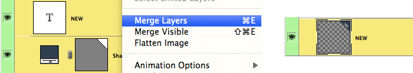
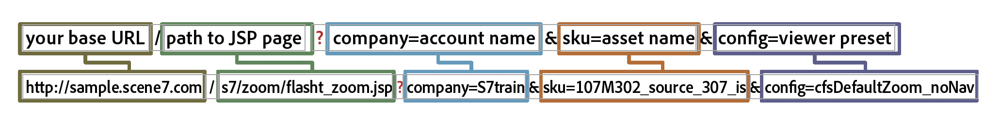

# Introducción a las plantillas básicas {#basic-templates}

En términos de Dynamic Media Classic, una plantilla es un documento que se puede cambiar dinámicamente mediante la dirección URL después de publicar la plantilla. Dynamic Media Classic ofrece plantillas básicas, plantillas basadas en imágenes llamadas desde el servidor de imágenes y que consisten en imágenes y texto procesado.

Uno de los aspectos más potentes de las plantillas es que tienen puntos de integración directos que le permiten vincularlos a su base de datos. Por lo tanto, no solo puede mostrar una imagen y cambiar su tamaño, sino que también puede consultar la base de datos para buscar elementos nuevos o de venta y hacer que aparezca como una superposición en la imagen. Puede solicitar una descripción del elemento y hacer que aparezca como una etiqueta en la fuente que elija y el diseño. Las posibilidades son ilimitadas.

Las plantillas básicas se pueden implementar de muchas maneras diferentes, desde simples a complejas. Por ejemplo:

- Comercialización básica. Utiliza etiquetas como &quot;envío gratuito&quot; si el producto tiene envío gratuito. El equipo de mercadotecnia de Photoshop configura estas etiquetas y la web utiliza la lógica para saber cuándo aplicarlas a la imagen.
- Comercialización avanzada. Cada plantilla tiene varias variables y puede mostrar más de una opción al mismo tiempo. Utiliza una base de datos, inventario y reglas comerciales para determinar cuándo mostrar un producto como &quot;Just In&quot;, &quot;Clearance&quot; o &quot;Sold Out&quot;. También puede utilizar la transparencia detrás del producto para mostrarlo en diferentes fondos, como en diferentes salas. Las mismas plantillas o recursos se pueden reutilizar en la página de detalles del producto para mostrar una versión más grande o ampliable del mismo producto en diferentes fondos.

Es importante comprender que Dynamic Media Classic solo proporciona la parte visual de estas aplicaciones basadas en plantillas. Las empresas de Dynamic Media Classic o sus socios de integración deben proporcionar las reglas comerciales, la base de datos y las habilidades de desarrollo para crear las aplicaciones. No hay ninguna aplicación de plantilla &quot;integrada&quot;; los diseñadores configuran la plantilla en Dynamic Media Classic y los desarrolladores utilizan las llamadas URL para cambiar las variables de la plantilla.

Al final de esta sección del tutorial, sabrá cómo:

- Cargue un PSD de Photoshop en Dynamic Media Classic para utilizarlo como base de una plantilla.
- Cree una plantilla básica de comercialización sencilla compuesta por capas de imagen.
- Añada capas de texto y haga que sean variables mediante el uso de parámetros.
- Construya una URL de plantilla y manipule la imagen de forma dinámica a través del explorador web.

>[!NOTE]
>
>Todas las direcciones URL de este capítulo tienen fines ilustrativos únicamente; no son vínculos en directo.

## Información general sobre plantillas básicas

La definición de una plantilla básica (o simplemente &quot;plantilla&quot;, para abreviar) es una imagen en capas direccionable por URL. El resultado final es una imagen, pero una que se puede modificar con la dirección URL. Puede consistir en fotos, texto o gráficos, cualquier combinación de recursos de TIFF P en Dynamic Media Classic.

Las plantillas son más similares a los archivos PSD de Photoshop, ya que tienen un flujo de trabajo similar y funciones similares.

- Ambas consisten en capas que son como hojas de acetato apilado. Puede componer imágenes parcialmente transparentes y ver a través de las áreas transparentes de una capa hasta las capas inferiores.
- Las capas se pueden mover y girar para cambiar la posición del contenido, y los modos de opacidad y fusión se pueden modificar para que el contenido sea parcialmente transparente.
- Puede crear capas basadas en texto. La calidad puede ser muy alta porque Image Server utiliza el mismo motor de texto que Photoshop y Illustrator.
- Se pueden aplicar estilos de capa simples a cada capa para crear efectos especiales, como sombras o resplandores.

Sin embargo, a diferencia de los PSD de Photoshop, las capas pueden ser completamente dinámicas y controladas mediante una URL en el servidor de imágenes.

- Puede agregar variables a todas las propiedades de la plantilla, lo que facilita el cambio de su composición sobre la marcha.
- Las variables denominadas parámetros permiten exponer únicamente la parte de la plantilla que desea cambiar.

Solo es necesario añadir un marcador de posición para cada capa que variará, en lugar de colocar todas las capas en un solo archivo como lo hace en Photoshop, y mostrarlas y ocultarlas (aunque también puede hacerlo, si lo prefiere).

Con un marcador de posición, puede intercambiar dinámicamente el contenido de una capa con otro recurso publicado, y automáticamente tomará las mismas propiedades (como tamaño y rotación) de la capa que reemplazó.

Dado que las plantillas básicas generalmente están diseñadas en Photoshop pero se implementan mediante una URL, un proyecto de plantilla requiere una combinación de habilidades técnicas y de diseño. Generalmente asumimos que la persona que hace el trabajo de plantilla creativa es un diseñador de Photoshop, y que la persona que implementa la plantilla es un desarrollador web. Los equipos creativos y de desarrollo deben colaborar estrechamente para que la plantilla tenga éxito.

Los proyectos de plantilla pueden ser relativamente sencillos o extremadamente complejos según las reglas comerciales y las necesidades de la aplicación. Las plantillas básicas se llaman desde el servidor de imágenes, pero debido a la flexibilidad del entorno de Dynamic Media Classic, puede incluso anidar plantillas dentro de otras plantillas, lo que le permite crear imágenes bastante complejas que se pueden vincular con variables con nombres comunes.

- Más información sobre [Conceptos básicos de plantilla](https://experienceleague.adobe.com/docs/dynamic-media-classic/using/template-basics/quick-start-template-basics.html).
- Obtenga información sobre cómo crear una [Plantilla básica](https://experienceleague.adobe.com/docs/dynamic-media-classic/using/template-basics/creating-template.html#creating_a_template).

## Creación de una plantilla básica

Cuando se trabaja con una plantilla básica, normalmente se siguen los pasos del flujo de trabajo en el diagrama siguiente. Los pasos marcados con líneas de puntos son opcionales si utiliza capas de texto dinámicas y se indican en las instrucciones siguientes como &quot;Flujo de trabajo de texto&quot;. Si no utiliza texto, siga la ruta principal solamente.

_Flujo de trabajo Plantilla básica ._

1. Diseñe y cree sus recursos. La mayoría de los usuarios lo hacen en Adobe Photoshop. Diseñe recursos con el tamaño exacto que necesite; si es una imagen de 200 píxeles para una página en miniatura, diseñe los recursos a 200 píxeles. Si necesita acercarlo, diseñarlo a un tamaño aproximado de 2000 píxeles. Utilice Photoshop (o Illustrator guardado como mapa de bits) para crear los recursos y utilice Dynamic Media Classic para ensamblar las piezas, administrar las capas y agregar variables.
2. Después de diseñar los recursos gráficos, cárguelos a Dynamic Media Classic. En lugar de cargar recursos individuales desde el PSD, le recomendamos que cargue todo el archivo del PSD en capas y que Dynamic Media Classic cree un archivo por capa, utilizando la variable **Mantener capas** en la carga (consulte a continuación para obtener más información). _Flujo de trabajo de texto: Si crea texto dinámico, cargue también las fuentes. El texto dinámico es variable y se controla mediante la dirección URL. Si el texto es estático o tiene solo unas pocas frases cortas que no cambian (por ejemplo, etiquetas que dicen &quot;Nuevo&quot; o &quot;Venta&quot;, en lugar de &quot;X% desactivado&quot;, siendo la X un número variable), le recomendamos que preprocese el texto en Photoshop y que lo cargue como capas rasterizadas como imágenes. Es más fácil y puede aplicar estilo al texto exactamente como desee._
3. Cree la plantilla en Dynamic Media Classic con el editor Conceptos básicos de plantilla del menú Generar y agregue capas de imagen. Flujo de trabajo de texto: Cree capas de texto en el mismo editor. Este paso es necesario cuando se crea una plantilla manualmente en Dynamic Media Classic. Elija un tamaño de lienzo que coincida con el diseño, arrastre y suelte imágenes en el lienzo y defina las propiedades de la capa (tamaño, rotación, opacidad, etc.). No está poniendo todas las capas posibles en la plantilla, solo un marcador de posición por capa de imagen. _Flujo de trabajo de texto: Las capas de texto se crean con la herramienta Texto , similar a la creación de capas de texto en Photoshop. Puede elegir una fuente y un estilo utilizando las mismas opciones disponibles con la herramienta Tipo de Photoshop._ Otro flujo de trabajo es cargar un PSD, hacer que Dynamic Media Classic genere una plantilla &quot;gratuita&quot; e incluso volver a crear capas de texto. Esto se analiza más adelante.
4. Una vez creadas las capas, agregue parámetros (variables) a cualquier propiedad de cualquier capa que desee controlar a través de la dirección URL, incluido el origen de la capa (la propia imagen ). _Flujo de trabajo de texto: También puede añadir parámetros a las capas de texto, tanto para controlar el contenido del texto, el tamaño y la posición de la propia capa, como también para todas las opciones de formato, como el color de fuente, el tamaño de fuente, el seguimiento horizontal, etc._
5. Cree un ajuste preestablecido de imagen que coincida con el tamaño de la plantilla. Se recomienda hacerlo de modo que siempre se llame a la plantilla con un tamaño de 1:1 y también para añadir nitidez a cualquier capa de imagen grande que se cambie de tamaño para ajustarse a la plantilla. Si está creando una plantilla para ampliar, este paso no es necesario.
6. Publique, copie la URL de la vista previa de Dynamic Media Classic y pruébela en un navegador.

## Preparación y carga de los recursos de plantilla en Dynamic Media Classic

Antes de cargar los recursos de las plantillas en Dynamic Media Classic, deberá realizar algunos pasos preparatorios.

### Preparación del PSD para la carga

Antes de cargar el archivo Photoshop en Dynamic Media Classic, simplifique las capas de Photoshop para que sea más fácil trabajar con y tener buena compatibilidad con el servidor de imágenes. El archivo PSD a menudo consta de muchos elementos que Dynamic Media Classic no reconoce y también puede terminar con muchos pequeños elementos que son difíciles de administrar. Asegúrese de guardar una copia de seguridad del PSD maestro en caso de que necesite editar posteriormente el original. La copia simplificada se cargará, y no la copia maestra.

1. Simplifique la estructura de la capa fusionando/aplanando las capas relacionadas que necesitan activarse/desactivarse juntas en una sola capa. Por ejemplo, la etiqueta &quot;NEW&quot; y el banner azul se combinan en una sola capa para que pueda mostrarlos u ocultarlos con un solo clic.
   
2. Dynamic Media Classic o Image Server no admiten algunos tipos de capas y efectos de capa y deben rasterizarse antes de la carga. De lo contrario, se podrían ignorar los efectos o se descartarían las capas. Rasterizar una capa significa convertir si se puede editar en no editable. Para rasterizar efectos de capa o capas de texto, cree una capa vacía, seleccione y fusile utilizando **Capas > Combinar capas** o CTRL + E/CMD + E.

   - Dynamic Media Classic no puede agrupar ni vincular capas. Todas las capas de un grupo o conjunto vinculado se convierten en capas independientes que ya no se agrupan ni vinculan.
   - Las máscaras de capa se convierten en transparencia durante la carga.
   - Las capas de ajuste no son compatibles y se descartan.
   - Las capas de relleno, como las capas de color sólido, se rasterizan.
   - Las capas de objetos inteligentes y las capas vectoriales se rasterizan en imágenes normales al cargarlas y los filtros inteligentes se aplican y rasterizan.
   - Las capas de texto también se rasterizarán a menos que utilice la opción Extraer texto (consulte a continuación para obtener más información).
   - La mayoría de los efectos de capa se ignoran y solo se admiten unos pocos modos de mezcla. En caso de duda, agregue efectos simples en Dynamic Media Classic (como sombras interiores o desplegables, resplandores interiores o exteriores) o utilice una capa en blanco para combinar y rasterizar el efecto en Photoshop.

### Uso de fuentes

También cargará y publicará las fuentes si necesita generar texto dinámico. La única fuente incluida con Dynamic Media Classic es Arial.

Cada empresa tiene la responsabilidad de obtener una licencia para utilizar una fuente en la web: simplemente tener una fuente instalada en su computadora no le da el derecho de utilizarla comercialmente en la web, y su empresa podría enfrentar acciones legales del editor de fuentes si se usa sin permiso. Además, los términos de licencia varían: es posible que necesite licencias independientes para imprimir frente a la visualización de pantalla, por ejemplo.

Dynamic Media Classic admite fuentes estándar de OpenType (OTF), TrueType (TTF) y Type 1 Postscript. Mac: no son compatibles las fuentes de maleta, los archivos de colección de tipos, las fuentes del sistema Windows y las fuentes de máquina propietarias (como las fuentes utilizadas por las máquinas de grabado o bordado); tendrá que convertirlas a uno de los formatos de fuente estándar o sustituirlas por una fuente similar en Dynamic Media Classic y en Image Server.

Después de cargar las fuentes en Dynamic Media Classic, como cualquier otro recurso, también deben publicarse en el servidor de imágenes. Un error de plantilla muy común es olvidar publicar las fuentes, lo que resultará en un error de imagen — Image Server no sustituirá otra fuente en su lugar. Además, si desea usar la variable **Extraer texto** al cargar, debe cargar los archivos de fuente antes de cargar el PSD que usa esas fuentes. La variable **Extraer texto** intentará recrear el texto como una capa de texto editable y colocarlo dentro de una plantilla de Dynamic Media Classic. Esto se analiza en el tema siguiente, Opciones del PSD.

Tenga en cuenta que las fuentes tienen varios nombres internos que a menudo difieren de sus nombres de archivo externos. Puede ver todos sus nombres diferentes en la página Detalles de ese recurso en Dynamic Media Classic. Estos son los nombres de la fuente Adobe Caslon Pro Semibold, que se enumeran en la pestaña Metadatos de Dynamic Media Classic:

_Ficha Metadatos de la página Detalles de una fuente en Dynamic Media Classic._

Dynamic Media Classic utiliza el nombre de archivo de esta fuente (ACaslonPro-Semibold) como su ID de recurso, pero ese no es el nombre que utiliza la plantilla. La plantilla utiliza el nombre Formato de texto enriquecido (RTF), que aparece en la parte inferior. RTF es el &quot;idioma&quot; nativo del motor de texto del servidor de imágenes.

Si necesita cambiar las fuentes a través de la URL, debe llamar al nombre RTF de la fuente (no al ID del recurso) o verá un error. En este caso, el nombre adecuado para esta fuente sería &quot;Adobe Caslon Pro&quot;. Discutiremos más sobre las fuentes y RTF en el tema RTF y Parámetros de texto, a continuación.

Los formatos de archivo de fuente más comunes que se encuentran en los sistemas Windows y Mac son OpenType y TrueType. OpenType tiene una extensión .OTF, mientras que TrueType es .TTF. Ambos formatos funcionan igual de bien en Dynamic Media Classic.

### Selección de opciones al cargar el PSD

No es necesario cargar un archivo Photoshop (PSD) para crear una plantilla; se puede crear una plantilla a partir de cualquier recurso de imagen en Dynamic Media Classic. Sin embargo, cargar un PSD puede facilitar la creación, ya que normalmente estos recursos ya están en un PSD en capas. Además, Dynamic Media Classic generará automáticamente una plantilla al cargar un PSD en capas.

- **Mantener capas.** Esta es la opción más importante. Esto le indica a Dynamic Media Classic que cree un recurso de imagen por capa de Photoshop. Si no está activada, todas las demás opciones se desactivan y el PSD se acopla en una sola imagen.
- **Crear** **Plantilla.** Esta opción toma las distintas capas generadas y crea automáticamente una plantilla combinándolas de nuevo. Un inconveniente de usar la plantilla generada automáticamente es que Dynamic Media Classic coloca todas las capas en un archivo, mientras que solo necesitamos un marcador de posición por capa. Es bastante fácil borrar las capas adicionales, pero si tienes muchas capas, es más rápido recrear las capas. Asegúrese de cambiar el nombre de la nueva plantilla; si no lo hace, se sobrescribirá la próxima vez que vuelva a cargar el mismo PSD.
- **Extraer texto.** De este modo, se vuelven a crear las capas de texto del PSD como capas de texto de la plantilla mediante la fuente que haya cargado. Este paso es necesario si el texto está en una ruta en Photoshop y desea mantener esa ruta en la plantilla. Esta función requiere que utilice la variable **Crear plantilla** , ya que el texto extraído solo se puede crear mediante una plantilla generada al cargar.
- **Amplíe las capas al tamaño del fondo.** Esta configuración hace que cada capa tenga el mismo tamaño que el lienzo del PSD general. Esto es muy útil para capas que siempre permanecerán fijas en posición: de lo contrario, al intercambiar imágenes en la misma capa, es posible que tenga que volver a colocarlas.
- **Nombre de capa.** Esto indica a Dynamic Media Classic cómo asignar un nombre a cada recurso generado por capa. Recomendamos: **Photoshop** **y Capa** **Nombre** o Photoshop y **Capa** **Número**. Ambas opciones utilizan el nombre del PSD como la primera parte del nombre y añaden el nombre o el número de la capa al final. Por ejemplo, si tiene un PSD llamado &quot;camiseta.psd&quot; y tiene capas denominadas &quot;anverso&quot;, &quot;mangas&quot; y &quot;cuello&quot;, si carga utilizando la variable **Photoshop y** Capa **Nombre** , Dynamic Media Classic generaría los ID de recurso &quot;camiseta_anverso&quot;, &quot;camisa_manga&quot; y &quot;cuello_camisa&quot;. El uso de una de estas opciones ayuda a garantizar que el nombre sea único en Dynamic Media Classic.

## Creación de una plantilla con capas de imagen

Aunque Dynamic Media Classic puede crear automáticamente una plantilla a partir de un PSD en capas, debe saber cómo crearla manualmente. Como se ha explicado anteriormente, en determinadas ocasiones no se desea utilizar la plantilla creada por Dynamic Media Classic.

### La IU de conceptos básicos de plantilla

Primero familiaricémonos con la interfaz de edición.

En el centro izquierdo se encuentra el área de trabajo que muestra una previsualización de la plantilla final. A la derecha están los paneles Capas y Propiedades de capa. Estas áreas son donde usted está haciendo más trabajo.

_Generar base de plantilla ._

- **Área de trabajo/vista previa.** Esta es la ventana principal. Aquí puede mover, cambiar el tamaño y rotar capas con el ratón. Los contornos de capa se muestran como líneas discontinuas.
- **Capas.** Esto es similar al panel capas de Photoshop. A medida que añada capas a la plantilla, aparecerán aquí. Las capas se apilan de arriba a abajo: la capa superior del panel Capas se ve encima de las demás debajo de ella en la lista.
- **Propiedades de capa.** Aquí puede ajustar todas las propiedades de una capa mediante controles numéricos. Seleccione primero una capa y, a continuación, ajuste sus propiedades.
- **Compuesto** **URL.** En la parte inferior de la interfaz de usuario está el área de la URL compuesta . Esto no se discutirá en esta sección del tutorial, pero aquí podrá ver la plantilla deconstruida como una serie de modificadores de URL de servicio de imágenes. Esta área es editable; si está muy familiarizado con los comandos de Image Server, puede editar manualmente la plantilla aquí. Sin embargo, también puede romperlo. Al igual que Photoshop, la numeración de capas comienza en 0. El lienzo es la capa 0, y la primera capa que agrega usted mismo es la capa 1. Los modos de fusión determinan cómo se fusionan los píxeles de una capa con los píxeles situados debajo de ella. Puede crear una variedad de efectos especiales utilizando los modos de fusión.

#### Uso del Editor de conceptos básicos de plantilla

Estos son los pasos del flujo de trabajo para iniciar la plantilla básica:

1. En Dynamic Media Classic, vaya a **Generar > Conceptos básicos de plantillas**. Puede no tener nada seleccionado o empezar por seleccionar una imagen, que se convierte en la primera capa de la plantilla.
2. Elija un tamaño y pulse **OK**. Este tamaño debe coincidir con el tamaño que haya diseñado en Photoshop. Se cargará el editor de plantillas.
3. Si no ha seleccionado una imagen en el paso 1, busque o busque una imagen en el panel de recursos de la izquierda y arrástrela al área de trabajo.

   - La imagen cambiará de tamaño automáticamente para adaptarse al tamaño del lienzo. Si planea intercambiar sus imágenes de alta resolución, entonces normalmente traerá una de sus grandes imágenes TIFF P (2000 px) y la utilizará como marcador de posición.
   - Debe ser la capa inferior de la plantilla, aunque puede reordenar las capas más adelante.

4. Cambie el tamaño o la posición de la capa directamente en el área de trabajo o ajustando la configuración del panel Propiedades de la capa.
5. Arrastre las capas de imagen adicionales según sea necesario. Añada efectos de capas si lo desea. Consulte el tema _Adición de efectos de capa_, más abajo.
6. Haga clic en **Guardar**, elija una ubicación y asígnele un nombre. Puede obtener una vista previa, pero en este momento la plantilla se verá exactamente igual que una imagen de Photoshop plana; aún no se puede cambiar.

### Adición de efectos de capa

Image Server soporta algunos efectos de capa programáticos, efectos especiales que cambian el aspecto del contenido de una capa. Funcionan de manera similar a los efectos de capa en Photoshop. Están unidos a una capa pero controlados independientemente de la capa. Puede ajustarlos o eliminarlos sin realizar un cambio permanente en la capa misma.

- **Sombra paralela**. Aplica una sombra fuera de los límites de la capa, colocada por un desplazamiento de píxeles x e y.
- **Sombra interna**. Aplica una sombra dentro de los límites de la capa, colocada por un desplazamiento de píxeles x e y.
- **Resplandor exterior**. Aplica un efecto de resplandor uniformemente alrededor de todos los bordes de la capa.
- **Resplandor interior**. Aplica un efecto de resplandor uniformemente dentro de todos los bordes de la capa.

_Una capa con y sin una sombra paralela_

Para añadir un efecto, haga clic en **Añadir efecto** y elija un efecto en el menú. Al igual que las capas normales, puede seleccionar un efecto en el panel Capas y utilizar el panel Propiedades de la capa para ajustar su configuración.

Los efectos de sombra se desplazan horizontal o verticalmente fuera de la capa, mientras que los efectos de resplandor se aplican uniformemente en todas las direcciones. Los efectos interiores actúan sobre las partes opacas de la capa, mientras que los efectos exteriores solo afectan a las áreas transparentes.

Más información sobre[Adición de efectos de capa](https://experienceleague.adobe.com/docs/dynamic-media-classic/using/template-basics/creating-template.html#using-shadow-and-glow-effects-on-layers).

### Adición de parámetros

Si todo lo que hace es combinar capas y guardarlas, el resultado neto no es diferente de una imagen Photoshop plana. Lo que hace que las plantillas sean especiales es la capacidad de agregar parámetros a las propiedades de cada capa para que se puedan cambiar dinámicamente a través de la dirección URL.

En términos de Dynamic Media Classic, un parámetro es una variable que puede vincularse a una propiedad de plantilla para que se pueda manipular mediante una dirección URL. Cuando agrega un parámetro a una capa, Dynamic Media Classic expone esa propiedad en la dirección URL marcando como prefijo el nombre del parámetro con un signo de dólar ($); por ejemplo, si crea un parámetro llamado &quot;size&quot; para cambiar el tamaño de una capa, Dynamic Media Classic cambiará el nombre del parámetro $size.

Si no agrega un parámetro para una propiedad, esa propiedad permanece oculta en la base de datos de Dynamic Media Classic y no aparece en la dirección URL.

Sin parámetros, las direcciones URL suelen ser mucho más largas, especialmente si también utiliza texto dinámico. El texto agrega decenas de caracteres adicionales a cada URL.

Finalmente, el conjunto inicial de parámetros se convierte en los valores predeterminados de las propiedades en la plantilla. Si crea la plantilla, agrega parámetros y luego llama a la URL sin sus parámetros, el Servidor de imágenes creará la imagen con todos los valores predeterminados que guardó en la plantilla. Los parámetros solo son necesarios si desea cambiar una propiedad. Si no es necesario cambiar una propiedad, no es necesario establecer un parámetro.

#### Creación de parámetros

Este es el flujo de trabajo para crear parámetros:

1. Haga clic en el **Parámetros** situado junto al nombre de la capa para la que desea crear parámetros. Se abre la pantalla Parámetros. Enumera cada propiedad de la capa y su valor.
1. Seleccione el **Activado** junto al nombre de cada propiedad que desea convertir en un parámetro. Aparecerá un nombre de parámetro predeterminado. Solo puede agregar parámetros a propiedades que han cambiado de su estado predeterminado.

   - Por ejemplo, si agrega una capa y la mantiene en su posición xy predeterminada de 0,0, Dynamic Media Classic no expondrá una **Posición** propiedad. Para arreglarlo, mueva la capa al menos un píxel. Ahora Dynamic Media Classic lo expondrá **Posición** como propiedad, puede parametrizar.
   - Para añadir un parámetro a la propiedad show/hide (que activa y desactiva la capa ), haga clic en el botón **Show** o **Ocultar capa** para desactivar la capa (puede volver a activarla posteriormente si lo desea). Dynamic Media Classic ahora mostrará un **Ocultar** propiedad que se puede parametrizar.

1. Cambie el nombre de los parámetros predeterminados por otro que sea más fácil de identificar en la dirección URL. Por ejemplo, si desea agregar un parámetro para cambiar la capa del banner sobre una imagen, cambie el nombre predeterminado de &quot;layer_2_src&quot; a &quot;banner&quot;.
1. Press **Cerrar** para salir de la pantalla Parámetros.
1. Repita este proceso para otras capas haciendo clic en el botón **Parámetros** y agregar y cambiar el nombre de los parámetros.
1. Guarde los cambios cuando termine.

>[!TIP]
>
>Cambie el nombre de los parámetros por otro que sea significativo y desarrolle una convención de nombres para estandarizar esos nombres. Asegúrese de que los equipos de diseño y desarrollo acuerden de antemano la convención de nomenclatura.
>
>¿No puede agregar un parámetro porque no ve la propiedad? Simplemente cambie la propiedad de la capa de su valor predeterminado (moviendo, cambiando el tamaño, ocultando, etc.). Ahora debería ver esa propiedad expuesta.

Más información sobre [Parámetros de plantilla](https://experienceleague.adobe.com/docs/dynamic-media-classic/using/template-basics/creating-template-parameters.html).

## Creación de una plantilla con capas de texto

Ahora aprenderá a crear una plantilla básica que incluya capas de texto.

### Explicación del texto dinámico

Ahora sabe cómo crear una plantilla básica usando capas de imagen. Para muchas aplicaciones esto es todo lo que necesita. Como se ha visto en el ejercicio anterior, las capas que tienen texto simple (como &quot;Venta&quot; y &quot;Nuevo&quot;) pueden rasterizarse y tratarse como imágenes porque su texto no necesita cambiar.

Sin embargo, ¿qué sucede si es necesario:

- Agregue una etiqueta para indicar &quot;25 % de descuento&quot;, con el valor de 25 % como variable
- Agregue una etiqueta de texto con el nombre del producto sobre la imagen
- Localice las capas en diferentes idiomas según el país en el que se vea la plantilla

En ese caso, desearía añadir algunas capas de texto dinámicas con parámetros para controlar el texto o el formato.

Para crear texto, debe cargar algunas fuentes; de lo contrario, Dynamic Media Classic pasará a Arial de forma predeterminada. Las fuentes también deben publicarse en el Image Server o generarán un error en el momento en que intente procesar cualquier texto que utilice esa fuente.

### RTF y parámetros de texto

Para agregar variables al texto con la herramienta Conceptos básicos de plantilla , debe comprender cómo se representa el texto. El servidor de imágenes genera texto utilizando el motor de texto de Adobe, el mismo motor utilizado por Photoshop y Illustrator, y lo compone como una capa en la imagen final. Para comunicarse con el motor, el servidor de imágenes utiliza el formato de texto enriquecido o RTF.

RTF es una especificación de formato de archivo desarrollada por Microsoft para especificar el formato de los documentos. Es un lenguaje de marcado estándar utilizado por la mayoría de los programas de procesamiento de textos y correo electrónico. Si escribió en una URL &amp;text=\b1 Hola, Image Server generaría una imagen con la palabra &quot;Hello&quot; en negrita, porque \b1 es el comando RTF para poner el texto en negrita.

La buena noticia es que Dynamic Media Classic genera el RTF por usted. Siempre que escriba texto en una plantilla y añada formato, Dynamic Media Classic escribirá discretamente el código RTF en la plantilla automáticamente. La razón por la que lo mencionamos es porque está agregando parámetros directamente al propio RTF, por lo que es importante que esté un poco familiarizado con él.

#### Creación de capas de texto

Puede crear capas de texto en una plantilla en Dynamic Media Classic de las dos formas siguientes:

1. Herramienta Texto en Dynamic Media Classic. Discutiremos este método a continuación. El editor Conceptos básicos de plantilla tiene una herramienta que permite crear un cuadro de texto, introducir texto y dar formato al texto. Dynamic Media Classic genera el RTF según sea necesario y lo coloca en una capa independiente.
2. Extraer texto (al cargarlo). El otro método es crear la capa de texto en Photoshop y guardarla en el PSD como una capa de texto normal (en lugar de rasterizarla como una capa de imagen). A continuación, cargue el archivo en Dynamic Media Classic y use la variable **Extraer texto** . Dynamic Media Classic convertirá cada capa de texto de Photoshop en una capa de texto de servicio de imágenes mediante comandos RTF. Si utiliza este método, asegúrese de cargar primero las fuentes en Dynamic Media Classic; de lo contrario, Dynamic Media Classic sustituirá la fuente predeterminada al cargarla y no hay forma fácil de volver a sustituir la fuente correcta.

### Editor de texto

El texto se introduce mediante el Editor de texto. El Editor de texto es una interfaz WYSIWYG que permite introducir y dar formato al texto utilizando controles de formato similares a los de Photoshop o Illustrator.

_Editor de texto de funciones básicas de plantilla._

Hará la mayor parte de su trabajo en la **Vista previa** , que permite introducir texto y verlo mostrado como se verá en la plantilla. También hay un **Fuente** , que se utiliza para editar manualmente el RTF, si es necesario.

El flujo de trabajo general es utilizar la variable **Vista previa** para escribir texto.

A continuación, seleccione el texto y elija algún formato, como color de fuente, tamaño de fuente o justificación, utilizando los controles de la parte superior. Una vez que el texto tenga el estilo que desee, haga clic en **Aplicar** para verlo actualizado en la vista previa del área de trabajo. A continuación, cierre el Editor de texto para volver a la ventana principal Conceptos básicos de plantilla .

#### Uso del Editor de texto

Estos son los pasos del flujo de trabajo para agregar texto dentro de la página de compilación Conceptos básicos de plantilla :

1. Haga clic en el **Texto** botón de herramienta en la parte superior de la página de compilación.
2. Arrastre un cuadro de texto donde desee que aparezca el texto. Se abrirá la ventana Editor de texto en una ventana modal. En segundo plano, verá la plantilla, aunque no se podrá editar hasta que termine de editar el texto.
3. Escriba el texto de ejemplo que desea que aparezca cuando la plantilla se cargue por primera vez. Por ejemplo, si está creando un cuadro de texto para una imagen de correo electrónico personalizada, su texto podría indicar &quot;Nombre de alta. ¡Ahora es el momento de ahorrar!&quot; Posteriormente, agregaría un parámetro de texto para reemplazar Nombre por un valor que enviara en la dirección URL. El texto no aparecerá en la plantilla situada debajo de la ventana hasta que haga clic en **Aplicar**.
4. Para dar formato al texto, selecciónelo arrastrando con el ratón y elija un control de formato en la interfaz de usuario.

   - Hay muchas opciones de formato. Algunos de los más comunes son fuente (cara), tamaño de fuente y color de fuente, así como justificación izquierda/centro/derecha.
   - No olvide seleccionar primero el texto. De lo contrario, no podrá aplicar ningún formato.
   - Para elegir una fuente diferente, asegúrese de seleccionar el texto y abrir el menú Fuente. El editor mostrará una lista de todas las fuentes cargadas en Dynamic Media Classic. Si también hay una fuente instalada en el equipo, aparecerá en negro. Si no está instalado en el equipo, se mostrará en rojo. Sin embargo, se seguirá procesando en la ventana de vista previa cuando haga clic en **Aplicar**. Solo es necesario cargar fuentes en Dynamic Media Classic para que estén disponibles para cualquier usuario que utilice Dynamic Media Classic. Una vez que publique, el Image Server utilizará esas fuentes para generar el texto; los usuarios no necesitan instalar ninguna fuente para ver el texto que cree porque forma parte de una imagen.
   - A diferencia de Photoshop y Illustrator, Image Server puede alinear el texto verticalmente en el cuadro de texto. El valor predeterminado es la alineación superior. Para cambiar esto, seleccione el texto y elija **Middle** o **Inferior** de la variable **Alineación vertical** para abrir el Navegador.
   - Si hace que el texto sea demasiado grande para el cuadro (o si el cuadro de texto es demasiado pequeño), todo o parte de él se recortará y desaparecerá. Reduzca el tamaño de fuente o haga que el cuadro sea más grande.

5. Haga clic en **Aplicar** para ver que los cambios surten efecto en la ventana del área de trabajo. Debe hacer clic en **Aplicar**, o si no, se pierden las ediciones.
6. Cuando haya terminado, haga clic en **Cerrar**. Si desea volver al modo de edición, haga doble clic en la capa de texto para volver a abrir el Editor de texto.

El editor de texto previsualiza exactamente el tamaño de la fuente si la tiene instalada localmente en el sistema.

### Acerca de la adición de parámetros a capas de texto

Ahora seguimos un proceso similar para añadir parámetros de texto, como hicimos con los parámetros de capa. Las capas de texto también pueden utilizar parámetros de capa para el tamaño, la posición, etc. sin embargo, pueden tomar parámetros adicionales que le permiten controlar cualquier aspecto de RTF.

A diferencia de los parámetros de capa, solo se selecciona el valor que se desea cambiar y se agrega un parámetro a él en lugar de agregarlo a toda la propiedad.

Ejemplo de RTF:

Al examinar el RTF, debe averiguar dónde está cada configuración que desea cambiar. En el RTF de arriba, parte de esto puede tener sentido y puede ver de dónde viene el formato.

Pueden ver la frase Sandal de la Casa de la Moneda de Chocolate — ese es el texto en sí.

- Hay una referencia a la fuente Richard pobre — aquí es donde se seleccionan las fuentes.
- Puede ver un valor de RGB: \red56\green53\blue4 — este es el color del texto.
- Aunque el tamaño de fuente es de 20, no se ve el número 20. Sin embargo, sí que ve un comando \fs40 — por alguna extraña razón, RTF mide las fuentes como puntos medios. Por lo tanto, \fs40 es el tamaño de fuente.

Tiene suficiente información para crear los parámetros, pero hay una referencia completa de todos los comandos RTF en la documentación de Image Serving. Visite la [Documentación de servicio de imágenes](https://experienceleague.adobe.com/docs/dynamic-media-developer-resources/image-serving-api/image-serving-api/http-protocol-reference/text-formatting/c-text-formatting.html#concept-0d3136db7f6f49668274541cd4b6364c).

#### Añadir parámetros a capas de texto

A continuación se indican los pasos para añadir parámetros a las capas de texto.

1. Haga clic en el **Parámetros** botón (una &quot;P&quot;) junto al nombre de la capa de texto para la que desea crear parámetros. Se abre la pantalla Parámetros. La variable **Frecuentes** La pestaña enumera cada propiedad de la capa y su valor. Aquí puede añadir parámetros de capa normales.
1. Haga clic en el **Texto** pestaña . Aquí puede ver el RTF en la parte superior; los parámetros que agregue se encuentran debajo de eso.
1. Para añadir un parámetro, primero resalte el valor que desee cambiar y haga clic en el botón **Agregar parámetro** botón. Asegúrese de seleccionar solamente los valores para los comandos y no el comando completo en sí. Por ejemplo, para configurar un parámetro para el nombre de fuente en el RTF de muestra anterior, solo resaltaría &quot;Richard pobre&quot; y agregaría un parámetro a él, pero no también el &quot;\f0&quot;. Al hacer clic en **Agregar parámetro** , aparece en la lista siguiente y el valor del parámetro aparece en rojo en el RTF mientras sigue seleccionado. Si necesita eliminar un parámetro, haga clic en la casilla de verificación situada junto a **Activado** para desactivar ese parámetro y desaparece.
1. Haga clic en para cambiar el nombre del parámetro a un nombre más significativo.
1. Cuando haya terminado, el RTF se resalta en verde donde existen parámetros y los nombres y valores de los parámetros se enumeran a continuación.
1. Haga clic en **Cerrar** para salir de la pantalla Parámetros. A continuación, pulse **Guardar** , para guardar la plantilla. Si ha terminado de editar, pulse **Cerrar** para salir de la página Conceptos básicos de plantilla .
1. Haga clic en **Vista previa** para probar la plantilla en Dynamic Media Classic. Para probar los parámetros de texto, escriba el texto nuevo o los valores nuevos en la ventana de vista previa. Para cambiar la fuente, debe escribir el nombre RTF exacto de la fuente.

>[!TIP]
>
>Para agregar parámetros al color del texto, agregue por separado parámetros para rojo, verde y azul. Por ejemplo, si el RTF es `\red56\green53\blue46`, agregaría parámetros rojos, verdes y azules independientes para los valores 56, 53 y 46. En la URL, cambiaría el color llamando a las tres: `&$red=56&$green=53&$blue=46`.

Obtenga información sobre cómo [Crear parámetros de texto dinámico](https://experienceleague.adobe.com/docs/dynamic-media-classic/using/template-basics/creating-template-parameters.html#creating-dynamic-text-parameters).

## Publicación y creación de direcciones URL de plantilla

### Crear un ajuste preestablecido de imagen

La creación de un ajuste preestablecido para la plantilla no es un paso necesario. Se recomienda hacerlo como práctica recomendada, de modo que siempre se llame a la plantilla con un tamaño de 1:1 y también para añadir nitidez a cualquier capa de imagen grande que se cambie de tamaño para ajustarse a la plantilla. Si llama a una imagen sin un ajuste preestablecido, el servidor de imágenes puede cambiar arbitrariamente el tamaño de la imagen al tamaño predeterminado (unos 400 píxeles) y no aplicará el enfoque predeterminado.

No hay nada especial en un ajuste preestablecido de imagen para una plantilla. Si ya tiene un ajuste preestablecido para una imagen estática del mismo tamaño, puede utilizarlo en su lugar.

### Publicación

Deberá ejecutar una publicación para ver los cambios insertados en el servidor de imágenes. Tenga en cuenta lo que debe publicarse: las distintas capas de recursos de imagen, las fuentes para el texto dinámico y la propia plantilla. Al igual que otros recursos de medios enriquecidos de Dynamic Media Classic, como Conjuntos de imágenes y Conjuntos de giros, una plantilla básica es una construcción artificial, es un elemento de línea en la base de datos que hace referencia a las imágenes y fuentes utilizando una serie de comandos de servicio de imágenes. Por lo tanto, cuando publica la plantilla, todo lo que hace es actualizar los datos en el servidor de imágenes.

Más información sobre [Publicación de la plantilla](https://experienceleague.adobe.com/docs/dynamic-media-classic/using/template-basics/publishing-templates.html).

### Construcción de URL de plantilla

Una plantilla básica tiene la misma sintaxis de URL esencial que una llamada de imagen normal, tal como se explicó anteriormente. Una plantilla suele tener más modificadores (comandos separados por un signo &amp;)), como parámetros con valores. Sin embargo, la diferencia principal es que llama a la plantilla como imagen principal, en lugar de llamar a una imagen estática.

A diferencia de los ajustes preestablecidos de imagen, que tienen un signo de dólar ($) a cada lado del nombre del ajuste preestablecido, los parámetros tienen un único signo de dólar al principio. La colocación de esos signos de dólar es importante.

**Correcto:**

`$text=46-inch LCD HDTV`

**Incorrecto:**

`$text$=46-inch LCD HDTV`

`$text=46-inch LCD HDTV$`

`text=46-inch LCD HDTV`

Como se ha señalado anteriormente, se utilizan parámetros para cambiar la plantilla. Si llama a la plantilla sin parámetros, volverá a su configuración predeterminada, tal y como se ha diseñado en la herramienta de creación Conceptos básicos de plantilla . Si no es necesario cambiar una propiedad, no es necesario establecer un parámetro.

_Ejemplos de una plantilla sin configurar parámetros (arriba) y con parámetros (abajo)._
