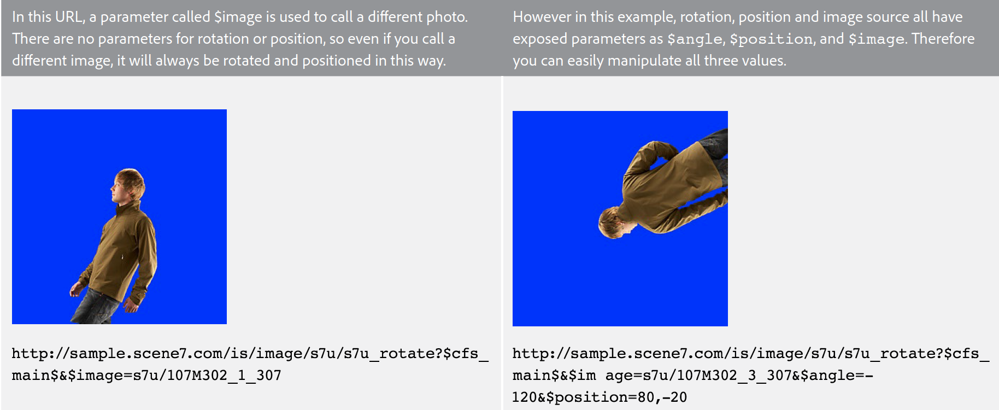

# Introducción a las plantillas básicas {#basic-templates}

En términos de Dynamic Media Classic, una plantilla es un documento que se puede cambiar dinámicamente a través de la dirección URL después de publicar la plantilla. Dynamic Media Classic ofrece plantillas básicas, plantillas basadas en imágenes llamadas desde el servidor de imágenes y que constan de imágenes y texto procesado.

Uno de los aspectos más sólidos de las plantillas es que tienen puntos de integración directos que le permiten vincularlas a la base de datos. Por lo tanto, no solo puede servir una imagen y cambiar su tamaño, sino que puede consultar la base de datos para encontrar elementos nuevos o de venta y hacer que aparezcan como una superposición en la imagen. Puede solicitar una descripción del elemento y hacer que aparezca como una etiqueta en la fuente que elija y el diseño. Las posibilidades son ilimitadas.

Las plantillas básicas se pueden implementar de muchas maneras diferentes, desde simples hasta complejas. Por ejemplo:

- Comercialización básica. Utiliza etiquetas como &quot;envío gratuito&quot; si ese producto tiene envío gratuito. Estas etiquetas las configura el equipo de comercialización de Photoshop y la web utiliza la lógica para saber cuándo aplicarlas a la imagen.
- Comercialización avanzada. Cada plantilla tiene varias variables y puede mostrar más de una opción al mismo tiempo. Utiliza una base de datos, un inventario y reglas empresariales para determinar cuándo se debe mostrar un producto como &quot;Just In&quot;, &quot;Clearance&quot; o &quot;Sold Out&quot;. También puede utilizar la transparencia detrás del producto para mostrarlo en diferentes fondos, como en diferentes habitaciones. Las mismas plantillas o activos se pueden reutilizar en la página de detalles del producto para mostrar una versión más grande o ampliable del mismo producto en diferentes fondos.

Es importante comprender que Dynamic Media Classic solo proporciona la parte visual de estas aplicaciones basadas en plantillas. Las empresas de Dynamic Media Classic o sus socios de integración deben proporcionar las reglas empresariales, la base de datos y las habilidades de desarrollo para crear las aplicaciones. No hay ninguna aplicación de plantilla &quot;integrada&quot;; los diseñadores configuran la plantilla en Dynamic Media Classic y los desarrolladores utilizan llamadas de URL para cambiar las variables de la plantilla.

Al final de esta sección del tutorial, sabrá cómo hacer lo siguiente:

- Cargue un PSD de Photoshop en Dynamic Media Classic para utilizarlo como base de una plantilla.
- Crear una plantilla básica de comercialización sencilla que consta de capas de imagen.
- Añada capas de texto y conviértalas en variables mediante el uso de parámetros.
- Construya una URL de plantilla y manipule la imagen dinámicamente a través del explorador web.

>[!NOTE]
>
>Todas las direcciones URL de este capítulo son solo ilustrativas; no son vínculos activos.

## Descripción general de las plantillas básicas

La definición de una plantilla básica (o simplemente &quot;plantilla&quot;, para abreviar) es una imagen con capas a las que se puede dirigir mediante URL. El resultado final es una imagen, pero una que la dirección URL puede modificar. Puede constar de fotos, texto o gráficos, cualquier combinación de recursos de TIFF P en Dynamic Media Classic.

Las plantillas son más similares a los archivos de PSD de Photoshop, ya que tienen un flujo de trabajo similar y funcionalidades similares.

- Ambas consisten en capas que son como hojas de acetato apiladas. Puede componer imágenes parcialmente transparentes y ver a través de las áreas transparentes de una capa hasta las capas inferiores.
- Las capas se pueden mover y girar para cambiar la posición del contenido, y los modos de opacidad y fusión se pueden modificar para que el contenido sea parcialmente transparente.
- Puede crear capas basadas en texto. La calidad puede ser muy alta porque el servidor de imágenes utiliza el mismo motor de texto que Photoshop y Illustrator.
- Se pueden aplicar estilos de capa simples a cada capa para crear efectos especiales como sombras paralelas o resplandores.

Sin embargo, a diferencia de los PSD de Photoshop, las capas pueden ser completamente dinámicas y controladas mediante una URL en el servidor de imágenes.

- Puede añadir variables a todas las propiedades de la plantilla, lo que facilita el cambio de su composición sobre la marcha.
- Las variables denominadas parámetros permiten exponer únicamente la parte de la plantilla que desea cambiar.

Solo es necesario añadir un marcador de posición para cada capa que vaya a variar, en lugar de colocar todas las capas en un solo archivo como se hace en Photoshop y mostrarlas y ocultarlas (aunque también puede hacerlo, si lo prefiere).

Con un marcador de posición, puede intercambiar dinámicamente el contenido de una capa con otro recurso publicado y éste adoptará automáticamente las mismas propiedades (como el tamaño y la rotación) de la capa que reemplazó.

Dado que las plantillas básicas suelen diseñarse en Photoshop pero se implementan mediante una dirección URL, un proyecto de plantilla requiere una combinación de habilidades técnicas y de diseño. Generalmente, suponemos que la persona que realiza el trabajo de creación de plantillas es un diseñador de Photoshop y que la persona que lo implementa es un desarrollador web. Los equipos creativos y de desarrollo deben trabajar en estrecha colaboración para que la plantilla tenga éxito.

Los proyectos de plantilla pueden ser relativamente simples o extremadamente complejos según las reglas y necesidades empresariales de la aplicación. Las plantillas básicas se llaman desde el servidor de imágenes; sin embargo, debido a la flexibilidad del entorno de Dynamic Media Classic, incluso puede anidar plantillas dentro de otras plantillas, lo que le permite crear imágenes bastante complejas que se pueden vincular mediante variables con nombres comunes.

- Más información sobre [Conceptos básicos de plantilla](https://experienceleague.adobe.com/docs/dynamic-media-classic/using/template-basics/quick-start-template-basics.html).
- Obtenga información sobre cómo crear un [Plantilla básica](https://experienceleague.adobe.com/docs/dynamic-media-classic/using/template-basics/creating-template.html#creating_a_template).

## Creación de una plantilla básica

Cuando se trabaja con una plantilla básica, normalmente se siguen los pasos de flujo de trabajo del diagrama siguiente. Los pasos marcados con líneas de puntos son opcionales si utiliza capas de texto dinámico y se indican en las instrucciones siguientes como &quot;Flujo de trabajo de texto&quot;. Si no utiliza texto, siga únicamente la ruta principal.

_Flujo de trabajo Plantilla básica._

1. Diseñe y cree sus recursos. La mayoría de los usuarios lo hacen en Adobe Photoshop. Diseñe recursos con el tamaño exacto que necesite: si se trata de una imagen de 200 píxeles para una página en miniatura, diseñe a 200 píxeles. Si necesita hacer zoom, diseñe un tamaño de aproximadamente 2000 píxeles. Utilice Photoshop (o Illustrator guardados como mapa de bits) para crear los recursos y utilice Dynamic Media Classic para ensamblar las piezas, administrar las capas y agregar variables.
2. Después de diseñar los recursos gráficos, cárguelos en Dynamic Media Classic. En lugar de cargar recursos individuales desde el PSD, le recomendamos que cargue todo el archivo de PSD con capas y pida a Dynamic Media Classic que cree un archivo por capa, utilizando **Mantener capas** opción al cargar (consulte más abajo para obtener más información). _Flujo de trabajo de texto: si crea texto dinámico, cargue también sus fuentes. El texto dinámico es variable y se controla mediante la dirección URL. Si el texto es estático o sólo contiene unas pocas frases cortas que no cambian (por ejemplo, etiquetas que dicen &quot;Nuevo&quot; o &quot;Venta&quot; en lugar de &quot;X% de descuento&quot;, siendo la X un número variable), le recomendamos que procese previamente el texto en Photoshop y que lo cargue como capas rasterizadas en forma de imágenes. Es más fácil y puede aplicar estilo al texto exactamente como desee._
3. Cree la plantilla en Dynamic Media Classic con el editor Conceptos básicos de plantilla del menú Generar y agregue capas de imagen. Flujo de trabajo de texto: cree capas de texto en el mismo editor. Este paso es necesario cuando se crea una plantilla manualmente en Dynamic Media Classic. Elija un tamaño de lienzo que coincida con su diseño, arrastre y suelte las imágenes en el lienzo y establezca las propiedades de la capa (tamaño, rotación, opacidad, etc.). No está colocando todas las capas posibles en la plantilla, solo un marcador de posición por capa de imagen. _Flujo de trabajo de texto: las capas de texto se crean con la herramienta Texto, de forma similar a la creación de capas de texto en Photoshop. Puede elegir una fuente y aplicarle un estilo con las mismas opciones disponibles con la herramienta Texto de Photoshop._ Otro flujo de trabajo es cargar un PSD y hacer que Dynamic Media Classic genere una plantilla &quot;libre&quot;, e incluso puede volver a crear capas de texto. Esto se analiza con más detalle más adelante.
4. Una vez creadas las capas, añada parámetros (variables) a cualquier propiedad de cualquier capa que desee controlar a través de la dirección URL, incluido el origen de la capa (la propia imagen ). _Flujo de trabajo de texto: También puede añadir parámetros a las capas de texto, tanto para controlar el contenido del texto como el tamaño y la posición de la propia capa, así como todas las opciones de formato como el color de fuente, el tamaño de fuente, el seguimiento horizontal, etc._
5. Cree un ajuste preestablecido de imagen que coincida con el tamaño de la plantilla. Se recomienda hacerlo para que la plantilla siempre se llame en un tamaño 1:1 y también para agregar enfoque a cualquier capa de imagen grande que se ajuste al tamaño de la plantilla. Si está creando una plantilla a la que ampliar, este paso no es necesario.
6. Publique, copie la dirección URL de la vista previa de Dynamic Media Classic y pruébela en un explorador.

## Preparación y carga de recursos de plantilla en Dynamic Media Classic

Antes de cargar los recursos de plantilla en Dynamic Media Classic, deberá completar algunos pasos preparatorios.

### Preparación del PSD para la carga

Antes de cargar el archivo de Photoshop en Dynamic Media Classic, simplifique las capas en Photoshop para que sea más fácil trabajar con el servidor de imágenes y lograr la máxima compatibilidad con él. El archivo de PSD a menudo constará de muchos elementos que Dynamic Media Classic no reconoce y también puede terminar con muchos fragmentos pequeños difíciles de administrar. Asegúrese de guardar una copia de seguridad del PSD maestro en caso de que necesite editar posteriormente el original. Cargará la copia simplificada, y no la maestra.

1. Simplifique la estructura de capas combinando o aplanando capas relacionadas que necesitan activarse o desactivarse juntas en una sola capa. Por ejemplo, la etiqueta &quot;NUEVO&quot; y el banner azul se combinan en una sola capa para que pueda mostrarlos u ocultarlos con un solo clic.
   
2. Algunos tipos de capas y efectos de capa no son compatibles con Dynamic Media Classic ni con el servidor de imágenes y deben rasterizarse antes de la carga. De lo contrario, los efectos podrían ignorarse o descartarse las capas. Rasterizar una capa significa convertir si se puede editar a si no se puede editar. Para rasterizar efectos de capa o capas de texto, cree una capa vacía, seleccione y combine mediante **Capas > Combinar capas** o CTRL + E/CMD + E.

   - Dynamic Media Classic no puede agrupar ni vincular capas. Todas las capas de un grupo o conjunto vinculado se convierten en capas independientes que ya no se agrupan ni vinculan.
   - Las máscaras de capa se convierten en transparencias al cargar.
   - Las capas de ajuste no son compatibles y se descartan.
   - Las capas de relleno, como las capas de Color sólido, se rasterizan.
   - Las capas de objetos inteligentes y las capas vectoriales se rasterizan en imágenes normales al cargar y los filtros inteligentes se aplican y rasterizan.
   - Las capas de texto también se rasterizarán a menos que utilice la opción Extraer texto (consulte a continuación para obtener más información).
   - La mayoría de los efectos de capa se ignoran y sólo se admiten unos pocos modos de mezcla. En caso de duda, agregue efectos sencillos en Dynamic Media Classic (como sombras interiores o paralelas, resplandores interiores o exteriores) o utilice una capa en blanco para combinar y rasterizar el efecto en Photoshop.

### Uso de fuentes

También cargará y publicará las fuentes si necesita generar texto dinámico. La única fuente incluida con Dynamic Media Classic es Arial.

Es responsabilidad de cada compañía obtener una licencia para utilizar una fuente en la web: simplemente tener una fuente instalada en su computadora no le da derecho a usarla comercialmente en la web, y su compañía podría enfrentar acciones legales del editor de fuentes si se utiliza sin permiso. Además, los términos de licencia varían, por ejemplo, puede que necesite licencias independientes para la impresión y para la visualización en pantalla.

Dynamic Media Classic admite fuentes de OpenType estándar (OTF), TrueType (TTF) y PostScript de tipo 1. No se admiten fuentes de maleta, archivos de colección de tipos, fuentes del sistema Windows ni fuentes de máquina propietarias (como las fuentes utilizadas por los equipos de grabado o bordado) sólo para Mac; tendrá que convertirlas a uno de los formatos de fuente estándar o sustituir una fuente similar para usarla en Dynamic Media Classic y en el servidor de imágenes.

Una vez cargadas las fuentes en Dynamic Media Classic, como cualquier otro recurso, también deben publicarse en el servidor de imágenes. Un error de plantilla muy común es olvidar publicar las fuentes, lo que resultará en un error de imagen: el servidor de imágenes no sustituirá a otra fuente en su lugar. Además, si desea utilizar la variable **Extraer texto** opción al cargar, debe cargar los archivos de fuente antes de cargar el PSD que utiliza esas fuentes. El **Extraer texto** intentará volver a crear el texto como una capa de texto editable y colocarlo dentro de una plantilla de Dynamic Media Classic. Esto se analiza en el tema siguiente, Opciones del PSD.

Tenga en cuenta que las fuentes tienen varios nombres internos que a menudo son diferentes de su nombre de archivo externo. Puede ver todos sus nombres diferentes en la página Detalles para ese recurso en Dynamic Media Classic. Estos son los nombres de la fuente Adobe Caslon Pro Semibold, que aparece en la pestaña Metadatos de Dynamic Media Classic:

_Pestaña Metadatos en la página Detalles de una fuente en Dynamic Media Classic._

Dynamic Media Classic utiliza el nombre de archivo de esta fuente (ACaslonPro-Semibold) como ID de recurso, pero ese no es el nombre que utiliza la plantilla. La plantilla utiliza el nombre de formato de texto enriquecido (RTF) que aparece en la parte inferior. RTF es el &quot;idioma&quot; nativo del motor de texto del servidor de imágenes.

Si necesita cambiar las fuentes a través de la URL, debe llamar al nombre RTF de la fuente (no el ID del recurso) o se producirá un error. En este caso, el nombre correcto de esta fuente sería &quot;Adobe Caslon Pro&quot;. Discutiremos más sobre las fuentes y RTF en el tema Parámetros RTF y de texto, a continuación.

Los formatos de archivo de fuente más comunes que se encuentran en los sistemas Windows y Mac son OpenType y TrueType. El OpenType tiene la extensión .OTF, mientras que TrueType es .TTF. Ambos formatos funcionan igual de bien en Dynamic Media Classic.

### Selección De Opciones Al Cargar El PSD

No es necesario cargar un archivo Photoshop (PSD) para crear una plantilla; se puede crear una plantilla a partir de cualquier recurso de imagen en Dynamic Media Classic. Sin embargo, cargar un PSD puede facilitar la creación, ya que normalmente estos recursos ya están en un PSD con capas. Además, Dynamic Media Classic genera automáticamente una plantilla al cargar un PSD con capas.

- **Mantener capas.** Esta es la opción más importante. Esto indica a Dynamic Media Classic que cree un recurso de imagen por cada capa de Photoshop. Si no se selecciona, todas las demás opciones se desactivan y el PSD se acopla en una sola imagen.
- **Crear** **Plantilla.** Esta opción toma las distintas capas generadas y crea automáticamente una plantilla combinándolas de nuevo. Un inconveniente de utilizar la plantilla generada automáticamente es que Dynamic Media Classic coloca todas las capas en un archivo, mientras que solo necesitamos un único marcador de posición por capa. Es bastante fácil eliminar las capas adicionales, pero si tiene muchas capas, es más rápido recrearlas. Asegúrese de cambiar el nombre de la nueva plantilla; si no lo hace, se sobrescribirá la próxima vez que vuelva a cargar el mismo PSD.
- **Extraer texto.** De este modo, se vuelven a crear las capas de texto en el PSD como capas de texto en la plantilla utilizando la fuente cargada. Este paso es necesario si el texto se encuentra en una ruta de acceso en Photoshop y desea mantener esa ruta de acceso en la plantilla. Esta función requiere que utilice el **Crear plantilla** , ya que el texto extraído solo se puede crear mediante una plantilla generada durante la carga.
- **Extender capas al tamaño del fondo.** Esta configuración hace que cada capa tenga el mismo tamaño que el lienzo del PSD. Esto resulta muy útil para las capas que siempre permanecerán fijas en su posición: de lo contrario, al intercambiar imágenes en la misma capa, es posible que tenga que volver a colocarlas.
- **Nombres de capas.** Esto le indica a Dynamic Media Classic cómo asignar un nombre a cada recurso generado por capa. Recomendamos cualquiera de las siguientes opciones **Photoshop** **y capa** **Nombre** o PHOTOSHOP y **Capa** **Número**. Ambas opciones utilizan el nombre del PSD como primera parte del nombre y añaden el nombre o número de capa al final. Por ejemplo, si tiene un PSD llamado &quot;shirt.psd&quot; y tiene capas denominadas &quot;frontal&quot;, &quot;mangas&quot; y &quot;cuello&quot;, si carga con la variable **PHOTOSHOP y** Capa **Nombre** , Dynamic Media Classic generaría los ID de recurso &quot;shirt_front&quot;, &quot;shirt_sleeves&quot; y &quot;shirt_collar&quot;. El uso de una de estas opciones ayuda a garantizar que el nombre sea único en Dynamic Media Classic.

## Creación de una plantilla con capas de imagen

Aunque Dynamic Media Classic puede crear automáticamente una plantilla a partir de un PSD con capas, debe saber cómo crearla manualmente. Como se ha explicado anteriormente, hay ocasiones en que no desea utilizar la plantilla creada por Dynamic Media Classic.

### La IU de conceptos básicos de plantilla

En primer lugar, vamos a familiarizarnos con la interfaz de edición.

En el centro izquierdo se encuentra el área de trabajo que muestra una previsualización de la plantilla final. A la derecha se encuentran los paneles Capas y Propiedades de las capas. En estas áreas es donde más se trabaja.

_Crear página de conceptos básicos de plantilla._

- **Previsualización/Área de trabajo.** Esta es la ventana principal. Aquí puede mover, cambiar el tamaño y rotar capas con el ratón. Los contornos de capa se muestran como líneas discontinuas.
- **Capas.** Esto es similar al panel Capas de Photoshop. A medida que agregue capas a la plantilla, aparecerán aquí. Las capas se apilan de arriba abajo: la capa superior del panel Capas se ve por encima de las demás debajo de ella en la lista.
- **Propiedades de capa.** Aquí puede ajustar todas las propiedades de una capa mediante controles numéricos. Primero seleccione una capa y, a continuación, ajuste sus propiedades.
- **Compuesto** **URL.** En la parte inferior de la interfaz de usuario se encuentra el área de URL compuesta. Esto no se analiza en esta sección del tutorial, pero aquí puede ver la plantilla deconstruida como una serie de modificadores de URL del servicio de imágenes. Esta área es editable: si está muy familiarizado con los comandos del servidor de imágenes, puede editar manualmente la plantilla aquí. Sin embargo, también puede romperlo. Al igual que Photoshop, la numeración de capas comienza en 0. El lienzo es la capa 0 y la primera capa que se agrega a sí mismo es la capa 1. Los modos de fusión determinan cómo se fusionan los píxeles de una capa con los píxeles inferiores. Puede crear una gran variedad de efectos especiales utilizando los modos de fusión.

#### Uso del Editor de conceptos básicos de plantilla

Estos son los pasos del flujo de trabajo para iniciar la plantilla básica:

1. En Dynamic Media Classic, vaya a **Generar > Conceptos básicos de plantilla**. Puede elegir que no haya seleccionado nada o empezar por seleccionar una imagen, que se convierte en la primera capa de la plantilla.
2. Elija un tamaño y pulse **OK**. Este tamaño debe coincidir con el tamaño diseñado en Photoshop. Se cargará el editor de plantillas.
3. Si no ha seleccionado ninguna imagen en el paso 1, busque o busque una imagen en el panel de recursos de la izquierda y arrástrela al área de trabajo.

   - Se cambiará automáticamente el tamaño de la imagen para adaptarla al tamaño del lienzo. Si planea intercambiar sus imágenes de alta resolución, normalmente traerá una de sus imágenes P-TIFF grandes (2000 px) y la usará como marcador de posición.
   - Esta debe ser la capa inferior de la plantilla, aunque puede reordenarlas más adelante.

4. Cambie el tamaño o la posición de la capa directamente en el área de trabajo o ajuste los ajustes del panel Propiedades de la capa.
5. Arrastre otras capas de imagen según sea necesario. Añada efectos de capas si también lo desea. Consulte el tema _Adición de efectos de capa_, más abajo.
6. Clic **Guardar**, elija una ubicación y asigne un nombre a la plantilla. Puede obtener una vista previa, pero en este punto la plantilla se parecerá exactamente a una imagen de Photoshop aplanada; aún no se puede cambiar.

### Adición de efectos de capa

El servidor de imágenes admite algunos efectos de capa programáticos: efectos especiales que cambian el aspecto del contenido de una capa. Funcionan de manera similar a los efectos de capa en Photoshop. Se unen a una capa pero se controlan independientemente de la capa. Puede ajustarlos o eliminarlos sin realizar un cambio permanente en la propia capa.

- **Sombra paralela**. Aplica una sombra fuera de los límites de la capa, colocada con un desplazamiento de píxeles x e y.
- **Sombra interna**. Aplica una sombra dentro de los límites de la capa, colocada con un desplazamiento de píxeles x e y.
- **Resplandor exterior**. Aplica un efecto de resplandor uniformemente alrededor de todos los bordes de la capa.
- **Resplandor interior**. Aplica un efecto de resplandor de forma uniforme dentro de todos los bordes de la capa.

_Una capa con y sin sombra paralela_

Para agregar un efecto, haga clic en **Agregar efecto** y elija un efecto en el menú. Al igual que las capas normales, puede seleccionar un efecto en el panel Capas y utilizar el panel Propiedades de las capas para ajustar su configuración.

Los efectos de sombreado se desplazan horizontal o verticalmente fuera de la capa, mientras que los efectos de resplandor se aplican uniformemente en todas las direcciones. Los efectos internos actúan sobre las partes opacas de la capa, mientras que los efectos externos sólo afectan a las áreas transparentes.

Más información sobre[Adición de efectos de capa](https://experienceleague.adobe.com/docs/dynamic-media-classic/using/template-basics/creating-template.html#using-shadow-and-glow-effects-on-layers).

### Adición de parámetros

Si todo lo que hace es combinar capas y guardarlas, el resultado final no es diferente al de una imagen de Photoshop aplanada. Lo que hace que las plantillas sean especiales es la capacidad de agregar parámetros a las propiedades de cada capa, para que se puedan cambiar dinámicamente a través de la dirección URL.

En términos de Dynamic Media Classic, un parámetro es una variable que se puede vincular a una propiedad de plantilla para que se pueda manipular mediante una dirección URL. Cuando se agrega un parámetro a una capa, Dynamic Media Classic expone esa propiedad en la dirección URL agregando un signo de dólar ($) al nombre del parámetro; por ejemplo, si se crea un parámetro denominado &quot;tamaño&quot; para cambiar el tamaño de una capa, Dynamic Media Classic cambiará el nombre del parámetro a $tamaño.

Si no agrega un parámetro a una propiedad, esa propiedad permanece oculta en la base de datos de Dynamic Media Classic y no aparece en la dirección URL.

Sin parámetros, las direcciones URL suelen ser mucho más largas, especialmente si también utiliza texto dinámico. El texto añade docenas de caracteres adicionales a cada dirección URL.

Por último, el conjunto inicial de parámetros se convierte en los valores predeterminados de las propiedades de la plantilla. Si crea la plantilla, añade parámetros y luego llama a la dirección URL sin sus parámetros, el servidor de imágenes creará la imagen con todos los valores predeterminados guardados en la plantilla. Los parámetros solo son necesarios si desea cambiar una propiedad. Si una propiedad no necesita cambiarse, no es necesario establecer un parámetro.

#### Creación de parámetros

Este es el flujo de trabajo para crear parámetros:

1. Haga clic en **Parámetros** botón situado junto al nombre de la capa para la que desea crear parámetros. Se abrirá la pantalla Parámetros. Muestra cada propiedad de la capa y su valor.
1. Seleccione el **Activado** junto al nombre de cada propiedad que desee convertir en parámetro. Aparecerá un nombre de parámetro predeterminado. Solo puede agregar parámetros a propiedades que hayan cambiado desde su estado predeterminado.

   - Por ejemplo, si agrega una capa y la mantiene en su posición XY predeterminada de 0,0, Dynamic Media Classic no mostrará un **Posición** propiedad. Para corregirla, mueva la capa al menos un píxel. Ahora Dynamic Media Classic mostrará lo siguiente **Posición** como propiedad que puede parametrizar.
   - Para agregar un parámetro a la propiedad show/hide (que activa y desactiva la capa ), haga clic en **Mostrar** o **Ocultar capa** para desactivar la capa (puede volver a activarla más tarde si lo desea). Dynamic Media Classic ahora mostrará una **Hide** propiedad que se puede parametrizar.

1. Cambie el nombre de los parámetros predeterminados por otro que sea más fácil de identificar en la dirección URL. Por ejemplo, si desea agregar un parámetro para cambiar la capa del titular sobre una imagen, cambie el nombre predeterminado de &quot;layer_2_src&quot; a &quot;banner&quot;.
1. Prensa **Cerrar** para salir de la pantalla Parameters.
1. Repita este proceso para otras capas haciendo clic en **Parámetros** y añadir y cambiar el nombre de los parámetros.
1. Guarde los cambios cuando haya terminado.

>[!TIP]
>
>Cambie el nombre de los parámetros por otro que sea significativo y desarrolle una convención de nombres para estandarizar esos nombres. Asegúrese de que los equipos de diseño y desarrollo acuerden previamente la convención de nombres.
>
>¿No puede agregar un parámetro porque no ve la propiedad? Simplemente cambie la propiedad de la capa de su predeterminada (moviendo, cambiando de tamaño, ocultando, etc.). Ahora debería ver esa propiedad expuesta.

Más información sobre [Parámetros de plantilla](https://experienceleague.adobe.com/docs/dynamic-media-classic/using/template-basics/creating-template-parameters.html).

## Creación de una plantilla con capas de texto

Ahora aprenderá a crear una plantilla básica que incluya capas de texto.

### Explicación del texto dinámico

Ahora sabe cómo crear una plantilla básica con capas de imagen. Para muchas aplicaciones, esto es todo lo que necesita. Como se ha visto en el ejercicio anterior, las capas que tienen texto simple (como &quot;Venta&quot; y &quot;Nuevo&quot;) pueden rasterizarse y tratarse como imágenes porque su texto no necesita cambiar.

Sin embargo, ¿qué sucede si necesita hacer esto:

- Agregue una etiqueta con el valor &quot;25% de descuento&quot;, siendo variable el valor 25%
- Añada una etiqueta de texto con el nombre del producto en la parte superior de la imagen
- Localice las capas en distintos idiomas según el país en el que se vea la plantilla

En ese caso, le recomendamos añadir algunas capas de texto dinámicas con parámetros para controlar el texto o el formato.

Para crear texto, debe cargar algunas fuentes; de lo contrario, el valor predeterminado de Dynamic Media Classic será Arial. Las fuentes también deben publicarse en el servidor de imágenes; de lo contrario, se producirá un error en el momento en que intente procesar cualquier texto que utilice esa fuente.

### Parámetros RTF y de texto

Para agregar variables al texto mediante la herramienta Conceptos básicos de plantilla, debe comprender cómo se representa el texto. El servidor de imágenes genera texto mediante el motor de texto de Adobe, el mismo motor utilizado por Photoshop y Illustrator, y lo compone como una capa en la imagen final. Para comunicarse con el motor, el servidor de imágenes utiliza formato de texto enriquecido (RTF).

RTF es una especificación de formato de archivo desarrollada por Microsoft para especificar el formato de documentos. Es un lenguaje de marcado estándar utilizado por la mayoría de los programas de procesamiento de texto y correo electrónico. Si escribiera en una dirección URL &amp;text=\b1 Hello, el servidor de imágenes generaría una imagen con la palabra &quot;Hello&quot; en negrita, porque \b1 es el comando RTF para poner el texto en negrita.

La buena noticia es que Dynamic Media Classic genera el RTF para usted. Siempre que escriba texto en una plantilla y agregue formato, Dynamic Media Classic escribirá el código RTF en la plantilla automáticamente. La razón por la que lo mencionamos es porque está agregando parámetros directamente al propio RTF, por lo que es importante que esté un poco familiarizado con él.

#### Creación de capas de texto

Puede crear capas de texto en una plantilla de Dynamic Media Classic de las dos maneras siguientes:

1. Herramienta Texto en Dynamic Media Classic. Discutiremos este método a continuación. El editor de conceptos básicos de la plantilla tiene una herramienta que le permite crear un cuadro de texto, introducir texto y dar formato al texto. Dynamic Media Classic genera el archivo RTF según sea necesario y lo coloca en una capa independiente.
2. Extraer texto (al cargar). El otro método es crear la capa de texto en Photoshop y guardarla en el PSD como una capa de texto normal (en lugar de rasterizarla como una capa de imagen). A continuación, cargue el archivo en Dynamic Media Classic y utilice el **Extraer texto** opción. Dynamic Media Classic convertirá cada capa de texto de Photoshop en una capa de texto para servicio de imágenes mediante comandos RTF. Si utiliza este método, asegúrese de cargar primero las fuentes en Dynamic Media Classic; de lo contrario, Dynamic Media Classic sustituirá una fuente predeterminada en la carga y no hay una manera fácil de volver a sustituir la fuente correcta.

### Editor de texto

El texto se introduce mediante el Editor de texto. El Editor de texto es una interfaz WYSIWYG que permite introducir y dar formato al texto mediante controles de formato similares a los de Photoshop o Illustrator.

_Editor de texto de conceptos básicos de plantilla._

Harás la mayor parte de tu trabajo en el **Previsualizar** , que permite introducir texto y verlo mostrado tal y como aparecerá en la plantilla. También hay un **Origen** , que se utiliza para editar manualmente el archivo RTF, si es necesario.

El flujo de trabajo general es utilizar **Previsualizar** para escribir el texto.

A continuación, seleccione el texto y elija algún formato como el color de fuente, el tamaño de fuente o la justificación utilizando los controles de la parte superior. Una vez que el texto tenga el estilo deseado, haga clic en **Aplicar** para verlo actualizar en la previsualización del área de trabajo. A continuación, cierre el Editor de texto para volver a la ventana principal Fundamentos de la plantilla.

#### Uso del Editor de texto

Estos son los pasos del flujo de trabajo para agregar texto dentro de la página de compilación de conceptos básicos de plantilla:

1. Haga clic en **Texto** botón de herramientas en la parte superior de la página de compilación.
2. Arrastre un cuadro de texto donde desee que aparezca el texto. La ventana Editor de texto se abrirá en una ventana modal. En segundo plano, verá la plantilla, pero no podrá editarla hasta que termine de editar el texto.
3. Escriba el texto de ejemplo que desee que aparezca cuando se cargue la plantilla por primera vez. Por ejemplo, si está creando un cuadro de texto para una imagen de correo electrónico personalizada, el texto podría decir &quot;Hola, nombre. ¡Ahora es el momento de ahorrar!&quot; Más adelante agregaría un parámetro de texto para reemplazar Name por un valor que enviara en la dirección URL. El texto no aparecerá en la plantilla debajo de la ventana hasta que haga clic en **Aplicar**.
4. Para dar formato al texto, selecciónelo arrastrando con el ratón y elija un control de formato en la interfaz de usuario.

   - Hay muchas opciones de formato. Algunos de los más comunes son la fuente (cara), el tamaño de fuente y el color de fuente, así como la justificación izquierda/centro/derecha.
   - No olvide seleccionar el texto primero. De lo contrario, no podrá aplicar ningún formato.
   - Para elegir una fuente diferente, asegúrese de seleccionar el texto y abrir el menú Fuente. El editor mostrará una lista de todas las fuentes cargadas en Dynamic Media Classic. Si una fuente también está instalada en el equipo, aparecerá en negro. Si no está instalado en el equipo, se mostrará en rojo. Sin embargo, se seguirá representando en la ventana de vista previa al hacer clic en **Aplicar**. Solo es necesario cargar las fuentes en Dynamic Media Classic para que estén disponibles para todos los que utilicen Dynamic Media Classic. Una vez publicada, el servidor de imágenes utilizará esas fuentes para generar el texto; los usuarios no necesitan instalar ninguna fuente para ver el texto que crea porque forma parte de una imagen.
   - A diferencia de Photoshop y Illustrator, el servidor de imágenes puede alinear el texto verticalmente en el cuadro de texto. El valor predeterminado es la alineación superior. Para cambiar esto, seleccione el texto y elija **Medio** o **Inferior** desde el **Alineación vertical** menú.
   - Si hace que el texto sea demasiado grande para el cuadro (o si el cuadro de texto es demasiado pequeño), se recortará y desaparecerá todo o parte del mismo. Reduzca el tamaño de la fuente o aumente el tamaño del cuadro.

5. Clic **Aplicar** para ver que los cambios surten efecto en la ventana del área de trabajo. Debe hacer clic en **Aplicar** o de lo contrario, perderá las ediciones.
6. Cuando haya terminado, haga clic en **Cerrar**. Si desea volver al modo de edición, haga doble clic en la capa de texto para volver a abrir el Editor de texto.

El editor de texto previsualiza exactamente el tamaño de la fuente si tiene la fuente instalada localmente en el sistema.

### Adición de parámetros a capas de texto

Ahora seguimos un proceso similar para añadir parámetros de texto que para los parámetros de capa. Las capas de texto también pueden tomar parámetros de capa para el tamaño, la posición, etc.; sin embargo, pueden tomar parámetros adicionales que le permiten controlar cualquier aspecto del archivo RTF.

A diferencia de los parámetros de capa, solo se selecciona el valor que se desea cambiar y se añade un parámetro a él en lugar de agregar un parámetro a toda la propiedad.

Ejemplo de RTF:

Al examinar el RTF, debe averiguar dónde está cada configuración que desea cambiar. En el archivo RTF anterior, parte puede tener sentido y puede ver de dónde viene el formato.

Pueden ver la frase Sandalia de menta de chocolate — ese es el texto mismo.

- Hay una referencia a la fuente Poor Richard — aquí es donde se seleccionan las fuentes.
- Se puede ver un valor de RGB: \red56\green53\blue4 — este es el color del texto.
- Aunque el tamaño de fuente es 20, no se ve el número 20. Sin embargo, sí ve un comando \fs40: por alguna extraña razón, RTF mide las fuentes como medias puntas. Por lo tanto, \fs40 es el tamaño de fuente.

Tiene suficiente información para crear los parámetros, pero hay una referencia completa de todos los comandos RTF en la documentación del servicio de imágenes. Visite la [Documentación del servicio de imágenes](https://experienceleague.adobe.com/docs/dynamic-media-developer-resources/image-serving-api/image-serving-api/http-protocol-reference/text-formatting/c-text-formatting.html#concept-0d3136db7f6f49668274541cd4b6364c).

#### Adición de parámetros a capas de texto

Estos son los pasos para agregar parámetros a las capas de texto.

1. Haga clic en **Parámetros** botón (una &quot;P&quot;) junto al nombre de la capa de texto para la que desea crear parámetros. Se abrirá la pantalla Parámetros. El **Común** La pestaña enumera cada propiedad de la capa y su valor. Aquí puede añadir parámetros de capa normales.
1. Haga clic en **Texto** pestaña. Aquí puede ver el archivo RTF en la parte superior; los parámetros que agregue están debajo de eso.
1. Para añadir un parámetro, resalte primero el valor que desea cambiar y haga clic en **Añadir parámetro** botón. Asegúrese de seleccionar sólo los valores de los comandos y no todo el comando en sí. Por ejemplo, para establecer un parámetro para el nombre de fuente en el ejemplo RTF anterior, solo resaltaría &quot;Poor Richard&quot; y agregaría un parámetro a eso, pero no también el &quot;\f0&quot;. Al hacer clic en **Añadir parámetro** , aparece en la lista siguiente y el valor del parámetro aparece en rojo en el archivo RTF mientras sigue seleccionado. Si necesita quitar un parámetro, haga clic en la casilla de verificación situada junto a **Activado** para desactivar ese parámetro y desaparece.
1. Haga clic en para cambiar el nombre del parámetro por otro más significativo.
1. Cuando haya terminado, el RTF se resaltará en verde donde existan parámetros y los nombres y valores de los parámetros se enumerarán a continuación.
1. Clic **Cerrar** para salir de la pantalla Parameters. A continuación, pulse **Guardar** , para guardar la plantilla. Si ha terminado de editar, pulse **Cerrar** para salir de la página Conceptos básicos de plantilla.
1. Clic **Previsualizar** para probar la plantilla en Dynamic Media Classic. Para probar los parámetros de texto, escriba texto nuevo o valores nuevos en la ventana de vista previa. Para cambiar la fuente, debe escribir el nombre RTF exacto de la fuente.

>[!TIP]
>
>Para agregar parámetros al color del texto, agregue por separado los parámetros de rojo, verde y azul. Por ejemplo, si el valor de RTF es `\red56\green53\blue46`, agregaría parámetros rojos, verdes y azules independientes para los valores 56, 53 y 46. En la dirección URL, cambiaría el color llamando a los tres: `&$red=56&$green=53&$blue=46`.

Obtenga información sobre cómo [Crear parámetros de texto dinámico](https://experienceleague.adobe.com/docs/dynamic-media-classic/using/template-basics/creating-template-parameters.html#creating-dynamic-text-parameters).

## Publicación y creación de direcciones URL de plantilla

### Crear un ajuste preestablecido de imagen

La creación de un ajuste preestablecido para la plantilla no es un paso obligatorio. Lo recomendamos como práctica recomendada para que la plantilla siempre se llame en un tamaño 1:1 y también para agregar enfoque a cualquier capa de imagen grande que se cambie de tamaño para adaptarse a la plantilla. Si llama a una imagen sin un ajuste preestablecido, el servidor de imágenes puede cambiar arbitrariamente el tamaño de la imagen al predeterminado (unos 400 píxeles) y no aplicará el enfoque predeterminado.

No hay nada de especial en un ajuste preestablecido de imagen para una plantilla. Si ya tiene un ajuste preestablecido de imagen estática en el mismo tamaño, puede utilizarlo en su lugar.

### Publicación

Deberá ejecutar una publicación para ver los cambios insertados en el servidor de imágenes. Tenga en cuenta lo que debe publicarse: las distintas capas de recursos de imagen, las fuentes para el texto dinámico y la propia plantilla. Al igual que otros recursos de medios enriquecidos de Dynamic Media Classic, como conjuntos de imágenes y conjuntos de giros, una plantilla básica es una construcción artificial: es un elemento de línea de la base de datos que hace referencia a las imágenes y fuentes mediante una serie de comandos del servicio de imágenes. Por lo tanto, al publicar la plantilla, lo único que hace es actualizar los datos en el servidor de imágenes.

Más información sobre [Publicación de la plantilla](https://experienceleague.adobe.com/docs/dynamic-media-classic/using/template-basics/publishing-templates.html).

### Construcción de URL de plantilla

Una plantilla básica tiene la misma sintaxis de URL esencial que una llamada de imagen normal, tal como se explicó anteriormente. Una plantilla suele tener más modificadores, comandos separados por un signo &amp;, como parámetros con valores. Sin embargo, la diferencia principal es que se llama a la plantilla como imagen principal, en lugar de llamar a una imagen estática.

A diferencia de los ajustes preestablecidos de imagen, que tienen un signo de dólar ($) a cada lado del nombre del ajuste preestablecido, los parámetros tienen un solo signo de dólar al principio. La colocación de esos signos de dólar es importante.

**Correcto:**

`$text=46-inch LCD HDTV`

**Incorrecto:**

`$text$=46-inch LCD HDTV`

`$text=46-inch LCD HDTV$`

`text=46-inch LCD HDTV`

Como se ha indicado anteriormente, los parámetros se utilizan para cambiar la plantilla. Si llama a la plantilla sin parámetros, volverá a su configuración predeterminada según se ha diseñado en la herramienta de creación de conceptos básicos de plantilla. Si una propiedad no necesita cambiarse, no es necesario establecer un parámetro.

_Ejemplos de una plantilla sin definir parámetros (arriba) ni con parámetros (abajo)._
