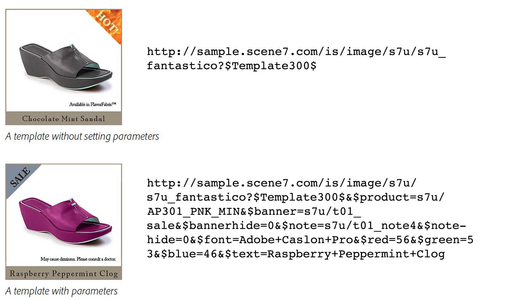

# Introducción a las plantillas básicas {#basic-templates}

En términos de Dynamic Media Classic, una plantilla es un documento que se puede cambiar dinámicamente mediante la dirección URL una vez publicada la plantilla. Plantillas básicas de ofertas clásicas de Dynamic Media, plantillas basadas en imágenes llamadas desde el servidor de imágenes y formadas por imágenes y texto procesado.

Uno de los aspectos más poderosos de las plantillas es que tienen puntos de integración directa que le permiten vincularlos a su base de datos. Por lo tanto, no sólo puede proporcionar una imagen y cambiar su tamaño, puede realizar consultas en la base de datos para buscar elementos nuevos o de venta y hacer que aparezcan como superposiciones en la imagen. Puede solicitar una descripción del elemento y hacer que aparezca como una etiqueta en la fuente que elija y el diseño. Las posibilidades son ilimitadas.

Las plantillas básicas se pueden implementar de muchas maneras diferentes, desde simples a complejas. Por ejemplo:

- Comercialización básica. Utiliza etiquetas como &quot;envío gratuito&quot; si ese producto tiene envío gratuito. Estas etiquetas son configuradas por el equipo de mercadotecnia en Photoshop y la web utiliza la lógica para saber cuándo aplicarlas a la imagen.
- Comercialización avanzada. Cada plantilla tiene varias variables y puede mostrar más de una opción al mismo tiempo. Utiliza una base de datos, un inventario y reglas comerciales para determinar cuándo mostrar un producto como &quot;Justo en&quot;, en &quot;Liquidación&quot; o &quot;Vendido&quot;. También puede utilizar la transparencia que hay detrás del producto para mostrarlo en diferentes fondos, como en diferentes salas. Las mismas plantillas y/o recursos se pueden reutilizar en la página de detalles del producto para mostrar una versión más grande o ampliable del mismo producto en diferentes fondos.

Es importante comprender que Dynamic Media Classic solo proporciona la parte visual de estas aplicaciones basadas en plantillas. Las compañías de Dynamic Media Classic o sus socios de integración deben proporcionar las reglas comerciales, la base de datos y las habilidades de desarrollo para crear las aplicaciones. No hay una aplicación de plantilla &quot;integrada&quot;; los diseñadores configuran la plantilla en Dynamic Media Classic y los desarrolladores utilizan llamadas mediante URL para cambiar las variables en la plantilla.

Al final de esta sección del tutorial, sabrá cómo:

- Cargue un PSD de Photoshop en Dynamic Media Classic para utilizarlo como base de una plantilla.
- Cree una plantilla básica de comercialización sencilla compuesta por capas de imagen.
- Añada las capas de texto y haga que sean variables mediante el uso de parámetros.
- Cree una URL de plantilla y manipule la imagen de forma dinámica a través del navegador web.

>[!NOTE]
>
>Todas las direcciones URL de este capítulo son solo ilustrativas; no son vínculos activos.

## Información general sobre plantillas básicas

La definición de una plantilla básica (o simplemente &quot;plantilla&quot;, para abreviar) es una imagen direccionable por URL en capas. El resultado final es una imagen, pero que puede ser alterada por la dirección URL. Puede consistir en fotos, texto o gráficos — cualquier combinación de activos P-TIFF en Dynamic Media Classic.

Las plantillas son más similares a los archivos PSD de Photoshop, ya que tienen un flujo de trabajo similar y funciones similares.

- Ambos consisten en capas que son como hojas de acetato apilado. Puede componer imágenes parcialmente transparentes y ver las capas inferiores a través de las áreas transparentes de una capa.
- Las capas se pueden mover y rotar para cambiar la posición del contenido, y los modos de opacidad y fusión se pueden modificar para que el contenido sea parcialmente transparente.
- Puede crear capas basadas en texto. La calidad puede ser muy alta porque el servidor de imágenes utiliza el mismo motor de texto que Photoshop y Illustrator.
- Se pueden aplicar estilos de capa simples a cada capa para crear efectos especiales como sombras paralelas o resplandores.

Sin embargo, a diferencia de los archivos PSD de Photoshop, las capas pueden ser totalmente dinámicas y controladas mediante una URL en el servidor de imágenes.

- Puede agregar variables a todas las propiedades de la plantilla, lo que facilita el cambio de su composición sobre la marcha.
- Las variables denominadas parámetros solo le permiten exponer la parte de la plantilla que desea cambiar.

Solo necesita añadir un marcador de posición para cada capa que variará en lugar de colocar todas las capas en un único archivo como lo hace en Photoshop, y mostrarlas y ocultarlas (aunque también puede hacerlo si lo prefiere).

Con un marcador de posición, puede intercambiar dinámicamente el contenido de una capa con otro recurso publicado y automáticamente tomará las mismas propiedades (como el tamaño y la rotación) de la capa que reemplazó.

Dado que las plantillas básicas se suelen diseñar en Photoshop pero se implementan mediante una URL, un proyecto de plantilla requiere una combinación de habilidades técnicas y de diseño. Generalmente suponemos que la persona que realiza el trabajo de plantilla creativa es un diseñador de Photoshop y que la persona que implementa la plantilla es un desarrollador web. Los equipos creativos y de desarrollo deben colaborar estrechamente para que la plantilla tenga éxito.

Los proyectos de plantilla pueden ser relativamente sencillos o extremadamente complejos según las reglas comerciales y las necesidades de la aplicación. Las plantillas básicas se llaman desde el servidor de imágenes. Sin embargo, debido a la flexibilidad del entorno de Dynamic Media Classic, puede incluso anidar plantillas dentro de otras plantillas, lo que le permite crear imágenes bastante complejas que se pueden vincular mediante variables con nombres comunes.

- Obtenga más información sobre [Funciones básicas de plantilla](https://docs.adobe.com/content/help/en/dynamic-media-classic/using/template-basics/quick-start-template-basics.html).
- Obtenga información sobre cómo crear una [Plantilla básica](https://docs.adobe.com/content/help/en/dynamic-media-classic/using/template-basics/creating-template.html#creating_a_template).

## Creación de una plantilla básica

Cuando se trabaja con una plantilla básica, normalmente se siguen los pasos del flujo de trabajo en el diagrama siguiente. Los pasos marcados con líneas de puntos son opcionales si utiliza capas de texto dinámico y se indican en las instrucciones siguientes como &quot;Flujo de trabajo de texto&quot;. Si no utiliza texto, siga la ruta principal solamente.

_Flujo de trabajo de plantilla básica._

1. Diseñe y cree sus recursos. La mayoría de los usuarios lo hacen en Adobe Photoshop. Diseñe recursos con el tamaño exacto que necesite: si es una imagen de 200 píxeles para una página en miniatura, diseñe la imagen a 200 píxeles. Si necesita acercarlo, diseñarlo a un tamaño de unos 2000 píxeles. Utilice Photoshop (y/o Illustrator guardado como mapa de bits) para crear los recursos y utilice Dynamic Media Classic para unir las piezas, administrar las capas y agregar variables.
2. Después de diseñar recursos gráficos, cárguelos a Dynamic Media Classic. En lugar de cargar recursos individuales desde el PSD, le recomendamos que cargue todo el archivo PSD con capas y que Dynamic Media Classic cree un archivo por capa mediante la opción **Mantener capas** durante la carga (consulte a continuación para obtener más detalles). _Flujo de trabajo de texto: Si crea texto dinámico, cargue también las fuentes. El texto dinámico es variable y se controla mediante la dirección URL. Si el texto es estático o solo tiene algunas frases cortas que no cambian — por ejemplo, etiquetas que dicen &quot;Nuevo&quot; o &quot;Venta&quot; en lugar de &quot;X% de descuento&quot;, con la X como número variable: se recomienda procesar previamente el texto en Photoshop y cargarlo como capas rasterizadas como imágenes. Será más fácil y podrá aplicar estilo al texto exactamente como desee._
3. Cree la plantilla en Dynamic Media Classic con el editor Funciones básicas de plantilla del menú Generar y agregue capas de imagen. Flujo de trabajo de texto: Cree capas de texto en el mismo editor. Este paso es necesario cuando se crea una plantilla manualmente en Dynamic Media Classic. Elija un tamaño de lienzo que coincida con el diseño, arrastre y suelte imágenes en el lienzo y defina las propiedades de la capa (tamaño, rotación, opacidad, etc.). No está colocando todas las capas posibles en la plantilla, solo un marcador de posición por capa de imagen. _Flujo de trabajo de texto: Las capas de texto se crean con la herramienta Texto, de forma similar a la creación de capas de texto en Photoshop. Puede elegir una fuente y aplicarle estilo utilizando las mismas opciones disponibles con la herramienta Tipo de Photoshop._ Otro flujo de trabajo consiste en cargar un archivo PSD y hacer que Dynamic Media Classic genere una plantilla &quot;gratuita&quot;, e incluso puede volver a crear capas de texto. Esto se analizará más detalladamente más adelante.
4. Una vez creadas las capas, agregue parámetros (variables) a cualquier propiedad de cualquier capa que desee controlar a través de la dirección URL, incluido el origen de la capa (la propia imagen ). _Flujo de trabajo de texto: También puede agregar parámetros a las capas de texto, tanto para controlar el contenido del texto, el tamaño y la posición de la capa en sí, como también todas las opciones de formato, como el color de fuente, el tamaño de fuente, el seguimiento horizontal, etc._
5. Cree un ajuste preestablecido de imagen que coincida con el tamaño de la plantilla. Se recomienda hacerlo de modo que siempre se llame a la plantilla con un tamaño 1:1 y también para añadir enfoque a cualquier capa de imagen grande que se cambie de tamaño para ajustarse a la plantilla. Si está creando una plantilla para ampliar, este paso es innecesario.
6. Publique, copie la URL de la previsualización de Dynamic Media Classic y pruébela en un navegador.

## Preparación y carga de recursos de plantilla en Dynamic Media Classic

Antes de cargar los recursos de plantilla en Dynamic Media Classic, deberá completar algunos pasos preparatorios.

### Preparación del archivo PSD para la carga

Antes de cargar el archivo Photoshop a Dynamic Media Classic, simplifique las capas de Photoshop para facilitar el trabajo con el servidor de imágenes y la compatibilidad buena con él. El archivo PSD a menudo consta de muchos elementos que Dynamic Media Classic no reconoce, y también puede terminar con muchas piezas pequeñas que son difíciles de administrar. Asegúrese de guardar una copia de seguridad del archivo PSD maestro en caso de que necesite editar posteriormente el original. Se cargará la copia simplificada y no la copia maestra.

1. Simplifique la estructura de capas combinando/acoplando capas relacionadas que deben activarse/desactivarse juntas en una sola capa. Por ejemplo, la etiqueta &quot;NEW&quot; y la pancarta azul se combinan en una sola capa para que pueda mostrarlas u ocultarlas con un solo clic.
   
2. Dynamic Media Classic o el servidor de imágenes no admiten algunos tipos de capas y efectos de capa y es necesario rasterizarlos antes de la carga. De lo contrario, los efectos podrían ignorarse o las capas descartarse. Rasterizar una capa significa convertir si es editable a no editable. Para rasterizar los efectos de capa o las capas de texto, cree una capa vacía, selecciónela y combine con **Capas > Combinar capas** o CTRL + E/CMD + E.

   - Dynamic Media Classic no puede agrupar ni vincular capas. Todas las capas de un grupo o conjunto vinculado se convertirán en capas independientes que ya no se agrupen o vinculan.
   - Las máscaras de capa se convertirán en transparencia durante la carga.
   - Las capas de ajuste no son compatibles y se descartarán.
   - Las capas de relleno, como las capas de color sólido, se rasterizarán.
   - Las capas de objetos inteligentes y las capas vectoriales se rasterizarán en imágenes normales durante la carga y los Filtros inteligentes se aplicarán y rasterizarán.
   - Las capas de texto también se rasterizarán a menos que utilice la opción Extraer texto (consulte a continuación para obtener más información).
   - Se omitirán la mayoría de los efectos de capa y solo se admitirán unos pocos modos de mezcla. Si tiene alguna duda, agregue efectos simples en Dynamic Media Classic (como sombras interiores o finales, resplandores interiores o exteriores) o utilice una capa en blanco para combinar y rasterizar el efecto en Photoshop.

### Uso de fuentes

También cargará y publicará sus fuentes si necesita generar texto dinámico. La única fuente incluida con Dynamic Media Classic es Arial.

Cada compañía tiene la responsabilidad de obtener una licencia para utilizar una fuente en la web — simplemente tener una fuente instalada en su ordenador no le da el derecho de utilizarla comercialmente en la web, y su compañía podría enfrentarse a una acción legal del editor de fuentes si se utiliza sin permiso. Además, los términos de licencia varían: por ejemplo, es posible que necesite licencias independientes para la impresión en comparación con la visualización en pantalla.

Dynamic Media Classic admite fuentes estándar OpenType (OTF), TrueType (TTF) y Type 1 PostScript. No se admiten las fuentes &quot;solo para Mac&quot;, los archivos de colección de tipos, las fuentes del sistema de Windows y las fuentes de máquina propietarias (como las fuentes utilizadas por los equipos de grabado o bordado); tendrá que convertirlos a uno de los formatos de fuente estándar o sustituir una fuente similar para utilizarlos en Dynamic Media Classic y en el servidor de imágenes.

Una vez cargadas las fuentes en Dynamic Media Classic, como cualquier otro recurso, también deben publicarse en el servidor de imágenes. Un error de plantilla muy común es olvidar la publicación de las fuentes, lo que provocará un error de imagen — el servidor de imágenes no sustituirá otra fuente en su lugar. Además, si desea utilizar la opción **Extraer texto** al cargar, debe cargar los archivos de fuente antes de cargar el archivo PSD que utiliza esas fuentes. La función **Extraer texto** intentará recrear el texto como una capa de texto editable y colocarlo dentro de una plantilla de Dynamic Media Classic. Esto se analiza en el siguiente tema, Opciones de PSD.

Tenga en cuenta que las fuentes tienen varios nombres internos que a menudo difieren de los nombres de archivo externos. Puede ver todos sus nombres diferentes en la página Detalles de ese recurso en Dynamic Media Classic. Estos son los nombres de la fuente Adobe Caslon Pro Semibold, que se muestran en la ficha Metadatos de Dynamic Media Classic:

_Ficha Metadatos de la página Detalles de una fuente de Dynamic Media Classic._

Dynamic Media Classic utiliza el nombre de archivo de esta fuente (ACaslonPro-Semibold) como ID de recurso, pero no es el nombre utilizado por la plantilla. La plantilla utiliza el nombre de Formato de texto enriquecido (RTF), que aparece en la parte inferior. RTF es el &quot;idioma&quot; nativo del motor de texto del servidor de imágenes.

Si necesita cambiar las fuentes a través de la URL, debe llamar al nombre RTF de la fuente (no al ID del recurso) o verá un error. En este caso, el nombre correcto para esta fuente sería &quot;Adobe Caslon Pro&quot;. Más información sobre las fuentes y RTF en el tema RTF y Parámetros de texto, a continuación.

Los formatos de archivo de fuente más comunes que se encuentran en los sistemas Windows y Mac son OpenType y TrueType. OpenType tiene una extensión .OTF, mientras que TrueType es .TTF. Ambos formatos funcionan igual de bien en Dynamic Media Classic.

### Selección de opciones al cargar el archivo PSD

No es necesario cargar un archivo Photoshop (PSD) para crear una plantilla; se puede crear una plantilla a partir de cualquier recurso de imagen en Dynamic Media Classic. Sin embargo, cargar un archivo PSD puede facilitar la creación, ya que normalmente estos recursos ya están en un archivo PSD con capas. Además, Dynamic Media Classic generará automáticamente una plantilla al cargar un archivo PSD con capas.

- **Mantener capas.** Esta es la opción más importante. Esto indica a Dynamic Media Classic que cree un recurso de imagen por capa de Photoshop. Si no se selecciona, todas las demás opciones se desactivan y el archivo PSD se acoplará en una sola imagen.
- **** **CreateTemplate.** Esta opción toma las distintas capas generadas y crea automáticamente una plantilla combinándolas de nuevo. Un inconveniente de utilizar la plantilla generada automáticamente es que Dynamic Media Classic coloca todas las capas en un archivo, mientras que solo necesitamos un marcador de posición por capa. Es bastante fácil eliminar las capas adicionales, pero si hay muchas capas, es más rápido volver a crearlas. Asegúrese de cambiar el nombre de la nueva plantilla; si no lo hace, se sobrescribirá la próxima vez que vuelva a cargar el mismo archivo PSD.
- **Extraer texto.** De este modo, se vuelven a crear capas de texto en el archivo PSD como capas de texto en la plantilla mediante la fuente que se ha cargado. Este paso es necesario si el texto está en una ruta en Photoshop y desea mantener esa ruta en la plantilla. Esta función requiere que utilice la opción **Crear plantilla**, ya que el texto extraído sólo se puede crear mediante una plantilla generada durante la carga.
- **Extender las capas al tamaño del fondo.** Este ajuste hace que cada capa tenga el mismo tamaño que el lienzo PSD general. Esto resulta muy útil para capas que siempre permanecerán fijas en posición: de lo contrario, al intercambiar imágenes en la misma capa, es posible que tenga que volver a colocarlas.
- **Nombres de capas.** Esto indica a Dynamic Media Classic cómo asignar un nombre a cada recurso generado por capa. Se recomienda **Photoshop** **y Capa** **Nombre** o Photoshop y **Capa** **Número**. Ambas opciones utilizan el nombre PSD como primera parte del nombre y agregan el nombre o el número de la capa al final. Por ejemplo, si tiene un archivo PSD denominado &quot;camisa.psd&quot; y tiene capas denominadas &quot;anverso&quot;, &quot;mangas&quot; y &quot;collar&quot;, si carga mediante la opción **Photoshop y** Capa **Nombre**, Dynamic Media Classic generaría los ID de los recursos &quot;anverso&quot;, &quot;camisa_mangas&quot; y &quot;cuello_camisa&quot;. El uso de una de estas opciones ayuda a garantizar que el nombre sea único en Dynamic Media Classic.

## Creación de una plantilla con capas de imagen

Aunque Dynamic Media Classic puede crear automáticamente una plantilla a partir de un archivo PSD con capas, debe saber cómo crear la plantilla manualmente. Como se ha explicado anteriormente, en determinadas ocasiones no se desea utilizar la plantilla creada por Dynamic Media Classic.

### La IU de Funciones básicas de plantilla

Primero vamos a familiarizarnos con la interfaz de edición.

En el centro izquierdo está el área de trabajo que muestra una previsualización de la plantilla final. A la derecha se encuentran los paneles Capas y Propiedades de capa. Estas áreas son donde usted hará el mayor trabajo.

_Página Generar Funciones Básicas de Plantilla._

- **Previsualización/Área de trabajo.** Ésta es la ventana principal. Aquí puede mover, cambiar el tamaño y rotar las capas con el ratón. Los contornos de capa se muestran como líneas discontinuas.
- **Capas.** Es similar al panel Capas de Photoshop. A medida que agregue capas a la plantilla, aparecerán aquí. Las capas se apilan de arriba abajo — la capa superior del panel Capas se verá por encima de las demás debajo de ella en la lista.
- **Propiedades de la capa.** Aquí puede ajustar todas las propiedades de una capa mediante controles numéricos. Primero seleccione una capa y, a continuación, ajuste sus propiedades.
- **** **CompositeURL.** En la parte inferior de la interfaz de usuario se encuentra el área Dirección URL compuesta. Esto no se tratará en esta sección del tutorial, pero aquí verá la plantilla desconstruida como una serie de modificadores de URL de servicio de imágenes. Esta área es editable — si está muy familiarizado con los comandos del servidor de imágenes, puede editar la plantilla manualmente aquí. Sin embargo, también puede romperlo. Al igual que Photoshop, la numeración de capas inicio en 0. El Lienzo es la capa 0 y la primera capa que se agrega es la capa 1. Los modos de fusión determinan la forma en que los píxeles de una capa se mezclan con los píxeles situados debajo. Puede crear una gran variedad de efectos especiales mediante los modos de fusión.

#### Uso del Editor de conceptos básicos de plantilla

Estos son los pasos del flujo de trabajo para el inicio de la plantilla básica:

1. En Dynamic Media Classic, vaya a **Generar > Funciones básicas de plantilla**. Puede no tener nada seleccionado, o bien puede seleccionar un inicio seleccionando una imagen, que se convertirá en la primera capa de la plantilla.
2. Elija un Tamaño y pulse **Aceptar**. Este tamaño debe coincidir con el tamaño diseñado en Photoshop. Se cargará el editor de plantillas.
3. Si no ha seleccionado una imagen en el paso 1, busque o busque una imagen en el panel de recursos de la izquierda y arrástrela al área de trabajo.

   - El tamaño de la imagen se ajustará automáticamente al tamaño del lienzo. Si planea cambiar las imágenes de alta resolución, normalmente incorporará una de las imágenes grandes (2000 px) de P-TIFF y la utilizará como marcador de posición.
   - Debe ser la capa inferior de la plantilla, aunque puede reordenar las capas más adelante.

4. Cambie el tamaño o la posición de la capa directamente en el área de trabajo, o bien, ajuste la configuración en el panel Propiedades de la capa.
5. Arrastre las capas de imagen adicionales según sea necesario. Añada los efectos de capas si lo desea. Consulte el tema _Añadir efectos de capa_ más adelante.
6. Haga clic en **Guardar**, elija una ubicación y asigne un nombre a la plantilla. Puede realizar la previsualización, pero en este punto la plantilla tendrá el mismo aspecto que una imagen Photoshop acoplada. todavía no es cambiable.

### Añadir efectos de capa

El servidor de imágenes admite algunos efectos de capa programáticos: efectos especiales que cambian el aspecto del contenido de una capa. Funcionan de forma similar a los efectos de capa en Photoshop. Se unen a una capa pero se controlan independientemente de la capa. Puede ajustarlos o eliminarlos sin realizar un cambio permanente en la propia capa.

- **Sombra** paralela. Aplica una sombra fuera de los límites de la capa, colocada con un desplazamiento de píxeles x e y.
- **Sombra** interior. Aplica una sombra dentro de los límites de la capa, colocada con un desplazamiento de píxeles x e y.
- **Resplandor** exterior. Aplica un efecto de resplandor uniformemente alrededor de todos los bordes de la capa.
- **Resplandor** interior. Aplica un efecto de resplandor uniformemente dentro de todos los bordes de la capa.

_Una capa con y sin sombra paralela_

Para agregar un efecto, haga clic en **Añadir efecto** y elija un efecto en el menú. Al igual que las capas normales, puede seleccionar un efecto en el panel Capas y utilizar el panel Propiedades de la capa para ajustar su configuración.

Los efectos de sombra se desplazan horizontal o verticalmente desde la capa, mientras que los efectos de resplandor se aplican uniformemente en todas las direcciones. Los efectos interiores actúan sobre las partes opacas de la capa, mientras que los efectos exteriores solo afectan a las áreas transparentes.

Obtenga más información sobre[Añadir efectos de capa](https://docs.adobe.com/content/help/en/dynamic-media-classic/using/template-basics/creating-template.html#using-shadow-and-glow-effects-on-layers).

### Añadir parámetros

Si lo único que hace es combinar capas y guardarlas, el resultado neto no es diferente de una imagen de Photoshop acoplada. Lo que hace que las plantillas sean especiales es la capacidad de agregar parámetros a las propiedades de cada capa para que se puedan cambiar dinámicamente a través de la dirección URL.

En términos de Dynamic Media Classic, un parámetro es una variable que puede vincularse a una propiedad de plantilla para que se pueda manipular mediante una dirección URL. Cuando se agrega un parámetro a una capa, Dynamic Media Classic expone esa propiedad en la dirección URL marcando como prefijo el nombre del parámetro con un signo de dólar ($) — por ejemplo, si crea un parámetro llamado &quot;size&quot; para cambiar el tamaño de una capa, Dynamic Media Classic cambiará el nombre del parámetro $size.

Si no agrega un parámetro para una propiedad, dicha propiedad permanece oculta en la base de datos de Dynamic Media Classic y no aparece en la dirección URL.

Sin parámetros, las direcciones URL suelen ser mucho más largas, especialmente si también se utiliza texto dinámico. El texto agrega decenas de caracteres adicionales a cada dirección URL.

Finalmente, el conjunto inicial de parámetros se convertirá en los valores predeterminados de las propiedades de la plantilla. Si crea la plantilla, agrega parámetros y, a continuación, llama a la URL sin sus parámetros, el servidor de imágenes creará la imagen con todos los valores predeterminados que guardó en la plantilla. Los parámetros solo son necesarios si desea cambiar una propiedad. Si una propiedad no necesita cambiar, no es necesario establecer un parámetro.

#### Creación de parámetros

Este es el flujo de trabajo para crear parámetros:

1. Haga clic en el botón **Parámetros** junto al nombre de la capa para la que desea crear parámetros. Se abre la pantalla Parámetros. Lista cada propiedad de la capa y su valor.
1. Seleccione la opción **Activado** junto al nombre de cada propiedad que desee convertir en parámetro. Aparecerá un nombre de parámetro predeterminado. Solo puede agregar parámetros a propiedades que hayan cambiado de su estado predeterminado.

   - Por ejemplo, si agrega una capa y la mantiene en su posición xy predeterminada de 0,0, Dynamic Media Classic no mostrará una propiedad **Position**. Para solucionarlo, mueva la capa al menos un píxel. Ahora Dynamic Media Classic mostrará **Posición** como una propiedad que puede parametrizar.
   - Para agregar un parámetro a la propiedad show/hide (que activa y desactiva la capa), haga clic en el icono **Show** o **Hide Layer** para desactivar la capa (puede volver a activarla posteriormente si lo desea). Dynamic Media Classic ahora mostrará una propiedad **Hide** que se puede parametrizar.

1. Cambie el nombre de los nombres de parámetro predeterminados a algo que resulte más fácil de identificar en la dirección URL. Por ejemplo, si desea agregar un parámetro para cambiar la capa de la pancarta sobre una imagen, cambie el nombre predeterminado de &quot;layer_2_src&quot; a &quot;banner&quot;.
1. Pulse **Cerrar** para salir de la pantalla Parámetros.
1. Repita este proceso para otras capas haciendo clic en el botón **Parámetros** y agregando y cambiando el nombre de los parámetros.
1. Guarde los cambios cuando haya terminado.

>[!TIP]
>
>Cambie el nombre de los parámetros a algo significativo y desarrolle una convención de nombres para estandarizar esos nombres. Asegúrese de que los equipos de diseño y desarrollo acuerden previamente la convención de nomenclatura.
>
>No se puede agregar un parámetro porque no se ve la propiedad? Simplemente cambie la propiedad de la capa de su valor predeterminado (moviendo, cambiando el tamaño, ocultando, etc.). Ahora debería ver esa propiedad expuesta.

Obtenga más información sobre [Parámetros de plantilla](https://docs.adobe.com/content/help/en/dynamic-media-classic/using/template-basics/creating-template-parameters.html).

## Creación de una plantilla con capas de texto

Ahora aprenderá a crear una plantilla básica que incluya capas de texto.

### Explicación del texto dinámico

Ahora sabe cómo crear una plantilla básica con capas de imagen. Para muchas aplicaciones esto es todo lo que necesita. Como se vio en el ejercicio anterior, las capas que tienen texto simple (como &quot;Venta&quot; y &quot;Nuevo&quot;) pueden rasterizarse y tratarse como imágenes porque su texto no necesita cambiar.

Sin embargo, ¿qué sucede si necesita:

- Añada una etiqueta para que diga &quot;25% de descuento&quot;, siendo variable el valor del 25%
- Añadir una etiqueta de texto con el nombre del producto encima de la imagen
- Localice las capas en distintos idiomas según el país en el que se vea la plantilla

En ese caso, deseará agregar algunas capas de texto dinámico con parámetros para controlar el texto o el formato.

Para crear texto, debe cargar algunas fuentes: de lo contrario, Dynamic Media Classic pasará a ser Arial de forma predeterminada. Las fuentes también deben publicarse en el servidor de imágenes o generarán un error en el momento en que intente procesar cualquier texto que utilice esa fuente.

### Parámetros de RTF y texto

Para agregar variables al texto con la herramienta Funciones básicas de plantilla, debe comprender cómo se procesa el texto. El servidor de imágenes genera texto con el motor de texto Adobe, el mismo motor que Photoshop y Illustrator, y lo compone como una capa en la imagen final. Para comunicarse con el motor, el servidor de imágenes utiliza Formato de texto enriquecido o RTF.

RTF es una especificación de formato de archivo desarrollada por Microsoft para especificar el formato de los documentos. Es un lenguaje de marcado estándar que utiliza la mayoría de los programas de procesamiento de textos y de correo electrónico. Si escribió en una URL &amp;text=\b1 Hello, el servidor de imágenes generaría una imagen con la palabra &quot;Hello&quot; en negrita, porque \b1 es el comando RTF para poner el texto en negrita.

La buena noticia es que Dynamic Media Classic genera el RTF por usted. Siempre que escriba texto en una plantilla y agregue formato, Dynamic Media Classic escribe el código RTF en la plantilla de forma silenciosa. La razón por la que lo mencionamos es que agregará parámetros directamente al RTF, por lo que es importante que esté un poco familiarizado con él.

#### Creación de capas de texto

Puede crear capas de texto en una plantilla en Dynamic Media Classic de las dos formas siguientes:

1. Herramienta de texto en Dynamic Media Classic. Discutiremos este método a continuación. El editor Funciones básicas de plantilla tiene una herramienta que le permite crear un cuadro de texto, introducir texto y dar formato al texto. Dynamic Media Classic genera el RTF según sea necesario y lo coloca en una capa independiente.
2. Extraer texto (al cargarlo). El otro método consiste en crear la capa de texto en Photoshop y guardarla en el archivo PSD como una capa de texto normal (en lugar de rasterizarla como una capa de imagen). A continuación, cargue el archivo en Dynamic Media Classic y utilice la opción **Extraer texto**. Dynamic Media Classic convertirá cada capa de texto de Photoshop en una capa de texto de servicio de imágenes mediante comandos RTF. Si utiliza este método, asegúrese de cargar primero las fuentes a Dynamic Media Classic; de lo contrario, Dynamic Media Classic sustituirá la fuente predeterminada al cargarlas y no es fácil volver a sustituirla.

### Editor de texto

El texto se introduce mediante el Editor de texto. El Editor de texto es una interfaz WYSIWYG que permite introducir y dar formato al texto mediante controles de formato similares a los de Photoshop o Illustrator.

_Editor de texto de Funciones básicas de plantilla._

La mayor parte del trabajo se realiza en la ficha **Previsualización**, que le permite introducir texto y verlo mostrado como se verá en la plantilla. También hay una ficha **Origen**, que se utiliza para editar manualmente el RTF, si es necesario.

El flujo de trabajo general consiste en utilizar la ficha **Previsualización** para escribir texto.

A continuación, seleccione el texto y elija algún formato, como color de fuente, tamaño de fuente o justificación, con los controles de la parte superior. Una vez que el texto tenga el estilo que desee, haga clic en **Aplicar** para ver cómo se actualiza en la previsualización del área de trabajo. A continuación, cierre el Editor de texto para volver a la ventana principal Funciones básicas de plantilla.

#### Uso del Editor de texto

Estos son los pasos del flujo de trabajo para agregar texto dentro de la página de creación Funciones básicas de plantilla:

1. Haga clic en el botón de la herramienta **Texto** en la parte superior de la página de compilación.
2. Arrastre un cuadro de texto donde desee que aparezca el texto. La ventana Editor de texto se abrirá en una ventana modal. En segundo plano, verá la plantilla, aunque no se puede editar hasta que termine de editar el texto.
3. Escriba el texto de ejemplo que desea que aparezca cuando se cargue la plantilla por primera vez. Por ejemplo, si está creando un cuadro de texto para una imagen de correo electrónico personalizada, el texto podría decir &quot;Nombre de alta&quot;. ¡Ahora es el momento de ahorrar!&quot; Posteriormente, agregaría un parámetro de texto para reemplazar Nombre por un valor que enviara en la dirección URL. El texto no aparecerá en la plantilla debajo de la ventana hasta que haga clic en **Aplicar**.
4. Para dar formato al texto, selecciónelo arrastrándolo con el ratón y elija un control de formato en la interfaz de usuario.

   - Existen muchas opciones de formato. Algunos de los más comunes son la fuente (cara), el tamaño de fuente y el color de fuente, así como la justificación izquierda/centro/derecha.
   - No olvide seleccionar primero el texto. De lo contrario, no podrá aplicar ningún formato.
   - Para elegir una fuente diferente, asegúrese de seleccionar el texto y abrir el menú Fuente. El editor mostrará una lista de todas las fuentes cargadas en Dynamic Media Classic. Si también hay una fuente instalada en el equipo, aparecerá en negro. Si no está instalado en el equipo, se mostrará en rojo. Sin embargo, se seguirá representando en la ventana previsualización cuando haga clic en **Aplicar**. Solo es necesario cargar fuentes a Dynamic Media Classic para que estén disponibles para todos los usuarios de Dynamic Media Classic. Una vez que publique, el servidor de imágenes utilizará esas fuentes para generar el texto: los usuarios no necesitan instalar ninguna fuente para ver el texto que se crea porque forma parte de una imagen.
   - A diferencia de Photoshop y Illustrator, el servidor de imágenes puede alinear el texto verticalmente en el cuadro de texto. El valor predeterminado es la alineación superior. Para cambiar esto, seleccione el texto y elija **Middle** o **Bottom** en el menú **Vertical Alignment**.
   - Si hace que el texto sea demasiado grande para el cuadro (o que el cuadro de texto sea demasiado pequeño), todo o parte del mismo se recortará y desaparecerá. Reduzca el tamaño de fuente o aumente el tamaño del cuadro.

5. Haga clic en **Aplicar** para ver cómo los cambios surten efecto en la ventana del área de trabajo. Debe hacer clic en **Aplicar**, de lo contrario perderá los cambios.
6. Cuando termine, haga clic en **Cerrar**. Si desea volver al modo de edición, haga clic con el doble en la capa de texto para volver a abrir el Editor de texto.

El editor de texto previsualización exactamente el tamaño de la fuente si tiene la fuente instalada localmente en el sistema.

### Añadir parámetros en capas de texto

Ahora seguimos un proceso similar para agregar parámetros de texto como lo hicimos con parámetros de capa. Las capas de texto también pueden utilizar parámetros de capa para el tamaño, la posición, etc.; sin embargo, pueden tomar parámetros adicionales que le permiten controlar cualquier aspecto de RTF.

A diferencia de los parámetros de capa, solo se selecciona el valor que se desea cambiar y se agrega un parámetro a la misma en lugar de agregarlo a toda la propiedad.

RTF de muestra:

Al examinar el RTF, debe averiguar dónde está cada configuración que desea cambiar. En el RTF de arriba, parte podría tener algún sentido y se puede ver de dónde viene el formato.

Pueden ver la frase sandalia de menta de chocolate — ese es el texto en sí.

- Hay una referencia a la fuente Poor Richard — aquí es donde se seleccionan las fuentes.
- Puede ver un valor RGB: \red56\green53\blue4 — este es el color del texto.
- Aunque el tamaño de fuente es 20, no se ve el número 20. Sin embargo, verá un comando \fs40 — por algún motivo extraño, RTF mide las fuentes como puntos medios. Por lo tanto, \fs40 es el tamaño de fuente.

Dispone de suficiente información para crear los parámetros, pero hay una referencia completa de todos los comandos RTF en la documentación del servicio de imágenes. Visite la [Documentación del servicio de imágenes](https://docs.adobe.com/content/help/en/dynamic-media-developer-resources/image-serving-api/image-serving-api/http-protocol-reference/text-formatting/c-text-formatting.html#concept-0d3136db7f6f49668274541cd4b6364c).

#### Añadir parámetros a capas de texto

Estos son los pasos para agregar parámetros a las capas de texto.

1. Haga clic en el botón **Parámetros** (una &quot;P&quot;) junto al nombre de la capa de texto para la que desea crear parámetros. Se abre la pantalla Parámetros. La ficha **Común** lista cada propiedad de la capa y su valor. Aquí puede agregar parámetros de capa normales.
1. Haga clic en la ficha **Texto**. Aquí puede ver el RTF en la parte superior; los parámetros que agregue estarán debajo de ese valor.
1. Para agregar un parámetro, primero resalte el valor que desee cambiar y haga clic en el botón **Añadir parámetro**. Asegúrese de seleccionar sólo los valores para los comandos y no todo el comando en sí. Por ejemplo, para establecer un parámetro para el nombre de la fuente en el RTF de ejemplo anterior, solo resaltaría &quot;Richard pobre&quot; y agregaría un parámetro a eso, pero no también &quot;\f0&quot;. Al hacer clic en **Añadir parámetro** , aparecerá en la lista siguiente y el valor del parámetro aparecerá en rojo en el RTF mientras esté seleccionado. Si necesita eliminar un parámetro, haga clic en la casilla de verificación situada junto a **Activado** para desactivar dicho parámetro y desaparecerá.
1. Haga clic para cambiar el nombre del parámetro a un nombre más significativo.
1. Cuando haya terminado, el RTF se resaltará en verde donde existan parámetros y los nombres y valores de los parámetros se enumerarán a continuación.
1. Haga clic en **Cerrar** para salir de la pantalla Parámetros. A continuación, presione **Guardar** para guardar la plantilla. Si ha terminado de editar, presione **Cerrar** para salir de la página Funciones básicas de plantilla.
1. Haga clic en **Previsualización** para probar la plantilla en Dynamic Media Classic. Para probar los parámetros de texto, escriba texto nuevo o valores nuevos en la ventana previsualización. Para cambiar la fuente, debe escribir el nombre RTF exacto de la fuente.

>[!TIP]
>
>Para agregar parámetros al color del texto, agregue parámetros por separado para rojo, verde y azul. Por ejemplo, si RTF es `\red56\green53\blue46`, agregaría parámetros rojos, verdes y azules independientes para los valores 56, 53 y 46. En la dirección URL, puede cambiar el color llamando a los tres: `&$red=56&$green=53&$blue=46`.

Obtenga información sobre cómo [crear parámetros de texto dinámico](https://docs.adobe.com/content/help/en/dynamic-media-classic/using/template-basics/creating-template-parameters.html#creating-dynamic-text-parameters).

## Publicación y creación de direcciones URL de plantilla

### Creación de un ajuste preestablecido de imagen

La creación de un ajuste preestablecido para la plantilla no es un paso necesario. Se recomienda hacerlo como práctica recomendada, de modo que siempre se llame a la plantilla con un tamaño de 1:1 y también para añadir enfoque a cualquier capa de imagen grande que cambie de tamaño para ajustarse a la plantilla. Si llama a una imagen sin un ajuste preestablecido, el servidor de imágenes puede cambiar arbitrariamente el tamaño de la imagen al tamaño predeterminado (unos 400 píxeles) y no aplicará el enfoque predeterminado.

No hay nada especial en un ajuste preestablecido de imagen para una plantilla. Si ya tiene un ajuste preestablecido para una imagen estática del mismo tamaño, puede utilizarlo en su lugar.

### Publicación

Deberá ejecutar una publicación para ver los cambios que se insertan en directo en el servidor de imágenes. Tenga en cuenta lo que debe publicarse: las distintas capas de recursos de imagen, las fuentes para el texto dinámico y la propia plantilla. Al igual que otros recursos de medios enriquecidos de Dynamic Media Classic, como conjuntos de imágenes y conjuntos de giros, una plantilla básica es una construcción artificial — es un elemento de línea de la base de datos que hace referencia a las imágenes y fuentes mediante una serie de comandos de servicio de imágenes. Así que cuando publique la plantilla, todo lo que está haciendo es actualizar los datos en el servidor de imágenes.

Obtenga más información sobre [Publicación de la plantilla](https://docs.adobe.com/content/help/en/dynamic-media-classic/using/template-basics/publishing-templates.html).

### Construcción de URL de plantilla

Una plantilla básica tiene la misma sintaxis de URL esencial que una llamada de imagen normal, como se explicó anteriormente. Una plantilla generalmente tendrá más modificadores: comandos separados por un signo de interrogación (&amp;) — como parámetros con valores. Sin embargo, la diferencia principal es que se llama a la plantilla como imagen principal, en lugar de llamar a una imagen estática.

A diferencia de los ajustes preestablecidos de imagen, que tienen un signo de dólar ($) a cada lado del nombre del ajuste preestablecido, los parámetros tienen un solo signo de dólar al principio. Es importante colocar esos signos de dólar.

**Correcto:**

`$text=46-inch LCD HDTV`

**Incorrecto:**

`$text$=46-inch LCD HDTV`

`$text=46-inch LCD HDTV$`

`text=46-inch LCD HDTV`

Como se ha indicado anteriormente, se utilizan parámetros para cambiar la plantilla. Si llama a la plantilla sin parámetros, volverá a su configuración predeterminada, tal como se ha diseñado en la herramienta de creación Funciones básicas de plantilla. Si una propiedad no necesita cambiar, no es necesario establecer un parámetro.

_imageEjemplos de una plantilla sin definir parámetros (arriba) y con parámetros (abajo)._
