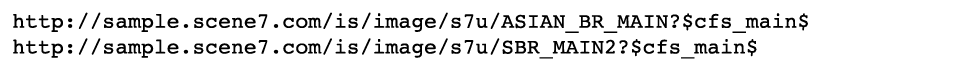

# Recorte, imágenes ajustadas y destinos de zoom {#crop-adjusted-zoom-targets}

Una de las principales fortalezas del concepto de imagen principal de Dynamic Media Classic es que puede reutilizar el recurso de imagen para muchos usos. Tradicionalmente, habría que crear versiones independientes y recortadas de cada imagen para mostrar los detalles o para las muestras. Al utilizar Dynamic Media Classic, puede realizar las mismas tareas en el maestro único y guardar las versiones recortadas como nuevos archivos físicos o como derivados virtuales que no ocupen espacio de almacenamiento.

Al final de esta sección del tutorial, sabrá cómo hacer lo siguiente:

- Recorte imágenes en Dynamic Media Classic y guárdelas como nuevos archivos maestros o como imágenes virtuales. [Más información](https://experienceleague.adobe.com/docs/dynamic-media-classic/using/master-files/cropping-image.html).
- Guarde las imágenes ajustadas virtuales y utilícelas en lugar de los recursos maestros. [Más información](https://experienceleague.adobe.com/docs/dynamic-media-classic/using/master-files/adjusting-image.html).
- Cree destinos de zoom en las imágenes para mostrar sus resaltados. [Más información](https://experienceleague.adobe.com/docs/dynamic-media-classic/using/zoom/creating-zoom-targets-guided-zoom.html).

## Recortar

Dynamic Media Classic tiene varias herramientas de edición de imágenes disponibles en la interfaz de usuario, incluida la herramienta Recortar. Es posible que desee recortar la imagen principal dentro de Dynamic Media Classic por varios motivos. Por ejemplo:

- No tiene acceso al archivo original. Desea mostrar la imagen con un recorte o una relación de aspecto diferente, pero no tiene el archivo original en el equipo o trabaja desde casa. En este caso, puede entrar en Dynamic Media Classic, encontrar la imagen, recortarla y guardarla o guardarla como una nueva versión.
- Para eliminar el espacio en blanco sobrante. La imagen se fotografió con demasiado espacio en blanco, lo que hace que el producto parezca pequeño. Desea que las imágenes en miniatura llenen el lienzo tanto como sea posible.
- Para crear imágenes ajustadas, haga copias virtuales de imágenes que no ocupen espacio en disco. Algunas empresas tienen reglas comerciales que les exigen mantener copias independientes de la misma imagen, pero con un nombre diferente. O tal vez desee una versión recortada y sin recortar de la misma imagen.
- Para crear nuevas imágenes a partir de una imagen de origen. Por ejemplo, es posible que desee crear muestras de color o un detalle de la imagen principal. Puede hacerlo en Adobe Photoshop y cargar por separado o utilizar la herramienta Recortar en Dynamic Media Classic.

>[!NOTE]
>
>Todas las direcciones URL de las siguientes discusiones de Recortar son solo ilustrativas; no son vínculos activos.

### Uso de la herramienta Recortar

Puede acceder a la herramienta Recortar en Dynamic Media Classic desde la página Detalles de un recurso o haciendo clic en **Editar** botón. Puede utilizar la herramienta para recortar de dos maneras:

- Modo de recorte predeterminado en el que se arrastran los controladores de la ventana de recorte o se escriben los valores en el cuadro Tamaño. Obtenga información sobre cómo [Recorte manual](https://experienceleague.adobe.com/docs/dynamic-media-classic/using/master-files/cropping-image.html#select-an-area-to-crop).
- Recortar. Utilice esta opción para eliminar espacios en blanco adicionales alrededor de la imagen calculando el número de píxeles que no coinciden con la imagen. Obtenga información sobre cómo [Recortar por recorte](https://experienceleague.adobe.com/docs/dynamic-media-classic/using/master-files/cropping-image.html#crop-to-remove-white-space-around-an-image).

### _Recorte manual_

Al guardar una versión recortada manualmente, parece que la imagen se ha recortado de forma permanente; Dynamic Media Classic está ocultando los píxeles añadiendo un modificador de URL interno para recortar la imagen. Cuando publique, todos verán que la imagen está recortada. Sin embargo, puede volver al Editor de recortes y quitar el recorte en un momento posterior.

A continuación, puede elegir si desea guardar como una nueva imagen principal o como una vista adicional de la imagen principal. Un nuevo maestro es un nuevo archivo físico (como un TIFF o un JPEG) que ocupa espacio de almacenamiento. Una vista adicional es una imagen virtual que no ocupa espacio en el servidor. No recomendamos que elija Reemplazar original, ya que esto sobrescribirá el patrón y hará que el recorte sea permanente. Si guarda como un nuevo maestro o como una vista adicional, debe elegir un nuevo ID de recurso. Al igual que otros ID de recurso, debe ser un nombre único en Dynamic Media Classic.

### _Recortar recorte_

Si carga una imagen con demasiado espacio en blanco (lienzo adicional) alrededor del asunto principal de la imagen, se verá mucho más pequeña en la web cuando se cambie de tamaño. Esto es especialmente cierto en el caso de las imágenes en miniatura de 150 píxeles o menos; el sujeto de la foto puede perderse en todo el espacio adicional que lo rodea.

Compare estas dos versiones de la misma imagen.

La imagen de la derecha se hace mucho más prominente al eliminar el espacio adicional alrededor del producto. El recorte se puede realizar de una imagen a la vez, con la herramienta Recortar, o ejecutarse como un proceso por lotes mientras se carga. Se recomienda ejecutar como un proceso por lotes si desea que todas las imágenes se recorten de forma consistente hasta los límites del asunto principal. Recortar recortes hasta el cuadro delimitador: el rectángulo que rodea la imagen.

>[!NOTE]
>
>El recorte no crea transparencia en torno a la imagen. Para ello, deberá incrustar un trazado de recorte en la imagen y utilizar el **Crear máscara a partir de ruta de recorte** opción de carga.
>
>Además, para restaurar una imagen a su estado original después de recortarla cuando haya utilizado el **Guardar** , muestre la imagen en la pantalla del Editor de recorte y seleccione la opción **Restablecer** botón.

### _Recortar al cargar_

Como se mencionó anteriormente, también puede optar por recortar las imágenes a medida que las carga. Para utilizar recortar recorte al cargar, haga clic en **Opciones de trabajo** y en Opciones de recorte, elija **Recortar**.

Dynamic Media Classic recordará esta opción en la siguiente carga. Aunque es posible que desee recortar imágenes para esta carga, es posible que no desee recortarlas para cada carga. Otra opción sería establecer un trabajo especial de carga programado por FTP y colocar las opciones de recorte allí. De ese modo, solo ejecutaría el trabajo cuando necesitara recortar las imágenes.

>[!IMPORTANT]
>
>Si establece un recorte para la carga, Dynamic Media Classic colocará una cookie para recordar esa configuración la próxima vez. Haga clic en el vínculo **Restablecer valores predeterminados de la empresa** antes de la siguiente carga para borrar las opciones de recorte restantes en la última carga; de lo contrario, podría recortar accidentalmente el siguiente lote de imágenes.

### Recorte por dirección URL

Aunque no es obvio en Dynamic Media Classic, también puede recortar únicamente a través de la URL (o incluso añadir recorte a un ajuste preestablecido de imagen).

Siempre que utilice la herramienta Recortar, verá valores de URL en el campo de la parte inferior. Puede tomar esos valores y aplicarlos directamente a una imagen como modificadores de URL.

_Modificadores de comandos de recorte en la parte inferior del Editor de recorte_

Dado que el tamaño debe calcularse por imagen cuando se utiliza el recorte mediante recorte, no se puede automatizar mediante la dirección URL. El recorte de recorte solo se puede ejecutar al cargar o al aplicarlo de imagen en imagen.

### _Recorte en el ajuste preestablecido de imagen_

Los ajustes preestablecidos de imagen tienen un campo en el que puede añadir comandos de servicio de imágenes adicionales. Para añadir el mismo recorte que se ha indicado arriba al ajuste preestablecido de imagen, edite el ajuste preestablecido, pegue o escriba los valores en el campo Modificadores de URL y, a continuación, guarde y publique.

_Agregue comandos de recorte (o cualquier comando) a los modificadores de URL del ajuste preestablecido de imagen._

El recorte ahora formará parte de ese ajuste preestablecido de imagen y se aplicará automáticamente cada vez que se utilice. Por supuesto, este método depende de todas las imágenes que necesiten la misma cantidad de recorte. Si no todas las imágenes se filman de la misma manera, este método no funcionaría para usted.

## Imágenes ajustadas

Al utilizar la herramienta Recortar, tiene la opción de **Guardar como vista adicional del Principal**. Cuando se guarda, se crea un nuevo tipo de recurso de Dynamic Media Classic: una imagen ajustada. Una imagen ajustada, también denominada derivada, es una imagen virtual. En realidad no es una imagen en absoluto; es una referencia de base de datos (como un alias o un acceso directo) a la imagen maestra física.

### Por favor, levántese la imagen real`?`

¿Puedes saber cuál es el maestro y cuál es la imagen ajustada?

No debería poder saberlo sin mirar en Dynamic Media Classic y ver el tipo de recurso de &quot;Imagen ajustada&quot; para SBR_MAIN2.

Una imagen ajustada no utiliza espacio en disco, ya que solo existe como elemento de línea en la base de datos. También está permanentemente vinculado al recurso original; si se elimina el original, también se eliminará la imagen ajustada. Puede consistir en una imagen completa sin recortar o solo en parte de una imagen (un recorte).

Normalmente, las imágenes ajustadas se crean con la herramienta Recortar; sin embargo, también se pueden crear con otros editores de imágenes: las herramientas Ajustar y Enfocar.

Las imágenes ajustadas requieren un ID de recurso único. Cuando se publican (debe hacerlo como cualquier otro recurso), actúan como cualquier otra imagen y su ID de recurso llama a estas imágenes en una dirección URL. En la página Detalle, puede ver las imágenes ajustadas asociadas a una imagen principal en la **Creación y derivados** pestaña.

_Vistas ajustadas para la imagen principal ASIAN_BR_MAIN_

## Destinos de zoom

Los destinos de zoom también se encuentran en **Editar** menú y **Detalles** página de una imagen. Permiten establecer &quot;puntos interactivos&quot; para resaltar características específicas de comercialización de una imagen de zoom. En lugar de crear imágenes independientes recortando un patrón grande, el visor de zoom puede mostrar los detalles encima de la imagen, junto con una etiqueta corta que usted cree.

Debido a que los destinos de zoom son esencialmente una función de comercialización y requieren conocer los puntos de venta de un producto, normalmente los crearía una persona en el equipo de comercialización o producto de una compañía.

El proceso es muy sencillo: haga clic en la función, asígnele un nombre descriptivo y guarde los cambios. Los destinos se pueden copiar de una imagen a otra si son similares, aunque el proceso es manual. Dynamic Media Classic no permite automatizar la creación de destinos de zoom, ya que cada imagen es diferente y tiene características diferentes.

Otro factor a la hora de decidir si utilizar destinos de zoom es la elección del visor. No todos los tipos de visualizador pueden mostrar Destinos de zoom (por ejemplo, el visualizador de salida flotante no los admite).

Obtenga información sobre cómo [Crear destinos de zoom](https://experienceleague.adobe.com/docs/dynamic-media-classic/using/zoom/creating-zoom-targets-guided-zoom.html#creating-and-editing-zoom-targets).

### Uso de la herramienta Destino de zoom

Este es el flujo de trabajo para crear destinos en Dynamic Media Classic.

1. Navegue hasta la imagen y haga clic en **Editar** y elija **Destinos de zoom**.
2. Se cargará el editor de destinos de zoom. Verá la imagen en el centro, algunos botones en la parte superior y un panel de destino vacío a la derecha. En la parte inferior izquierda, verá un ajuste preestablecido de visualizador seleccionado. El valor predeterminado es &quot;Zoom1 guiado&quot;.
3. Mueva el cuadro rojo con el ratón y haga clic en para crear un nuevo destino.

   - El cuadro rojo es el área de destino. Cuando un usuario hace clic en ese destino, se acerca al área dentro del cuadro.
   - El tamaño de destino se determina por el tamaño de vista dentro del ajuste preestablecido de visor. Determina el tamaño de la imagen de zoom principal. Consulte _Configuración del tamaño de la vista_, más abajo.

4. Verá que el objetivo que acaba de crear se vuelve azul y, a la derecha, verá una versión en miniatura de ese destino, así como el nombre predeterminado &quot;target-0&quot;.
5. Para cambiar el nombre del destino, haga clic en su miniatura y escriba un nuevo **Nombre** y haga clic en **Entrar** o **Ficha** : si hace clic fuera, no se guardará su nombre.
6. Mientras se selecciona el destino, el cuadro tendrá líneas discontinuas verdes alrededor y puede cambiarlo de tamaño y moverlo. Arrastre las esquinas para cambiar de tamaño o el cuadro de destino para moverlo.

   - Esto cargará la imagen dentro del visor de zoom personalizado predeterminado. Asegúrese de que el ajuste preestablecido del visor admite destinos de zoom: en general, todos los ajustes preestablecidos estándar que tienen la palabra &quot;-Guided&quot; se diseñaron para su uso con destinos de zoom. Para usar los destinos, pase el ratón sobre la miniatura de destino (o el icono de zona interactiva) para ver la etiqueta y haga clic en ella para ver cómo el visualizador se acerca a esa función.
   - Al igual que con cualquier otro trabajo que realice en Dynamic Media Classic, debe publicar para que los destinos de zoom estén activos en la web. Si ya está utilizando un visor que admita destinos, estos aparecerán inmediatamente (una vez que se haya borrado la caché). Sin embargo, si no utiliza un visor con Zoom Target habilitado, permanecerán ocultos.

     

7. Además, si necesita eliminar un destino, selecciónelo haciendo clic en su miniatura y presione la tecla **Eliminar destino** o pulse la tecla DELETE del teclado.
8. Siga haciendo clic en para añadir nuevos destinos, cambiar el nombre o el tamaño después de añadir.
9. Cuando haya terminado, haga clic en **Guardar** y luego **Previsualizar**.

### Configuración del tamaño de la vista en el ajuste preestablecido del visor de zoom

Hablemos un momento sobre de dónde viene el tamaño de los destinos de zoom. Dentro del ajuste preestablecido del visor para el visor de zoom hay un ajuste llamado tamaño de vista. El tamaño de la vista es el tamaño de la imagen de zoom dentro del visor. Es diferente al tamaño del escenario, que es el tamaño total del visor, incluidos los componentes de la interfaz de usuario y las ilustraciones.

Al crear un nuevo destino, éste deriva su tamaño y relación de aspecto del tamaño de la vista. Por ejemplo, si el tamaño de la vista es de 200 x 200, solo podrá crear destinos cuadrados, con un área de zoom máxima de 200 píxeles. Los destinos pueden tener más de 200 píxeles, pero siempre son cuadrados. Pero esto también significa que la imagen dentro del visor de zoom es de solo 200 píxeles; el tamaño del objetivo de zoom tiene una relación directa con el tamaño del visor. Así que primero debe decidir el diseño del visor antes de establecer los objetivos.

Sin embargo, de forma predeterminada, el tamaño de la vista está en blanco (establecido en 0 x 0), ya que el tamaño de la imagen de vista principal es dinámico y se deriva automáticamente según el tamaño del escenario. El problema es que si no define explícitamente un tamaño de vista en el ajuste preestablecido, la herramienta Objetivo de zoom no sabrá qué tamaño hacer los destinos.

Al cargar la herramienta Destino de zoom, el tamaño de vista se muestra junto al nombre del ajuste preestablecido. Compare el tamaño de la vista entre el ajuste preestablecido integrado Zoom1-Guided y el ajuste preestablecido personalizado ZT_AUTHORING.

Se puede ver que el ajuste preestablecido incorporado tiene un tamaño de 900 x 550, lo que significa que el objetivo nunca puede ser más pequeño que ese tamaño bastante grande. Probablemente sea demasiado grande: si tiene una imagen de 2000 píxeles, sólo puede llamar a una función que tenga un mínimo de 900 píxeles de ancho. El usuario puede hacer zoom manualmente, pero no puede guiarlo más de cerca. Si establece un tamaño de vista de 350 x 350, los objetivos pueden acercarse bastante o aumentar de tamaño. Pero si desea una imagen de zoom más grande en el visor, debe crear un nuevo ajuste preestablecido, ya que el suyo está bloqueado a 350 píxeles.

### Creación o edición de un ajuste preestablecido de visor que admita destinos de zoom

Para establecer el tamaño de la vista, cree o edite un ajuste preestablecido de visor que admita destinos de zoom.

1. En el ajuste preestablecido del visor, vaya a **Configuración de zoom** opción.
2. Defina un Ancho y un Alto.
3. Guarde el ajuste preestablecido y cierre. Si desea utilizar ese ajuste preestablecido en el sitio activo, también deberá publicarlo más adelante.
4. Vaya a la herramienta Destino de zoom y seleccione el ajuste preestablecido que ha editado en la parte inferior izquierda. Verá inmediatamente el nuevo tamaño de vista reflejado en sus destinos.
